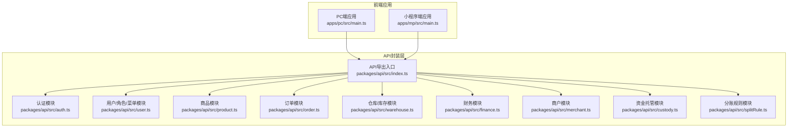
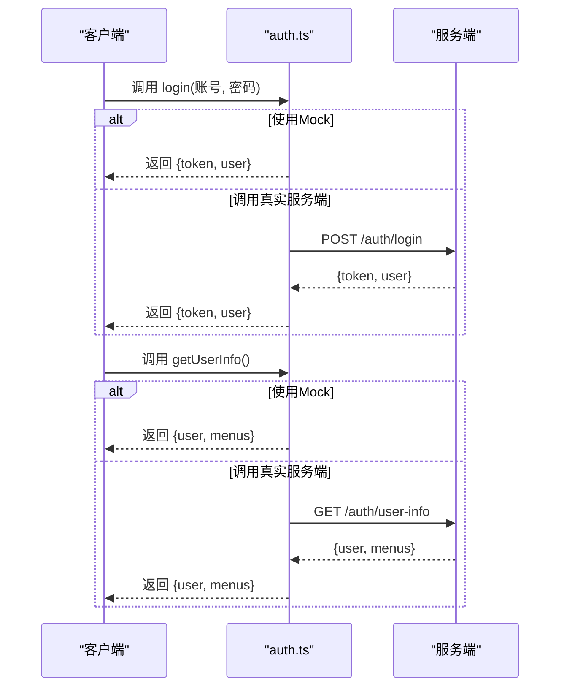
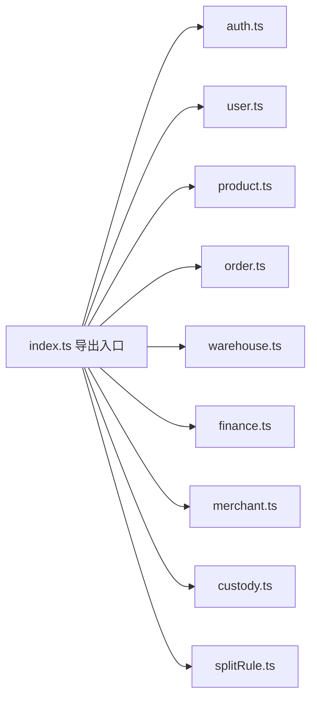

# API接口文档

<cite>
**本文引用的文件**
- [packages/api/src/index.ts](file://packages/api/src/index.ts)
- [packages/api/src/auth.ts](file://packages/api/src/auth.ts)
- [packages/api/src/user.ts](file://packages/api/src/user.ts)
- [packages/api/src/product.ts](file://packages/api/src/product.ts)
- [packages/api/src/order.ts](file://packages/api/src/order.ts)
- [packages/api/src/warehouse.ts](file://packages/api/src/warehouse.ts)
- [packages/api/src/finance.ts](file://packages/api/src/finance.ts)
- [packages/api/src/merchant.ts](file://packages/api/src/merchant.ts)
- [packages/api/src/custody.ts](file://packages/api/src/custody.ts)
- [packages/api/src/splitRule.ts](file://packages/api/src/splitRule.ts)
- [apps/pc/src/main.ts](file://apps/pc/src/main.ts)
- [apps/mp/src/main.ts](file://apps/mp/src/main.ts)
- [package.json](file://package.json)
</cite>

## 目录
1. [简介](#简介)
2. [项目结构](#项目结构)
3. [核心组件](#核心组件)
4. [架构总览](#架构总览)
5. [详细组件分析](#详细组件分析)
6. [依赖关系分析](#依赖关系分析)
7. [性能考虑](#性能考虑)
8. [故障排查指南](#故障排查指南)
9. [结论](#结论)
10. [附录](#附录)

## 简介
本文件为“工程材料管理平台”的完整API接口文档，覆盖用户认证、商品管理、订单管理、库存管理、财务管理、商户管理、资金托管、分账规则等模块。文档基于仓库中的API封装层进行整理，明确各接口的HTTP方法、URL路径、请求参数、响应数据结构、错误码说明，并提供调用示例、参数校验规则、权限控制要求、分页查询规范、测试工具使用指南、接口版本管理策略与性能优化建议。

## 项目结构
该工程采用多包（monorepo）结构，前端应用（PC端与小程序端）通过统一的API包进行后端交互。API包对底层HTTP请求进行了统一封装，便于切换真实服务端或本地Mock。

图表来源
- [apps/pc/src/main.ts:1-19](file://apps/pc/src/main.ts#L1-L19)
- [apps/mp/src/main.ts:1-14](file://apps/mp/src/main.ts#L1-L14)
- [packages/api/src/index.ts:1-11](file://packages/api/src/index.ts#L1-L11)

章节来源
- [apps/pc/src/main.ts:1-19](file://apps/pc/src/main.ts#L1-L19)
- [apps/mp/src/main.ts:1-14](file://apps/mp/src/main.ts#L1-L14)
- [packages/api/src/index.ts:1-11](file://packages/api/src/index.ts#L1-L11)

## 核心组件
- API导出入口：统一导出各模块方法，便于上层按需引入。
- HTTP封装：各模块内部通过通用HTTP工具发起请求，支持GET/POST/PUT/DELETE及分页查询。
- Mock开关：多数模块默认走Mock逻辑，便于开发联调；可切换至真实服务端。

章节来源
- [packages/api/src/index.ts:1-11](file://packages/api/src/index.ts#L1-L11)

## 架构总览
以下序列图展示一次典型登录流程：前端调用登录接口，返回令牌与用户信息，随后可继续获取用户信息与菜单列表。

图表来源
- [packages/api/src/auth.ts:86-121](file://packages/api/src/auth.ts#L86-L121)

## 详细组件分析

### 用户认证接口
- 登录
  - 方法与路径：POST /auth/login
  - 请求体字段：username, password
  - 响应体字段：token, user
  - 错误码：用户名或密码错误
  - 示例：调用 login({ username, password })
- 刷新令牌
  - 方法与路径：POST /auth/refresh
  - 请求体字段：refreshToken
  - 响应体字段：token, user
  - 示例：调用 refreshToken(refreshToken)
- 获取用户信息
  - 方法与路径：GET /auth/user-info
  - 响应体字段：user, menus
  - 示例：调用 getUserInfo()
- 获取验证码
  - 方法与路径：GET /auth/captcha
  - 响应体字段：captcha, captchaKey
  - 示例：调用 getCaptcha()
- 修改密码
  - 方法与路径：POST /auth/change-password
  - 请求体字段：oldPassword, newPassword
  - 示例：调用 changePassword({ oldPassword, newPassword })

章节来源
- [packages/api/src/auth.ts:86-126](file://packages/api/src/auth.ts#L86-L126)

### 用户/角色/菜单管理接口
- 用户列表
  - 方法与路径：POST /user/list
  - 查询参数：page/pageSize, keyword, userType, status, tenantId
  - 响应体字段：list, total, page, pageSize, totalPages
  - 示例：调用 getUserList({ page, pageSize, keyword })
- 用户详情
  - 方法与路径：GET /user/{userId}
  - 路径参数：userId
  - 响应体字段：User
  - 示例：调用 getUserDetail(userId)
- 创建用户
  - 方法与路径：POST /user
  - 请求体字段：CreateUserParams
  - 响应体字段：User
  - 示例：调用 createUser(data)
- 更新用户
  - 方法与路径：POST /user/{userId}
  - 路径参数：userId
  - 请求体字段：UpdateUserParams
  - 示例：调用 updateUser(userId, data)
- 删除用户
  - 方法与路径：POST /user/{userId}/delete
  - 路径参数：userId
  - 示例：调用 deleteUser(userId)
- 重置密码
  - 方法与路径：POST /user/{userId}/reset-password
  - 路径参数：userId
  - 响应体字段：password
  - 示例：调用 resetPassword(userId)
- 更新用户状态
  - 方法与路径：POST /user/{userId}/status
  - 路径参数：userId
  - 请求体字段：status
  - 示例：调用 updateUserStatus(userId, status)

- 角色列表
  - 方法与路径：POST /role/list
  - 查询参数：page/pageSize, keyword, tenantId
  - 响应体字段：list, total, page, pageSize, totalPages
  - 示例：调用 getRoleList({ page, pageSize, keyword })
- 角色详情
  - 方法与路径：GET /role/{roleId}
  - 路径参数：roleId
  - 响应体字段：Role
  - 示例：调用 getRoleDetail(roleId)
- 创建角色
  - 方法与路径：POST /role
  - 请求体字段：CreateRoleParams
  - 响应体字段：Role
  - 示例：调用 createRole(data)
- 更新角色
  - 方法与路径：POST /role/{roleId}
  - 路径参数：roleId
  - 请求体字段：UpdateRoleParams
  - 示例：调用 updateRole(roleId, data)
- 删除角色
  - 方法与路径：POST /role/{roleId}/delete
  - 路径参数：roleId
  - 示例：调用 deleteRole(roleId)
- 获取全部角色
  - 方法与路径：GET /role/all
  - 查询参数：tenantId
  - 响应体字段：Role[]
  - 示例：调用 getAllRoles(tenantId)
- 菜单列表
  - 方法与路径：GET /menu/list
  - 响应体字段：Menu[]
  - 示例：调用 getMenuList()
- 菜单详情
  - 方法与路径：GET /menu/{menuId}
  - 路径参数：menuId
  - 响应体字段：Menu
  - 示例：调用 getMenuDetail(menuId)
- 创建菜单
  - 方法与路径：POST /menu
  - 请求体字段：CreateMenuParams
  - 响应体字段：Menu
  - 示例：调用 createMenu(data)
- 更新菜单
  - 方法与路径：POST /menu/{menuId}
  - 路径参数：menuId
  - 请求体字段：UpdateMenuParams
  - 示例：调用 updateMenu(menuId, data)
- 删除菜单
  - 方法与路径：POST /menu/{menuId}/delete
  - 路径参数：menuId
  - 示例：调用 deleteMenu(menuId)

章节来源
- [packages/api/src/user.ts:26-172](file://packages/api/src/user.ts#L26-L172)

### 商品管理接口
- 商品分类树
  - 方法与路径：GET /product/category/tree
  - 响应体字段：分类树结构
  - 示例：调用 getCategoryTree()
- 分类列表
  - 方法与路径：GET /product/category/list
  - 响应体字段：list, total, page, pageSize, totalPages
  - 示例：调用 getCategoryList()
- 分类详情
  - 方法与路径：GET /product/category/{categoryId}
  - 路径参数：categoryId
  - 响应体字段：ProductCategory
  - 示例：调用 getCategoryDetail(categoryId)
- 创建分类
  - 方法与路径：POST /product/category
  - 请求体字段：CreateCategoryParams
  - 响应体字段：ProductCategory
  - 示例：调用 createCategory(data)
- 更新分类
  - 方法与路径：POST /product/category/{categoryId}
  - 路径参数：categoryId
  - 请求体字段：UpdateCategoryParams
  - 示例：调用 updateCategory(categoryId, data)
- 删除分类
  - 方法与路径：POST /product/category/{categoryId}/delete
  - 路径参数：categoryId
  - 示例：调用 deleteCategory(categoryId)
- 属性列表
  - 方法与路径：GET /product/attr/list
  - 查询参数：page/pageSize, keyword, status
  - 响应体字段：list, total, page, pageSize, totalPages
  - 示例：调用 getAttrList({ page, pageSize, keyword })
- 属性详情
  - 方法与路径：GET /product/attr/{attrId}
  - 路径参数：attrId
  - 响应体字段：ProductAttr
  - 示例：调用 getAttrDetail(attrId)
- 创建属性
  - 方法与路径：POST /product/attr
  - 请求体字段：CreateAttrParams
  - 响应体字段：ProductAttr
  - 示例：调用 createAttr(data)
- 更新属性
  - 方法与路径：POST /product/attr/{attrId}
  - 路径参数：attrId
  - 请求体字段：UpdateAttrParams
  - 示例：调用 updateAttr(attrId, data)
- 删除属性
  - 方法与路径：POST /product/attr/{attrId}/delete
  - 路径参数：attrId
  - 示例：调用 deleteAttr(attrId)
- SPU列表
  - 方法与路径：GET /product/spu/list
  - 查询参数：page/pageSize, keyword, categoryId, status
  - 响应体字段：list, total, page, pageSize, totalPages
  - 示例：调用 getSpuList({ page, pageSize, keyword })
- SPU详情
  - 方法与路径：GET /product/spu/{spuId}
  - 路径参数：spuId
  - 响应体字段：Spu
  - 示例：调用 getSpuDetail(spuId)
- 创建SPU
  - 方法与路径：POST /product/spu
  - 请求体字段：CreateSpuParams
  - 响应体字段：Spu
  - 示例：调用 createSpu(data)
- 更新SPU
  - 方法与路径：POST /product/spu/{spuId}
  - 路径参数：spuId
  - 请求体字段：UpdateSpuParams
  - 示例：调用 updateSpu(spuId, data)
- 删除SPU
  - 方法与路径：POST /product/spu/{spuId}/delete
  - 路径参数：spuId
  - 示例：调用 deleteSpu(spuId)
- SKU列表
  - 方法与路径：GET /product/sku/list
  - 查询参数：page/pageSize, keyword, spuId, categoryId, status
  - 响应体字段：list, total, page, pageSize, totalPages
  - 示例：调用 getSkuList({ page, pageSize, keyword })
- SKU详情
  - 方法与路径：GET /product/sku/{skuId}
  - 路径参数：skuId
  - 响应体字段：Sku
  - 示例：调用 getSkuDetail(skuId)
- 创建SKU
  - 方法与路径：POST /product/sku
  - 请求体字段：CreateSkuParams
  - 响应体字段：Sku
  - 示例：调用 createSku(data)
- 更新SKU
  - 方法与路径：POST /product/sku/{skuId}
  - 路径参数：skuId
  - 请求体字段：UpdateSkuParams
  - 示例：调用 updateSku(skuId, data)
- 删除SKU
  - 方法与路径：POST /product/sku/{skuId}/delete
  - 路径参数：skuId
  - 示例：调用 deleteSku(skuId)
- 批量更新SKU状态
  - 方法与路径：POST /product/sku/batch-status
  - 请求体字段：skuIds[], status
  - 示例：调用 batchUpdateSkuStatus(ids, status)
- 获取SPU下的SKU列表
  - 方法与路径：GET /product/spu/{spuId}/skus
  - 路径参数：spuId
  - 响应体字段：Sku[]
  - 示例：调用 getSkuListBySpu(spuId)
- 商品统计
  - 方法与路径：GET /product/statistics
  - 响应体字段：ProductStatistics
  - 示例：调用 getProductStatistics()
- 操作日志
  - 方法与路径：GET /product/logs
  - 查询参数：page/pageSize, targetType, targetId
  - 响应体字段：list, total, page, pageSize, totalPages
  - 示例：调用 getOperationLogs({ page, pageSize, targetType })
- 异常商品
  - 方法与路径：GET /product/abnormal
  - 查询参数：page/pageSize, abnormalType
  - 响应体字段：list, total, page, pageSize, totalPages
  - 示例：调用 getAbnormalProducts({ page, pageSize, abnormalType })

章节来源
- [packages/api/src/product.ts:52-258](file://packages/api/src/product.ts#L52-L258)

### 订单管理接口
- 订单列表
  - 方法与路径：GET /order/list
  - 查询参数：page/pageSize, keyword, type, status, buyerId, sellerId
  - 响应体字段：list, total, page, pageSize, totalPages
  - 示例：调用 getOrderList({ page, pageSize, keyword })
- 订单详情
  - 方法与路径：GET /order/{id}
  - 路径参数：id
  - 响应体字段：Order
  - 示例：调用 getOrderDetail(id)
- 创建订单
  - 方法与路径：POST /order
  - 请求体字段：Partial<Order>
  - 响应体字段：Order
  - 示例：调用 createOrder(data)
- 更新订单
  - 方法与路径：PUT /order/{id}
  - 路径参数：id
  - 请求体字段：Partial<Order>
  - 示例：调用 updateOrder(id, data)
- 删除订单
  - 方法与路径：DELETE /order/{id}
  - 路径参数：id
  - 示例：调用 deleteOrder(id)
- 确认订单
  - 方法与路径：POST /order/{id}/confirm
  - 路径参数：id
  - 示例：调用 confirmOrder(id)
- 取消订单
  - 方法与路径：POST /order/{id}/cancel
  - 路径参数：id
  - 请求体字段：remark?
  - 示例：调用 cancelOrder(id, remark?)
- 订单支付
  - 方法与路径：POST /order/{id}/pay
  - 路径参数：id
  - 示例：调用 payOrder(id)
- 发货
  - 方法与路径：POST /order/{id}/ship
  - 路径参数：id
  - 请求体字段：expressCompany?, expressNo?
  - 示例：调用 shipOrder(id, { expressCompany, expressNo })
- 收货
  - 方法与路径：POST /order/{id}/receive
  - 路径参数：id
  - 示例：调用 receiveOrder(id)
- 完成订单
  - 方法与路径：POST /order/{id}/complete
  - 路径参数：id
  - 示例：调用 completeOrder(id)

- 采购计划列表
  - 方法与路径：GET /order/purchase-plan/list
  - 查询参数：page/pageSize, keyword, status
  - 响应体字段：list, total, page, pageSize, totalPages
  - 示例：调用 getPurchasePlanList({ page, pageSize, keyword })
- 采购计划详情
  - 方法与路径：GET /order/purchase-plan/{id}
  - 路径参数：id
  - 响应体字段：PurchasePlan
  - 示例：调用 getPurchasePlanDetail(id)
- 创建采购计划
  - 方法与路径：POST /order/purchase-plan
  - 请求体字段：Partial<PurchasePlan>
  - 响应体字段：PurchasePlan
  - 示例：调用 createPurchasePlan(data)
- 更新采购计划
  - 方法与路径：PUT /order/purchase-plan/{id}
  - 路径参数：id
  - 请求体字段：Partial<PurchasePlan>
  - 示例：调用 updatePurchasePlan(id, data)
- 删除采购计划
  - 方法与路径：DELETE /order/purchase-plan/{id}
  - 路径参数：id
  - 示例：调用 deletePurchasePlan(id)
- 提交采购计划
  - 方法与路径：POST /order/purchase-plan/{id}/submit
  - 路径参数：id
  - 示例：调用 submitPurchasePlan(id)
- 审核采购计划
  - 方法与路径：POST /order/purchase-plan/{id}/approve
  - 路径参数：id
  - 请求体字段：approved, remark?
  - 示例：调用 approvePurchasePlan(id, approved, remark?)

章节来源
- [packages/api/src/order.ts:14-156](file://packages/api/src/order.ts#L14-L156)

### 库存管理接口
- 仓库列表
  - 方法与路径：GET /warehouse/list
  - 查询参数：page/pageSize, keyword, status
  - 响应体字段：list, total, page, pageSize, totalPages
  - 示例：调用 getWarehouseList({ page, pageSize, keyword })
- 仓库详情
  - 方法与路径：GET /warehouse/{id}
  - 路径参数：id
  - 响应体字段：Warehouse
  - 示例：调用 getWarehouseDetail(id)
- 创建仓库
  - 方法与路径：POST /warehouse
  - 请求体字段：Partial<Warehouse>
  - 响应体字段：Warehouse
  - 示例：调用 createWarehouse(data)
- 更新仓库
  - 方法与路径：PUT /warehouse/{id}
  - 路径参数：id
  - 请求体字段：Partial<Warehouse>
  - 示例：调用 updateWarehouse(id, data)
- 删除仓库
  - 方法与路径：DELETE /warehouse/{id}
  - 路径参数：id
  - 示例：调用 deleteWarehouse(id)
- 库存列表
  - 方法与路径：GET /warehouse/stock/list
  - 查询参数：page/pageSize, warehouseId, productId, keyword
  - 响应体字段：list, total, page, pageSize, totalPages
  - 示例：调用 getStockList({ page, pageSize, warehouseId })
- 库存详情
  - 方法与路径：GET /warehouse/stock/{id}
  - 路径参数：id
  - 响应体字段：Stock
  - 示例：调用 getStockDetail(id)
- 库存调整
  - 方法与路径：POST /warehouse/stock/{id}/adjust
  - 路径参数：id
  - 请求体字段：quantity, remark?
  - 示例：调用 adjustStock(id, quantity, remark?)
- 入库
  - 方法与路径：POST /warehouse/stock/in
  - 请求体字段：warehouseId, items[{ skuId, quantity }], remark?
  - 示例：调用 stockIn({ warehouseId, items, remark? })
- 出库
  - 方法与路径：POST /warehouse/stock/out
  - 请求体字段：warehouseId, items[{ skuId, quantity }], remark?
  - 示例：调用 stockOut({ warehouseId, items, remark? })
- 转仓
  - 方法与路径：POST /warehouse/stock/transfer
  - 请求体字段：fromWarehouseId, toWarehouseId, items[{ skuId, quantity }], remark?
  - 示例：调用 stockTransfer({ fromWarehouseId, toWarehouseId, items, remark? })
- 库存流水
  - 方法与路径：GET /warehouse/stock-record/list
  - 查询参数：page/pageSize, warehouseId, skuId, type
  - 响应体字段：list, total, page, pageSize, totalPages
  - 示例：调用 getStockRecords({ page, pageSize, warehouseId })

章节来源
- [packages/api/src/warehouse.ts:8-114](file://packages/api/src/warehouse.ts#L8-L114)

### 财务管理接口
- 账户列表
  - 方法与路径：GET /finance/account/list
  - 查询参数：page/pageSize, merchantId
  - 响应体字段：list, total, page, pageSize, totalPages
  - 示例：调用 getAccountList({ page, pageSize, merchantId })
- 账户详情
  - 方法与路径：GET /finance/account/{id}
  - 路径参数：id
  - 响应体字段：Account
  - 示例：调用 getAccountDetail(id)
- 充值
  - 方法与路径：POST /finance/account/recharge
  - 请求体字段：merchantId, amount, remark?
  - 示例：调用 recharge({ merchantId, amount, remark? })
- 提现
  - 方法与路径：POST /finance/account/withdraw
  - 请求体字段：merchantId, amount, bankCardId?, remark?
  - 示例：调用 withdraw({ merchantId, amount, bankCardId?, remark? })
- 交易流水
  - 方法与路径：GET /finance/transaction/list
  - 查询参数：page/pageSize, merchantId, type
  - 响应体字段：list, total, page, pageSize, totalPages
  - 示例：调用 getTransactionList({ page, pageSize, merchantId })
- 分账规则列表
  - 方法与路径：GET /finance/split-rule/list
  - 查询参数：page/pageSize, merchantId
  - 响应体字段：list, total, page, pageSize, totalPages
  - 示例：调用 getSplitRuleList({ page, pageSize, merchantId })
- 分账规则详情
  - 方法与路径：GET /finance/split-rule/{id}
  - 路径参数：id
  - 响应体字段：SplitRule
  - 示例：调用 getSplitRuleDetail(id)
- 新增分账规则
  - 方法与路径：POST /finance/split-rule
  - 请求体字段：Partial<SplitRule>
  - 响应体字段：SplitRule
  - 示例：调用 createSplitRule(data)
- 更新分账规则
  - 方法与路径：POST /finance/split-rule/{id}
  - 路径参数：id
  - 请求体字段：Partial<SplitRule>
  - 示例：调用 updateSplitRule(id, data)
- 删除分账规则
  - 方法与路径：POST /finance/split-rule/{id}/delete
  - 路径参数：id
  - 示例：调用 deleteSplitRule(id)
- 资金托管列表
  - 方法与路径：GET /finance/fund-custody/list
  - 查询参数：page/pageSize, orderId
  - 响应体字段：list, total, page, pageSize, totalPages
  - 示例：调用 getFundCustodyList({ page, pageSize, orderId })
- 释放托管资金
  - 方法与路径：POST /finance/fund-custody/{id}/release
  - 路径参数：id
  - 示例：调用 releaseFundCustody(id)
- 退回托管资金
  - 方法与路径：POST /finance/fund-custody/{id}/refund
  - 路径参数：id
  - 示例：调用 refundFundCustody(id)

章节来源
- [packages/api/src/finance.ts:4-55](file://packages/api/src/finance.ts#L4-L55)

### 商户管理接口
- 商户列表
  - 方法与路径：POST /merchant/list
  - 查询参数：page/pageSize, keyword, tenantType, registrationStatus, enabledStatus
  - 响应体字段：list, total, page, pageSize, totalPages
  - 示例：调用 getMerchantList({ page, pageSize, keyword })
- 商户详情
  - 方法与路径：GET /merchant/{tenantId}
  - 路径参数：tenantId
  - 响应体字段：Merchant
  - 示例：调用 getMerchantDetail(tenantId)
- 创建商户
  - 方法与路径：POST /merchant
  - 请求体字段：MerchantFormData
  - 响应体字段：Merchant
  - 示例：调用 createMerchant(data)
- 更新商户
  - 方法与路径：POST /merchant/{tenantId}
  - 路径参数：tenantId
  - 请求体字段：Partial<MerchantFormData>
  - 示例：调用 updateMerchant(tenantId, data)
- 删除商户
  - 方法与路径：POST /merchant/{tenantId}/delete
  - 路径参数：tenantId
  - 示例：调用 deleteMerchant(tenantId)
- 审核商户
  - 方法与路径：POST /merchant/{tenantId}/audit
  - 路径参数：tenantId
  - 请求体字段：registrationStatus, remark?
  - 示例：调用 auditMerchant(tenantId, registrationStatus, remark?)
- 更新商户状态
  - 方法与路径：POST /merchant/{tenantId}/status
  - 路径参数：tenantId
  - 请求体字段：enabledStatus
  - 示例：调用 updateMerchantStatus(tenantId, enabledStatus)

- 合同列表
  - 方法与路径：POST /merchant/contract/list
  - 查询参数：page/pageSize, tenantId, contractType, status
  - 响应体字段：list, total, page, pageSize, totalPages
  - 示例：调用 getContractList({ page, pageSize, tenantId })
- 合同详情
  - 方法与路径：GET /merchant/contract/{contractId}
  - 路径参数：contractId
  - 响应体字段：Contract
  - 示例：调用 getContractDetail(contractId)
- 新增合同
  - 方法与路径：POST /merchant/{tenantId}/contract
  - 路径参数：tenantId
  - 请求体字段：Omit<Contract, ...>
  - 响应体字段：Contract
  - 示例：调用 createContract(tenantId, data)
- 更新合同
  - 方法与路径：POST /merchant/contract/{contractId}
  - 路径参数：contractId
  - 请求体字段：Partial<Contract>
  - 示例：调用 updateContract(contractId, data)
- 删除合同
  - 方法与路径：POST /merchant/contract/{contractId}/delete
  - 路径参数：contractId
  - 示例：调用 deleteContract(contractId)
- 作废合同
  - 方法与路径：POST /merchant/contract/{contractId}/invalidate
  - 路径参数：contractId
  - 示例：调用 invalidateContract(contractId)

- 资质列表
  - 方法与路径：POST /merchant/qualification/list
  - 查询参数：page/pageSize, tenantId, qualType, status
  - 响应体字段：list, total, page, pageSize, totalPages
  - 示例：调用 getQualificationList({ page, pageSize, tenantId })
- 资质详情
  - 方法与路径：GET /merchant/qualification/{qualId}
  - 路径参数：qualId
  - 响应体字段：Qualification
  - 示例：调用 getQualificationDetail(qualId)
- 新增资质
  - 方法与路径：POST /merchant/{tenantId}/qualification
  - 路径参数：tenantId
  - 请求体字段：Omit<Qualification, ...>
  - 响应体字段：Qualification
  - 示例：调用 createQualification(tenantId, data)
- 更新资质
  - 方法与路径：POST /merchant/qualification/{qualId}
  - 路径参数：qualId
  - 请求体字段：Partial<Qualification>
  - 示例：调用 updateQualification(qualId, data)
- 删除资质
  - 方法与路径：POST /merchant/qualification/{qualId}/delete
  - 路径参数：qualId
  - 示例：调用 deleteQualification(qualId)

章节来源
- [packages/api/src/merchant.ts:16-119](file://packages/api/src/merchant.ts#L16-L119)

### 资金托管接口
- 托管账户列表
  - 方法与路径：POST /custody/account/list
  - 查询参数：page/pageSize, keyword, accountStatus, openStatus, bindCardStatus
  - 响应体字段：list, total, page, pageSize, totalPages
  - 示例：调用 getCustodyAccountList({ page, pageSize, keyword })
- 托管账户详情
  - 方法与路径：GET /custody/account/{accountId}
  - 路径参数：accountId
  - 响应体字段：CustodyAccount
  - 示例：调用 getCustodyAccountDetail(accountId)
- 按租户查询托管账户
  - 方法与路径：GET /custody/account/tenant/{tenantId}
  - 路径参数：tenantId
  - 响应体字段：CustodyAccount
  - 示例：调用 getCustodyAccountByTenant(tenantId)
- 申请开户
  - 方法与路径：POST /custody/account/apply/{tenantId}
  - 路径参数：tenantId
  - 响应体字段：CustodyOpenRecord
  - 示例：调用 applyOpenAccount(tenantId)
- 重试开户
  - 方法与路径：POST /custody/account/retry/{tenantId}
  - 路径参数：tenantId
  - 响应体字段：CustodyOpenRecord
  - 示例：调用 retryOpenAccount(tenantId)
- 同步余额
  - 方法与路径：POST /custody/account/{accountId}/sync
  - 路径参数：accountId
  - 响应体字段：CustodyAccount
  - 示例：调用 syncAccountBalance(accountId)
- 开户申请记录列表
  - 方法与路径：POST /custody/open-record/list
  - 查询参数：page/pageSize, keyword, status, tenantId
  - 响应体字段：list, total, page, pageSize, totalPages
  - 示例：调用 getOpenRecordList({ page, pageSize, keyword })
- 开户申请详情
  - 方法与路径：GET /custody/open-record/{applyId}
  - 路径参数：applyId
  - 响应体字段：CustodyOpenRecord
  - 示例：调用 getOpenRecordDetail(applyId)
- 银行卡列表
  - 方法与路径：POST /custody/bank-card/list
  - 查询参数：page/pageSize, keyword, bindStatus, tenantId
  - 响应体字段：list, total, page, pageSize, totalPages
  - 示例：调用 getBankCardList({ page, pageSize, keyword })
- 银行卡详情
  - 方法与路径：GET /custody/bank-card/{cardId}
  - 路径参数：cardId
  - 响应体字段：CustodyBankCard
  - 示例：调用 getBankCardDetail(cardId)
- 绑定银行卡
  - 方法与路径：POST /custody/bank-card
  - 请求体字段：CustodyBankCardFormData
  - 响应体字段：CustodyBankCard
  - 示例：调用 bindBankCard(data)
- 重新绑定银行卡
  - 方法与路径：POST /custody/bank-card/{cardId}/rebind
  - 路径参数：cardId
  - 请求体字段：Partial<CustodyBankCardFormData>
  - 示例：调用 rebindBankCard(cardId, data)
- 设为默认卡
  - 方法与路径：POST /custody/bank-card/{cardId}/default
  - 路径参数：cardId
  - 示例：调用 setDefaultCard(cardId)
- 解绑银行卡
  - 方法与路径：POST /custody/bank-card/{cardId}/unbind
  - 路径参数：cardId
  - 示例：调用 unbindBankCard(cardId)

章节来源
- [packages/api/src/custody.ts:21-98](file://packages/api/src/custody.ts#L21-L98)

### 分账规则接口
- 分账配置列表
  - 方法与路径：POST /split-config/list
  - 查询参数：page/pageSize, keyword, ruleCategory, status
  - 响应体字段：list, total, page, pageSize, totalPages
  - 示例：调用 getSplitConfigList({ page, pageSize, keyword })
- 分账配置详情
  - 方法与路径：GET /split-config/{ruleId}
  - 路径参数：ruleId
  - 响应体字段：SplitRule
  - 示例：调用 getSplitConfigDetail(ruleId)
- 新增分账配置
  - 方法与路径：POST /split-config
  - 请求体字段：CreateSplitRuleParams
  - 响应体字段：SplitRule
  - 示例：调用 createSplitConfig(data)
- 更新分账配置
  - 方法与路径：POST /split-config/{ruleId}
  - 路径参数：ruleId
  - 请求体字段：UpdateSplitRuleParams
  - 示例：调用 updateSplitConfig(ruleId, data)
- 删除分账配置
  - 方法与路径：POST /split-config/{ruleId}/delete
  - 路径参数：ruleId
  - 示例：调用 deleteSplitConfig(ruleId)
- 提交审核
  - 方法与路径：POST /split-config/{ruleId}/submit-audit
  - 路径参数：ruleId
  - 示例：调用 submitSplitConfigAudit(ruleId)
- 审核
  - 方法与路径：POST /split-config/{ruleId}/audit
  - 路径参数：ruleId
  - 请求体字段：approved, remark?
  - 示例：调用 auditSplitConfig(ruleId, approved, remark?)
- 启用
  - 方法与路径：POST /split-config/{ruleId}/enable
  - 路径参数：ruleId
  - 示例：调用 enableSplitConfig(ruleId)
- 停用
  - 方法与路径：POST /split-config/{ruleId}/disable
  - 路径参数：ruleId
  - 示例：调用 disableSplitConfig(ruleId)
- 分账配置日志
  - 方法与路径：GET /split-config/{ruleId}/logs
  - 路径参数：ruleId
  - 响应体字段：SplitRuleLog[]
  - 示例：调用 getSplitConfigLogs(ruleId)
- 按SPU查询分账规则
  - 方法与路径：GET /split-config/by-spu/{spuId}
  - 路径参数：spuId
  - 响应体字段：SplitRule[]
  - 示例：调用 getSplitRulesBySpuId(spuId)
- 按SKU查询分账规则
  - 方法与路径：GET /split-config/by-sku/{skuId}
  - 路径参数：skuId
  - 响应体字段：SplitRule[]
  - 示例：调用 getSplitRulesBySkuId(skuId)

章节来源
- [packages/api/src/splitRule.ts:29-132](file://packages/api/src/splitRule.ts#L29-L132)

## 依赖关系分析
- 模块导出：API入口统一导出各模块方法，便于上层按需引入。
- HTTP封装：各模块内部通过通用HTTP工具发起请求，支持GET/POST/PUT/DELETE及分页查询。
- Mock开关：多数模块默认走Mock逻辑，便于开发联调；可切换至真实服务端。

图表来源
- [packages/api/src/index.ts:1-11](file://packages/api/src/index.ts#L1-L11)

章节来源
- [packages/api/src/index.ts:1-11](file://packages/api/src/index.ts#L1-L11)

## 性能考虑
- 分页查询：统一使用 page/pageSize 参数，避免一次性加载过多数据。
- Mock与真实服务端切换：在开发阶段优先使用Mock，减少网络开销；生产环境切换到真实服务端。
- 批量操作：如批量更新SKU状态，建议合并请求以减少网络往返。
- 缓存策略：对于只读列表接口，可在前端实现基础缓存，避免重复请求。
- 错误处理：对常见错误（如用户不存在、资源不存在）进行快速失败，减少无效请求。

## 故障排查指南
- 登录失败
  - 现象：用户名或密码错误
  - 处理：检查账号密码是否正确，确认Mock开关状态
- 资源不存在
  - 现象：返回“资源不存在”或“用户不存在”
  - 处理：确认ID是否正确，检查Mock数据是否存在
- 状态更新失败
  - 现象：状态更新失败
  - 处理：确认当前状态允许的操作，检查权限
- 分页异常
  - 现象：分页结果不正确
  - 处理：检查 page/pageSize 是否合理，确认后端分页逻辑

章节来源
- [packages/api/src/auth.ts:89-90](file://packages/api/src/auth.ts#L89-L90)
- [packages/api/src/user.ts:36-37](file://packages/api/src/user.ts#L36-L37)
- [packages/api/src/product.ts:69-70](file://packages/api/src/product.ts#L69-L70)
- [packages/api/src/order.ts:24-25](file://packages/api/src/order.ts#L24-L25)
- [packages/api/src/warehouse.ts:18-19](file://packages/api/src/warehouse.ts#L18-L19)

## 结论
本API文档覆盖了工程材料管理平台的主要业务模块，明确了各接口的HTTP方法、URL路径、请求参数、响应结构与错误处理方式。通过统一的API封装与Mock机制，开发者可以快速集成并进行联调测试。建议在生产环境中切换至真实服务端，并结合分页查询与缓存策略提升性能。

## 附录
- 接口调用示例
  - 登录：调用 login({ username, password })
  - 获取用户信息：调用 getUserInfo()
  - 商品列表：调用 getSpuList({ page, pageSize, keyword })
  - 订单列表：调用 getOrderList({ page, pageSize, keyword })
  - 库存列表：调用 getStockList({ page, pageSize, warehouseId })
  - 账户列表：调用 getAccountList({ page, pageSize, merchantId })
  - 商户列表：调用 getMerchantList({ page, pageSize, keyword })
  - 托管账户列表：调用 getCustodyAccountList({ page, pageSize, keyword })
  - 分账配置列表：调用 getSplitConfigList({ page, pageSize, keyword })
- 参数验证规则
  - 必填字段：根据各接口请求体定义
  - 数值范围：如金额、数量等需大于等于0
  - 字符串长度：如账号、密码等遵循最小/最大长度限制
- 权限控制要求
  - 不同用户类型（平台、租户管理员、仓库管理员等）具备不同权限集合
  - 某些接口仅限特定角色访问
- 分页查询规范
  - page：页码，从1开始
  - pageSize：每页条数，建议10/20/50
  - total：总数
  - totalPages：总页数
- API测试工具使用指南
  - 建议使用Postman或类似的HTTP客户端进行接口测试
  - 在测试前先调用登录接口获取token，并在后续请求中携带
  - 对于Mock模式，直接调用对应API函数即可；对于真实服务端，需配置正确的后端地址
- 接口版本管理策略
  - 当前API未显式声明版本号，建议在URL中加入版本前缀（如 /v1/...），以便未来演进
- 性能优化建议
  - 合理使用分页，避免大数据量一次性返回
  - 对高频只读接口增加前端缓存
  - 批量操作合并请求，减少网络往返
  - 对Mock与真实服务端进行明确区分，避免误用