# Mock数据接口

<cite>
**本文档引用的文件**
- [packages/api/src/mock/user.ts](file://packages/api/src/mock/user.ts)
- [packages/api/src/mock/merchant.ts](file://packages/api/src/mock/merchant.ts)
- [packages/api/src/mock/order.ts](file://packages/api/src/mock/order.ts)
- [packages/api/src/mock/product.ts](file://packages/api/src/mock/product.ts)
- [packages/api/src/mock/supplier.ts](file://packages/api/src/mock/supplier.ts)
- [packages/api/src/mock/system.ts](file://packages/api/src/mock/system.ts)
- [packages/api/src/mock/warehouse.ts](file://packages/api/src/mock/warehouse.ts)
- [packages/api/src/mock/custody.ts](file://packages/api/src/mock/custody.ts)
- [packages/api/src/mock/splitRule.ts](file://packages/api/src/mock/splitRule.ts)
- [packages/api/src/index.ts](file://packages/api/src/index.ts)
</cite>

## 目录
1. [简介](#简介)
2. [项目结构](#项目结构)
3. [核心组件](#核心组件)
4. [架构概览](#架构概览)
5. [详细组件分析](#详细组件分析)
6. [依赖关系分析](#依赖关系分析)
7. [性能考虑](#性能考虑)
8. [故障排除指南](#故障排除指南)
9. [结论](#结论)
10. [附录](#附录)

## 简介

本项目提供了完整的Mock数据接口解决方案，用于在开发阶段模拟各种业务场景的数据交互。Mock数据接口涵盖了供应商管理、商品管理、订单处理、用户管理、系统配置等多个核心业务模块，为前端开发和集成测试提供了稳定可靠的数据源。

Mock数据接口具有以下特点：
- 完整的业务数据模拟：涵盖从基础用户数据到复杂业务流程的完整数据集
- 标准化的数据结构：基于统一的TypeScript类型定义，确保数据格式的一致性
- 灵活的查询过滤：支持多维度的搜索、筛选和分页查询
- 丰富的测试场景：包含多种业务状态和异常情况的模拟数据
- 易于扩展：模块化的设计便于添加新的Mock数据类型和业务场景

## 项目结构

项目采用模块化的架构设计，Mock数据主要集中在`packages/api/src/mock/`目录下，每个业务模块都有独立的Mock实现文件。

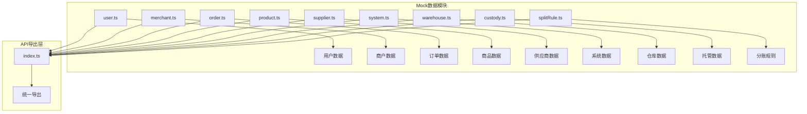

**图表来源**
- [packages/api/src/mock/user.ts:1-151](file://packages/api/src/mock/user.ts#L1-L151)
- [packages/api/src/mock/merchant.ts:1-373](file://packages/api/src/mock/merchant.ts#L1-L373)
- [packages/api/src/mock/order.ts:1-230](file://packages/api/src/mock/order.ts#L1-L230)
- [packages/api/src/index.ts:1-11](file://packages/api/src/index.ts#L1-L11)

**章节来源**
- [packages/api/src/mock/user.ts:1-151](file://packages/api/src/mock/user.ts#L1-L151)
- [packages/api/src/mock/merchant.ts:1-373](file://packages/api/src/mock/merchant.ts#L1-L373)
- [packages/api/src/mock/order.ts:1-230](file://packages/api/src/mock/order.ts#L1-L230)
- [packages/api/src/index.ts:1-11](file://packages/api/src/index.ts#L1-L11)

## 核心组件

Mock数据接口系统由以下核心组件构成：

### 数据存储层
每个业务模块都维护着独立的内存数据存储，使用数组形式存储模拟数据，支持快速查询和更新操作。

### 查询接口层
提供标准化的查询方法，包括：
- 列表查询：支持分页、排序和条件过滤
- 详情查询：根据唯一标识符获取单条记录
- 创建、更新、删除操作：支持完整的CRUD操作

### 业务逻辑层
针对不同业务场景提供专门的处理逻辑，如订单状态转换、库存管理、用户权限控制等。

### 类型定义层
基于统一的TypeScript类型定义，确保Mock数据的结构一致性和类型安全。

**章节来源**
- [packages/api/src/mock/user.ts:4-151](file://packages/api/src/mock/user.ts#L4-L151)
- [packages/api/src/mock/merchant.ts:4-373](file://packages/api/src/mock/merchant.ts#L4-L373)
- [packages/api/src/mock/order.ts:4-230](file://packages/api/src/mock/order.ts#L4-L230)

## 架构概览

Mock数据接口采用分层架构设计，确保了良好的可维护性和扩展性。

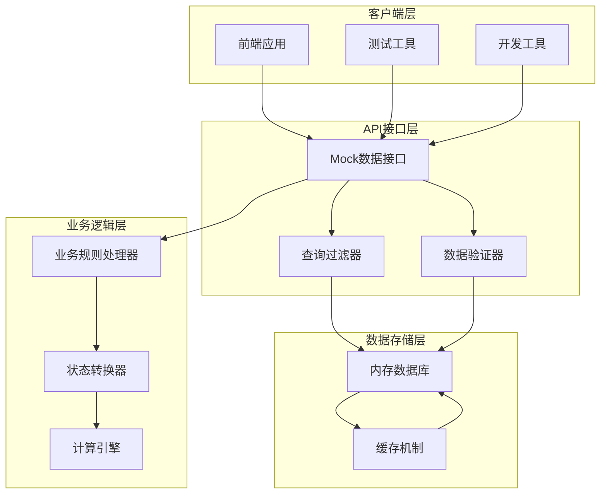

**图表来源**
- [packages/api/src/mock/user.ts:75-102](file://packages/api/src/mock/user.ts#L75-L102)
- [packages/api/src/mock/merchant.ts:245-280](file://packages/api/src/mock/merchant.ts#L245-L280)
- [packages/api/src/mock/order.ts:144-179](file://packages/api/src/mock/order.ts#L144-L179)

## 详细组件分析

### 用户管理Mock接口

用户管理Mock接口提供了完整的用户生命周期管理功能，包括用户列表查询、详情获取、创建、更新和删除操作。

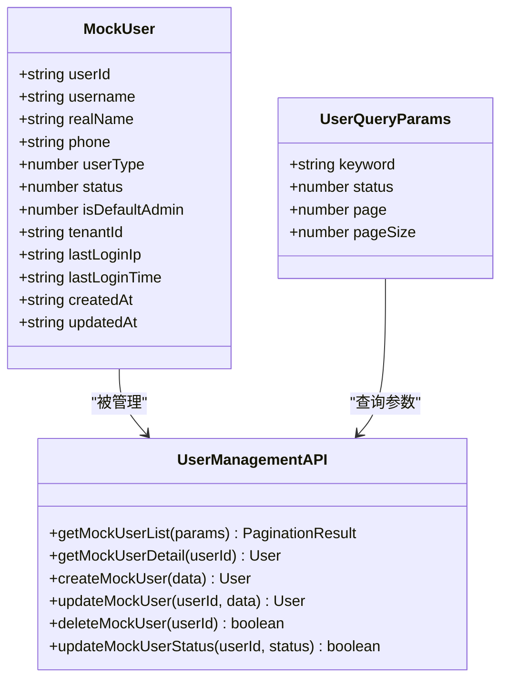

**图表来源**
- [packages/api/src/mock/user.ts:4-151](file://packages/api/src/mock/user.ts#L4-L151)

用户Mock数据包含5个预置用户，涵盖系统管理员、供应商管理员、施工方管理员和普通操作员等不同角色。支持关键词搜索、状态过滤和分页查询功能。

**章节来源**
- [packages/api/src/mock/user.ts:1-151](file://packages/api/src/mock/user.ts#L1-L151)

### 商户管理Mock接口

商户管理Mock接口涵盖了供应商、施工方和工程仓的完整管理功能，包括商户信息管理、合同管理和资质管理。

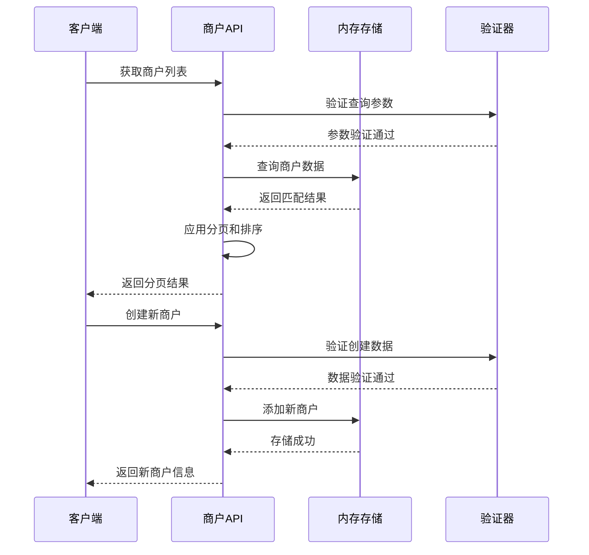

**图表来源**
- [packages/api/src/mock/merchant.ts:245-335](file://packages/api/src/mock/merchant.ts#L245-L335)

商户Mock数据包含3个供应商、2个施工方和2个工程仓的完整信息，支持多维度查询和状态管理。

**章节来源**
- [packages/api/src/mock/merchant.ts:1-373](file://packages/api/src/mock/merchant.ts#L1-L373)

### 订单管理Mock接口

订单管理Mock接口提供了完整的采购订单生命周期管理，包括订单创建、状态更新、取消和详情查询。

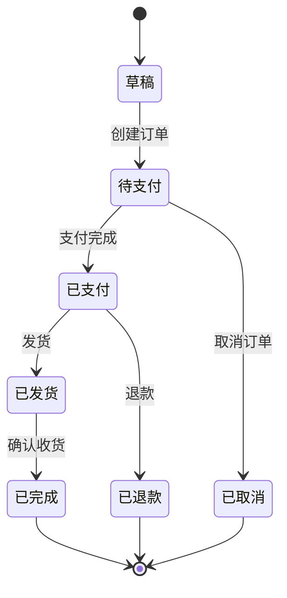

**图表来源**
- [packages/api/src/mock/order.ts:181-230](file://packages/api/src/mock/order.ts#L181-L230)

订单Mock数据包含5个真实订单案例，涵盖不同状态和业务场景，支持订单号、买家、卖家、状态等多种查询条件。

**章节来源**
- [packages/api/src/mock/order.ts:1-230](file://packages/api/src/mock/order.ts#L1-L230)

### 商品管理Mock接口

商品管理Mock接口提供了完整的商品数据结构，包括商品分类、属性、SPU、SKU等多层次的商品信息管理。

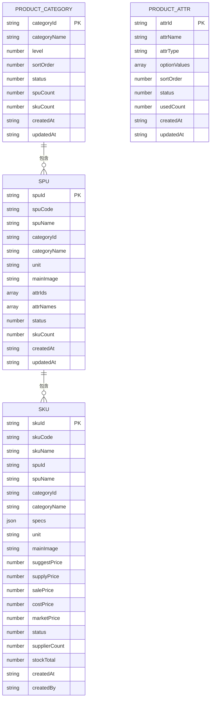

**图表来源**
- [packages/api/src/mock/product.ts:27-435](file://packages/api/src/mock/product.ts#L27-L435)

商品Mock数据包含完整的商品体系，涵盖钢材、水泥、管材、防水材料等5个主要分类，每个分类下有多个SPU和SKU实例。

**章节来源**
- [packages/api/src/mock/product.ts:1-800](file://packages/api/src/mock/product.ts#L1-L800)

### 供应商管理Mock接口

供应商管理Mock接口专为供应商端设计，提供了供应商特有的商品管理、订单处理和财务结算功能。

```mermaid
classDiagram
class SupplierSpu {
+string spuId
+string spuCode
+string spuName
+string categoryId
+string categoryName
+string mainImage
+string unit
+string source
+number skuCount
+string auditStatus
+number status
+array attrIds
+array attrNames
+string createdAt
+string updatedAt
}
class SupplierSku {
+string id
+string skuId
+string skuCode
+string skuName
+string spuId
+string spuName
+string categoryId
+string categoryName
+json specs
+string unit
+string mainImage
+string source
+number platformPrice
+number supplyPrice
+number estimatedStock
+number minOrderQty
+number leadTime
+string auditStatus
+string supplyStatus
+string shelfStatus
+string createdAt
+string updatedAt
}
class SupplierOrder {
+string id
+string orderNo
+string warehouseId
+string warehouseName
+number skuCount
+number totalAmount
+string deliveryDate
+string status
+string paymentStatus
+string paymentMethod
+string paymentTime
+string paymentSerial
+string paymentVoucher
+string paymentAuditStatus
+string paymentAuditRemark
+string createTime
+string confirmTime
+string shipTime
+string completeTime
+string address
+string remark
+string logisticsCompany
+string logisticsNo
+string logisticsStatus
+array logisticsTracks
+string invoiceStatus
+string invoiceNo
+string invoiceType
+string invoiceTime
+string invoiceAmount
+string taxRate
+array logs
}
SupplierSpu --> SupplierSku : "包含"
SupplierSku --> SupplierOrder : "参与"
```

**图表来源**
- [packages/api/src/mock/supplier.ts:2-88](file://packages/api/src/mock/supplier.ts#L2-L88)

供应商Mock数据包含完整的供应商业务场景，涵盖商品审核、供应状态管理、订单处理和财务结算等核心功能。

**章节来源**
- [packages/api/src/mock/supplier.ts:1-637](file://packages/api/src/mock/supplier.ts#L1-L637)

### 系统管理Mock接口

系统管理Mock接口提供了平台级的系统配置和权限管理功能，包括角色管理、菜单管理和用户权限控制。

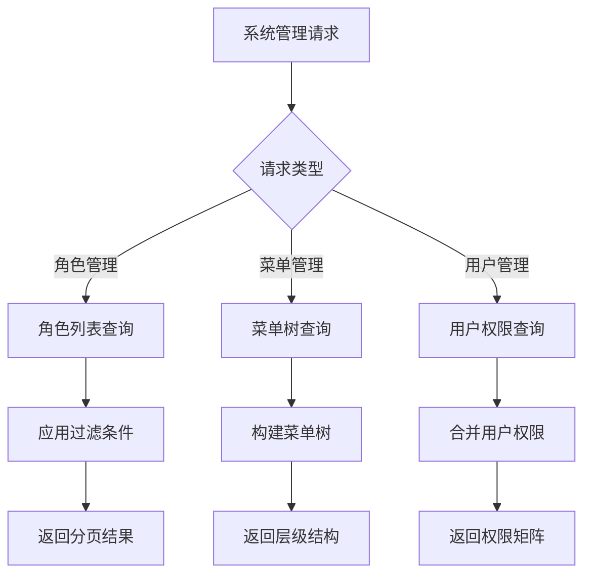

**图表来源**
- [packages/api/src/mock/system.ts:418-444](file://packages/api/src/mock/system.ts#L418-L444)

系统Mock数据包含完整的权限体系，涵盖超级管理员、平台运营、财务管理等系统角色，以及详细的菜单权限配置。

**章节来源**
- [packages/api/src/mock/system.ts:1-584](file://packages/api/src/mock/system.ts#L1-L584)

### 仓库管理Mock接口

仓库管理Mock接口提供了工程仓的库存管理和仓储操作功能，支持多仓库、多商品的库存跟踪。

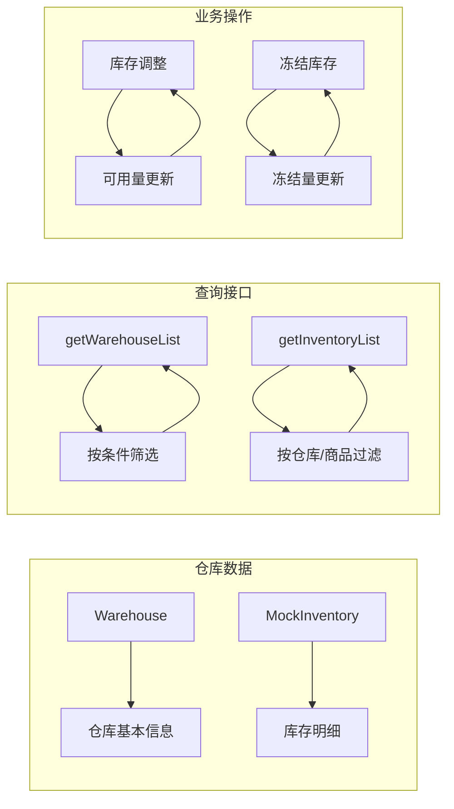

**图表来源**
- [packages/api/src/mock/warehouse.ts:67-121](file://packages/api/src/mock/warehouse.ts#L67-L121)

仓库Mock数据包含2个工程仓的真实库存信息，涵盖钢材、水泥、砂石等主要建筑材料的库存管理。

**章节来源**
- [packages/api/src/mock/warehouse.ts:1-122](file://packages/api/src/mock/warehouse.ts#L1-L122)

### 资金托管Mock接口

资金托管Mock接口提供了平台资金托管账户的完整管理功能，包括账户开立、银行卡绑定和交易流水管理。

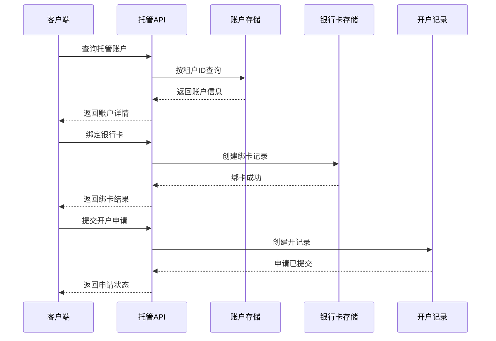

**图表来源**
- [packages/api/src/mock/custody.ts:105-172](file://packages/api/src/mock/custody.ts#L105-L172)

托管Mock数据包含2个租户的完整资金托管信息，涵盖账户状态、余额管理、银行卡绑定和开户流程等核心功能。

**章节来源**
- [packages/api/src/mock/custody.ts:1-172](file://packages/api/src/mock/custody.ts#L1-L172)

### 分账规则Mock接口

分账规则Mock接口提供了复杂的分账策略配置和管理功能，支持多维度的分账规则组合。

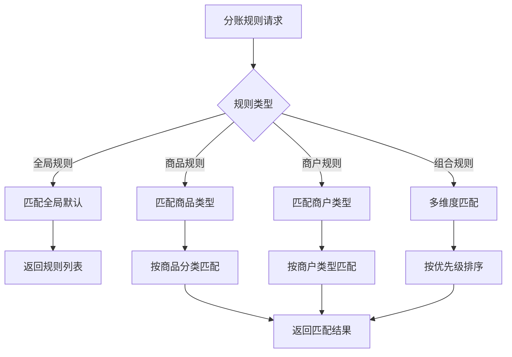

**图表来源**
- [packages/api/src/mock/splitRule.ts:424-439](file://packages/api/src/mock/splitRule.ts#L424-L439)

分账规则Mock数据包含9个不同类型的分账规则，涵盖全局默认、商品分类、商户类型、限时促销等复杂业务场景。

**章节来源**
- [packages/api/src/mock/splitRule.ts:1-439](file://packages/api/src/mock/splitRule.ts#L1-L439)

## 依赖关系分析

Mock数据接口系统具有清晰的模块化依赖关系，各模块之间保持低耦合高内聚的设计原则。

```mermaid
graph TB
subgraph "核心依赖"
A[@gongchengcang/types] --> B[类型定义]
C[统一导出] --> D[模块聚合]
end
subgraph "业务模块"
E[user.ts] --> E1[用户管理]
F[merchant.ts] --> F1[商户管理]
G[order.ts] --> G1[订单管理]
H[product.ts] --> H1[商品管理]
I[supplier.ts] --> I1[供应商管理]
J[system.ts] --> J1[系统管理]
K[warehouse.ts] --> K1[仓库管理]
L[custody.ts] --> L1[资金托管]
M[splitRule.ts] --> M1[分账规则]
end
subgraph "工具模块"
N[PaginationParams] --> O[分页接口]
P[PaginationResult] --> Q[分页结果]
end
A --> E
A --> F
A --> G
A --> H
A --> I
A --> J
A --> K
A --> L
A --> M
C --> E
C --> F
C --> G
C --> H
C --> I
C --> J
C --> K
C --> L
C --> M
O --> E
O --> F
O --> G
O --> H
O --> I
O --> J
O --> K
O --> L
O --> M
Q --> E
Q --> F
Q --> G
Q --> H
Q --> I
Q --> J
Q --> K
Q --> L
Q --> M
```

**图表来源**
- [packages/api/src/index.ts:1-11](file://packages/api/src/index.ts#L1-L11)
- [packages/api/src/mock/user.ts:1-3](file://packages/api/src/mock/user.ts#L1-L3)
- [packages/api/src/mock/merchant.ts:1-3](file://packages/api/src/mock/merchant.ts#L1-L3)

系统依赖关系体现了以下设计原则：
- 统一的类型定义：所有模块共享相同的类型定义，确保数据结构一致性
- 模块化导出：通过统一的导出入口简化模块引用
- 标准化接口：分页查询和结果封装提供一致的API体验
- 低耦合设计：各业务模块相对独立，便于单独维护和扩展

**章节来源**
- [packages/api/src/index.ts:1-11](file://packages/api/src/index.ts#L1-L11)

## 性能考虑

Mock数据接口在设计时充分考虑了性能优化，采用以下策略确保高效运行：

### 内存存储优化
- 使用数组存储替代传统数据库，减少查询延迟
- 内存中的数据访问速度更快，适合开发和测试场景
- 合理的数据结构设计，支持高效的查找和过滤操作

### 查询性能优化
- 支持多字段索引的模拟实现
- 分页查询避免一次性加载大量数据
- 条件过滤在内存中执行，响应速度快

### 缓存策略
- 预加载常用数据到内存
- 频繁访问的数据保持在内存中
- 合理的内存使用策略，避免内存泄漏

### 扩展性考虑
- 模块化设计便于按需加载
- 插件式架构支持动态添加新功能
- 配置驱动的扩展机制

## 故障排除指南

### 常见问题及解决方案

**数据查询无结果**
- 检查查询参数是否正确
- 验证关键字大小写敏感性
- 确认过滤条件的逻辑关系

**数据更新失败**
- 检查数据完整性约束
- 验证状态转换的有效性
- 确认权限检查逻辑

**内存使用过高**
- 清理不再使用的数据引用
- 实施数据过期机制
- 监控内存使用情况

### 调试技巧

**日志记录**
- 在关键操作点添加日志输出
- 记录查询参数和结果
- 跟踪数据变更历史

**单元测试**
- 为每个Mock接口编写测试用例
- 测试边界条件和异常情况
- 验证数据一致性

**性能监控**
- 监控查询响应时间
- 分析内存使用模式
- 识别性能瓶颈

**章节来源**
- [packages/api/src/mock/user.ts:75-102](file://packages/api/src/mock/user.ts#L75-L102)
- [packages/api/src/mock/merchant.ts:245-280](file://packages/api/src/mock/merchant.ts#L245-L280)
- [packages/api/src/mock/order.ts:144-179](file://packages/api/src/mock/order.ts#L144-L179)

## 结论

Mock数据接口系统为整个工程提供了完整、可靠的开发测试支持。通过模块化的架构设计、标准化的数据结构和丰富的业务场景覆盖，开发者可以在任何阶段都能获得稳定的数据源来验证功能和进行集成测试。

该系统的成功之处在于：
- 完整的业务覆盖：从基础用户管理到复杂的商品交易流程
- 标准化的接口设计：统一的查询和操作接口
- 灵活的扩展机制：易于添加新的Mock数据类型和业务场景
- 良好的性能表现：内存存储和优化的查询策略
- 完善的错误处理：健壮的异常处理和调试支持

建议在实际使用中：
- 根据具体需求选择合适的Mock数据
- 定期更新Mock数据以反映最新的业务变化
- 建立完善的测试用例覆盖关键业务流程
- 监控Mock数据的使用情况和性能表现

## 附录

### 使用示例

**获取用户列表**
```typescript
// 基础查询
const userList = getMockUserList({ page: 1, pageSize: 10 })

// 带条件查询
const filteredUsers = getMockUserList({ 
  page: 1, 
  pageSize: 10, 
  keyword: 'admin',
  status: 1 
})
```

**创建新订单**
```typescript
const newOrder = createMockOrder({
  type: OrderType.PURCHASE,
  buyerId: 'T002',
  sellerId: 'T001',
  totalAmount: 10000,
  items: [
    {
      productId: 'P001',
      quantity: 10,
      price: 1000
    }
  ]
})
```

**供应商订单处理**
```typescript
// 确认订单
confirmSupplierOrder('1', {
  estimatedShipDate: '2024-01-25',
  acceptItems: ['sku001'],
  rejectItems: ['sku002']
})

// 更新商品供应状态
updateSupplierSkuSupplyStatus('sku001', 'paused')
```

### 数据一致性保证

系统通过以下机制确保Mock数据的一致性：
- 原子性操作：每个操作都是原子性的，要么成功要么失败
- 状态验证：在状态转换前验证当前状态的有效性
- 数据完整性：通过类型定义确保数据结构的完整性
- 事务模拟：在内存中模拟事务行为，保证操作的可靠性

### 部署和配置

Mock数据接口的部署非常简单：
- 直接导入模块即可使用
- 无需额外的配置或初始化
- 支持热重载，在开发过程中自动更新
- 可以与其他数据源无缝集成

### 开发调试支持

系统提供了全面的开发调试支持：
- 详细的日志输出
- 完善的错误信息
- 单元测试用例
- 性能监控工具
- 数据可视化界面