# 仓库管理接口

<cite>
**本文档引用的文件**
- [packages/api/src/warehouse.ts](file://packages/api/src/warehouse.ts)
- [packages/types/src/warehouse.ts](file://packages/types/src/warehouse.ts)
- [packages/api/src/mock/warehouse.ts](file://packages/api/src/mock/warehouse.ts)
- [apps/pc/src/views/warehouse/stock/in/index.vue](file://apps/pc/src/views/warehouse/stock/in/index.vue)
- [apps/pc/src/views/warehouse/stock/out/index.vue](file://apps/pc/src/views/warehouse/stock/out/index.vue)
- [apps/pc/src/views/warehouse/stock/check/index.vue](file://apps/pc/src/views/warehouse/stock/check/index.vue)
- [apps/pc/src/views/warehouse/stock/check/detail.vue](file://apps/pc/src/views/warehouse/stock/check/detail.vue)
- [apps/pc/src/views/warehouse/stock/transfer.vue](file://apps/pc/src/views/warehouse/stock/transfer.vue)
- [apps/pc/src/views/warehouse/warehouse/list/index.vue](file://apps/pc/src/views/warehouse/warehouse/list/index.vue)
- [apps/pc/src/views/stock/detail/index.vue](file://apps/pc/src/views/stock/detail/index.vue)
- [apps/pc/src/views/market/stock/index.vue](file://apps/pc/src/views/market/stock/index.vue)
- [apps/pc/src/views/warehouse/stock/batch/index.vue](file://apps/pc/src/views/warehouse/stock/batch/index.vue)
- [docs/PRD/03-数据模型与表结构.md](file://docs/PRD/03-数据模型与表结构.md)
</cite>

## 目录
1. [简介](#简介)
2. [项目结构](#项目结构)
3. [核心组件](#核心组件)
4. [架构概览](#架构概览)
5. [详细组件分析](#详细组件分析)
6. [依赖关系分析](#依赖关系分析)
7. [性能考虑](#性能考虑)
8. [故障排除指南](#故障排除指南)
9. [结论](#结论)

## 简介

本项目是一个完整的仓库管理系统，提供了全面的库存管理功能。系统支持多仓库管理、批次管理、库存预警、安全库存设置等功能，涵盖了现代仓储管理的核心需求。

## 项目结构

项目采用前后端分离架构，主要分为以下几个部分：

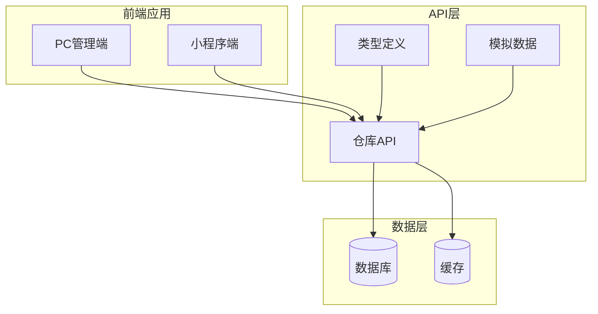

**图表来源**
- [packages/api/src/warehouse.ts:1-113](file://packages/api/src/warehouse.ts#L1-L113)
- [packages/types/src/warehouse.ts:1-112](file://packages/types/src/warehouse.ts#L1-L112)

**章节来源**
- [packages/api/src/warehouse.ts:1-113](file://packages/api/src/warehouse.ts#L1-L113)
- [packages/types/src/warehouse.ts:1-112](file://packages/types/src/warehouse.ts#L1-L112)

## 核心组件

### 仓库管理模块

仓库管理是整个系统的基础模块，负责管理所有仓库信息和基本配置。

**章节来源**
- [packages/api/src/warehouse.ts:8-34](file://packages/api/src/warehouse.ts#L8-L34)
- [packages/types/src/warehouse.ts:1-31](file://packages/types/src/warehouse.ts#L1-L31)

### 库存管理模块

库存管理模块提供完整的库存查询、调整、出入库等功能。

**章节来源**
- [packages/api/src/warehouse.ts:36-63](file://packages/api/src/warehouse.ts#L36-L63)
- [packages/types/src/warehouse.ts:72-85](file://packages/types/src/warehouse.ts#L72-L85)

### 批次管理模块

批次管理支持精细化的库存追踪，每个批次都有独立的属性和有效期管理。

**章节来源**
- [packages/types/src/warehouse.ts:87-111](file://packages/types/src/warehouse.ts#L87-L111)
- [docs/PRD/03-数据模型与表结构.md:576-590](file://docs/PRD/03-数据模型与表结构.md#L576-L590)

## 架构概览

系统采用分层架构设计，确保各模块职责清晰、耦合度低：

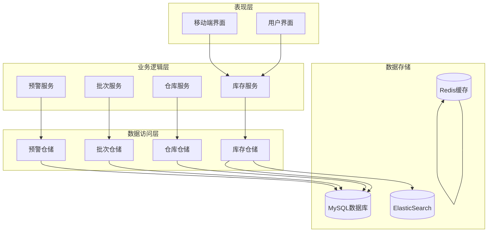

**图表来源**
- [packages/api/src/warehouse.ts:1-113](file://packages/api/src/warehouse.ts#L1-L113)
- [packages/types/src/warehouse.ts:1-112](file://packages/types/src/warehouse.ts#L1-L112)

## 详细组件分析

### 仓库管理接口

#### 仓库列表查询
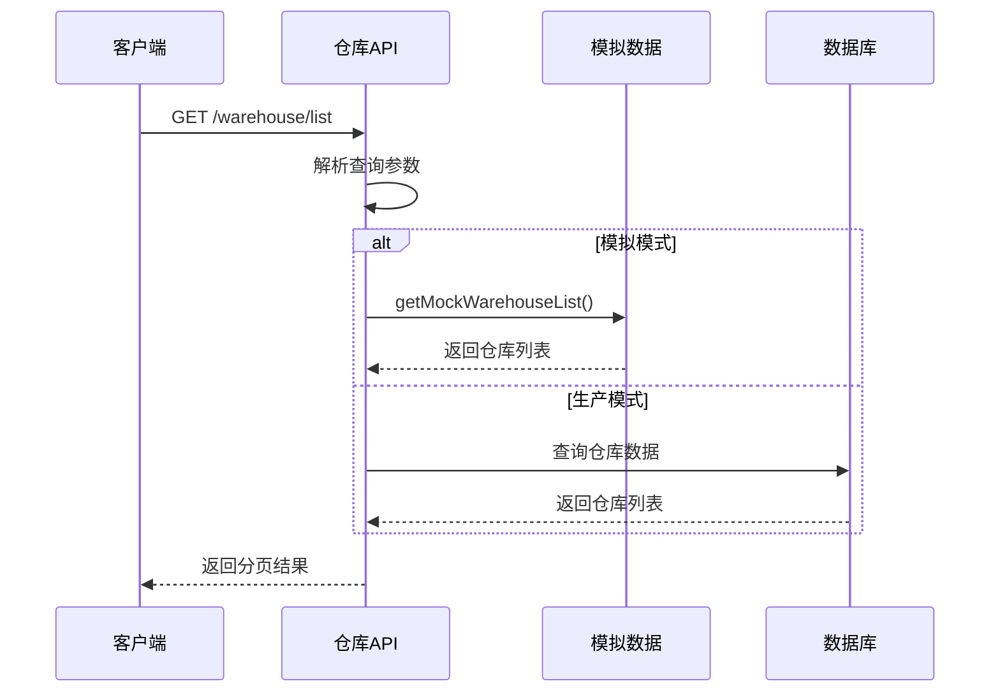

**图表来源**
- [packages/api/src/warehouse.ts:8-13](file://packages/api/src/warehouse.ts#L8-L13)
- [packages/api/src/mock/warehouse.ts:67-93](file://packages/api/src/mock/warehouse.ts#L67-L93)

#### 仓库详情查询
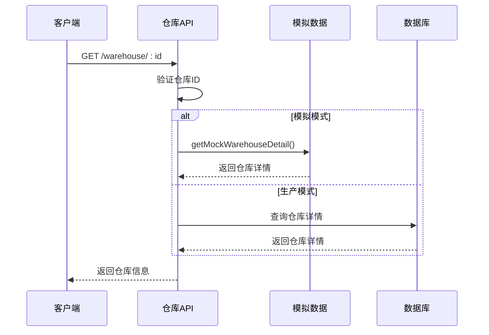

**图表来源**
- [packages/api/src/warehouse.ts:15-22](file://packages/api/src/warehouse.ts#L15-L22)
- [packages/api/src/mock/warehouse.ts:95-97](file://packages/api/src/mock/warehouse.ts#L95-L97)

**章节来源**
- [packages/api/src/warehouse.ts:8-34](file://packages/api/src/warehouse.ts#L8-L34)
- [packages/api/src/mock/warehouse.ts:1-122](file://packages/api/src/mock/warehouse.ts#L1-L122)

### 库存管理接口

#### 库存列表查询
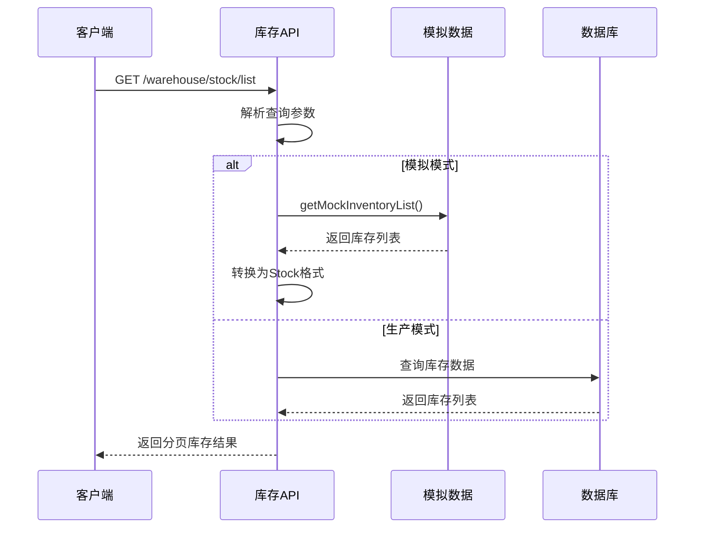

**图表来源**
- [packages/api/src/warehouse.ts:36-59](file://packages/api/src/warehouse.ts#L36-L59)
- [packages/api/src/mock/warehouse.ts:99-121](file://packages/api/src/mock/warehouse.ts#L99-L121)

#### 库存调整
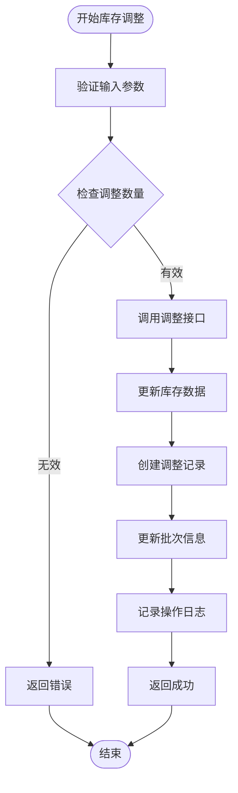

**图表来源**
- [packages/api/src/warehouse.ts:65-67](file://packages/api/src/warehouse.ts#L65-L67)

**章节来源**
- [packages/api/src/warehouse.ts:36-67](file://packages/api/src/warehouse.ts#L36-L67)

### 出入库管理接口

#### 入库操作
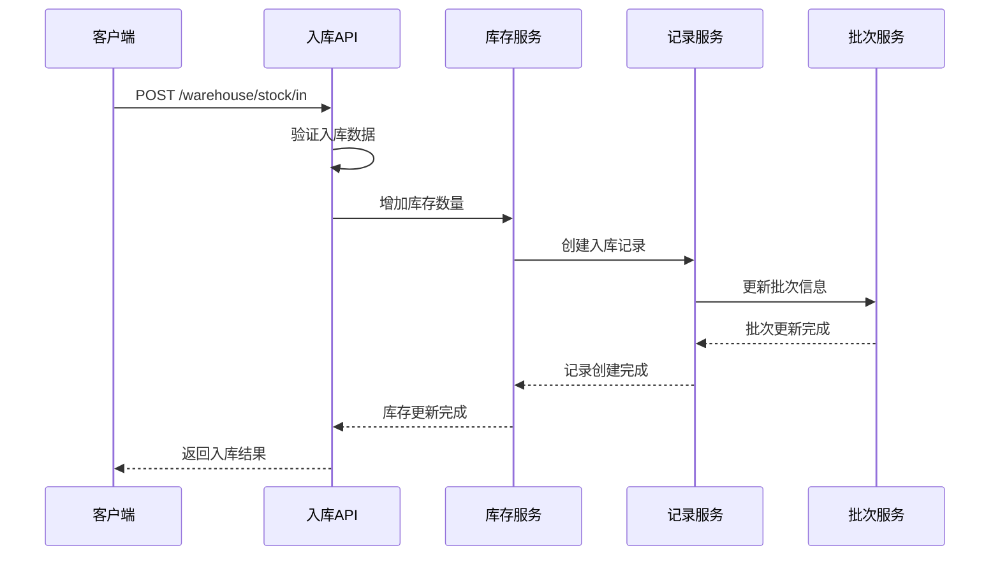

**图表来源**
- [packages/api/src/warehouse.ts:98-100](file://packages/api/src/warehouse.ts#L98-L100)

#### 出库操作
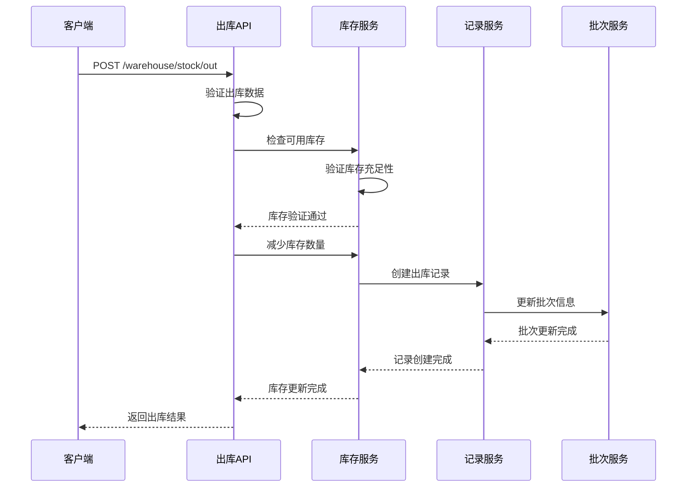

**图表来源**
- [packages/api/src/warehouse.ts:102-104](file://packages/api/src/warehouse.ts#L102-L104)

**章节来源**
- [packages/api/src/warehouse.ts:98-104](file://packages/api/src/warehouse.ts#L98-L104)

### 盘点管理接口

#### 盘点单创建
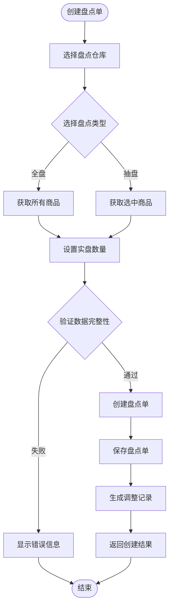

**图表来源**
- [apps/pc/src/views/warehouse/stock/check/index.vue:371-396](file://apps/pc/src/views/warehouse/stock/check/index.vue#L371-L396)

#### 盘点详情处理
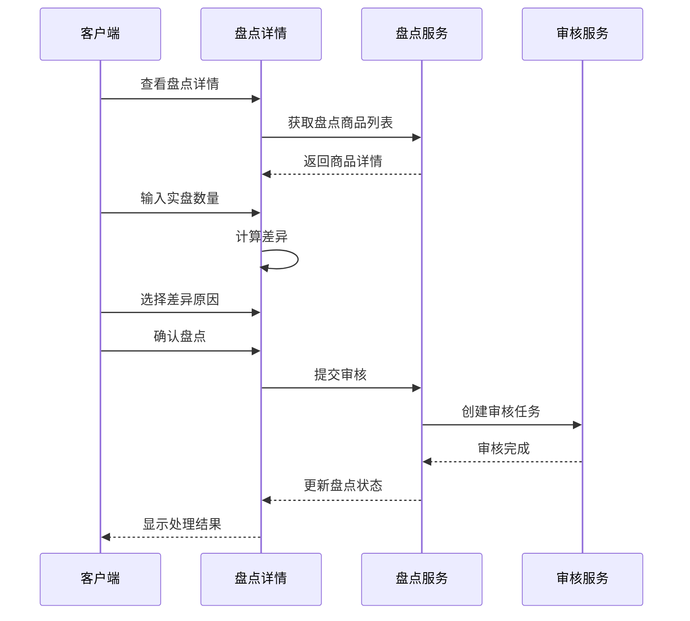

**图表来源**
- [apps/pc/src/views/warehouse/stock/check/detail.vue:221-243](file://apps/pc/src/views/warehouse/stock/check/detail.vue#L221-L243)

**章节来源**
- [apps/pc/src/views/warehouse/stock/check/index.vue:1-451](file://apps/pc/src/views/warehouse/stock/check/index.vue#L1-L451)
- [apps/pc/src/views/warehouse/stock/check/detail.vue:1-279](file://apps/pc/src/views/warehouse/stock/check/detail.vue#L1-L279)

### 调拨管理接口

#### 调拨流程
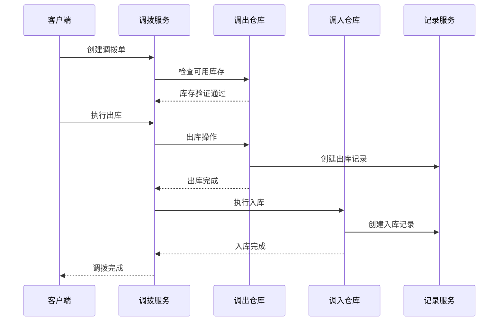

**图表来源**
- [packages/api/src/warehouse.ts:106-113](file://packages/api/src/warehouse.ts#L106-L113)
- [apps/pc/src/views/warehouse/stock/transfer.vue:121-170](file://apps/pc/src/views/warehouse/stock/transfer.vue#L121-L170)

**章节来源**
- [packages/api/src/warehouse.ts:106-113](file://packages/api/src/warehouse.ts#L106-L113)
- [apps/pc/src/views/warehouse/stock/transfer.vue:1-253](file://apps/pc/src/views/warehouse/stock/transfer.vue#L1-L253)

### 批次管理接口

#### 批次库存查询
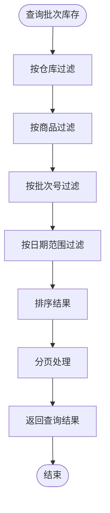

**图表来源**
- [apps/pc/src/views/warehouse/stock/batch/index.vue:148-203](file://apps/pc/src/views/warehouse/stock/batch/index.vue#L148-L203)

**章节来源**
- [apps/pc/src/views/warehouse/stock/batch/index.vue:1-203](file://apps/pc/src/views/warehouse/stock/batch/index.vue#L1-L203)

### 安全库存管理

#### 安全库存设置流程
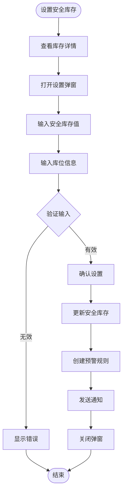

**图表来源**
- [apps/pc/src/views/market/stock/index.vue:170-191](file://apps/pc/src/views/market/stock/index.vue#L170-L191)
- [apps/pc/src/views/stock/detail/index.vue:198-219](file://apps/pc/src/views/stock/detail/index.vue#L198-L219)

**章节来源**
- [apps/pc/src/views/market/stock/index.vue:170-295](file://apps/pc/src/views/market/stock/index.vue#L170-L295)
- [apps/pc/src/views/stock/detail/index.vue:198-251](file://apps/pc/src/views/stock/detail/index.vue#L198-L251)

## 依赖关系分析

系统采用模块化设计，各组件之间通过清晰的接口进行交互：

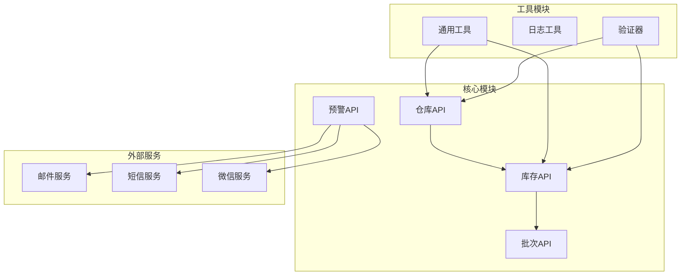

**图表来源**
- [packages/api/src/warehouse.ts:1-113](file://packages/api/src/warehouse.ts#L1-L113)
- [packages/types/src/warehouse.ts:1-112](file://packages/types/src/warehouse.ts#L1-L112)

**章节来源**
- [packages/api/src/warehouse.ts:1-113](file://packages/api/src/warehouse.ts#L1-L113)
- [packages/types/src/warehouse.ts:1-112](file://packages/types/src/warehouse.ts#L1-L112)

## 性能考虑

### 缓存策略
系统采用多层缓存机制：
- Redis缓存热点数据
- 浏览器本地缓存
- 服务器端缓存

### 分页查询
所有列表查询都支持分页，避免大数据量查询导致的性能问题。

### 批量操作
支持批量出入库、批量调整等操作，提高操作效率。

## 故障排除指南

### 常见问题及解决方案

#### 库存不足
当出库数量超过可用库存时，系统会返回错误信息。解决方案：
1. 检查当前可用库存
2. 调整出库数量
3. 申请补货或调拨

#### 批次过期
系统会自动检测过期批次并发出预警。解决方案：
1. 优先使用临近过期的批次
2. 与供应商协商延长保质期
3. 申请特殊处理

#### 数据同步延迟
多仓库环境下可能出现数据不同步。解决方案：
1. 定期检查各仓库库存
2. 手动触发数据同步
3. 检查网络连接状态

**章节来源**
- [apps/pc/src/views/warehouse/stock/check/detail.vue:221-243](file://apps/pc/src/views/warehouse/stock/check/detail.vue#L221-L243)

## 结论

本仓库管理系统提供了完整的库存管理解决方案，具有以下特点：

1. **功能完整**：涵盖仓库管理、库存管理、批次管理、盘点管理、调拨管理等核心功能
2. **架构清晰**：采用分层架构，模块职责明确，便于维护和扩展
3. **性能优秀**：支持分页查询、批量操作、多级缓存等性能优化措施
4. **用户体验良好**：提供直观的操作界面和完善的预警机制
5. **扩展性强**：模块化设计便于根据业务需求进行定制和扩展

系统能够满足现代仓储管理的各种需求，为企业的供应链管理提供强有力的技术支撑。