# 商品管理接口

<cite>
**本文档引用的文件**
- [packages/types/src/product.ts](file://packages/types/src/product.ts)
- [apps/pc/src/views/product/spu/index.vue](file://apps/pc/src/views/product/spu/index.vue)
- [apps/pc/src/views/product/sku/index.vue](file://apps/pc/src/views/product/sku/index.vue)
- [apps/pc/src/views/product/category/index.vue](file://apps/pc/src/views/product/category/index.vue)
- [apps/pc/src/views/product/attr/index.vue](file://apps/pc/src/views/product/attr/index.vue)
- [packages/api/src/product.ts](file://packages/api/src/product.ts)
- [packages/api/src/mock/product.ts](file://packages/api/src/mock/product.ts)
- [docs/PRD/05-商品模块详细设计方案.md](file://docs/PRD/05-商品模块详细设计方案.md)
- [docs/PRD/18-SPU管理功能详细设计.md](file://docs/PRD/18-SPU管理功能详细设计.md)
- [docs/PRD/12-商品SKU功能详细设计.md](file://docs/PRD/12-商品SKU功能详细设计.md)
</cite>

## 目录
1. [简介](#简介)
2. [项目结构](#项目结构)
3. [核心组件](#核心组件)
4. [架构概览](#架构概览)
5. [详细组件分析](#详细组件分析)
6. [依赖分析](#依赖分析)
7. [性能考虑](#性能考虑)
8. [故障排除指南](#故障排除指南)
9. [结论](#结论)
10. [附录](#附录)

## 简介

本项目是一个基于Vue 3和TypeScript的工程材料管理采供一体化平台，专注于商品管理系统的完整实现。该系统支持多角色协同操作，包括平台管理员、供应商、工程仓和施工方，为双交易链路（工程仓→供应商，施工方→工程仓）提供完整的商品数据支撑。

系统的核心功能涵盖商品分类管理、SPU/SKU管理、商品上下架、价格管理、库存管理、商品搜索等全方位的商品生命周期管理。

## 项目结构

项目采用Monorepo架构，主要包含以下核心模块：

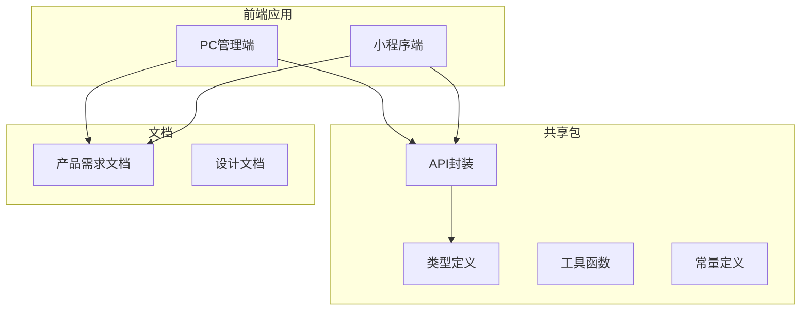

**图表来源**
- [package.json:1-23](file://package.json#L1-L23)

**章节来源**
- [package.json:1-23](file://package.json#L1-L23)

## 核心组件

### 商品数据模型

系统采用标准化的商品数据模型，支持SPU（标准化产品单元）和SKU（库存保有单位）的完整管理：

```mermaid
classDiagram
class ProductCategory {
+string categoryId
+string categoryName
+number level
+number sortOrder
+number status
+string[] children
}
class Spu {
+string spuId
+string spuName
+string spuCode
+string categoryId
+string unit
+string[] attrIds
+string mainImage
+string[] images
+number status
+number skuCount
}
class Sku {
+string skuId
+string skuCode
+string skuName
+string spuId
+Record specs
+string unit
+number status
+number supplyPrice
+number salePrice
+number stockTotal
}
class ProductAttr {
+string attrId
+string attrName
+string attrType
+string[] optionValues
+number sortOrder
+number status
}
ProductCategory --> Spu : "1 : N"
Spu --> Sku : "1 : N"
Spu --> ProductAttr : "N : M"
```

**图表来源**
- [packages/types/src/product.ts:22-164](file://packages/types/src/product.ts#L22-L164)

### 核心业务实体关系

系统遵循严格的业务规则，确保商品数据的完整性和一致性：

| 实体关系 | 关系类型 | 业务含义 |
|---------|---------|---------|
| 商品分类 → 商品SPU | 1:N | 一个分类下可以有多个商品SPU |
| 商品SPU → 商品SKU | 1:N | 一个SPU可以对应多个SKU（不同规格） |
| 商品SPU → 商品属性 | N:M | 一个SPU可以关联多个属性，属性可被多个SPU使用 |
| 商品SKU → 供应商 | N:M | 一个SKU可以有多个供应商，供应商可供应多个SKU |
| 商品SKU → 库存 | 1:1 | 一个SKU在一个工程仓中对应一条库存记录 |

**章节来源**
- [packages/types/src/product.ts:90-164](file://packages/types/src/product.ts#L90-L164)

## 架构概览

系统采用前后端分离架构，前端使用Vue 3 + TypeScript，后端通过API封装提供数据访问：

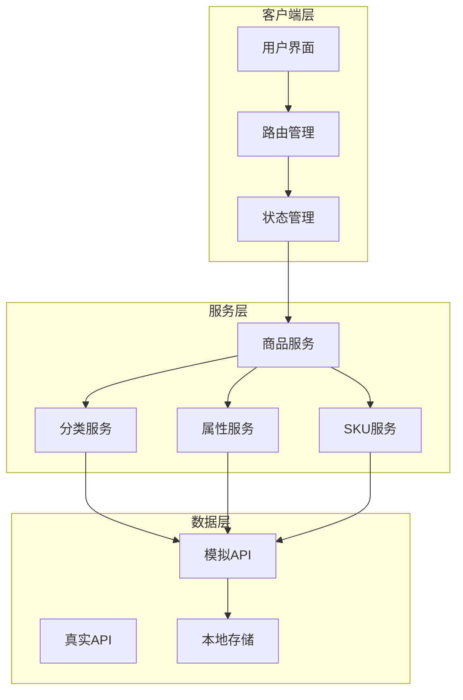

**图表来源**
- [packages/api/src/product.ts:1-258](file://packages/api/src/product.ts#L1-L258)

## 详细组件分析

### 商品分类管理

商品分类管理支持多级分类结构，最多支持3级分类，提供完整的CRUD操作：

#### 分类树结构

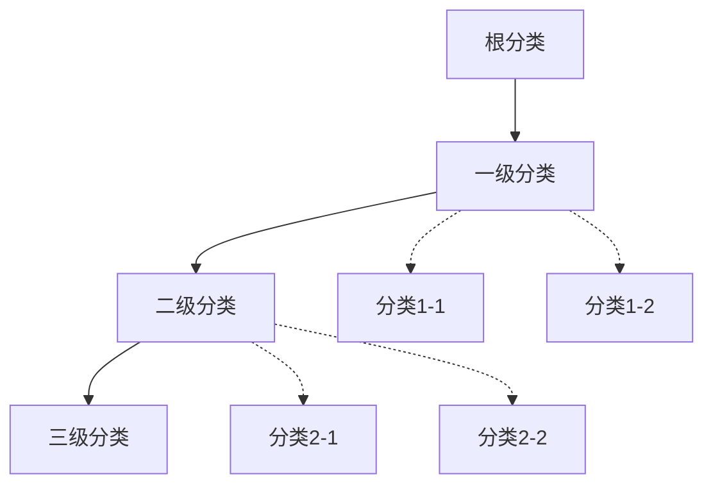

**图表来源**
- [apps/pc/src/views/product/category/index.vue:1-408](file://apps/pc/src/views/product/category/index.vue#L1-L408)

#### 分类操作流程

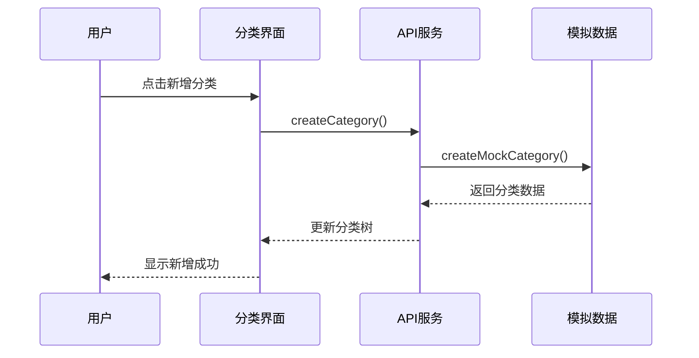

**图表来源**
- [packages/api/src/product.ts:75-80](file://packages/api/src/product.ts#L75-L80)

**章节来源**
- [apps/pc/src/views/product/category/index.vue:1-408](file://apps/pc/src/views/product/category/index.vue#L1-L408)
- [packages/api/src/product.ts:52-98](file://packages/api/src/product.ts#L52-L98)

### SPU管理功能

SPU（标准化产品单元）管理是商品体系的核心，负责定义商品的标准化信息：

#### SPU创建流程

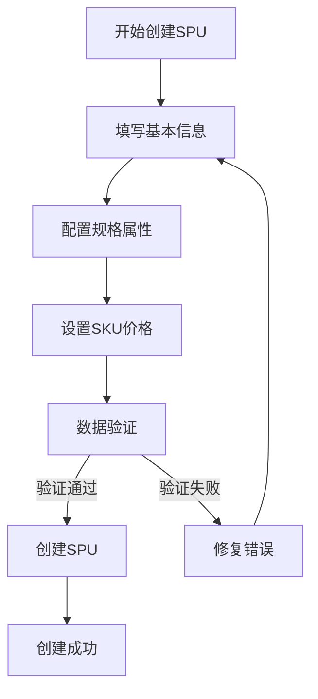

**图表来源**
- [apps/pc/src/views/product/spu/index.vue:240-316](file://apps/pc/src/views/product/spu/index.vue#L240-L316)

#### SPU数据模型

SPU包含以下核心字段：
- 基本信息：spuId、spuName、spuCode、categoryId、unit
- 展示信息：mainImage、images、description、remark
- 关联信息：attrIds、attrNames、status、skuCount
- 时间信息：createdAt、updatedAt

**章节来源**
- [apps/pc/src/views/product/spu/index.vue:1-473](file://apps/pc/src/views/product/spu/index.vue#L1-L473)
- [packages/types/src/product.ts:90-133](file://packages/types/src/product.ts#L90-L133)

### SKU管理功能

SKU（库存保有单位）管理负责管理商品的具体实例，每个SKU都有独立的价格、库存和规格属性：

#### SKU状态管理

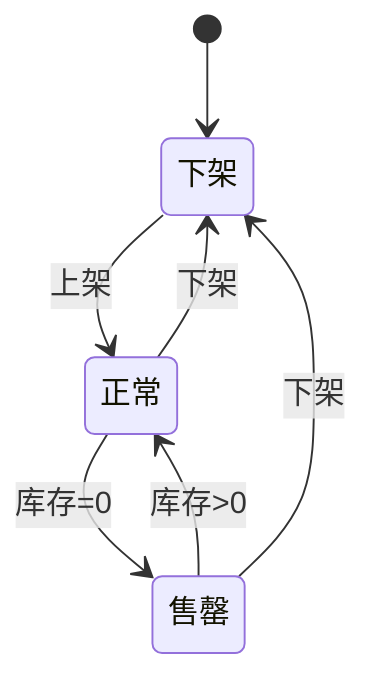

**图表来源**
- [apps/pc/src/views/product/sku/index.vue:350-392](file://apps/pc/src/views/product/sku/index.vue#L350-L392)

#### SKU操作流程

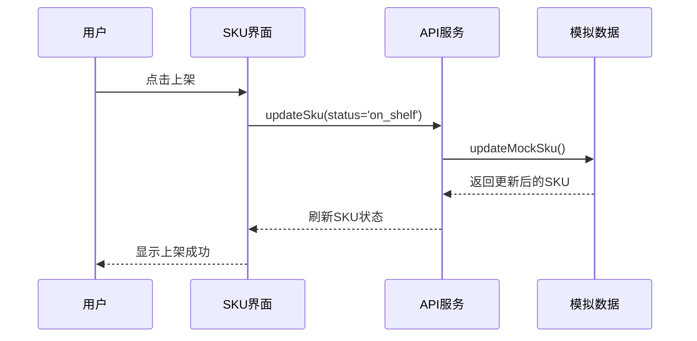

**图表来源**
- [apps/pc/src/views/product/sku/index.vue:604-620](file://apps/pc/src/views/product/sku/index.vue#L604-L620)

**章节来源**
- [apps/pc/src/views/product/sku/index.vue:1-886](file://apps/pc/src/views/product/sku/index.vue#L1-L886)
- [packages/types/src/product.ts:140-164](file://packages/types/src/product.ts#L140-L164)

### 商品属性管理

商品属性系统支持多种属性类型，包括单选、多选和输入框类型：

#### 属性类型定义

| 属性类型 | 颜色 | 说明 | 使用场景 |
|---------|------|------|---------|
| 单选 | blue | 单值选择 | 材质、颜色 |
| 多选 | green | 多值选择 | 包装规格、标签 |
| 输入框 | orange | 用户输入 | 品牌、自定义 |

**章节来源**
- [apps/pc/src/views/product/attr/index.vue:1-239](file://apps/pc/src/views/product/attr/index.vue#L1-L239)
- [packages/types/src/product.ts:58-83](file://packages/types/src/product.ts#L58-L83)

### 商品搜索功能

系统提供多维度的商品搜索能力，支持关键词搜索、分类筛选、价格筛选等功能：

#### 搜索流程

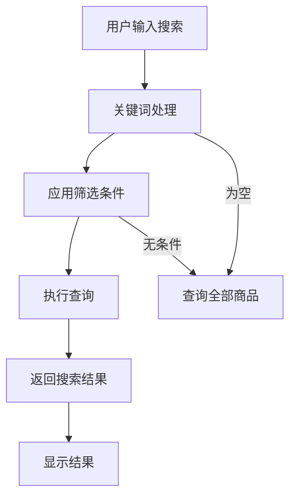

**图表来源**
- [apps/pc/src/views/product/spu/index.vue:428-431](file://apps/pc/src/views/product/spu/index.vue#L428-L431)

**章节来源**
- [apps/pc/src/views/product/spu/index.vue:1-473](file://apps/pc/src/views/product/spu/index.vue#L1-L473)

## 依赖分析

### 技术栈依赖

系统采用现代化的技术栈，确保开发效率和运行性能：

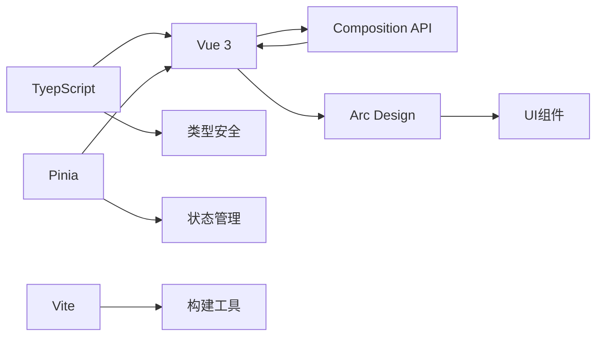

### 核心依赖关系

| 依赖包 | 版本 | 用途 |
|-------|------|------|
| @arco-design/web-vue | 最新 | UI组件库 |
| vue | 3.x | 前端框架 |
| typescript | 4.x | 类型系统 |
| pinia | 最新 | 状态管理 |
| vite | 最新 | 构建工具 |

**章节来源**
- [package.json:1-23](file://package.json#L1-L23)

## 性能考虑

### 前端性能优化

系统在前端层面实现了多项性能优化策略：

1. **懒加载机制**：图片资源采用懒加载，减少初始加载时间
2. **虚拟滚动**：大数据量列表采用虚拟滚动技术
3. **缓存策略**：分类树、属性列表等静态数据进行缓存
4. **防抖处理**：搜索功能实现防抖，避免频繁请求

### 数据结构优化

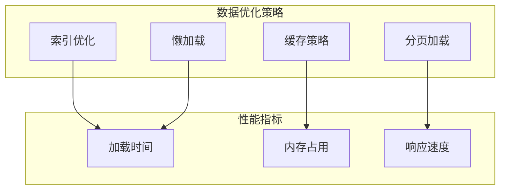

## 故障排除指南

### 常见问题及解决方案

| 问题类型 | 症状 | 解决方案 |
|---------|------|---------|
| 分类删除失败 | 删除提示"该分类下有商品" | 先删除分类下的所有商品 |
| SPU创建失败 | 提示"SPU名称已存在" | 修改SPU名称或使用系统自动生成 |
| SKU状态切换失败 | 上架/下架操作无响应 | 检查网络连接和权限设置 |
| 搜索无结果 | 关键词搜索返回空结果 | 检查关键词拼写和筛选条件 |

### 错误处理机制

系统实现了完善的错误处理机制：

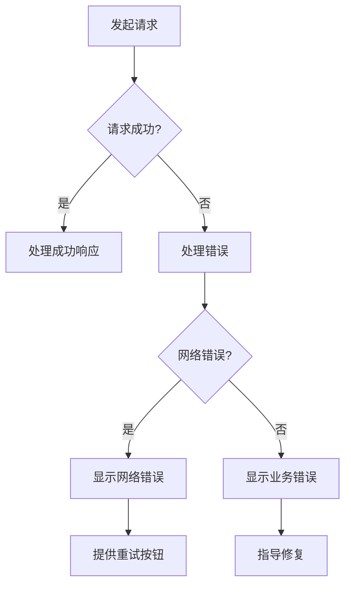

**章节来源**
- [apps/pc/src/views/product/spu/index.vue:457-471](file://apps/pc/src/views/product/spu/index.vue#L457-L471)
- [apps/pc/src/views/product/sku/index.vue:604-620](file://apps/pc/src/views/product/sku/index.vue#L604-L620)

## 结论

本商品管理系统通过标准化的数据模型和完善的业务流程，为工程材料管理提供了全面的数字化解决方案。系统支持多角色协同操作，具备良好的扩展性和维护性。

核心优势包括：
- 完整的商品生命周期管理
- 多维度的商品搜索和筛选
- 灵活的SPU/SKU管理模式
- 完善的权限控制机制
- 优秀的用户体验设计

## 附录

### API接口规范

系统提供RESTful风格的API接口，支持标准的CRUD操作：

| 功能模块 | HTTP方法 | 接口路径 | 功能描述 |
|---------|---------|---------|---------|
| 商品分类 | GET | /api/category/list | 获取分类列表 |
| 商品分类 | POST | /api/category | 创建分类 |
| 商品分类 | PUT | /api/category/{id} | 更新分类 |
| 商品分类 | DELETE | /api/category/{id} | 删除分类 |
| 商品SPU | GET | /api/product/list | 获取SPU列表 |
| 商品SPU | POST | /api/product | 创建SPU |
| 商品SPU | PUT | /api/product/{id} | 更新SPU |
| 商品SPU | DELETE | /api/product/{id} | 删除SPU |
| 商品SKU | GET | /api/sku/list | 获取SKU列表 |
| 商品SKU | POST | /api/sku | 创建SKU |
| 商品SKU | PUT | /api/sku/{id} | 更新SKU |
| 商品SKU | DELETE | /api/sku/{id} | 删除SKU |

### 开发指南

1. **环境准备**：确保Node.js版本满足要求
2. **依赖安装**：使用pnpm安装项目依赖
3. **启动项目**：运行开发服务器
4. **代码规范**：遵循项目的代码规范和最佳实践