# 商户管理接口

<cite>
**本文档引用的文件**
- [packages/api/src/merchant.ts](file://packages/api/src/merchant.ts)
- [packages/types/src/merchant.ts](file://packages/types/src/merchant.ts)
- [packages/constants/src/merchant.ts](file://packages/constants/src/merchant.ts)
- [apps/pc/src/views/merchant/list/index.vue](file://apps/pc/src/views/merchant/list/index.vue)
- [apps/pc/src/views/merchant/detail/index.vue](file://apps/pc/src/views/merchant/detail/index.vue)
- [apps/pc/src/views/merchant/contract/index.vue](file://apps/pc/src/views/merchant/contract/index.vue)
- [apps/pc/src/views/finance/custody/index.vue](file://apps/pc/src/views/finance/custody/index.vue)
- [apps/pc/src/views/finance/custody/bank-card.vue](file://apps/pc/src/views/finance/custody/bank-card.vue)
- [apps/pc/src/store/merchant.ts](file://apps/pc/src/store/merchant.ts)
- [packages/api/src/mock/merchant.ts](file://packages/api/src/mock/merchant.ts)
</cite>

## 目录
1. [简介](#简介)
2. [项目结构](#项目结构)
3. [核心组件](#核心组件)
4. [架构概览](#架构概览)
5. [详细组件分析](#详细组件分析)
6. [依赖分析](#依赖分析)
7. [性能考虑](#性能考虑)
8. [故障排除指南](#故障排除指南)
9. [结论](#结论)
10. [附录](#附录)

## 简介
本项目提供完整的商户管理能力，涵盖商户信息管理、合同管理、资质审核、银行账户管理等核心功能。系统支持三种商户类型（供应商、施工方、工程仓库），提供从入驻申请到日常运营的全生命周期管理。

## 项目结构
商户管理相关的核心文件组织如下：

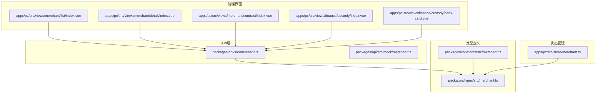

**图表来源**
- [packages/api/src/merchant.ts:1-119](file://packages/api/src/merchant.ts#L1-L119)
- [packages/types/src/merchant.ts:1-291](file://packages/types/src/merchant.ts#L1-L291)
- [apps/pc/src/views/merchant/list/index.vue:1-731](file://apps/pc/src/views/merchant/list/index.vue#L1-L731)

**章节来源**
- [packages/api/src/merchant.ts:1-119](file://packages/api/src/merchant.ts#L1-L119)
- [packages/types/src/merchant.ts:1-291](file://packages/types/src/merchant.ts#L1-L291)
- [apps/pc/src/views/merchant/list/index.vue:1-731](file://apps/pc/src/views/merchant/list/index.vue#L1-L731)

## 核心组件
系统包含以下核心组件：

### 数据模型组件
- **商户实体**：包含基础信息、企业信息、结算账户等
- **合同实体**：支持多种合同类型和状态管理
- **资质实体**：管理各类资质证书的有效性
- **托管账户实体**：资金托管和银行账户管理

### 业务流程组件
- **商户入驻流程**：从申请到审核再到系统使用的完整流程
- **合同管理流程**：合同创建、审核、生效、作废的全生命周期
- **资质审核流程**：资质上传、审核、过期管理
- **银行账户管理流程**：账户绑定、解绑、默认卡设置

**章节来源**
- [packages/types/src/merchant.ts:31-212](file://packages/types/src/merchant.ts#L31-L212)
- [packages/constants/src/merchant.ts:21-199](file://packages/constants/src/merchant.ts#L21-L199)

## 架构概览

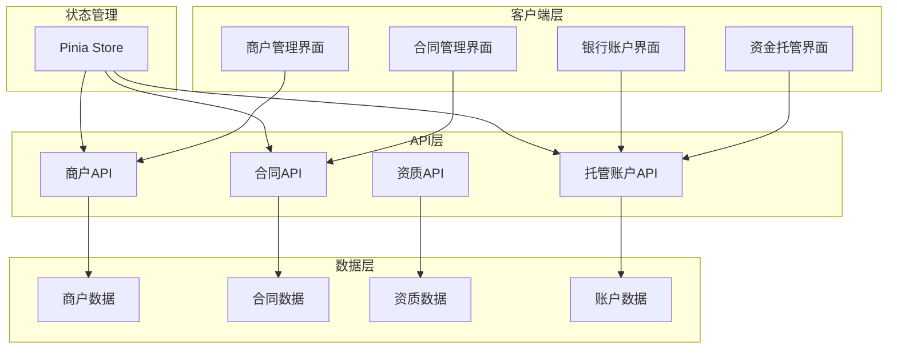

**图表来源**
- [apps/pc/src/views/merchant/list/index.vue:138-731](file://apps/pc/src/views/merchant/list/index.vue#L138-L731)
- [apps/pc/src/views/merchant/contract/index.vue:99-407](file://apps/pc/src/views/merchant/contract/index.vue#L99-L407)
- [apps/pc/src/views/finance/custody/index.vue:108-222](file://apps/pc/src/views/finance/custody/index.vue#L108-L222)

## 详细组件分析

### 商户信息管理组件

#### 数据模型设计
商户管理的核心数据模型包含以下关键实体：

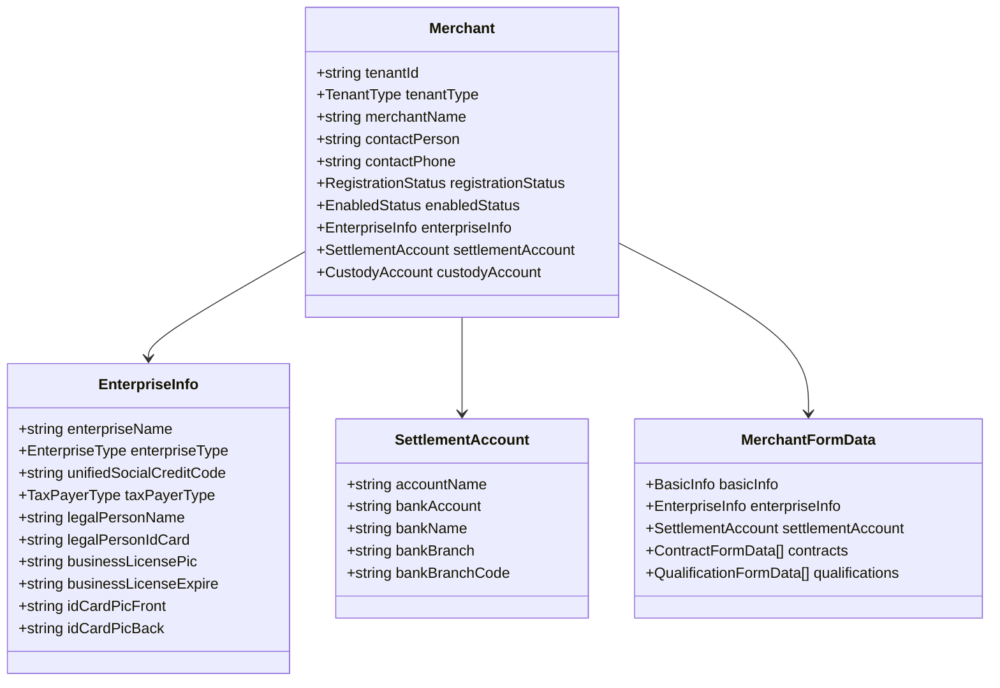

**图表来源**
- [packages/types/src/merchant.ts:31-87](file://packages/types/src/merchant.ts#L31-L87)

#### API接口设计
系统提供完整的商户管理API接口：

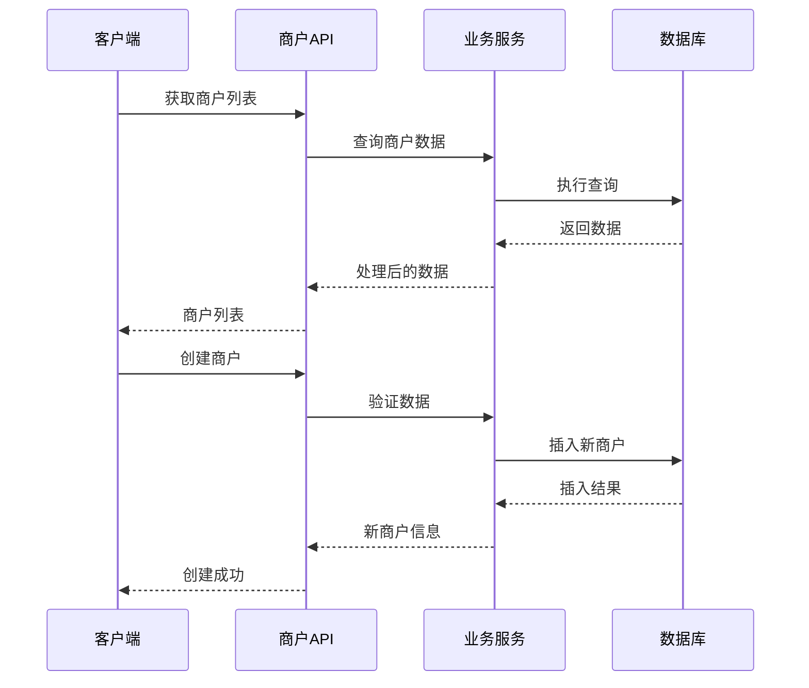

**图表来源**
- [packages/api/src/merchant.ts:16-58](file://packages/api/src/merchant.ts#L16-L58)

#### 核心功能实现
- **商户列表查询**：支持关键字搜索、类型筛选、状态过滤
- **商户详情查看**：展示完整的商户信息和关联数据
- **商户信息编辑**：支持基础信息、企业信息、结算账户的修改
- **商户状态管理**：入驻状态和启用状态的控制

**章节来源**
- [packages/api/src/merchant.ts:16-68](file://packages/api/src/merchant.ts#L16-L68)
- [apps/pc/src/views/merchant/list/index.vue:630-729](file://apps/pc/src/views/merchant/list/index.vue#L630-L729)

### 合同管理组件

#### 合同数据模型
合同管理支持多种合同类型和状态：

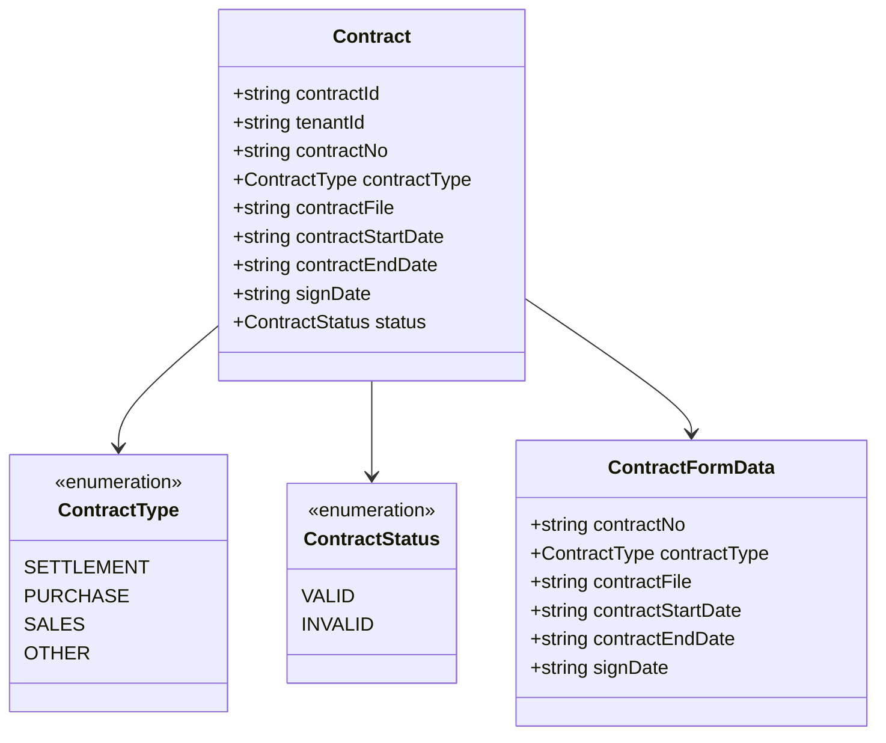

**图表来源**
- [packages/types/src/merchant.ts:89-122](file://packages/types/src/merchant.ts#L89-L122)

#### 合同管理流程
合同管理提供完整的生命周期管理：

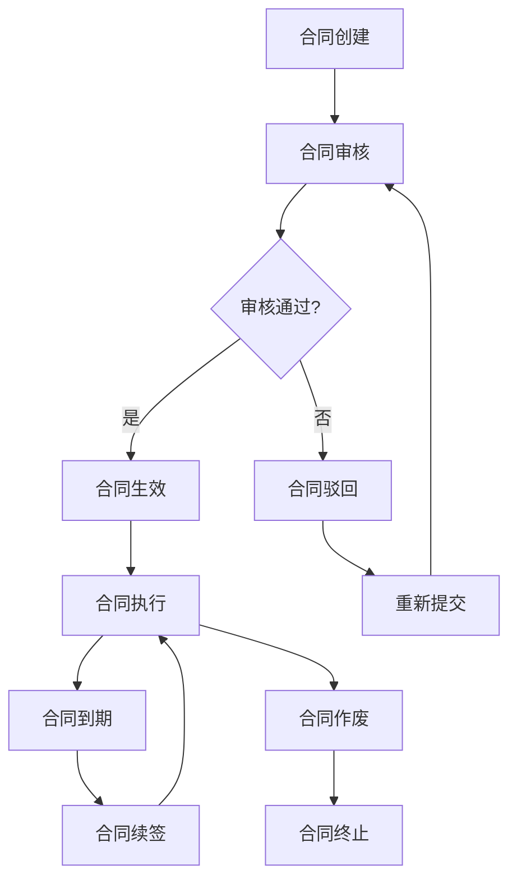

**图表来源**
- [apps/pc/src/views/merchant/contract/index.vue:174-198](file://apps/pc/src/views/merchant/contract/index.vue#L174-L198)

**章节来源**
- [packages/types/src/merchant.ts:112-122](file://packages/types/src/merchant.ts#L112-L122)
- [apps/pc/src/views/merchant/contract/index.vue:99-407](file://apps/pc/src/views/merchant/contract/index.vue#L99-L407)

### 资质管理组件

#### 资质数据模型
资质管理支持多种资质类型和状态：

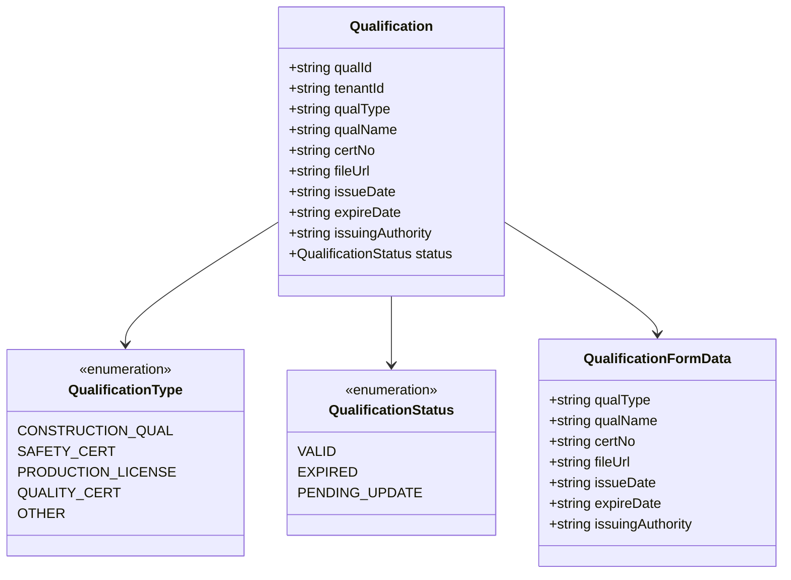

**图表来源**
- [packages/types/src/merchant.ts:124-155](file://packages/types/src/merchant.ts#L124-L155)

#### 资质审核机制
系统提供完善的资质审核机制：

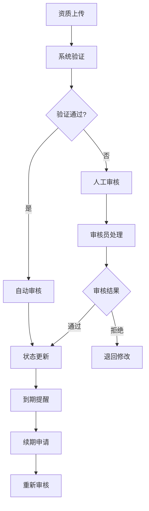

**图表来源**
- [packages/constants/src/merchant.ts:157-174](file://packages/constants/src/merchant.ts#L157-L174)

**章节来源**
- [packages/types/src/merchant.ts:157-171](file://packages/types/src/merchant.ts#L157-L171)
- [packages/constants/src/merchant.ts:91-101](file://packages/constants/src/merchant.ts#L91-L101)

### 银行账户管理组件

#### 托管账户模型
银行账户管理提供完整的资金托管功能：

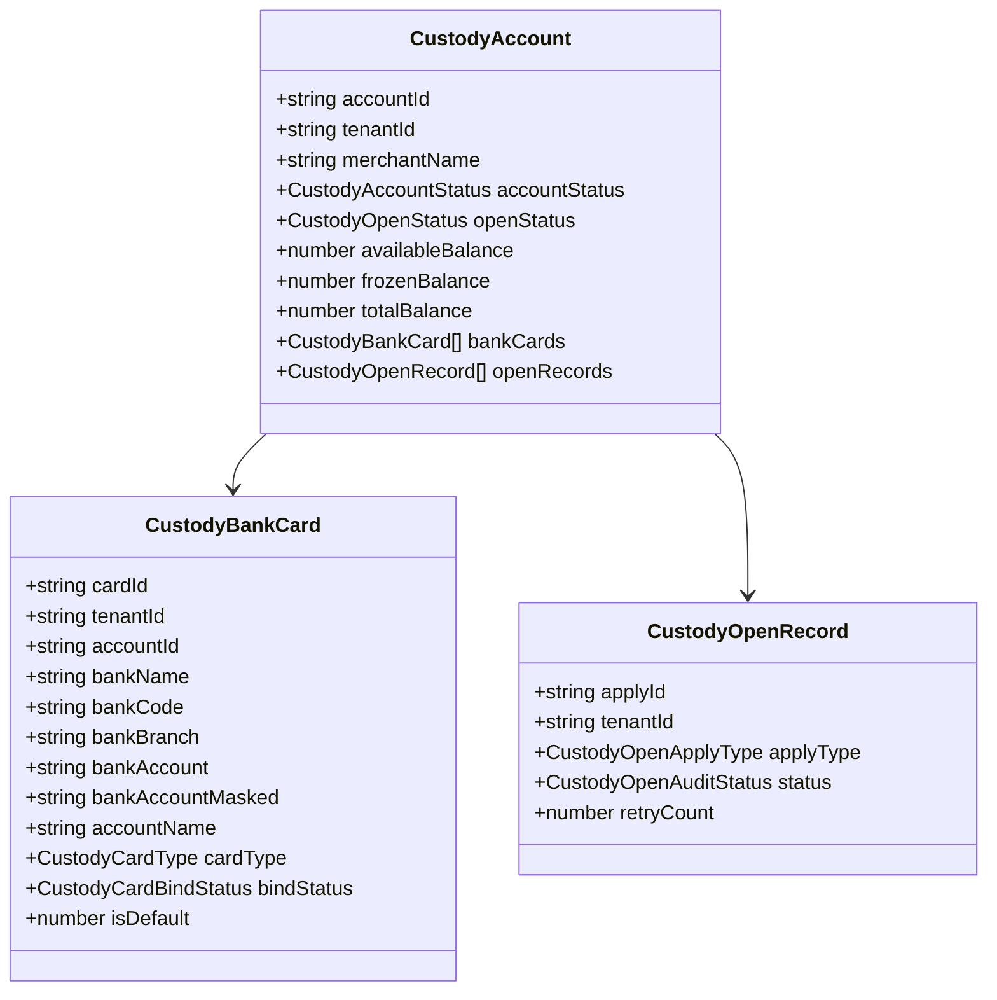

**图表来源**
- [packages/types/src/merchant.ts:194-247](file://packages/types/src/merchant.ts#L194-L247)

#### 账户管理流程
银行账户管理提供完整的操作流程：

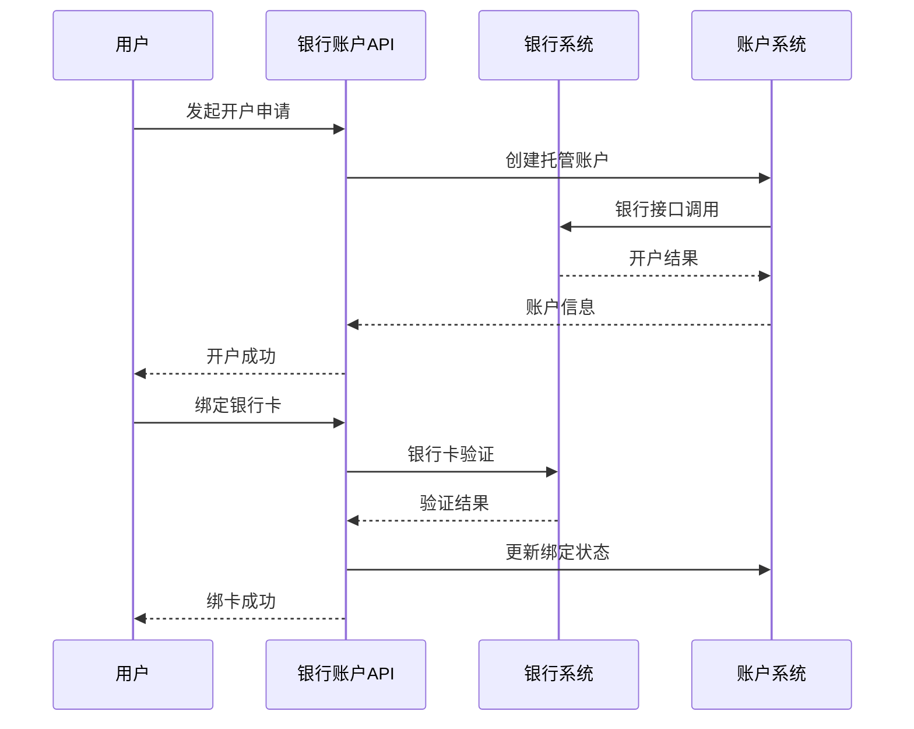

**图表来源**
- [apps/pc/src/views/finance/custody/index.vue:181-194](file://apps/pc/src/views/finance/custody/index.vue#L181-L194)
- [apps/pc/src/views/finance/custody/bank-card.vue:188-206](file://apps/pc/src/views/finance/custody/bank-card.vue#L188-L206)

**章节来源**
- [packages/types/src/merchant.ts:173-279](file://packages/types/src/merchant.ts#L173-L279)
- [apps/pc/src/views/finance/custody/index.vue:108-222](file://apps/pc/src/views/finance/custody/index.vue#L108-L222)

### 状态管理组件

#### Pinia状态管理
系统使用Pinia进行状态管理：

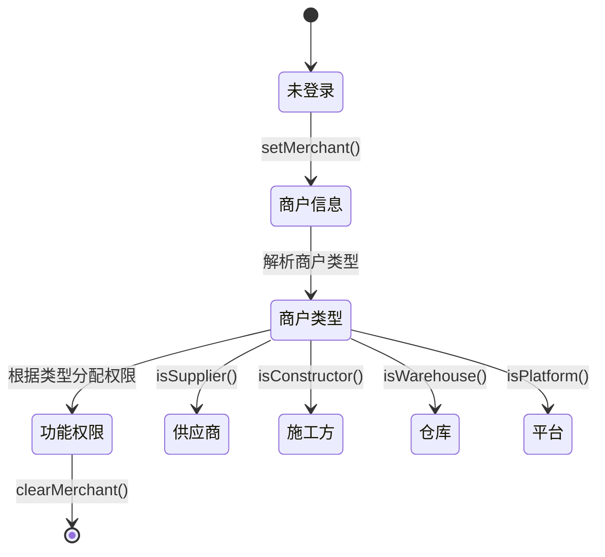

**图表来源**
- [apps/pc/src/store/merchant.ts:6-48](file://apps/pc/src/store/merchant.ts#L6-L48)

**章节来源**
- [apps/pc/src/store/merchant.ts:1-49](file://apps/pc/src/store/merchant.ts#L1-L49)

## 依赖分析

### 组件依赖关系

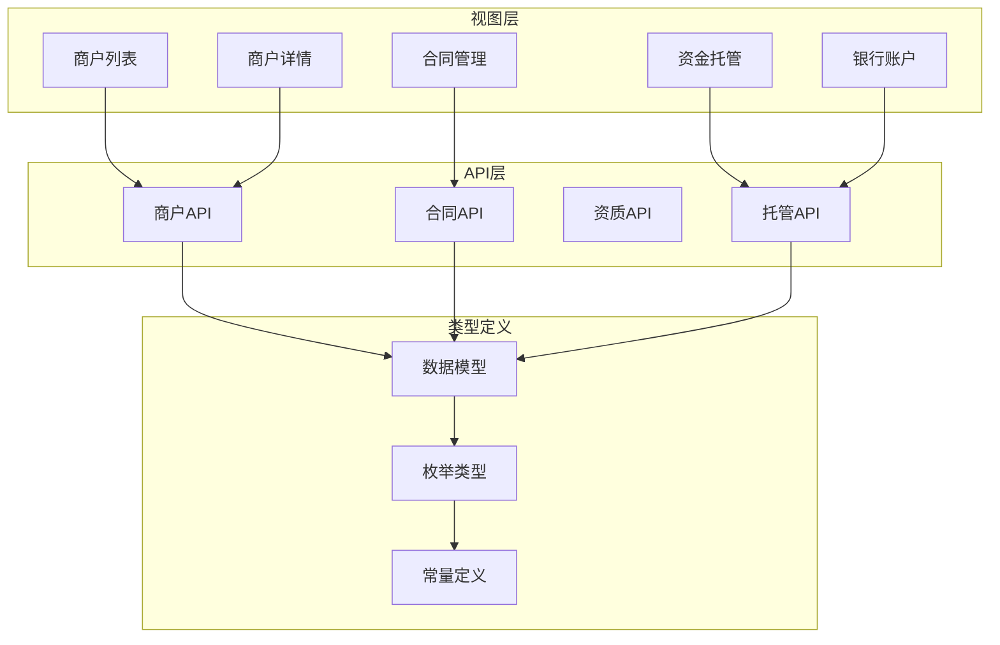

**图表来源**
- [apps/pc/src/views/merchant/list/index.vue:138-152](file://apps/pc/src/views/merchant/list/index.vue#L138-L152)
- [apps/pc/src/views/merchant/detail/index.vue:364-366](file://apps/pc/src/views/merchant/detail/index.vue#L364-L366)

### 数据流分析
系统采用分层架构，各层职责清晰：

1. **表现层**：Vue组件负责用户交互和界面展示
2. **业务层**：API模块封装业务逻辑和数据处理
3. **数据层**：类型定义确保数据结构的一致性和完整性
4. **状态层**：Pinia管理全局状态和权限控制

**章节来源**
- [packages/api/src/merchant.ts:1-14](file://packages/api/src/merchant.ts#L1-L14)
- [packages/types/src/merchant.ts:1-291](file://packages/types/src/merchant.ts#L1-L291)

## 性能考虑
系统在设计时充分考虑了性能优化：

### 前端性能优化
- **虚拟滚动**：大数据量表格使用虚拟滚动提升渲染性能
- **懒加载**：组件按需加载，减少初始包体积
- **缓存策略**：合理使用浏览器缓存和组件缓存
- **防抖节流**：搜索和筛选操作使用防抖优化

### 后端性能优化
- **分页查询**：所有列表接口支持分页，避免全量数据传输
- **索引优化**：数据库查询使用合适的索引
- **连接池**：数据库连接使用连接池管理
- **缓存层**：热点数据使用Redis缓存

### 网络优化
- **HTTP缓存**：静态资源使用HTTP缓存头
- **CDN加速**：图片和静态资源使用CDN
- **压缩传输**：启用Gzip压缩减少传输体积
- **并发控制**：合理控制并发请求数量

## 故障排除指南

### 常见问题诊断

#### 商户数据问题
- **问题现象**：商户列表显示异常或数据不完整
- **排查步骤**：
  1. 检查网络连接和API响应状态
  2. 验证数据模型字段映射
  3. 查看控制台错误日志
  4. 确认数据库连接状态

#### 合同管理问题
- **问题现象**：合同状态更新失败或审核流程异常
- **排查步骤**：
  1. 检查合同状态转换规则
  2. 验证合同文件上传和存储
  3. 确认审批流程配置
  4. 查看操作日志追踪

#### 资质审核问题
- **问题现象**：资质上传失败或审核状态异常
- **排查步骤**：
  1. 检查文件格式和大小限制
  2. 验证OCR识别准确性
  3. 确认资质类型配置
  4. 查看审核历史记录

#### 银行账户问题
- **问题现象**：账户绑定失败或余额同步异常
- **排查步骤**：
  1. 检查银行接口连通性
  2. 验证账户信息格式
  3. 确认短信验证码
  4. 查看银行返回错误码

**章节来源**
- [apps/pc/src/views/merchant/list/index.vue:717-725](file://apps/pc/src/views/merchant/list/index.vue#L717-L725)
- [apps/pc/src/views/merchant/detail/index.vue:487-494](file://apps/pc/src/views/merchant/detail/index.vue#L487-L494)

## 结论
本商户管理系统提供了完整的商户全生命周期管理能力，具有以下特点：

1. **功能完整**：涵盖商户管理、合同管理、资质审核、银行账户管理等核心功能
2. **架构清晰**：采用分层架构，职责分离明确
3. **扩展性强**：模块化设计便于功能扩展和维护
4. **用户体验好**：提供直观的操作界面和完善的权限控制
5. **安全性高**：多层次的安全防护和审计日志

系统为开发者提供了完整的实现参考，可以作为商户管理系统的最佳实践案例。

## 附录

### API接口清单

#### 商户管理接口
- `getMerchantList()` - 获取商户列表
- `getMerchantDetail()` - 获取商户详情
- `createMerchant()` - 创建商户
- `updateMerchant()` - 更新商户信息
- `deleteMerchant()` - 删除商户
- `auditMerchant()` - 商户审核
- `updateMerchantStatus()` - 更新商户状态

#### 合同管理接口
- `getContractList()` - 获取合同列表
- `getContractDetail()` - 获取合同详情
- `createContract()` - 创建合同
- `updateContract()` - 更新合同
- `deleteContract()` - 删除合同
- `invalidateContract()` - 作废合同

#### 资质管理接口
- `getQualificationList()` - 获取资质列表
- `getQualificationDetail()` - 获取资质详情
- `createQualification()` - 创建资质
- `updateQualification()` - 更新资质
- `deleteQualification()` - 删除资质

#### 银行账户接口
- `getCustodyAccountList()` - 获取托管账户列表
- `getCustodyAccountDetail()` - 获取账户详情
- `applyOpenAccount()` - 申请开户
- `retryOpenAccount()` - 重新开户
- `syncAccountBalance()` - 同步余额
- `getBankCardList()` - 获取银行卡列表
- `setDefaultCard()` - 设置默认卡
- `unbindBankCard()` - 解绑银行卡

### 数据模型字段说明

#### 商户实体字段
- `tenantId`: 商户唯一标识
- `tenantType`: 商户类型（供应商/施工方/仓库）
- `merchantName`: 商户名称
- `contactPerson`: 联系人
- `contactPhone`: 联系电话
- `registrationStatus`: 入驻状态
- `enabledStatus`: 启用状态

#### 合同实体字段
- `contractNo`: 合同编号
- `contractType`: 合同类型
- `contractStartDate`: 合同开始日期
- `contractEndDate`: 合同结束日期
- `signDate`: 签署日期
- `status`: 合同状态

#### 资质实体字段
- `qualType`: 资质类型
- `qualName`: 资质名称
- `certNo`: 证书编号
- `issueDate`: 发证日期
- `expireDate`: 到期日期
- `status`: 资质状态

### 状态枚举定义

#### 商户状态枚举
- `RegistrationStatus`: 待审核、已入驻、已注销、审核失败
- `EnabledStatus`: 启用、停用

#### 合同状态枚举
- `ContractType`: 入驻合同、采购合同、销售合同、其他合同
- `ContractStatus`: 有效、作废

#### 资质状态枚举
- `QualificationStatus`: 有效、已过期、待更新

#### 账户状态枚举
- `CustodyAccountStatus`: 开户中、正常、冻结、注销
- `CustodyOpenStatus`: 未开户、开户中、已开户、开户失败
- `CustodyBindCardStatus`: 未绑卡、已绑卡、绑卡中、绑卡失败