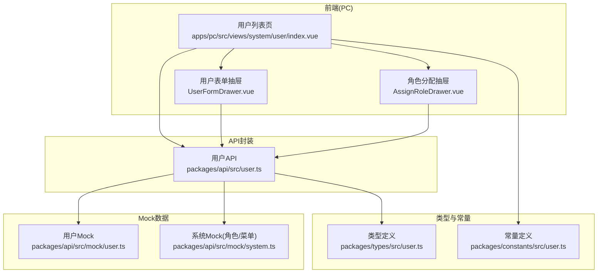
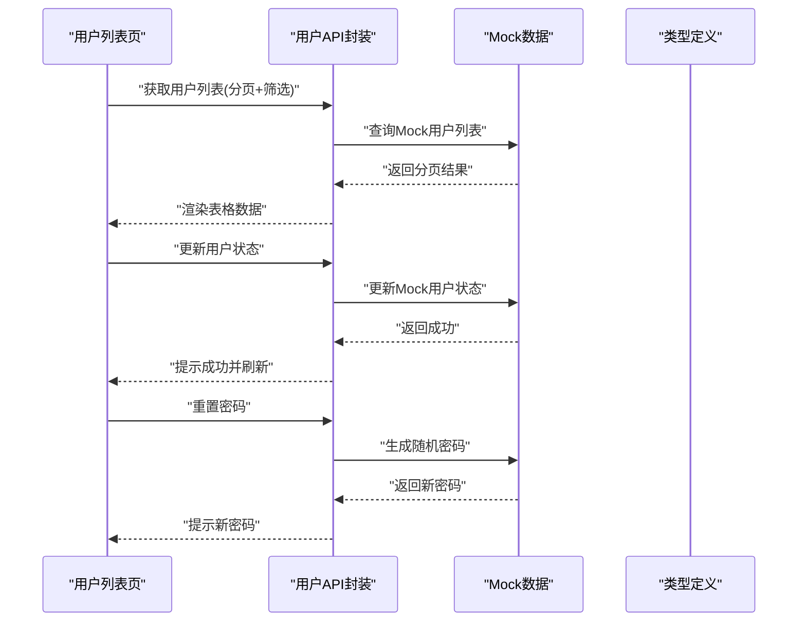
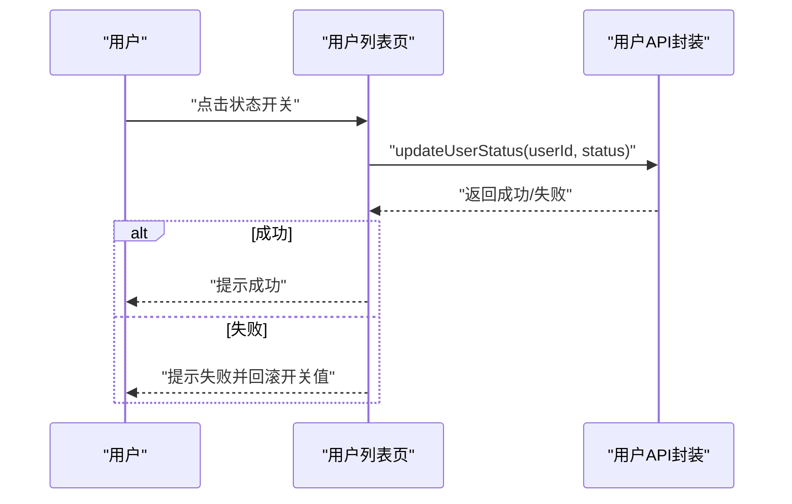
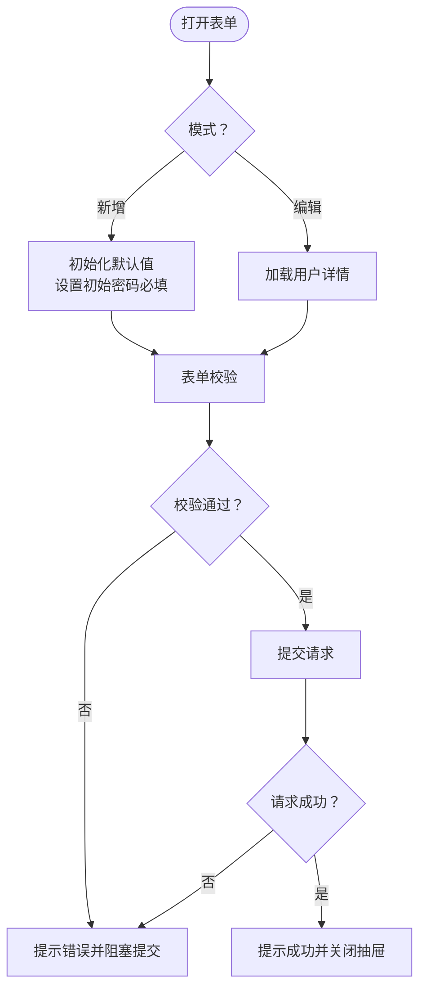
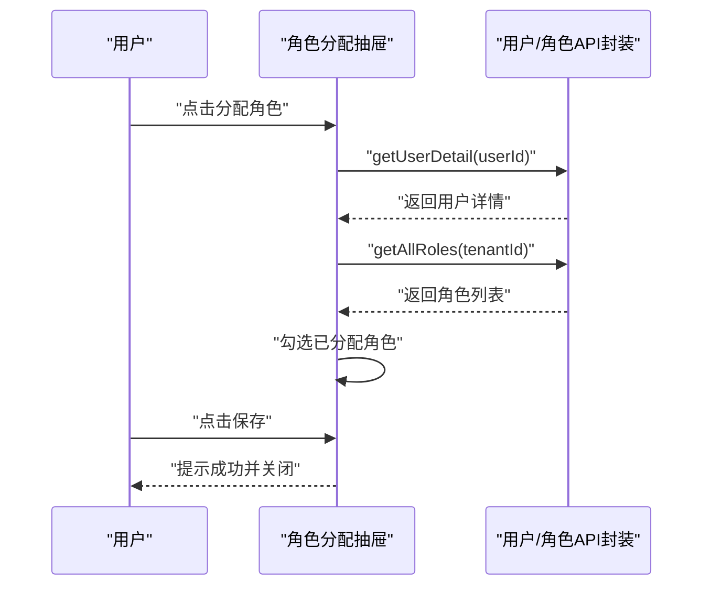
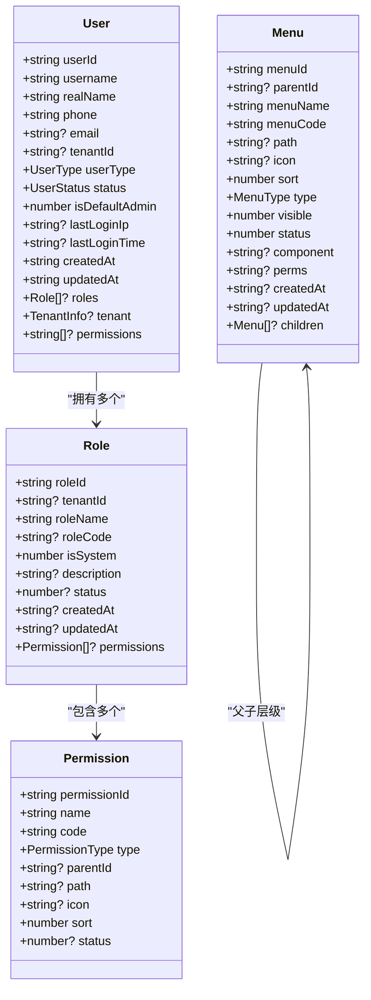
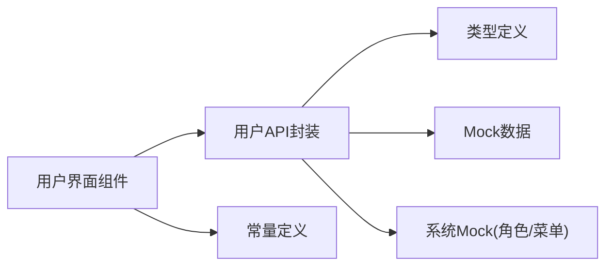

# 用户管理接口

<cite>
**本文引用的文件**
- [apps/pc/src/views/system/user/index.vue](file://apps/pc/src/views/system/user/index.vue)
- [apps/pc/src/views/system/user/components/UserFormDrawer.vue](file://apps/pc/src/views/system/user/components/UserFormDrawer.vue)
- [apps/pc/src/views/system/user/components/AssignRoleDrawer.vue](file://apps/pc/src/views/system/user/components/AssignRoleDrawer.vue)
- [packages/api/src/user.ts](file://packages/api/src/user.ts)
- [packages/api/src/mock/user.ts](file://packages/api/src/mock/user.ts)
- [packages/api/src/mock/system.ts](file://packages/api/src/mock/system.ts)
- [packages/types/src/user.ts](file://packages/types/src/user.ts)
- [packages/constants/src/user.ts](file://packages/constants/src/user.ts)
</cite>

## 目录
1. [简介](#简介)
2. [项目结构](#项目结构)
3. [核心组件](#核心组件)
4. [架构总览](#架构总览)
5. [详细组件分析](#详细组件分析)
6. [依赖关系分析](#依赖关系分析)
7. [性能考虑](#性能考虑)
8. [故障排查指南](#故障排查指南)
9. [结论](#结论)
10. [附录](#附录)

## 简介
本文件面向开发者，系统化梳理“用户管理”相关API与前端交互实现，覆盖以下能力：
- 用户信息查询与分页检索
- 用户资料修改与新增
- 用户状态管理（启用/停用）
- 用户权限与角色分配
- 角色与菜单/权限模型
- 数据模型、字段定义与校验规则
- 批量操作与搜索过滤
- 用户状态流转与角色继承机制

通过本文档，开发者可完整实现用户管理系统，并在前后端联调时快速定位接口与数据结构。

## 项目结构
用户管理功能由前端页面与组件、API封装层、类型定义与常量、以及Mock数据共同组成。核心路径如下：
- 前端页面与组件：apps/pc/src/views/system/user/*
- API封装：packages/api/src/user.ts
- 类型定义：packages/types/src/user.ts
- 常量定义：packages/constants/src/user.ts
- Mock数据：packages/api/src/mock/user.ts、packages/api/src/mock/system.ts

图表来源
- [apps/pc/src/views/system/user/index.vue:1-243](file://apps/pc/src/views/system/user/index.vue#L1-L243)
- [apps/pc/src/views/system/user/components/UserFormDrawer.vue:1-198](file://apps/pc/src/views/system/user/components/UserFormDrawer.vue#L1-L198)
- [apps/pc/src/views/system/user/components/AssignRoleDrawer.vue:1-124](file://apps/pc/src/views/system/user/components/AssignRoleDrawer.vue#L1-L124)
- [packages/api/src/user.ts:1-172](file://packages/api/src/user.ts#L1-L172)
- [packages/types/src/user.ts:1-191](file://packages/types/src/user.ts#L1-L191)
- [packages/constants/src/user.ts:1-24](file://packages/constants/src/user.ts#L1-L24)
- [packages/api/src/mock/user.ts:1-151](file://packages/api/src/mock/user.ts#L1-L151)
- [packages/api/src/mock/system.ts:1-584](file://packages/api/src/mock/system.ts#L1-L584)

章节来源
- [apps/pc/src/views/system/user/index.vue:1-243](file://apps/pc/src/views/system/user/index.vue#L1-L243)
- [packages/api/src/user.ts:1-172](file://packages/api/src/user.ts#L1-L172)
- [packages/types/src/user.ts:1-191](file://packages/types/src/user.ts#L1-L191)
- [packages/constants/src/user.ts:1-24](file://packages/constants/src/user.ts#L1-L24)
- [packages/api/src/mock/user.ts:1-151](file://packages/api/src/mock/user.ts#L1-L151)
- [packages/api/src/mock/system.ts:1-584](file://packages/api/src/mock/system.ts#L1-L584)

## 核心组件
- 用户列表页：提供搜索、分页、状态切换、重置密码、分配角色、删除等操作入口。
- 用户表单抽屉：支持新增与编辑用户，包含字段校验与提交逻辑。
- 角色分配抽屉：展示用户信息与可选角色列表，支持多选并提交保存。

章节来源
- [apps/pc/src/views/system/user/index.vue:1-243](file://apps/pc/src/views/system/user/index.vue#L1-L243)
- [apps/pc/src/views/system/user/components/UserFormDrawer.vue:1-198](file://apps/pc/src/views/system/user/components/UserFormDrawer.vue#L1-L198)
- [apps/pc/src/views/system/user/components/AssignRoleDrawer.vue:1-124](file://apps/pc/src/views/system/user/components/AssignRoleDrawer.vue#L1-L124)

## 架构总览
用户管理采用“前端组件 + API封装 + 类型约束 + Mock数据”的分层设计。前端组件通过API封装发起请求；API封装根据开关选择走Mock或真实后端；类型定义统一约束数据结构；常量定义提供UI映射与选项。

图表来源
- [packages/api/src/user.ts:26-81](file://packages/api/src/user.ts#L26-L81)
- [packages/api/src/mock/user.ts:75-150](file://packages/api/src/mock/user.ts#L75-L150)

章节来源
- [packages/api/src/user.ts:1-172](file://packages/api/src/user.ts#L1-L172)
- [packages/api/src/mock/user.ts:1-151](file://packages/api/src/mock/user.ts#L1-L151)

## 详细组件分析

### 用户列表页（用户管理主界面）
职责与行为
- 提供关键词（用户名/姓名/手机号）、用户类型、状态、所属商户等筛选条件。
- 支持分页加载与页码变更。
- 行内操作：编辑、重置密码、分配角色、删除（非默认管理员）。
- 状态切换：通过开关切换启用/停用，实时调用更新接口并回滚异常。

关键交互流程（状态切换）

图表来源
- [apps/pc/src/views/system/user/index.vue:215-223](file://apps/pc/src/views/system/user/index.vue#L215-L223)
- [packages/api/src/user.ts:74-81](file://packages/api/src/user.ts#L74-L81)

章节来源
- [apps/pc/src/views/system/user/index.vue:1-243](file://apps/pc/src/views/system/user/index.vue#L1-L243)
- [packages/api/src/user.ts:26-81](file://packages/api/src/user.ts#L26-L81)

### 用户表单抽屉（新增/编辑）
职责与行为
- 新增：必填项包括用户类型、所属商户（非平台类型时必填）、用户名（唯一）、初始密码、姓名、手机号、状态。
- 编辑：仅允许修改姓名、手机号、状态；用户名不可更改。
- 用户类型变化时，自动清空所属商户（平台类型无需商户）。
- 提交前进行表单校验，成功后提示并关闭抽屉。

字段校验要点
- 用户名必填且在租户内唯一（UI层面提示）。
- 手机号必填且符合中国大陆格式。
- 密码在新增时必填，编辑时不传入。
- 所属商户在用户类型非平台时必填。

图表来源
- [apps/pc/src/views/system/user/components/UserFormDrawer.vue:13-48](file://apps/pc/src/views/system/user/components/UserFormDrawer.vue#L13-L48)
- [apps/pc/src/views/system/user/components/UserFormDrawer.vue:158-188](file://apps/pc/src/views/system/user/components/UserFormDrawer.vue#L158-L188)

章节来源
- [apps/pc/src/views/system/user/components/UserFormDrawer.vue:1-198](file://apps/pc/src/views/system/user/components/UserFormDrawer.vue#L1-L198)
- [packages/constants/src/user.ts:1-24](file://packages/constants/src/user.ts#L1-L24)

### 角色分配抽屉（角色管理入口）
职责与行为
- 展示当前用户的基本信息（姓名/用户名）。
- 加载当前租户下的所有可用角色，勾选已分配角色。
- 提交后触发保存（当前实现为占位，后续接入角色分配接口）。

图表来源
- [apps/pc/src/views/system/user/components/AssignRoleDrawer.vue:69-95](file://apps/pc/src/views/system/user/components/AssignRoleDrawer.vue#L69-L95)
- [packages/api/src/user.ts:124-130](file://packages/api/src/user.ts#L124-L130)

章节来源
- [apps/pc/src/views/system/user/components/AssignRoleDrawer.vue:1-124](file://apps/pc/src/views/system/user/components/AssignRoleDrawer.vue#L1-L124)
- [packages/api/src/user.ts:124-130](file://packages/api/src/user.ts#L124-L130)

### API接口一览（用户/角色/菜单）
- 用户相关
  - 列表查询：GET /user/list（分页+关键词/状态/租户筛选）
  - 详情查询：GET /user/:userId
  - 新增用户：POST /user
  - 更新用户：POST /user/:userId
  - 删除用户：POST /user/:userId/delete
  - 重置密码：POST /user/:userId/reset-password
  - 更新状态：POST /user/:userId/status
- 角色相关
  - 列表查询：POST /role/list（分页+关键词/租户筛选）
  - 详情查询：GET /role/:roleId
  - 新增角色：POST /role
  - 更新角色：POST /role/:roleId
  - 删除角色：POST /role/:roleId/delete
  - 获取全部角色：GET /role/all?tenantId=...
- 菜单相关
  - 列表查询：GET /menu/list
  - 详情查询：GET /menu/:id
  - 新增菜单：POST /menu
  - 更新菜单：POST /menu/:id
  - 删除菜单：POST /menu/:id/delete

章节来源
- [packages/api/src/user.ts:26-171](file://packages/api/src/user.ts#L26-L171)

### 数据模型与字段定义
用户模型（User）
- 关键字段：userId、username、realName、phone、email、tenantId、userType、status、isDefaultAdmin、lastLoginIp、lastLoginTime、createdAt、updatedAt、roles、tenant、permissions
- 用户类型（UserType）：平台运营、租户超级管理员、租户普通子账号
- 用户状态（UserStatus）：启用、停用

角色模型（Role）
- 关键字段：roleId、tenantId、roleName、roleCode、isSystem、description、status、createdAt、updatedAt、permissions

权限与菜单
- 权限类型（PermissionType）：菜单、按钮、API
- 菜单类型（MenuType）：目录、菜单、按钮

图表来源
- [packages/types/src/user.ts:6-89](file://packages/types/src/user.ts#L6-L89)

章节来源
- [packages/types/src/user.ts:1-191](file://packages/types/src/user.ts#L1-L191)

### 搜索与过滤
- 用户列表支持关键词（用户名/姓名/手机号）模糊匹配。
- 支持按状态精确过滤。
- 支持按所属商户过滤。
- 分页参数：page、pageSize。

章节来源
- [packages/api/src/mock/user.ts:75-102](file://packages/api/src/mock/user.ts#L75-L102)
- [apps/pc/src/views/system/user/index.vue:137-142](file://apps/pc/src/views/system/user/index.vue#L137-L142)

### 批量操作与状态流转
- 批量操作：当前页面未提供批量勾选与批量处理按钮，建议在后续版本扩展。
- 状态流转：启用/停用双向切换，状态更新失败时自动回滚开关值。
- 默认管理员保护：默认管理员不可删除。

章节来源
- [apps/pc/src/views/system/user/index.vue:89-91](file://apps/pc/src/views/system/user/index.vue#L89-L91)
- [apps/pc/src/views/system/user/index.vue:215-223](file://apps/pc/src/views/system/user/index.vue#L215-L223)

## 依赖关系分析
- 前端组件依赖API封装与类型定义；UI常量用于展示映射。
- API封装依赖Mock数据（开发态）或真实后端（生产态）。
- 角色与菜单数据来自系统Mock，供角色分配抽屉使用。

图表来源
- [packages/api/src/user.ts:1-172](file://packages/api/src/user.ts#L1-L172)
- [packages/types/src/user.ts:1-191](file://packages/types/src/user.ts#L1-L191)
- [packages/constants/src/user.ts:1-24](file://packages/constants/src/user.ts#L1-L24)
- [packages/api/src/mock/system.ts:1-584](file://packages/api/src/mock/system.ts#L1-L584)

章节来源
- [packages/api/src/user.ts:1-172](file://packages/api/src/user.ts#L1-L172)
- [packages/api/src/mock/system.ts:1-584](file://packages/api/src/mock/system.ts#L1-L584)

## 性能考虑
- 列表分页：建议合理设置pageSize，避免一次性拉取过多数据。
- 搜索优化：关键词匹配在Mock层已实现，生产环境建议后端索引与分词优化。
- 状态切换：前端即时反馈，失败回滚，减少重复请求。
- 角色加载：一次性加载全部角色（Mock层限制上限），生产环境建议按需加载或分页。

## 故障排查指南
- 接口失败
  - 检查网络与跨域配置。
  - 查看控制台错误信息与消息提示。
- 用户不存在
  - 详情查询失败时会抛出错误，请检查userId是否正确。
- 删除失败
  - 默认管理员不可删除；系统角色不可删除。
- 状态更新失败
  - 状态切换失败时会自动回滚开关值，确认后端状态接口是否可达。

章节来源
- [packages/api/src/user.ts:33-40](file://packages/api/src/user.ts#L33-L40)
- [packages/api/src/user.ts:58-65](file://packages/api/src/user.ts#L58-L65)
- [packages/api/src/user.ts:74-81](file://packages/api/src/user.ts#L74-L81)
- [packages/api/src/mock/user.ts:137-150](file://packages/api/src/mock/user.ts#L137-L150)
- [packages/api/src/mock/system.ts:478-484](file://packages/api/src/mock/system.ts#L478-L484)

## 结论
本文档从架构、组件、接口、数据模型与校验规则等维度，全面阐述了用户管理相关能力。基于现有实现，开发者可直接对接Mock或替换为真实后端接口，快速完成用户CRUD、状态管理、角色分配与权限体系搭建。

## 附录

### API定义速览（用户/角色/菜单）
- 用户列表：GET /user/list（分页+keyword、userType、status、tenantId）
- 用户详情：GET /user/:userId
- 创建用户：POST /user
- 更新用户：POST /user/:userId
- 删除用户：POST /user/:userId/delete
- 重置密码：POST /user/:userId/reset-password
- 更新状态：POST /user/:userId/status
- 角色列表：POST /role/list（分页+keyword、tenantId）
- 角色详情：GET /role/:roleId
- 创建角色：POST /role
- 更新角色：POST /role/:roleId
- 删除角色：POST /role/:roleId/delete
- 获取全部角色：GET /role/all?tenantId=...
- 菜单列表：GET /menu/list
- 菜单详情：GET /menu/:id
- 创建菜单：POST /menu
- 更新菜单：POST /menu/:id
- 删除菜单：POST /menu/:id/delete

章节来源
- [packages/api/src/user.ts:26-171](file://packages/api/src/user.ts#L26-L171)