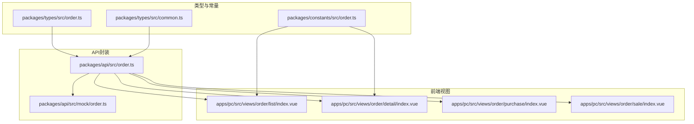
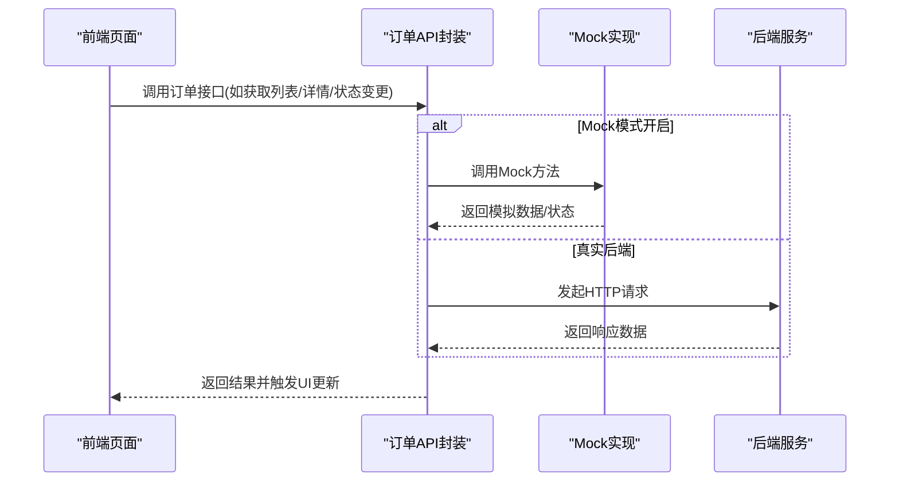
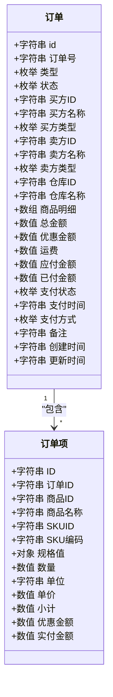
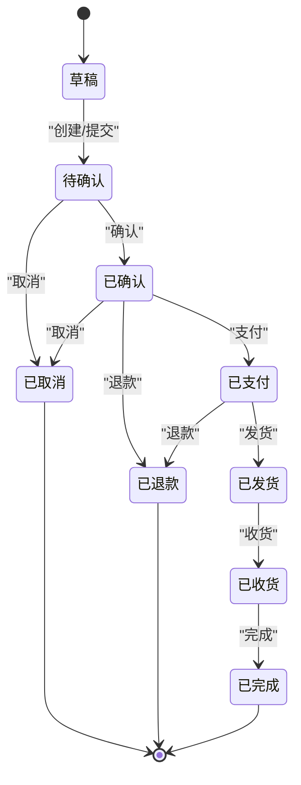
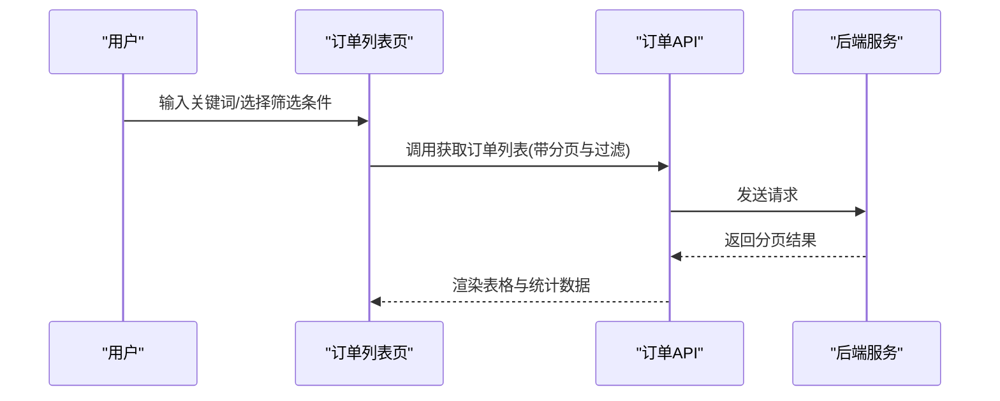
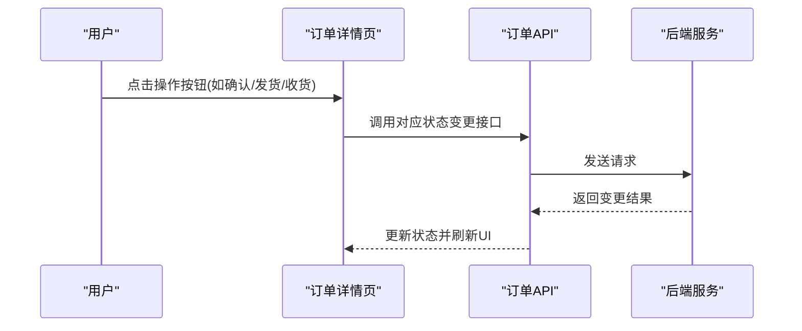
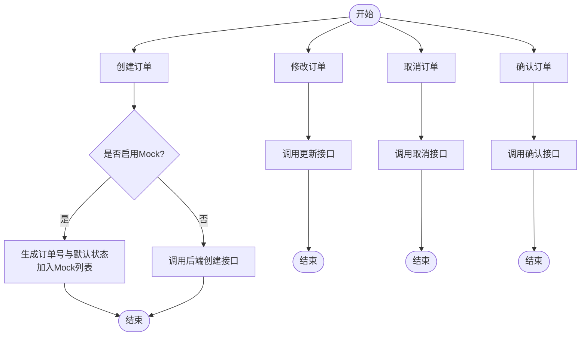
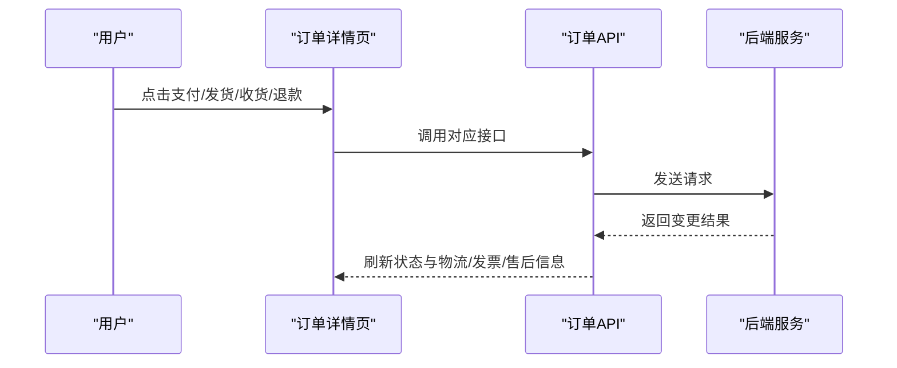
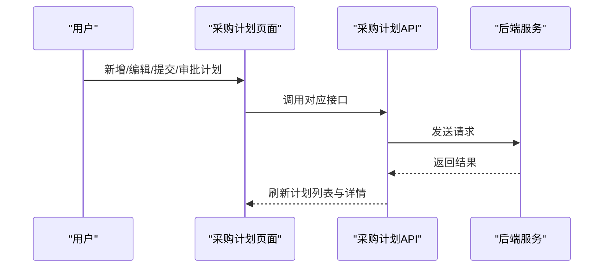
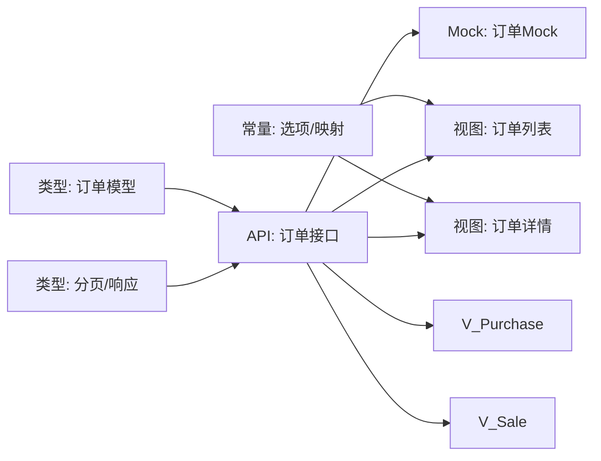

# 订单管理接口

<cite>
**本文档引用的文件**
- [packages/api/src/order.ts](file://packages/api/src/order.ts)
- [packages/types/src/order.ts](file://packages/types/src/order.ts)
- [packages/constants/src/order.ts](file://packages/constants/src/order.ts)
- [packages/api/src/mock/order.ts](file://packages/api/src/mock/order.ts)
- [apps/pc/src/views/order/detail/index.vue](file://apps/pc/src/views/order/detail/index.vue)
- [apps/pc/src/views/order/purchase/index.vue](file://apps/pc/src/views/order/purchase/index.vue)
- [apps/pc/src/views/order/sale/index.vue](file://apps/pc/src/views/order/sale/index.vue)
- [apps/pc/src/views/order/list/index.vue](file://apps/pc/src/views/order/list/index.vue)
- [packages/types/src/common.ts](file://packages/types/src/common.ts)
</cite>

## 目录
1. [简介](#简介)
2. [项目结构](#项目结构)
3. [核心组件](#核心组件)
4. [架构总览](#架构总览)
5. [详细组件分析](#详细组件分析)
6. [依赖关系分析](#依赖关系分析)
7. [性能考虑](#性能考虑)
8. [故障排除指南](#故障排除指南)
9. [结论](#结论)
10. [附录](#附录)

## 简介
本文件面向开发者，系统化梳理工程仓系统的订单管理相关API与前端实现，覆盖采购订单、销售订单、订单状态管理与查询等能力。文档从数据模型、状态机、接口定义到前端页面交互进行完整说明，并提供订单创建、修改、取消、确认、支付、发货、收货、退款等关键流程的操作示例路径，帮助快速实现完整的订单管理系统。

## 项目结构
围绕订单管理的关键代码分布在以下模块：
- 类型与常量层：定义订单数据模型、状态枚举、选项映射
- API封装层：统一暴露订单相关HTTP接口，支持Mock模式
- 前端视图层：提供订单列表、详情、采购/销售视角等页面

**图表来源**
- [packages/types/src/order.ts:1-124](file://packages/types/src/order.ts#L1-L124)
- [packages/types/src/common.ts:1-65](file://packages/types/src/common.ts#L1-L65)
- [packages/constants/src/order.ts:1-57](file://packages/constants/src/order.ts#L1-L57)
- [packages/api/src/order.ts:1-156](file://packages/api/src/order.ts#L1-L156)
- [packages/api/src/mock/order.ts:1-230](file://packages/api/src/mock/order.ts#L1-L230)
- [apps/pc/src/views/order/list/index.vue:1-197](file://apps/pc/src/views/order/list/index.vue#L1-L197)
- [apps/pc/src/views/order/detail/index.vue:1-800](file://apps/pc/src/views/order/detail/index.vue#L1-L800)
- [apps/pc/src/views/order/purchase/index.vue:1-402](file://apps/pc/src/views/order/purchase/index.vue#L1-L402)
- [apps/pc/src/views/order/sale/index.vue:1-547](file://apps/pc/src/views/order/sale/index.vue#L1-L547)

**章节来源**
- [packages/api/src/order.ts:1-156](file://packages/api/src/order.ts#L1-L156)
- [packages/types/src/order.ts:1-124](file://packages/types/src/order.ts#L1-L124)
- [packages/constants/src/order.ts:1-57](file://packages/constants/src/order.ts#L1-L57)
- [packages/api/src/mock/order.ts:1-230](file://packages/api/src/mock/order.ts#L1-L230)
- [apps/pc/src/views/order/list/index.vue:1-197](file://apps/pc/src/views/order/list/index.vue#L1-L197)
- [apps/pc/src/views/order/detail/index.vue:1-800](file://apps/pc/src/views/order/detail/index.vue#L1-L800)
- [apps/pc/src/views/order/purchase/index.vue:1-402](file://apps/pc/src/views/order/purchase/index.vue#L1-L402)
- [apps/pc/src/views/order/sale/index.vue:1-547](file://apps/pc/src/views/order/sale/index.vue#L1-L547)

## 核心组件
- 订单数据模型与枚举
  - 订单对象包含基础信息、买卖方信息、商品明细、金额与支付状态等字段
  - 订单类型、状态、支付状态、支付方式等均通过枚举定义
- 订单状态机与流转
  - 支持草稿、待确认、已确认、已支付、已发货、已收货、已完成、已取消、已退款等状态
  - 前端页面展示了不同角色视角下的状态流转与可执行操作
- 订单接口封装
  - 提供订单列表、详情、创建、更新、删除、确认、取消、支付、发货、收货、完成等接口
  - 支持Mock模式，便于本地开发与演示
- 常量与映射
  - 订单类型、状态、支付状态、支付方式的选项与颜色映射，用于前端展示

**章节来源**
- [packages/types/src/order.ts:3-124](file://packages/types/src/order.ts#L3-L124)
- [packages/constants/src/order.ts:1-57](file://packages/constants/src/order.ts#L1-L57)
- [packages/api/src/order.ts:14-156](file://packages/api/src/order.ts#L14-L156)
- [packages/api/src/mock/order.ts:144-230](file://packages/api/src/mock/order.ts#L144-L230)

## 架构总览
订单管理采用“类型/常量 + API封装 + 前端视图”的分层架构：
- 类型与常量层：统一定义数据结构与展示映射
- API封装层：抽象HTTP请求，屏蔽Mock与真实后端差异
- 前端视图层：根据角色与状态渲染不同的操作按钮与流程

**图表来源**
- [packages/api/src/order.ts:12-28](file://packages/api/src/order.ts#L12-L28)
- [packages/api/src/mock/order.ts:144-230](file://packages/api/src/mock/order.ts#L144-L230)

## 详细组件分析

### 数据模型与状态机
- 订单对象包含标识、类型、状态、买卖方、仓库、商品明细、金额与支付状态等字段
- 订单类型涵盖采购、销售、调拨、退货；状态覆盖从草稿到完成/取消/退款的全生命周期
- 支付状态与支付方式分别对应未支付、部分支付、已支付、退款中、已退款与余额、银行转账、支付宝、微信等

**图表来源**
- [packages/types/src/order.ts:3-44](file://packages/types/src/order.ts#L3-L44)

**章节来源**
- [packages/types/src/order.ts:3-124](file://packages/types/src/order.ts#L3-L124)

### 订单状态机与流转
- 状态机覆盖草稿、待确认、已确认、已支付、已发货、已收货、已完成、已取消、已退款
- 不同角色在不同状态下可执行的操作不同，前端页面明确标注了各状态下的可用动作

**图表来源**
- [packages/types/src/order.ts:53-62](file://packages/types/src/order.ts#L53-L62)
- [apps/pc/src/views/order/purchase/index.vue:128-141](file://apps/pc/src/views/order/purchase/index.vue#L128-L141)
- [apps/pc/src/views/order/sale/index.vue:197-209](file://apps/pc/src/views/order/sale/index.vue#L197-L209)

**章节来源**
- [packages/types/src/order.ts:53-62](file://packages/types/src/order.ts#L53-L62)
- [apps/pc/src/views/order/purchase/index.vue:126-141](file://apps/pc/src/views/order/purchase/index.vue#L126-L141)
- [apps/pc/src/views/order/sale/index.vue:197-209](file://apps/pc/src/views/order/sale/index.vue#L197-L209)

### 订单查询与列表
- 列表接口支持分页参数与关键词、类型、状态、买方/卖方过滤
- 前端页面提供多维度筛选与Tab分类统计，便于不同角色快速定位订单

**图表来源**
- [packages/api/src/order.ts:14-19](file://packages/api/src/order.ts#L14-L19)
- [apps/pc/src/views/order/list/index.vue:6-30](file://apps/pc/src/views/order/list/index.vue#L6-L30)

**章节来源**
- [packages/api/src/order.ts:14-19](file://packages/api/src/order.ts#L14-L19)
- [apps/pc/src/views/order/list/index.vue:6-30](file://apps/pc/src/views/order/list/index.vue#L6-L30)

### 订单详情与状态变更
- 详情页展示订单基本信息、买卖方信息、商品明细、金额与支付状态、发票与售后等扩展信息
- 根据当前状态显示相应操作按钮，如确认、发货、收货、完成、取消、申请开票、售后等

**图表来源**
- [apps/pc/src/views/order/detail/index.vue:14-35](file://apps/pc/src/views/order/detail/index.vue#L14-L35)
- [packages/api/src/order.ts:45-97](file://packages/api/src/order.ts#L45-L97)

**章节来源**
- [apps/pc/src/views/order/detail/index.vue:14-35](file://apps/pc/src/views/order/detail/index.vue#L14-L35)
- [packages/api/src/order.ts:45-97](file://packages/api/src/order.ts#L45-L97)

### 订单创建、修改、取消、确认
- 创建订单：通过API封装的创建方法传入订单数据，Mock模式下会生成新订单号与默认状态
- 修改订单：通过更新接口修改订单信息
- 取消订单：支持取消并返回错误提示或成功状态
- 确认订单：在Mock模式下更新状态为已确认

**图表来源**
- [packages/api/src/order.ts:30-61](file://packages/api/src/order.ts#L30-L61)
- [packages/api/src/mock/order.ts:185-213](file://packages/api/src/mock/order.ts#L185-L213)

**章节来源**
- [packages/api/src/order.ts:30-61](file://packages/api/src/order.ts#L30-L61)
- [packages/api/src/mock/order.ts:185-213](file://packages/api/src/mock/order.ts#L185-L213)

### 支付、发货、收货、退款状态变更
- 支付：标记订单为已支付
- 发货：更新为已发货并可填写物流信息
- 收货：确认收货并推进到已完成
- 退款：支持退款流程（前端页面提供申请入口）

**图表来源**
- [packages/api/src/order.ts:63-97](file://packages/api/src/order.ts#L63-L97)
- [apps/pc/src/views/order/detail/index.vue:17-34](file://apps/pc/src/views/order/detail/index.vue#L17-L34)

**章节来源**
- [packages/api/src/order.ts:63-97](file://packages/api/src/order.ts#L63-L97)
- [apps/pc/src/views/order/detail/index.vue:17-34](file://apps/pc/src/views/order/detail/index.vue#L17-L34)

### 采购计划管理
- 提供采购计划的增删改查与提交、审批等接口
- 前端页面展示计划状态与条目明细，支持执行中、完成、取消等状态

**图表来源**
- [packages/api/src/order.ts:115-155](file://packages/api/src/order.ts#L115-L155)

**章节来源**
- [packages/api/src/order.ts:115-155](file://packages/api/src/order.ts#L115-L155)

## 依赖关系分析
- 类型与常量被API封装与前端视图共同依赖
- API封装依赖Mock实现以支持本地开发
- 前端视图依赖常量映射与API封装进行数据展示与交互

**图表来源**
- [packages/types/src/order.ts:1-124](file://packages/types/src/order.ts#L1-L124)
- [packages/types/src/common.ts:1-65](file://packages/types/src/common.ts#L1-L65)
- [packages/constants/src/order.ts:1-57](file://packages/constants/src/order.ts#L1-L57)
- [packages/api/src/order.ts:1-156](file://packages/api/src/order.ts#L1-L156)
- [packages/api/src/mock/order.ts:1-230](file://packages/api/src/mock/order.ts#L1-L230)
- [apps/pc/src/views/order/list/index.vue:1-197](file://apps/pc/src/views/order/list/index.vue#L1-L197)
- [apps/pc/src/views/order/detail/index.vue:1-800](file://apps/pc/src/views/order/detail/index.vue#L1-L800)
- [apps/pc/src/views/order/purchase/index.vue:1-402](file://apps/pc/src/views/order/purchase/index.vue#L1-L402)
- [apps/pc/src/views/order/sale/index.vue:1-547](file://apps/pc/src/views/order/sale/index.vue#L1-L547)

**章节来源**
- [packages/types/src/order.ts:1-124](file://packages/types/src/order.ts#L1-L124)
- [packages/types/src/common.ts:1-65](file://packages/types/src/common.ts#L1-L65)
- [packages/constants/src/order.ts:1-57](file://packages/constants/src/order.ts#L1-L57)
- [packages/api/src/order.ts:1-156](file://packages/api/src/order.ts#L1-L156)
- [packages/api/src/mock/order.ts:1-230](file://packages/api/src/mock/order.ts#L1-L230)
- [apps/pc/src/views/order/list/index.vue:1-197](file://apps/pc/src/views/order/list/index.vue#L1-L197)
- [apps/pc/src/views/order/detail/index.vue:1-800](file://apps/pc/src/views/order/detail/index.vue#L1-L800)
- [apps/pc/src/views/order/purchase/index.vue:1-402](file://apps/pc/src/views/order/purchase/index.vue#L1-L402)
- [apps/pc/src/views/order/sale/index.vue:1-547](file://apps/pc/src/views/order/sale/index.vue#L1-L547)

## 性能考虑
- 列表查询建议合理设置分页大小，避免一次性加载过多数据
- Mock模式适合开发联调阶段，生产环境需切换至真实后端接口
- 前端页面对高频操作（如搜索、筛选、分页）应结合节流/防抖策略优化用户体验

## 故障排除指南
- 接口返回错误
  - 检查请求参数与鉴权头是否正确
  - 在Mock模式下，确认目标资源是否存在
- 状态变更失败
  - 确认当前订单状态允许该操作
  - 查看后端返回的错误码与消息
- 前端UI不更新
  - 确认调用接口后是否重新拉取数据并刷新表格/卡片

**章节来源**
- [packages/api/src/order.ts:45-61](file://packages/api/src/order.ts#L45-L61)
- [packages/api/src/mock/order.ts:215-229](file://packages/api/src/mock/order.ts#L215-L229)

## 结论
本项目通过清晰的类型定义、统一的API封装与丰富的前端页面，构建了完整的订单管理能力。开发者可基于现有接口与状态机快速实现订单的创建、查询、状态变更与业务扩展，同时借助Mock机制降低联调成本。

## 附录

### 订单接口一览（按功能分组）
- 查询与详情
  - 获取订单列表：[packages/api/src/order.ts:14-19](file://packages/api/src/order.ts#L14-L19)
  - 获取订单详情：[packages/api/src/order.ts:21-28](file://packages/api/src/order.ts#L21-L28)
- 订单生命周期
  - 创建订单：[packages/api/src/order.ts:30-35](file://packages/api/src/order.ts#L30-L35)
  - 更新订单：[packages/api/src/order.ts:37-43](file://packages/api/src/order.ts#L37-L43)
  - 删除订单：[packages/api/src/order.ts:41-43](file://packages/api/src/order.ts#L41-L43)
  - 确认订单：[packages/api/src/order.ts:45-52](file://packages/api/src/order.ts#L45-L52)
  - 取消订单：[packages/api/src/order.ts:54-61](file://packages/api/src/order.ts#L54-L61)
- 支付与物流
  - 支付订单：[packages/api/src/order.ts:63-70](file://packages/api/src/order.ts#L63-L70)
  - 发货订单：[packages/api/src/order.ts:72-79](file://packages/api/src/order.ts#L72-L79)
  - 收货订单：[packages/api/src/order.ts:81-88](file://packages/api/src/order.ts#L81-L88)
  - 完成订单：[packages/api/src/order.ts:90-97](file://packages/api/src/order.ts#L90-L97)
- 采购计划
  - 获取计划列表：[packages/api/src/order.ts:115-126](file://packages/api/src/order.ts#L115-L126)
  - 获取计划详情：[packages/api/src/order.ts:128-135](file://packages/api/src/order.ts#L128-L135)
  - 创建计划：[packages/api/src/order.ts:137-139](file://packages/api/src/order.ts#L137-L139)
  - 更新计划：[packages/api/src/order.ts:141-143](file://packages/api/src/order.ts#L141-L143)
  - 删除计划：[packages/api/src/order.ts:145-147](file://packages/api/src/order.ts#L145-L147)
  - 提交计划：[packages/api/src/order.ts:149-151](file://packages/api/src/order.ts#L149-L151)
  - 审批计划：[packages/api/src/order.ts:153-155](file://packages/api/src/order.ts#L153-L155)

### 前端页面与状态映射
- 订单列表页：[apps/pc/src/views/order/list/index.vue:1-197](file://apps/pc/src/views/order/list/index.vue#L1-L197)
- 订单详情页：[apps/pc/src/views/order/detail/index.vue:1-800](file://apps/pc/src/views/order/detail/index.vue#L1-L800)
- 采购视角订单页：[apps/pc/src/views/order/purchase/index.vue:1-402](file://apps/pc/src/views/order/purchase/index.vue#L1-L402)
- 销售视角订单页：[apps/pc/src/views/order/sale/index.vue:1-547](file://apps/pc/src/views/order/sale/index.vue#L1-L547)