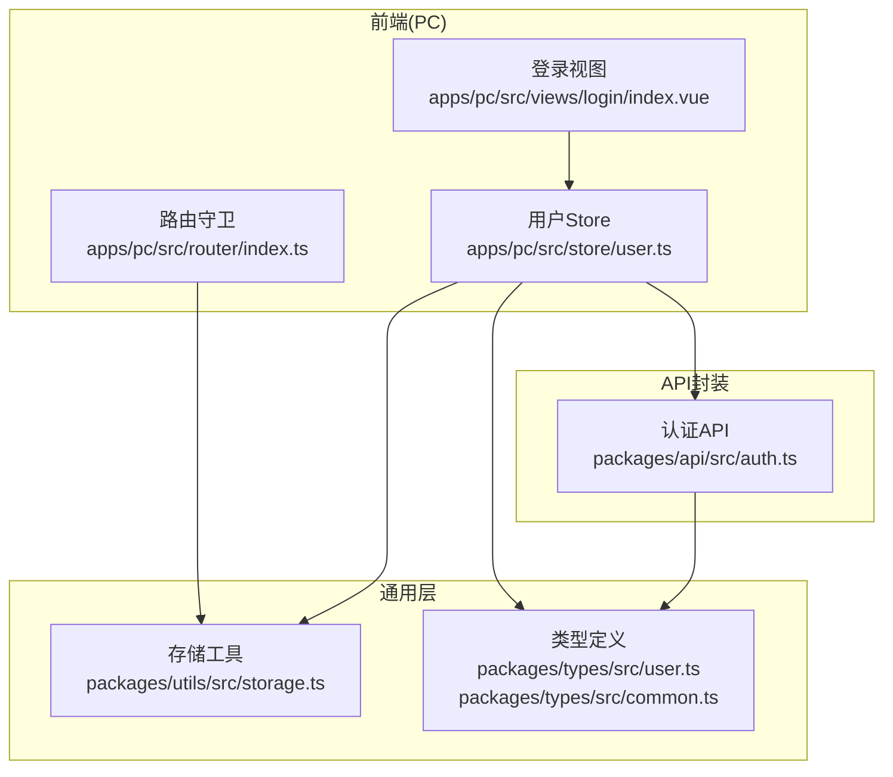
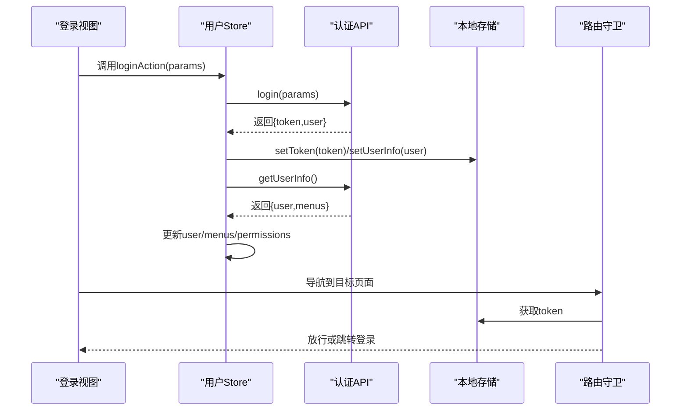
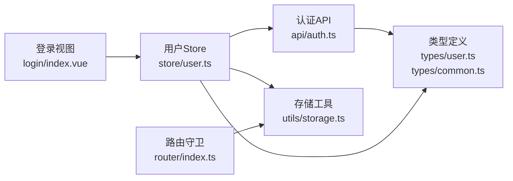

# 认证授权接口

<cite>
**本文档引用的文件**
- [packages/api/src/auth.ts](file://packages/api/src/auth.ts)
- [apps/pc/src/store/user.ts](file://apps/pc/src/store/user.ts)
- [packages/utils/src/storage.ts](file://packages/utils/src/storage.ts)
- [apps/pc/src/router/index.ts](file://apps/pc/src/router/index.ts)
- [apps/pc/src/views/login/index.vue](file://apps/pc/src/views/login/index.vue)
- [packages/types/src/user.ts](file://packages/types/src/user.ts)
- [packages/types/src/common.ts](file://packages/types/src/common.ts)
- [apps/pc/src/views/system/role/components/PermissionDrawer.vue](file://apps/pc/src/views/system/role/components/PermissionDrawer.vue)
</cite>

## 目录
1. [简介](#简介)
2. [项目结构](#项目结构)
3. [核心组件](#核心组件)
4. [架构总览](#架构总览)
5. [详细组件分析](#详细组件分析)
6. [依赖关系分析](#依赖关系分析)
7. [性能考虑](#性能考虑)
8. [故障排除指南](#故障排除指南)
9. [结论](#结论)

## 简介
本文件面向开发者，系统性梳理工程项目的认证授权相关API与前端实现，覆盖用户登录、登出、获取用户信息、刷新令牌、验证码等能力，并详细说明前端会话管理、路由守卫与权限控制流程。文档同时提供接口调用示例路径、参数校验规则、错误处理机制、认证中间件使用指南、权限拦截器实现思路与安全最佳实践，帮助开发者快速正确地实现用户认证与权限控制功能。

## 项目结构
认证授权相关的核心代码分布在以下模块：
- API封装层：统一暴露认证相关接口，支持Mock模式与真实后端切换
- 存储工具层：封装本地存储的令牌与用户信息读写
- 前端状态层：Pinia Store管理用户状态、菜单与权限
- 路由层：基于meta字段的路由守卫进行访问控制
- 视图层：登录页、权限配置抽屉等UI组件配合认证流程

图表来源
- [apps/pc/src/views/login/index.vue:147-188](file://apps/pc/src/views/login/index.vue#L147-L188)
- [apps/pc/src/router/index.ts:776-787](file://apps/pc/src/router/index.ts#L776-L787)
- [apps/pc/src/store/user.ts:35-111](file://apps/pc/src/store/user.ts#L35-L111)
- [packages/api/src/auth.ts:1-126](file://packages/api/src/auth.ts#L1-L126)
- [packages/utils/src/storage.ts:1-88](file://packages/utils/src/storage.ts#L1-L88)
- [packages/types/src/user.ts:131-149](file://packages/types/src/user.ts#L131-L149)
- [packages/types/src/common.ts:14-24](file://packages/types/src/common.ts#L14-L24)

章节来源
- [packages/api/src/auth.ts:1-126](file://packages/api/src/auth.ts#L1-L126)
- [apps/pc/src/store/user.ts:1-112](file://apps/pc/src/store/user.ts#L1-L112)
- [packages/utils/src/storage.ts:1-88](file://packages/utils/src/storage.ts#L1-L88)
- [apps/pc/src/router/index.ts:1-790](file://apps/pc/src/router/index.ts#L1-L790)
- [packages/types/src/user.ts:1-191](file://packages/types/src/user.ts#L1-L191)
- [packages/types/src/common.ts:1-65](file://packages/types/src/common.ts#L1-L65)

## 核心组件
- 认证API封装：提供登录、登出、刷新令牌、获取用户信息、验证码、修改密码等方法；支持Mock模式与真实后端切换
- 用户Store：集中管理用户状态、菜单、权限；封装登录、登出、获取用户信息动作；提供权限判断辅助函数
- 存储工具：封装令牌、刷新令牌、用户信息、商户信息的本地持久化读写
- 路由守卫：通过meta.requiresAuth控制访问权限，未登录自动跳转登录页
- 类型定义：统一LoginParams/LoginResult/UserInfo/ApiResponse等接口契约

章节来源
- [packages/api/src/auth.ts:86-125](file://packages/api/src/auth.ts#L86-L125)
- [apps/pc/src/store/user.ts:35-111](file://apps/pc/src/store/user.ts#L35-L111)
- [packages/utils/src/storage.ts:56-61](file://packages/utils/src/storage.ts#L56-L61)
- [apps/pc/src/router/index.ts:776-787](file://apps/pc/src/router/index.ts#L776-L787)
- [packages/types/src/user.ts:131-149](file://packages/types/src/user.ts#L131-L149)
- [packages/types/src/common.ts:14-24](file://packages/types/src/common.ts#L14-L24)

## 架构总览
认证授权整体流程如下：
- 登录：前端收集用户名/密码，调用API封装层登录接口；成功后将令牌与用户信息写入本地存储并更新Store；随后拉取用户信息与菜单权限
- 路由守卫：每次导航前检查是否需要认证，若未登录则跳转登录页
- 权限控制：前端根据用户权限动态渲染菜单与按钮；后端应配合返回的权限集合进行接口级校验
- 刷新令牌：在令牌过期前调用刷新接口以获取新令牌
- 登出：调用登出接口并清除本地存储与Store状态

图表来源
- [apps/pc/src/views/login/index.vue:173-187](file://apps/pc/src/views/login/index.vue#L173-L187)
- [apps/pc/src/store/user.ts:40-73](file://apps/pc/src/store/user.ts#L40-L73)
- [packages/api/src/auth.ts:86-117](file://packages/api/src/auth.ts#L86-L117)
- [apps/pc/src/router/index.ts:776-787](file://apps/pc/src/router/index.ts#L776-L787)

## 详细组件分析

### 认证API封装（packages/api/src/auth.ts）
- 登录(login)：支持Mock模式直接校验用户名/密码并生成模拟token；非Mock模式调用POST /auth/login
- 登出(logout)：调用POST /auth/logout
- 刷新令牌(refreshToken)：调用POST /auth/refresh，传入refreshToken
- 获取用户信息(getUserInfo)：支持Mock模式返回固定用户与菜单；非Mock模式调用GET /auth/user-info
- 验证码(getCaptcha)：调用GET /auth/captcha
- 修改密码(changePassword)：调用POST /auth/change-password

参数与返回类型参考类型定义：
- LoginParams：用户名、密码、可选验证码与验证码Key
- LoginResult：令牌、可选刷新令牌、过期间隔、用户对象
- UserInfo：用户对象与菜单数组

章节来源
- [packages/api/src/auth.ts:86-125](file://packages/api/src/auth.ts#L86-L125)
- [packages/types/src/user.ts:131-149](file://packages/types/src/user.ts#L131-L149)

### 用户Store（apps/pc/src/store/user.ts）
- loginAction：根据环境变量决定Mock或真实登录；成功后设置令牌与用户信息并更新Store
- getUserInfoAction：获取用户信息与菜单权限，填充Store
- logoutAction：调用后端登出（如非Mock），随后清空本地存储与Store状态并跳转登录页
- 权限判断：hasPermission/hasPermissions用于前端按钮级与页面级权限控制

章节来源
- [apps/pc/src/store/user.ts:35-111](file://apps/pc/src/store/user.ts#L35-L111)

### 本地存储工具（packages/utils/src/storage.ts）
- 令牌管理：getToken/setToken/removeToken/getRefreshToken/setRefreshToken/removeRefreshToken
- 用户信息：getUserInfo/setUserInfo/removeUserInfo
- 商户信息：getMerchantInfo/setMerchantInfo/removeMerchantInfo
- 清理：clearAuth一次性清除认证相关本地数据

章节来源
- [packages/utils/src/storage.ts:1-88](file://packages/utils/src/storage.ts#L1-L88)

### 路由守卫（apps/pc/src/router/index.ts）
- beforeEach：读取meta.requiresAuth，若需要认证且无token则跳转登录页并携带redirect参数
- 登录页路由：requiresAuth=false，允许未登录访问

章节来源
- [apps/pc/src/router/index.ts:776-787](file://apps/pc/src/router/index.ts#L776-L787)

### 登录视图（apps/pc/src/views/login/index.vue）
- 表单校验：用户名/密码必填
- 登录流程：提交后调用Store.loginAction与getUserInfoAction，成功后根据redirect或默认跳转
- Mock开关：通过环境变量控制是否走Mock逻辑

章节来源
- [apps/pc/src/views/login/index.vue:163-187](file://apps/pc/src/views/login/index.vue#L163-L187)

### 权限配置抽屉（apps/pc/src/views/system/role/components/PermissionDrawer.vue）
- 权限树：展示权限树结构，支持勾选保存
- 数据源：权限树结构与权限编码示例

章节来源
- [apps/pc/src/views/system/role/components/PermissionDrawer.vue:52-96](file://apps/pc/src/views/system/role/components/PermissionDrawer.vue#L52-L96)

## 依赖关系分析
认证授权相关模块之间的依赖关系如下：

图表来源
- [apps/pc/src/views/login/index.vue:147-188](file://apps/pc/src/views/login/index.vue#L147-L188)
- [apps/pc/src/store/user.ts:35-111](file://apps/pc/src/store/user.ts#L35-L111)
- [packages/api/src/auth.ts:1-126](file://packages/api/src/auth.ts#L1-L126)
- [packages/utils/src/storage.ts:1-88](file://packages/utils/src/storage.ts#L1-L88)
- [apps/pc/src/router/index.ts:776-787](file://apps/pc/src/router/index.ts#L776-L787)
- [packages/types/src/user.ts:131-149](file://packages/types/src/user.ts#L131-L149)
- [packages/types/src/common.ts:14-24](file://packages/types/src/common.ts#L14-L24)

章节来源
- [apps/pc/src/views/login/index.vue:147-188](file://apps/pc/src/views/login/index.vue#L147-L188)
- [apps/pc/src/store/user.ts:35-111](file://apps/pc/src/store/user.ts#L35-L111)
- [packages/api/src/auth.ts:1-126](file://packages/api/src/auth.ts#L1-L126)
- [packages/utils/src/storage.ts:1-88](file://packages/utils/src/storage.ts#L1-L88)
- [apps/pc/src/router/index.ts:776-787](file://apps/pc/src/router/index.ts#L776-L787)
- [packages/types/src/user.ts:131-149](file://packages/types/src/user.ts#L131-L149)
- [packages/types/src/common.ts:14-24](file://packages/types/src/common.ts#L14-L24)

## 性能考虑
- 本地存储：令牌与用户信息均使用localStorage，读写开销低；建议避免频繁序列化大对象
- Mock模式：仅用于开发调试，生产环境需关闭Mock并接入真实后端
- 路由守卫：每次导航都会读取token，建议保持简单判断逻辑，避免复杂计算
- 权限判断：前端权限判断仅用于界面渲染，接口层仍需严格鉴权

## 故障排除指南
- 登录失败
  - 检查用户名/密码是否为空
  - Mock模式下确认用户名与密码是否匹配
  - 非Mock模式检查网络请求与后端响应
- 无法访问受保护页面
  - 确认路由meta.requiresAuth配置
  - 检查本地是否存在有效token
- 权限按钮不显示
  - 检查用户权限集合是否包含对应权限
  - 确认hasPermission/hasPermissions判断逻辑
- 登出后仍可访问
  - 确认logoutAction已调用clearAuth并跳转登录页
  - 检查路由守卫是否生效

章节来源
- [apps/pc/src/views/login/index.vue:168-187](file://apps/pc/src/views/login/index.vue#L168-L187)
- [apps/pc/src/store/user.ts:75-91](file://apps/pc/src/store/user.ts#L75-L91)
- [apps/pc/src/router/index.ts:776-787](file://apps/pc/src/router/index.ts#L776-L787)

## 结论
本项目采用“前端Store + API封装 + 本地存储 + 路由守卫”的认证授权方案，结合Mock与真实后端切换，满足开发与生产的不同阶段需求。通过明确的类型定义与权限判断辅助函数，前端实现了良好的用户体验与安全边界。建议在后端完善接口级鉴权与审计日志，确保系统整体安全性。