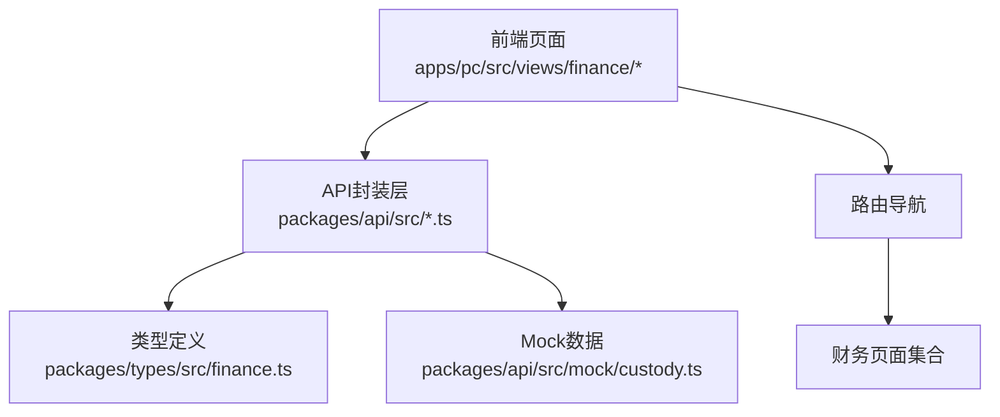
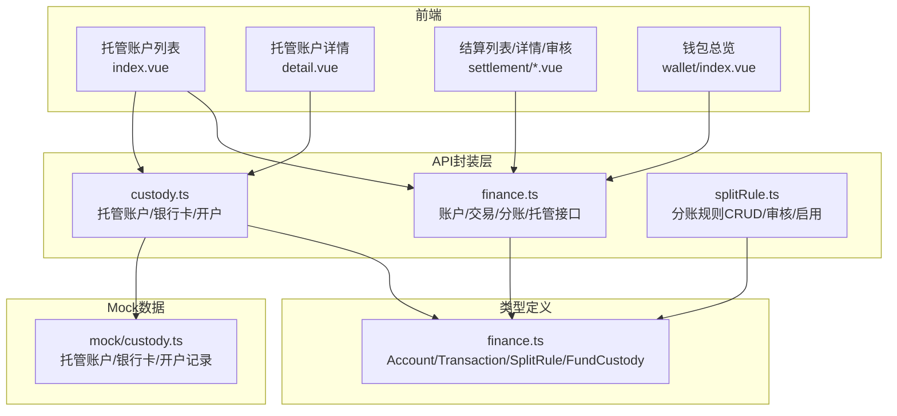
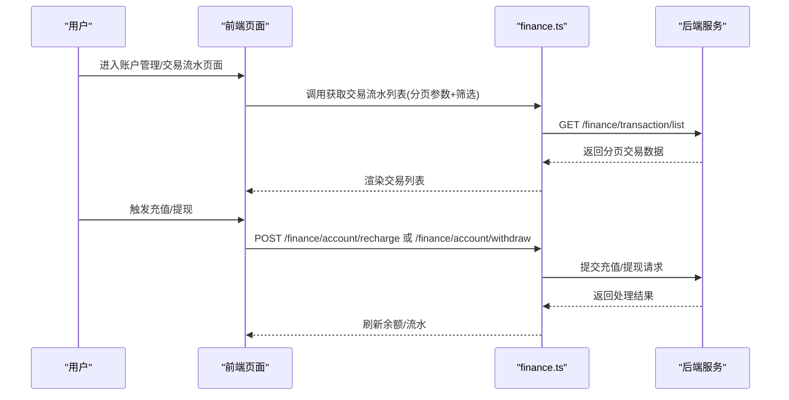
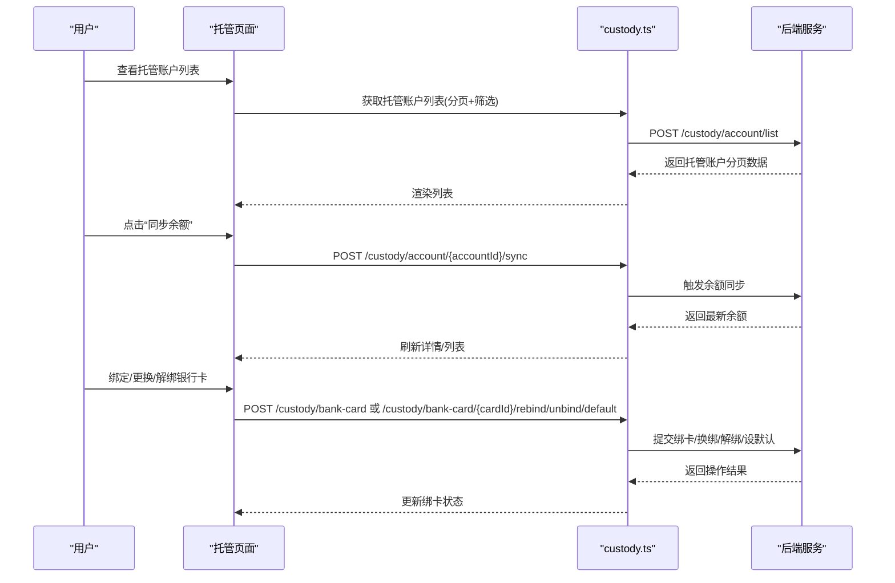
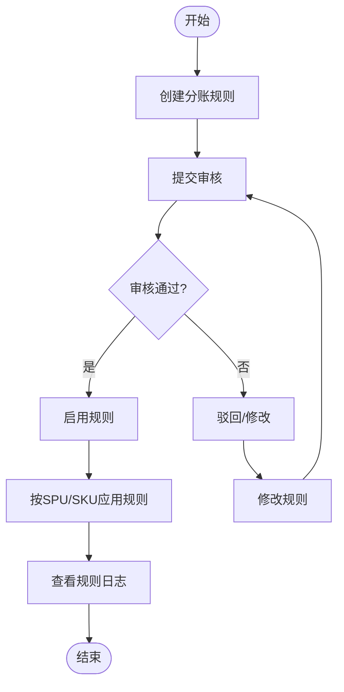
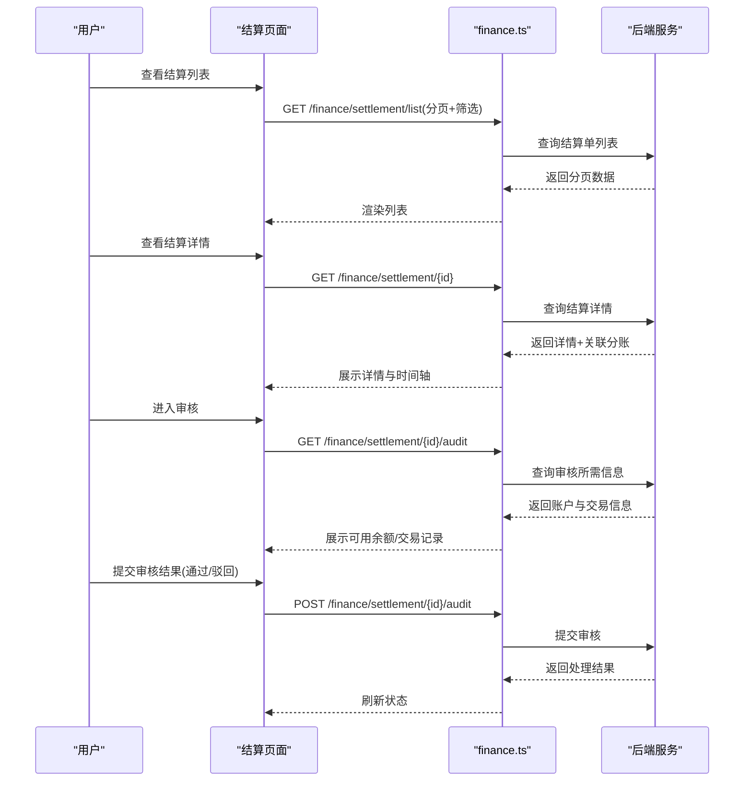
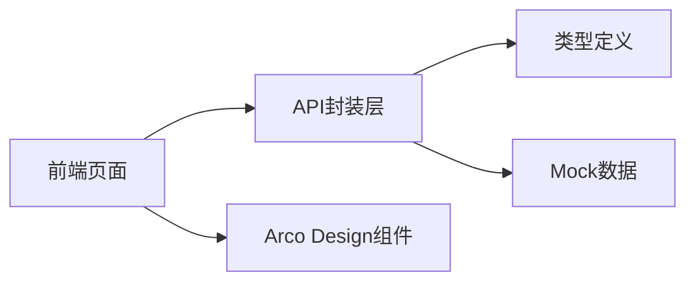
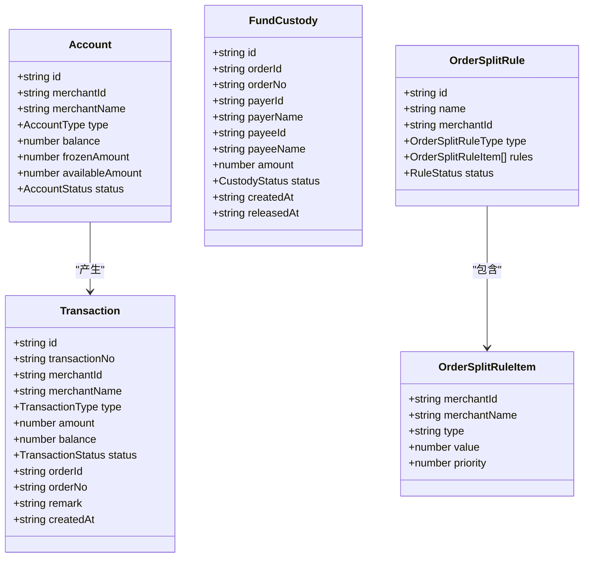

# 财务管理接口

<cite>
**本文档引用的文件**
- [packages/api/src/finance.ts](file://packages/api/src/finance.ts)
- [packages/api/src/custody.ts](file://packages/api/src/custody.ts)
- [packages/api/src/splitRule.ts](file://packages/api/src/splitRule.ts)
- [packages/types/src/finance.ts](file://packages/types/src/finance.ts)
- [apps/pc/src/views/finance/custody/index.vue](file://apps/pc/src/views/finance/custody/index.vue)
- [apps/pc/src/views/finance/custody/detail.vue](file://apps/pc/src/views/finance/custody/detail.vue)
- [apps/pc/src/views/finance/settlement/index.vue](file://apps/pc/src/views/finance/settlement/index.vue)
- [apps/pc/src/views/finance/settlement/detail.vue](file://apps/pc/src/views/finance/settlement/detail.vue)
- [apps/pc/src/views/finance/settlement/audit.vue](file://apps/pc/src/views/finance/settlement/audit.vue)
- [apps/pc/src/views/finance/wallet/index.vue](file://apps/pc/src/views/finance/wallet/index.vue)
- [packages/api/src/mock/custody.ts](file://packages/api/src/mock/custody.ts)
</cite>

## 目录
1. [简介](#简介)
2. [项目结构](#项目结构)
3. [核心组件](#核心组件)
4. [架构总览](#架构总览)
5. [详细组件分析](#详细组件分析)
6. [依赖关系分析](#依赖关系分析)
7. [性能考虑](#性能考虑)
8. [故障排查指南](#故障排查指南)
9. [结论](#结论)
10. [附录](#附录)

## 简介
本文件面向开发者，系统化梳理财务管理相关API与前端页面，覆盖账户管理、资金流水、分账规则、结算管理、发票管理、资金托管等模块。文档从接口定义、数据模型、调用流程、错误处理、性能优化、故障排查等方面进行深入说明，并提供可视化图示帮助快速理解系统架构与关键业务流程。

## 项目结构
财务相关能力主要分布在以下位置：
- 类型定义：packages/types/src/finance.ts 定义账户、交易、分账规则、资金托管等核心数据模型
- API封装：packages/api/src 下的 finance.ts、custody.ts、splitRule.ts 提供统一的HTTP请求封装
- 前端页面：apps/pc/src/views/finance 下的各子模块页面，如托管、结算、钱包等
- Mock数据：packages/api/src/mock/custody.ts 提供托管相关模拟数据，便于联调与演示

图表来源
- [apps/pc/src/views/finance/custody/index.vue:1-222](file://apps/pc/src/views/finance/custody/index.vue#L1-L222)
- [packages/api/src/finance.ts:1-55](file://packages/api/src/finance.ts#L1-L55)
- [packages/api/src/custody.ts:1-98](file://packages/api/src/custody.ts#L1-L98)
- [packages/api/src/splitRule.ts:1-132](file://packages/api/src/splitRule.ts#L1-L132)
- [packages/types/src/finance.ts:1-95](file://packages/types/src/finance.ts#L1-L95)
- [packages/api/src/mock/custody.ts:1-172](file://packages/api/src/mock/custody.ts#L1-L172)

章节来源
- [packages/types/src/finance.ts:1-95](file://packages/types/src/finance.ts#L1-L95)
- [packages/api/src/finance.ts:1-55](file://packages/api/src/finance.ts#L1-L55)
- [packages/api/src/custody.ts:1-98](file://packages/api/src/custody.ts#L1-L98)
- [packages/api/src/splitRule.ts:1-132](file://packages/api/src/splitRule.ts#L1-L132)
- [apps/pc/src/views/finance/custody/index.vue:1-222](file://apps/pc/src/views/finance/custody/index.vue#L1-L222)

## 核心组件
- 账户管理：提供账户列表、详情、充值、提现、交易流水查询等能力
- 资金托管：提供托管账户列表、详情、开户申请、绑卡、余额同步等能力
- 分账规则：提供分账规则的增删改查、审核、启用/停用、日志查询等能力
- 结算管理：提供结算单列表、详情、审核流程、导出等功能
- 发票管理：提供发票输入/输出页面（基于现有页面）
- 银行对接与第三方支付：通过托管账户与银行卡绑定实现，结合充值/提现流程
- 财务报表：钱包总览、账户统计等页面展示财务指标

章节来源
- [packages/api/src/finance.ts:1-55](file://packages/api/src/finance.ts#L1-L55)
- [packages/api/src/custody.ts:1-98](file://packages/api/src/custody.ts#L1-L98)
- [packages/api/src/splitRule.ts:1-132](file://packages/api/src/splitRule.ts#L1-L132)
- [apps/pc/src/views/finance/custody/index.vue:1-222](file://apps/pc/src/views/finance/custody/index.vue#L1-L222)
- [apps/pc/src/views/finance/custody/detail.vue:1-511](file://apps/pc/src/views/finance/custody/detail.vue#L1-L511)
- [apps/pc/src/views/finance/settlement/index.vue:1-263](file://apps/pc/src/views/finance/settlement/index.vue#L1-L263)
- [apps/pc/src/views/finance/settlement/detail.vue:1-159](file://apps/pc/src/views/finance/settlement/detail.vue#L1-L159)
- [apps/pc/src/views/finance/settlement/audit.vue:1-168](file://apps/pc/src/views/finance/settlement/audit.vue#L1-L168)
- [apps/pc/src/views/finance/wallet/index.vue:1-389](file://apps/pc/src/views/finance/wallet/index.vue#L1-L389)

## 架构总览
财务系统采用“前端页面 + API封装层 + 类型定义 + Mock数据”的分层架构。前端页面通过API封装层调用后端接口；API封装层使用统一的HTTP工具方法；类型定义保证前后端数据一致性；Mock数据用于演示与联调。

图表来源
- [apps/pc/src/views/finance/custody/index.vue:1-222](file://apps/pc/src/views/finance/custody/index.vue#L1-L222)
- [apps/pc/src/views/finance/custody/detail.vue:1-511](file://apps/pc/src/views/finance/custody/detail.vue#L1-L511)
- [apps/pc/src/views/finance/settlement/index.vue:1-263](file://apps/pc/src/views/finance/settlement/index.vue#L1-L263)
- [apps/pc/src/views/finance/settlement/detail.vue:1-159](file://apps/pc/src/views/finance/settlement/detail.vue#L1-L159)
- [apps/pc/src/views/finance/settlement/audit.vue:1-168](file://apps/pc/src/views/finance/settlement/audit.vue#L1-L168)
- [apps/pc/src/views/finance/wallet/index.vue:1-389](file://apps/pc/src/views/finance/wallet/index.vue#L1-L389)
- [packages/api/src/finance.ts:1-55](file://packages/api/src/finance.ts#L1-L55)
- [packages/api/src/custody.ts:1-98](file://packages/api/src/custody.ts#L1-L98)
- [packages/api/src/splitRule.ts:1-132](file://packages/api/src/splitRule.ts#L1-L132)
- [packages/types/src/finance.ts:1-95](file://packages/types/src/finance.ts#L1-L95)
- [packages/api/src/mock/custody.ts:1-172](file://packages/api/src/mock/custody.ts#L1-L172)

## 详细组件分析

### 账户管理与资金流水
- 接口职责
  - 获取账户列表与详情
  - 账户充值与提现
  - 查询交易流水（支持分页与筛选）
- 数据模型
  - Account：账户基础信息（余额、冻结金额、可用余额、状态）
  - Transaction：交易流水（类型、金额、余额、状态、关联订单等）
- 典型流程
  - 前端在账户管理页面加载账户列表，点击账户进入详情，查看交易流水与统计
  - 支持按商户、类型等条件筛选交易流水

图表来源
- [packages/api/src/finance.ts:1-55](file://packages/api/src/finance.ts#L1-L55)
- [apps/pc/src/views/finance/wallet/index.vue:1-389](file://apps/pc/src/views/finance/wallet/index.vue#L1-L389)

章节来源
- [packages/api/src/finance.ts:1-55](file://packages/api/src/finance.ts#L1-L55)
- [packages/types/src/finance.ts:1-95](file://packages/types/src/finance.ts#L1-L95)
- [apps/pc/src/views/finance/wallet/index.vue:1-389](file://apps/pc/src/views/finance/wallet/index.vue#L1-L389)

### 资金托管机制
- 接口职责
  - 托管账户列表、详情、按租户查询
  - 开户申请/重试
  - 银行卡列表、详情、绑卡/换绑/设默认/解绑
  - 余额同步
- 数据模型
  - CustodyAccount：托管账户（账户状态、开户状态、绑卡状态、可用/冻结/总余额、最后同步时间）
  - CustodyBankCard：银行卡信息（银行名称、账号、账户名、卡类型、绑定状态、默认标记）
  - CustodyOpenRecord：开户申请记录（申请类型、提交/审核时间、状态、失败原因、重试次数）
- 流程说明
  - 托管账户列表支持按关键字、状态筛选；支持同步余额
  - 托管账户详情包含账户统计、交易记录、绑卡记录、开户记录、充值/提现记录等
  - 银行卡管理支持默认卡设置与解绑

图表来源
- [packages/api/src/custody.ts:1-98](file://packages/api/src/custody.ts#L1-L98)
- [packages/types/src/finance.ts:1-95](file://packages/types/src/finance.ts#L1-L95)
- [apps/pc/src/views/finance/custody/index.vue:1-222](file://apps/pc/src/views/finance/custody/index.vue#L1-L222)
- [apps/pc/src/views/finance/custody/detail.vue:1-511](file://apps/pc/src/views/finance/custody/detail.vue#L1-L511)
- [packages/api/src/mock/custody.ts:1-172](file://packages/api/src/mock/custody.ts#L1-L172)

章节来源
- [packages/api/src/custody.ts:1-98](file://packages/api/src/custody.ts#L1-L98)
- [packages/types/src/finance.ts:1-95](file://packages/types/src/finance.ts#L1-L95)
- [apps/pc/src/views/finance/custody/index.vue:1-222](file://apps/pc/src/views/finance/custody/index.vue#L1-L222)
- [apps/pc/src/views/finance/custody/detail.vue:1-511](file://apps/pc/src/views/finance/custody/detail.vue#L1-L511)
- [packages/api/src/mock/custody.ts:1-172](file://packages/api/src/mock/custody.ts#L1-L172)

### 分账规则管理
- 接口职责
  - 分账规则列表、详情
  - 创建、更新、删除规则
  - 提交审核、审核通过/驳回
  - 启用/停用规则
  - 查询规则日志
  - 按SPU/SKU查询规则
- 数据模型
  - SplitRule：分账规则（分类、状态、规则项等）
  - SplitRuleLog：规则变更日志
- 流程说明
  - 规则创建后需提交审核，审核通过后可启用
  - 支持按关键词、分类、状态筛选规则
  - 支持按SPU/SKU维度查询适用规则

图表来源
- [packages/api/src/splitRule.ts:1-132](file://packages/api/src/splitRule.ts#L1-L132)
- [packages/types/src/finance.ts:1-95](file://packages/types/src/finance.ts#L1-L95)

章节来源
- [packages/api/src/splitRule.ts:1-132](file://packages/api/src/splitRule.ts#L1-L132)
- [packages/types/src/finance.ts:1-95](file://packages/types/src/finance.ts#L1-L95)

### 结算管理
- 功能点
  - 结算单列表：支持按单号、商户、状态、日期范围查询；支持导出
  - 结算详情：展示基本信息、处理记录（时间轴）、关联分账记录
  - 结算审核：展示账户余额/冻结金额/可用余额、近期交易记录；支持通过/驳回
- 流程说明
  - 商户提交结算申请 → 平台审核 → 处理中 → 到账
  - 审核时校验可用余额与结算金额，支持查看最近交易记录辅助判断

图表来源
- [packages/api/src/finance.ts:1-55](file://packages/api/src/finance.ts#L1-L55)
- [apps/pc/src/views/finance/settlement/index.vue:1-263](file://apps/pc/src/views/finance/settlement/index.vue#L1-L263)
- [apps/pc/src/views/finance/settlement/detail.vue:1-159](file://apps/pc/src/views/finance/settlement/detail.vue#L1-L159)
- [apps/pc/src/views/finance/settlement/audit.vue:1-168](file://apps/pc/src/views/finance/settlement/audit.vue#L1-L168)

章节来源
- [packages/api/src/finance.ts:1-55](file://packages/api/src/finance.ts#L1-L55)
- [apps/pc/src/views/finance/settlement/index.vue:1-263](file://apps/pc/src/views/finance/settlement/index.vue#L1-L263)
- [apps/pc/src/views/finance/settlement/detail.vue:1-159](file://apps/pc/src/views/finance/settlement/detail.vue#L1-L159)
- [apps/pc/src/views/finance/settlement/audit.vue:1-168](file://apps/pc/src/views/finance/settlement/audit.vue#L1-L168)

### 发票管理
- 页面职责
  - 发票输入/输出页面：展示发票相关操作入口与列表
- 说明
  - 发票管理页面已存在，具体接口可根据业务扩展至发票申请、开票、作废等流程

章节来源
- [apps/pc/src/views/finance/invoice/input.vue](file://apps/pc/src/views/finance/invoice/input.vue)
- [apps/pc/src/views/finance/invoice/output.vue](file://apps/pc/src/views/finance/invoice/output.vue)

### 银行对接与第三方支付
- 实现要点
  - 通过托管账户与银行卡绑定实现银行对接
  - 充值/提现流程依托托管账户与银行卡信息
  - 支付方式区分银行转账与在线支付
- 建议
  - 在线支付可通过第三方支付网关集成，充值/提现流程与托管账户联动

章节来源
- [packages/api/src/custody.ts:1-98](file://packages/api/src/custody.ts#L1-L98)
- [packages/types/src/finance.ts:1-95](file://packages/types/src/finance.ts#L1-L95)
- [apps/pc/src/views/finance/custody/detail.vue:1-511](file://apps/pc/src/views/finance/custody/detail.vue#L1-L511)

### 财务报表生成
- 页面职责
  - 钱包总览：展示商户账户总余额、工程仓/供应商数量、活跃商户等指标
  - 账户统计：展示月度充值、提现、收入、支出等统计
- 建议
  - 报表数据可从交易流水与账户变动中聚合生成，支持导出Excel

章节来源
- [apps/pc/src/views/finance/wallet/index.vue:1-389](file://apps/pc/src/views/finance/wallet/index.vue#L1-L389)
- [apps/pc/src/views/finance/custody/detail.vue:1-511](file://apps/pc/src/views/finance/custody/detail.vue#L1-L511)

## 依赖关系分析
- 组件耦合
  - 前端页面依赖API封装层；API封装层依赖类型定义；Mock数据为API层提供测试支撑
- 外部依赖
  - 使用统一HTTP工具方法封装GET/POST请求
  - 使用Arco Design组件库渲染UI
- 可能的循环依赖
  - 当前结构清晰，未发现循环依赖迹象

图表来源
- [apps/pc/src/views/finance/custody/index.vue:1-222](file://apps/pc/src/views/finance/custody/index.vue#L1-L222)
- [packages/api/src/finance.ts:1-55](file://packages/api/src/finance.ts#L1-L55)
- [packages/api/src/custody.ts:1-98](file://packages/api/src/custody.ts#L1-L98)
- [packages/api/src/splitRule.ts:1-132](file://packages/api/src/splitRule.ts#L1-L132)
- [packages/types/src/finance.ts:1-95](file://packages/types/src/finance.ts#L1-L95)
- [packages/api/src/mock/custody.ts:1-172](file://packages/api/src/mock/custody.ts#L1-L172)

章节来源
- [packages/api/src/finance.ts:1-55](file://packages/api/src/finance.ts#L1-L55)
- [packages/api/src/custody.ts:1-98](file://packages/api/src/custody.ts#L1-L98)
- [packages/api/src/splitRule.ts:1-132](file://packages/api/src/splitRule.ts#L1-L132)
- [packages/types/src/finance.ts:1-95](file://packages/types/src/finance.ts#L1-L95)
- [packages/api/src/mock/custody.ts:1-172](file://packages/api/src/mock/custody.ts#L1-L172)

## 性能考虑
- 分页与筛选
  - 交易流水、账户列表、结算单等均支持分页与多维筛选，建议合理设置pageSize并缓存常用筛选条件
- 批量操作
  - 托管余额同步提供批量提示，实际实现可考虑并发优化与进度反馈
- 数据渲染
  - 大列表场景建议虚拟滚动与懒加载，减少首屏压力
- 接口幂等
  - 充值/提现/审核等关键操作应具备幂等性与重试机制，避免重复执行

## 故障排查指南
- 常见问题
  - 托管账户不存在：当根据租户或账户ID查询不到托管账户时，会返回错误提示
  - 规则状态不允许：分账规则更新/删除/启用/停用需满足前置状态条件
  - 审核必填项缺失：结算审核时若选择驳回需填写驳回原因
- 建议
  - 前端统一拦截错误消息并提示用户
  - 对关键流程增加加载态与防重复提交
  - 记录操作日志，便于定位问题

章节来源
- [packages/api/src/custody.ts:28-44](file://packages/api/src/custody.ts#L28-L44)
- [packages/api/src/splitRule.ts:59-73](file://packages/api/src/splitRule.ts#L59-L73)
- [apps/pc/src/views/finance/settlement/audit.vue:115-129](file://apps/pc/src/views/finance/settlement/audit.vue#L115-L129)

## 结论
本财务系统以清晰的分层架构实现了账户管理、资金托管、分账规则、结算管理、发票管理与报表展示等核心能力。通过统一的API封装与类型定义，前端页面可稳定地调用后端接口；Mock数据为联调与演示提供了便利。建议后续完善真实银行对接与第三方支付集成，并持续优化性能与用户体验。

## 附录
- 数据模型类图

图表来源
- [packages/types/src/finance.ts:1-95](file://packages/types/src/finance.ts#L1-L95)