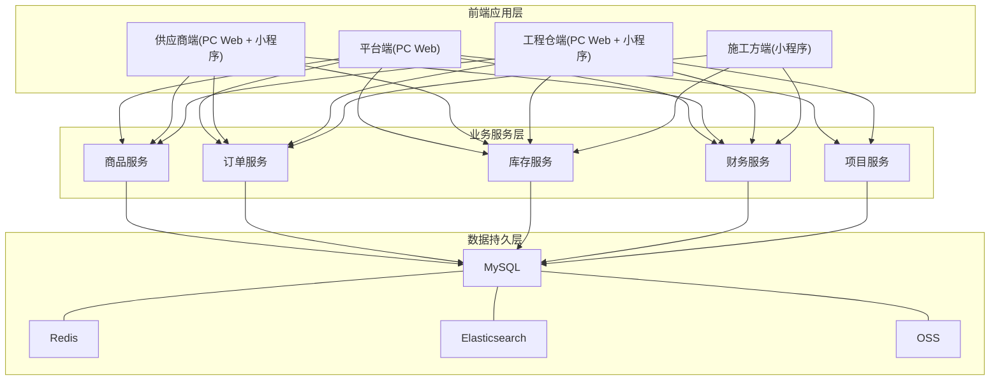
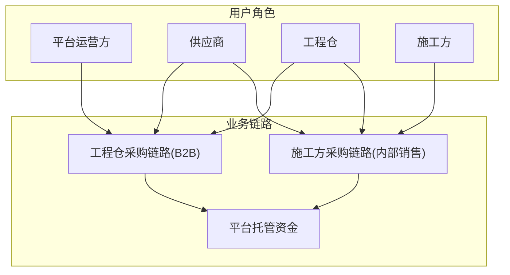
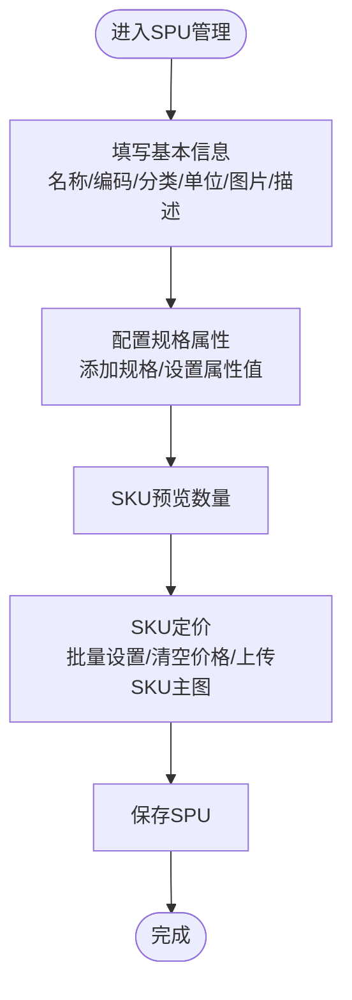
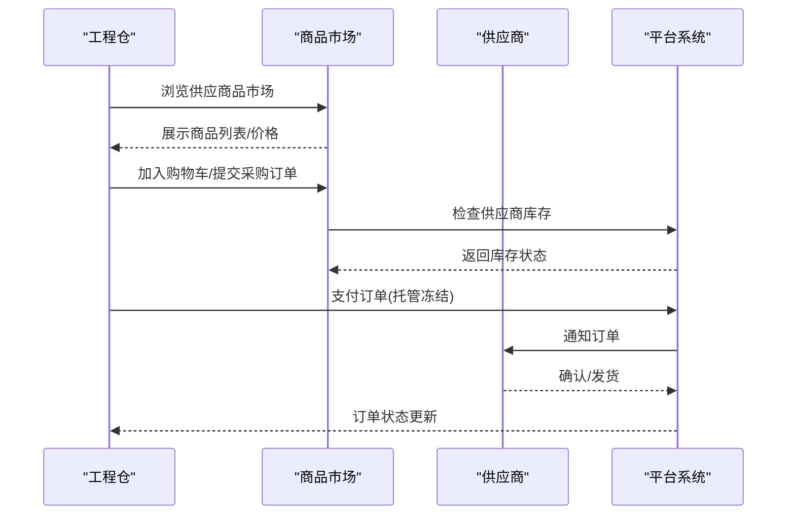
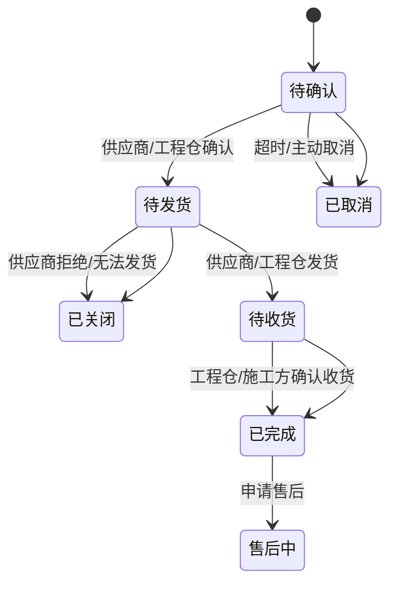
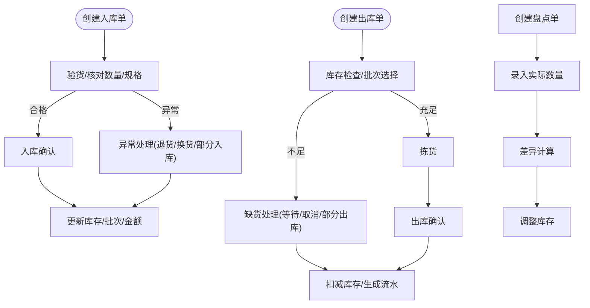
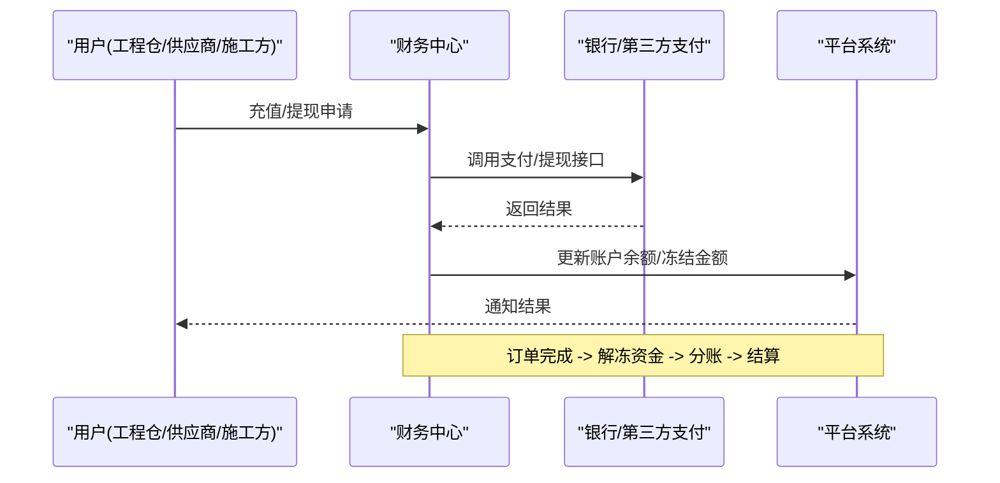
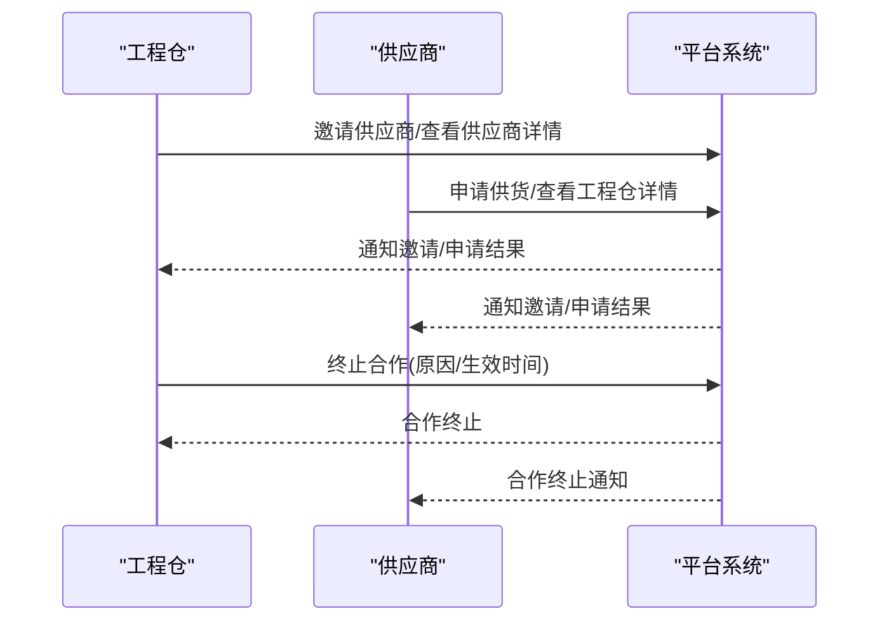
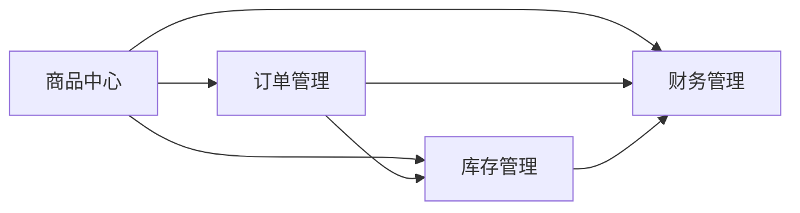

# 业务功能详解

<cite>
**本文档引用的文件**
- [系统概览与架构.md](file://docs/PRD/01-系统概览与架构.md)
- [业务流程设计.md](file://docs/PRD/02-业务流程设计.md)
- [数据模型与表结构.md](file://docs/PRD/03-数据模型与表结构.md)
- [商品板块功能清单.md](file://docs/PRD/06-商品板块功能清单.md)
- [平台端商品中心功能清单.md](file://docs/PRD/07-平台端商品中心功能清单.md)
- [供应商供货与工程仓配置功能详细设计.md](file://docs/PRD/13-供应商供货与工程仓配置功能详细设计.md)
- [SPU管理功能详细设计.md](file://docs/PRD/18-SPU管理功能详细设计.md)
- [平台商品下架删除影响分析.md](file://docs/PRD/23-平台商品下架删除影响分析.md)
</cite>

## 目录
1. [引言](#引言)
2. [项目结构](#项目结构)
3. [核心组件](#核心组件)
4. [架构总览](#架构总览)
5. [详细组件分析](#详细组件分析)
6. [依赖分析](#依赖分析)
7. [性能考虑](#性能考虑)
8. [故障排查指南](#故障排查指南)
9. [结论](#结论)
10. [附录](#附录)

## 引言
本文件面向工程材料管理采供一体化平台，围绕商品中心（SPU/SKU管理、规格属性、供应商供货）、商品市场（供应商品市场、销售商品市场、BOM基装包）、订单管理（采购订单、销售订单、订单状态流转）、库存管理（库存总览、出入库管理、盘点管理）、财务管理（资金托管、分账管理、结算管理、发票管理）等核心业务模块，提供从流程、操作步骤、数据模型、权限控制到异常处理的系统化说明，并辅以业务场景示例与最佳实践，帮助研发与运营团队高效落地与稳定运行。

## 项目结构
平台采用“四端一体”架构：平台端（PC Web）、供应商端（PC Web + 小程序）、工程仓端（PC Web + 小程序）、施工方端（小程序）。业务按模块划分，前端页面覆盖商品、市场、订单、库存、财务、项目、领料等模块；后端通过业务服务层（商品服务、订单服务、库存服务、财务服务、项目服务）支撑多端协同。

**图表来源**
- [系统概览与架构.md](file://docs/PRD/01-系统概览与架构.md)

**章节来源**
- [系统概览与架构.md](file://docs/PRD/01-系统概览与架构.md)

## 核心组件
- 商品中心：商品分类、规格属性、SPU/SKU、供应商供货、商品审核、价格管理、上下架管理、数据统计、配置与日志审计。
- 商品市场：供应商品市场、销售商品市场、BOM基装包、价格策略、分类展示配置。
- 订单管理：采购订单、销售订单、状态流转、履约跟踪。
- 库存管理：库存总览、入库/出库、批次管理、盘点、调拨、现场库存。
- 财务管理：资金托管、分账、结算、账单、发票、财务报表。
- 项目与领料：项目管理、进度管理、领料申请/退料/报废、现场库存。

**章节来源**
- [系统概览与架构.md](file://docs/PRD/01-系统概览与架构.md)
- [业务流程设计.md](file://docs/PRD/02-业务流程设计.md)

## 架构总览
平台采用前后端分离与多端协同架构，业务服务层通过统一接口支撑四端应用；数据层采用关系型数据库（MySQL）承载核心业务数据，结合缓存（Redis）、搜索引擎（Elasticsearch）与对象存储（OSS），满足高并发与海量数据场景。

**图表来源**
- [业务流程设计.md](file://docs/PRD/02-业务流程设计.md)

**章节来源**
- [业务流程设计.md](file://docs/PRD/02-业务流程设计.md)

## 详细组件分析

### 商品中心（SPU/SKU/规格属性/供应商供货/审核/价格）
- 商品分类管理：支持分类树形展示、层级管理、启用/禁用、排序、导入导出。
- 规格属性管理：支持属性与属性值的维护、输入类型、排序、启用/禁用。
- SPU管理：三步式创建（基本信息→规格属性→SKU定价），支持批量设置价格、清空价格、SKU图片上传、删除前校验（SKU/供货关系/订单）。
- SKU管理：支持SKU列表查询、详情查看、编辑、删除、启用/禁用、批量生成。
- 供应商供货：工程仓邀请/供应商申请建立供货关系，支持正式/试用合作类型、有效期、供货商品与价格管理、批量价格调整、协议管理（创建/签署/终止）。
- 商品审核：支持待审核列表、审核详情、审核通过/拒绝、批量审核、审核记录查询。
- 价格管理：支持供货价格列表、详情、设置、调整、审核、历史查询。
- 上下架管理：支持手动/定时上下架、批量上下架、上下架记录查询。
- 数据统计与配置：商品数量/销量/库存/价格统计、图片/编码/价格/库存配置、通知配置。
- 日志审计：操作日志查询、详情、导出、归档、删除、统计。

**图表来源**
- [SPU管理功能详细设计.md](file://docs/PRD/18-SPU管理功能详细设计.md)

**章节来源**
- [商品板块功能清单.md](file://docs/PRD/06-商品板块功能清单.md)
- [平台端商品中心功能清单.md](file://docs/PRD/07-平台端商品中心功能清单.md)
- [SPU管理功能详细设计.md](file://docs/PRD/18-SPU管理功能详细设计.md)
- [平台商品下架删除影响分析.md](file://docs/PRD/23-平台商品下架删除影响分析.md)

### 商品市场（供应商品市场/销售商品市场/BOM基装包）
- 供应商品市场：工程仓侧浏览供应商商品、加入购物车、下单、支付（托管冻结）、订单状态跟踪。
- 销售商品市场：施工方侧选择项目、浏览工程仓商品/BOM包、加入购物车、下单、支付（托管冻结）、订单状态跟踪。
- BOM基装包：BOM包管理、商品组合、价格策略、下单流程。

**图表来源**
- [业务流程设计.md](file://docs/PRD/02-业务流程设计.md)

**章节来源**
- [业务流程设计.md](file://docs/PRD/02-业务流程设计.md)

### 订单管理（采购/销售/状态流转）
- 采购订单：工程仓向供应商下单、审核、供应商接单/拒绝、发货、工程仓收货、售后处理。
- 销售订单：施工方向工程仓下单、审核、工程仓接单/拒绝、发货、施工方收货、售后处理。
- 状态流转：待确认→待发货→待收货→已完成；异常状态（已取消/已关闭/售后中）及资金状态联动。

**图表来源**
- [业务流程设计.md](file://docs/PRD/02-业务流程设计.md)

**章节来源**
- [业务流程设计.md](file://docs/PRD/02-业务流程设计.md)

### 库存管理（总览/出入库/盘点/调拨/现场库存）
- 库存总览：按仓库/商品/SKU查询库存、锁定数量、成本价、库存金额。
- 入库管理：采购入库/退货入库/调拨入库/其他入库，支持入库单创建、验货、异常处理、批次管理、库存更新。
- 出库管理：销售出库/调拨出库/报损出库/其他出库，支持库存检查、拣货、出库确认、批次扣减。
- 盘点管理：全盘/抽盘，支持录入实际数量、差异计算、调整库存。
- 调拨管理：跨仓库调拨，记录调拨单与库存变动。
- 现场库存（施工方）：项目现场库存登记、入库/出库、盘点、退料/报废流程。

**图表来源**
- [业务流程设计.md](file://docs/PRD/02-业务流程设计.md)
- [数据模型与表结构.md](file://docs/PRD/03-数据模型与表结构.md)

**章节来源**
- [业务流程设计.md](file://docs/PRD/02-业务流程设计.md)
- [数据模型与表结构.md](file://docs/PRD/03-数据模型与表结构.md)

### 财务管理（托管/分账/结算/发票/报表）
- 资金托管：工程仓/供应商/施工方账户，支持充值、提现、冻结/解冻、流水记录。
- 分账管理：按规则分配平台服务费、供应商收益，支持分账配置、分账执行、分账记录。
- 结算管理：结算周期、结算单生成、结算明细、结算状态、结算记录。
- 发票管理：进项/销项发票、发票申请、发票状态、发票归档。
- 财务报表：收入/支出/利润统计、平台服务费统计、账户余额统计。

**图表来源**
- [业务流程设计.md](file://docs/PRD/02-业务流程设计.md)
- [数据模型与表结构.md](file://docs/PRD/03-数据模型与表结构.md)

**章节来源**
- [业务流程设计.md](file://docs/PRD/02-业务流程设计.md)
- [数据模型与表结构.md](file://docs/PRD/03-数据模型与表结构.md)

### 供应商供货与工程仓配置
- 供应商管理（工程仓视角）：供应商列表、邀请供应商、查看详情、终止合作。
- 供应商管理（供应商视角）：工程仓列表、申请供货、供货商品管理、价格调整、批量调整。
- 供货协议：协议创建、内容填写、电子/线下签署、协议终止。
- 供货评价：商品质量、交货速度、服务态度、价格合理性评价。

**图表来源**
- [供应商供货与工程仓配置功能详细设计.md](file://docs/PRD/13-供应商供货与工程仓配置功能详细设计.md)

**章节来源**
- [供应商供货与工程仓配置功能详细设计.md](file://docs/PRD/13-供应商供货与工程仓配置功能详细设计.md)

## 依赖分析
- 模块耦合：商品中心与订单/库存/财务存在强耦合（SPU/SKU影响订单与库存、价格影响财务结算）。
- 外部依赖：支付/短信/邮件/电子签章等第三方服务集成。
- 数据一致性：通过事务与幂等设计保障订单、库存、财务数据一致性。

**图表来源**
- [系统概览与架构.md](file://docs/PRD/01-系统概览与架构.md)
- [数据模型与表结构.md](file://docs/PRD/03-数据模型与表结构.md)

**章节来源**
- [系统概览与架构.md](file://docs/PRD/01-系统概览与架构.md)
- [数据模型与表结构.md](file://docs/PRD/03-数据模型与表结构.md)

## 性能考虑
- 列表查询：为SPU/SKU/订单/库存等高频查询建立索引，分页加载，延迟加载图片。
- SKU生成：前端预生成笛卡尔积，限制SKU数量，避免超大规模组合。
- 图片优化：压缩、CDN加速、统一尺寸。
- 缓存策略：分类树、SPU详情、属性列表缓存，降低数据库压力。
- 并发控制：订单创建/库存扣减/资金冻结采用分布式锁或乐观锁，防止超卖与重复扣款。

## 故障排查指南
- 商品下架/删除影响：下架不破坏历史数据，删除会级联删除供货关系与分账规则；删除前需校验SKU/供货关系/分账规则/历史订单。
- 订单异常：超时未确认自动取消、库存不足导致已关闭、收货后资金解冻并分账；售后中状态需人工介入。
- 库存异常：盘点差异需记录原因并调整；批次过期需预警与处理。
- 财务异常：资金冻结/解冻失败需重试与对账；分账失败需重跑分账任务。

**章节来源**
- [平台商品下架删除影响分析.md](file://docs/PRD/23-平台商品下架删除影响分析.md)
- [业务流程设计.md](file://docs/PRD/02-业务流程设计.md)

## 结论
本平台通过清晰的模块划分与严谨的业务流程设计，实现了从商品到订单、从库存到财务的全链路闭环。建议在实施过程中重点关注数据一致性、权限控制与异常处理，结合性能优化与监控告警，确保系统稳定与用户体验。

## 附录
- 术语定义：SPU（标准产品单元）、SKU（库存量单位）、BOM（物料清单）、托管账户、分账、资金冻结/解冻。
- 版本与状态：文档版本v1.1，状态评审中。