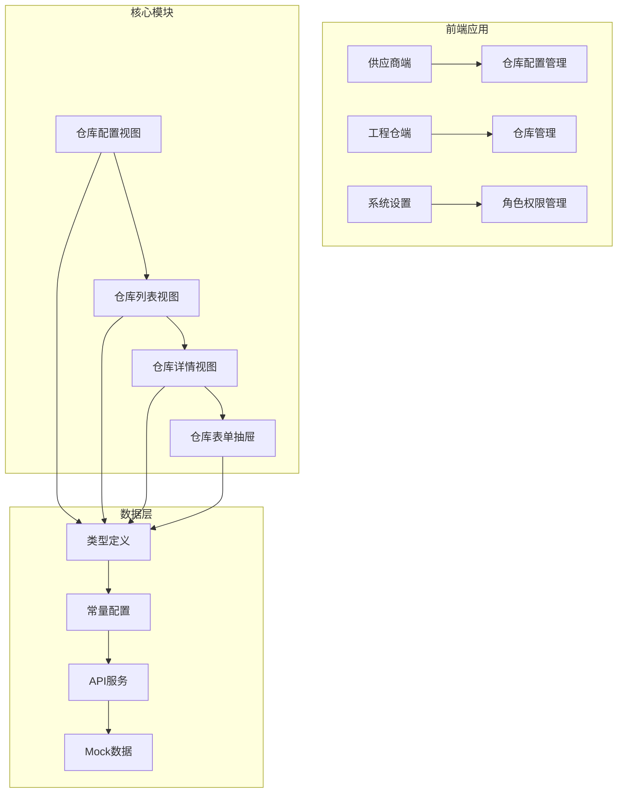
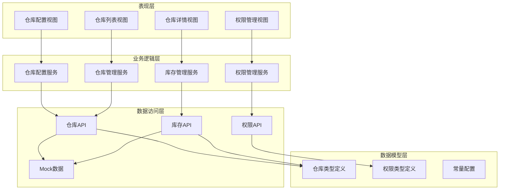
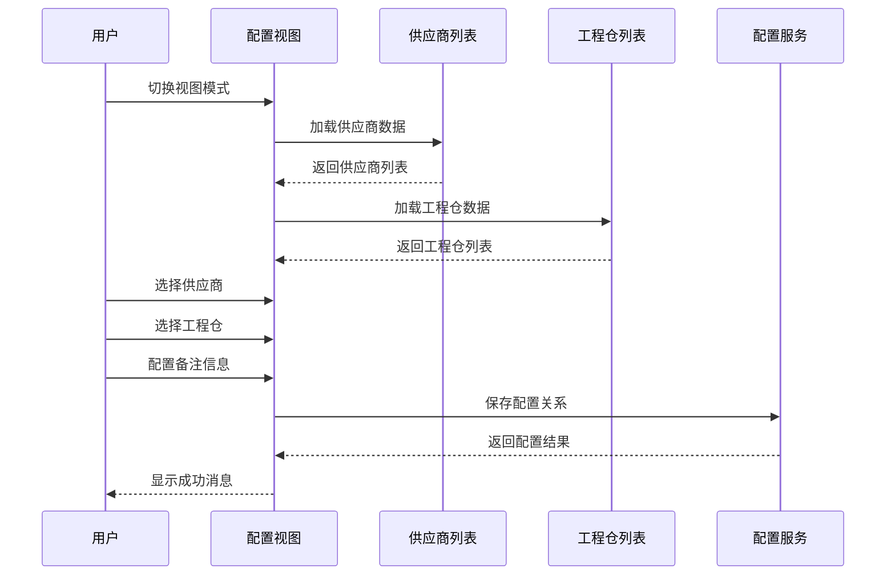
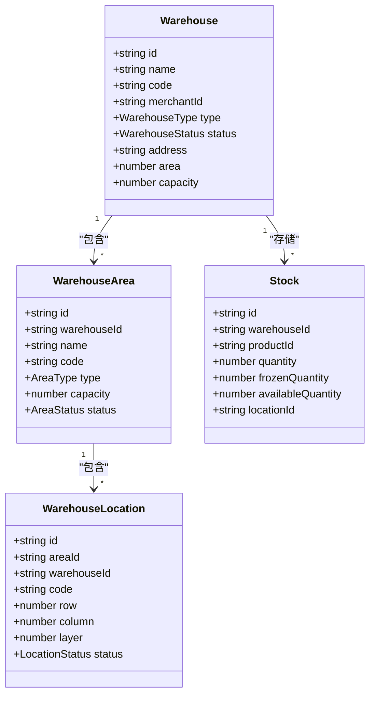
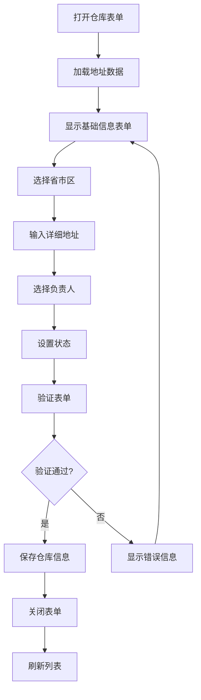
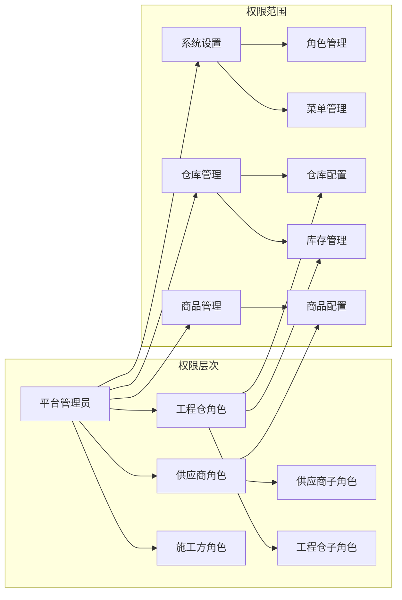
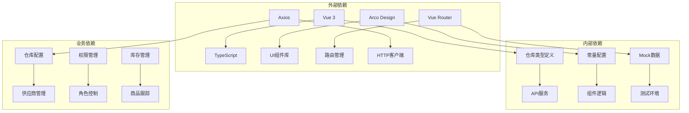

# 仓库配置管理

<cite>
**本文档引用的文件**
- [apps/pc/src/views/supplier/warehouse-config/index.vue](file://apps/pc/src/views/supplier/warehouse-config/index.vue)
- [apps/pc/src/views/warehouse/warehouse/list/index.vue](file://apps/pc/src/views/warehouse/warehouse/list/index.vue)
- [apps/pc/src/views/warehouse/warehouse/detail/index.vue](file://apps/pc/src/views/warehouse/warehouse/detail/index.vue)
- [apps/pc/src/views/construction/list/components/WarehouseFormDrawer.vue](file://apps/pc/src/views/construction/list/components/WarehouseFormDrawer.vue)
- [packages/types/src/warehouse.ts](file://packages/types/src/warehouse.ts)
- [packages/constants/src/warehouse.ts](file://packages/constants/src/warehouse.ts)
- [packages/api/src/warehouse.ts](file://packages/api/src/warehouse.ts)
- [packages/api/src/mock/warehouse.ts](file://packages/api/src/mock/warehouse.ts)
- [apps/pc/src/views/warehouse/stock/check/index.vue](file://apps/pc/src/views/warehouse/stock/check/index.vue)
- [apps/pc/src/views/warehouse/stock/check/detail.vue](file://apps/pc/src/views/warehouse/stock/check/detail.vue)
- [apps/pc/src/views/system/role/index.vue](file://apps/pc/src/views/system/role/index.vue)
- [apps/pc/src/views/system/menu/index.vue](file://apps/pc/src/views/system/menu/index.vue)
- [apps/pc/src/views/warehouse/role/index.vue](file://apps/pc/src/views/warehouse/role/index.vue)
</cite>

## 目录
1. [简介](#简介)
2. [项目结构](#项目结构)
3. [核心组件](#核心组件)
4. [架构概览](#架构概览)
5. [详细组件分析](#详细组件分析)
6. [依赖关系分析](#依赖关系分析)
7. [性能考虑](#性能考虑)
8. [故障排除指南](#故障排除指南)
9. [结论](#结论)

## 简介

仓库配置管理是工程仓管理系统中的核心功能模块，主要负责供应商与工程仓之间的配置关系管理。该系统提供了完整的仓库信息管理、供应商配置、权限管理和操作流程支持。

本系统采用前后端分离架构，前端使用Vue 3 + TypeScript开发，后端提供RESTful API接口。系统支持多种仓库类型（自有仓库、第三方仓库），具备完善的权限控制机制和数据验证功能。

## 项目结构

工程仓配置管理功能分布在多个模块中：

**图表来源**
- [apps/pc/src/views/supplier/warehouse-config/index.vue:1-800](file://apps/pc/src/views/supplier/warehouse-config/index.vue#L1-L800)
- [apps/pc/src/views/warehouse/warehouse/list/index.vue:1-717](file://apps/pc/src/views/warehouse/warehouse/list/index.vue#L1-L717)

**章节来源**
- [apps/pc/src/views/supplier/warehouse-config/index.vue:1-800](file://apps/pc/src/views/supplier/warehouse-config/index.vue#L1-L800)
- [apps/pc/src/views/warehouse/warehouse/list/index.vue:1-717](file://apps/pc/src/views/warehouse/warehouse/list/index.vue#L1-L717)

## 核心组件

### 仓库配置管理组件

仓库配置管理组件提供了供应商与工程仓之间的双向配置关系管理：

- **双视图模式**：支持按供应商查看和按工程仓查看两种模式
- **批量配置**：支持多供应商与多工程仓的组合配置
- **状态管理**：提供配置状态的可视化展示
- **搜索过滤**：支持关键词搜索和状态筛选

### 仓库信息管理组件

仓库信息管理组件负责仓库的基本信息维护：

- **基础信息**：仓库编码、名称、地址、负责人等
- **地理位置**：省市区选择和详细地址输入
- **状态控制**：启用/停用状态管理
- **标签管理**：自定义仓库标签功能

### 仓库详情组件

仓库详情组件提供仓库的详细信息展示和操作：

- **统计信息**：SPU数量、SKU数量、库存总量、库存价值
- **商品列表**：详细的SKU库存信息
- **操作功能**：库存调整、入库出库、调拨操作

**章节来源**
- [apps/pc/src/views/supplier/warehouse-config/index.vue:430-787](file://apps/pc/src/views/supplier/warehouse-config/index.vue#L430-L787)
- [apps/pc/src/views/warehouse/warehouse/list/index.vue:197-590](file://apps/pc/src/views/warehouse/warehouse/list/index.vue#L197-L590)
- [apps/pc/src/views/warehouse/warehouse/detail/index.vue:427-1162](file://apps/pc/src/views/warehouse/warehouse/detail/index.vue#L427-L1162)

## 架构概览

系统采用分层架构设计，各层职责明确：

**图表来源**
- [packages/types/src/warehouse.ts:1-112](file://packages/types/src/warehouse.ts#L1-L112)
- [packages/api/src/warehouse.ts:1-114](file://packages/api/src/warehouse.ts#L1-L114)
- [packages/constants/src/warehouse.ts:1-30](file://packages/constants/src/warehouse.ts#L1-L30)

**章节来源**
- [packages/types/src/warehouse.ts:1-112](file://packages/types/src/warehouse.ts#L1-L112)
- [packages/api/src/warehouse.ts:1-114](file://packages/api/src/warehouse.ts#L1-L114)

## 详细组件分析

### 仓库配置管理组件

#### 功能特性

仓库配置管理组件提供了完整的供应商-工程仓配置关系管理：

**图表来源**
- [apps/pc/src/views/supplier/warehouse-config/index.vue:650-785](file://apps/pc/src/views/supplier/warehouse-config/index.vue#L650-L785)

#### 数据模型

仓库配置涉及的核心数据模型：

**图表来源**
- [packages/types/src/warehouse.ts:1-112](file://packages/types/src/warehouse.ts#L1-L112)

**章节来源**
- [apps/pc/src/views/supplier/warehouse-config/index.vue:430-787](file://apps/pc/src/views/supplier/warehouse-config/index.vue#L430-L787)
- [packages/types/src/warehouse.ts:1-112](file://packages/types/src/warehouse.ts#L1-L112)

### 仓库信息管理组件

#### 表单设计

仓库信息管理采用抽屉式表单设计：

**图表来源**
- [apps/pc/src/views/construction/list/components/WarehouseFormDrawer.vue:1-126](file://apps/pc/src/views/construction/list/components/WarehouseFormDrawer.vue#L1-L126)

#### 地址选择器

系统提供完整的地址选择器功能：

- **省市区三级联动**：支持广东省深圳市多个行政区
- **详细地址输入**：支持最多200字符的详细地址
- **动态验证**：实时验证地址信息的完整性

**章节来源**
- [apps/pc/src/views/construction/list/components/WarehouseFormDrawer.vue:1-126](file://apps/pc/src/views/construction/list/components/WarehouseFormDrawer.vue#L1-L126)

### 权限管理组件

#### 角色权限体系

系统采用基于角色的权限控制（RBAC）：

**图表来源**
- [apps/pc/src/views/system/role/index.vue:1-215](file://apps/pc/src/views/system/role/index.vue#L1-L215)
- [apps/pc/src/views/warehouse/role/index.vue:1-200](file://apps/pc/src/views/warehouse/role/index.vue#L1-L200)

**章节来源**
- [apps/pc/src/views/system/role/index.vue:1-215](file://apps/pc/src/views/system/role/index.vue#L1-L215)
- [apps/pc/src/views/system/menu/index.vue:1-205](file://apps/pc/src/views/system/menu/index.vue#L1-L205)
- [apps/pc/src/views/warehouse/role/index.vue:1-200](file://apps/pc/src/views/warehouse/role/index.vue#L1-L200)

## 依赖关系分析

### 数据依赖关系

**图表来源**
- [packages/types/src/warehouse.ts:1-112](file://packages/types/src/warehouse.ts#L1-L112)
- [packages/api/src/warehouse.ts:1-114](file://packages/api/src/warehouse.ts#L1-L114)
- [packages/constants/src/warehouse.ts:1-30](file://packages/constants/src/warehouse.ts#L1-L30)

### 组件间依赖

系统组件间的依赖关系清晰明确：

- **配置视图**依赖**供应商数据**和**工程仓数据**
- **仓库列表**依赖**仓库API**和**地址数据**
- **权限管理**依赖**角色API**和**菜单数据**
- **库存管理**依赖**库存API**和**商品数据**

**章节来源**
- [packages/api/src/warehouse.ts:1-114](file://packages/api/src/warehouse.ts#L1-L114)
- [packages/api/src/mock/warehouse.ts:1-122](file://packages/api/src/mock/warehouse.ts#L1-L122)

## 性能考虑

### 数据加载优化

系统采用了多种性能优化策略：

- **分页加载**：仓库列表支持分页加载，避免一次性加载大量数据
- **懒加载**：详情页面按需加载，减少初始加载时间
- **缓存机制**：常用数据采用本地缓存，提升用户体验
- **虚拟滚动**：大数据量表格采用虚拟滚动技术

### 前端性能优化

- **组件拆分**：功能模块化，支持按需加载
- **状态管理**：合理使用响应式数据，避免不必要的重渲染
- **事件优化**：使用防抖节流技术处理高频事件
- **资源压缩**：生产环境自动压缩静态资源

## 故障排除指南

### 常见问题及解决方案

#### 仓库配置问题

**问题**：供应商与工程仓配置无法保存
- **检查**：确保选择了至少一个供应商和工程仓
- **验证**：检查网络连接和API服务状态
- **日志**：查看浏览器控制台错误信息

**问题**：仓库列表显示异常
- **清理**：清除浏览器缓存重新加载
- **权限**：确认用户具有相应的访问权限
- **数据**：检查数据库连接和数据完整性

#### 权限管理问题

**问题**：角色权限设置无效
- **同步**：确认权限树结构正确
- **缓存**：清除权限缓存重新登录
- **验证**：检查权限分配是否正确

**问题**：菜单显示异常
- **刷新**：刷新页面重新加载菜单数据
- **权限**：确认用户角色具有相应权限
- **配置**：检查菜单配置是否正确

**章节来源**
- [apps/pc/src/views/supplier/warehouse-config/index.vue:696-785](file://apps/pc/src/views/supplier/warehouse-config/index.vue#L696-L785)
- [apps/pc/src/views/system/role/index.vue:157-213](file://apps/pc/src/views/system/role/index.vue#L157-L213)

## 结论

仓库配置管理功能提供了完整的供应商-工程仓关系管理解决方案。系统采用现代化的技术栈和架构设计，具备良好的扩展性和维护性。

### 主要优势

1. **功能完整**：涵盖仓库配置、权限管理、库存管理等核心功能
2. **用户体验**：界面友好，操作简便，响应迅速
3. **技术先进**：采用Vue 3 + TypeScript + Arco Design等现代技术
4. **扩展性强**：模块化设计，易于功能扩展和定制

### 发展建议

1. **性能优化**：进一步优化大数据量场景下的性能表现
2. **监控完善**：增加系统监控和日志分析功能
3. **移动端适配**：增强移动端用户体验
4. **自动化测试**：完善自动化测试体系

该系统为工程仓管理提供了坚实的技术基础，能够满足复杂的仓库配置管理需求，为业务发展提供有力支撑。