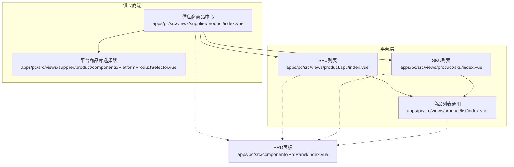
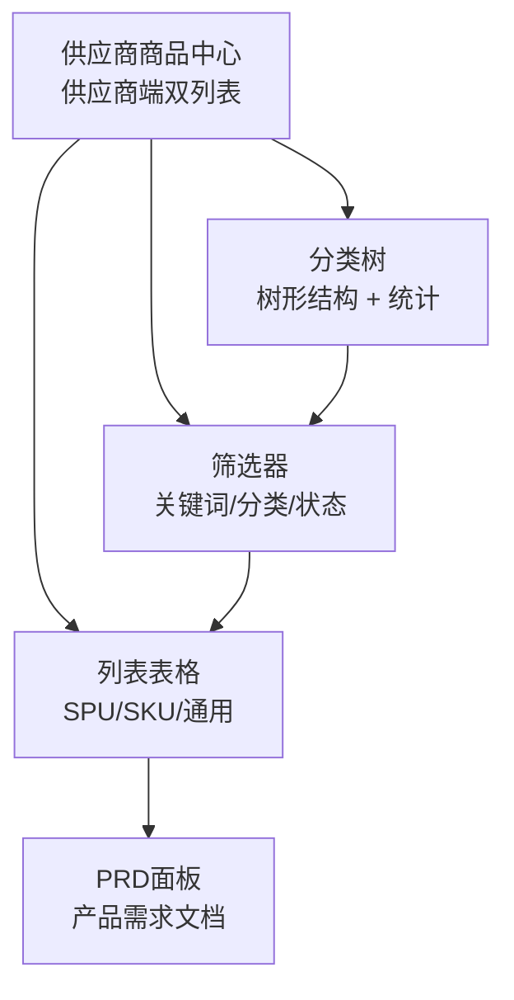
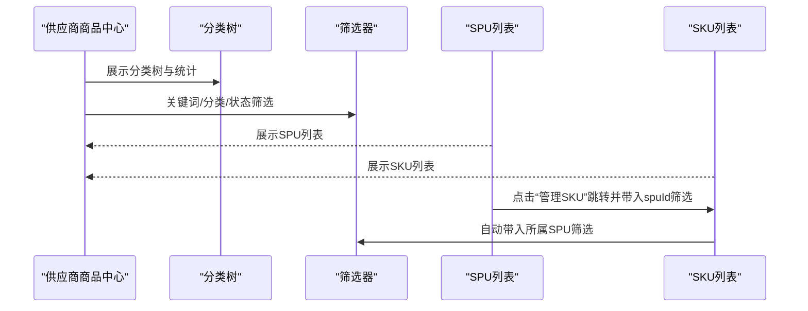
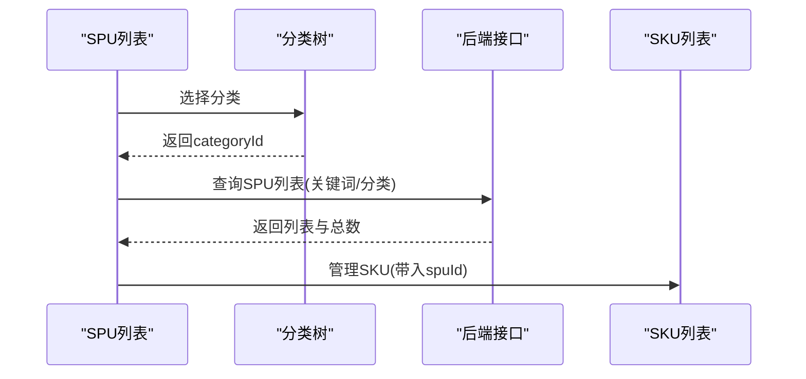
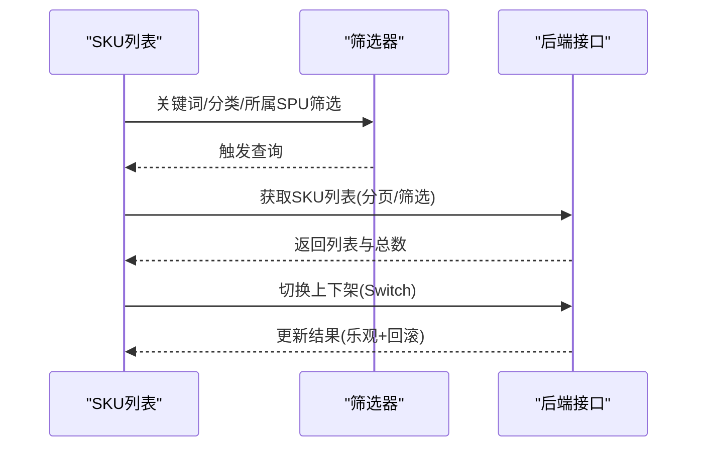
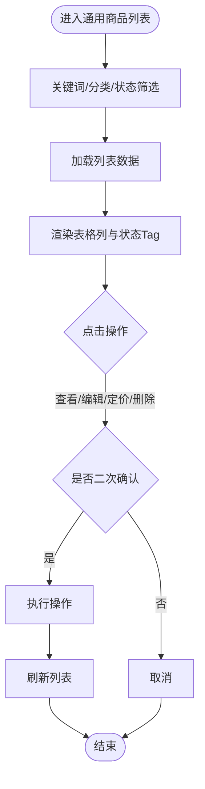
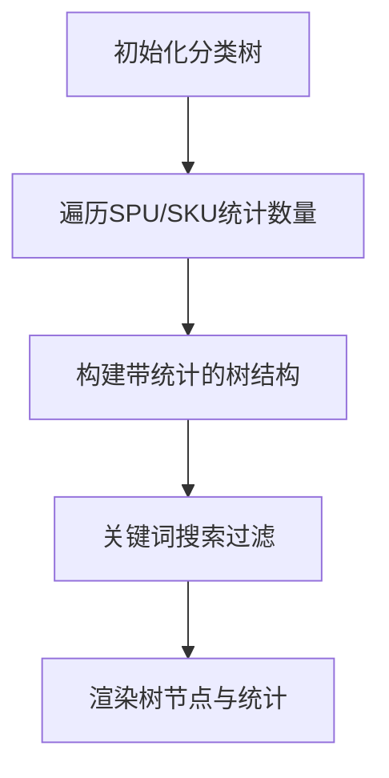
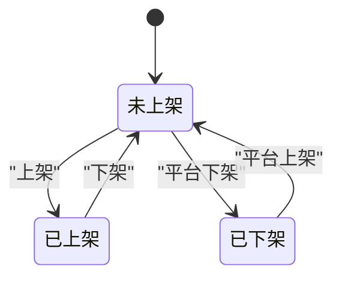
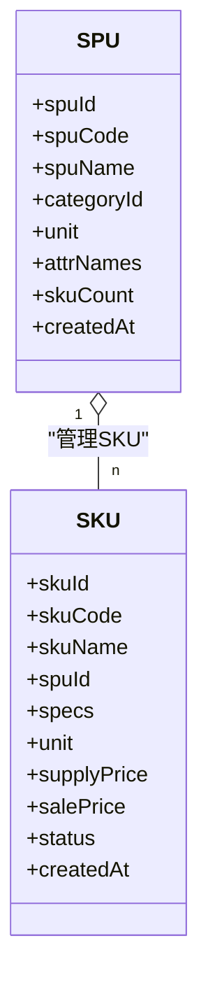
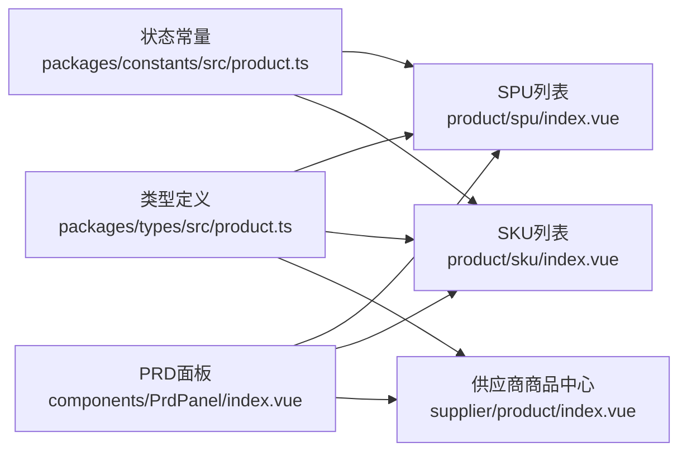

# 产品列表管理

<cite>
**本文引用的文件**   
- [apps/pc/src/views/supplier/product/index.vue](file://apps/pc/src/views/supplier/product/index.vue)
- [apps/pc/src/views/product/spu/index.vue](file://apps/pc/src/views/product/spu/index.vue)
- [apps/pc/src/views/product/sku/index.vue](file://apps/pc/src/views/product/sku/index.vue)
- [apps/pc/src/views/product/list/index.vue](file://apps/pc/src/views/product/list/index.vue)
- [apps/pc/src/components/PrdPanel/index.vue](file://apps/pc/src/components/PrdPanel/index.vue)
- [packages/constants/src/product.ts](file://packages/constants/src/product.ts)
- [packages/types/src/product.ts](file://packages/types/src/product.ts)
- [apps/pc/src/views/supplier/product/components/PlatformProductSelector.vue](file://apps/pc/src/views/supplier/product/components/PlatformProductSelector.vue)
</cite>

## 目录
1. [简介](#简介)
2. [项目结构](#项目结构)
3. [核心组件](#核心组件)
4. [架构总览](#架构总览)
5. [详细组件分析](#详细组件分析)
6. [依赖分析](#依赖分析)
7. [性能考虑](#性能考虑)
8. [故障排查指南](#故障排查指南)
9. [结论](#结论)
10. [附录](#附录)

## 简介
本文件面向“供应商产品列表管理”功能，系统化阐述SPU与SKU双列表模式的设计理念与实现要点，覆盖以下主题：
- 商品分类树形结构展示与统计
- 商品搜索与过滤（关键词、分类、状态）
- 列表表格展示规范（主图、编码名称、分类、SKU数量、来源标识、审核状态）
- 商品状态管理与操作按钮设计
- SPU列表与SKU列表的差异化展示逻辑
- 分类统计功能实现思路
- 商品状态变更对列表展示的影响

## 项目结构
围绕供应商视角的产品列表管理，涉及以下关键页面与组件：
- 供应商商品中心（双列表模式）：SPU列表与SKU列表切换
- 平台商品库选择器：从平台商品库导入商品
- SPU管理：SPU列表、SPU详情、SPU新增/编辑
- SKU管理：SKU列表、SKU详情、SKU新增/编辑
- 通用PRD面板：页面内嵌产品需求文档

图表来源
- [apps/pc/src/views/supplier/product/index.vue:1-402](file://apps/pc/src/views/supplier/product/index.vue#L1-L402)
- [apps/pc/src/views/supplier/product/components/PlatformProductSelector.vue:1-717](file://apps/pc/src/views/supplier/product/components/PlatformProductSelector.vue#L1-L717)
- [apps/pc/src/views/product/spu/index.vue:1-473](file://apps/pc/src/views/product/spu/index.vue#L1-L473)
- [apps/pc/src/views/product/sku/index.vue:1-886](file://apps/pc/src/views/product/sku/index.vue#L1-L886)
- [apps/pc/src/views/product/list/index.vue:1-403](file://apps/pc/src/views/product/list/index.vue#L1-L403)
- [apps/pc/src/components/PrdPanel/index.vue:1-634](file://apps/pc/src/components/PrdPanel/index.vue#L1-L634)

章节来源
- [apps/pc/src/views/supplier/product/index.vue:1-402](file://apps/pc/src/views/supplier/product/index.vue#L1-L402)
- [apps/pc/src/views/supplier/product/components/PlatformProductSelector.vue:1-717](file://apps/pc/src/views/supplier/product/components/PlatformProductSelector.vue#L1-L717)
- [apps/pc/src/views/product/spu/index.vue:1-473](file://apps/pc/src/views/product/spu/index.vue#L1-L473)
- [apps/pc/src/views/product/sku/index.vue:1-886](file://apps/pc/src/views/product/sku/index.vue#L1-L886)
- [apps/pc/src/views/product/list/index.vue:1-403](file://apps/pc/src/views/product/list/index.vue#L1-L403)
- [apps/pc/src/components/PrdPanel/index.vue:1-634](file://apps/pc/src/components/PrdPanel/index.vue#L1-L634)

## 核心组件
- 供应商商品中心（双列表）：提供SPU与SKU两个视图的切换，支持分类树、关键词、状态筛选；SKU视图支持批量上下架与更多操作。
- SPU列表：展示SPU主图、编码、名称、分类、单位、关联属性、SKU数量、创建时间与操作；支持从SPU跳转到SKU列表。
- SKU列表：展示SKU主图、编码、名称、所属SPU、分类、规格、单位、价格、状态（上架/下架）、创建时间与操作；支持新增SKU、编辑、删除。
- 商品列表（通用）：通用表格规范，包含主图、SKU、名称、分类、规格、单位、状态、时间与操作列。
- PRD面板：内嵌产品需求文档，帮助开发者理解各页面的规范与交互。

章节来源
- [apps/pc/src/views/supplier/product/index.vue:1-402](file://apps/pc/src/views/supplier/product/index.vue#L1-L402)
- [apps/pc/src/views/product/spu/index.vue:1-473](file://apps/pc/src/views/product/spu/index.vue#L1-L473)
- [apps/pc/src/views/product/sku/index.vue:1-886](file://apps/pc/src/views/product/sku/index.vue#L1-L886)
- [apps/pc/src/views/product/list/index.vue:1-403](file://apps/pc/src/views/product/list/index.vue#L1-L403)
- [apps/pc/src/components/PrdPanel/index.vue:1-634](file://apps/pc/src/components/PrdPanel/index.vue#L1-L634)

## 架构总览
供应商产品列表管理采用“双列表模式 + 分类树 + 筛选器”的组合架构：
- 供应商商品中心作为入口，提供SPU与SKU两个视图的切换与联动
- 分类树用于分类筛选与统计，支持搜索与展开/折叠
- 筛选器支持关键词、分类、状态等多维过滤
- 列表表格统一规范，确保视觉一致性与交互一致性
- PRD面板贯穿页面，提供产品规范与交互指引

图表来源
- [apps/pc/src/views/supplier/product/index.vue:1-402](file://apps/pc/src/views/supplier/product/index.vue#L1-L402)
- [apps/pc/src/views/product/spu/index.vue:1-473](file://apps/pc/src/views/product/spu/index.vue#L1-L473)
- [apps/pc/src/views/product/sku/index.vue:1-886](file://apps/pc/src/views/product/sku/index.vue#L1-L886)
- [apps/pc/src/views/product/list/index.vue:1-403](file://apps/pc/src/views/product/list/index.vue#L1-L403)
- [apps/pc/src/components/PrdPanel/index.vue:1-634](file://apps/pc/src/components/PrdPanel/index.vue#L1-L634)

## 详细组件分析

### 供应商商品中心（双列表模式）
- 功能定位：供应商视角的SPU与SKU双列表入口，支持分类树、关键词、状态筛选，SKU视图支持批量上下架与更多操作。
- 分类树与统计：树节点展示SPU/SKU数量，支持搜索与展开/折叠；支持按分类筛选。
- SPU列表：展示主图、编码、名称、分类、SKU数量、来源（自建/平台）、审核状态、创建时间与操作。
- SKU列表：展示主图、编码、名称、所属SPU、规格、单位、价格、上架状态、创建时间与操作；支持批量上下架。
- 交互要点：切换标签时清空SKU选择；SKU列表支持从SPU跳转并自动带入筛选；支持从平台库选择商品导入。

图表来源
- [apps/pc/src/views/supplier/product/index.vue:1-402](file://apps/pc/src/views/supplier/product/index.vue#L1-L402)
- [apps/pc/src/views/product/spu/index.vue:1-473](file://apps/pc/src/views/product/spu/index.vue#L1-L473)
- [apps/pc/src/views/product/sku/index.vue:1-886](file://apps/pc/src/views/product/sku/index.vue#L1-L886)

章节来源
- [apps/pc/src/views/supplier/product/index.vue:1-402](file://apps/pc/src/views/supplier/product/index.vue#L1-L402)

### SPU列表（平台端）
- 设计理念：SPU作为标准产品单元，统一维护商品库，供应商从平台SPU选品。
- 列表字段：主图、SPU编码、SPU名称、所属分类、计量单位、关联属性、SKU数量、创建时间、操作（详情、编辑、管理SKU、删除）。
- 筛选与联动：关键词支持SPU名称/编码模糊搜索；分类级联支持三级；支持从分类树点击穿透自动带入分类参数。
- 操作流程：管理SKU跳转至SKU列表并带入spuId；删除需二次确认。

图表来源
- [apps/pc/src/views/product/spu/index.vue:1-473](file://apps/pc/src/views/product/spu/index.vue#L1-L473)

章节来源
- [apps/pc/src/views/product/spu/index.vue:1-473](file://apps/pc/src/views/product/spu/index.vue#L1-L473)

### SKU列表（平台端）
- 设计理念：SKU为最小库存单元，支持批量上下架、价格与库存管理。
- 列表字段：主图、SKU编码、SKU名称、所属SPU、所属分类、规格、单位、供货价、销售价、状态（上架/下架）、创建时间、操作（详情、编辑、删除）。
- 筛选与联动：支持关键词、分类、所属SPU筛选；从SPU列表点击“管理SKU”自动带入spuId筛选。
- 状态管理：Switch开关直接切换上下架，采用乐观更新与失败回滚策略；支持新增SKU弹窗。

图表来源
- [apps/pc/src/views/product/sku/index.vue:1-886](file://apps/pc/src/views/product/sku/index.vue#L1-L886)

章节来源
- [apps/pc/src/views/product/sku/index.vue:1-886](file://apps/pc/src/views/product/sku/index.vue#L1-L886)

### 通用商品列表（通用表格规范）
- 设计理念：统一的表格展示规范，适用于通用商品列表场景。
- 列表字段：商品图片、SKU、商品名称、分类、规格、单位、状态、创建时间、操作。
- 状态映射：基于常量定义的状态映射表，支持颜色与标签展示。
- 操作按钮：查看、编辑、定价、删除（二次确认）。

图表来源
- [apps/pc/src/views/product/list/index.vue:1-403](file://apps/pc/src/views/product/list/index.vue#L1-L403)
- [packages/constants/src/product.ts:1-26](file://packages/constants/src/product.ts#L1-L26)

章节来源
- [apps/pc/src/views/product/list/index.vue:1-403](file://apps/pc/src/views/product/list/index.vue#L1-L403)
- [packages/constants/src/product.ts:1-26](file://packages/constants/src/product.ts#L1-L26)

### 分类树形结构与统计
- 供应商商品中心：分类树节点展示SPU/SKU数量，支持搜索与展开/折叠；支持按分类筛选。
- 平台端SPU/SKU列表：分类树支持三级级联，fieldNames映射value/label/children，支持从分类树点击穿透自动带入分类参数。
- 统计实现：通过遍历SPU/SKU列表累加各分类的数量，递归计算子节点合计，并在搜索时动态过滤。

图表来源
- [apps/pc/src/views/supplier/product/index.vue:497-547](file://apps/pc/src/views/supplier/product/index.vue#L497-L547)
- [apps/pc/src/views/product/spu/index.vue:403-409](file://apps/pc/src/views/product/spu/index.vue#L403-L409)
- [apps/pc/src/views/product/sku/index.vue:542-548](file://apps/pc/src/views/product/sku/index.vue#L542-L548)

章节来源
- [apps/pc/src/views/supplier/product/index.vue:497-547](file://apps/pc/src/views/supplier/product/index.vue#L497-L547)
- [apps/pc/src/views/product/spu/index.vue:403-409](file://apps/pc/src/views/product/spu/index.vue#L403-L409)
- [apps/pc/src/views/product/sku/index.vue:542-548](file://apps/pc/src/views/product/sku/index.vue#L542-L548)

### 商品状态管理与操作按钮设计
- 供应商商品中心SKU状态：Switch开关控制上架/下架，支持批量上下架；更多操作包含继续供货、暂停供货、永久停货。
- 平台端SKU状态：Switch开关控制上架/下架，乐观更新与失败回滚；支持编辑SKU供货信息。
- 通用商品列表状态：基于状态映射表渲染Tag颜色与标签；支持状态筛选。
- 操作按钮：查看、编辑、定价、删除（二次确认）；平台端SKU支持新增、编辑、删除。

图表来源
- [apps/pc/src/views/supplier/product/index.vue:733-745](file://apps/pc/src/views/supplier/product/index.vue#L733-L745)
- [apps/pc/src/views/product/sku/index.vue:604-620](file://apps/pc/src/views/product/sku/index.vue#L604-L620)
- [packages/constants/src/product.ts:11-17](file://packages/constants/src/product.ts#L11-L17)

章节来源
- [apps/pc/src/views/supplier/product/index.vue:733-745](file://apps/pc/src/views/supplier/product/index.vue#L733-L745)
- [apps/pc/src/views/product/sku/index.vue:604-620](file://apps/pc/src/views/product/sku/index.vue#L604-L620)
- [packages/constants/src/product.ts:11-17](file://packages/constants/src/product.ts#L11-L17)

### SPU列表与SKU列表的差异化展示逻辑
- SPU列表：强调“标准产品单元”，展示SPU主图、编码、名称、分类、单位、关联属性、SKU数量；操作聚焦“管理SKU”。
- SKU列表：强调“最小库存单元”，展示SKU主图、编码、名称、所属SPU、规格、单位、价格、状态；操作聚焦“上下架、编辑、删除”。

图表来源
- [packages/types/src/product.ts:90-164](file://packages/types/src/product.ts#L90-L164)

章节来源
- [packages/types/src/product.ts:90-164](file://packages/types/src/product.ts#L90-L164)

### 商品状态变更对列表展示的影响
- 供应商商品中心：SKU上架/下架状态直接影响“上架状态”列与“更多操作”可用性；批量上下架提升效率。
- 平台端SKU：Switch切换后乐观更新UI，失败回滚；状态变更影响SKU列表筛选与展示。
- 通用商品列表：状态Tag随状态映射表动态渲染，筛选器联动更新。

章节来源
- [apps/pc/src/views/supplier/product/index.vue:733-745](file://apps/pc/src/views/supplier/product/index.vue#L733-L745)
- [apps/pc/src/views/product/sku/index.vue:604-620](file://apps/pc/src/views/product/sku/index.vue#L604-L620)
- [apps/pc/src/views/product/list/index.vue:50-56](file://apps/pc/src/views/product/list/index.vue#L50-L56)

## 依赖分析
- 类型与常量：通过统一的类型定义与状态映射，保证前后端一致的数据结构与状态表达。
- 组件耦合：供应商商品中心与平台端SPU/SKU列表通过路由参数与筛选器进行解耦；PRD面板作为横切关注点贯穿页面。
- 外部依赖：Arco Design组件库用于表格、筛选器、模态框等UI组件；Vue Router用于页面跳转与参数传递。

图表来源
- [packages/types/src/product.ts:1-431](file://packages/types/src/product.ts#L1-L431)
- [packages/constants/src/product.ts:1-26](file://packages/constants/src/product.ts#L1-L26)
- [apps/pc/src/views/product/spu/index.vue:1-473](file://apps/pc/src/views/product/spu/index.vue#L1-L473)
- [apps/pc/src/views/product/sku/index.vue:1-886](file://apps/pc/src/views/product/sku/index.vue#L1-L886)
- [apps/pc/src/views/supplier/product/index.vue:1-402](file://apps/pc/src/views/supplier/product/index.vue#L1-L402)
- [apps/pc/src/components/PrdPanel/index.vue:1-634](file://apps/pc/src/components/PrdPanel/index.vue#L1-L634)

章节来源
- [packages/types/src/product.ts:1-431](file://packages/types/src/product.ts#L1-L431)
- [packages/constants/src/product.ts:1-26](file://packages/constants/src/product.ts#L1-L26)
- [apps/pc/src/views/product/spu/index.vue:1-473](file://apps/pc/src/views/product/spu/index.vue#L1-L473)
- [apps/pc/src/views/product/sku/index.vue:1-886](file://apps/pc/src/views/product/sku/index.vue#L1-L886)
- [apps/pc/src/views/supplier/product/index.vue:1-402](file://apps/pc/src/views/supplier/product/index.vue#L1-L402)
- [apps/pc/src/components/PrdPanel/index.vue:1-634](file://apps/pc/src/components/PrdPanel/index.vue#L1-L634)

## 性能考虑
- 列表分页与懒加载：合理设置pageSize与分页器，避免一次性加载过多数据。
- 筛选器联动：采用即时查询策略，结合页码重置，减少无效请求。
- 图片渲染优化：统一尺寸与裁剪策略，避免大图导致的渲染阻塞。
- 状态切换：平台端SKU采用乐观更新与失败回滚，减少用户等待时间。
- 分类树统计：在渲染前完成统计计算，避免频繁遍历与重绘。

## 故障排查指南
- 分类树无数据：检查分类树加载接口与fieldNames映射；确认分类树初始化与数据结构。
- 筛选器无效：检查筛选器绑定的字段与查询参数；确认watch与loadData调用顺序。
- 状态切换异常：检查Switch状态与后端返回状态一致性；确认乐观更新与回滚逻辑。
- SKU列表空白：检查所属SPU筛选是否正确传入；确认分页与总数同步。
- PRD面板不显示：检查路由匹配与PRD数据库条目是否存在。

章节来源
- [apps/pc/src/views/supplier/product/index.vue:497-547](file://apps/pc/src/views/supplier/product/index.vue#L497-L547)
- [apps/pc/src/views/product/spu/index.vue:411-426](file://apps/pc/src/views/product/spu/index.vue#L411-L426)
- [apps/pc/src/views/product/sku/index.vue:568-584](file://apps/pc/src/views/product/sku/index.vue#L568-L584)
- [apps/pc/src/components/PrdPanel/index.vue:497-527](file://apps/pc/src/components/PrdPanel/index.vue#L497-L527)

## 结论
供应商产品列表管理通过“SPU/SKU双列表模式 + 分类树 + 多维筛选器”的组合，实现了从“标准产品单元”到“最小库存单元”的完整管理闭环。平台端与供应商端在职责与权限上清晰分离，既保证了统一控品，又赋予了供应商灵活的运营能力。通过PRD面板与统一的状态映射，提升了开发与维护效率，确保了用户体验的一致性与可靠性。

## 附录
- 供应商从平台库选择商品：支持按SPU或SKU两种模式选择，提供批量设置供货信息与提交审核流程。
- 通用表格规范：提供统一的列定义、状态Tag渲染与操作按钮规范，便于跨页面复用。

章节来源
- [apps/pc/src/views/supplier/product/components/PlatformProductSelector.vue:1-717](file://apps/pc/src/views/supplier/product/components/PlatformProductSelector.vue#L1-L717)
- [apps/pc/src/views/product/list/index.vue:124-164](file://apps/pc/src/views/product/list/index.vue#L124-L164)