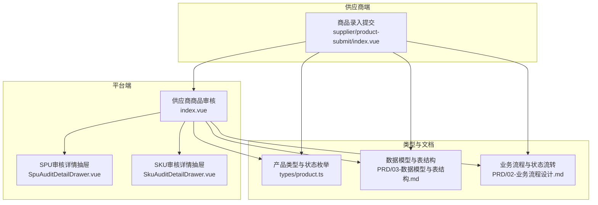
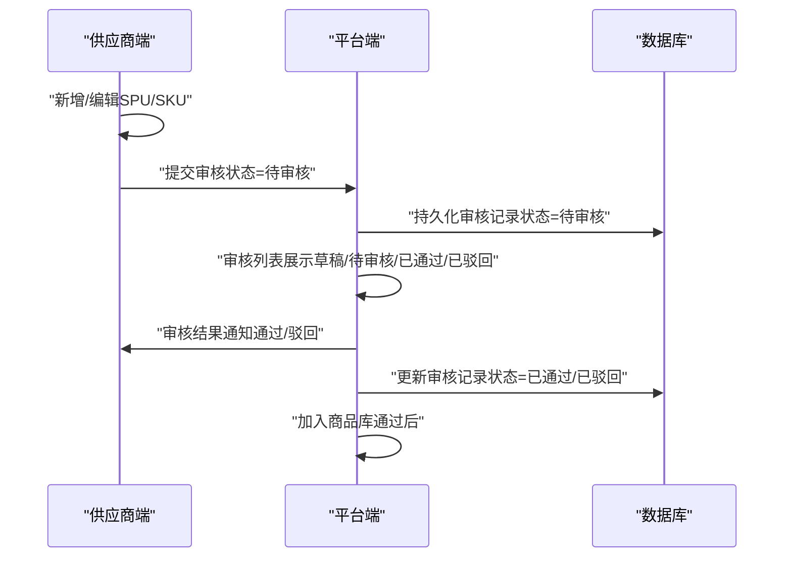
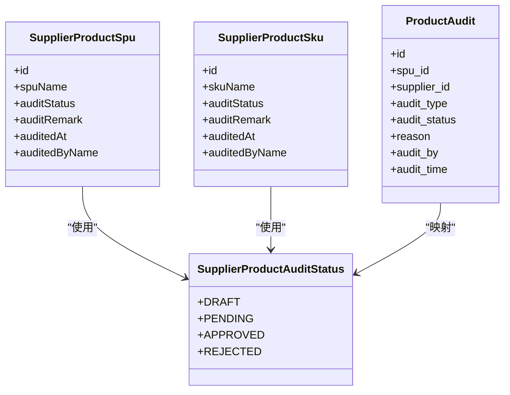
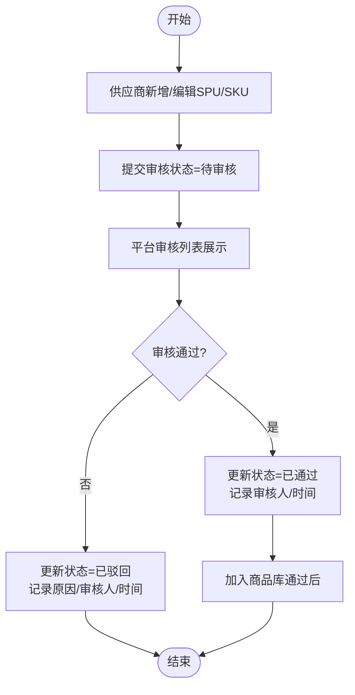
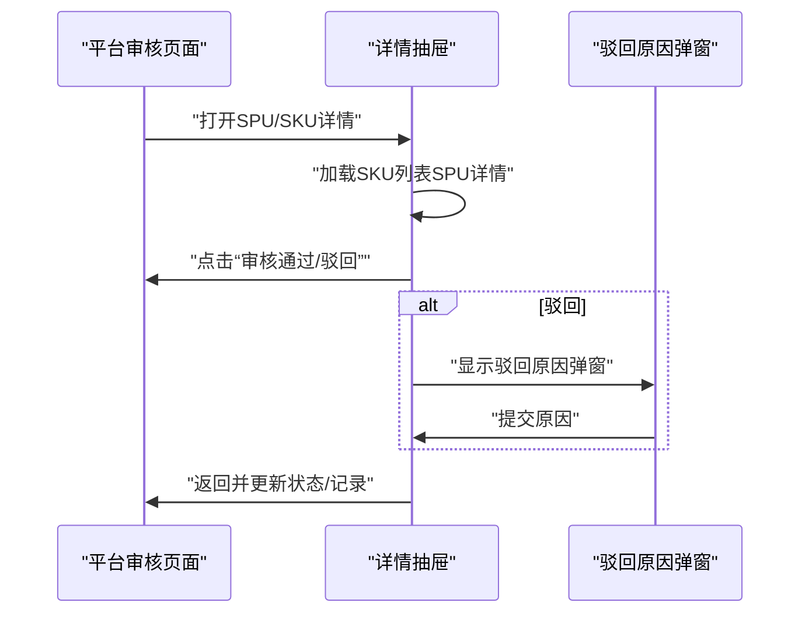
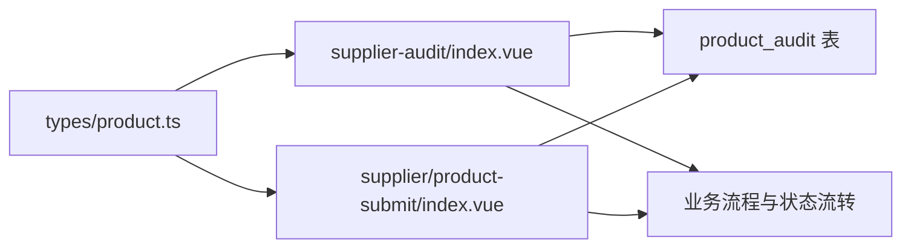

# 产品审核管理

<cite>
**本文引用的文件**
- [apps/pc/src/views/product/supplier-audit/index.vue](file://apps/pc/src/views/product/supplier-audit/index.vue)
- [apps/pc/src/views/product/supplier-audit/components/SpuAuditDetailDrawer.vue](file://apps/pc/src/views/product/supplier-audit/components/SpuAuditDetailDrawer.vue)
- [apps/pc/src/views/product/supplier-audit/components/SkuAuditDetailDrawer.vue](file://apps/pc/src/views/product/supplier-audit/components/SkuAuditDetailDrawer.vue)
- [apps/pc/src/views/supplier/product-submit/index.vue](file://apps/pc/src/views/supplier/product-submit/index.vue)
- [packages/types/src/product.ts](file://packages/types/src/product.ts)
- [docs/PRD/03-数据模型与表结构.md](file://docs/PRD/03-数据模型与表结构.md)
- [docs/PRD/02-业务流程设计.md](file://docs/PRD/02-业务流程设计.md)
</cite>

## 目录
1. [简介](#简介)
2. [项目结构](#项目结构)
3. [核心组件](#核心组件)
4. [架构总览](#架构总览)
5. [详细组件分析](#详细组件分析)
6. [依赖关系分析](#依赖关系分析)
7. [性能考量](#性能考量)
8. [故障排查指南](#故障排查指南)
9. [结论](#结论)
10. [附录](#附录)

## 简介
本文件面向“供应商产品审核管理”功能，系统化阐述从供应商提交商品信息到平台审核、再到审核结果通知与后续处理的完整业务闭环。重点覆盖以下方面：
- 审核状态分类：草稿、待审核、已通过、已驳回
- 审核流程控制：提交审核、平台审核、审核结果通知、修改重审
- 审核规则配置：审核标准、审核时限、审核人员分配
- 审核记录追踪：审核历史、审核意见、审核日志
- 审核统计分析：审核通过率、审核时效、审核质量

该文档既适合技术读者理解实现细节，也适合非技术读者把握业务流程与关键节点。

## 项目结构
围绕“供应商产品审核管理”的前端页面与类型定义主要分布在以下位置：
- 平台侧审核入口与详情：apps/pc/src/views/product/supplier-audit/*
- 供应商侧商品提交与状态展示：apps/pc/src/views/supplier/product-submit/index.vue
- 审核状态与数据模型：packages/types/src/product.ts
- 数据库表结构与字段说明：docs/PRD/03-数据模型与表结构.md
- 业务流程与状态流转：docs/PRD/02-业务流程设计.md

图表来源
- [apps/pc/src/views/product/supplier-audit/index.vue:1-757](file://apps/pc/src/views/product/supplier-audit/index.vue#L1-L757)
- [apps/pc/src/views/product/supplier-audit/components/SpuAuditDetailDrawer.vue:1-270](file://apps/pc/src/views/product/supplier-audit/components/SpuAuditDetailDrawer.vue#L1-L270)
- [apps/pc/src/views/product/supplier-audit/components/SkuAuditDetailDrawer.vue:1-120](file://apps/pc/src/views/product/supplier-audit/components/SkuAuditDetailDrawer.vue#L1-L120)
- [apps/pc/src/views/supplier/product-submit/index.vue:1-649](file://apps/pc/src/views/supplier/product-submit/index.vue#L1-L649)
- [packages/types/src/product.ts:330-430](file://packages/types/src/product.ts#L330-L430)
- [docs/PRD/03-数据模型与表结构.md:388-404](file://docs/PRD/03-数据模型与表结构.md#L388-L404)
- [docs/PRD/02-业务流程设计.md:277-347](file://docs/PRD/02-业务流程设计.md#L277-L347)

章节来源
- [apps/pc/src/views/product/supplier-audit/index.vue:1-757](file://apps/pc/src/views/product/supplier-audit/index.vue#L1-L757)
- [apps/pc/src/views/supplier/product-submit/index.vue:1-649](file://apps/pc/src/views/supplier/product-submit/index.vue#L1-L649)
- [packages/types/src/product.ts:330-430](file://packages/types/src/product.ts#L330-L430)
- [docs/PRD/03-数据模型与表结构.md:388-404](file://docs/PRD/03-数据模型与表结构.md#L388-L404)
- [docs/PRD/02-业务流程设计.md:277-347](file://docs/PRD/02-业务流程设计.md#L277-L347)

## 核心组件
- 平台侧审核列表与操作：供应商商品审核页面提供SPU与SKU两个维度的审核列表，支持筛选、分页、批量审核、单条审核、详情查看与加入商品库等能力。
- 审核详情抽屉：SPU与SKU审核详情抽屉分别展示商品基础信息、图片、SKU列表（SPU详情），并提供“审核通过/驳回”操作。
- 供应商侧提交入口：商品录入页面展示SPU/SKU列表，支持新增、编辑、管理SKU、提交审核、删除等；提交审核后状态变为“待审核”。

章节来源
- [apps/pc/src/views/product/supplier-audit/index.vue:16-224](file://apps/pc/src/views/product/supplier-audit/index.vue#L16-L224)
- [apps/pc/src/views/product/supplier-audit/components/SpuAuditDetailDrawer.vue:1-112](file://apps/pc/src/views/product/supplier-audit/components/SpuAuditDetailDrawer.vue#L1-L112)
- [apps/pc/src/views/product/supplier-audit/components/SkuAuditDetailDrawer.vue:1-82](file://apps/pc/src/views/product/supplier-audit/components/SkuAuditDetailDrawer.vue#L1-L82)
- [apps/pc/src/views/supplier/product-submit/index.vue:16-211](file://apps/pc/src/views/supplier/product-submit/index.vue#L16-L211)

## 架构总览
整体架构由“供应商端提交—平台端审核—结果反馈与后续动作”构成，数据与状态在页面层与数据库层之间流转。

图表来源
- [apps/pc/src/views/supplier/product-submit/index.vue:571-582](file://apps/pc/src/views/supplier/product-submit/index.vue#L571-L582)
- [apps/pc/src/views/product/supplier-audit/index.vue:590-632](file://apps/pc/src/views/product/supplier-audit/index.vue#L590-L632)
- [docs/PRD/03-数据模型与表结构.md:388-404](file://docs/PRD/03-数据模型与表结构.md#L388-L404)

## 详细组件分析

### 审核状态与数据模型
- 审核状态枚举：草稿、待审核、已通过、已驳回
- SPU/SKU对象包含：审核状态、审核备注、审核人、审核时间等字段
- 审核记录表字段：审核类型、审核状态、原因、审核人、审核时间等

图表来源
- [packages/types/src/product.ts:330-388](file://packages/types/src/product.ts#L330-L388)
- [docs/PRD/03-数据模型与表结构.md:388-404](file://docs/PRD/03-数据模型与表结构.md#L388-L404)

章节来源
- [packages/types/src/product.ts:330-388](file://packages/types/src/product.ts#L330-L388)
- [docs/PRD/03-数据模型与表结构.md:388-404](file://docs/PRD/03-数据模型与表结构.md#L388-L404)

### 供应商提交与平台审核流程
- 供应商端：在“商品录入”页面完成SPU/SKU信息维护，点击“提交审核”，状态变为“待审核”
- 平台端：在“供应商商品审核”页面查看待审核列表，支持单条审核、批量审核、详情查看、加入商品库等

图表来源
- [apps/pc/src/views/supplier/product-submit/index.vue:571-582](file://apps/pc/src/views/supplier/product-submit/index.vue#L571-L582)
- [apps/pc/src/views/product/supplier-audit/index.vue:590-632](file://apps/pc/src/views/product/supplier-audit/index.vue#L590-L632)

章节来源
- [apps/pc/src/views/supplier/product-submit/index.vue:571-582](file://apps/pc/src/views/supplier/product-submit/index.vue#L571-L582)
- [apps/pc/src/views/product/supplier-audit/index.vue:590-632](file://apps/pc/src/views/product/supplier-audit/index.vue#L590-L632)

### 审核详情与操作
- SPU详情抽屉：展示SPU基础信息、图片、SKU列表，并提供“审核通过/驳回”按钮
- SKU详情抽屉：展示SKU基础信息与规格，并提供“审核通过/驳回”按钮
- 驳回原因：统一弹窗收集“驳回原因”，必填校验

图表来源
- [apps/pc/src/views/product/supplier-audit/components/SpuAuditDetailDrawer.vue:154-204](file://apps/pc/src/views/product/supplier-audit/components/SpuAuditDetailDrawer.vue#L154-L204)
- [apps/pc/src/views/product/supplier-audit/components/SkuAuditDetailDrawer.vue:51-81](file://apps/pc/src/views/product/supplier-audit/components/SkuAuditDetailDrawer.vue#L51-L81)
- [apps/pc/src/views/product/supplier-audit/index.vue:662-693](file://apps/pc/src/views/product/supplier-audit/index.vue#L662-L693)

章节来源
- [apps/pc/src/views/product/supplier-audit/components/SpuAuditDetailDrawer.vue:154-204](file://apps/pc/src/views/product/supplier-audit/components/SpuAuditDetailDrawer.vue#L154-L204)
- [apps/pc/src/views/product/supplier-audit/components/SkuAuditDetailDrawer.vue:51-81](file://apps/pc/src/views/product/supplier-audit/components/SkuAuditDetailDrawer.vue#L51-L81)
- [apps/pc/src/views/product/supplier-audit/index.vue:662-693](file://apps/pc/src/views/product/supplier-audit/index.vue#L662-L693)

### 审核规则配置
- 审核标准：页面通过“审核通过/驳回”按钮与“驳回原因”弹窗体现审核标准
- 审核时限：当前页面未直接暴露“审核时限”字段，可在数据库表结构中扩展
- 审核人员分配：当前页面未直接暴露“审核人员分配”字段，可在数据库表结构中扩展

章节来源
- [apps/pc/src/views/product/supplier-audit/index.vue:662-693](file://apps/pc/src/views/product/supplier-audit/index.vue#L662-L693)
- [docs/PRD/03-数据模型与表结构.md:388-404](file://docs/PRD/03-数据模型与表结构.md#L388-L404)

### 审核记录追踪
- 审核历史：页面记录“审核人、审核时间、审核备注”
- 审核意见：通过“驳回原因”字段记录
- 审核日志：当前页面未直接展示“操作审计日志”，可在后续扩展

章节来源
- [apps/pc/src/views/product/supplier-audit/index.vue:695-717](file://apps/pc/src/views/product/supplier-audit/index.vue#L695-L717)
- [packages/types/src/product.ts:352-387](file://packages/types/src/product.ts#L352-L387)

### 审核统计分析
- 审核通过率：当前页面未直接展示“通过率”指标
- 审核时效：当前页面未直接展示“平均审核时长”指标
- 审核质量：当前页面未直接展示“驳回率/重复驳回”指标
- 建议：可在后台报表或统计模块中基于“审核时间、状态、原因”等字段计算

章节来源
- [docs/PRD/02-业务流程设计.md:277-347](file://docs/PRD/02-业务流程设计.md#L277-L347)

## 依赖关系分析
- 页面依赖类型定义：审核状态、SPU/SKU接口模型
- 页面依赖数据库表结构：审核记录表字段映射
- 页面依赖业务流程：商品上架与状态流转

图表来源
- [packages/types/src/product.ts:330-388](file://packages/types/src/product.ts#L330-L388)
- [apps/pc/src/views/product/supplier-audit/index.vue:1-757](file://apps/pc/src/views/product/supplier-audit/index.vue#L1-L757)
- [apps/pc/src/views/supplier/product-submit/index.vue:1-649](file://apps/pc/src/views/supplier/product-submit/index.vue#L1-L649)
- [docs/PRD/03-数据模型与表结构.md:388-404](file://docs/PRD/03-数据模型与表结构.md#L388-L404)
- [docs/PRD/02-业务流程设计.md:277-347](file://docs/PRD/02-业务流程设计.md#L277-L347)

章节来源
- [packages/types/src/product.ts:330-388](file://packages/types/src/product.ts#L330-L388)
- [apps/pc/src/views/product/supplier-audit/index.vue:1-757](file://apps/pc/src/views/product/supplier-audit/index.vue#L1-L757)
- [apps/pc/src/views/supplier/product-submit/index.vue:1-649](file://apps/pc/src/views/supplier/product-submit/index.vue#L1-L649)
- [docs/PRD/03-数据模型与表结构.md:388-404](file://docs/PRD/03-数据模型与表结构.md#L388-L404)
- [docs/PRD/02-业务流程设计.md:277-347](file://docs/PRD/02-业务流程设计.md#L277-L347)

## 性能考量
- 列表分页与懒加载：页面已内置分页与加载状态，建议在真实接口中配合服务端分页与缓存策略
- 批量操作：批量通过/驳回采用前端状态切换，建议在真实接口中改为服务端批量更新以降低前端压力
- 图片加载：详情抽屉中的图片采用懒加载占位，建议结合CDN与图片压缩提升首屏性能
- 审核弹窗：驳回原因弹窗为一次性渲染，建议在大列表场景中按需渲染以减少DOM占用

## 故障排查指南
- 驳回原因为空：提交时若未填写“驳回原因”，会触发提示；请确保必填校验通过后再提交
- 状态更新异常：若审核后状态未更新，检查是否正确触发了“更新状态/记录审核人/时间”的逻辑
- 详情抽屉加载失败：SPU详情抽屉会异步加载SKU列表，若加载失败，请检查网络请求与数据源
- 加入商品库：仅对“已通过”的SPU开放此操作，确保状态为“已通过”后再执行

章节来源
- [apps/pc/src/views/product/supplier-audit/index.vue:662-693](file://apps/pc/src/views/product/supplier-audit/index.vue#L662-L693)
- [apps/pc/src/views/product/supplier-audit/components/SpuAuditDetailDrawer.vue:217-226](file://apps/pc/src/views/product/supplier-audit/components/SpuAuditDetailDrawer.vue#L217-L226)
- [apps/pc/src/views/supplier/product-submit/index.vue:571-582](file://apps/pc/src/views/supplier/product-submit/index.vue#L571-L582)

## 结论
本功能以“供应商提交—平台审核—结果反馈—后续动作”为主线，实现了从草稿到待审核、再到已通过/已驳回的完整闭环。页面层通过直观的状态标签、详情抽屉与批量操作提升了审核效率；数据层通过审核记录表支撑了可追溯性。建议在后续版本中完善“审核时限、审核人员分配、统计分析”等能力，进一步提升审核体系的规范性与可观测性。

## 附录
- 业务流程与状态流转参考：商品上架流程、商品状态流转
- 数据模型与表结构参考：商品审核表字段说明

章节来源
- [docs/PRD/02-业务流程设计.md:277-347](file://docs/PRD/02-业务流程设计.md#L277-L347)
- [docs/PRD/03-数据模型与表结构.md:388-404](file://docs/PRD/03-数据模型与表结构.md#L388-L404)