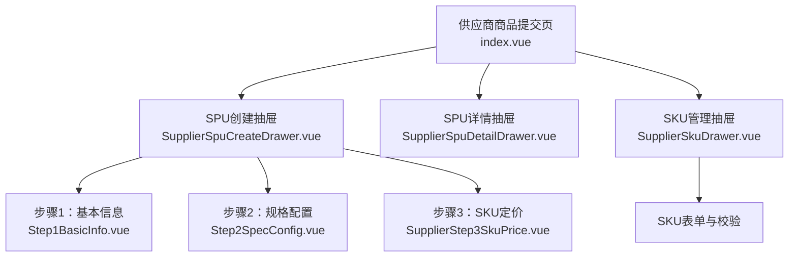
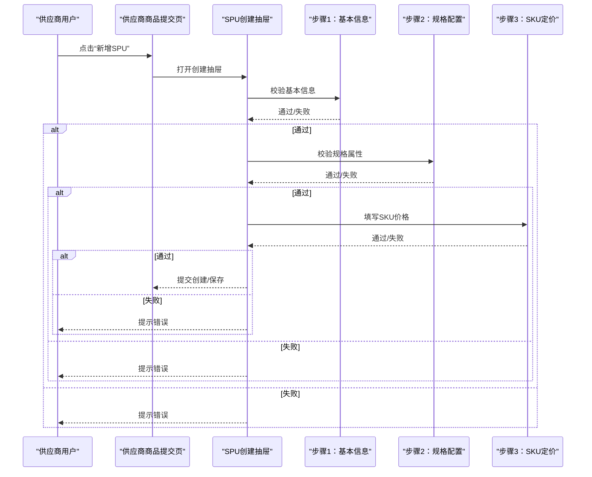
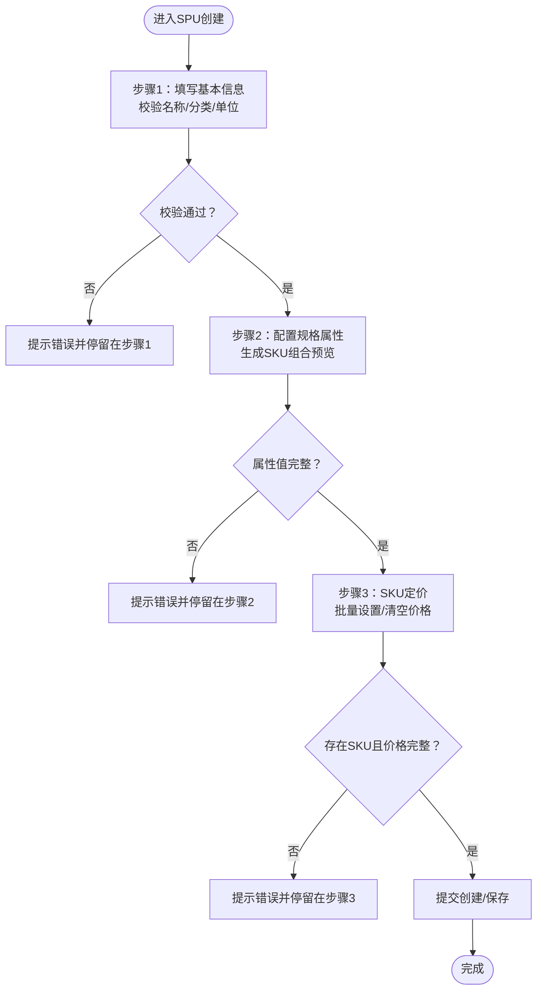
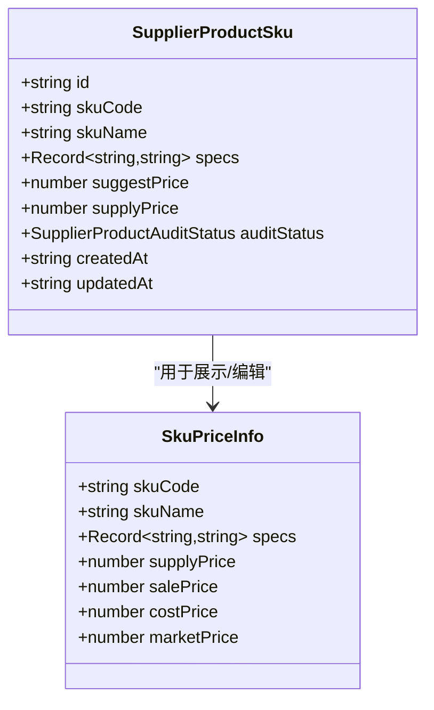
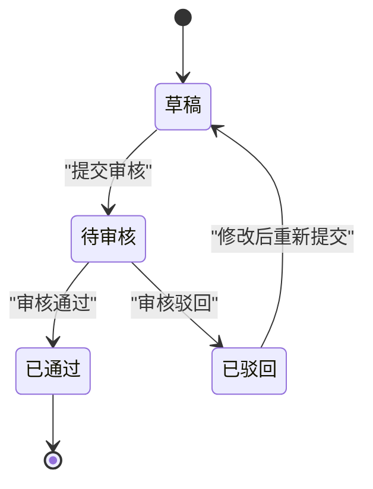
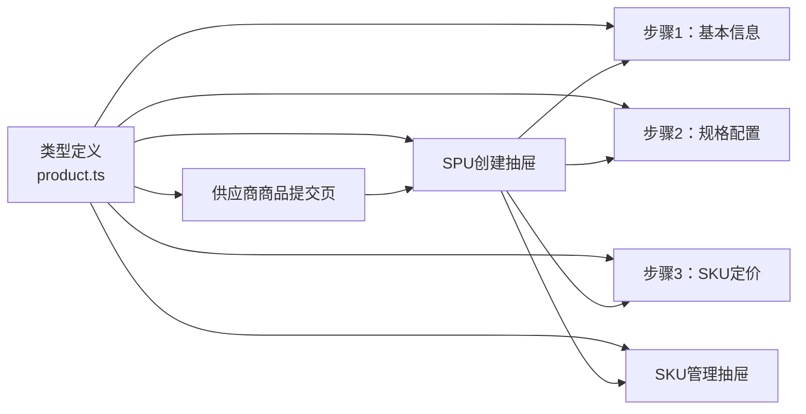

# 产品提交流程

<cite>
**本文引用的文件**
- [apps/pc/src/views/supplier/product-submit/index.vue](file://apps/pc/src/views/supplier/product-submit/index.vue)
- [apps/pc/src/views/supplier/product-submit/components/SupplierSpuCreateDrawer.vue](file://apps/pc/src/views/supplier/product-submit/components/SupplierSpuCreateDrawer.vue)
- [apps/pc/src/views/supplier/product-submit/components/SupplierSpuDetailDrawer.vue](file://apps/pc/src/views/supplier/product-submit/components/SupplierSpuDetailDrawer.vue)
- [apps/pc/src/views/supplier/product-submit/components/SupplierSkuDrawer.vue](file://apps/pc/src/views/supplier/product-submit/components/SupplierSkuDrawer.vue)
- [apps/pc/src/views/supplier/product-submit/components/SupplierStep3SkuPrice.vue](file://apps/pc/src/views/supplier/product-submit/components/SupplierStep3SkuPrice.vue)
- [apps/pc/src/views/product/spu/components/Step1BasicInfo.vue](file://apps/pc/src/views/product/spu/components/Step1BasicInfo.vue)
- [apps/pc/src/views/product/spu/components/Step2SpecConfig.vue](file://apps/pc/src/views/product/spu/components/Step2SpecConfig.vue)
- [packages/types/src/product.ts](file://packages/types/src/product.ts)
- [docs/供应商端商品中心功能说明书.md](file://docs/供应商端商品中心功能说明书.md)
- [docs/PRD/06-商品板块功能清单.md](file://docs/PRD/06-商品板块功能清单.md)
</cite>

## 目录
1. [简介](#简介)
2. [项目结构](#项目结构)
3. [核心组件](#核心组件)
4. [架构总览](#架构总览)
5. [详细组件分析](#详细组件分析)
6. [依赖分析](#依赖分析)
7. [性能考虑](#性能考虑)
8. [故障排查指南](#故障排查指南)
9. [结论](#结论)
10. [附录](#附录)

## 简介
本文件面向供应商端“商品提交流程”，系统化梳理从SPU创建到SKU配置、价格设置、审核与状态管理的完整闭环。文档基于前端实现与类型定义，结合PRD与功能说明书，给出步骤化的业务逻辑、数据校验规则、用户体验设计与常见问题处理建议。

## 项目结构
供应商商品提交流程主要由以下页面与组件构成：
- 供应商商品提交入口页：负责SPU/SKU列表展示、筛选、提交审核、删除等操作
- SPU创建抽屉：分步表单（基本信息、规格属性、SKU定价），支持编辑与创建
- SPU详情抽屉：展示SPU基础信息、图片、SKU列表与审核状态
- SKU管理抽屉：管理SPU下的SKU集合，支持新增、编辑、删除与图片上传
- SPU步骤组件：Step1（基本信息）、Step2（规格配置）、Step3（SKU定价）

图表来源
- [apps/pc/src/views/supplier/product-submit/index.vue:1-649](file://apps/pc/src/views/supplier/product-submit/index.vue#L1-L649)
- [apps/pc/src/views/supplier/product-submit/components/SupplierSpuCreateDrawer.vue:1-209](file://apps/pc/src/views/supplier/product-submit/components/SupplierSpuCreateDrawer.vue#L1-L209)
- [apps/pc/src/views/supplier/product-submit/components/SupplierSpuDetailDrawer.vue:1-209](file://apps/pc/src/views/supplier/product-submit/components/SupplierSpuDetailDrawer.vue#L1-L209)
- [apps/pc/src/views/supplier/product-submit/components/SupplierSkuDrawer.vue:1-496](file://apps/pc/src/views/supplier/product-submit/components/SupplierSkuDrawer.vue#L1-L496)
- [apps/pc/src/views/product/spu/components/Step1BasicInfo.vue:1-142](file://apps/pc/src/views/product/spu/components/Step1BasicInfo.vue#L1-L142)
- [apps/pc/src/views/product/spu/components/Step2SpecConfig.vue:1-331](file://apps/pc/src/views/product/spu/components/Step2SpecConfig.vue#L1-L331)
- [apps/pc/src/views/supplier/product-submit/components/SupplierStep3SkuPrice.vue:1-138](file://apps/pc/src/views/supplier/product-submit/components/SupplierStep3SkuPrice.vue#L1-L138)

章节来源
- [apps/pc/src/views/supplier/product-submit/index.vue:1-649](file://apps/pc/src/views/supplier/product-submit/index.vue#L1-L649)
- [apps/pc/src/views/supplier/product-submit/components/SupplierSpuCreateDrawer.vue:1-209](file://apps/pc/src/views/supplier/product-submit/components/SupplierSpuCreateDrawer.vue#L1-L209)
- [apps/pc/src/views/supplier/product-submit/components/SupplierSpuDetailDrawer.vue:1-209](file://apps/pc/src/views/supplier/product-submit/components/SupplierSpuDetailDrawer.vue#L1-L209)
- [apps/pc/src/views/supplier/product-submit/components/SupplierSkuDrawer.vue:1-496](file://apps/pc/src/views/supplier/product-submit/components/SupplierSkuDrawer.vue#L1-L496)
- [apps/pc/src/views/product/spu/components/Step1BasicInfo.vue:1-142](file://apps/pc/src/views/product/spu/components/Step1BasicInfo.vue#L1-L142)
- [apps/pc/src/views/product/spu/components/Step2SpecConfig.vue:1-331](file://apps/pc/src/views/product/spu/components/Step2SpecConfig.vue#L1-L331)
- [apps/pc/src/views/supplier/product-submit/components/SupplierStep3SkuPrice.vue:1-138](file://apps/pc/src/views/supplier/product-submit/components/SupplierStep3SkuPrice.vue#L1-L138)

## 核心组件
- 供应商商品提交页：提供SPU/SKU双视图切换、筛选、分页、提交审核、删除等能力；调用抽屉组件完成创建/编辑/查看详情
- SPU创建抽屉：分步表单，包含基本信息、规格属性、SKU定价三步；最后统一提交创建或保存
- SPU详情抽屉：展示SPU基础信息、图片、SKU列表与审核状态
- SKU管理抽屉：展示SPU下SKU列表，支持新增、编辑、删除；SKU表单包含编码/名称、规格属性、价格、主图上传等
- 步骤组件：Step1（基本信息校验与图片管理）、Step2（规格属性选择与SKU组合预览）、Step3（SKU定价批量设置与清空）

章节来源
- [apps/pc/src/views/supplier/product-submit/index.vue:1-649](file://apps/pc/src/views/supplier/product-submit/index.vue#L1-L649)
- [apps/pc/src/views/supplier/product-submit/components/SupplierSpuCreateDrawer.vue:1-209](file://apps/pc/src/views/supplier/product-submit/components/SupplierSpuCreateDrawer.vue#L1-L209)
- [apps/pc/src/views/supplier/product-submit/components/SupplierSpuDetailDrawer.vue:1-209](file://apps/pc/src/views/supplier/product-submit/components/SupplierSpuDetailDrawer.vue#L1-L209)
- [apps/pc/src/views/supplier/product-submit/components/SupplierSkuDrawer.vue:1-496](file://apps/pc/src/views/supplier/product-submit/components/SupplierSkuDrawer.vue#L1-L496)
- [apps/pc/src/views/product/spu/components/Step1BasicInfo.vue:1-142](file://apps/pc/src/views/product/spu/components/Step1BasicInfo.vue#L1-L142)
- [apps/pc/src/views/product/spu/components/Step2SpecConfig.vue:1-331](file://apps/pc/src/views/product/spu/components/Step2SpecConfig.vue#L1-L331)
- [apps/pc/src/views/supplier/product-submit/components/SupplierStep3SkuPrice.vue:1-138](file://apps/pc/src/views/supplier/product-submit/components/SupplierStep3SkuPrice.vue#L1-L138)

## 架构总览
供应商商品提交流程采用“页面+抽屉+步骤组件”的分层设计：
- 页面负责列表与操作入口
- 抽屉承载创建/编辑/详情等复杂交互
- 步骤组件封装各阶段的表单与校验逻辑

图表来源
- [apps/pc/src/views/supplier/product-submit/index.vue:550-582](file://apps/pc/src/views/supplier/product-submit/index.vue#L550-L582)
- [apps/pc/src/views/supplier/product-submit/components/SupplierSpuCreateDrawer.vue:140-184](file://apps/pc/src/views/supplier/product-submit/components/SupplierSpuCreateDrawer.vue#L140-L184)
- [apps/pc/src/views/product/spu/components/Step1BasicInfo.vue:96-105](file://apps/pc/src/views/product/spu/components/Step1BasicInfo.vue#L96-L105)
- [apps/pc/src/views/product/spu/components/Step2SpecConfig.vue:222-230](file://apps/pc/src/views/product/spu/components/Step2SpecConfig.vue#L222-L230)
- [apps/pc/src/views/supplier/product-submit/components/SupplierStep3SkuPrice.vue:108-112](file://apps/pc/src/views/supplier/product-submit/components/SupplierStep3SkuPrice.vue#L108-L112)

## 详细组件分析

### SPU创建流程（分步表单）
- 步骤1：基本信息
  - 校验项：SPU名称、所属分类、计量单位必填
  - 图片管理：支持主图URL输入与相册图片列表维护
  - 描述与备注：限制字数，支持多行文本
- 步骤2：规格配置
  - 选择规格属性：支持搜索、勾选、预览SKU组合数量
  - 属性值维护：支持输入与回车添加，支持移除
  - SKU组合生成：根据所选属性与值自动生成SKU组合列表
- 步骤3：SKU定价
  - 批量设置价格：支持建议售价与供货价批量赋值
  - 清空价格：一键清空所有SKU价格
  - 最终校验：至少存在一个SKU且价格信息完整

图表来源
- [apps/pc/src/views/product/spu/components/Step1BasicInfo.vue:5-72](file://apps/pc/src/views/product/spu/components/Step1BasicInfo.vue#L5-L72)
- [apps/pc/src/views/product/spu/components/Step2SpecConfig.vue:105-230](file://apps/pc/src/views/product/spu/components/Step2SpecConfig.vue#L105-L230)
- [apps/pc/src/views/supplier/product-submit/components/SupplierStep3SkuPrice.vue:93-112](file://apps/pc/src/views/supplier/product-submit/components/SupplierStep3SkuPrice.vue#L93-L112)
- [apps/pc/src/views/supplier/product-submit/components/SupplierSpuCreateDrawer.vue:140-184](file://apps/pc/src/views/supplier/product-submit/components/SupplierSpuCreateDrawer.vue#L140-L184)

章节来源
- [apps/pc/src/views/product/spu/components/Step1BasicInfo.vue:1-142](file://apps/pc/src/views/product/spu/components/Step1BasicInfo.vue#L1-L142)
- [apps/pc/src/views/product/spu/components/Step2SpecConfig.vue:1-331](file://apps/pc/src/views/product/spu/components/Step2SpecConfig.vue#L1-L331)
- [apps/pc/src/views/supplier/product-submit/components/SupplierStep3SkuPrice.vue:1-138](file://apps/pc/src/views/supplier/product-submit/components/SupplierStep3SkuPrice.vue#L1-L138)
- [apps/pc/src/views/supplier/product-submit/components/SupplierSpuCreateDrawer.vue:1-209](file://apps/pc/src/views/supplier/product-submit/components/SupplierSpuCreateDrawer.vue#L1-L209)

### SKU配置与价格设置
- SKU管理抽屉
  - 展示SPU基础信息卡片（主图、名称、编码、分类、单位）
  - 列表展示SKU编码、名称、规格、建议售价、供货价、状态
  - 支持添加、编辑、删除SKU
- SKU表单
  - 必填项：SKU编码、SKU名称
  - 规格属性：根据SPU关联属性动态渲染，支持选择或自定义输入
  - 价格：建议售价、供货价，数值型输入，保留两位小数
  - 主图：支持图片上传，限制为1张
- 价格策略
  - 建议售价：用于指导销售参考
  - 供货价：供应商对平台的供货单价
  - 批量设置：支持对所有SKU批量赋值价格，留空字段不覆盖

图表来源
- [packages/types/src/product.ts:362-388](file://packages/types/src/product.ts#L362-L388)
- [packages/types/src/product.ts:198-209](file://packages/types/src/product.ts#L198-L209)

章节来源
- [apps/pc/src/views/supplier/product-submit/components/SupplierSkuDrawer.vue:1-496](file://apps/pc/src/views/supplier/product-submit/components/SupplierSkuDrawer.vue#L1-L496)
- [packages/types/src/product.ts:198-388](file://packages/types/src/product.ts#L198-L388)

### 审核流程与状态管理
- 审核状态枚举：草稿、待审核、已通过、已驳回
- 提交审核
  - 仅草稿态可提交；提交后状态变为“待审核”
  - 提交前二次确认，防止误操作
- 审核结果反馈
  - 审核通过：商品可以上架
  - 审核驳回：需修改后重新提交
- 状态颜色与文案映射：灰/橙/绿/红分别对应草稿/待审核/已通过/已驳回

图表来源
- [packages/types/src/product.ts:330-335](file://packages/types/src/product.ts#L330-L335)
- [apps/pc/src/views/supplier/product-submit/index.vue:571-582](file://apps/pc/src/views/supplier/product-submit/index.vue#L571-L582)

章节来源
- [packages/types/src/product.ts:330-388](file://packages/types/src/product.ts#L330-L388)
- [apps/pc/src/views/supplier/product-submit/index.vue:1-649](file://apps/pc/src/views/supplier/product-submit/index.vue#L1-L649)

### 数据验证规则与用户体验
- 表单校验
  - 步骤1：名称、分类、单位必填；描述/备注字数限制
  - 步骤2：至少选择一个属性且每个属性至少有一个值
  - 步骤3：至少存在一个SKU；价格字段为非负数
  - SKU表单：编码/名称必填；规格属性按SPU关联属性动态渲染
- 用户体验
  - 分步引导：步骤间显式校验，失败时停留在当前步骤
  - 组合预览：规格配置后即时展示SKU组合数量与示例
  - 批量操作：支持批量设置价格与清空价格
  - 状态可视化：标签颜色与文案直观反映审核状态

章节来源
- [apps/pc/src/views/product/spu/components/Step1BasicInfo.vue:5-72](file://apps/pc/src/views/product/spu/components/Step1BasicInfo.vue#L5-L72)
- [apps/pc/src/views/product/spu/components/Step2SpecConfig.vue:105-230](file://apps/pc/src/views/product/spu/components/Step2SpecConfig.vue#L105-L230)
- [apps/pc/src/views/supplier/product-submit/components/SupplierStep3SkuPrice.vue:93-112](file://apps/pc/src/views/supplier/product-submit/components/SupplierStep3SkuPrice.vue#L93-L112)
- [apps/pc/src/views/supplier/product-submit/components/SupplierSkuDrawer.vue:237-240](file://apps/pc/src/views/supplier/product-submit/components/SupplierSkuDrawer.vue#L237-L240)

## 依赖分析
- 类型依赖
  - 审核状态枚举：统一来源于类型定义文件
  - SPU/SKU接口：包含审核状态、价格字段、规格映射等
- 组件耦合
  - 页面与抽屉：通过visible与success事件解耦
  - 抽屉与步骤组件：通过ref.validate与formData双向通信
  - SKU管理抽屉：与SPU基础信息联动，动态渲染规格属性

图表来源
- [packages/types/src/product.ts:330-388](file://packages/types/src/product.ts#L330-L388)
- [apps/pc/src/views/supplier/product-submit/index.vue:1-649](file://apps/pc/src/views/supplier/product-submit/index.vue#L1-L649)
- [apps/pc/src/views/supplier/product-submit/components/SupplierSpuCreateDrawer.vue:1-209](file://apps/pc/src/views/supplier/product-submit/components/SupplierSpuCreateDrawer.vue#L1-L209)
- [apps/pc/src/views/supplier/product-submit/components/SupplierSkuDrawer.vue:1-496](file://apps/pc/src/views/supplier/product-submit/components/SupplierSkuDrawer.vue#L1-L496)

章节来源
- [packages/types/src/product.ts:1-431](file://packages/types/src/product.ts#L1-L431)
- [apps/pc/src/views/supplier/product-submit/index.vue:1-649](file://apps/pc/src/views/supplier/product-submit/index.vue#L1-L649)
- [apps/pc/src/views/supplier/product-submit/components/SupplierSpuCreateDrawer.vue:1-209](file://apps/pc/src/views/supplier/product-submit/components/SupplierSpuCreateDrawer.vue#L1-L209)
- [apps/pc/src/views/supplier/product-submit/components/SupplierSkuDrawer.vue:1-496](file://apps/pc/src/views/supplier/product-submit/components/SupplierSkuDrawer.vue#L1-L496)

## 性能考虑
- 列表加载：页面采用本地mock数据，实际项目应接入分页与懒加载
- 表单校验：步骤组件暴露validate方法，避免不必要的异步请求
- 图片上传：SKU主图限制为1张，减少上传与存储压力
- 组合生成：规格组合数量较大时，预览列表限制展示数量，避免DOM过载

## 故障排查指南
- 提交审核不可用
  - 检查SPU是否处于草稿态且已配置SKU
  - 确认提交前二次确认弹窗是否被拦截
- 规格配置无SKU
  - 确保每个属性至少有一个值；检查“生成SKU组合”逻辑
- SKU价格为空
  - 确认SKU列表非空；检查批量设置是否覆盖
- SKU编辑/删除受限
  - 若SKU状态为“已通过”，编辑/删除按钮会被禁用，需先修改为草稿态

章节来源
- [apps/pc/src/views/supplier/product-submit/index.vue:571-582](file://apps/pc/src/views/supplier/product-submit/index.vue#L571-L582)
- [apps/pc/src/views/product/spu/components/Step2SpecConfig.vue:185-220](file://apps/pc/src/views/product/spu/components/Step2SpecConfig.vue#L185-L220)
- [apps/pc/src/views/supplier/product-submit/components/SupplierSkuDrawer.vue:338-366](file://apps/pc/src/views/supplier/product-submit/components/SupplierSkuDrawer.vue#L338-L366)

## 结论
供应商商品提交流程通过“页面+抽屉+步骤组件”的分层设计，实现了SPU创建、规格配置、SKU定价与审核管理的闭环。严格的表单校验与清晰的状态反馈提升了用户体验与业务一致性。后续可在真实数据接入、性能优化与异常处理方面持续改进。

## 附录
- 相关PRD与功能清单
  - 供应商端商品中心功能说明书
  - 商品板块功能清单（含SPU/SKU/价格/审核等）

章节来源
- [docs/供应商端商品中心功能说明书.md:1-542](file://docs/供应商端商品中心功能说明书.md#L1-L542)
- [docs/PRD/06-商品板块功能清单.md:1-273](file://docs/PRD/06-商品板块功能清单.md#L1-L273)