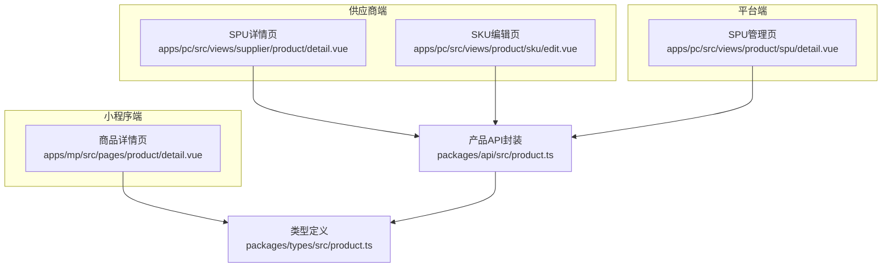
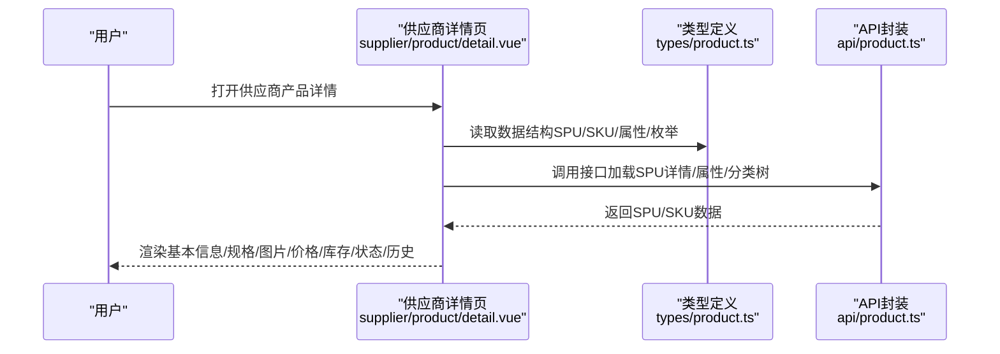
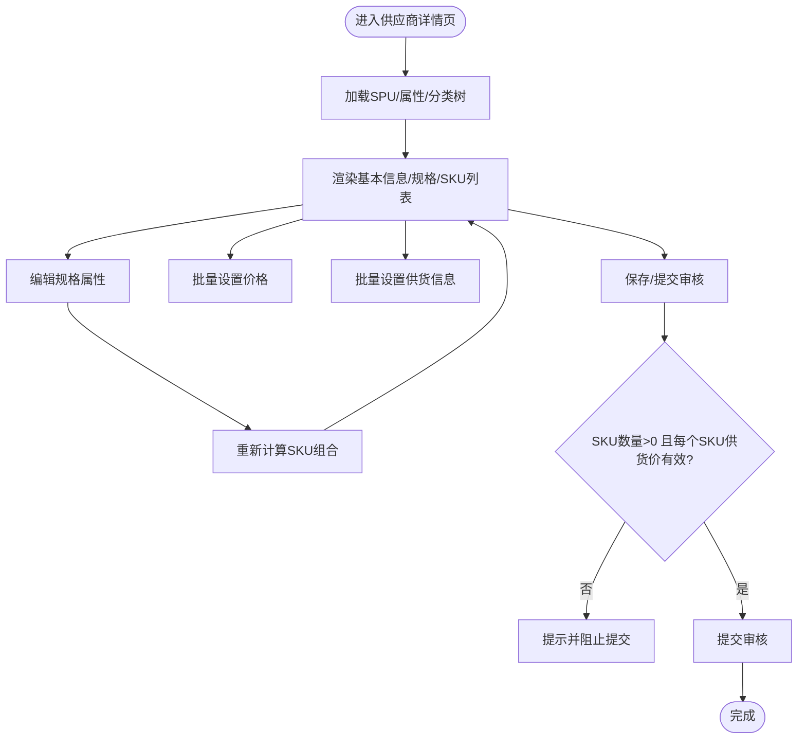
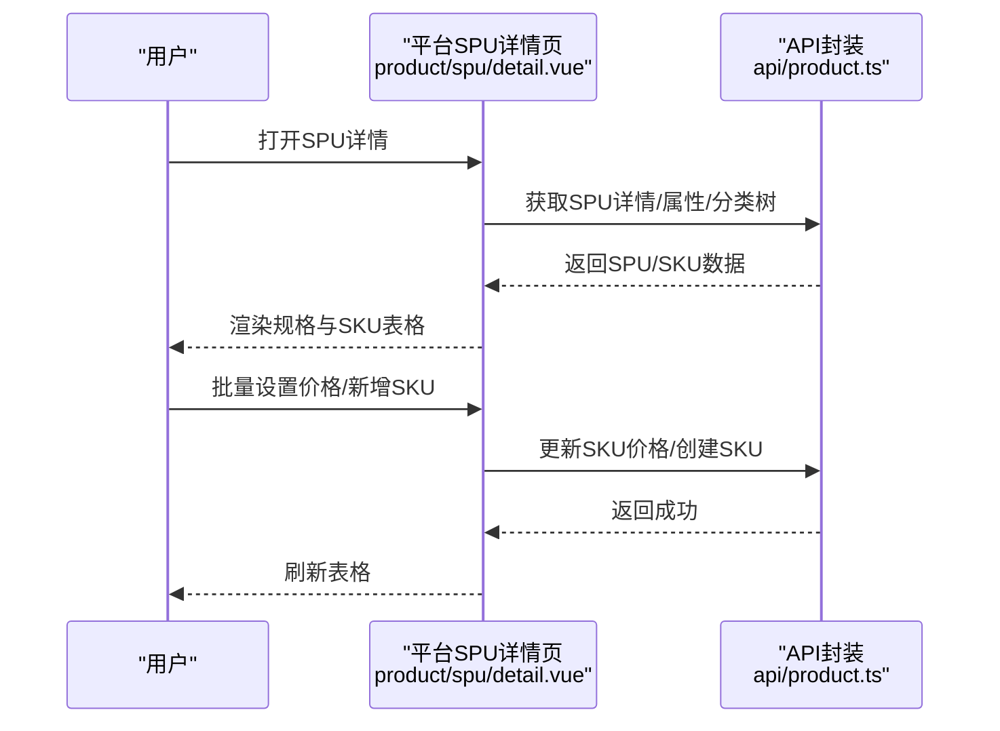
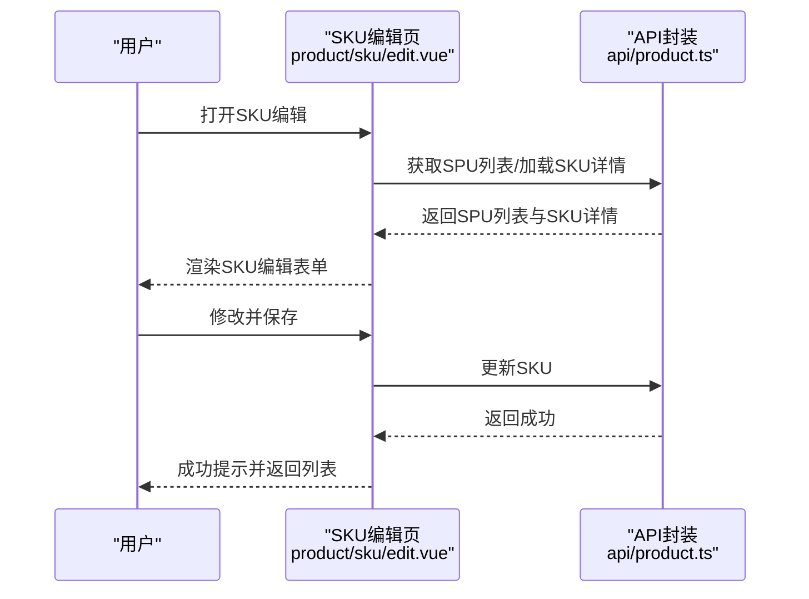
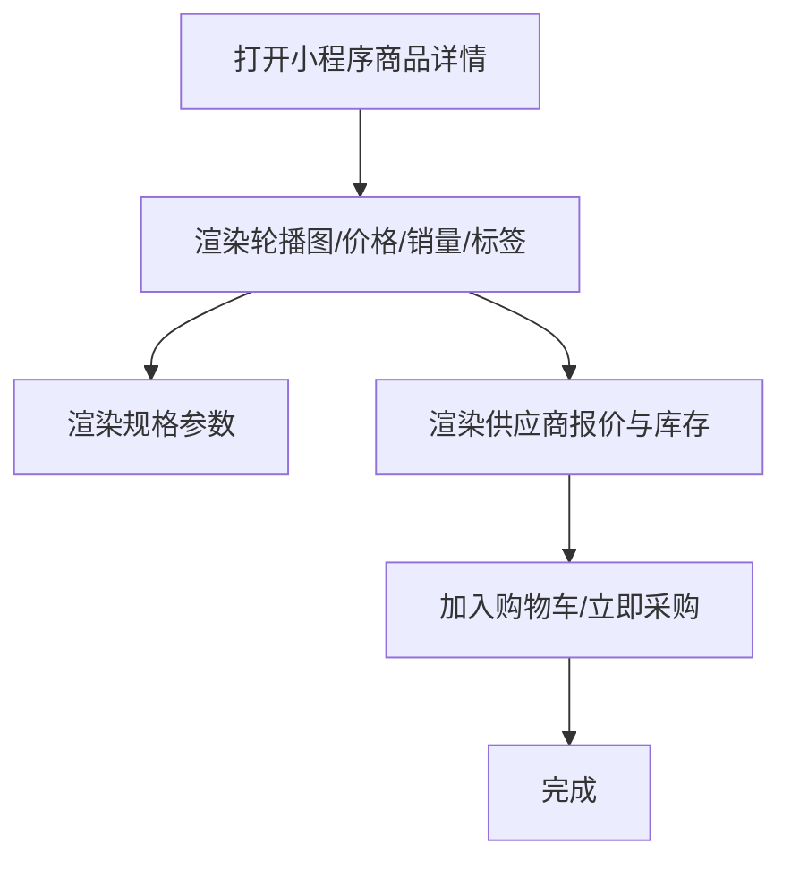
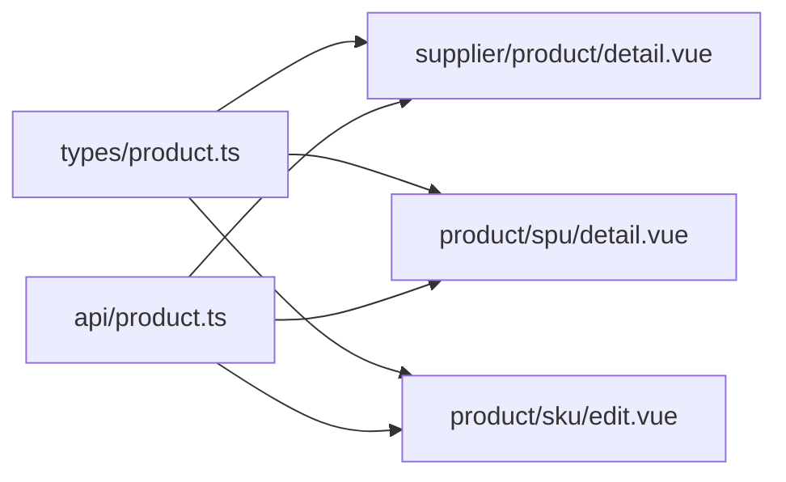

# 产品详情查看

<cite>
**本文引用的文件**
- [apps/pc/src/views/supplier/product/detail.vue](file://apps/pc/src/views/supplier/product/detail.vue)
- [apps/pc/src/views/product/spu/detail.vue](file://apps/pc/src/views/product/spu/detail.vue)
- [apps/pc/src/views/product/sku/edit.vue](file://apps/pc/src/views/product/sku/edit.vue)
- [apps/mp/src/pages/product/detail.vue](file://apps/mp/src/pages/product/detail.vue)
- [packages/types/src/product.ts](file://packages/types/src/product.ts)
- [packages/api/src/product.ts](file://packages/api/src/product.ts)
</cite>

## 目录
1. [简介](#简介)
2. [项目结构](#项目结构)
3. [核心组件](#核心组件)
4. [架构总览](#架构总览)
5. [详细组件分析](#详细组件分析)
6. [依赖关系分析](#依赖关系分析)
7. [性能考量](#性能考量)
8. [故障排查指南](#故障排查指南)
9. [结论](#结论)

## 简介
本文件聚焦“供应商产品详情查看”功能，系统性阐述供应商视角下的商品详情页面展示内容与交互逻辑，覆盖以下维度：
- 商品基本信息（SPU/SKU 编码、名称、分类、品牌）
- 规格参数详情（规格属性、单位、规格值）
- 图片展示（主图、轮播图、规格图）
- 库存信息（当前库存、预计供货量、最小起订量）
- 价格信息（供货价、销售价、成本价）
- 状态信息（审核状态、供货状态、上架状态）
- 操作历史（日志）

并结合前端页面与类型/接口定义，说明数据来源、渲染规则与交互流程。

## 项目结构
围绕“产品详情查看”，涉及以下页面与模块：
- 供应商端详情页：供应商对自有商品的“申请供货/查看/编辑”入口
- 平台端SPU管理页：平台侧SPU维护与SKU管理
- SKU编辑页：SKU级别的价格与图片维护
- 小程序端商品详情页：面向终端用户的商品浏览
- 类型与API：统一的数据结构与调用封装

图表来源
- [apps/pc/src/views/supplier/product/detail.vue:1-1081](file://apps/pc/src/views/supplier/product/detail.vue#L1-L1081)
- [apps/pc/src/views/product/spu/detail.vue:1-1235](file://apps/pc/src/views/product/spu/detail.vue#L1-L1235)
- [apps/pc/src/views/product/sku/edit.vue:1-296](file://apps/pc/src/views/product/sku/edit.vue#L1-L296)
- [apps/mp/src/pages/product/detail.vue:1-394](file://apps/mp/src/pages/product/detail.vue#L1-L394)
- [packages/types/src/product.ts:1-431](file://packages/types/src/product.ts#L1-L431)
- [packages/api/src/product.ts:1-258](file://packages/api/src/product.ts#L1-L258)

章节来源
- [apps/pc/src/views/supplier/product/detail.vue:1-1081](file://apps/pc/src/views/supplier/product/detail.vue#L1-L1081)
- [apps/pc/src/views/product/spu/detail.vue:1-1235](file://apps/pc/src/views/product/spu/detail.vue#L1-L1235)
- [apps/pc/src/views/product/sku/edit.vue:1-296](file://apps/pc/src/views/product/sku/edit.vue#L1-L296)
- [apps/mp/src/pages/product/detail.vue:1-394](file://apps/mp/src/pages/product/detail.vue#L1-L394)
- [packages/types/src/product.ts:1-431](file://packages/types/src/product.ts#L1-L431)
- [packages/api/src/product.ts:1-258](file://packages/api/src/product.ts#L1-L258)

## 核心组件
- 供应商SPU详情页（申请供货/查看）
  - 展示SPU基本信息、规格属性、SKU列表与批量设置能力
  - 支持从平台库导入SKU并补充供货信息
- 平台SPU管理页
  - 维护SPU基础信息、规格属性、SKU列表与价格
- SKU编辑页
  - 维护SKU的名称、规格、图片与价格
- 小程序端商品详情页
  - 面向终端用户展示价格、规格参数、供应商报价与图片轮播

章节来源
- [apps/pc/src/views/supplier/product/detail.vue:1-1081](file://apps/pc/src/views/supplier/product/detail.vue#L1-L1081)
- [apps/pc/src/views/product/spu/detail.vue:1-1235](file://apps/pc/src/views/product/spu/detail.vue#L1-L1235)
- [apps/pc/src/views/product/sku/edit.vue:1-296](file://apps/pc/src/views/product/sku/edit.vue#L1-L296)
- [apps/mp/src/pages/product/detail.vue:1-394](file://apps/mp/src/pages/product/detail.vue#L1-L394)

## 架构总览
供应商产品详情查看涉及“页面渲染—数据模型—接口调用—类型约束”的闭环：

图表来源
- [apps/pc/src/views/supplier/product/detail.vue:514-669](file://apps/pc/src/views/supplier/product/detail.vue#L514-L669)
- [packages/types/src/product.ts:90-164](file://packages/types/src/product.ts#L90-L164)
- [packages/api/src/product.ts:141-196](file://packages/api/src/product.ts#L141-L196)

## 详细组件分析

### 供应商SPU详情页（申请供货/查看）
- 页面职责
  - 查看/编辑SPU基本信息（名称、编码、分类、单位、主图、相册、描述）
  - 维护规格属性（名称、可选值），自动生成SKU组合
  - 维护SKU列表（SKU主图、SKU编码/名称、规格组合、供货价、预计供货量、最小起订量、供货周期）
  - 批量设置价格与批量设置供货信息
  - 从平台库导入SKU并补充供货信息
- 数据模型要点
  - SPU：包含SPU名称、编码、分类路径、单位、主图、相册、描述等
  - 规格属性：名称+可选值集合
  - SKU：包含SKU编码、名称、规格组合、图片、价格与库存相关字段
- 关键交互
  - 规格变更触发SKU组合重算
  - 主图变更联动更新SKU默认主图
  - 批量设置价格/供货信息
  - 保存时校验SKU至少一个且每个SKU需填写有效供货价
- 状态与审核
  - 提交审核后进入供应商商品的审核流程（状态在类型定义中体现）

图表来源
- [apps/pc/src/views/supplier/product/detail.vue:776-962](file://apps/pc/src/views/supplier/product/detail.vue#L776-L962)

章节来源
- [apps/pc/src/views/supplier/product/detail.vue:1-1081](file://apps/pc/src/views/supplier/product/detail.vue#L1-L1081)
- [packages/types/src/product.ts:330-431](file://packages/types/src/product.ts#L330-L431)

### 平台SPU管理页
- 页面职责
  - 维护SPU基本信息与描述、备注
  - 维护规格属性与SKU列表
  - 批量设置价格（供货价、销售价）
  - 单独新增SKU并设置规格与价格
- 数据模型要点
  - SPU：含SPU名称、编码、分类、单位、主图、相册、描述、备注
  - SKU：含SKU编码、名称、规格组合、图片、价格（供货价、销售价、成本价、市场价）
- 关键交互
  - 规格变更触发SKU组合重算（保留已有SKU）
  - 主图变更联动SKU默认主图
  - 批量设置价格与单独新增SKU

图表来源
- [apps/pc/src/views/product/spu/detail.vue:568-800](file://apps/pc/src/views/product/spu/detail.vue#L568-L800)
- [packages/api/src/product.ts:141-221](file://packages/api/src/product.ts#L141-L221)

章节来源
- [apps/pc/src/views/product/spu/detail.vue:1-1235](file://apps/pc/src/views/product/spu/detail.vue#L1-L1235)
- [packages/api/src/product.ts:141-221](file://packages/api/src/product.ts#L141-L221)

### SKU编辑页
- 页面职责
  - 维护SKU基本信息（所属SPU、SKU编码、SKU名称、规格属性、单位、条形码）
  - 维护SKU主图与价格（供货价、销售价）
- 数据模型要点
  - SKU：含规格属性、单位、主图、价格字段
- 关键交互
  - 加载SPU列表用于选择所属SPU
  - 加载SKU详情并支持保存

图表来源
- [apps/pc/src/views/product/sku/edit.vue:157-235](file://apps/pc/src/views/product/sku/edit.vue#L157-L235)
- [packages/api/src/product.ts:189-221](file://packages/api/src/product.ts#L189-L221)

章节来源
- [apps/pc/src/views/product/sku/edit.vue:1-296](file://apps/pc/src/views/product/sku/edit.vue#L1-L296)
- [packages/api/src/product.ts:189-221](file://packages/api/src/product.ts#L189-L221)

### 小程序端商品详情页
- 页面职责
  - 展示商品主图轮播
  - 展示价格、销量、标签
  - 展示规格参数
  - 展示供应商报价与库存
- 数据模型要点
  - 商品：名称、描述、价格、单位、销量、规格参数
  - 供应商报价：供应商名称、是否主供、是否有货、供应价、库存
- 关键交互
  - 图片轮播
  - 加入购物车/立即采购

图表来源
- [apps/mp/src/pages/product/detail.vue:1-394](file://apps/mp/src/pages/product/detail.vue#L1-L394)

章节来源
- [apps/mp/src/pages/product/detail.vue:1-394](file://apps/mp/src/pages/product/detail.vue#L1-L394)

## 依赖关系分析
- 类型约束
  - SPU/SKU/属性/枚举等类型在类型文件中统一定义，确保前后端一致
- 接口封装
  - API层对mock与真实接口进行抽象，便于切换与测试
- 页面依赖
  - 供应商详情页依赖平台SPU详情页的SKU生成与价格维护能力
  - SKU编辑页依赖SPU列表与SKU详情接口

图表来源
- [packages/types/src/product.ts:90-196](file://packages/types/src/product.ts#L90-L196)
- [packages/api/src/product.ts:141-221](file://packages/api/src/product.ts#L141-L221)
- [apps/pc/src/views/supplier/product/detail.vue:1-1081](file://apps/pc/src/views/supplier/product/detail.vue#L1-L1081)
- [apps/pc/src/views/product/spu/detail.vue:1-1235](file://apps/pc/src/views/product/spu/detail.vue#L1-L1235)
- [apps/pc/src/views/product/sku/edit.vue:1-296](file://apps/pc/src/views/product/sku/edit.vue#L1-L296)

章节来源
- [packages/types/src/product.ts:1-431](file://packages/types/src/product.ts#L1-L431)
- [packages/api/src/product.ts:1-258](file://packages/api/src/product.ts#L1-L258)
- [apps/pc/src/views/supplier/product/detail.vue:1-1081](file://apps/pc/src/views/supplier/product/detail.vue#L1-L1081)
- [apps/pc/src/views/product/spu/detail.vue:1-1235](file://apps/pc/src/views/product/spu/detail.vue#L1-L1235)
- [apps/pc/src/views/product/sku/edit.vue:1-296](file://apps/pc/src/views/product/sku/edit.vue#L1-L296)

## 性能考量
- 列表渲染优化
  - SKU表格使用固定列宽与横向滚动，避免DOM过长导致卡顿
- 图片处理
  - 主图与SKU主图采用懒加载策略，减少首屏压力
- 批量操作
  - 批量设置价格/供货信息时一次性更新，避免多次请求
- 数据缓存
  - 分类树与属性列表在页面初始化时加载一次，后续复用

## 故障排查指南
- 常见问题
  - 加载SPU详情失败：检查接口返回与错误提示
  - SKU为空或规格无效：确认规格属性是否完整且值未重复
  - 提交审核失败：确保每个SKU填写了有效的供货价
- 定位方法
  - 查看页面错误提示与控制台日志
  - 核对类型定义中的字段与接口返回结构
  - 使用浏览器开发者工具观察网络请求与响应

章节来源
- [apps/pc/src/views/supplier/product/detail.vue:617-669](file://apps/pc/src/views/supplier/product/detail.vue#L617-L669)
- [apps/pc/src/views/supplier/product/detail.vue:933-962](file://apps/pc/src/views/supplier/product/detail.vue#L933-L962)
- [packages/types/src/product.ts:90-196](file://packages/types/src/product.ts#L90-L196)

## 结论
供应商产品详情查看功能以“SPU+SKU”为核心，围绕规格属性生成SKU组合，并提供价格与库存信息的维护能力。页面通过清晰的数据结构与交互流程，实现了从平台导入、批量设置到提交审核的完整链路。类型与API层的规范化设计，保障了跨端一致性与可扩展性。