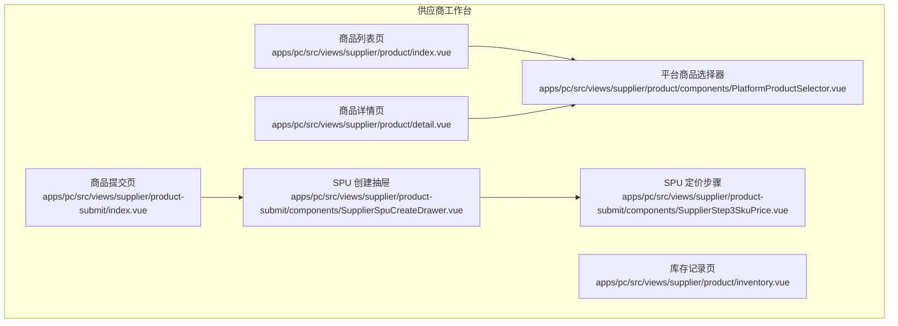
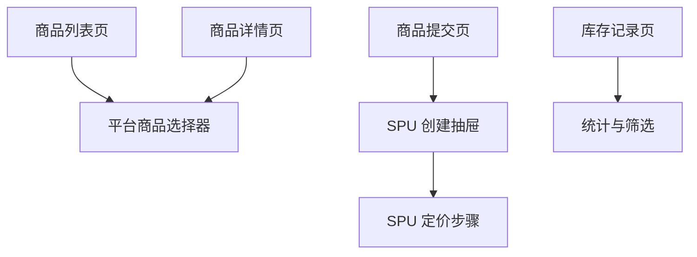
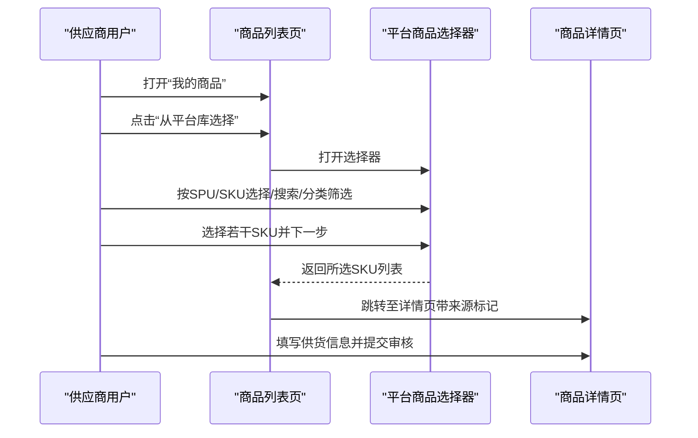
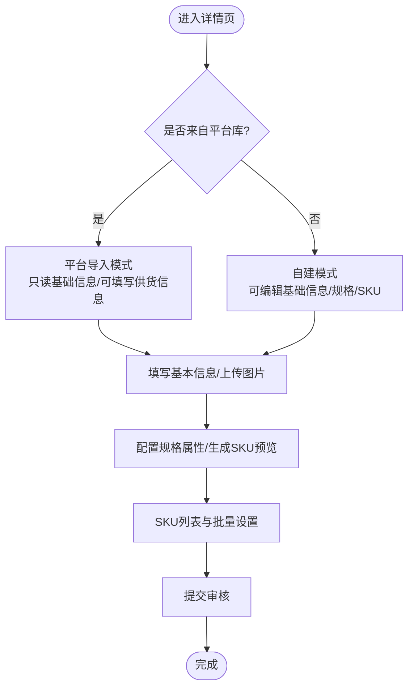
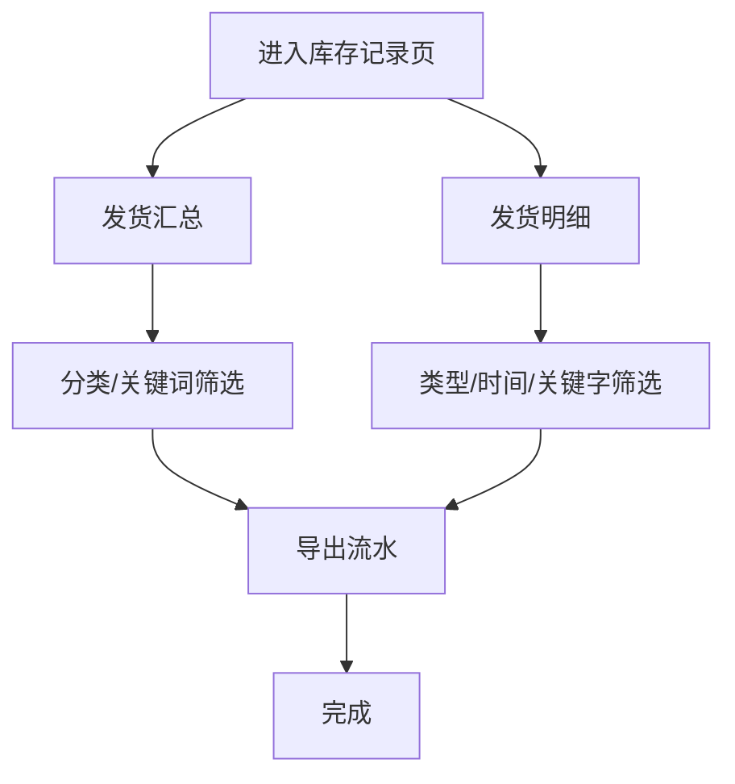
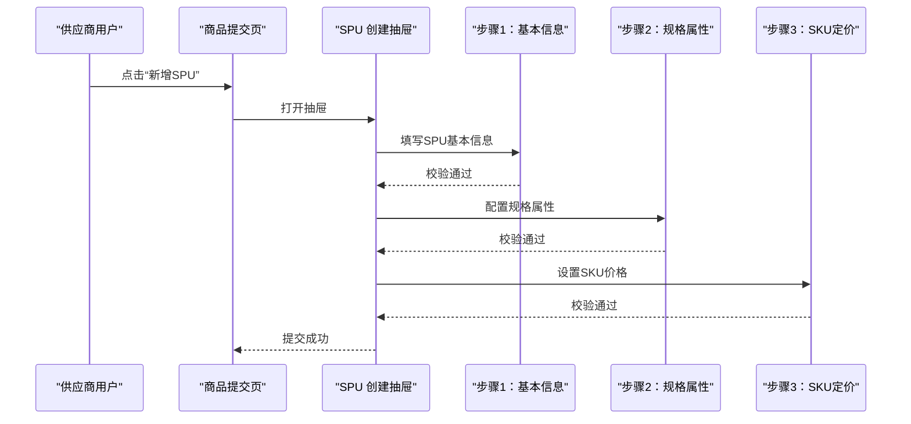
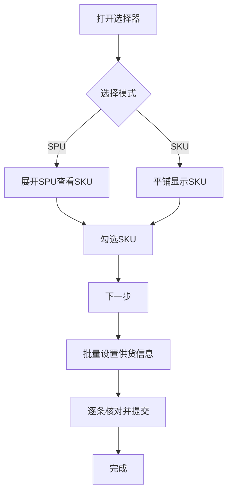
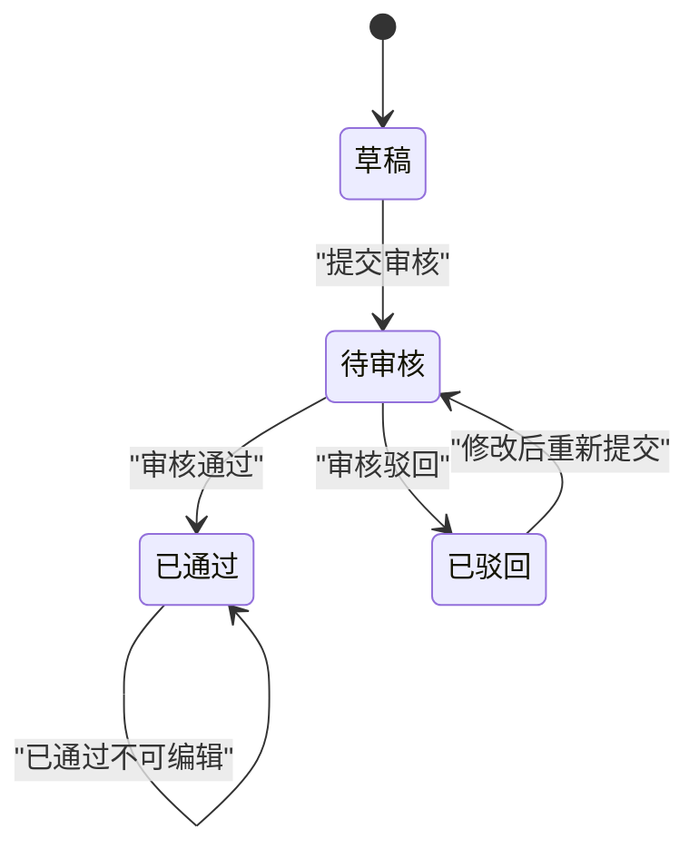
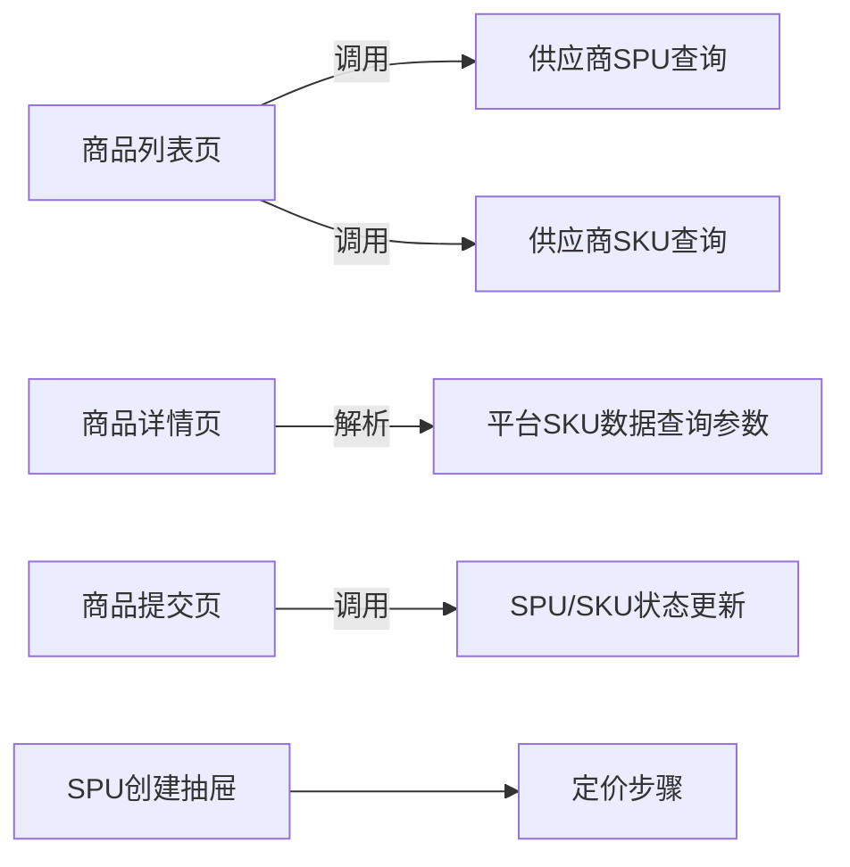

# 供应商产品管理

<cite>
**本文引用的文件**
- [apps/pc/src/views/supplier/product/index.vue](file://apps/pc/src/views/supplier/product/index.vue)
- [apps/pc/src/views/supplier/product/detail.vue](file://apps/pc/src/views/supplier/product/detail.vue)
- [apps/pc/src/views/supplier/product/inventory.vue](file://apps/pc/src/views/supplier/product/inventory.vue)
- [apps/pc/src/views/supplier/product/components/PlatformProductSelector.vue](file://apps/pc/src/views/supplier/product/components/PlatformProductSelector.vue)
- [apps/pc/src/views/supplier/product-submit/index.vue](file://apps/pc/src/views/supplier/product-submit/index.vue)
- [apps/pc/src/views/supplier/product-submit/components/SupplierSpuCreateDrawer.vue](file://apps/pc/src/views/supplier/product-submit/components/SupplierSpuCreateDrawer.vue)
- [apps/pc/src/views/supplier/product-submit/components/SupplierStep3SkuPrice.vue](file://apps/pc/src/views/supplier/product-submit/components/SupplierStep3SkuPrice.vue)
</cite>

## 目录
1. [简介](#简介)
2. [项目结构](#项目结构)
3. [核心组件](#核心组件)
4. [架构总览](#架构总览)
5. [详细组件分析](#详细组件分析)
6. [依赖分析](#依赖分析)
7. [性能考虑](#性能考虑)
8. [故障排查指南](#故障排查指南)
9. [结论](#结论)
10. [附录](#附录)

## 简介
本文件面向供应商侧“产品管理”能力，系统化梳理从商品列表、详情查看、库存记录，到商品提交流程、平台商品选择器以及审核管理的完整闭环。文档以代码级可视化方式呈现关键交互与数据流，并提供操作流程说明、审核机制与数据同步规则，帮助研发与运营人员快速理解与落地。

## 项目结构
供应商产品管理主要分布在 PC 端供应商工作台视图中，包含以下关键页面与组件：
- 商品列表页：支持 SPU/ SKU 切换、分类筛选、状态筛选、批量上下架等
- 商品详情页：支持从平台库导入商品、填写供货信息、规格与 SKU 配置
- 库存记录页：发货汇总与明细、统计与导出
- 商品提交页：SPU/SKU 管理、提交审核、删除等
- 选择器组件：平台商品选择器（按 SPU/SKU 选择，批量设置供货信息）
- 抽屉式创建流程：SPU 创建向导（基本信息 → 规格属性 → 定价）

图表来源
- [apps/pc/src/views/supplier/product/index.vue:1-402](file://apps/pc/src/views/supplier/product/index.vue#L1-L402)
- [apps/pc/src/views/supplier/product/detail.vue:1-411](file://apps/pc/src/views/supplier/product/detail.vue#L1-L411)
- [apps/pc/src/views/supplier/product/inventory.vue:1-164](file://apps/pc/src/views/supplier/product/inventory.vue#L1-L164)
- [apps/pc/src/views/supplier/product-submit/index.vue:1-233](file://apps/pc/src/views/supplier/product-submit/index.vue#L1-L233)
- [apps/pc/src/views/supplier/product/components/PlatformProductSelector.vue:1-219](file://apps/pc/src/views/supplier/product/components/PlatformProductSelector.vue#L1-L219)
- [apps/pc/src/views/supplier/product-submit/components/SupplierSpuCreateDrawer.vue:1-45](file://apps/pc/src/views/supplier/product-submit/components/SupplierSpuCreateDrawer.vue#L1-L45)
- [apps/pc/src/views/supplier/product-submit/components/SupplierStep3SkuPrice.vue:1-75](file://apps/pc/src/views/supplier/product-submit/components/SupplierStep3SkuPrice.vue#L1-L75)

章节来源
- [apps/pc/src/views/supplier/product/index.vue:1-402](file://apps/pc/src/views/supplier/product/index.vue#L1-L402)
- [apps/pc/src/views/supplier/product/detail.vue:1-411](file://apps/pc/src/views/supplier/product/detail.vue#L1-L411)
- [apps/pc/src/views/supplier/product/inventory.vue:1-164](file://apps/pc/src/views/supplier/product/inventory.vue#L1-L164)
- [apps/pc/src/views/supplier/product-submit/index.vue:1-233](file://apps/pc/src/views/supplier/product-submit/index.vue#L1-L233)
- [apps/pc/src/views/supplier/product/components/PlatformProductSelector.vue:1-219](file://apps/pc/src/views/supplier/product/components/PlatformProductSelector.vue#L1-L219)
- [apps/pc/src/views/supplier/product-submit/components/SupplierSpuCreateDrawer.vue:1-45](file://apps/pc/src/views/supplier/product-submit/components/SupplierSpuCreateDrawer.vue#L1-L45)
- [apps/pc/src/views/supplier/product-submit/components/SupplierStep3SkuPrice.vue:1-75](file://apps/pc/src/views/supplier/product-submit/components/SupplierStep3SkuPrice.vue#L1-L75)

## 核心组件
- 商品列表页：提供 SPU/ SKU 双视图、分类树联动、关键词与状态筛选、批量上下架、SKU 详情/编辑、供货状态变更等
- 商品详情页：支持从平台库导入 SKU 数据、填写主图/相册、规格属性、SKU 列表与批量设置、提交审核
- 库存记录页：发货汇总与明细、统计指标、筛选与导出
- 商品提交页：SPU/SKU 列表、新增/编辑/删除、提交审核、状态色标与文案映射
- 平台商品选择器：按 SPU/SKU 选择、批量设置供货信息、校验与提交
- SPU 创建抽屉：分步表单（基本信息/规格/定价），校验与提交

章节来源
- [apps/pc/src/views/supplier/product/index.vue:404-800](file://apps/pc/src/views/supplier/product/index.vue#L404-L800)
- [apps/pc/src/views/supplier/product/detail.vue:413-1081](file://apps/pc/src/views/supplier/product/detail.vue#L413-L1081)
- [apps/pc/src/views/supplier/product/inventory.vue:166-401](file://apps/pc/src/views/supplier/product/inventory.vue#L166-L401)
- [apps/pc/src/views/supplier/product-submit/index.vue:235-649](file://apps/pc/src/views/supplier/product-submit/index.vue#L235-L649)
- [apps/pc/src/views/supplier/product/components/PlatformProductSelector.vue:221-717](file://apps/pc/src/views/supplier/product/components/PlatformProductSelector.vue#L221-L717)
- [apps/pc/src/views/supplier/product-submit/components/SupplierSpuCreateDrawer.vue:47-209](file://apps/pc/src/views/supplier/product-submit/components/SupplierSpuCreateDrawer.vue#L47-L209)
- [apps/pc/src/views/supplier/product-submit/components/SupplierStep3SkuPrice.vue:77-138](file://apps/pc/src/views/supplier/product-submit/components/SupplierStep3SkuPrice.vue#L77-L138)

## 架构总览
供应商产品管理采用“页面 + 组件 + 抽屉”的分层组织，页面负责列表与详情，组件负责复用交互（如平台商品选择器），抽屉承载长流程（如 SPU 创建）。数据在页面与组件间通过 props/emits 传递，部分状态通过本地响应式变量维护，部分通过全局状态或 API 调用更新。

图表来源
- [apps/pc/src/views/supplier/product/index.vue:267-402](file://apps/pc/src/views/supplier/product/index.vue#L267-L402)
- [apps/pc/src/views/supplier/product/detail.vue:1-411](file://apps/pc/src/views/supplier/product/detail.vue#L1-L411)
- [apps/pc/src/views/supplier/product/components/PlatformProductSelector.vue:1-219](file://apps/pc/src/views/supplier/product/components/PlatformProductSelector.vue#L1-L219)
- [apps/pc/src/views/supplier/product-submit/index.vue:213-232](file://apps/pc/src/views/supplier/product-submit/index.vue#L213-L232)
- [apps/pc/src/views/supplier/product-submit/components/SupplierSpuCreateDrawer.vue:1-45](file://apps/pc/src/views/supplier/product-submit/components/SupplierSpuCreateDrawer.vue#L1-L45)
- [apps/pc/src/views/supplier/product-submit/components/SupplierStep3SkuPrice.vue:1-75](file://apps/pc/src/views/supplier/product-submit/components/SupplierStep3SkuPrice.vue#L1-L75)
- [apps/pc/src/views/supplier/product/inventory.vue:1-164](file://apps/pc/src/views/supplier/product/inventory.vue#L1-L164)

## 详细组件分析

### 商品列表管理（商品查询、筛选、状态管理）
- 功能要点
  - SPU/ SKU 双视图切换，分别支持关键词、分类、状态筛选
  - 分类树联动：支持搜索、展开/折叠、选中项重置
  - SKU 支持批量上下架、单个上下架、供货状态变更（继续/暂停/永久停货）
  - 从平台库选择商品入口，弹窗选择后进入详情页填写供货信息
- 关键交互
  - 列表加载与分页：本地模拟数据，支持刷新
  - 表单联动：分类选择、状态过滤、关键词搜索
  - 操作确认：上下架、批量操作、停货原因必填校验

图表来源
- [apps/pc/src/views/supplier/product/index.vue:13-18](file://apps/pc/src/views/supplier/product/index.vue#L13-L18)
- [apps/pc/src/views/supplier/product/index.vue:267-278](file://apps/pc/src/views/supplier/product/index.vue#L267-L278)
- [apps/pc/src/views/supplier/product/components/PlatformProductSelector.vue:1-219](file://apps/pc/src/views/supplier/product/components/PlatformProductSelector.vue#L1-L219)
- [apps/pc/src/views/supplier/product/detail.vue:1-411](file://apps/pc/src/views/supplier/product/detail.vue#L1-L411)

章节来源
- [apps/pc/src/views/supplier/product/index.vue:404-800](file://apps/pc/src/views/supplier/product/index.vue#L404-L800)

### 商品详情查看（信息、规格参数、图片、库存）
- 功能要点
  - 来源区分：平台导入/自建；平台导入时提示并锁定部分字段
  - 基本信息：名称、编码、分类、单位、主图/相册、描述
  - 规格属性：动态增删规格名与规格值，生成 SKU 组合预览
  - SKU 列表：支持批量设置供货信息（预计供货量/最小起订量/供货周期）
  - 提交审核：保存并提交，提交后禁止编辑
- 关键逻辑
  - 主图联动：主图变化时同步到 SKU 图片
  - SKU 生成：根据规格组合生成 SKU 列表
  - 批量设置：对所有 SKU 应用统一的供货信息

图表来源
- [apps/pc/src/views/supplier/product/detail.vue:413-1081](file://apps/pc/src/views/supplier/product/detail.vue#L413-L1081)

章节来源
- [apps/pc/src/views/supplier/product/detail.vue:413-1081](file://apps/pc/src/views/supplier/product/detail.vue#L413-L1081)

### 产品库存管理（数量、预警、调整）
- 功能要点
  - 发货汇总：按月统计正常发货/补发/累计发货、关联订单数
  - 明细记录：按类型（正常发货/补发）、时间范围、关键字筛选
  - 操作：查看明细、导出发货流水
- 使用建议
  - 库存以发货流水为准，不作为实际库存依据
  - 通过筛选定位特定商品的发货情况

图表来源
- [apps/pc/src/views/supplier/product/inventory.vue:166-401](file://apps/pc/src/views/supplier/product/inventory.vue#L166-L401)

章节来源
- [apps/pc/src/views/supplier/product/inventory.vue:166-401](file://apps/pc/src/views/supplier/product/inventory.vue#L166-L401)

### 商品提交流程（SPU 创建、SKU 配置、价格设置、审核）
- 功能要点
  - 商品提交页：SPU/SKU 列表、新增/编辑/删除、提交审核、状态色标
  - SPU 创建抽屉：分步表单（基本信息/规格/定价），每步校验
  - 定价步骤：SKU 列表、批量设置价格、清空价格
- 流程说明
  - 新增 SPU：打开抽屉，填写基本信息 → 配置规格 → 设置价格 → 提交
  - 编辑 SPU：打开抽屉，读取已有数据，允许修改（受审核状态限制）
  - 提交审核：校验草稿且存在 SKU 后方可提交，提交后禁止编辑

图表来源
- [apps/pc/src/views/supplier/product-submit/index.vue:235-649](file://apps/pc/src/views/supplier/product-submit/index.vue#L235-L649)
- [apps/pc/src/views/supplier/product-submit/components/SupplierSpuCreateDrawer.vue:47-209](file://apps/pc/src/views/supplier/product-submit/components/SupplierSpuCreateDrawer.vue#L47-L209)
- [apps/pc/src/views/supplier/product-submit/components/SupplierStep3SkuPrice.vue:77-138](file://apps/pc/src/views/supplier/product-submit/components/SupplierStep3SkuPrice.vue#L77-L138)

章节来源
- [apps/pc/src/views/supplier/product-submit/index.vue:235-649](file://apps/pc/src/views/supplier/product-submit/index.vue#L235-L649)
- [apps/pc/src/views/supplier/product-submit/components/SupplierSpuCreateDrawer.vue:47-209](file://apps/pc/src/views/supplier/product-submit/components/SupplierSpuCreateDrawer.vue#L47-L209)
- [apps/pc/src/views/supplier/product-submit/components/SupplierStep3SkuPrice.vue:77-138](file://apps/pc/src/views/supplier/product-submit/components/SupplierStep3SkuPrice.vue#L77-L138)

### 平台商品选择器（搜索、选择、批量操作）
- 功能要点
  - 选择模式：按 SPU 展开查看 SKU，或平铺按 SKU 选择
  - 搜索与筛选：关键词、分类级联选择
  - 选择管理：全选/反选、展开/收起、清空、移除
  - 批量设置：统一设置预计供货量/最小起订量/供货周期
  - 提交校验：必须为每个 SKU 填写供货价
- 交互流程
  - 步骤一：选择商品（SPU/SKU）
  - 步骤二：批量设置供货信息，逐条核对并提交

图表来源
- [apps/pc/src/views/supplier/product/components/PlatformProductSelector.vue:1-219](file://apps/pc/src/views/supplier/product/components/PlatformProductSelector.vue#L1-L219)

章节来源
- [apps/pc/src/views/supplier/product/components/PlatformProductSelector.vue:221-717](file://apps/pc/src/views/supplier/product/components/PlatformProductSelector.vue#L221-L717)

### 产品审核管理（提交、结果、修改重审）
- 功能要点
  - 审核状态：草稿、待审核、已通过、已驳回
  - 提交审核：草稿且存在 SKU 时可提交，提交后禁止编辑
  - 审核结果：状态色标与文案映射，支持查看详情
  - 修改重审：若被驳回，可在详情页补充信息后重新提交
- 状态流转示意

图表来源
- [apps/pc/src/views/supplier/product-submit/index.vue:480-498](file://apps/pc/src/views/supplier/product-submit/index.vue#L480-L498)
- [apps/pc/src/views/supplier/product/index.vue:615-631](file://apps/pc/src/views/supplier/product/index.vue#L615-L631)

章节来源
- [apps/pc/src/views/supplier/product-submit/index.vue:480-498](file://apps/pc/src/views/supplier/product-submit/index.vue#L480-L498)
- [apps/pc/src/views/supplier/product/index.vue:615-631](file://apps/pc/src/views/supplier/product/index.vue#L615-L631)

## 依赖分析
- 页面与组件耦合
  - 商品列表页依赖平台商品选择器组件，用于从平台库导入商品
  - 商品详情页依赖平台商品选择器（当来源为平台时）
  - 商品提交页依赖 SPU 创建抽屉与定价步骤
- 数据依赖
  - 列表页使用本地模拟数据，配合分页与筛选
  - 详情页在平台导入场景解析查询参数并填充表单
  - 提交页通过状态枚举映射颜色与文案
- 外部接口
  - 列表页调用供应商 SPU/SKU 查询接口（本地模拟）
  - 详情页在平台导入时解析 SKU 数据
  - 提交页在提交审核时更新状态

图表来源
- [apps/pc/src/views/supplier/product/index.vue:477-483](file://apps/pc/src/views/supplier/product/index.vue#L477-L483)
- [apps/pc/src/views/supplier/product/detail.vue:578-615](file://apps/pc/src/views/supplier/product/detail.vue#L578-L615)
- [apps/pc/src/views/supplier/product-submit/index.vue:571-582](file://apps/pc/src/views/supplier/product-submit/index.vue#L571-L582)
- [apps/pc/src/views/supplier/product-submit/components/SupplierSpuCreateDrawer.vue:161-184](file://apps/pc/src/views/supplier/product-submit/components/SupplierSpuCreateDrawer.vue#L161-L184)

章节来源
- [apps/pc/src/views/supplier/product/index.vue:477-483](file://apps/pc/src/views/supplier/product/index.vue#L477-L483)
- [apps/pc/src/views/supplier/product/detail.vue:578-615](file://apps/pc/src/views/supplier/product/detail.vue#L578-L615)
- [apps/pc/src/views/supplier/product-submit/index.vue:571-582](file://apps/pc/src/views/supplier/product-submit/index.vue#L571-L582)
- [apps/pc/src/views/supplier/product-submit/components/SupplierSpuCreateDrawer.vue:161-184](file://apps/pc/src/views/supplier/product-submit/components/SupplierSpuCreateDrawer.vue#L161-L184)

## 性能考虑
- 列表渲染
  - 使用虚拟滚动与固定列优化大数据量表格渲染
  - 分页加载减少一次性渲染压力
- 计算属性
  - 分类树计数与筛选通过计算属性缓存，避免重复计算
- 事件处理
  - 批量操作前进行确认对话框，减少误操作带来的重渲染
- 图片与上传
  - 主图与相册上传采用本地预览，避免频繁网络请求

## 故障排查指南
- 提交审核失败
  - 检查草稿状态与是否存在 SKU
  - 查看控制台是否有状态更新异常
- 平台导入失败
  - 检查查询参数是否正确、JSON 是否可解析
  - 确认主图与 SKU 列表字段是否齐全
- 批量设置无效
  - 确认批量设置表单字段是否填写
  - 检查是否选择了目标 SKU
- 上下架/停货操作异常
  - 检查当前 SKU 的审核状态与供货状态是否允许变更
  - 确认停货原因是否必填

章节来源
- [apps/pc/src/views/supplier/product-submit/index.vue:571-582](file://apps/pc/src/views/supplier/product-submit/index.vue#L571-L582)
- [apps/pc/src/views/supplier/product/detail.vue:578-615](file://apps/pc/src/views/supplier/product/detail.vue#L578-L615)
- [apps/pc/src/views/supplier/product/components/PlatformProductSelector.vue:459-489](file://apps/pc/src/views/supplier/product/components/PlatformProductSelector.vue#L459-L489)
- [apps/pc/src/views/supplier/product/index.vue:733-791](file://apps/pc/src/views/supplier/product/index.vue#L733-L791)

## 结论
供应商产品管理以“列表-详情-提交-审核-库存”为主线，结合平台商品选择器与抽屉式创建流程，形成完整的商品生命周期管理闭环。通过清晰的状态色标与文案映射、严格的提交校验与批量操作能力，有效提升供应商的商品管理效率与准确性。后续可进一步接入真实 API、完善权限控制与审计日志，以满足生产环境的稳定性与合规性要求。

## 附录
- 审核状态枚举映射
  - 草稿：灰色
  - 待审核：橙色
  - 已通过：绿色
  - 已驳回：红色
- 关键字段说明
  - 供货价：平台参考价不可修改，供应商填写
  - 最小起订量：默认为 1，单位与计量一致
  - 供货周期：单位为“天”，默认为 7