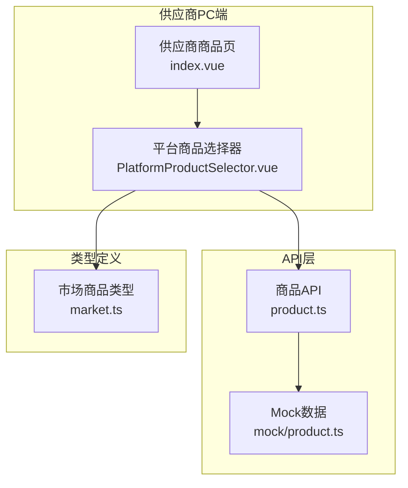
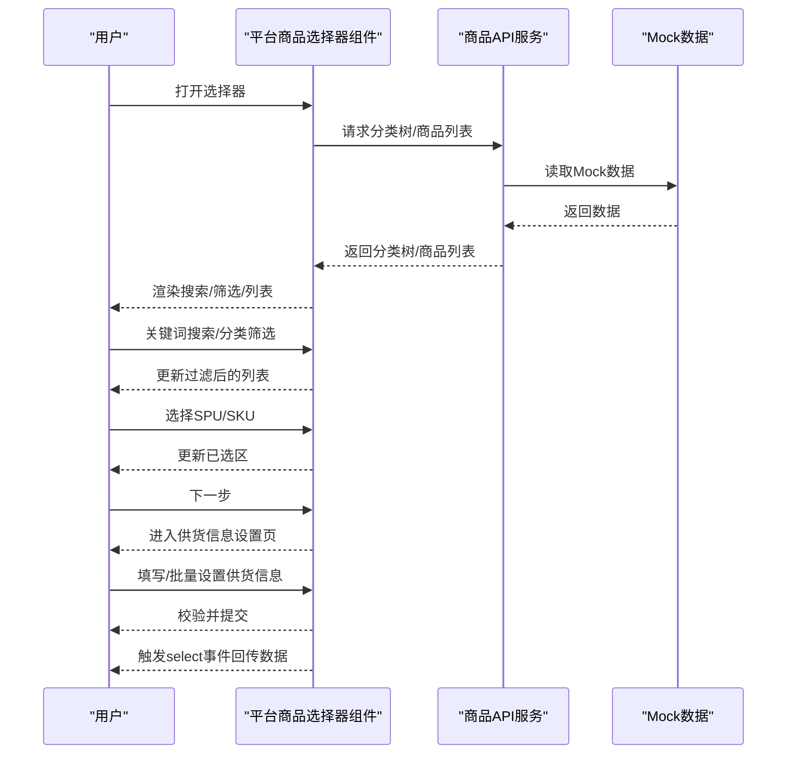
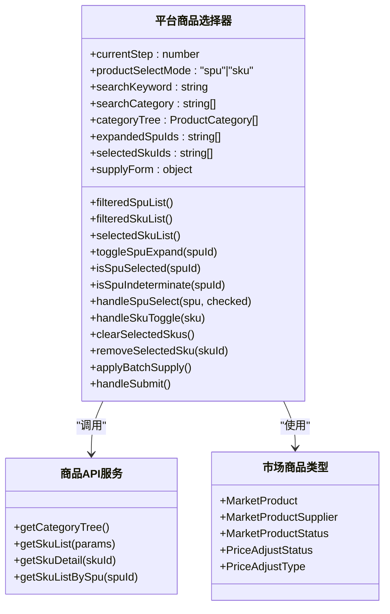
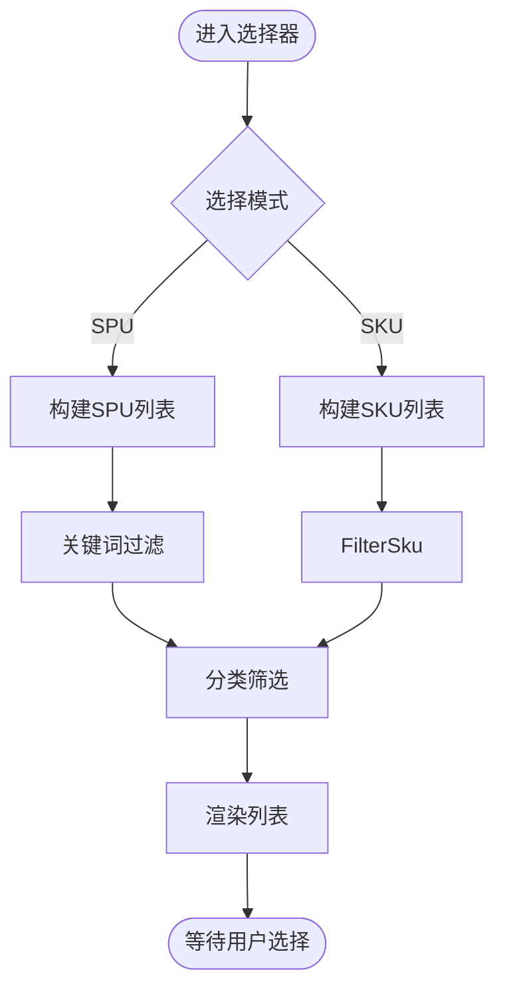
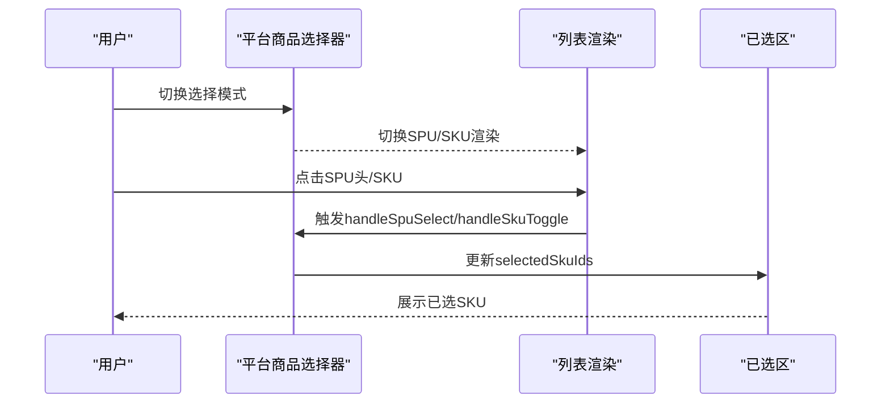
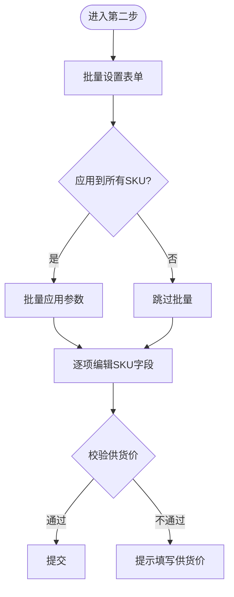
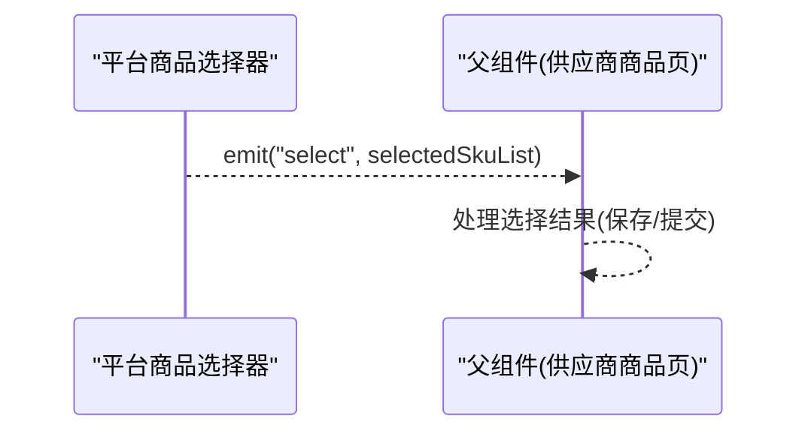
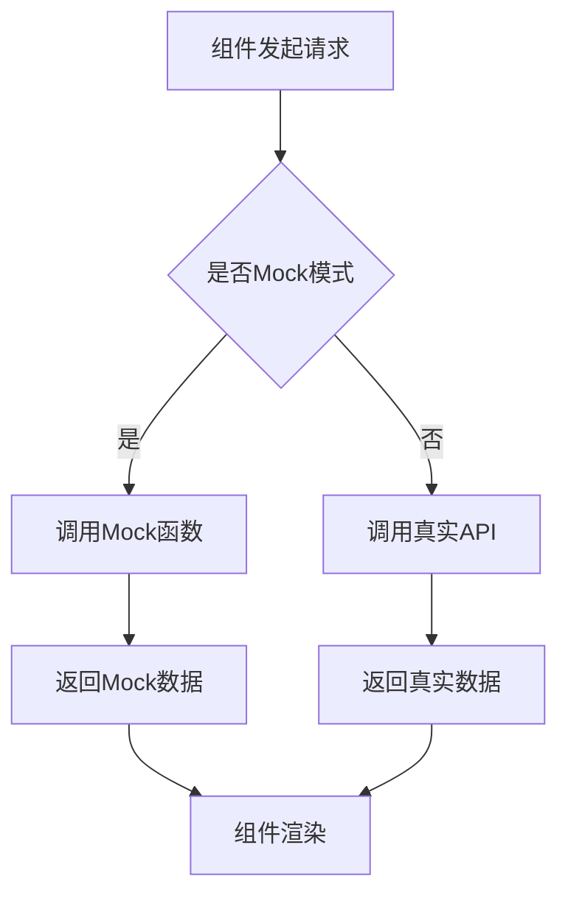
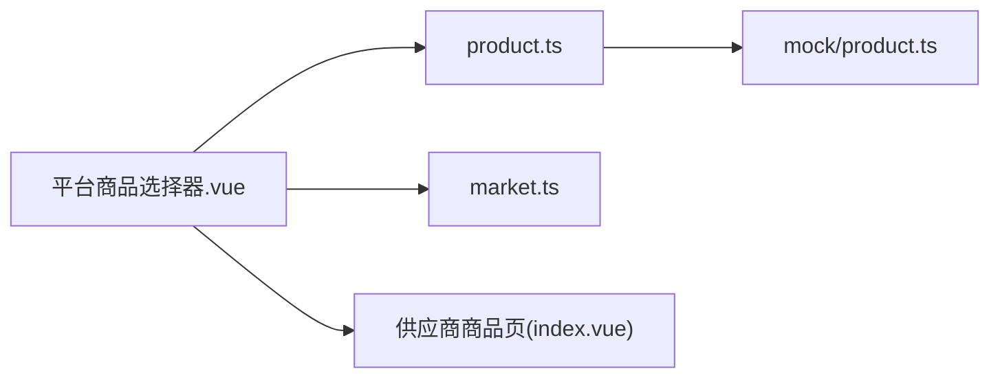

# 平台商品选择器

<cite>
**本文档引用的文件**
- [PlatformProductSelector.vue](file://apps/pc/src/views/supplier/product/components/PlatformProductSelector.vue)
- [product.ts](file://packages/api/src/product.ts)
- [product.ts](file://packages/api/src/mock/product.ts)
- [market.ts](file://packages/types/src/market.ts)
- [index.vue](file://apps/pc/src/views/supplier/product/index.vue)
</cite>

## 目录
1. [简介](#简介)
2. [项目结构](#项目结构)
3. [核心组件](#核心组件)
4. [架构总览](#架构总览)
5. [详细组件分析](#详细组件分析)
6. [依赖关系分析](#依赖关系分析)
7. [性能考虑](#性能考虑)
8. [故障排查指南](#故障排查指南)
9. [结论](#结论)

## 简介
本文件面向“平台商品选择器”功能，提供从设计到实现的完整技术文档。该功能支持在平台商品库中进行商品搜索（关键词、分类）、商品列表展示（SPU/SKU双模式）、选择机制（单选/多选/批量）、供货信息设置以及最终结果回传。文档将结合组件源码与API/类型定义，解释交互逻辑、数据流与状态同步机制。

## 项目结构
平台商品选择器位于PC端供应商模块中，采用Vue 3 Composition API与Arco Design组件库实现。核心文件组织如下：
- 组件：apps/pc/src/views/supplier/product/components/PlatformProductSelector.vue
- 调用入口：apps/pc/src/views/supplier/product/index.vue
- 商品服务：packages/api/src/product.ts（封装API调用）
- Mock数据：packages/api/src/mock/product.ts（模拟分类树、SPU/SKU等）
- 类型定义：packages/types/src/market.ts（市场商品相关类型）

**图表来源**
- [index.vue:272-418](file://apps/pc/src/views/supplier/product/index.vue#L272-L418)
- [PlatformProductSelector.vue:1-717](file://apps/pc/src/views/supplier/product/components/PlatformProductSelector.vue#L1-L717)
- [product.ts:1-258](file://packages/api/src/product.ts#L1-L258)
- [product.ts:1-800](file://packages/api/src/mock/product.ts#L1-L800)
- [market.ts:1-67](file://packages/types/src/market.ts#L1-L67)

**章节来源**
- [index.vue:272-418](file://apps/pc/src/views/supplier/product/index.vue#L272-L418)

## 核心组件
平台商品选择器由以下关键部分组成：
- 步骤导航：两步流程（选择商品、设置供货信息）
- 选择模式：SPU聚合模式与SKU直选模式
- 搜索与筛选：关键词搜索、分类级联选择
- 列表展示：SPU展开显示SKU、或平铺SKU列表
- 已选区：右侧展示已选SKU并支持移除
- 批量设置：统一设置供货量、最小起订量、供货周期
- 表单校验：必填项校验与提交

**章节来源**
- [PlatformProductSelector.vue:1-717](file://apps/pc/src/views/supplier/product/components/PlatformProductSelector.vue#L1-L717)

## 架构总览
平台商品选择器采用“视图组件 + API服务 + Mock数据 + 类型约束”的分层架构。组件负责UI与交互，API服务封装请求与响应，Mock数据提供本地开发体验，类型定义确保数据结构一致性。

**图表来源**
- [PlatformProductSelector.vue:1-717](file://apps/pc/src/views/supplier/product/components/PlatformProductSelector.vue#L1-L717)
- [product.ts:1-258](file://packages/api/src/product.ts#L1-L258)
- [product.ts:1-800](file://packages/api/src/mock/product.ts#L1-L800)

## 详细组件分析

### 组件类图

**图表来源**
- [PlatformProductSelector.vue:221-512](file://apps/pc/src/views/supplier/product/components/PlatformProductSelector.vue#L221-L512)
- [product.ts:52-257](file://packages/api/src/product.ts#L52-L257)
- [market.ts:1-67](file://packages/types/src/market.ts#L1-L67)

**章节来源**
- [PlatformProductSelector.vue:221-512](file://apps/pc/src/views/supplier/product/components/PlatformProductSelector.vue#L221-L512)
- [product.ts:52-257](file://packages/api/src/product.ts#L52-L257)
- [market.ts:1-67](file://packages/types/src/market.ts#L1-L67)

### 交互流程与数据流

#### 1) 平台商品搜索与筛选
- 支持关键词搜索（SPU名称/编码、SKU名称/编码）
- 支持分类级联筛选（基于categoryTree）
- 过滤逻辑通过计算属性实现，实时响应输入变化

**图表来源**
- [PlatformProductSelector.vue:336-383](file://apps/pc/src/views/supplier/product/components/PlatformProductSelector.vue#L336-L383)

**章节来源**
- [PlatformProductSelector.vue:17-32](file://apps/pc/src/views/supplier/product/components/PlatformProductSelector.vue#L17-L32)
- [PlatformProductSelector.vue:336-383](file://apps/pc/src/views/supplier/product/components/PlatformProductSelector.vue#L336-L383)

#### 2) 商品列表展示与选择机制
- SPU模式：点击展开查看SKU，支持全选/半选状态；点击SKU可切换选择
- SKU模式：平铺展示，直接勾选
- 已选区：右侧展示已选SKU，支持移除与清空

**图表来源**
- [PlatformProductSelector.vue:35-118](file://apps/pc/src/views/supplier/product/components/PlatformProductSelector.vue#L35-L118)
- [PlatformProductSelector.vue:421-442](file://apps/pc/src/views/supplier/product/components/PlatformProductSelector.vue#L421-L442)

**章节来源**
- [PlatformProductSelector.vue:35-118](file://apps/pc/src/views/supplier/product/components/PlatformProductSelector.vue#L35-L118)
- [PlatformProductSelector.vue:421-442](file://apps/pc/src/views/supplier/product/components/PlatformProductSelector.vue#L421-L442)

#### 3) 供货信息设置与批量应用
- 提供批量设置：预计供货量、最小起订量、供货周期
- 单SKU级联设置：表格内逐项编辑
- 提交前校验：必须为每个SKU填写有效供货价

**图表来源**
- [PlatformProductSelector.vue:130-217](file://apps/pc/src/views/supplier/product/components/PlatformProductSelector.vue#L130-L217)
- [PlatformProductSelector.vue:459-489](file://apps/pc/src/views/supplier/product/components/PlatformProductSelector.vue#L459-L489)

**章节来源**
- [PlatformProductSelector.vue:130-217](file://apps/pc/src/views/supplier/product/components/PlatformProductSelector.vue#L130-L217)
- [PlatformProductSelector.vue:459-489](file://apps/pc/src/views/supplier/product/components/PlatformProductSelector.vue#L459-L489)

#### 4) 数据回传与状态更新
- 事件触发：组件通过select事件回传已选SKU列表
- 数据结构：包含SKU基础信息、规格、平台参考价、以及供货信息字段
- 冲突处理：当前实现未见显式冲突检测逻辑，建议在业务侧补充唯一性/重复性校验

**图表来源**
- [PlatformProductSelector.vue:226-229](file://apps/pc/src/views/supplier/product/components/PlatformProductSelector.vue#L226-L229)
- [PlatformProductSelector.vue:488-489](file://apps/pc/src/views/supplier/product/components/PlatformProductSelector.vue#L488-L489)
- [index.vue:272-418](file://apps/pc/src/views/supplier/product/index.vue#L272-L418)

**章节来源**
- [PlatformProductSelector.vue:226-229](file://apps/pc/src/views/supplier/product/components/PlatformProductSelector.vue#L226-L229)
- [PlatformProductSelector.vue:488-489](file://apps/pc/src/views/supplier/product/components/PlatformProductSelector.vue#L488-L489)
- [index.vue:272-418](file://apps/pc/src/views/supplier/product/index.vue#L272-L418)

### API与类型集成

#### API调用要点
- 分类树：getCategoryTree用于级联选择器选项
- 商品查询：getSkuList支持keyword/spuId/categoryId/status过滤
- 详情查询：getSkuDetail/getSkuListBySpu用于扩展展示
- Mock开关：isMock控制走Mock数据路径

**图表来源**
- [product.ts:52-257](file://packages/api/src/product.ts#L52-L257)
- [product.ts:1-800](file://packages/api/src/mock/product.ts#L1-L800)

**章节来源**
- [product.ts:52-257](file://packages/api/src/product.ts#L52-L257)
- [product.ts:1-800](file://packages/api/src/mock/product.ts#L1-L800)

#### 类型定义要点
- 市场商品类型：MarketProduct、MarketProductSupplier、状态枚举等
- 与选择器的数据映射：平台参考价、供货价、最小起订量、供货周期等字段

**章节来源**
- [market.ts:1-67](file://packages/types/src/market.ts#L1-L67)

## 依赖关系分析
- 组件对API层的依赖：通过product.ts封装的函数进行数据获取
- 组件对类型定义的依赖：使用MarketProduct等类型保证数据结构一致
- 组件对Mock数据的依赖：在开发阶段提供稳定的数据源
- 组件对父组件的依赖：通过事件回传选择结果

**图表来源**
- [PlatformProductSelector.vue:1-717](file://apps/pc/src/views/supplier/product/components/PlatformProductSelector.vue#L1-L717)
- [product.ts:1-258](file://packages/api/src/product.ts#L1-L258)
- [product.ts:1-800](file://packages/api/src/mock/product.ts#L1-L800)
- [market.ts:1-67](file://packages/types/src/market.ts#L1-L67)
- [index.vue:272-418](file://apps/pc/src/views/supplier/product/index.vue#L272-L418)

**章节来源**
- [PlatformProductSelector.vue:1-717](file://apps/pc/src/views/supplier/product/components/PlatformProductSelector.vue#L1-L717)
- [product.ts:1-258](file://packages/api/src/product.ts#L1-L258)
- [market.ts:1-67](file://packages/types/src/market.ts#L1-L67)
- [index.vue:272-418](file://apps/pc/src/views/supplier/product/index.vue#L272-L418)

## 性能考虑
- 计算属性过滤：关键词与分类筛选通过computed实现，避免重复计算
- 列表渲染优化：SPU模式下仅展开可见SPU，减少DOM节点数量
- 批量设置：一次性更新selectedSkuList中的字段，降低多次重渲染
- Mock数据：本地开发时减少网络请求开销

[本节为通用性能建议，无需特定文件引用]

## 故障排查指南
- 无法加载分类树：检查getCategoryTree是否正确返回数据
- 搜索无结果：确认关键词大小写与编码匹配逻辑
- 选择异常：检查selectedSkuIds与isSpuSelected/isSpuIndeterminate逻辑
- 提交失败：确认handleSubmit前已填写有效供货价
- 事件未回传：确认父组件已监听select事件并正确处理

**章节来源**
- [PlatformProductSelector.vue:459-489](file://apps/pc/src/views/supplier/product/components/PlatformProductSelector.vue#L459-L489)

## 结论
平台商品选择器以清晰的两步流程、灵活的SPU/SKU选择模式与完善的批量设置能力，满足供应商在平台商品库中高效挑选与报价的需求。通过API层与Mock数据的解耦设计，组件具备良好的可维护性与可测试性。建议后续在业务侧补充冲突检测与去重逻辑，进一步提升用户体验与数据一致性。