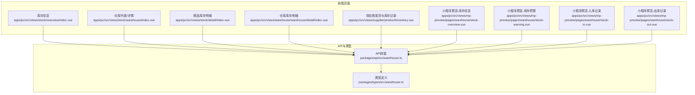
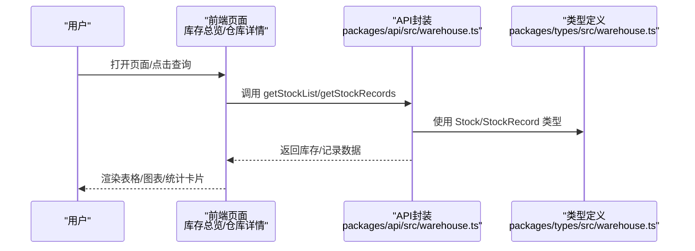
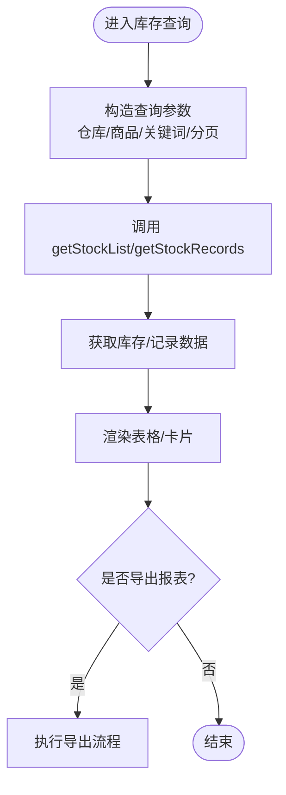
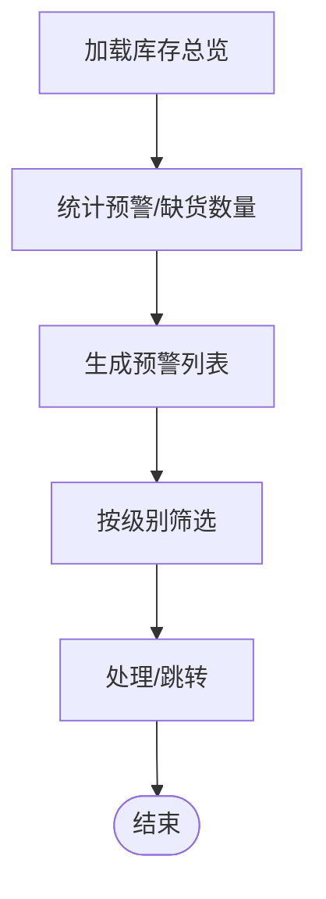
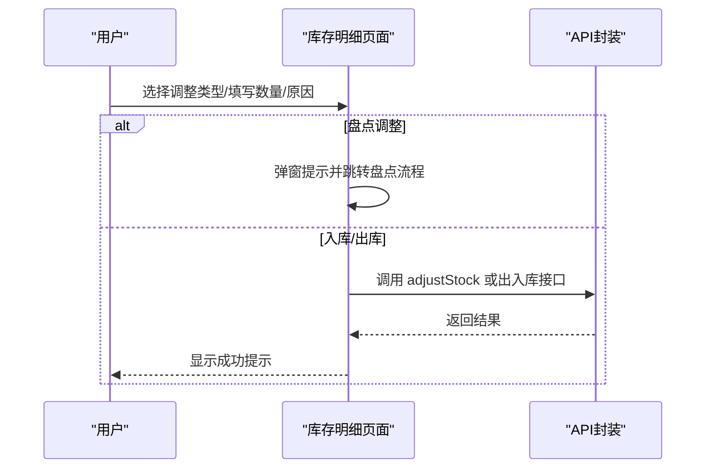
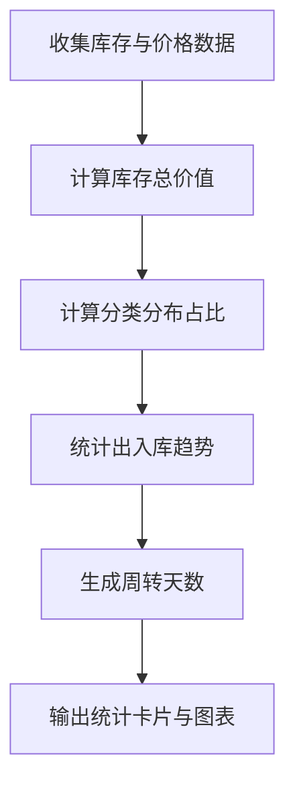
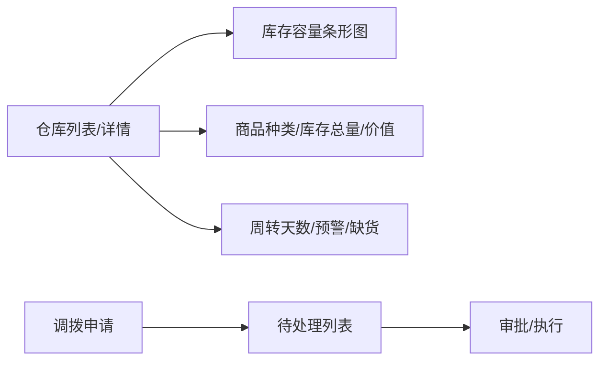
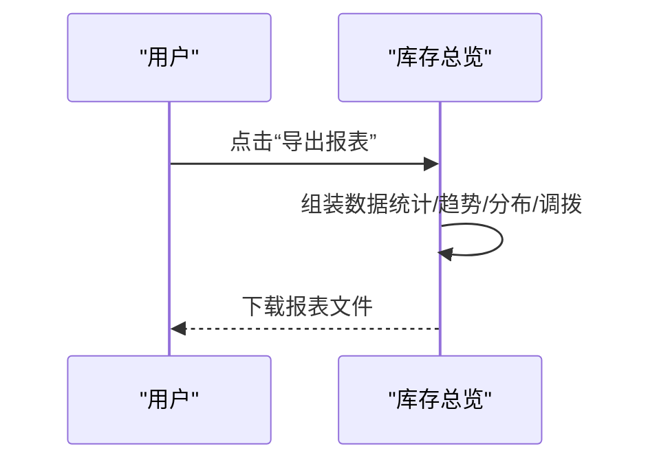
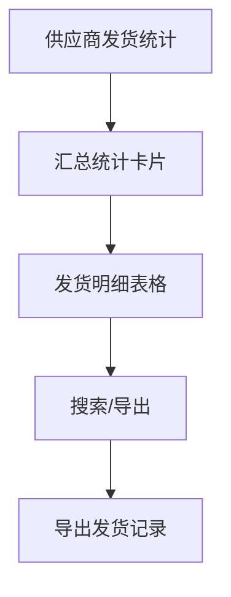
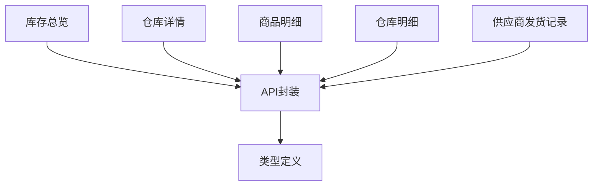

# 库存管理

<cite>
**本文引用的文件**
- [apps/pc/src/views/stock/overview/index.vue](file://apps/pc/src/views/stock/overview/index.vue)
- [apps/pc/src/views/stock/warehouse/index.vue](file://apps/pc/src/views/stock/warehouse/index.vue)
- [apps/pc/src/views/stock/detail/index.vue](file://apps/pc/src/views/stock/detail/index.vue)
- [apps/pc/src/views/warehouse/warehouse/detail/index.vue](file://apps/pc/src/views/warehouse/warehouse/detail/index.vue)
- [apps/pc/src/views/supplier/product/inventory.vue](file://apps/pc/src/views/supplier/product/inventory.vue)
- [apps/pc/src/views/mp-preview/pages/warehouse/stock-overview.vue](file://apps/pc/src/views/mp-preview/pages/warehouse/stock-overview.vue)
- [apps/pc/src/views/mp-preview/pages/warehouse/stock-warning.vue](file://apps/pc/src/views/mp-preview/pages/warehouse/stock-warning.vue)
- [apps/pc/src/views/mp-preview/pages/warehouse/stock-in.vue](file://apps/pc/src/views/mp-preview/pages/warehouse/stock-in.vue)
- [apps/pc/src/views/mp-preview/pages/warehouse/stock-out.vue](file://apps/pc/src/views/mp-preview/pages/warehouse/stock-out.vue)
- [packages/api/src/warehouse.ts](file://packages/api/src/warehouse.ts)
- [packages/types/src/warehouse.ts](file://packages/types/src/warehouse.ts)
- [项目功能排期_按代码实际页面_完整版.csv](file://项目功能排期_按代码实际页面_完整版.csv)
</cite>

## 目录
1. [简介](#简介)
2. [项目结构](#项目结构)
3. [核心组件](#核心组件)
4. [架构总览](#架构总览)
5. [详细组件分析](#详细组件分析)
6. [依赖关系分析](#依赖关系分析)
7. [性能考量](#性能考量)
8. [故障排查指南](#故障排查指南)
9. [结论](#结论)
10. [附录](#附录)

## 简介
本文件面向供应商与工程仓侧的“库存管理”能力，系统化梳理实时库存查询、库存预警、库存调整、库存统计、库存分布与报表等核心功能。文档基于现有前端页面与API定义，说明数据来源、计算逻辑与报表生成机制，并提供可视化图示帮助理解。

## 项目结构
围绕库存管理的关键页面与API如下：
- 前端页面（PC端与小程序预览页）
  - 各仓库库存总览与预警：apps/pc/src/views/stock/overview/index.vue
  - 仓库详情与库存分布：apps/pc/src/views/stock/warehouse/index.vue
  - 商品库存明细与调整：apps/pc/src/views/stock/detail/index.vue
  - 仓库维度库存明细与调整：apps/pc/src/views/warehouse/warehouse/detail/index.vue
  - 供应商视角发货与库存记录：apps/pc/src/views/supplier/product/inventory.vue
  - 小程序预览页：库存总览、预警、入库、出库
- 数据模型与API
  - 类型定义：packages/types/src/warehouse.ts
  - 接口封装：packages/api/src/warehouse.ts
- 功能排期参考
  - 项目功能排期_按代码实际页面_完整版.csv

图表来源
- [apps/pc/src/views/stock/overview/index.vue:1-100](file://apps/pc/src/views/stock/overview/index.vue#L1-L100)
- [apps/pc/src/views/stock/warehouse/index.vue:331-464](file://apps/pc/src/views/stock/warehouse/index.vue#L331-L464)
- [apps/pc/src/views/stock/detail/index.vue:221-251](file://apps/pc/src/views/stock/detail/index.vue#L221-L251)
- [apps/pc/src/views/warehouse/warehouse/detail/index.vue:157-187](file://apps/pc/src/views/warehouse/warehouse/detail/index.vue#L157-L187)
- [apps/pc/src/views/supplier/product/inventory.vue:1-401](file://apps/pc/src/views/supplier/product/inventory.vue#L1-L401)
- [apps/pc/src/views/mp-preview/pages/warehouse/stock-overview.vue:1-217](file://apps/pc/src/views/mp-preview/pages/warehouse/stock-overview.vue#L1-L217)
- [apps/pc/src/views/mp-preview/pages/warehouse/stock-warning.vue:1-175](file://apps/pc/src/views/mp-preview/pages/warehouse/stock-warning.vue#L1-L175)
- [apps/pc/src/views/mp-preview/pages/warehouse/stock-in.vue:1-181](file://apps/pc/src/views/mp-preview/pages/warehouse/stock-in.vue#L1-L181)
- [apps/pc/src/views/mp-preview/pages/warehouse/stock-out.vue:1-181](file://apps/pc/src/views/mp-preview/pages/warehouse/stock-out.vue#L1-L181)
- [packages/api/src/warehouse.ts:1-114](file://packages/api/src/warehouse.ts#L1-L114)
- [packages/types/src/warehouse.ts:72-112](file://packages/types/src/warehouse.ts#L72-L112)

章节来源
- [apps/pc/src/views/stock/overview/index.vue:1-264](file://apps/pc/src/views/stock/overview/index.vue#L1-L264)
- [packages/api/src/warehouse.ts:1-114](file://packages/api/src/warehouse.ts#L1-L114)
- [packages/types/src/warehouse.ts:72-112](file://packages/types/src/warehouse.ts#L72-L112)

## 核心组件
- 实时库存查询
  - 通过API获取库存列表与详情，支持按仓库、商品、关键词筛选；并提供库存记录分页查询。
  - 关键接口：getStockList、getStockDetail、getStockRecords。
- 库存预警设置与提醒
  - 页面展示预警/缺货商品数量，支持按预警级别筛选与快速处理入口。
  - 关键页面：库存总览、小程序预览-库存预警。
- 库存调整
  - 支持入库、出库、盘点调整（触发盘点流程）等类型；提供调整原因校验与确认流程。
  - 关键页面：商品库存明细、仓库库存明细。
- 库存统计
  - 统计维度：仓库总数、商品种类、总库存量、库存总价值、日均周转、预警/缺货数量等。
  - 关键页面：库存总览。
- 库存分布
  - 展示各仓库库存容量、商品种类、库存总量、库存价值、周转天数、预警/缺货数量。
  - 关键页面：库存总览、仓库列表/详情。
- 报表生成
  - 提供导出报表按钮，结合库存趋势、分类分布、调拨申请等数据形成报表。
  - 关键页面：库存总览。

章节来源
- [packages/api/src/warehouse.ts:36-96](file://packages/api/src/warehouse.ts#L36-L96)
- [apps/pc/src/views/stock/overview/index.vue:1-264](file://apps/pc/src/views/stock/overview/index.vue#L1-L264)
- [apps/pc/src/views/stock/detail/index.vue:221-251](file://apps/pc/src/views/stock/detail/index.vue#L221-L251)
- [apps/pc/src/views/warehouse/warehouse/detail/index.vue:157-187](file://apps/pc/src/views/warehouse/warehouse/detail/index.vue#L157-L187)
- [apps/pc/src/views/mp-preview/pages/warehouse/stock-warning.vue:1-175](file://apps/pc/src/views/mp-preview/pages/warehouse/stock-warning.vue#L1-L175)

## 架构总览
库存管理从前端页面出发，通过API封装访问后端服务，返回库存、记录与统计等数据；类型定义确保前后端字段一致性。

图表来源
- [packages/api/src/warehouse.ts:36-96](file://packages/api/src/warehouse.ts#L36-L96)
- [packages/types/src/warehouse.ts:72-112](file://packages/types/src/warehouse.ts#L72-L112)
- [apps/pc/src/views/stock/overview/index.vue:1-264](file://apps/pc/src/views/stock/overview/index.vue#L1-L264)

## 详细组件分析

### 实时库存查询与库存记录
- 数据来源
  - getStockList：分页获取库存列表，支持仓库/商品/关键词过滤。
  - getStockRecords：分页获取库存流水，支持仓库/商品/类型过滤。
- 计算逻辑
  - 可用库存 = 总库存 - 冻结库存。
  - 库存记录类型包含入库、出库、调拨入、调拨出、调整、冻结、解冻等。
- 页面行为
  - 支持搜索、筛选、分页与导出。

图表来源
- [packages/api/src/warehouse.ts:36-96](file://packages/api/src/warehouse.ts#L36-L96)
- [apps/pc/src/views/stock/overview/index.vue:1-264](file://apps/pc/src/views/stock/overview/index.vue#L1-L264)

章节来源
- [packages/api/src/warehouse.ts:36-96](file://packages/api/src/warehouse.ts#L36-L96)
- [packages/types/src/warehouse.ts:72-112](file://packages/types/src/warehouse.ts#L72-L112)
- [apps/pc/src/views/stock/overview/index.vue:1-264](file://apps/pc/src/views/stock/overview/index.vue#L1-L264)

### 库存预警设置与提醒
- 数据来源
  - 库存总览统计预警/缺货数量；小程序预览页展示预警商品列表与等级。
- 计算逻辑
  - 预警/缺货数量来源于各仓库与商品的库存状态统计。
- 页面行为
  - 支持按预警级别筛选、快速处理入口跳转。

图表来源
- [apps/pc/src/views/stock/overview/index.vue:505-538](file://apps/pc/src/views/stock/overview/index.vue#L505-L538)
- [apps/pc/src/views/mp-preview/pages/warehouse/stock-warning.vue:97-157](file://apps/pc/src/views/mp-preview/pages/warehouse/stock-warning.vue#L97-L157)

章节来源
- [apps/pc/src/views/stock/overview/index.vue:505-538](file://apps/pc/src/views/stock/overview/index.vue#L505-L538)
- [apps/pc/src/views/mp-preview/pages/warehouse/stock-warning.vue:97-157](file://apps/pc/src/views/mp-preview/pages/warehouse/stock-warning.vue#L97-L157)

### 库存调整（手动/批量/记录）
- 调整类型
  - 入库、出库、盘点调整（需创建盘点单审核）。
- 表单校验
  - 调整数量≥1，调整原因必填；盘点调整弹窗引导至盘点流程。
- 页面行为
  - 成功后更新本地库存与可用库存，提示成功。

图表来源
- [apps/pc/src/views/stock/detail/index.vue:221-251](file://apps/pc/src/views/stock/detail/index.vue#L221-L251)
- [apps/pc/src/views/stock/detail/index.vue:830-861](file://apps/pc/src/views/stock/detail/index.vue#L830-L861)
- [apps/pc/src/views/warehouse/warehouse/detail/index.vue:157-187](file://apps/pc/src/views/warehouse/warehouse/detail/index.vue#L157-L187)
- [packages/api/src/warehouse.ts:65-67](file://packages/api/src/warehouse.ts#L65-L67)

章节来源
- [apps/pc/src/views/stock/detail/index.vue:221-251](file://apps/pc/src/views/stock/detail/index.vue#L221-L251)
- [apps/pc/src/views/stock/detail/index.vue:830-861](file://apps/pc/src/views/stock/detail/index.vue#L830-L861)
- [apps/pc/src/views/warehouse/warehouse/detail/index.vue:157-187](file://apps/pc/src/views/warehouse/warehouse/detail/index.vue#L157-L187)
- [packages/api/src/warehouse.ts:65-67](file://packages/api/src/warehouse.ts#L65-L67)

### 库存统计（价值、周转率、滞销分析）
- 统计指标
  - 仓库总数、商品种类、总库存量、可用/锁定库存、库存总价值、日均周转、预警/缺货数量。
  - 分类库存分布：按品类统计商品种类、库存总量、库存价值及占比。
  - 出入库趋势：近7天入库/出库量与净变化。
- 计算逻辑
  - 库存价值：库存数量 × 单价（页面以固定数值演示）。
  - 周转天数：示例页面展示各仓库周转天数，用于评估效率。
  - 滞销分析：可结合出入库趋势与分类分布识别低动销商品。

图表来源
- [apps/pc/src/views/stock/overview/index.vue:391-404](file://apps/pc/src/views/stock/overview/index.vue#L391-L404)
- [apps/pc/src/views/stock/overview/index.vue:560-566](file://apps/pc/src/views/stock/overview/index.vue#L560-L566)
- [apps/pc/src/views/stock/overview/index.vue:540-548](file://apps/pc/src/views/stock/overview/index.vue#L540-L548)

章节来源
- [apps/pc/src/views/stock/overview/index.vue:391-404](file://apps/pc/src/views/stock/overview/index.vue#L391-L404)
- [apps/pc/src/views/stock/overview/index.vue:540-566](file://apps/pc/src/views/stock/overview/index.vue#L540-L566)

### 库存分布（仓库/在途）
- 仓库分布
  - 各仓库库存容量条形图、商品种类、库存总量、库存价值、周转天数、预警/缺货数量。
- 在途跟踪
  - 待处理调拨申请列表，支持审批与发起调拨。

图表来源
- [apps/pc/src/views/stock/overview/index.vue:408-494](file://apps/pc/src/views/stock/overview/index.vue#L408-L494)
- [apps/pc/src/views/stock/overview/index.vue:568-571](file://apps/pc/src/views/stock/overview/index.vue#L568-L571)
- [apps/pc/src/views/stock/overview/index.vue:348-380](file://apps/pc/src/views/stock/overview/index.vue#L348-L380)

章节来源
- [apps/pc/src/views/stock/overview/index.vue:408-494](file://apps/pc/src/views/stock/overview/index.vue#L408-L494)
- [apps/pc/src/views/stock/overview/index.vue:568-571](file://apps/pc/src/views/stock/overview/index.vue#L568-L571)

### 报表生成机制
- 导出入口
  - 库存总览提供“导出报表”按钮，触发导出流程。
- 报表内容
  - 结合库存总览、出入库趋势、分类分布、调拨申请等数据形成报表。

图表来源
- [apps/pc/src/views/stock/overview/index.vue:96-99](file://apps/pc/src/views/stock/overview/index.vue#L96-L99)
- [apps/pc/src/views/stock/overview/index.vue:592-594](file://apps/pc/src/views/stock/overview/index.vue#L592-L594)

章节来源
- [apps/pc/src/views/stock/overview/index.vue:96-99](file://apps/pc/src/views/stock/overview/index.vue#L96-L99)
- [apps/pc/src/views/stock/overview/index.vue:592-594](file://apps/pc/src/views/stock/overview/index.vue#L592-L594)

### 供应商视角发货与库存记录
- 统计维度
  - 本月正常发货、补发、累计发货、关联订单数。
- 数据来源
  - 发货汇总与明细记录，支持按类型、时间范围、关键字搜索与导出。

图表来源
- [apps/pc/src/views/supplier/product/inventory.vue:1-163](file://apps/pc/src/views/supplier/product/inventory.vue#L1-L163)
- [apps/pc/src/views/supplier/product/inventory.vue:244-320](file://apps/pc/src/views/supplier/product/inventory.vue#L244-L320)
- [apps/pc/src/views/supplier/product/inventory.vue:345-347](file://apps/pc/src/views/supplier/product/inventory.vue#L345-L347)

章节来源
- [apps/pc/src/views/supplier/product/inventory.vue:1-163](file://apps/pc/src/views/supplier/product/inventory.vue#L1-L163)
- [apps/pc/src/views/supplier/product/inventory.vue:244-320](file://apps/pc/src/views/supplier/product/inventory.vue#L244-L320)

## 依赖关系分析
- 前端页面依赖API封装与类型定义，保证字段一致与类型安全。
- 库存统计与报表依赖页面内静态数据与计算逻辑（如库存价值、周转天数）。
- 调拨流程依赖页面交互与路由跳转。

图表来源
- [packages/api/src/warehouse.ts:1-114](file://packages/api/src/warehouse.ts#L1-L114)
- [packages/types/src/warehouse.ts:72-112](file://packages/types/src/warehouse.ts#L72-L112)
- [apps/pc/src/views/stock/overview/index.vue:1-264](file://apps/pc/src/views/stock/overview/index.vue#L1-L264)

章节来源
- [packages/api/src/warehouse.ts:1-114](file://packages/api/src/warehouse.ts#L1-L114)
- [packages/types/src/warehouse.ts:72-112](file://packages/types/src/warehouse.ts#L72-L112)

## 性能考量
- 列表分页与搜索
  - 使用分页接口减少一次性传输数据量，提升首屏渲染速度。
- 图表渲染
  - 出入库趋势采用相对高度映射，避免大数据量时DOM压力过大。
- 本地模拟数据
  - 在开发阶段使用模拟数据可降低对后端的压力，但上线前需替换为真实接口。

## 故障排查指南
- 库存显示异常
  - 检查 getStockList/getStockRecords 参数是否正确传入仓库/商品/类型。
  - 确认类型定义中的字段与后端返回一致。
- 调整失败
  - 核对调整类型、数量与原因是否满足校验；盘点调整需走审核流程。
- 报表导出
  - 点击导出按钮后确认浏览器下载是否被拦截，检查导出数据组装逻辑。

章节来源
- [packages/api/src/warehouse.ts:36-96](file://packages/api/src/warehouse.ts#L36-L96)
- [apps/pc/src/views/stock/detail/index.vue:830-861](file://apps/pc/src/views/stock/detail/index.vue#L830-L861)
- [apps/pc/src/views/stock/overview/index.vue:592-594](file://apps/pc/src/views/stock/overview/index.vue#L592-L594)

## 结论
本库存管理方案以页面为中心，结合API封装与类型定义，实现了从实时查询、预警提醒、库存调整到统计报表的闭环。通过仓库分布与调拨流程，进一步完善了库存调度与可视化的落地能力。后续可在真实接口对接、数据一致性与报表自动化方面持续优化。

## 附录
- 功能排期参考（部分）
  - 小程序端-工程仓小程序-库存管理：库存预警、扫码入库、扫码出库、库存盘点等页面路径与状态。

章节来源
- [项目功能排期_按代码实际页面_完整版.csv:137-147](file://项目功能排期_按代码实际页面_完整版.csv#L137-L147)