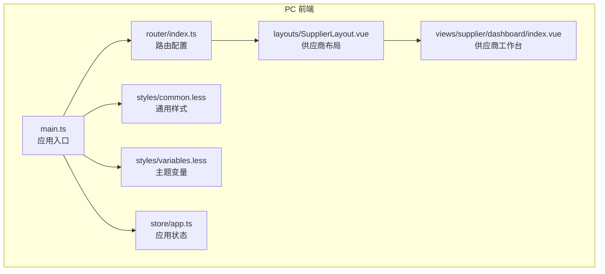
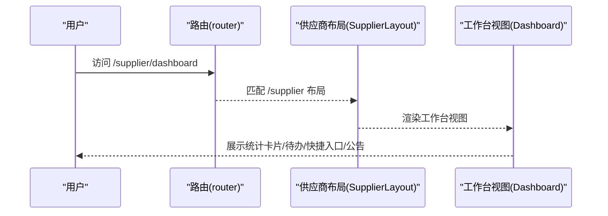
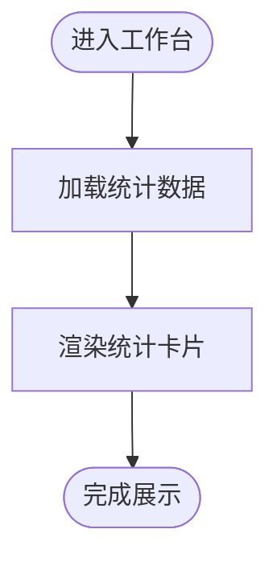
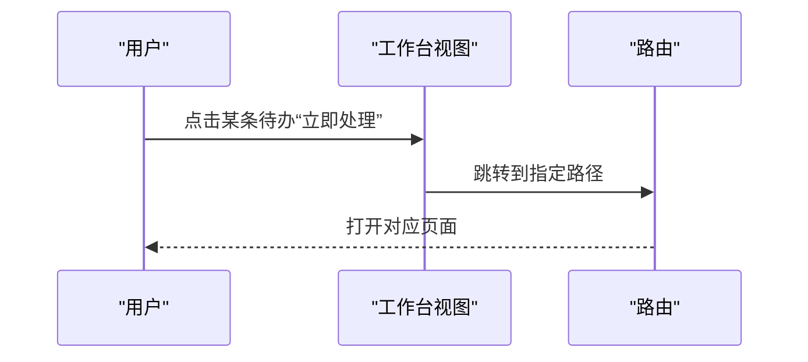
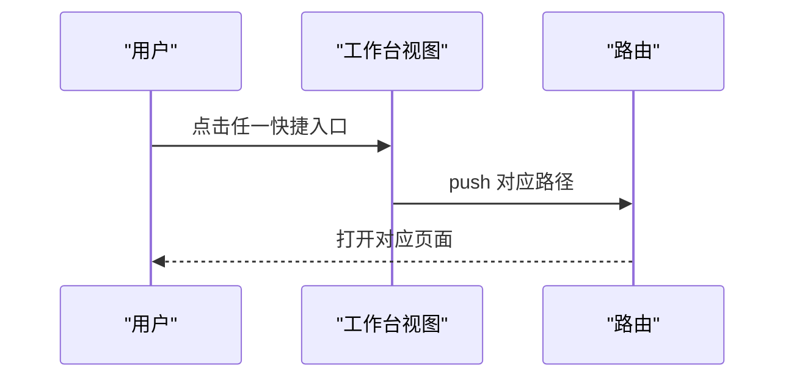
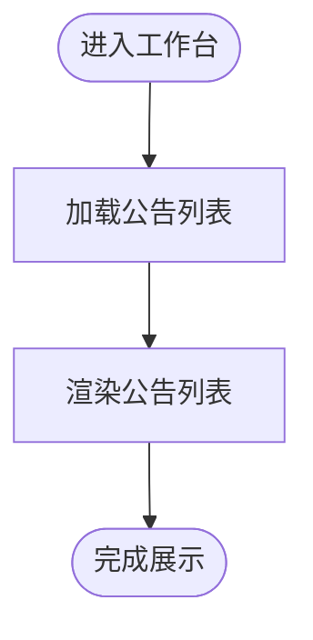
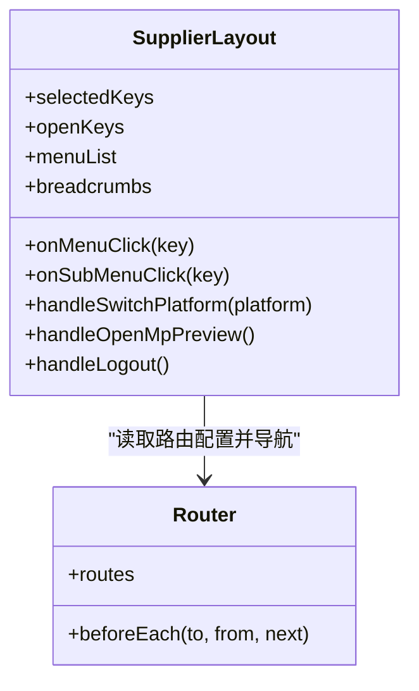
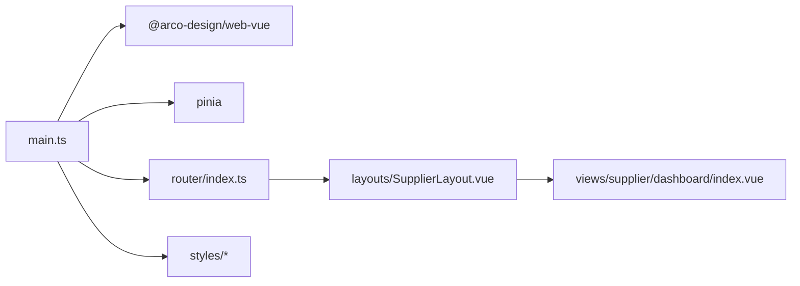

# 供应商工作台

<cite>
**本文引用的文件**
- [apps/pc/src/views/supplier/dashboard/index.vue](file://apps/pc/src/views/supplier/dashboard/index.vue)
- [apps/pc/src/router/index.ts](file://apps/pc/src/router/index.ts)
- [apps/pc/src/layouts/SupplierLayout.vue](file://apps/pc/src/layouts/SupplierLayout.vue)
- [apps/pc/src/store/app.ts](file://apps/pc/src/store/app.ts)
- [apps/pc/src/main.ts](file://apps/pc/src/main.ts)
- [apps/pc/src/styles/common.less](file://apps/pc/src/styles/common.less)
- [apps/pc/src/styles/variables.less](file://apps/pc/src/styles/variables.less)
- [apps/pc/src/views/dashboard/index.vue](file://apps/pc/src/views/dashboard/index.vue)
</cite>

## 目录
1. [简介](#简介)
2. [项目结构](#项目结构)
3. [核心组件](#核心组件)
4. [架构总览](#架构总览)
5. [详细组件分析](#详细组件分析)
6. [依赖关系分析](#依赖关系分析)
7. [性能考量](#性能考量)
8. [故障排查指南](#故障排查指南)
9. [结论](#结论)
10. [附录](#附录)

## 简介
本文件面向供应商工作台功能，系统性阐述其整体架构与核心能力，包括：
- 数据概览统计：供货中商品数量、待处理订单、本月供货额、累计结算金额
- 待处理事项提醒：新订单确认、库存预警、合同到期提醒
- 快捷入口：商品管理、主体信息、合同列表、托管账户
- 平台公告展示
并结合现有实现，给出数据展示组件、统计图表占位、待办事项列表与快捷操作按钮的实现方式说明，以及供应商日常工作操作指南与效率提升建议。

## 项目结构
供应商工作台位于 PC 前端应用中，采用 Vue + Arco Design 的前端技术栈，通过路由分层组织不同角色的工作台与功能页面。供应商工作台由“布局 + 路由 + 视图”三部分协同构成：
- 布局层：供应商专用侧边栏布局，负责菜单渲染、面包屑、平台切换与用户操作
- 路由层：定义供应商域下的工作台与各功能子路由
- 视图层：工作台首页视图负责数据概览、待办提醒、快捷入口与公告展示

**图表来源**
- [apps/pc/src/main.ts:1-19](file://apps/pc/src/main.ts#L1-L19)
- [apps/pc/src/router/index.ts:380-523](file://apps/pc/src/router/index.ts#L380-L523)
- [apps/pc/src/layouts/SupplierLayout.vue:1-325](file://apps/pc/src/layouts/SupplierLayout.vue#L1-L325)
- [apps/pc/src/views/supplier/dashboard/index.vue:1-240](file://apps/pc/src/views/supplier/dashboard/index.vue#L1-L240)
- [apps/pc/src/styles/common.less:1-79](file://apps/pc/src/styles/common.less#L1-L79)
- [apps/pc/src/styles/variables.less:1-17](file://apps/pc/src/styles/variables.less#L1-L17)
- [apps/pc/src/store/app.ts:1-36](file://apps/pc/src/store/app.ts#L1-L36)

**章节来源**
- [apps/pc/src/router/index.ts:380-523](file://apps/pc/src/router/index.ts#L380-L523)
- [apps/pc/src/layouts/SupplierLayout.vue:1-325](file://apps/pc/src/layouts/SupplierLayout.vue#L1-L325)
- [apps/pc/src/views/supplier/dashboard/index.vue:1-240](file://apps/pc/src/views/supplier/dashboard/index.vue#L1-L240)

## 核心组件
- 供应商工作台视图：负责欢迎区、统计卡片、待办事项列表、快捷入口与公告展示
- 供应商布局：提供侧边菜单、面包屑、平台切换、用户下拉等交互
- 路由系统：将供应商域内的工作台与各功能页面串联起来
- 应用状态：控制侧边栏折叠、主题等全局状态
- 样式体系：统一的卡片、栅格、颜色语义与间距规范

上述组件在现有代码中以静态数据与基础交互为主，后续可扩展为从后端接口获取实时数据与动态跳转。

**章节来源**
- [apps/pc/src/views/supplier/dashboard/index.vue:107-163](file://apps/pc/src/views/supplier/dashboard/index.vue#L107-L163)
- [apps/pc/src/layouts/SupplierLayout.vue:158-221](file://apps/pc/src/layouts/SupplierLayout.vue#L158-L221)
- [apps/pc/src/router/index.ts:380-523](file://apps/pc/src/router/index.ts#L380-L523)
- [apps/pc/src/store/app.ts:1-36](file://apps/pc/src/store/app.ts#L1-L36)
- [apps/pc/src/styles/common.less:1-79](file://apps/pc/src/styles/common.less#L1-L79)
- [apps/pc/src/styles/variables.less:1-17](file://apps/pc/src/styles/variables.less#L1-L17)

## 架构总览
供应商工作台采用“布局 + 路由 + 视图”的分层架构：
- 入口应用初始化 Arco Design、Pinia、路由与全局样式
- 路由定义供应商域（/supplier），包含工作台与多级功能子路由
- 供应商布局渲染菜单树，支持子菜单展开/收起与面包屑联动
- 工作台视图使用 Arco 组件进行数据概览与交互

**图表来源**
- [apps/pc/src/router/index.ts:380-523](file://apps/pc/src/router/index.ts#L380-L523)
- [apps/pc/src/layouts/SupplierLayout.vue:158-221](file://apps/pc/src/layouts/SupplierLayout.vue#L158-L221)
- [apps/pc/src/views/supplier/dashboard/index.vue:1-240](file://apps/pc/src/views/supplier/dashboard/index.vue#L1-L240)

## 详细组件分析

### 1) 数据概览统计
- 功能目标：直观呈现“供货中商品数量、待处理订单、本月供货额、累计结算金额”
- 实现方式：使用 Arco 的统计卡片组件展示数值，配合前缀图标与分隔符增强可读性
- 数据来源：当前为本地响应式对象，后续应对接后端接口返回真实数据

**图表来源**
- [apps/pc/src/views/supplier/dashboard/index.vue:13-46](file://apps/pc/src/views/supplier/dashboard/index.vue#L13-L46)
- [apps/pc/src/views/supplier/dashboard/index.vue:113-118](file://apps/pc/src/views/supplier/dashboard/index.vue#L113-L118)

**章节来源**
- [apps/pc/src/views/supplier/dashboard/index.vue:13-46](file://apps/pc/src/views/supplier/dashboard/index.vue#L13-L46)
- [apps/pc/src/views/supplier/dashboard/index.vue:113-118](file://apps/pc/src/views/supplier/dashboard/index.vue#L113-L118)

### 2) 待处理事项提醒
- 功能目标：集中展示“新订单确认、库存预警、合同到期提醒”等待办任务
- 实现方式：使用列表组件逐条展示，每项含标题、描述、彩色头像图标与“立即处理”操作
- 导航行为：点击“立即处理”根据项内路径跳转对应页面

**图表来源**
- [apps/pc/src/views/supplier/dashboard/index.vue:50-68](file://apps/pc/src/views/supplier/dashboard/index.vue#L50-L68)
- [apps/pc/src/views/supplier/dashboard/index.vue:158-162](file://apps/pc/src/views/supplier/dashboard/index.vue#L158-L162)

**章节来源**
- [apps/pc/src/views/supplier/dashboard/index.vue:50-68](file://apps/pc/src/views/supplier/dashboard/index.vue#L50-L68)
- [apps/pc/src/views/supplier/dashboard/index.vue:120-145](file://apps/pc/src/views/supplier/dashboard/index.vue#L120-L145)
- [apps/pc/src/views/supplier/dashboard/index.vue:158-162](file://apps/pc/src/views/supplier/dashboard/index.vue#L158-L162)

### 3) 快捷入口功能
- 功能目标：提供高频操作入口，快速直达“商品管理、主体信息、合同列表、托管账户”
- 实现方式：使用网格布局展示四个入口，点击后通过路由跳转至对应页面
- 路由映射：已在路由配置中定义供应商域下的相关子路由

**图表来源**
- [apps/pc/src/views/supplier/dashboard/index.vue:70-90](file://apps/pc/src/views/supplier/dashboard/index.vue#L70-L90)
- [apps/pc/src/views/supplier/dashboard/index.vue:154-156](file://apps/pc/src/views/supplier/dashboard/index.vue#L154-L156)
- [apps/pc/src/router/index.ts:380-523](file://apps/pc/src/router/index.ts#L380-L523)

**章节来源**
- [apps/pc/src/views/supplier/dashboard/index.vue:70-90](file://apps/pc/src/views/supplier/dashboard/index.vue#L70-L90)
- [apps/pc/src/views/supplier/dashboard/index.vue:154-156](file://apps/pc/src/views/supplier/dashboard/index.vue#L154-L156)
- [apps/pc/src/router/index.ts:380-523](file://apps/pc/src/router/index.ts#L380-L523)

### 4) 平台公告展示
- 功能目标：展示平台近期公告，便于供应商及时关注政策与运营动态
- 实现方式：列表组件展示标题与时间，支持查看更多入口
- 数据来源：当前为本地数组，后续可接入公告接口

**图表来源**
- [apps/pc/src/views/supplier/dashboard/index.vue:92-102](file://apps/pc/src/views/supplier/dashboard/index.vue#L92-L102)
- [apps/pc/src/views/supplier/dashboard/index.vue:147-152](file://apps/pc/src/views/supplier/dashboard/index.vue#L147-L152)

**章节来源**
- [apps/pc/src/views/supplier/dashboard/index.vue:92-102](file://apps/pc/src/views/supplier/dashboard/index.vue#L92-L102)
- [apps/pc/src/views/supplier/dashboard/index.vue:147-152](file://apps/pc/src/views/supplier/dashboard/index.vue#L147-L152)

### 5) 供应商布局与导航
- 侧边菜单：基于路由配置动态生成菜单树，支持子菜单展开/收起与选中态联动
- 面包屑：根据当前路由匹配生成
- 平台切换：支持在供应商端、平台端、工程仓端之间切换
- 用户操作：提供主体信息、账号设置、退出登录等入口

**图表来源**
- [apps/pc/src/layouts/SupplierLayout.vue:158-221](file://apps/pc/src/layouts/SupplierLayout.vue#L158-L221)
- [apps/pc/src/router/index.ts:380-523](file://apps/pc/src/router/index.ts#L380-L523)

**章节来源**
- [apps/pc/src/layouts/SupplierLayout.vue:158-221](file://apps/pc/src/layouts/SupplierLayout.vue#L158-L221)
- [apps/pc/src/router/index.ts:380-523](file://apps/pc/src/router/index.ts#L380-L523)

### 6) 样式与主题
- 通用样式：提供页面容器、卡片容器、表格操作区、间距与文本语义类
- 主题变量：定义主色、成功色、警告色、危险色、文本色、背景色等
- 卡片与栅格：工作台统计卡片与布局采用 Arco 的栅格与卡片组件，配合 scoped 样式保证局部化

**章节来源**
- [apps/pc/src/styles/common.less:1-79](file://apps/pc/src/styles/common.less#L1-L79)
- [apps/pc/src/styles/variables.less:1-17](file://apps/pc/src/styles/variables.less#L1-L17)
- [apps/pc/src/views/supplier/dashboard/index.vue:165-239](file://apps/pc/src/views/supplier/dashboard/index.vue#L165-L239)

## 依赖关系分析
- 应用入口依赖 Arco Design、Pinia、路由与全局样式
- 路由配置定义了供应商域的页面层级与跳转规则
- 布局依赖路由生成菜单树，并与应用状态联动
- 工作台视图依赖 Arco 组件与路由进行数据展示与导航

**图表来源**
- [apps/pc/src/main.ts:1-19](file://apps/pc/src/main.ts#L1-L19)
- [apps/pc/src/router/index.ts:380-523](file://apps/pc/src/router/index.ts#L380-L523)
- [apps/pc/src/layouts/SupplierLayout.vue:1-325](file://apps/pc/src/layouts/SupplierLayout.vue#L1-L325)
- [apps/pc/src/views/supplier/dashboard/index.vue:1-240](file://apps/pc/src/views/supplier/dashboard/index.vue#L1-L240)

**章节来源**
- [apps/pc/src/main.ts:1-19](file://apps/pc/src/main.ts#L1-L19)
- [apps/pc/src/router/index.ts:380-523](file://apps/pc/src/router/index.ts#L380-L523)
- [apps/pc/src/layouts/SupplierLayout.vue:1-325](file://apps/pc/src/layouts/SupplierLayout.vue#L1-L325)
- [apps/pc/src/views/supplier/dashboard/index.vue:1-240](file://apps/pc/src/views/supplier/dashboard/index.vue#L1-L240)

## 性能考量
- 统计卡片渲染：使用轻量的静态数据，避免不必要的响应式计算；如需动态刷新，建议节流或合并请求
- 列表渲染：待办与公告列表项较少时，渲染开销可控；若数据量增大，建议引入虚拟滚动或分页
- 图标与样式：Arco 图标按需引入，减少首屏体积；scoped 样式避免全局污染
- 路由懒加载：现有路由已采用动态导入，有利于首屏性能

[本节为通用指导，不直接分析具体文件]

## 故障排查指南
- 页面空白或样式异常
  - 检查全局样式是否正确引入
  - 检查主题变量与组件样式是否冲突
- 菜单不显示或无法跳转
  - 检查路由配置中的供应商域是否正确
  - 检查布局组件是否正确读取路由并生成菜单
- 快捷入口或待办无响应
  - 检查点击事件绑定与路由跳转逻辑
  - 确认目标路径在路由表中存在

**章节来源**
- [apps/pc/src/router/index.ts:380-523](file://apps/pc/src/router/index.ts#L380-L523)
- [apps/pc/src/layouts/SupplierLayout.vue:158-221](file://apps/pc/src/layouts/SupplierLayout.vue#L158-L221)
- [apps/pc/src/views/supplier/dashboard/index.vue:154-162](file://apps/pc/src/views/supplier/dashboard/index.vue#L154-L162)

## 结论
供应商工作台以简洁清晰的布局与组件实现了数据概览、待办提醒、快捷入口与公告展示四大核心功能。当前实现以静态数据与基础交互为主，后续可围绕以下方向演进：
- 将统计卡片与待办列表替换为真实接口数据
- 引入图表组件展示订单趋势与库存分布
- 增强快捷入口与待办项的权限控制与动态路由
- 优化移动端适配与交互细节

[本节为总结性内容，不直接分析具体文件]

## 附录

### A. 供应商日常工作操作指南
- 登录平台后进入“供应商工作台”，优先查看“待处理事项”中的新订单与库存预警
- 使用“快捷入口”快速进入“商品管理”维护供货商品，“合同列表”关注到期风险
- 关注“平台公告”，及时了解政策变化与系统升级
- 如遇问题，可通过“主体信息”核对资质，或联系平台客服

[本节为通用指导，不直接分析具体文件]

### B. 效率提升建议
- 将常用操作加入“快捷入口”或浏览器书签，减少重复跳转
- 定期检查库存与预警，提前备货，避免缺货影响供货周期
- 利用“待处理事项”建立每日待办清单，按优先级处理
- 关注“本月供货额”与“累计结算金额”，合理安排资金与回款节奏

[本节为通用指导，不直接分析具体文件]