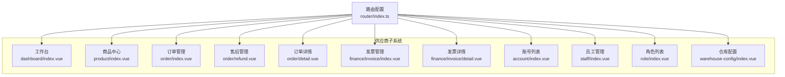
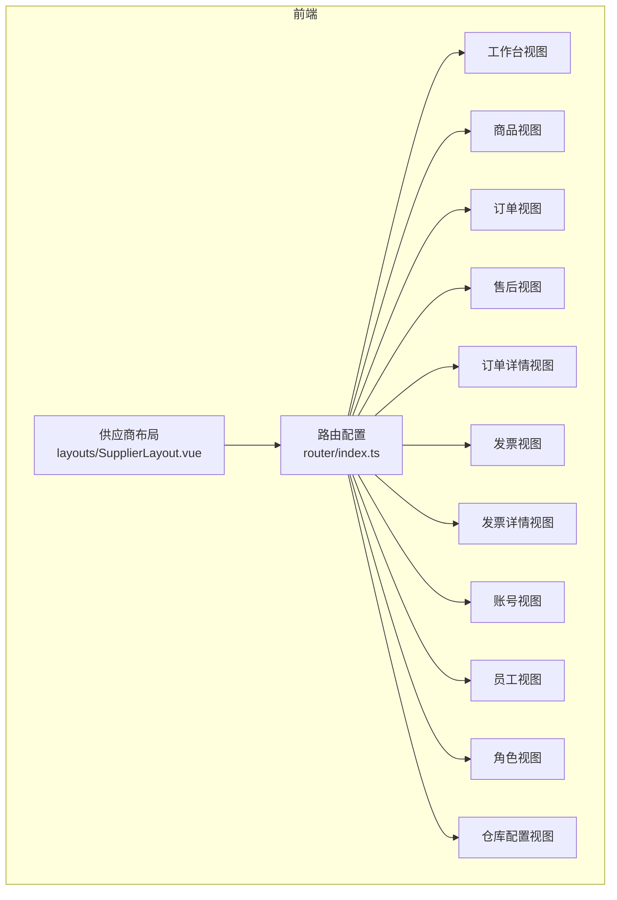
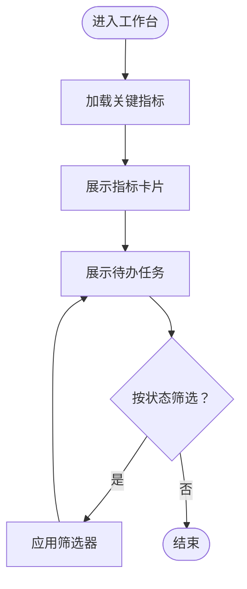
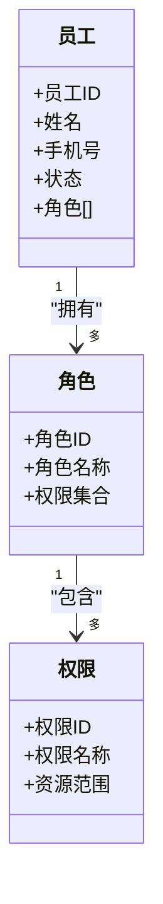
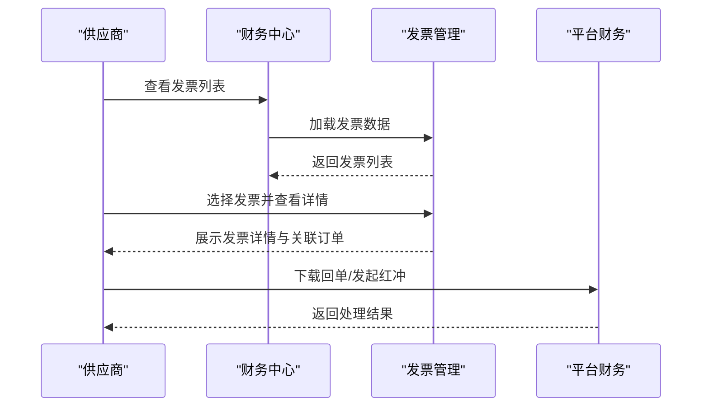
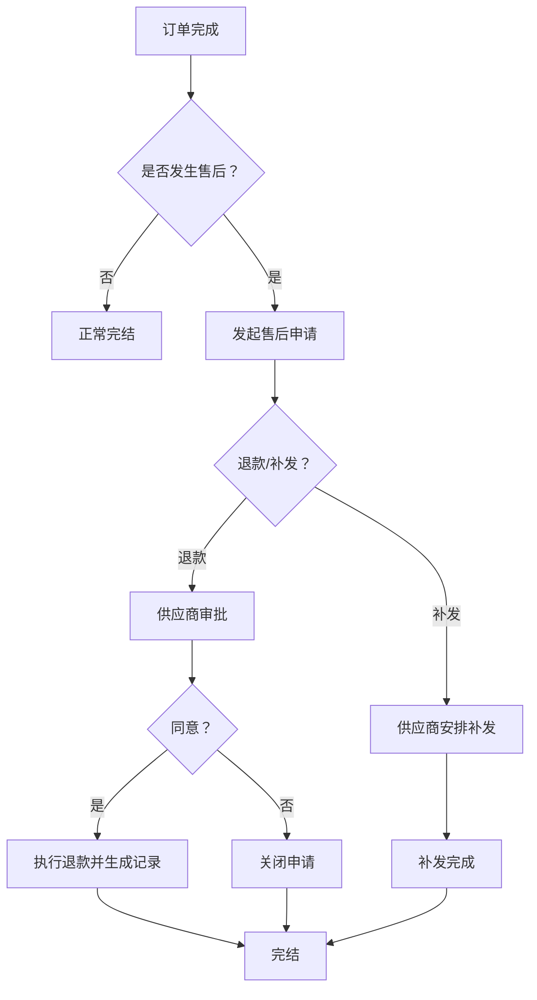
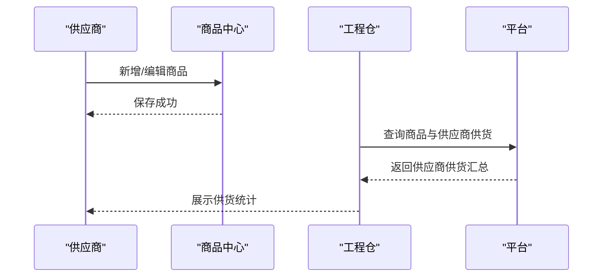
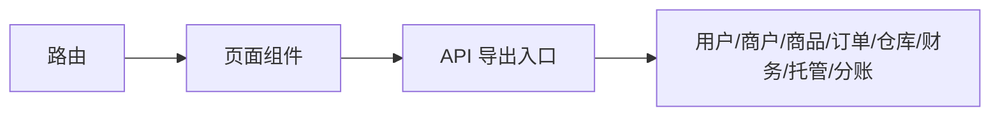

# 供应商管理

<cite>
**本文引用的文件**
- [apps/pc/src/router/index.ts](file://apps/pc/src/router/index.ts)
- [apps/pc/src/views/supplier/dashboard/index.vue](file://apps/pc/src/views/supplier/dashboard/index.vue)
- [apps/pc/src/views/supplier/profile/index.vue](file://apps/pc/src/views/supplier/profile/index.vue)
- [apps/pc/src/views/supplier/account/index.vue](file://apps/pc/src/views/supplier/account/index.vue)
- [apps/pc/src/views/supplier/staff/index.vue](file://apps/pc/src/views/supplier/staff/index.vue)
- [apps/pc/src/views/supplier/role/index.vue](file://apps/pc/src/views/supplier/role/index.vue)
- [apps/pc/src/views/supplier/warehouse-config/index.vue](file://apps/pc/src/views/supplier/warehouse-config/index.vue)
- [apps/pc/src/views/supplier/product/index.vue](file://apps/pc/src/views/supplier/product/index.vue)
- [apps/pc/src/views/supplier/order/index.vue](file://apps/pc/src/views/supplier/order/index.vue)
- [apps/pc/src/views/supplier/order/refund.vue](file://apps/pc/src/views/supplier/order/refund.vue)
- [apps/pc/src/views/supplier/order/detail.vue](file://apps/pc/src/views/supplier/order/detail.vue)
- [apps/pc/src/views/supplier/finance/invoice/index.vue](file://apps/pc/src/views/supplier/finance/invoice/index.vue)
- [apps/pc/src/views/supplier/finance/invoice/detail.vue](file://apps/pc/src/views/supplier/finance/invoice/detail.vue)
- [apps/pc/src/views/finance/wallet/index.vue](file://apps/pc/src/views/finance/wallet/index.vue)
- [apps/pc/src/views/warehouse/product/spu-detail.vue](file://apps/pc/src/views/warehouse/product/spu-detail.vue)
- [packages/api/src/index.ts](file://packages/api/src/index.ts)
- [docs/供应商端产品PRD.md](file://docs/供应商端产品PRD.md)
- [docs/供应商端_产品PRD_最终版.md](file://docs/供应商端_产品PRD_最终版.md)
- [scripts/产品功能清单/供应商端_产品功能清单.md](file://scripts/产品功能清单/供应商端_产品功能清单.md)
</cite>

## 目录
1. [简介](#简介)
2. [项目结构](#项目结构)
3. [核心组件](#核心组件)
4. [架构总览](#架构总览)
5. [详细组件分析](#详细组件分析)
6. [依赖分析](#依赖分析)
7. [性能考虑](#性能考虑)
8. [故障排查指南](#故障排查指南)
9. [结论](#结论)
10. [附录](#附录)

## 简介
本文件面向供应商侧的“供应商管理”能力，系统化梳理并说明以下核心模块与业务流程：
- 供应商工作台：数据概览、待办事项
- 供应商账户管理：账户信息、密码管理、安全设置
- 供应商资料管理：企业信息、联系人信息、银行账户
- 供应商角色权限：角色分配、权限管理、员工管理
- 供应商仓库配置：仓库设置、货位管理、存储条件
- 供应商财务模块：资金账户、收支明细、托管管理、结算管理、发票管理
- 供应商订单模块：订单处理、退款管理
- 供应商产品模块：产品管理、库存管理、产品提交
- 供应商入驻指南、操作手册与常见问题

本说明以前端路由与页面为核心入口，结合PRD文档与功能清单，帮助非技术读者快速理解系统定位与使用路径。

## 项目结构
供应商管理功能主要位于 PC 端供应商子系统，通过统一的供应商布局与路由组织，形成清晰的功能域划分：
- 供应商工作台：概览与待办
- 商品中心：商品列表、库存记录、新增/编辑/查看
- 订单管理：订单列表、售后管理、订单详情
- 财务中心：发票管理（含详情）
- 系统设置：账号列表、员工管理、角色列表
- 仓库配置：仓库设置（页面存在但具体功能以实际为准）

图表来源
- [apps/pc/src/router/index.ts:402-519](file://apps/pc/src/router/index.ts#L402-L519)
- [apps/pc/src/views/supplier/dashboard/index.vue](file://apps/pc/src/views/supplier/dashboard/index.vue)
- [apps/pc/src/views/supplier/product/index.vue](file://apps/pc/src/views/supplier/product/index.vue)
- [apps/pc/src/views/supplier/order/index.vue](file://apps/pc/src/views/supplier/order/index.vue)
- [apps/pc/src/views/supplier/order/refund.vue](file://apps/pc/src/views/supplier/order/refund.vue)
- [apps/pc/src/views/supplier/order/detail.vue](file://apps/pc/src/views/supplier/order/detail.vue)
- [apps/pc/src/views/supplier/finance/invoice/index.vue](file://apps/pc/src/views/supplier/finance/invoice/index.vue)
- [apps/pc/src/views/supplier/finance/invoice/detail.vue](file://apps/pc/src/views/supplier/finance/invoice/detail.vue)
- [apps/pc/src/views/supplier/account/index.vue](file://apps/pc/src/views/supplier/account/index.vue)
- [apps/pc/src/views/supplier/staff/index.vue](file://apps/pc/src/views/supplier/staff/index.vue)
- [apps/pc/src/views/supplier/role/index.vue](file://apps/pc/src/views/supplier/role/index.vue)
- [apps/pc/src/views/supplier/warehouse-config/index.vue](file://apps/pc/src/views/supplier/warehouse-config/index.vue)

章节来源
- [apps/pc/src/router/index.ts:402-519](file://apps/pc/src/router/index.ts#L402-L519)

## 核心组件
- 供应商工作台：提供关键指标看板与待办事项聚合，便于快速掌握业务动态
- 商品中心：商品生命周期管理（列表、新增、编辑、查看、库存记录）
- 订单管理：订单列表、售后管理（退款/补发）、订单详情
- 财务中心：发票管理（列表与详情），对接平台财务能力
- 系统设置：账号管理、员工管理、角色管理
- 仓库配置：仓库设置、货位管理、存储条件（页面存在，具体以实际为准）

章节来源
- [apps/pc/src/views/supplier/dashboard/index.vue](file://apps/pc/src/views/supplier/dashboard/index.vue)
- [apps/pc/src/views/supplier/product/index.vue](file://apps/pc/src/views/supplier/product/index.vue)
- [apps/pc/src/views/supplier/order/index.vue](file://apps/pc/src/views/supplier/order/index.vue)
- [apps/pc/src/views/supplier/order/refund.vue](file://apps/pc/src/views/supplier/order/refund.vue)
- [apps/pc/src/views/supplier/order/detail.vue](file://apps/pc/src/views/supplier/order/detail.vue)
- [apps/pc/src/views/supplier/finance/invoice/index.vue](file://apps/pc/src/views/supplier/finance/invoice/index.vue)
- [apps/pc/src/views/supplier/finance/invoice/detail.vue](file://apps/pc/src/views/supplier/finance/invoice/detail.vue)
- [apps/pc/src/views/supplier/account/index.vue](file://apps/pc/src/views/supplier/account/index.vue)
- [apps/pc/src/views/supplier/staff/index.vue](file://apps/pc/src/views/supplier/staff/index.vue)
- [apps/pc/src/views/supplier/role/index.vue](file://apps/pc/src/views/supplier/role/index.vue)
- [apps/pc/src/views/supplier/warehouse-config/index.vue](file://apps/pc/src/views/supplier/warehouse-config/index.vue)

## 架构总览
供应商子系统采用“路由驱动 + 页面组件”的前端架构，围绕“工作台、商品、订单、财务、系统设置、仓库配置”六大域构建。页面通过统一的供应商布局加载，路由负责导航与权限入口。

图表来源
- [apps/pc/src/router/index.ts:402-519](file://apps/pc/src/router/index.ts#L402-L519)

## 详细组件分析

### 供应商工作台（数据概览、待办事项）
- 数据概览：展示关键指标卡片（如订单量、销售额、退款率等），用于快速掌握业务健康度
- 待办事项：聚合“待处理”“处理中”“已同意”“已拒绝”等状态的任务，支持按状态筛选
- 设计理念：以“看板 + 状态标签”为核心，强调“一目了然”的运营效率

图表来源
- [apps/pc/src/views/supplier/dashboard/index.vue](file://apps/pc/src/views/supplier/dashboard/index.vue)

章节来源
- [apps/pc/src/views/supplier/dashboard/index.vue](file://apps/pc/src/views/supplier/dashboard/index.vue)

### 供应商账户管理（账户信息、密码管理、安全设置）
- 账户信息：主体信息、联系人信息、企业信息、合同信息、资质信息等
- 密码管理：支持修改登录密码与支付密码
- 安全设置：登录保护、设备管理、登录日志等
- 重要提示：银行账户与税务信息需通过“托管账户”与“银行对账”流程进行合规管理

章节来源
- [apps/pc/src/views/supplier/profile/index.vue](file://apps/pc/src/views/supplier/profile/index.vue)
- [apps/pc/src/views/supplier/account/index.vue](file://apps/pc/src/views/supplier/account/index.vue)
- [docs/供应商端产品PRD.md:752-788](file://docs/供应商端产品PRD.md#L752-L788)

### 供应商资料管理（企业信息、联系人信息、银行账户）
- 企业信息：企业名称、类型、统一社会信用代码、注册地址、经营范围等
- 联系人信息：联系人姓名、职位、电话、邮箱等
- 银行账户：银行账户名称、账号、开户行、纳税人识别号等
- 资质信息：营业执照、生产/经营许可、产品认证等
- 托管账户：账户状态、可用余额、冻结余额、资金流水等

章节来源
- [apps/pc/src/views/supplier/profile/index.vue](file://apps/pc/src/views/supplier/profile/index.vue)
- [apps/pc/src/views/supplier/account/index.vue](file://apps/pc/src/views/supplier/account/index.vue)
- [docs/供应商端产品PRD.md:752-788](file://docs/供应商端产品PRD.md#L752-L788)

### 供应商角色权限（角色分配、权限管理、员工管理）
- 角色列表：查看与管理角色，支持角色权限树形勾选
- 权限管理：菜单权限与功能权限的精细化控制
- 员工管理：员工账号列表、分配角色、启用/停用、重置密码等

图表来源
- [apps/pc/src/views/supplier/role/index.vue](file://apps/pc/src/views/supplier/role/index.vue)
- [apps/pc/src/views/supplier/staff/index.vue](file://apps/pc/src/views/supplier/staff/index.vue)

章节来源
- [apps/pc/src/views/supplier/role/index.vue](file://apps/pc/src/views/supplier/role/index.vue)
- [apps/pc/src/views/supplier/staff/index.vue](file://apps/pc/src/views/supplier/staff/index.vue)

### 供应商仓库配置（仓库设置、货位管理、存储条件）
- 仓库设置：仓库基本信息、默认仓库、仓库状态
- 货位管理：货位编号、区域划分、容量与占用情况
- 存储条件：温湿度、光照、防潮、防火等仓储标准
- 说明：仓库配置页面存在，具体字段与流程以实际实现为准

章节来源
- [apps/pc/src/views/supplier/warehouse-config/index.vue](file://apps/pc/src/views/supplier/warehouse-config/index.vue)

### 供应商财务模块（资金账户、收支明细、托管管理、结算管理、发票管理）
- 资金账户：账户概览、可用余额、冻结余额、总余额
- 收支明细：交易流水、收支类型、时间范围、状态筛选
- 托管管理：充值/提现、绑卡管理、默认卡设置、卡号脱敏展示
- 结算管理：结算单列表与详情、对账单列表、差异调节
- 发票管理：销项发票列表、关联订单开票、发票红冲、回单下载

图表来源
- [apps/pc/src/views/supplier/finance/invoice/index.vue](file://apps/pc/src/views/supplier/finance/invoice/index.vue)
- [apps/pc/src/views/supplier/finance/invoice/detail.vue](file://apps/pc/src/views/supplier/finance/invoice/detail.vue)

章节来源
- [apps/pc/src/views/supplier/finance/invoice/index.vue](file://apps/pc/src/views/supplier/finance/invoice/index.vue)
- [apps/pc/src/views/supplier/finance/invoice/detail.vue](file://apps/pc/src/views/supplier/finance/invoice/detail.vue)
- [apps/pc/src/views/finance/wallet/index.vue](file://apps/pc/src/views/finance/wallet/index.vue)
- [docs/供应商端产品PRD.md:569-591](file://docs/供应商端产品PRD.md#L569-L591)

### 供应商订单模块（订单处理、退款管理）
- 订单列表：按状态筛选、订单号/客户/金额/时间等维度查询
- 订单详情：订单行明细、物流信息、售后记录、状态流转
- 售后管理：退款/补发申请、审批流程、状态跟踪、历史记录
- 退款流程：申请 → 审批 → 执行 → 记录归档；与订单状态解耦，支持多次部分退款

图表来源
- [apps/pc/src/views/supplier/order/refund.vue](file://apps/pc/src/views/supplier/order/refund.vue)
- [apps/pc/src/views/supplier/order/detail.vue](file://apps/pc/src/views/supplier/order/detail.vue)
- [docs/供应商端产品PRD.md:162-190](file://docs/供应商端产品PRD.md#L162-L190)

章节来源
- [apps/pc/src/views/supplier/order/index.vue](file://apps/pc/src/views/supplier/order/index.vue)
- [apps/pc/src/views/supplier/order/refund.vue](file://apps/pc/src/views/supplier/order/refund.vue)
- [apps/pc/src/views/supplier/order/detail.vue](file://apps/pc/src/views/supplier/order/detail.vue)
- [docs/供应商端产品PRD.md:162-190](file://docs/供应商端产品PRD.md#L162-L190)

### 供应商产品模块（产品管理、库存管理、产品提交）
- 产品管理：商品列表、新增/编辑/查看、价格与库存维护
- 库存管理：库存记录、盘点、调拨、批次管理
- 产品提交：SPU/SKU 创建、规格配置、价格策略、平台审核
- 供应链联动：工程仓侧可查看“供应商供货汇总”，了解覆盖SKU与总供货量

图表来源
- [apps/pc/src/views/supplier/product/index.vue](file://apps/pc/src/views/supplier/product/index.vue)
- [apps/pc/src/views/warehouse/product/spu-detail.vue](file://apps/pc/src/views/warehouse/product/spu-detail.vue)

章节来源
- [apps/pc/src/views/supplier/product/index.vue](file://apps/pc/src/views/supplier/product/index.vue)
- [apps/pc/src/views/warehouse/product/spu-detail.vue](file://apps/pc/src/views/warehouse/product/spu-detail.vue)

## 依赖分析
- 路由依赖：供应商子系统通过路由集中管理各功能域入口，避免页面间耦合
- 组件依赖：各页面组件相对独立，通过布局与路由进行组合
- API 依赖：前端通过统一导出的 API 入口访问用户、商户、商品、订单、仓库、财务、托管、分账等接口

图表来源
- [apps/pc/src/router/index.ts:402-519](file://apps/pc/src/router/index.ts#L402-L519)
- [packages/api/src/index.ts:1-10](file://packages/api/src/index.ts#L1-L10)

章节来源
- [packages/api/src/index.ts:1-10](file://packages/api/src/index.ts#L1-L10)

## 性能考虑
- 页面懒加载：路由按需加载组件，降低首屏体积
- 列表分页与筛选：通过分页与筛选减少一次性渲染的数据量
- 状态缓存：关键指标与常用数据可在工作台进行本地缓存，提升刷新速度
- 图片与静态资源：建议使用 CDN 与懒加载策略，优化移动端体验

## 故障排查指南
- 登录与权限
  - 症状：无法进入供应商子系统
  - 排查：确认账号角色是否为供应商、是否完成主体信息与资质审核
- 订单与售后
  - 症状：售后申请无响应或状态不更新
  - 排查：检查订单状态是否满足售后条件、审批流程是否完成、图片凭证是否合规
- 财务与发票
  - 症状：发票列表为空或无法下载回单
  - 排查：确认是否存在关联订单、发票状态是否正常、下载权限是否开启
- 商品与库存
  - 症状：商品无法提交或库存不一致
  - 排查：检查 SPU/SKU 规格配置、价格策略、平台审核状态与库存同步

章节来源
- [apps/pc/src/views/supplier/order/refund.vue](file://apps/pc/src/views/supplier/order/refund.vue)
- [apps/pc/src/views/supplier/finance/invoice/index.vue](file://apps/pc/src/views/supplier/finance/invoice/index.vue)
- [apps/pc/src/views/supplier/product/index.vue](file://apps/pc/src/views/supplier/product/index.vue)

## 结论
供应商管理模块以“工作台为中心、以业务域为边界”，通过路由与页面组件的清晰划分，支撑从商品、订单到财务、系统设置的全链路运营。配合 PRD 的流程设计与功能清单，供应商可高效完成日常运营与合规管理。

## 附录

### 供应商入驻指南（步骤要点）
- 完成主体信息与联系人信息录入
- 上传并完成资质认证（营业执照、许可、认证等）
- 开通托管账户并完成绑卡
- 设置默认收款账户与税务信息
- 完成角色与员工初始化配置
- 上架首批商品并完成价格与库存配置

章节来源
- [docs/供应商端产品PRD.md:752-788](file://docs/供应商端产品PRD.md#L752-L788)
- [docs/供应商端_产品PRD_最终版.md:51-99](file://docs/供应商端_产品PRD_最终版.md#L51-L99)

### 操作手册（高频场景）
- 查看待办事项与关键指标：工作台
- 处理售后退款：订单详情 → 售后管理 → 审批与执行
- 发票管理：发票列表 → 详情查看 → 关联合同/订单
- 商品管理：商品列表 → 新增/编辑/查看 → 库存记录
- 账号与权限：账号列表 → 员工管理 → 角色权限配置

章节来源
- [apps/pc/src/router/index.ts:402-519](file://apps/pc/src/router/index.ts#L402-L519)

### 常见问题（FAQ）
- Q：如何查看供应商供货汇总？
  - A：在工程仓侧的商品详情中查看“供应商供货汇总”卡片
- Q：如何申请补发？
  - A：在订单详情中发起补发申请，填写原因与数量并提交
- Q：发票红冲如何操作？
  - A：在发票管理中选择对应发票并发起红冲流程
- Q：如何设置默认收款卡？
  - A：在托管账户或银行对账模块中设置默认卡并完成短信验证

章节来源
- [apps/pc/src/views/warehouse/product/spu-detail.vue](file://apps/pc/src/views/warehouse/product/spu-detail.vue)
- [apps/pc/src/views/supplier/order/detail.vue](file://apps/pc/src/views/supplier/order/detail.vue)
- [apps/pc/src/views/supplier/finance/invoice/index.vue](file://apps/pc/src/views/supplier/finance/invoice/index.vue)