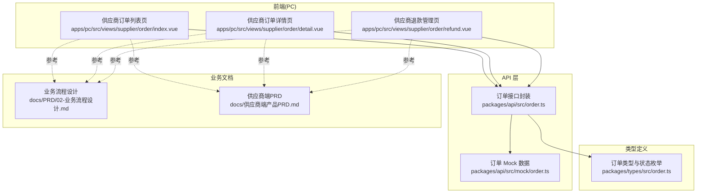
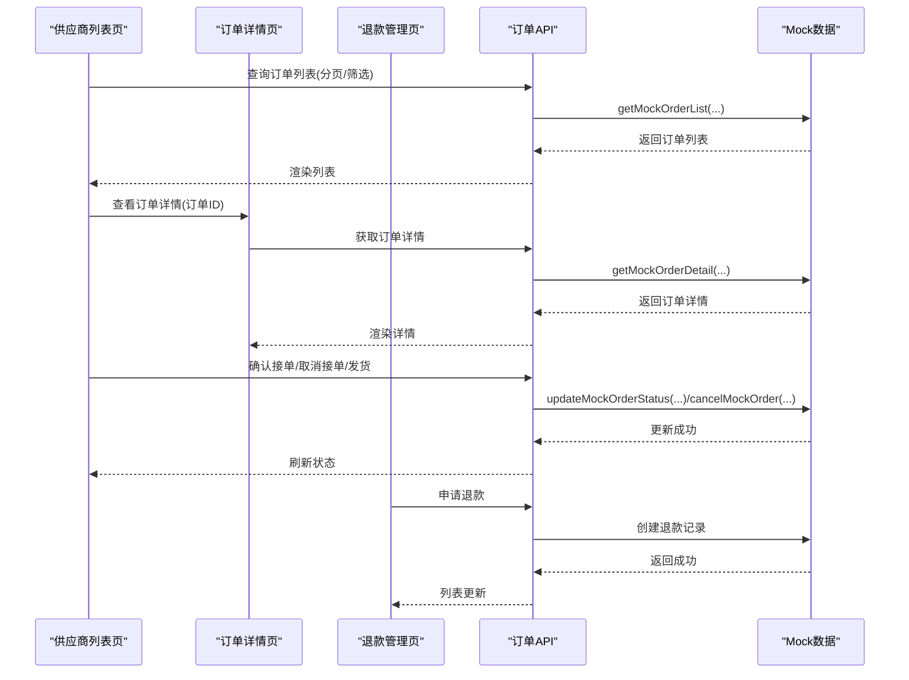
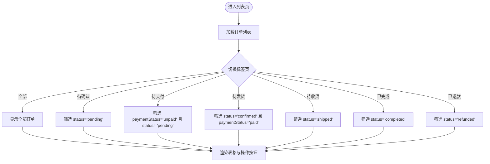
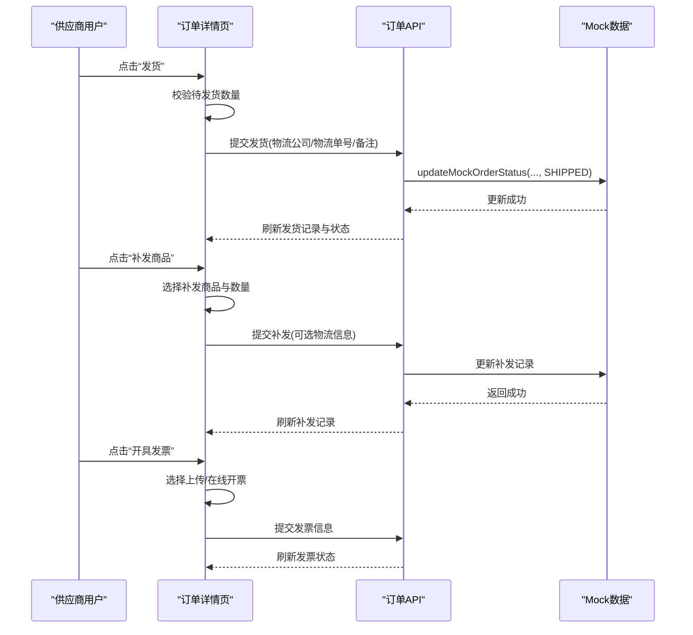
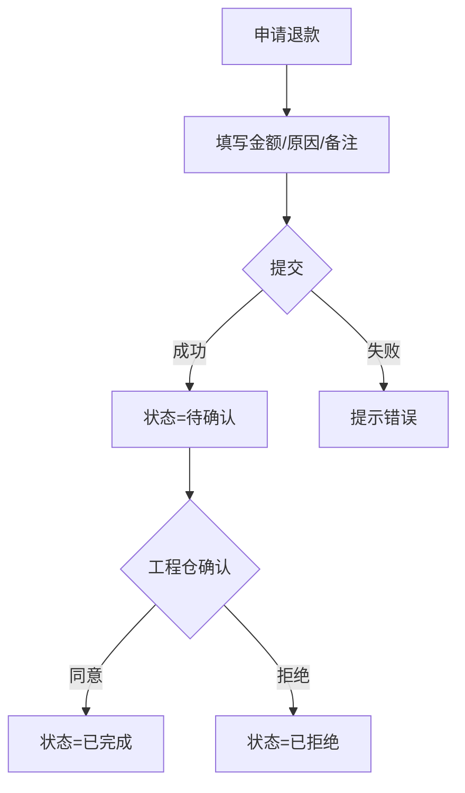
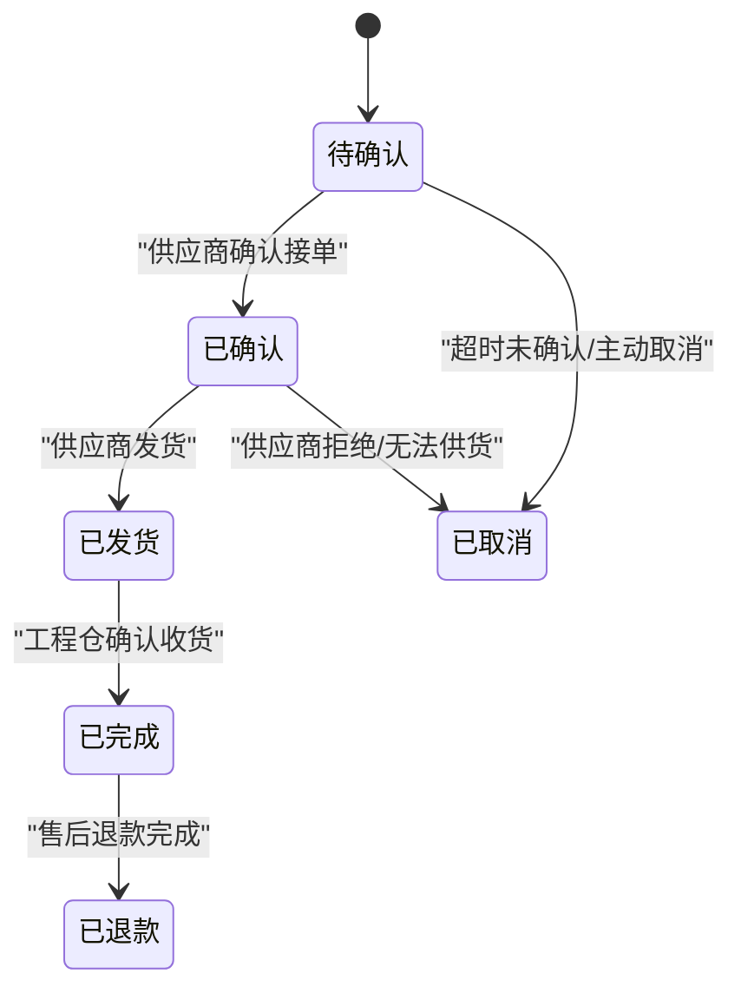
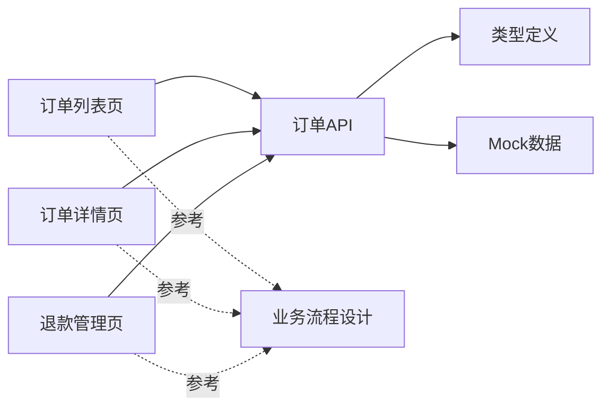

# 供应商订单管理

<cite>
**本文引用的文件**
- [apps/pc/src/views/supplier/order/index.vue](file://apps/pc/src/views/supplier/order/index.vue)
- [apps/pc/src/views/supplier/order/detail.vue](file://apps/pc/src/views/supplier/order/detail.vue)
- [apps/pc/src/views/supplier/order/refund.vue](file://apps/pc/src/views/supplier/order/refund.vue)
- [packages/api/src/order.ts](file://packages/api/src/order.ts)
- [packages/api/src/mock/order.ts](file://packages/api/src/mock/order.ts)
- [packages/types/src/order.ts](file://packages/types/src/order.ts)
- [docs/PRD/02-业务流程设计.md](file://docs/PRD/02-业务流程设计.md)
- [docs/供应商端产品PRD.md](file://docs/供应商端产品PRD.md)
</cite>

## 目录
1. [简介](#简介)
2. [项目结构](#项目结构)
3. [核心组件](#核心组件)
4. [架构总览](#架构总览)
5. [详细组件分析](#详细组件分析)
6. [依赖分析](#依赖分析)
7. [性能考虑](#性能考虑)
8. [故障排查指南](#故障排查指南)
9. [结论](#结论)
10. [附录](#附录)

## 简介
本文件面向供应商侧“订单管理”能力，系统化梳理从订单列表、订单详情、状态处理到退款管理的完整流程，明确订单状态流转机制、处理时限、异常订单处理策略以及数据统计分析方法。文档同时给出可视化流程与时序图，帮助研发与运营人员快速理解并落地实现。

## 项目结构
供应商订单管理主要由以下模块构成：
- 供应商订单列表页：提供订单筛选、状态统计、批量操作入口
- 供应商订单详情页：展示订单全貌、商品明细、发货记录、支付与发票、售后与退款
- 供应商退款管理页：集中查看与处理退款申请
- API 层：封装订单相关接口（含 mock 实现）
- 类型定义：统一订单状态、支付状态、枚举值等
- PRD 文档：提供业务流程与规则约束

图表来源
- [apps/pc/src/views/supplier/order/index.vue](file://apps/pc/src/views/supplier/order/index.vue)
- [apps/pc/src/views/supplier/order/detail.vue](file://apps/pc/src/views/supplier/order/detail.vue)
- [apps/pc/src/views/supplier/order/refund.vue](file://apps/pc/src/views/supplier/order/refund.vue)
- [packages/api/src/order.ts](file://packages/api/src/order.ts)
- [packages/api/src/mock/order.ts](file://packages/api/src/mock/order.ts)
- [packages/types/src/order.ts](file://packages/types/src/order.ts)
- [docs/PRD/02-业务流程设计.md](file://docs/PRD/02-业务流程设计.md)
- [docs/供应商端产品PRD.md](file://docs/供应商端产品PRD.md)

章节来源
- [apps/pc/src/views/supplier/order/index.vue](file://apps/pc/src/views/supplier/order/index.vue)
- [apps/pc/src/views/supplier/order/detail.vue](file://apps/pc/src/views/supplier/order/detail.vue)
- [apps/pc/src/views/supplier/order/refund.vue](file://apps/pc/src/views/supplier/order/refund.vue)
- [packages/api/src/order.ts](file://packages/api/src/order.ts)
- [packages/api/src/mock/order.ts](file://packages/api/src/mock/order.ts)
- [packages/types/src/order.ts](file://packages/types/src/order.ts)
- [docs/PRD/02-业务流程设计.md](file://docs/PRD/02-业务流程设计.md)
- [docs/供应商端产品PRD.md](file://docs/供应商端产品PRD.md)

## 核心组件
- 订单列表页：提供“全部/待确认/待支付/待发货/待收货/已完成/已退款”等标签页统计；支持分页、按状态过滤；提供“查看/确认接单/取消接单/发货/物流跟踪/售后”等操作按钮。
- 订单详情页：包含基本信息、商品明细、发货记录、付款记录、发票信息、退款记录、操作日志；支持“补发商品”“发货”“物流跟踪”“开具发票”等操作。
- 退款管理页：集中展示退款单列表，支持按“全部/待确认/已拒绝/已完成”筛选；提供“详情”“申请退款”入口。
- API 层：提供订单查询、详情、确认、取消、支付、发货、完成、收货等接口；mock 层用于本地开发与演示。
- 类型定义：统一订单状态（待确认、已确认、已发货、已完成、已取消、已退款等）、支付状态、枚举值等。

章节来源
- [apps/pc/src/views/supplier/order/index.vue](file://apps/pc/src/views/supplier/order/index.vue)
- [apps/pc/src/views/supplier/order/detail.vue](file://apps/pc/src/views/supplier/order/detail.vue)
- [apps/pc/src/views/supplier/order/refund.vue](file://apps/pc/src/views/supplier/order/refund.vue)
- [packages/api/src/order.ts](file://packages/api/src/order.ts)
- [packages/api/src/mock/order.ts](file://packages/api/src/mock/order.ts)
- [packages/types/src/order.ts](file://packages/types/src/order.ts)

## 架构总览
供应商订单管理采用“页面组件 + API 封装 + 类型定义 + 文档约束”的分层架构。页面组件负责交互与展示，API 封装负责与后端或 mock 通信，类型定义确保前后端一致性，PRD 文档提供业务规则与流程约束。

图表来源
- [apps/pc/src/views/supplier/order/index.vue](file://apps/pc/src/views/supplier/order/index.vue)
- [apps/pc/src/views/supplier/order/detail.vue](file://apps/pc/src/views/supplier/order/detail.vue)
- [apps/pc/src/views/supplier/order/refund.vue](file://apps/pc/src/views/supplier/order/refund.vue)
- [packages/api/src/order.ts](file://packages/api/src/order.ts)
- [packages/api/src/mock/order.ts](file://packages/api/src/mock/order.ts)

## 详细组件分析

### 供应商订单列表页
- 功能要点
  - 标签页统计：全部、待确认、待支付、待发货、待收货、已完成、已退款
  - 表格列：订单编号、采购方、商品数量、订单金额、支付状态、要求交货日期、订单状态、售后金额、下单时间、操作
  - 操作按钮：根据状态动态显示“查看/确认接单/取消接单/发货/物流跟踪/售后”
- 关键逻辑
  - 过滤器：根据 activeTab 切换不同状态过滤
  - 状态颜色：根据状态映射颜色与文案
  - 分页：支持页码变更回调
- 交互细节
  - “确认接单”支持部分接单，可为每种商品选择“确认接单/无法供货”，并填写预计发货时间与原因
  - “发货”弹窗填写物流公司与物流单号，支持备注

图表来源
- [apps/pc/src/views/supplier/order/index.vue](file://apps/pc/src/views/supplier/order/index.vue)

章节来源
- [apps/pc/src/views/supplier/order/index.vue](file://apps/pc/src/views/supplier/order/index.vue)

### 供应商订单详情页
- 功能要点
  - 基本信息：订单编号、采购方、订单金额、订单状态、支付状态、发货状态、创建/支付时间
  - 商品信息：商品名称、规格、单位、采购数量、接单状态、无法供货原因、预计发货时间、已发货/待发货数量、单价、金额、备注
  - 发货记录：类型（正常/补发）、发货单号、发货时间、物流公司、物流单号、发货数量、补发原因、发货状态、备注
  - 付款记录：订单金额、已到账、待结算；支持查看转账凭证
  - 发票信息：支持“开具发票”，区分上传与在线开票
  - 退款记录：退款类型、状态、商品、金额、申请时间、详情
  - 操作日志：按时间线展示关键事件
- 关键流程
  - 发货：支持分批发货，可选择部分商品发货，并可添加多个物流单号
  - 补发：针对破损、损耗、质量问题、错发漏发等场景进行补发
  - 开具发票：支持上传已有发票或在线开具电子发票
  - 申请退款：按商品维度选择退款数量与金额，填写原因与备注

图表来源
- [apps/pc/src/views/supplier/order/detail.vue](file://apps/pc/src/views/supplier/order/detail.vue)
- [packages/api/src/order.ts](file://packages/api/src/order.ts)
- [packages/api/src/mock/order.ts](file://packages/api/src/mock/order.ts)

章节来源
- [apps/pc/src/views/supplier/order/detail.vue](file://apps/pc/src/views/supplier/order/detail.vue)

### 供应商退款管理页
- 功能要点
  - 退款列表：退款单号、关联订单、退款状态、退款金额、退款原因、发起方、申请时间
  - 筛选：全部/待确认/已拒绝/已完成
  - 操作：详情、申请退款
- 申请退款流程
  - 选择订单，填写退款金额（1~订单金额）、退款原因、备注
  - 提交后进入“待确认”状态，等待工程仓确认

图表来源
- [apps/pc/src/views/supplier/order/refund.vue](file://apps/pc/src/views/supplier/order/refund.vue)

章节来源
- [apps/pc/src/views/supplier/order/refund.vue](file://apps/pc/src/views/supplier/order/refund.vue)

### 订单状态流转机制
- 供应商视角的关键状态与触发条件
  - 待确认：订单创建（工程仓下单）
  - 已确认：供应商确认接单（冻结资金）
  - 已发货：供应商发货（冻结资金）
  - 已完成：工程仓确认收货（解冻→结算）
  - 已取消：超时未确认/主动取消
  - 已退款：售后退款完成
- 状态机示意

图表来源
- [docs/PRD/02-业务流程设计.md](file://docs/PRD/02-业务流程设计.md)
- [docs/供应商端产品PRD.md](file://docs/供应商端产品PRD.md)

章节来源
- [docs/PRD/02-业务流程设计.md](file://docs/PRD/02-业务流程设计.md)
- [docs/供应商端产品PRD.md](file://docs/供应商端产品PRD.md)

### 订单处理时限与异常处理
- 处理时限
  - 待确认：建议在约定时间内完成确认/拒绝，避免超时转为已取消
  - 待发货：确认接单后尽快安排发货，避免长时间占用资金
  - 待收货：发货后及时更新物流信息，保障收货时效
- 异常处理
  - 部分接单：无法供货的商品可单独标注并填写原因
  - 补发流程：针对破损、损耗、质量问题、错发漏发等场景进行补发
  - 退款流程：供应商可发起退款申请，经工程仓确认后完成退款

章节来源
- [apps/pc/src/views/supplier/order/index.vue](file://apps/pc/src/views/supplier/order/index.vue)
- [apps/pc/src/views/supplier/order/detail.vue](file://apps/pc/src/views/supplier/order/detail.vue)
- [apps/pc/src/views/supplier/order/refund.vue](file://apps/pc/src/views/supplier/order/refund.vue)

### 订单数据统计分析
- 列表页统计
  - 全部、待确认、待支付、待发货、待收货、已完成、已退款的数量统计
- 退款统计
  - 全部、待确认、已拒绝、已完成的退款单数量统计
- 建议指标
  - 订单转化率（待确认→已确认）、发货及时率、完成率、退款率、售后处理时长

章节来源
- [apps/pc/src/views/supplier/order/index.vue](file://apps/pc/src/views/supplier/order/index.vue)
- [apps/pc/src/views/supplier/order/refund.vue](file://apps/pc/src/views/supplier/order/refund.vue)

## 依赖分析
- 页面组件依赖 API 层提供的接口函数
- API 层依赖类型定义中的枚举与接口
- API 层在开发模式下使用 mock 数据，生产模式对接真实后端
- PRD 文档为业务规则与流程提供约束

图表来源
- [apps/pc/src/views/supplier/order/index.vue](file://apps/pc/src/views/supplier/order/index.vue)
- [apps/pc/src/views/supplier/order/detail.vue](file://apps/pc/src/views/supplier/order/detail.vue)
- [apps/pc/src/views/supplier/order/refund.vue](file://apps/pc/src/views/supplier/order/refund.vue)
- [packages/api/src/order.ts](file://packages/api/src/order.ts)
- [packages/api/src/mock/order.ts](file://packages/api/src/mock/order.ts)
- [packages/types/src/order.ts](file://packages/types/src/order.ts)
- [docs/PRD/02-业务流程设计.md](file://docs/PRD/02-业务流程设计.md)

章节来源
- [packages/api/src/order.ts](file://packages/api/src/order.ts)
- [packages/api/src/mock/order.ts](file://packages/api/src/mock/order.ts)
- [packages/types/src/order.ts](file://packages/types/src/order.ts)

## 性能考虑
- 列表分页与懒加载：通过分页参数控制每次请求的数据量，减少首屏压力
- 状态缓存：对常用状态（如支付状态、订单状态）进行本地缓存，降低重复计算
- 图片与附件：发票与转账凭证采用懒加载或缩略图策略，提升渲染性能
- 交互反馈：对危险操作（取消、退款）增加二次确认，避免误操作导致的重复请求

## 故障排查指南
- 确认接单失败
  - 检查是否选择了“确认接单/无法供货”，以及“预计发货时间”是否填写
  - 确认接口返回状态与日志记录
- 发货失败
  - 检查物流公司与物流单号是否必填
  - 确认订单状态是否为“已确认”
- 退款申请失败
  - 检查退款金额是否在允许范围内，原因是否必填
  - 确认退款状态是否正确流转
- 状态不一致
  - 对照 PRD 的状态机，检查是否存在遗漏的中间状态或时间戳缺失

章节来源
- [apps/pc/src/views/supplier/order/index.vue](file://apps/pc/src/views/supplier/order/index.vue)
- [apps/pc/src/views/supplier/order/detail.vue](file://apps/pc/src/views/supplier/order/detail.vue)
- [apps/pc/src/views/supplier/order/refund.vue](file://apps/pc/src/views/supplier/order/refund.vue)
- [packages/api/src/order.ts](file://packages/api/src/order.ts)
- [packages/api/src/mock/order.ts](file://packages/api/src/mock/order.ts)
- [docs/PRD/02-业务流程设计.md](file://docs/PRD/02-业务流程设计.md)

## 结论
供应商订单管理围绕“订单列表—订单详情—状态处理—退款管理”形成闭环，结合 API 层的统一接口与 mock 数据，以及类型定义与 PRD 的规则约束，能够支撑从草稿到完成的全链路业务运转。建议在后续迭代中进一步完善异常订单的自动化提醒与报表分析能力，持续优化用户体验与运营效率。

## 附录
- 订单状态枚举与含义
  - 订单状态：草稿、待确认、已确认、已支付、已发货、已收货、已完成、已取消、已退款
  - 支付状态：未支付、部分支付、已支付、退款中、已退款
- 常用操作
  - 确认接单：支持部分接单与无法供货原因
  - 发货：支持分批发货与多物流单号
  - 补发：针对破损、损耗、质量问题、错发漏发
  - 退款：按商品维度申请，经工程仓确认后完成

章节来源
- [packages/types/src/order.ts](file://packages/types/src/order.ts)
- [packages/api/src/order.ts](file://packages/api/src/order.ts)
- [packages/api/src/mock/order.ts](file://packages/api/src/mock/order.ts)
- [docs/PRD/02-业务流程设计.md](file://docs/PRD/02-业务流程设计.md)
- [docs/供应商端产品PRD.md](file://docs/供应商端产品PRD.md)