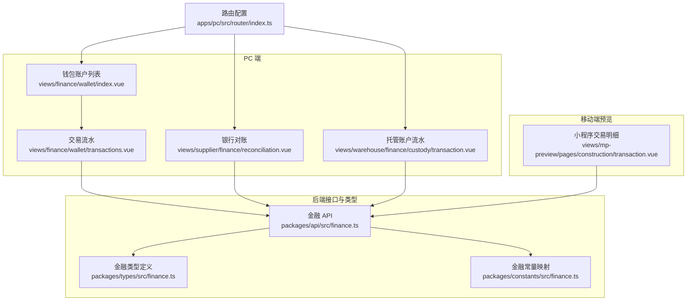
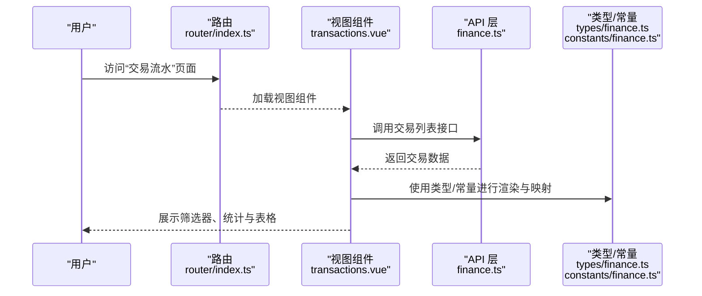
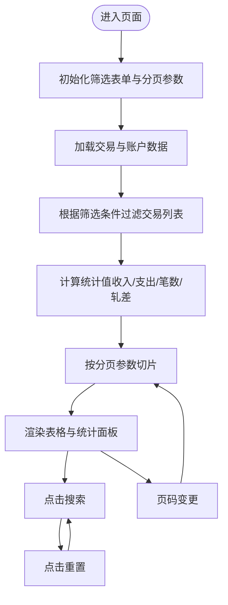
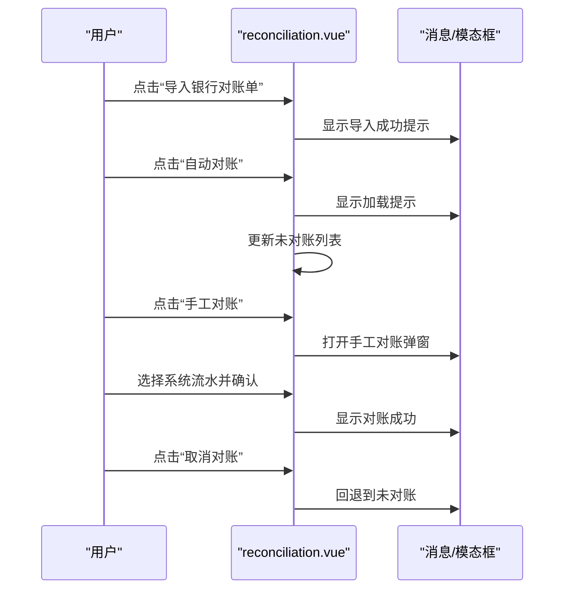
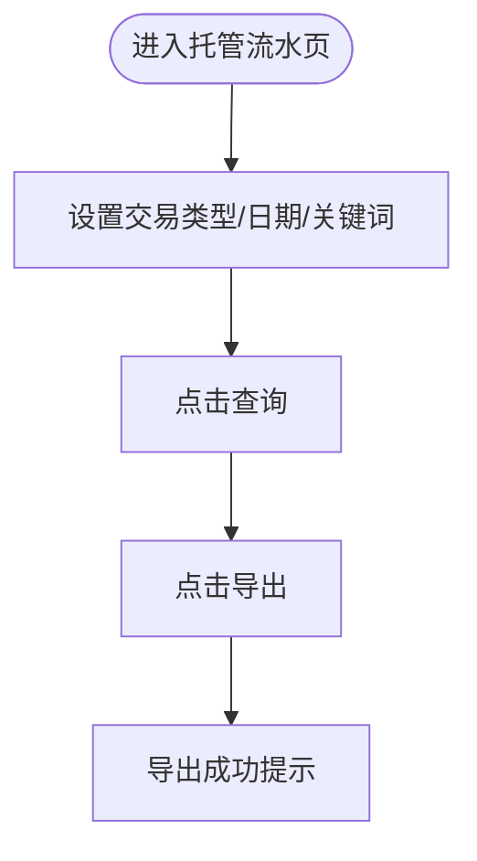
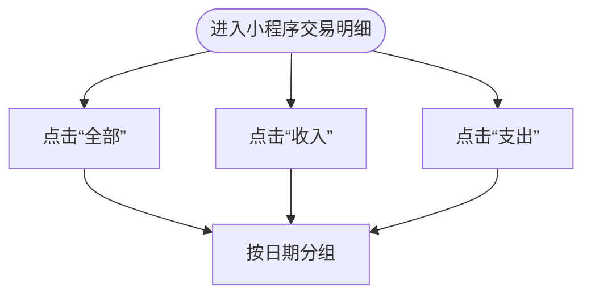
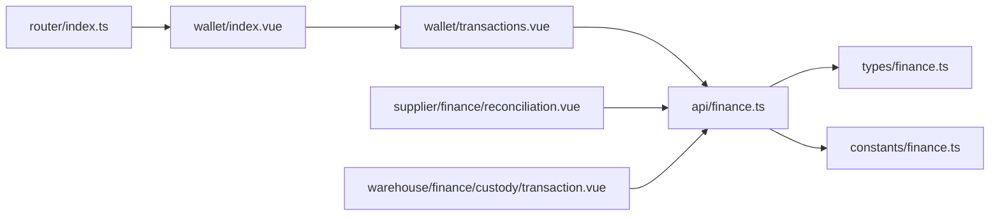

# 供应商交易明细

<cite>
**本文档引用的文件**
- [apps/pc/src/views/finance/wallet/transactions.vue](file://apps/pc/src/views/finance/wallet/transactions.vue)
- [apps/pc/src/views/finance/wallet/index.vue](file://apps/pc/src/views/finance/wallet/index.vue)
- [apps/pc/src/views/supplier/finance/reconciliation.vue](file://apps/pc/src/views/supplier/finance/reconciliation.vue)
- [apps/pc/src/views/warehouse/finance/custody/transaction.vue](file://apps/pc/src/views/warehouse/finance/custody/transaction.vue)
- [apps/pc/src/views/mp-preview/pages/construction/transaction.vue](file://apps/pc/src/views/mp-preview/pages/construction/transaction.vue)
- [packages/api/src/finance.ts](file://packages/api/src/finance.ts)
- [packages/types/src/finance.ts](file://packages/types/src/finance.ts)
- [packages/constants/src/finance.ts](file://packages/constants/src/finance.ts)
- [apps/pc/src/router/index.ts](file://apps/pc/src/router/index.ts)
</cite>

## 目录
1. [简介](#简介)
2. [项目结构](#项目结构)
3. [核心组件](#核心组件)
4. [架构总览](#架构总览)
5. [详细组件分析](#详细组件分析)
6. [依赖关系分析](#依赖关系分析)
7. [性能考虑](#性能考虑)
8. [故障排查指南](#故障排查指南)
9. [结论](#结论)
10. [附录](#附录)

## 简介
本文件面向“供应商交易明细”功能，系统化梳理供应商视角下的交易流水查询、筛选、统计与对账能力。内容涵盖：
- 交易记录的筛选查询（账户、账户类型、收支类型、业务类型、日期范围）
- 交易详情查看与状态跟踪
- 交易统计分析（交易笔数、收入/支出合计、轧差）
- 交易类型与业务类型的分类标准
- 字段定义与查询条件组合方式
- 数据导出与对账（银行对账）实现方案
- 帮助供应商进行财务对账与业务分析

## 项目结构
围绕“供应商交易明细”的前端页面主要分布在 PC 端与移动端预览端，同时通过统一的金融 API 与类型常量进行数据交互与约束。

**图表来源**
- [apps/pc/src/views/finance/wallet/transactions.vue:1-434](file://apps/pc/src/views/finance/wallet/transactions.vue#L1-L434)
- [apps/pc/src/views/finance/wallet/index.vue:1-389](file://apps/pc/src/views/finance/wallet/index.vue#L1-L389)
- [apps/pc/src/views/supplier/finance/reconciliation.vue:1-354](file://apps/pc/src/views/supplier/finance/reconciliation.vue#L1-L354)
- [apps/pc/src/views/warehouse/finance/custody/transaction.vue:1-219](file://apps/pc/src/views/warehouse/finance/custody/transaction.vue#L1-L219)
- [apps/pc/src/views/mp-preview/pages/construction/transaction.vue:1-243](file://apps/pc/src/views/mp-preview/pages/construction/transaction.vue#L1-L243)
- [packages/api/src/finance.ts:1-55](file://packages/api/src/finance.ts#L1-L55)
- [packages/types/src/finance.ts:1-95](file://packages/types/src/finance.ts#L1-L95)
- [packages/constants/src/finance.ts:1-25](file://packages/constants/src/finance.ts#L1-L25)
- [apps/pc/src/router/index.ts:1-790](file://apps/pc/src/router/index.ts#L1-L790)

**章节来源**
- [apps/pc/src/views/finance/wallet/transactions.vue:1-434](file://apps/pc/src/views/finance/wallet/transactions.vue#L1-L434)
- [apps/pc/src/views/finance/wallet/index.vue:1-389](file://apps/pc/src/views/finance/wallet/index.vue#L1-L389)
- [apps/pc/src/views/supplier/finance/reconciliation.vue:1-354](file://apps/pc/src/views/supplier/finance/reconciliation.vue#L1-L354)
- [apps/pc/src/views/warehouse/finance/custody/transaction.vue:1-219](file://apps/pc/src/views/warehouse/finance/custody/transaction.vue#L1-L219)
- [apps/pc/src/views/mp-preview/pages/construction/transaction.vue:1-243](file://apps/pc/src/views/mp-preview/pages/construction/transaction.vue#L1-L243)
- [packages/api/src/finance.ts:1-55](file://packages/api/src/finance.ts#L1-L55)
- [packages/types/src/finance.ts:1-95](file://packages/types/src/finance.ts#L1-L95)
- [packages/constants/src/finance.ts:1-25](file://packages/constants/src/finance.ts#L1-L25)
- [apps/pc/src/router/index.ts:1-790](file://apps/pc/src/router/index.ts#L1-L790)

## 核心组件
- 供应商交易流水页（PC 端）：提供筛选器、统计卡片、表格展示与分页；支持按账户、账户类型、收支类型、业务类型、日期范围筛选，并计算交易笔数、收入/支出合计与轧差。
- 银行对账页（供应商端）：提供银行流水导入、自动对账、手工对账、差异调节表与已对账/未对账列表。
- 托管账户流水页（工程仓端）：提供交易类型筛选、关键词搜索、导出能力与状态展示。
- 小程序交易明细页（移动端预览）：按日分组展示交易，支持全部/收入/支出筛选。
- 金融 API 与类型：统一的交易列表获取、类型枚举与状态映射，支撑前后端一致性。

**章节来源**
- [apps/pc/src/views/finance/wallet/transactions.vue:1-434](file://apps/pc/src/views/finance/wallet/transactions.vue#L1-L434)
- [apps/pc/src/views/supplier/finance/reconciliation.vue:1-354](file://apps/pc/src/views/supplier/finance/reconciliation.vue#L1-L354)
- [apps/pc/src/views/warehouse/finance/custody/transaction.vue:1-219](file://apps/pc/src/views/warehouse/finance/custody/transaction.vue#L1-L219)
- [apps/pc/src/views/mp-preview/pages/construction/transaction.vue:1-243](file://apps/pc/src/views/mp-preview/pages/construction/transaction.vue#L1-L243)
- [packages/api/src/finance.ts:1-55](file://packages/api/src/finance.ts#L1-L55)
- [packages/types/src/finance.ts:1-95](file://packages/types/src/finance.ts#L1-L95)
- [packages/constants/src/finance.ts:1-25](file://packages/constants/src/finance.ts#L1-L25)

## 架构总览
供应商交易明细功能由“页面层（视图组件）—接口层（API）—类型与常量层（Types/Constants）”构成，页面通过路由进入，使用 API 获取或模拟数据，渲染交易流水并提供筛选、统计与导出能力。

**图表来源**
- [apps/pc/src/router/index.ts:1-790](file://apps/pc/src/router/index.ts#L1-L790)
- [apps/pc/src/views/finance/wallet/transactions.vue:1-434](file://apps/pc/src/views/finance/wallet/transactions.vue#L1-L434)
- [packages/api/src/finance.ts:1-55](file://packages/api/src/finance.ts#L1-L55)
- [packages/types/src/finance.ts:1-95](file://packages/types/src/finance.ts#L1-L95)
- [packages/constants/src/finance.ts:1-25](file://packages/constants/src/finance.ts#L1-L25)

## 详细组件分析

### 供应商交易流水（PC 端）
- 功能要点
  - 筛选器：账户、账户类型、收支类型、业务类型、日期范围
  - 统计面板：交易笔数、总收入、总支出、轧差
  - 表格列：流水号、交易时间、账户名称、账户类型、收支类型、业务类型、交易金额、账户余额、关联单据、备注
  - 分页：基于本地数据的分页与总数更新
- 数据来源
  - 页面内维护交易列表与账户列表，支持按筛选条件过滤与分页切片
- 交互流程
  - 搜索时重置页码并更新总数
  - 重置时清空筛选并恢复总数
  - 页码变更时更新当前页

**图表来源**
- [apps/pc/src/views/finance/wallet/transactions.vue:130-400](file://apps/pc/src/views/finance/wallet/transactions.vue#L130-L400)

**章节来源**
- [apps/pc/src/views/finance/wallet/transactions.vue:1-434](file://apps/pc/src/views/finance/wallet/transactions.vue#L1-L434)

### 供应商银行对账（PC 端）
- 功能要点
  - 导入银行对账单、自动对账、手工对账
  - 未对账/已对账/差异调节表三类标签页
  - 对账统计：已对账笔数、未对账笔数、已对账金额、差异金额
  - 差异调节：银行账面余额与系统账面余额差异核对
- 交互流程
  - 导入成功提示
  - 自动对账完成后更新未对账列表
  - 手工对账弹窗选择系统流水并生成已对账记录
  - 取消对账回退到未对账

**图表来源**
- [apps/pc/src/views/supplier/finance/reconciliation.vue:173-323](file://apps/pc/src/views/supplier/finance/reconciliation.vue#L173-L323)

**章节来源**
- [apps/pc/src/views/supplier/finance/reconciliation.vue:1-354](file://apps/pc/src/views/supplier/finance/reconciliation.vue#L1-L354)

### 工程仓托管账户流水（PC 端）
- 功能要点
  - 交易类型筛选（收入/支出/充值/提现/冻结/解冻/分账）
  - 日期范围与关键词搜索（订单号/交易号）
  - 导出按钮（提示导出流程）
  - 状态展示（成功/处理中/失败）
- 交互流程
  - 查询时打印搜索条件
  - 导出时提示成功

**图表来源**
- [apps/pc/src/views/warehouse/finance/custody/transaction.vue:112-202](file://apps/pc/src/views/warehouse/finance/custody/transaction.vue#L112-L202)

**章节来源**
- [apps/pc/src/views/warehouse/finance/custody/transaction.vue:1-219](file://apps/pc/src/views/warehouse/finance/custody/transaction.vue#L1-L219)

### 小程序交易明细（移动端预览）
- 功能要点
  - 全部/收入/支出三类筛选
  - 按日分组展示交易
  - 金额与余额展示
- 交互流程
  - 切换筛选类型
  - 自动按日期分组

**图表来源**
- [apps/pc/src/views/mp-preview/pages/construction/transaction.vue:50-84](file://apps/pc/src/views/mp-preview/pages/construction/transaction.vue#L50-L84)

**章节来源**
- [apps/pc/src/views/mp-preview/pages/construction/transaction.vue:1-243](file://apps/pc/src/views/mp-preview/pages/construction/transaction.vue#L1-L243)

### 交易类型与业务类型分类
- 交易类型（TransactionType）
  - 充值、提现、支付、收款、退款、冻结、解冻、佣金
- 业务类型（bizType）
  - 订单交易、退款、服务费、提现、充值
- 状态映射（TransactionStatus）
  - 处理中、成功、失败

**章节来源**
- [packages/types/src/finance.ts:36-51](file://packages/types/src/finance.ts#L36-L51)
- [packages/constants/src/finance.ts:3-18](file://packages/constants/src/finance.ts#L3-L18)

## 依赖关系分析
- 视图组件依赖路由进行页面导航与参数传递（如携带账户 ID 进入交易流水页）
- 视图组件通过金融 API 获取交易列表与账户信息
- 类型与常量为视图渲染提供类型约束与状态/类型映射

**图表来源**
- [apps/pc/src/router/index.ts:1-790](file://apps/pc/src/router/index.ts#L1-L790)
- [apps/pc/src/views/finance/wallet/index.vue:318-323](file://apps/pc/src/views/finance/wallet/index.vue#L318-L323)
- [apps/pc/src/views/finance/wallet/transactions.vue:1-434](file://apps/pc/src/views/finance/wallet/transactions.vue#L1-L434)
- [packages/api/src/finance.ts:1-55](file://packages/api/src/finance.ts#L1-L55)
- [packages/types/src/finance.ts:1-95](file://packages/types/src/finance.ts#L1-L95)
- [packages/constants/src/finance.ts:1-25](file://packages/constants/src/finance.ts#L1-L25)
- [apps/pc/src/views/supplier/finance/reconciliation.vue:1-354](file://apps/pc/src/views/supplier/finance/reconciliation.vue#L1-L354)
- [apps/pc/src/views/warehouse/finance/custody/transaction.vue:1-219](file://apps/pc/src/views/warehouse/finance/custody/transaction.vue#L1-L219)

**章节来源**
- [apps/pc/src/router/index.ts:1-790](file://apps/pc/src/router/index.ts#L1-L790)
- [apps/pc/src/views/finance/wallet/index.vue:318-323](file://apps/pc/src/views/finance/wallet/index.vue#L318-L323)
- [packages/api/src/finance.ts:1-55](file://packages/api/src/finance.ts#L1-L55)

## 性能考虑
- 本地筛选与分页：当前实现对本地数组进行过滤与切片，适合中小规模数据；若数据量增大，建议后端分页与筛选以降低前端压力。
- 渲染优化：表格列采用条件渲染与颜色标签，避免重复计算；可结合虚拟滚动提升大数据量表格体验。
- 导出流程：当前为前端提示，建议后端提供批量导出接口，前端触发下载链接，减少前端内存占用。

[本节为通用指导，无需特定文件来源]

## 故障排查指南
- 无法加载交易数据
  - 检查路由是否正确传入账户参数
  - 确认金融 API 接口返回格式与类型定义一致
- 筛选无效
  - 确认筛选字段与后端参数一致（如账户 ID、账户类型、收支类型、业务类型、日期范围）
- 统计异常
  - 检查收入/支出计算逻辑与金额字段类型
- 对账不匹配
  - 核对银行流水与系统流水金额与时间
  - 使用自动对账后检查未匹配原因

**章节来源**
- [apps/pc/src/views/finance/wallet/transactions.vue:313-399](file://apps/pc/src/views/finance/wallet/transactions.vue#L313-L399)
- [apps/pc/src/views/supplier/finance/reconciliation.vue:260-322](file://apps/pc/src/views/supplier/finance/reconciliation.vue#L260-L322)
- [packages/api/src/finance.ts:20-22](file://packages/api/src/finance.ts#L20-L22)

## 结论
供应商交易明细功能通过清晰的筛选与统计、完善的对账能力以及一致的类型与状态映射，为供应商提供了高效、直观的财务对账与业务分析工具。建议后续在数据量与性能方面进行优化，并完善后端分页与导出能力，进一步提升用户体验。

[本节为总结性内容，无需特定文件来源]

## 附录

### 字段定义与含义
- 交易流水字段（示例）
  - 流水号、交易时间、账户名称、账户类型、收支类型、业务类型、交易金额、账户余额、关联单据、备注
- 交易类型（TransactionType）
  - 充值、提现、支付、收款、退款、冻结、解冻、佣金
- 业务类型（bizType）
  - 订单交易、退款、服务费、提现、充值
- 状态（TransactionStatus）
  - 处理中、成功、失败

**章节来源**
- [apps/pc/src/views/finance/wallet/transactions.vue:75-125](file://apps/pc/src/views/finance/wallet/transactions.vue#L75-L125)
- [packages/types/src/finance.ts:21-51](file://packages/types/src/finance.ts#L21-L51)
- [packages/constants/src/finance.ts:3-18](file://packages/constants/src/finance.ts#L3-L18)

### 查询条件组合方式
- 账户筛选：按账户 ID 或账户类型过滤
- 业务筛选：按业务类型（订单交易/退款/服务费/提现/充值）过滤
- 时间筛选：按日期范围过滤
- 组合策略：依次应用上述条件，最后进行分页切片

**章节来源**
- [apps/pc/src/views/finance/wallet/transactions.vue:313-335](file://apps/pc/src/views/finance/wallet/transactions.vue#L313-L335)

### 统计维度设计思路
- 交易笔数：过滤后的数据长度
- 收入/支出合计：按收支类型分别求和
- 轧差：收入合计 - 支出合计
- 建议扩展：按业务类型、账户类型、月份等维度进行交叉统计

**章节来源**
- [apps/pc/src/views/finance/wallet/transactions.vue:337-347](file://apps/pc/src/views/finance/wallet/transactions.vue#L337-L347)

### 导出与对账实现方案
- 导出
  - 当前页面提供导出按钮提示；建议后端提供批量导出接口，前端触发下载
- 对账
  - 支持导入银行对账单、自动对账与手工对账
  - 提供差异调节表，辅助核对银行账面余额与系统账面余额

**章节来源**
- [apps/pc/src/views/warehouse/finance/custody/transaction.vue:192-197](file://apps/pc/src/views/warehouse/finance/custody/transaction.vue#L192-L197)
- [apps/pc/src/views/supplier/finance/reconciliation.vue:260-274](file://apps/pc/src/views/supplier/finance/reconciliation.vue#L260-L274)