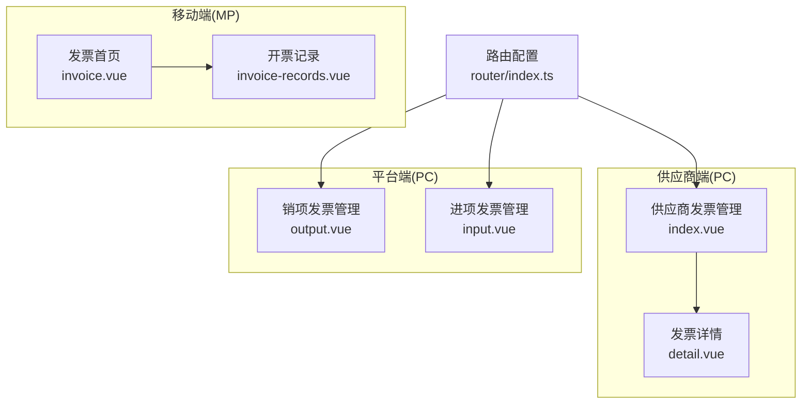
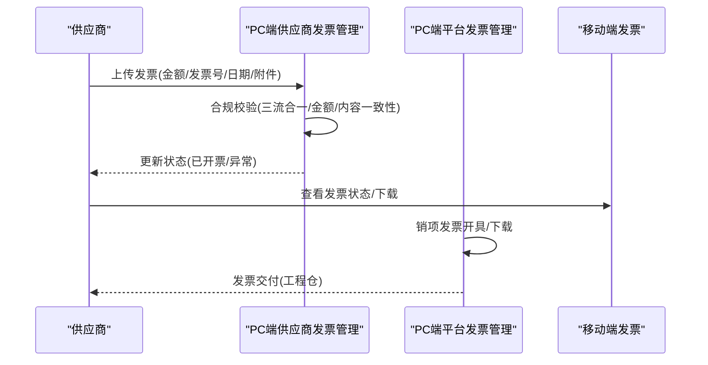
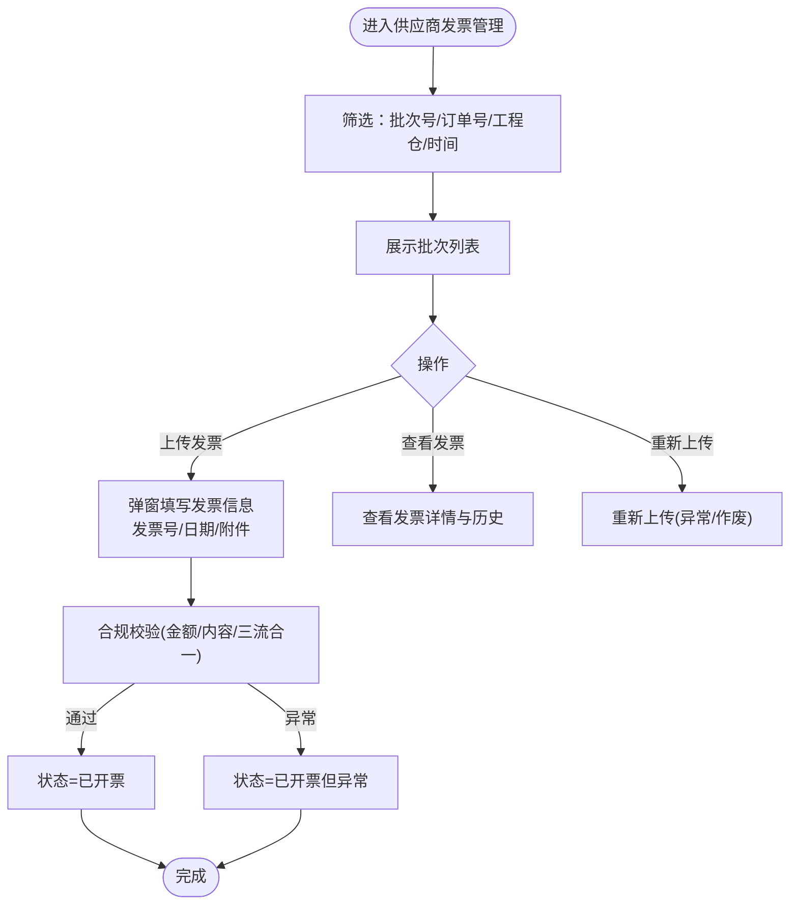
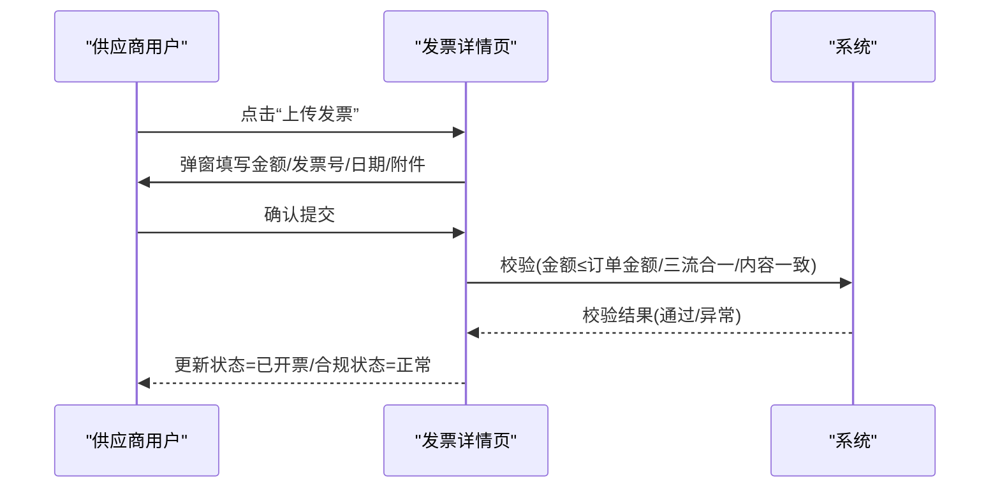
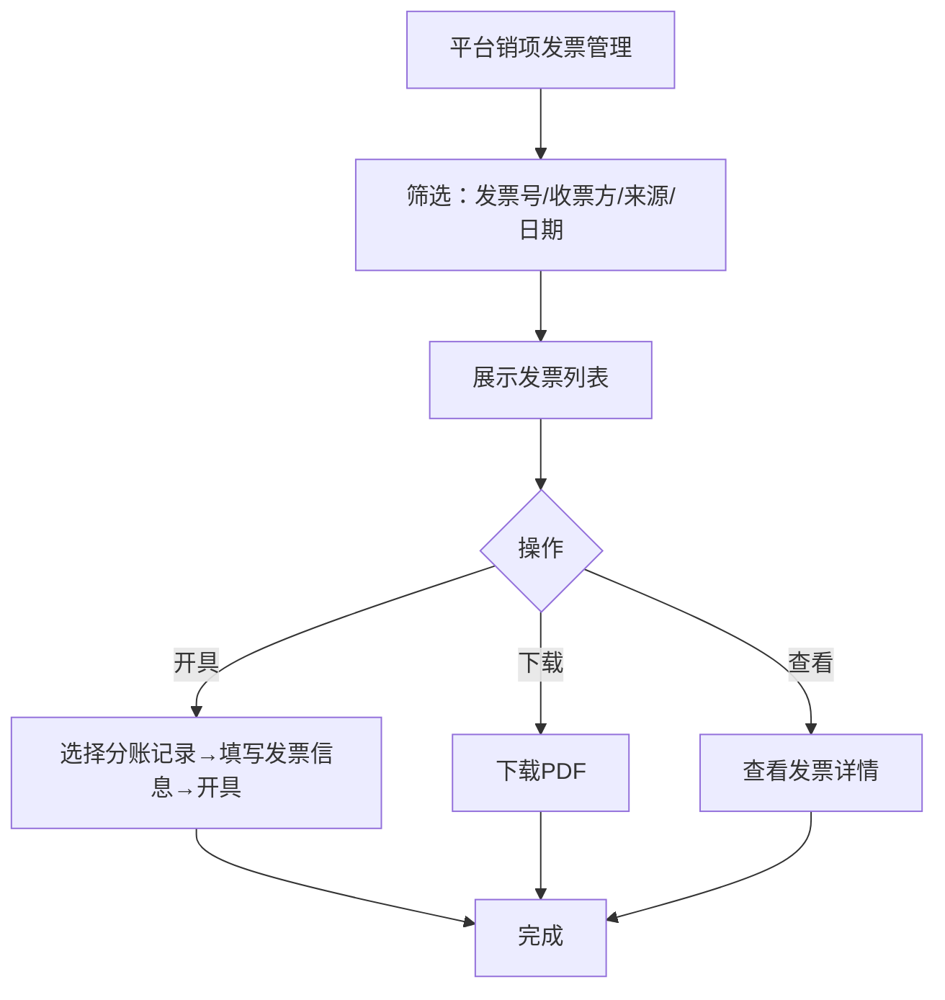
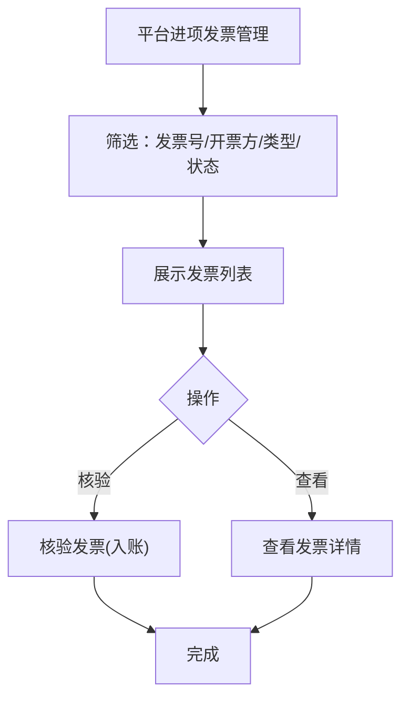
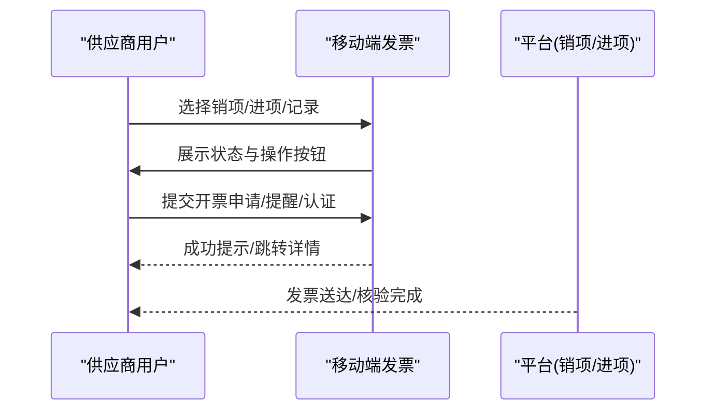
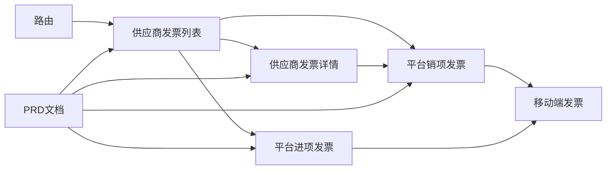
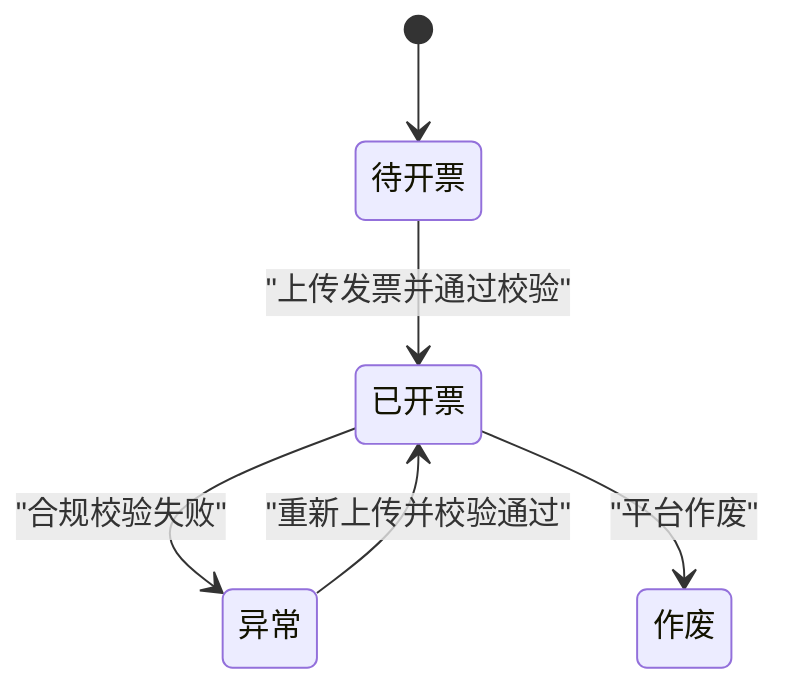

# 供应商发票管理

<cite>
**本文引用的文件**
- [apps/pc/src/views/supplier/finance/invoice/index.vue](file://apps/pc/src/views/supplier/finance/invoice/index.vue)
- [apps/pc/src/views/supplier/finance/invoice/detail.vue](file://apps/pc/src/views/supplier/finance/invoice/detail.vue)
- [apps/pc/src/views/finance/invoice/output.vue](file://apps/pc/src/views/finance/invoice/output.vue)
- [apps/pc/src/views/finance/invoice/input.vue](file://apps/pc/src/views/finance/invoice/input.vue)
- [apps/mp/src/pages/mine/invoice.vue](file://apps/mp/src/pages/mine/invoice.vue)
- [apps/mp/src/pages/mine/invoice-records.vue](file://apps/mp/src/pages/mine/invoice-records.vue)
- [apps/pc/src/router/index.ts](file://apps/pc/src/router/index.ts)
- [docs/供应商端产品PRD.md](file://docs/供应商端产品PRD.md)
- [apps/pc/src/views/finance/invoice/output.vue](file://apps/pc/src/views/finance/invoice/output.vue)
- [apps/pc/src/views/finance/invoice/input.vue](file://apps/pc/src/views/finance/invoice/input.vue)
- [apps/pc/src/views/supplier/finance/invoice/detail.vue](file://apps/pc/src/views/supplier/finance/invoice/detail.vue)
</cite>

## 目录
1. [简介](#简介)
2. [项目结构](#项目结构)
3. [核心组件](#核心组件)
4. [架构总览](#架构总览)
5. [详细组件分析](#详细组件分析)
6. [依赖分析](#依赖分析)
7. [性能考虑](#性能考虑)
8. [故障排查指南](#故障排查指南)
9. [结论](#结论)
10. [附录](#附录)

## 简介
本文件面向“供应商发票管理”功能，系统化阐述从发票开具申请、发票接收处理、发票验证校验到发票查询统计的完整流程；明确发票类型分类、发票信息验证规则、发票状态流转机制以及发票数据存储格式；并提供合规与安全最佳实践，帮助实现合规的发票管理和税务处理。

## 项目结构
围绕供应商发票管理的关键页面与路由如下：
- 供应商端发票管理入口：PC端供应商财务中心“发票管理”
- 发票详情页：支持上传发票、查看历史、关联订单
- 平台端销项发票管理：支持按来源、状态、日期等维度查询
- 平台端进项发票管理：支持发票类型、核验状态等查询
- 移动端发票功能：销项发票、进项发票、开票记录

图表来源
- [apps/pc/src/router/index.ts:480-495](file://apps/pc/src/router/index.ts#L480-L495)
- [apps/pc/src/views/supplier/finance/invoice/index.vue:1-652](file://apps/pc/src/views/supplier/finance/invoice/index.vue#L1-L652)
- [apps/pc/src/views/supplier/finance/invoice/detail.vue:1-354](file://apps/pc/src/views/supplier/finance/invoice/detail.vue#L1-L354)
- [apps/pc/src/views/finance/invoice/output.vue:1-665](file://apps/pc/src/views/finance/invoice/output.vue#L1-L665)
- [apps/pc/src/views/finance/invoice/input.vue:1-294](file://apps/pc/src/views/finance/invoice/input.vue#L1-L294)
- [apps/mp/src/pages/mine/invoice.vue:1-607](file://apps/mp/src/pages/mine/invoice.vue#L1-L607)
- [apps/mp/src/pages/mine/invoice-records.vue:1-383](file://apps/mp/src/pages/mine/invoice-records.vue#L1-L383)

章节来源
- [apps/pc/src/router/index.ts:480-495](file://apps/pc/src/router/index.ts#L480-L495)

## 核心组件
- 供应商发票管理列表页：支持按状态、工程仓、时间筛选，批量查看批次、可开票金额、合规状态，支持上传发票、查看发票、重新上传。
- 供应商发票详情页：展示订单、金额明细、发票附件、操作日志，支持上传发票并触发合规校验。
- 平台销项发票管理：支持来源（工程仓申请/平台手动）、状态、日期等筛选，支持查看、下载、开具。
- 平台进项发票管理：支持发票类型、核验状态筛选，支持查看、核验。
- 移动端发票：支持销项/进项/记录三类视图，状态筛选、搜索、下载等。

章节来源
- [apps/pc/src/views/supplier/finance/invoice/index.vue:1-652](file://apps/pc/src/views/supplier/finance/invoice/index.vue#L1-L652)
- [apps/pc/src/views/supplier/finance/invoice/detail.vue:1-354](file://apps/pc/src/views/supplier/finance/invoice/detail.vue#L1-L354)
- [apps/pc/src/views/finance/invoice/output.vue:1-665](file://apps/pc/src/views/finance/invoice/output.vue#L1-L665)
- [apps/pc/src/views/finance/invoice/input.vue:1-294](file://apps/pc/src/views/finance/invoice/input.vue#L1-L294)
- [apps/mp/src/pages/mine/invoice.vue:1-607](file://apps/mp/src/pages/mine/invoice.vue#L1-L607)
- [apps/mp/src/pages/mine/invoice-records.vue:1-383](file://apps/mp/src/pages/mine/invoice-records.vue#L1-L383)

## 架构总览
供应商发票管理涉及“供应商端-平台端-移动端”的协同：
- 供应商端负责发票上传、合规校验后的状态变更与历史记录维护
- 平台端负责销项发票的开具、下载、核验与统计
- 移动端负责发票状态浏览、提醒与记录查询

图表来源
- [apps/pc/src/views/supplier/finance/invoice/index.vue:556-586](file://apps/pc/src/views/supplier/finance/invoice/index.vue#L556-L586)
- [apps/pc/src/views/supplier/finance/invoice/detail.vue:273-297](file://apps/pc/src/views/supplier/finance/invoice/detail.vue#L273-L297)
- [apps/pc/src/views/finance/invoice/output.vue:446-454](file://apps/pc/src/views/finance/invoice/output.vue#L446-L454)
- [apps/mp/src/pages/mine/invoice.vue:253-299](file://apps/mp/src/pages/mine/invoice.vue#L253-L299)

## 详细组件分析

### 供应商发票管理列表页
- 功能要点
  - 统计与筛选：全部/待开票/已开票/已作废；批次号/订单号/工程仓/时间范围
  - 批次信息：关联订单数、订单总金额、已支付金额、可开票金额、发票抬头、发票号码、申请人、申请时间、状态、合规状态
  - 操作：查看发票、上传发票、重新上传
- 数据模型
  - 批次对象包含批次号、工程仓信息、订单集合、金额汇总、状态、合规状态、发票信息、历史记录等
- 流程
  - 供应商在“待开票”状态下上传发票，系统更新状态为“已开票”，并记录开具历史

图表来源
- [apps/pc/src/views/supplier/finance/invoice/index.vue:15-35](file://apps/pc/src/views/supplier/finance/invoice/index.vue#L15-L35)
- [apps/pc/src/views/supplier/finance/invoice/index.vue:37-124](file://apps/pc/src/views/supplier/finance/invoice/index.vue#L37-L124)
- [apps/pc/src/views/supplier/finance/invoice/index.vue:534-586](file://apps/pc/src/views/supplier/finance/invoice/index.vue#L534-L586)

章节来源
- [apps/pc/src/views/supplier/finance/invoice/index.vue:1-652](file://apps/pc/src/views/supplier/finance/invoice/index.vue#L1-L652)

### 供应商发票详情页
- 功能要点
  - 展示发票信息、金额明细、发票附件、操作日志
  - 支持上传发票，触发合规校验，更新状态与时间
- 流程
  - 供应商点击“上传发票”，填写金额、发票号、开票日期、附件
  - 系统校验后更新状态为“已开票”，合规状态为“正常”

图表来源
- [apps/pc/src/views/supplier/finance/invoice/detail.vue:117-162](file://apps/pc/src/views/supplier/finance/invoice/detail.vue#L117-L162)
- [apps/pc/src/views/supplier/finance/invoice/detail.vue:265-297](file://apps/pc/src/views/supplier/finance/invoice/detail.vue#L265-L297)

章节来源
- [apps/pc/src/views/supplier/finance/invoice/detail.vue:1-354](file://apps/pc/src/views/supplier/finance/invoice/detail.vue#L1-L354)

### 平台销项发票管理
- 功能要点
  - 统计：待开票金额、本月开票金额、税额、开票数
  - 筛选：发票号、收票方、来源(工程仓申请/平台手动)、开票日期
  - 操作：查看、开具、下载
- 数据模型
  - 发票记录包含发票号、来源、收票方、关联分账单号、金额、税额、价税合计、状态、时间等

图表来源
- [apps/pc/src/views/finance/invoice/output.vue:50-86](file://apps/pc/src/views/finance/invoice/output.vue#L50-L86)
- [apps/pc/src/views/finance/invoice/output.vue:154-210](file://apps/pc/src/views/finance/invoice/output.vue#L154-L210)
- [apps/pc/src/views/finance/invoice/output.vue:212-246](file://apps/pc/src/views/finance/invoice/output.vue#L212-L246)
- [apps/pc/src/views/finance/invoice/output.vue:442-454](file://apps/pc/src/views/finance/invoice/output.vue#L442-L454)

章节来源
- [apps/pc/src/views/finance/invoice/output.vue:1-665](file://apps/pc/src/views/finance/invoice/output.vue#L1-L665)

### 平台进项发票管理
- 功能要点
  - 统计：本月进项金额、进项税额、待核验发票、发票总数
  - 筛选：发票号、开票方、发票类型、核验状态
  - 操作：查看、核验
- 数据模型
  - 发票记录包含发票号、发票类型、开票方、金额、税额、价税合计、开票日期、核验状态等

图表来源
- [apps/pc/src/views/finance/invoice/input.vue:33-61](file://apps/pc/src/views/finance/invoice/input.vue#L33-L61)
- [apps/pc/src/views/finance/invoice/input.vue:130-135](file://apps/pc/src/views/finance/invoice/input.vue#L130-L135)
- [apps/pc/src/views/finance/invoice/input.vue:242-248](file://apps/pc/src/views/finance/invoice/input.vue#L242-L248)

章节来源
- [apps/pc/src/views/finance/invoice/input.vue:1-294](file://apps/pc/src/views/finance/invoice/input.vue#L1-L294)

### 移动端发票功能
- 功能要点
  - 销项发票：待开票/开票中/已开票状态切换与操作
  - 进项发票：待收票/已收票/已认证状态切换与操作
  - 开票记录：按月/类型筛选，汇总开票金额与数量
- 流程
  - 供应商在移动端提交开票申请、提醒开票、查看进度、下载发票、认证发票等

图表来源
- [apps/mp/src/pages/mine/invoice.vue:28-93](file://apps/mp/src/pages/mine/invoice.vue#L28-L93)
- [apps/mp/src/pages/mine/invoice.vue:95-159](file://apps/mp/src/pages/mine/invoice.vue#L95-L159)
- [apps/mp/src/pages/mine/invoice.vue:161-201](file://apps/mp/src/pages/mine/invoice.vue#L161-L201)
- [apps/mp/src/pages/mine/invoice.vue:253-299](file://apps/mp/src/pages/mine/invoice.vue#L253-L299)
- [apps/mp/src/pages/mine/invoice-records.vue:1-383](file://apps/mp/src/pages/mine/invoice-records.vue#L1-L383)

章节来源
- [apps/mp/src/pages/mine/invoice.vue:1-607](file://apps/mp/src/pages/mine/invoice.vue#L1-L607)
- [apps/mp/src/pages/mine/invoice-records.vue:1-383](file://apps/mp/src/pages/mine/invoice-records.vue#L1-L383)

## 依赖分析
- 组件耦合
  - 供应商发票管理列表与详情页存在强关联：列表用于批量操作，详情用于单票处理与合规校验
  - 平台销项/进项发票管理与移动端形成闭环：供应商端上传/平台端开具/移动端查看
- 外部依赖
  - 路由层定义供应商发票管理入口与详情页路由
  - PRD文档定义发票三原则与合规校验策略

图表来源
- [apps/pc/src/router/index.ts:480-495](file://apps/pc/src/router/index.ts#L480-L495)
- [apps/pc/src/views/supplier/finance/invoice/index.vue:1-652](file://apps/pc/src/views/supplier/finance/invoice/index.vue#L1-L652)
- [apps/pc/src/views/supplier/finance/invoice/detail.vue:1-354](file://apps/pc/src/views/supplier/finance/invoice/detail.vue#L1-L354)
- [apps/pc/src/views/finance/invoice/output.vue:1-665](file://apps/pc/src/views/finance/invoice/output.vue#L1-L665)
- [apps/pc/src/views/finance/invoice/input.vue:1-294](file://apps/pc/src/views/finance/invoice/input.vue#L1-L294)
- [apps/mp/src/pages/mine/invoice.vue:1-607](file://apps/mp/src/pages/mine/invoice.vue#L1-L607)
- [docs/供应商端产品PRD.md:401-432](file://docs/供应商端产品PRD.md#L401-L432)

章节来源
- [apps/pc/src/router/index.ts:480-495](file://apps/pc/src/router/index.ts#L480-L495)
- [docs/供应商端产品PRD.md:401-432](file://docs/供应商端产品PRD.md#L401-L432)

## 性能考虑
- 列表分页与筛选：使用分页与本地筛选减少渲染压力，避免一次性加载大量数据
- 上传与校验：前端进行基础必填校验，后端执行更严格的合规校验，避免无效请求
- 图片/文件：限制上传数量与格式，控制附件大小，提升下载与预览体验
- 状态缓存：在详情页与列表页之间传递关键状态，减少重复请求

## 故障排查指南
- 上传失败
  - 检查必填项是否完整（发票号、开票日期、金额）
  - 检查金额是否超过可开票金额
  - 检查文件格式与数量限制
- 合规异常
  - 核对三流合一（订单金额、支付金额、开票金额）是否满足容差
  - 核对发票内容与订单商品是否一致
  - 核对发票号码格式是否符合要求
- 状态不一致
  - 检查历史记录与当前状态是否匹配
  - 确认是否存在“已作废”或“重新上传”场景

章节来源
- [apps/pc/src/views/supplier/finance/invoice/detail.vue:273-297](file://apps/pc/src/views/supplier/finance/invoice/detail.vue#L273-L297)
- [apps/pc/src/views/supplier/finance/invoice/index.vue:556-586](file://apps/pc/src/views/supplier/finance/invoice/index.vue#L556-L586)
- [docs/供应商端产品PRD.md:421-432](file://docs/供应商端产品PRD.md#L421-L432)

## 结论
供应商发票管理通过“供应商端上传+平台端开具+移动端查看”的闭环，实现了从发票开具申请到发票查询统计的全流程覆盖。结合三流合一、发票内容一致性与发票号码格式等验证规则，确保发票合规与税务处理的准确性。建议在生产环境中强化后端校验与审计日志，并完善异常处理与回滚机制，以保障业务连续性与合规性。

## 附录

### 发票类型分类标准
- 销项发票：平台向工程仓开具的增值税专用发票/电子发票
- 进项发票：工程仓或供应商提供的增值税专用发票/普通发票/电子发票

章节来源
- [apps/pc/src/views/finance/invoice/output.vue:232-238](file://apps/pc/src/views/finance/invoice/output.vue#L232-L238)
- [apps/pc/src/views/finance/invoice/input.vue:43-48](file://apps/pc/src/views/finance/invoice/input.vue#L43-L48)

### 发票信息验证规则
- 金额规则：开票金额 ≤ 订单金额，可分多次开票
- 内容规则：发票内容 = 订单商品
- 三流合一：订单金额 ≈ 支付金额 ≈ 开票金额（±0.01元容差）
- 发票号码格式：符合税务系统要求

章节来源
- [docs/供应商端产品PRD.md:421-426](file://docs/供应商端产品PRD.md#L421-L426)
- [apps/pc/src/views/supplier/finance/invoice/detail.vue:273-297](file://apps/pc/src/views/supplier/finance/invoice/detail.vue#L273-L297)

### 发票状态流转机制
- 供应商端：待开票 → 已开票（正常/异常），异常可重新上传
- 平台端：待开票 → 已开具（正常/作废），支持下载与查看
- 移动端：销项/进项状态随后端同步更新

图表来源
- [apps/pc/src/views/supplier/finance/invoice/index.vue:534-586](file://apps/pc/src/views/supplier/finance/invoice/index.vue#L534-L586)
- [apps/pc/src/views/finance/invoice/output.vue:442-454](file://apps/pc/src/views/finance/invoice/output.vue#L442-L454)

### 发票数据存储格式
- 供应商发票批次对象：批次号、工程仓、订单集合、金额汇总、状态、合规状态、发票信息、历史记录
- 发票详情对象：订单号、订单类型、金额明细、发票号、发票日期、状态、合规状态、附件URL、创建/更新时间
- 平台销项发票对象：发票号、来源、收票方、关联分账单号、金额/税额/价税合计、状态、时间
- 平台进项发票对象：发票号、发票类型、开票方、金额/税额/价税合计、开票日期、核验状态

章节来源
- [apps/pc/src/views/supplier/finance/invoice/index.vue:290-310](file://apps/pc/src/views/supplier/finance/invoice/index.vue#L290-L310)
- [apps/pc/src/views/supplier/finance/invoice/detail.vue:174-192](file://apps/pc/src/views/supplier/finance/invoice/detail.vue#L174-L192)
- [apps/pc/src/views/finance/invoice/output.vue:342-354](file://apps/pc/src/views/finance/invoice/output.vue#L342-L354)
- [apps/pc/src/views/finance/invoice/input.vue:143-153](file://apps/pc/src/views/finance/invoice/input.vue#L143-L153)