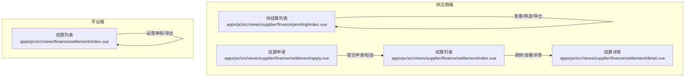
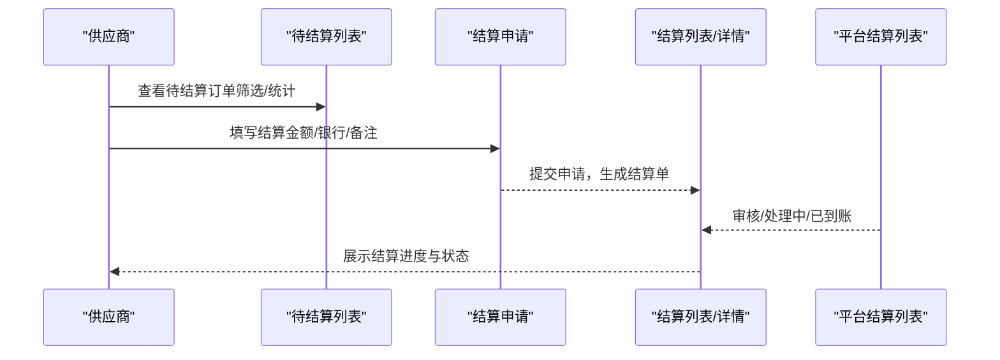
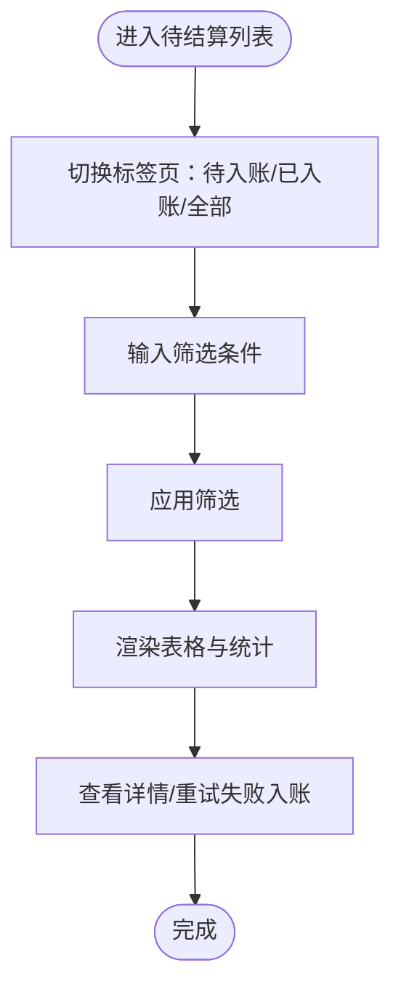
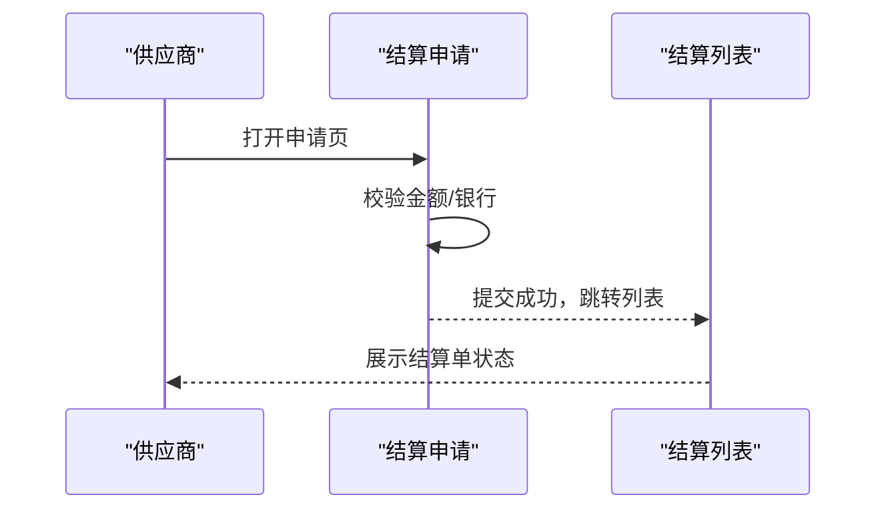
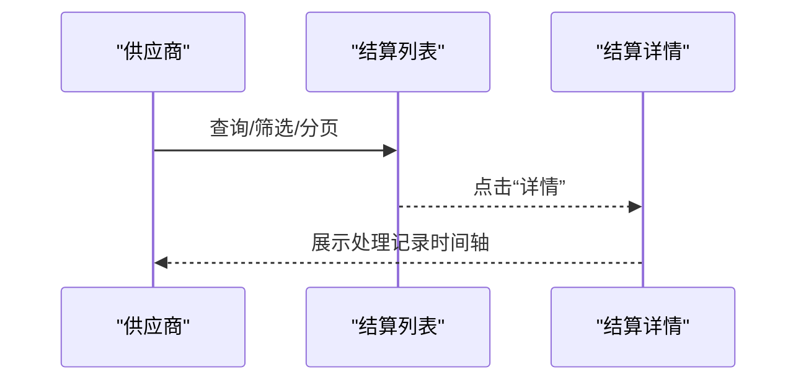
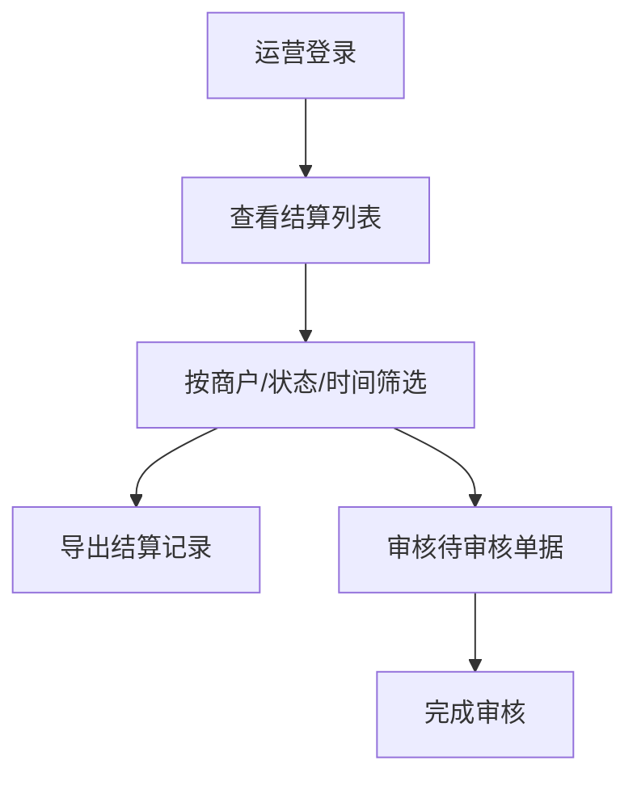

# 供应商待结算管理

<cite>
**本文引用的文件**
- [apps/pc/src/views/supplier/finance/pending/index.vue](file://apps/pc/src/views/supplier/finance/pending/index.vue)
- [apps/pc/src/views/supplier/finance/settlement/index.vue](file://apps/pc/src/views/supplier/finance/settlement/index.vue)
- [apps/pc/src/views/supplier/finance/settlement/apply.vue](file://apps/pc/src/views/supplier/finance/settlement/apply.vue)
- [apps/pc/src/views/supplier/finance/settlement/detail.vue](file://apps/pc/src/views/supplier/finance/settlement/detail.vue)
- [apps/pc/src/views/finance/settlement/index.vue](file://apps/pc/src/views/finance/settlement/index.vue)
- [项目功能排期_按代码实际页面_完整版.csv](file://项目功能排期_按代码实际页面_完整版.csv)
- [供应商端产品PRD.md](file://供应商端产品PRD.md)
</cite>

## 目录
1. [简介](#简介)
2. [项目结构](#项目结构)
3. [核心组件](#核心组件)
4. [架构总览](#架构总览)
5. [详细组件分析](#详细组件分析)
6. [依赖分析](#依赖分析)
7. [性能考虑](#性能考虑)
8. [故障排查指南](#故障排查指南)
9. [结论](#结论)
10. [附录](#附录)

## 简介
本文件围绕“供应商待结算管理”主题，系统化梳理并说明以下能力：
- 待结算订单的筛选与统计
- 结算统计指标的计算与呈现
- 结算提醒与进度跟踪
- 结算申请与审批流程
- 工作流程与可视化展示

目标是帮助供应商高效掌握资金入账节奏，提升结算体验与资金使用效率。

## 项目结构
供应商侧结算相关页面主要位于 PC 端供应商财务模块，包含“待结算列表”“结算申请”“结算列表/详情”等页面；平台侧结算列表用于运营/财务人员进行审核与对账。

图表来源
- [apps/pc/src/views/supplier/finance/pending/index.vue:1-361](file://apps/pc/src/views/supplier/finance/pending/index.vue#L1-L361)
- [apps/pc/src/views/supplier/finance/settlement/apply.vue:1-139](file://apps/pc/src/views/supplier/finance/settlement/apply.vue#L1-L139)
- [apps/pc/src/views/supplier/finance/settlement/index.vue:1-193](file://apps/pc/src/views/supplier/finance/settlement/index.vue#L1-L193)
- [apps/pc/src/views/supplier/finance/settlement/detail.vue:1-121](file://apps/pc/src/views/supplier/finance/settlement/detail.vue#L1-L121)
- [apps/pc/src/views/finance/settlement/index.vue:1-263](file://apps/pc/src/views/finance/settlement/index.vue#L1-L263)

章节来源
- [apps/pc/src/views/supplier/finance/pending/index.vue:1-361](file://apps/pc/src/views/supplier/finance/pending/index.vue#L1-L361)
- [apps/pc/src/views/supplier/finance/settlement/index.vue:1-193](file://apps/pc/src/views/supplier/finance/settlement/index.vue#L1-L193)
- [apps/pc/src/views/supplier/finance/settlement/apply.vue:1-139](file://apps/pc/src/views/supplier/finance/settlement/apply.vue#L1-L139)
- [apps/pc/src/views/supplier/finance/settlement/detail.vue:1-121](file://apps/pc/src/views/supplier/finance/settlement/detail.vue#L1-L121)
- [apps/pc/src/views/finance/settlement/index.vue:1-263](file://apps/pc/src/views/finance/settlement/index.vue#L1-L263)

## 核心组件
- 待结算列表（供应商）
  - 功能要点：统计“待入账金额/笔数”“今日/本月入账”；支持按订单号、采购方、入账状态、时间范围筛选；支持查看详情与重试失败入账。
  - 关键实现位置：[apps/pc/src/views/supplier/finance/pending/index.vue:1-361](file://apps/pc/src/views/supplier/finance/pending/index.vue#L1-L361)

- 结算申请（供应商）
  - 功能要点：展示账户余额、冻结金额、可用结算金额；填写结算金额、选择结算银行、备注；提交后进入结算流程。
  - 关键实现位置：[apps/pc/src/views/supplier/finance/settlement/apply.vue:1-139](file://apps/pc/src/views/supplier/finance/settlement/apply.vue#L1-L139)

- 结算列表/详情（供应商）
  - 功能要点：统计“可结算/结算中/本月已结算”等指标；支持按结算单号、状态、时间筛选；支持查看详情与申请结算。
  - 关键实现位置：
    - [apps/pc/src/views/supplier/finance/settlement/index.vue:1-193](file://apps/pc/src/views/supplier/finance/settlement/index.vue#L1-L193)
    - [apps/pc/src/views/supplier/finance/settlement/detail.vue:1-121](file://apps/pc/src/views/supplier/finance/settlement/detail.vue#L1-L121)

- 结算列表（平台端）
  - 功能要点：运营侧统计“待审核/待审金额”等指标；支持按商户、状态、时间筛选；支持导出与审核。
  - 关键实现位置：[apps/pc/src/views/finance/settlement/index.vue:1-263](file://apps/pc/src/views/finance/settlement/index.vue#L1-L263)

章节来源
- [apps/pc/src/views/supplier/finance/pending/index.vue:13-32](file://apps/pc/src/views/supplier/finance/pending/index.vue#L13-L32)
- [apps/pc/src/views/supplier/finance/settlement/apply.vue:10-19](file://apps/pc/src/views/supplier/finance/settlement/apply.vue#L10-L19)
- [apps/pc/src/views/supplier/finance/settlement/index.vue:4-26](file://apps/pc/src/views/supplier/finance/settlement/index.vue#L4-L26)
- [apps/pc/src/views/finance/settlement/index.vue:13-30](file://apps/pc/src/views/finance/settlement/index.vue#L13-L30)

## 架构总览
从“订单支付—资金入账—结算申请—结算审核—到账”的闭环视角，供应商侧关注“待结算列表”与“结算申请/详情”，平台侧负责“结算审核/导出”。

图表来源
- [apps/pc/src/views/supplier/finance/pending/index.vue:1-361](file://apps/pc/src/views/supplier/finance/pending/index.vue#L1-L361)
- [apps/pc/src/views/supplier/finance/settlement/apply.vue:74-92](file://apps/pc/src/views/supplier/finance/settlement/apply.vue#L74-L92)
- [apps/pc/src/views/supplier/finance/settlement/index.vue:134-167](file://apps/pc/src/views/supplier/finance/settlement/index.vue#L134-L167)
- [apps/pc/src/views/finance/settlement/index.vue:177-236](file://apps/pc/src/views/finance/settlement/index.vue#L177-L236)

## 详细组件分析

### 组件一：待结算列表（供应商）
- 功能职责
  - 统计维度：待入账金额、今日入账、本月入账、待入账笔数
  - 列表字段：订单编号、采购方、入账金额、支付时间、预计入账时间、实际入账时间、入账状态、备注
  - 操作能力：筛选、分页、导出、查看详情、重试失败入账
- 关键逻辑
  - 状态标签颜色与文案映射
  - 超时高亮（预计入账时间早于当前时间）
  - 过滤器：订单号、采购方、状态、时间范围
  - 详情弹窗展示入账进度时间轴
- 优化建议
  - 将“待入账金额/笔数”改为实时计算，避免静态值
  - 增加“预计入账时间”倒计时或提醒
  - 支持批量导出与重试

图表来源
- [apps/pc/src/views/supplier/finance/pending/index.vue:34-114](file://apps/pc/src/views/supplier/finance/pending/index.vue#L34-L114)
- [apps/pc/src/views/supplier/finance/pending/index.vue:237-259](file://apps/pc/src/views/supplier/finance/pending/index.vue#L237-L259)
- [apps/pc/src/views/supplier/finance/pending/index.vue:282-324](file://apps/pc/src/views/supplier/finance/pending/index.vue#L282-L324)

章节来源
- [apps/pc/src/views/supplier/finance/pending/index.vue:1-361](file://apps/pc/src/views/supplier/finance/pending/index.vue#L1-L361)

### 组件二：结算申请（供应商）
- 功能职责
  - 展示账户余额、冻结金额、可用结算金额
  - 输入结算金额（上限为可用金额）、选择结算银行、填写备注
  - 提交申请并跳转至结算列表
- 关键逻辑
  - 表单校验：金额>0、选择银行
  - “全部结算”快捷填充
  - 提交后反馈与路由跳转
- 优化建议
  - 增加可用金额动态计算
  - 支持历史结算银行快速选择
  - 提交前二次确认

图表来源
- [apps/pc/src/views/supplier/finance/settlement/apply.vue:64-92](file://apps/pc/src/views/supplier/finance/settlement/apply.vue#L64-L92)

章节来源
- [apps/pc/src/views/supplier/finance/settlement/apply.vue:1-139](file://apps/pc/src/views/supplier/finance/settlement/apply.vue#L1-L139)

### 组件三：结算列表/详情（供应商）
- 功能职责
  - 统计“可结算/结算中/本月已结算”等指标
  - 支持按结算单号、状态、时间筛选
  - 查看结算详情与处理记录（时间轴）
- 关键逻辑
  - 状态标签颜色与文案映射
  - 分页与总数更新
  - 路由跳转至详情页
- 优化建议
  - 增加“结算提醒”开关与通知渠道
  - 在列表页直接展示预计到账时间
  - 支持导出结算单

图表来源
- [apps/pc/src/views/supplier/finance/settlement/index.vue:134-167](file://apps/pc/src/views/supplier/finance/settlement/index.vue#L134-L167)
- [apps/pc/src/views/supplier/finance/settlement/detail.vue:13-59](file://apps/pc/src/views/supplier/finance/settlement/detail.vue#L13-L59)

章节来源
- [apps/pc/src/views/supplier/finance/settlement/index.vue:1-193](file://apps/pc/src/views/supplier/finance/settlement/index.vue#L1-L193)
- [apps/pc/src/views/supplier/finance/settlement/detail.vue:1-121](file://apps/pc/src/views/supplier/finance/settlement/detail.vue#L1-L121)

### 组件四：平台结算列表（运营侧）
- 功能职责
  - 统计“待审核/待审金额/本月已结算/结算笔数”
  - 支持按商户、状态、时间筛选
  - 导出结算记录与审核操作
- 关键逻辑
  - 状态标签颜色与文案映射
  - 分页与总数更新
  - 审核入口仅在“待审核”状态下显示
- 优化建议
  - 增加批量审核与导出
  - 展示结算单与订单关联关系
  - 增加异常状态的自动提醒

图表来源
- [apps/pc/src/views/finance/settlement/index.vue:177-236](file://apps/pc/src/views/finance/settlement/index.vue#L177-L236)

章节来源
- [apps/pc/src/views/finance/settlement/index.vue:1-263](file://apps/pc/src/views/finance/settlement/index.vue#L1-L263)

## 依赖分析
- 页面依赖关系
  - 供应商端：待结算列表依赖订单支付与入账日志；结算申请依赖账户余额与银行信息；结算列表/详情依赖平台结算状态。
  - 平台端：结算列表依赖运营权限与审核流程。
- 数据耦合点
  - 待结算金额/笔数来源于订单支付与入账状态
  - 可用结算金额来源于账户余额与冻结金额
  - 结算状态来源于平台审核与银行到账

图表来源
- [apps/pc/src/views/supplier/finance/pending/index.vue:1-361](file://apps/pc/src/views/supplier/finance/pending/index.vue#L1-L361)
- [apps/pc/src/views/supplier/finance/settlement/apply.vue:1-139](file://apps/pc/src/views/supplier/finance/settlement/apply.vue#L1-L139)
- [apps/pc/src/views/supplier/finance/settlement/index.vue:1-193](file://apps/pc/src/views/supplier/finance/settlement/index.vue#L1-L193)
- [apps/pc/src/views/finance/settlement/index.vue:1-263](file://apps/pc/src/views/finance/settlement/index.vue#L1-L263)

## 性能考虑
- 列表渲染
  - 使用分页与虚拟滚动（如数据量增大）降低首屏压力
  - 筛选器采用防抖与本地过滤，避免频繁重绘
- 状态更新
  - 待结算金额/笔数建议采用定时刷新或事件驱动更新，减少手动刷新
- 导出能力
  - 大数据量导出建议异步任务与进度提示，避免阻塞 UI

## 故障排查指南
- 待结算列表
  - 现象：预计入账时间早于当前时间未高亮
  - 排查：检查时间格式与比较逻辑
  - 参考路径：[apps/pc/src/views/supplier/finance/pending/index.vue:282-285](file://apps/pc/src/views/supplier/finance/pending/index.vue#L282-L285)
- 结算申请
  - 现象：提交后未跳转或提示异常
  - 排查：检查表单校验、提交状态与路由跳转
  - 参考路径：[apps/pc/src/views/supplier/finance/settlement/apply.vue:74-92](file://apps/pc/src/views/supplier/finance/settlement/apply.vue#L74-L92)
- 结算列表/详情
  - 现象：状态标签颜色与文案不一致
  - 排查：核对状态映射表
  - 参考路径：
    - [apps/pc/src/views/supplier/finance/settlement/index.vue:114-132](file://apps/pc/src/views/supplier/finance/settlement/index.vue#L114-L132)
    - [apps/pc/src/views/finance/settlement/index.vue:153-175](file://apps/pc/src/views/finance/settlement/index.vue#L153-L175)
- 平台结算列表
  - 现象：导出为空或无数据
  - 排查：确认筛选条件与数据源
  - 参考路径：[apps/pc/src/views/finance/settlement/index.vue:230-236](file://apps/pc/src/views/finance/settlement/index.vue#L230-L236)

章节来源
- [apps/pc/src/views/supplier/finance/pending/index.vue:282-285](file://apps/pc/src/views/supplier/finance/pending/index.vue#L282-L285)
- [apps/pc/src/views/supplier/finance/settlement/apply.vue:74-92](file://apps/pc/src/views/supplier/finance/settlement/apply.vue#L74-L92)
- [apps/pc/src/views/supplier/finance/settlement/index.vue:114-132](file://apps/pc/src/views/supplier/finance/settlement/index.vue#L114-L132)
- [apps/pc/src/views/finance/settlement/index.vue:230-236](file://apps/pc/src/views/finance/settlement/index.vue#L230-L236)

## 结论
供应商待结算管理以“待结算列表”为核心入口，串联“结算申请/详情”与“平台结算审核”。通过清晰的状态与统计指标、完善的筛选与导出能力、以及可视化的进度展示，帮助供应商掌握资金入账节奏，提升结算效率与体验。后续可在可用金额动态计算、结算提醒、批量操作等方面持续优化。

## 附录
- 功能排期参考
  - 供应商端“待结算列表”“结算管理”“对账列表”“支付流水”等页面均已纳入排期
  - 参考路径：[项目功能排期_按代码实际页面_完整版.csv:94-105](file://项目功能排期_按代码实际页面_完整版.csv#L94-L105)
- 业务背景参考
  - 订单全链路包含“结算开票”环节，待结算管理承接该环节的前端交互
  - 参考路径：[供应商端产品PRD.md:132-159](file://供应商端产品PRD.md#L132-L159)