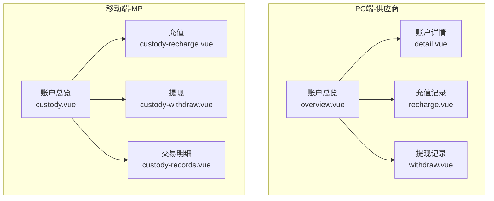
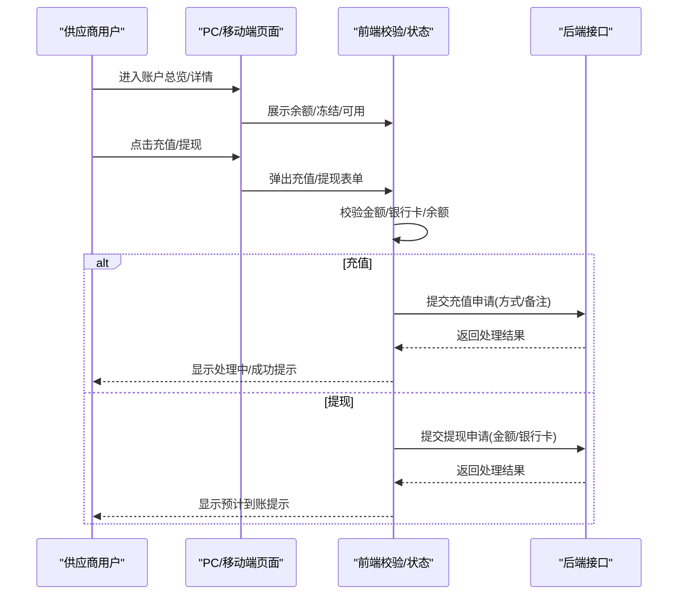
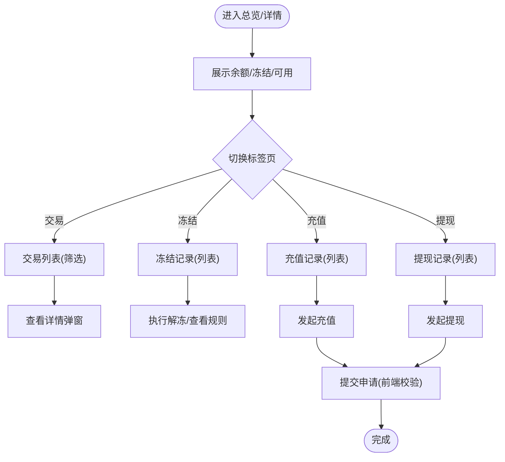
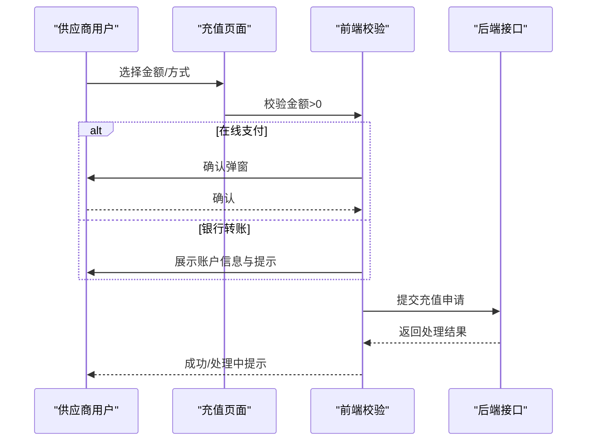
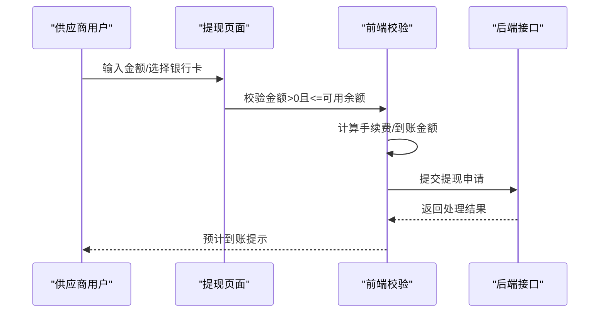
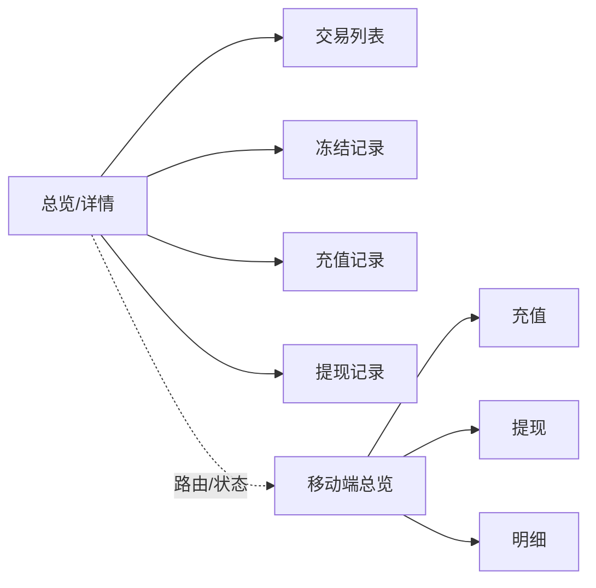

# 供应商托管账户管理

<cite>
**本文档引用的文件**
- [apps/pc/src/views/supplier/finance/custody/overview.vue](file://apps/pc/src/views/supplier/finance/custody/overview.vue)
- [apps/pc/src/views/supplier/finance/custody/detail.vue](file://apps/pc/src/views/supplier/finance/custody/detail.vue)
- [apps/pc/src/views/supplier/finance/custody/recharge.vue](file://apps/pc/src/views/supplier/finance/custody/recharge.vue)
- [apps/pc/src/views/supplier/finance/custody/withdraw.vue](file://apps/pc/src/views/supplier/finance/custody/withdraw.vue)
- [apps/pc/src/views/warehouse/finance/custody/overview.vue](file://apps/pc/src/views/warehouse/finance/custody/overview.vue)
- [apps/mp/src/pages/mine/custody.vue](file://apps/mp/src/pages/mine/custody.vue)
- [apps/mp/src/pages/mine/custody-recharge.vue](file://apps/mp/src/pages/mine/custody-recharge.vue)
- [apps/mp/src/pages/mine/custody-withdraw.vue](file://apps/mp/src/pages/mine/custody-withdraw.vue)
- [apps/mp/src/pages/mine/custody-records.vue](file://apps/mp/src/pages/mine/custody-records.vue)
</cite>

## 目录
1. [简介](#简介)
2. [项目结构](#项目结构)
3. [核心组件](#核心组件)
4. [架构总览](#架构总览)
5. [详细组件分析](#详细组件分析)
6. [依赖关系分析](#依赖关系分析)
7. [性能考虑](#性能考虑)
8. [故障排除指南](#故障排除指南)
9. [结论](#结论)
10. [附录](#附录)

## 简介
本文件面向供应商端的第三方资金托管账户管理功能，系统性阐述托管账户总览、资金明细查询、资金充值与提现等核心能力，并结合前端页面实现，给出安全机制、资金冻结解冻规则、资金划转流程与风控要点的说明。文档同时提供操作流程图与代码示例路径，帮助开发者与运营人员理解并实施安全合规的资金管理。

## 项目结构
供应商托管账户相关页面主要分布在 PC 端与移动端两套界面中：
- PC 端供应商金融模块包含账户总览、交易明细、充值记录、提现记录等页面
- 移动端“我的”页面提供余额、明细、充值、提现等轻量入口
- 工程仓端亦有类似布局，便于多角色协同

图表来源
- [apps/pc/src/views/supplier/finance/custody/overview.vue:1-667](file://apps/pc/src/views/supplier/finance/custody/overview.vue#L1-L667)
- [apps/pc/src/views/supplier/finance/custody/detail.vue:1-594](file://apps/pc/src/views/supplier/finance/custody/detail.vue#L1-L594)
- [apps/pc/src/views/supplier/finance/custody/recharge.vue:1-268](file://apps/pc/src/views/supplier/finance/custody/recharge.vue#L1-L268)
- [apps/pc/src/views/supplier/finance/custody/withdraw.vue:1-310](file://apps/pc/src/views/supplier/finance/custody/withdraw.vue#L1-L310)
- [apps/mp/src/pages/mine/custody.vue:1-265](file://apps/mp/src/pages/mine/custody.vue#L1-L265)
- [apps/mp/src/pages/mine/custody-recharge.vue:1-444](file://apps/mp/src/pages/mine/custody-recharge.vue#L1-L444)
- [apps/mp/src/pages/mine/custody-withdraw.vue:1-375](file://apps/mp/src/pages/mine/custody-withdraw.vue#L1-L375)
- [apps/mp/src/pages/mine/custody-records.vue:1-418](file://apps/mp/src/pages/mine/custody-records.vue#L1-L418)

章节来源
- [apps/pc/src/views/supplier/finance/custody/overview.vue:1-667](file://apps/pc/src/views/supplier/finance/custody/overview.vue#L1-L667)
- [apps/pc/src/views/supplier/finance/custody/detail.vue:1-594](file://apps/pc/src/views/supplier/finance/custody/detail.vue#L1-L594)
- [apps/pc/src/views/supplier/finance/custody/recharge.vue:1-268](file://apps/pc/src/views/supplier/finance/custody/recharge.vue#L1-L268)
- [apps/pc/src/views/supplier/finance/custody/withdraw.vue:1-310](file://apps/pc/src/views/supplier/finance/custody/withdraw.vue#L1-L310)
- [apps/mp/src/pages/mine/custody.vue:1-265](file://apps/mp/src/pages/mine/custody.vue#L1-L265)
- [apps/mp/src/pages/mine/custody-recharge.vue:1-444](file://apps/mp/src/pages/mine/custody-recharge.vue#L1-L444)
- [apps/mp/src/pages/mine/custody-withdraw.vue:1-375](file://apps/mp/src/pages/mine/custody-withdraw.vue#L1-L375)
- [apps/mp/src/pages/mine/custody-records.vue:1-418](file://apps/mp/src/pages/mine/custody-records.vue#L1-L418)

## 核心组件
- 账户总览卡片：展示账户余额、冻结金额、可用余额、账户信息与统计指标
- 交易明细表格：支持按类型、时间筛选，展示收入/支出/充值/提现/冻结/解冻等流水
- 充值记录：支持按单号、方式、状态、时间筛选，展示到账情况
- 提现记录：支持按单号、银行、状态、时间筛选，展示手续费、到账金额与到帐时间
- 充值/提现弹窗：输入金额、选择方式/银行卡、提交申请
- 交易详情弹窗：展示流水号、状态、余额、备注等

章节来源
- [apps/pc/src/views/supplier/finance/custody/overview.vue:1-667](file://apps/pc/src/views/supplier/finance/custody/overview.vue#L1-L667)
- [apps/pc/src/views/supplier/finance/custody/detail.vue:1-594](file://apps/pc/src/views/supplier/finance/custody/detail.vue#L1-L594)
- [apps/pc/src/views/supplier/finance/custody/recharge.vue:1-268](file://apps/pc/src/views/supplier/finance/custody/recharge.vue#L1-L268)
- [apps/pc/src/views/supplier/finance/custody/withdraw.vue:1-310](file://apps/pc/src/views/supplier/finance/custody/withdraw.vue#L1-L310)

## 架构总览
供应商端托管账户采用“前端页面+本地状态模拟”的实现模式，页面通过表单校验、弹窗交互与路由跳转完成用户操作闭环；充值/提现流程在前端完成基础校验与提示，后续对接后端接口完成资金处理。

图表来源
- [apps/pc/src/views/supplier/finance/custody/overview.vue:466-537](file://apps/pc/src/views/supplier/finance/custody/overview.vue#L466-L537)
- [apps/pc/src/views/supplier/finance/custody/detail.vue:469-498](file://apps/pc/src/views/supplier/finance/custody/detail.vue#L469-L498)
- [apps/pc/src/views/supplier/finance/custody/recharge.vue:229-236](file://apps/pc/src/views/supplier/finance/custody/recharge.vue#L229-L236)
- [apps/pc/src/views/supplier/finance/custody/withdraw.vue:248-259](file://apps/pc/src/views/supplier/finance/custody/withdraw.vue#L248-L259)
- [apps/mp/src/pages/mine/custody-recharge.vue:141-173](file://apps/mp/src/pages/mine/custody-recharge.vue#L141-L173)
- [apps/mp/src/pages/mine/custody-withdraw.vue:102-138](file://apps/mp/src/pages/mine/custody-withdraw.vue#L102-L138)

## 详细组件分析

### 账户总览与详情
- 功能要点
  - 展示账户余额、冻结金额、可用余额与账户信息
  - 提供交易明细、冻结记录、充值记录、提现记录的分页与筛选
  - 支持交易详情弹窗查看流水号、状态、余额、备注等
- 关键交互
  - 充值/提现按钮触发对应弹窗
  - 交易列表支持按类型与时间范围筛选
  - 冻结记录展示冻结/解冻状态与预计解冻时间

图表来源
- [apps/pc/src/views/supplier/finance/custody/overview.vue:87-238](file://apps/pc/src/views/supplier/finance/custody/overview.vue#L87-L238)
- [apps/pc/src/views/supplier/finance/custody/detail.vue:87-239](file://apps/pc/src/views/supplier/finance/custody/detail.vue#L87-L239)

章节来源
- [apps/pc/src/views/supplier/finance/custody/overview.vue:1-667](file://apps/pc/src/views/supplier/finance/custody/overview.vue#L1-L667)
- [apps/pc/src/views/supplier/finance/custody/detail.vue:1-594](file://apps/pc/src/views/supplier/finance/custody/detail.vue#L1-L594)

### 充值流程
- 功能要点
  - 支持银行转账与在线支付两种方式
  - 银行转账时展示对公账户信息与到账提示
  - 在线支付即时到账
  - 充值记录支持按单号、方式、状态、时间筛选
- 前端校验
  - 金额必须大于0
  - 在线支付时二次确认
  - 银行转账时引导核对账户与备注

图表来源
- [apps/pc/src/views/supplier/finance/custody/recharge.vue:94-131](file://apps/pc/src/views/supplier/finance/custody/recharge.vue#L94-L131)
- [apps/pc/src/views/supplier/finance/custody/recharge.vue:190-236](file://apps/pc/src/views/supplier/finance/custody/recharge.vue#L190-L236)
- [apps/mp/src/pages/mine/custody-recharge.vue:141-173](file://apps/mp/src/pages/mine/custody-recharge.vue#L141-L173)

章节来源
- [apps/pc/src/views/supplier/finance/custody/recharge.vue:1-268](file://apps/pc/src/views/supplier/finance/custody/recharge.vue#L1-L268)
- [apps/mp/src/pages/mine/custody-recharge.vue:1-444](file://apps/mp/src/pages/mine/custody-recharge.vue#L1-L444)

### 提现流程
- 功能要点
  - 可提现余额显示，支持“全部”提取
  - 选择绑定的银行卡，展示手续费与到账金额计算
  - 提现记录支持按单号、银行、状态、时间筛选
- 前端校验
  - 金额必须大于0且不超过可用余额
  - 必须选择银行卡
  - 提现说明包含到账时效、限额、手续费等

图表来源
- [apps/pc/src/views/supplier/finance/custody/withdraw.vue:101-147](file://apps/pc/src/views/supplier/finance/custody/withdraw.vue#L101-L147)
- [apps/pc/src/views/supplier/finance/custody/withdraw.vue:206-259](file://apps/pc/src/views/supplier/finance/custody/withdraw.vue#L206-L259)
- [apps/mp/src/pages/mine/custody-withdraw.vue:102-138](file://apps/mp/src/pages/mine/custody-withdraw.vue#L102-L138)

章节来源
- [apps/pc/src/views/supplier/finance/custody/withdraw.vue:1-310](file://apps/pc/src/views/supplier/finance/custody/withdraw.vue#L1-L310)
- [apps/mp/src/pages/mine/custody-withdraw.vue:1-375](file://apps/mp/src/pages/mine/custody-withdraw.vue#L1-L375)

### 资金明细查询
- 功能要点
  - 支持按交易类型（收入/支出/充值/提现/冻结/解冻）筛选
  - 支持按时间范围筛选
  - 展示交易说明、关联订单、余额、状态与操作
- 数据来源
  - 页面内置示例数据，实际项目应接入后端接口

章节来源
- [apps/pc/src/views/supplier/finance/custody/overview.vue:87-238](file://apps/pc/src/views/supplier/finance/custody/overview.vue#L87-L238)
- [apps/pc/src/views/supplier/finance/custody/detail.vue:87-239](file://apps/pc/src/views/supplier/finance/custody/detail.vue#L87-L239)
- [apps/mp/src/pages/mine/custody-records.vue:1-418](file://apps/mp/src/pages/mine/custody-records.vue#L1-L418)

### 资金冻结与解冻规则
- 规则说明
  - 订单支付后资金冻结，订单完成后自动解冻
  - 冻结记录展示冻结/解冻状态与预计解冻时间
  - 工程仓端页面明确提示“订单支付后资金冻结，订单完成后自动解冻”
- 实施建议
  - 前端展示冻结原因与关联订单，便于供应商追溯
  - 解冻后余额更新需同步刷新

章节来源
- [apps/pc/src/views/warehouse/finance/custody/overview.vue:24-26](file://apps/pc/src/views/warehouse/finance/custody/overview.vue#L24-L26)
- [apps/pc/src/views/warehouse/finance/custody/overview.vue:109-135](file://apps/pc/src/views/warehouse/finance/custody/overview.vue#L109-L135)

### 资金划转流程
- 流程概述
  - 充值：银行转账/在线支付 → 平台入账 → 更新余额
  - 提现：提交申请 → 审核/处理中 → 银行到账 → 更新余额
  - 冻结/解冻：订单触发冻结 → 订单完成/规则满足解冻 → 自动释放
- 前端职责
  - 表单校验、金额计算、弹窗提示
  - 列表筛选与分页、详情弹窗展示

章节来源
- [apps/pc/src/views/supplier/finance/custody/recharge.vue:229-236](file://apps/pc/src/views/supplier/finance/custody/recharge.vue#L229-L236)
- [apps/pc/src/views/supplier/finance/custody/withdraw.vue:248-259](file://apps/pc/src/views/supplier/finance/custody/withdraw.vue#L248-L259)
- [apps/pc/src/views/warehouse/finance/custody/overview.vue:226-230](file://apps/pc/src/views/warehouse/finance/custody/overview.vue#L226-L230)

### 安全机制与风控措施
- 安全机制
  - 金额校验：充值/提现均要求金额大于0
  - 可用余额控制：提现金额不得超过可用余额
  - 银行卡选择：提现必须选择已绑定银行卡
  - 在线支付二次确认：避免误操作
- 风控措施
  - 冻结规则：订单支付后冻结，订单完成后自动解冻
  - 到账时效：银行转账1-3个工作日，线上支付即时到账
  - 提现限额与手续费：页面展示说明，实际以后端策略为准

章节来源
- [apps/pc/src/views/supplier/finance/custody/recharge.vue:229-236](file://apps/pc/src/views/supplier/finance/custody/recharge.vue#L229-L236)
- [apps/pc/src/views/supplier/finance/custody/withdraw.vue:248-259](file://apps/pc/src/views/supplier/finance/custody/withdraw.vue#L248-L259)
- [apps/mp/src/pages/mine/custody-withdraw.vue:102-138](file://apps/mp/src/pages/mine/custody-withdraw.vue#L102-L138)
- [apps/pc/src/views/warehouse/finance/custody/overview.vue:24-26](file://apps/pc/src/views/warehouse/finance/custody/overview.vue#L24-L26)

## 依赖关系分析
- 组件耦合
  - 总览与详情页面共享交易、冻结、充值、提现等数据结构
  - 移动端与PC端页面在功能上高度一致，但交互形态不同
- 外部依赖
  - UI库：Arco Design（PC端）
  - 小程序框架：uni-app（移动端）
- 数据流
  - 页面通过本地状态维护交易列表、充值/提现表单
  - 实际项目中应替换为后端接口调用

图表来源
- [apps/pc/src/views/supplier/finance/custody/overview.vue:87-238](file://apps/pc/src/views/supplier/finance/custody/overview.vue#L87-L238)
- [apps/pc/src/views/supplier/finance/custody/detail.vue:87-239](file://apps/pc/src/views/supplier/finance/custody/detail.vue#L87-L239)
- [apps/mp/src/pages/mine/custody.vue:1-265](file://apps/mp/src/pages/mine/custody.vue#L1-L265)

章节来源
- [apps/pc/src/views/supplier/finance/custody/overview.vue:1-667](file://apps/pc/src/views/supplier/finance/custody/overview.vue#L1-L667)
- [apps/pc/src/views/supplier/finance/custody/detail.vue:1-594](file://apps/pc/src/views/supplier/finance/custody/detail.vue#L1-L594)
- [apps/mp/src/pages/mine/custody.vue:1-265](file://apps/mp/src/pages/mine/custody.vue#L1-L265)

## 性能考虑
- 列表渲染
  - 使用虚拟滚动或分页加载大量交易记录
  - 对高频筛选场景，建议前端缓存过滤结果
- 图标与样式
  - 使用简洁图标与轻量样式，减少首屏渲染压力
- 交互反馈
  - 提交前进行本地校验，减少无效请求
  - 加载状态与错误提示优化用户体验

## 故障排除指南
- 常见问题
  - 充值金额为0或负数：前端会提示“请输入正确的充值金额”
  - 提现金额超过可用余额：提示“提现金额超出可提现余额”
  - 未选择银行卡：提示“请选择提现账户”
  - 银行转账未到账：检查账户信息与备注是否正确
- 排查步骤
  - 确认页面状态与筛选条件
  - 检查网络状态与后端返回
  - 查看交易/提现记录状态变化

章节来源
- [apps/pc/src/views/supplier/finance/custody/recharge.vue:229-236](file://apps/pc/src/views/supplier/finance/custody/recharge.vue#L229-L236)
- [apps/pc/src/views/supplier/finance/custody/withdraw.vue:248-259](file://apps/pc/src/views/supplier/finance/custody/withdraw.vue#L248-L259)
- [apps/mp/src/pages/mine/custody-withdraw.vue:102-138](file://apps/mp/src/pages/mine/custody-withdraw.vue#L102-L138)

## 结论
供应商托管账户管理在前端实现了从总览到明细、从充值到提现的完整闭环，配合冻结/解冻规则与风控提示，能够满足日常财务操作与合规要求。建议在实际项目中将页面中的示例数据替换为真实接口调用，并完善后端审计与风控策略，确保资金安全与账务准确。

## 附录
- 代码示例路径
  - [账户总览与详情:1-667](file://apps/pc/src/views/supplier/finance/custody/overview.vue#L1-L667)
  - [充值记录与弹窗:1-268](file://apps/pc/src/views/supplier/finance/custody/recharge.vue#L1-L268)
  - [提现记录与弹窗:1-310](file://apps/pc/src/views/supplier/finance/custody/withdraw.vue#L1-L310)
  - [移动端总览/明细/充值/提现:1-265](file://apps/mp/src/pages/mine/custody.vue#L1-L265)
  - [移动端明细:1-418](file://apps/mp/src/pages/mine/custody-records.vue#L1-L418)
  - [移动端充值:1-444](file://apps/mp/src/pages/mine/custody-recharge.vue#L1-L444)
  - [移动端提现:1-375](file://apps/mp/src/pages/mine/custody-withdraw.vue#L1-L375)