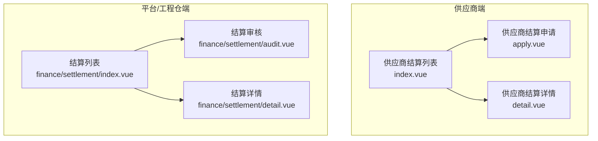
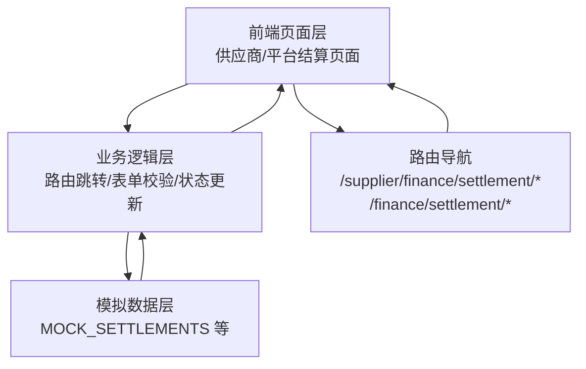
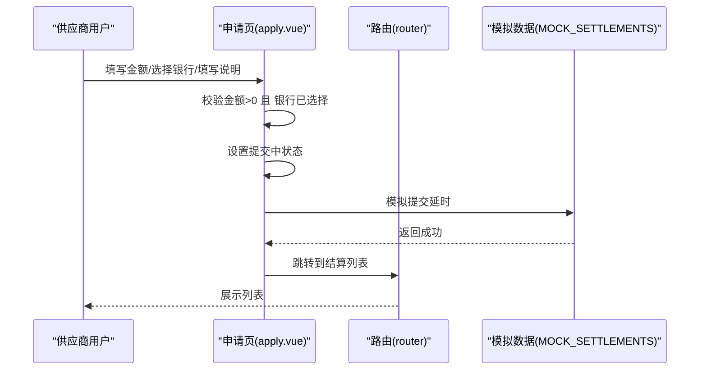
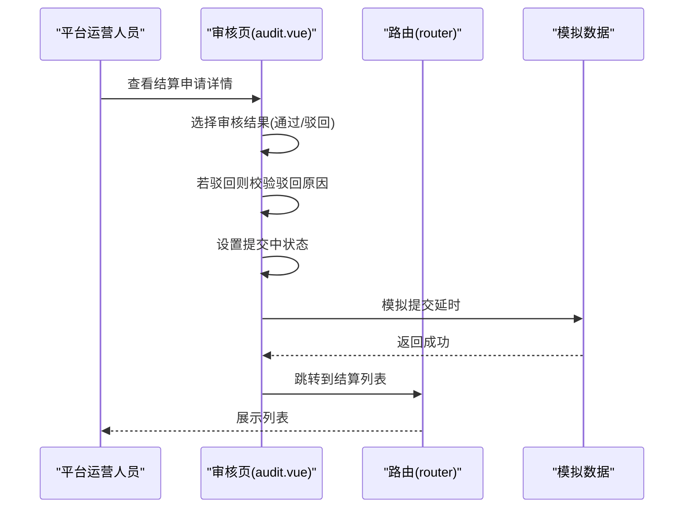
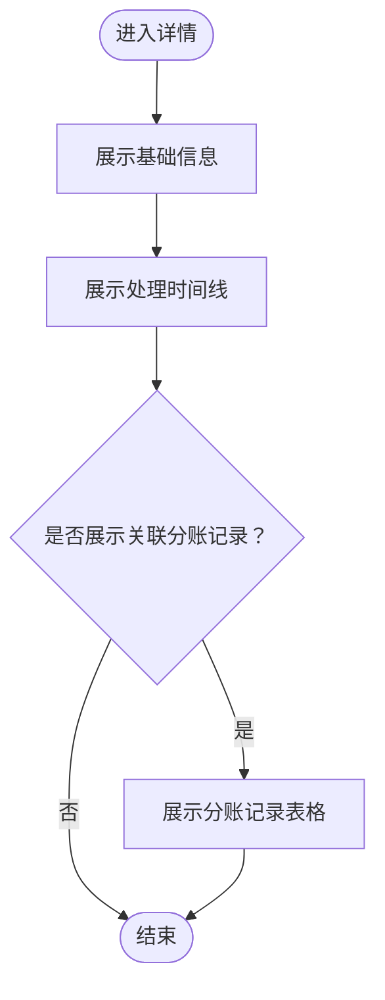
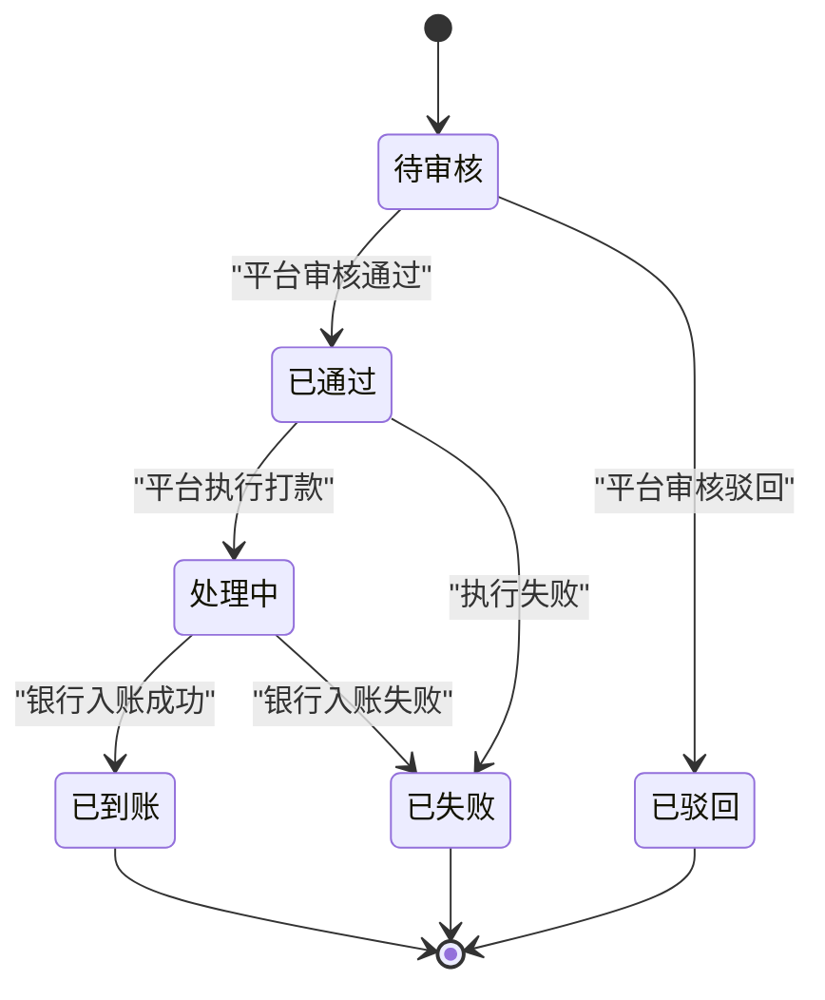
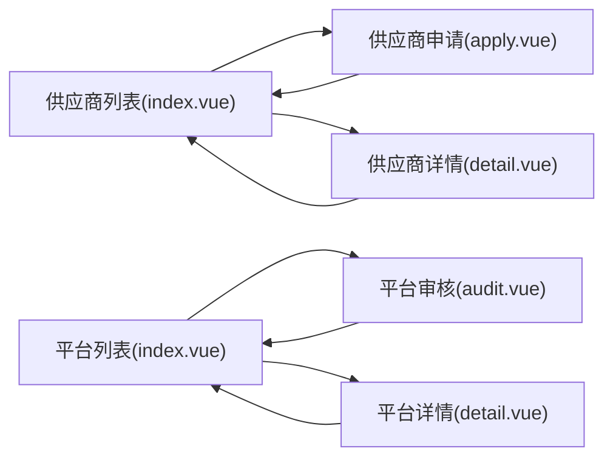

# 供应商结算管理

<cite>
**本文引用的文件**
- [apps/pc/src/views/supplier/finance/settlement/index.vue](file://apps/pc/src/views/supplier/finance/settlement/index.vue)
- [apps/pc/src/views/supplier/finance/settlement/apply.vue](file://apps/pc/src/views/supplier/finance/settlement/apply.vue)
- [apps/pc/src/views/supplier/finance/settlement/detail.vue](file://apps/pc/src/views/supplier/finance/settlement/detail.vue)
- [apps/pc/src/views/finance/settlement/audit.vue](file://apps/pc/src/views/finance/settlement/audit.vue)
- [apps/pc/src/views/finance/settlement/index.vue](file://apps/pc/src/views/finance/settlement/index.vue)
- [apps/pc/src/views/finance/settlement/detail.vue](file://apps/pc/src/views/finance/settlement/detail.vue)
- [packages/api/src/mock/supplier.ts](file://packages/api/src/mock/supplier.ts)
- [docs/PRD/02-业务流程设计.md](file://docs/PRD/02-业务流程设计.md)
- [docs/PRD/03-数据模型与表结构.md](file://docs/PRD/03-数据模型与表结构.md)
</cite>

## 目录
1. [简介](#简介)
2. [项目结构](#项目结构)
3. [核心组件](#核心组件)
4. [架构总览](#架构总览)
5. [详细组件分析](#详细组件分析)
6. [依赖分析](#依赖分析)
7. [性能考虑](#性能考虑)
8. [故障排查指南](#故障排查指南)
9. [结论](#结论)
10. [附录](#附录)

## 简介
本文件面向“供应商结算管理”功能，系统化梳理从“结算申请提交、结算审核、结算执行、结算记录查询”到“结算状态跟踪”的完整实现与最佳实践。文档结合前端页面与模拟数据，给出结算规则计算思路、结算周期设定建议、金额确认机制与状态机图，并提供异常场景处理指引，帮助开发者快速理解并扩展该功能。

## 项目结构
供应商结算管理涉及两类视图：
- 供应商视角：申请结算、查看结算列表、查看详情
- 平台/工程仓视角：结算审核、结算列表、结算详情

图表来源
- [apps/pc/src/views/supplier/finance/settlement/index.vue:1-193](file://apps/pc/src/views/supplier/finance/settlement/index.vue#L1-L193)
- [apps/pc/src/views/supplier/finance/settlement/apply.vue:1-139](file://apps/pc/src/views/supplier/finance/settlement/apply.vue#L1-L139)
- [apps/pc/src/views/supplier/finance/settlement/detail.vue:1-121](file://apps/pc/src/views/supplier/finance/settlement/detail.vue#L1-L121)
- [apps/pc/src/views/finance/settlement/index.vue:1-263](file://apps/pc/src/views/finance/settlement/index.vue#L1-L263)
- [apps/pc/src/views/finance/settlement/audit.vue:1-168](file://apps/pc/src/views/finance/settlement/audit.vue#L1-L168)
- [apps/pc/src/views/finance/settlement/detail.vue:1-159](file://apps/pc/src/views/finance/settlement/detail.vue#L1-L159)

章节来源
- [apps/pc/src/views/supplier/finance/settlement/index.vue:1-193](file://apps/pc/src/views/supplier/finance/settlement/index.vue#L1-L193)
- [apps/pc/src/views/finance/settlement/index.vue:1-263](file://apps/pc/src/views/finance/settlement/index.vue#L1-L263)

## 核心组件
- 供应商结算列表页：展示可结算金额、结算中金额、本月已结算等统计；支持按结算单号、状态、申请时间筛选；支持跳转至申请与详情。
- 供应商结算申请页：展示账户余额、冻结金额、可用余额；输入结算金额、选择结算银行、填写说明；提交后跳转至列表。
- 供应商结算详情页：展示结算单基础信息与处理时间线；展示关联分账记录。
- 平台结算审核页：展示结算申请信息、账户信息、近期交易流水；支持审核通过/驳回，填写驳回原因与备注。
- 平台结算列表页：展示所有商户的结算记录，支持导出、分页、筛选、跳转审核与详情。
- 平台结算详情页：展示结算单基础信息、处理时间线、关联分账记录。
- 模拟数据：提供结算记录集合，用于前端演示与联调。

章节来源
- [apps/pc/src/views/supplier/finance/settlement/index.vue:1-193](file://apps/pc/src/views/supplier/finance/settlement/index.vue#L1-L193)
- [apps/pc/src/views/supplier/finance/settlement/apply.vue:1-139](file://apps/pc/src/views/supplier/finance/settlement/apply.vue#L1-L139)
- [apps/pc/src/views/supplier/finance/settlement/detail.vue:1-121](file://apps/pc/src/views/supplier/finance/settlement/detail.vue#L1-L121)
- [apps/pc/src/views/finance/settlement/audit.vue:1-168](file://apps/pc/src/views/finance/settlement/audit.vue#L1-L168)
- [apps/pc/src/views/finance/settlement/index.vue:1-263](file://apps/pc/src/views/finance/settlement/index.vue#L1-L263)
- [apps/pc/src/views/finance/settlement/detail.vue:1-159](file://apps/pc/src/views/finance/settlement/detail.vue#L1-L159)
- [packages/api/src/mock/supplier.ts:479-485](file://packages/api/src/mock/supplier.ts#L479-L485)

## 架构总览
供应商结算管理采用“前后端分离 + 模拟数据”的开发模式：
- 前端：基于 Vue + Arco Design，页面负责用户交互与状态展示。
- 后端：当前以 mock 数据为主，后续可替换为真实接口。
- 数据模型：参考 PRD 的结算表与结算明细表字段设计。

图表来源
- [apps/pc/src/views/supplier/finance/settlement/index.vue:160-166](file://apps/pc/src/views/supplier/finance/settlement/index.vue#L160-L166)
- [apps/pc/src/views/finance/settlement/audit.vue:115-129](file://apps/pc/src/views/finance/settlement/audit.vue#L115-L129)
- [packages/api/src/mock/supplier.ts:479-485](file://packages/api/src/mock/supplier.ts#L479-L485)

## 详细组件分析

### 供应商结算申请流程
- 输入校验：金额必须大于 0，银行必须选择。
- 提交流程：异步提交，加载态提示，成功后跳转至结算列表。
- 金额来源：可使用“全部结算”快捷填充可用余额。

图表来源
- [apps/pc/src/views/supplier/finance/settlement/apply.vue:74-92](file://apps/pc/src/views/supplier/finance/settlement/apply.vue#L74-L92)

章节来源
- [apps/pc/src/views/supplier/finance/settlement/apply.vue:1-139](file://apps/pc/src/views/supplier/finance/settlement/apply.vue#L1-L139)

### 平台结算审核流程
- 审核结果：支持“通过/驳回”，驳回时需填写原因。
- 表单联动：当选择“驳回”时，显示并强制校验驳回原因。
- 提交流程：异步提交，成功后返回结算列表。

图表来源
- [apps/pc/src/views/finance/settlement/audit.vue:115-129](file://apps/pc/src/views/finance/settlement/audit.vue#L115-L129)

章节来源
- [apps/pc/src/views/finance/settlement/audit.vue:1-168](file://apps/pc/src/views/finance/settlement/audit.vue#L1-L168)

### 结算状态跟踪与详情展示
- 供应商详情：展示结算单基础信息与处理时间线（已创建、已通过、处理中、已到账）。
- 平台详情：除基础信息外，还展示关联分账记录，便于对账与审计。

图表来源
- [apps/pc/src/views/supplier/finance/settlement/detail.vue:1-121](file://apps/pc/src/views/supplier/finance/settlement/detail.vue#L1-L121)
- [apps/pc/src/views/finance/settlement/detail.vue:67-85](file://apps/pc/src/views/finance/settlement/detail.vue#L67-L85)

章节来源
- [apps/pc/src/views/supplier/finance/settlement/detail.vue:1-121](file://apps/pc/src/views/supplier/finance/settlement/detail.vue#L1-L121)
- [apps/pc/src/views/finance/settlement/detail.vue:1-159](file://apps/pc/src/views/finance/settlement/detail.vue#L1-L159)

### 结算规则与金额确认机制
- 结算金额来源：账户余额、冻结金额、可用余额等信息在申请页展示，确保供应商在可结算范围内提交。
- 金额确认：前端展示“可结算金额”，建议在后端进行二次校验（如可用余额扣减、冻结金额释放等），当前以 mock 数据演示。
- 分账关联：结算详情展示关联分账记录，便于核对结算金额构成。

章节来源
- [apps/pc/src/views/supplier/finance/settlement/apply.vue:10-19](file://apps/pc/src/views/supplier/finance/settlement/apply.vue#L10-L19)
- [apps/pc/src/views/finance/settlement/detail.vue:67-85](file://apps/pc/src/views/finance/settlement/detail.vue#L67-L85)

### 结算周期与状态机
- 结算周期：当前页面未直接暴露周期设置入口，可在后端或配置中心增加“结算周期”字段（如自然月、固定周期等），前端根据配置动态展示。
- 状态机：供应商侧常见状态包含“待审核/处理中/已到账/已失败”；平台侧包含“待审核/已通过/处理中/已到账/已驳回/已失败”。状态转换由平台审核与执行流程驱动。

图表来源
- [apps/pc/src/views/supplier/finance/settlement/index.vue:114-132](file://apps/pc/src/views/supplier/finance/settlement/index.vue#L114-L132)
- [apps/pc/src/views/finance/settlement/index.vue:153-175](file://apps/pc/src/views/finance/settlement/index.vue#L153-L175)

章节来源
- [apps/pc/src/views/supplier/finance/settlement/index.vue:1-193](file://apps/pc/src/views/supplier/finance/settlement/index.vue#L1-L193)
- [apps/pc/src/views/finance/settlement/index.vue:1-263](file://apps/pc/src/views/finance/settlement/index.vue#L1-L263)

## 依赖分析
- 页面间依赖：供应商端与平台端页面通过路由相互跳转；详情页依赖列表页传递的 ID。
- 数据依赖：结算列表与详情依赖模拟数据中的结算集合；审核页依赖最近交易流水。
- 状态依赖：状态颜色与文案映射函数集中维护，保证一致性。

图表来源
- [apps/pc/src/views/supplier/finance/settlement/index.vue:160-166](file://apps/pc/src/views/supplier/finance/settlement/index.vue#L160-L166)
- [apps/pc/src/views/finance/settlement/index.vue:222-228](file://apps/pc/src/views/finance/settlement/index.vue#L222-L228)

章节来源
- [apps/pc/src/views/supplier/finance/settlement/index.vue:1-193](file://apps/pc/src/views/supplier/finance/settlement/index.vue#L1-L193)
- [apps/pc/src/views/finance/settlement/index.vue:1-263](file://apps/pc/src/views/finance/settlement/index.vue#L1-L263)

## 性能考虑
- 列表分页：平台结算列表已内置分页参数，建议在真实接口中启用服务端分页，避免一次性传输大量数据。
- 查询过滤：供应商列表与平台列表均支持多维过滤，建议在接口层增加索引与缓存策略，提升查询效率。
- 图标与文案：状态颜色与文案映射通过本地函数维护，减少重复计算；若状态枚举增多，建议集中到常量模块。

## 故障排查指南
- 供应商申请失败
  - 现象：提交按钮无响应或报错。
  - 排查：检查金额是否大于 0、银行是否选择；确认提交中状态是否正确恢复。
  - 参考路径：[apps/pc/src/views/supplier/finance/settlement/apply.vue:74-92](file://apps/pc/src/views/supplier/finance/settlement/apply.vue#L74-L92)
- 平台审核失败
  - 现象：提交后未跳转或提示“请输入驳回原因”。
  - 排查：确认审核结果与驳回原因必填逻辑；检查提交中状态。
  - 参考路径：[apps/pc/src/views/finance/settlement/audit.vue:115-129](file://apps/pc/src/views/finance/settlement/audit.vue#L115-L129)
- 结算状态不一致
  - 现象：供应商与平台看到的状态不同步。
  - 排查：核对模拟数据中的状态字段；确认路由跳转与页面刷新逻辑。
  - 参考路径：[packages/api/src/mock/supplier.ts:479-485](file://packages/api/src/mock/supplier.ts#L479-L485)
- 列表为空或导出失败
  - 现象：导出提示“暂无数据可导出”。
  - 排查：确认列表数据长度与消息提示逻辑。
  - 参考路径：[apps/pc/src/views/finance/settlement/index.vue:230-236](file://apps/pc/src/views/finance/settlement/index.vue#L230-L236)

章节来源
- [apps/pc/src/views/supplier/finance/settlement/apply.vue:74-92](file://apps/pc/src/views/supplier/finance/settlement/apply.vue#L74-L92)
- [apps/pc/src/views/finance/settlement/audit.vue:115-129](file://apps/pc/src/views/finance/settlement/audit.vue#L115-L129)
- [packages/api/src/mock/supplier.ts:479-485](file://packages/api/src/mock/supplier.ts#L479-L485)
- [apps/pc/src/views/finance/settlement/index.vue:230-236](file://apps/pc/src/views/finance/settlement/index.vue#L230-L236)

## 结论
供应商结算管理功能以清晰的页面职责划分与状态机为核心，结合模拟数据实现了从申请、审核到执行与查询的闭环。建议后续在后端完善结算周期与规则引擎、接入真实接口与数据库，并在前端增强错误提示与国际化支持，以满足更复杂的业务场景。

## 附录

### 数据模型与字段参考
- 结算表（settlement）
  - 关键字段：结算单号、商户ID、结算金额、服务费、实际金额、状态、开始/结束日期、结算时间、创建/更新时间。
  - 参考路径：[docs/PRD/03-数据模型与表结构.md:771-787](file://docs/PRD/03-数据模型与表结构.md#L771-L787)
- 结算明细表（settlement_item）
  - 关键字段：结算ID、订单ID、金额、时间等。
  - 参考路径：[docs/PRD/03-数据模型与表结构.md:788-794](file://docs/PRD/03-数据模型与表结构.md#L788-L794)

### 业务流程与规则参考
- 分账规则对比（链路一/链路二）：订单金额、供应商/工程仓货款占比、平台服务费承担方。
  - 参考路径：[docs/PRD/02-业务流程设计.md:1044-1066](file://docs/PRD/02-业务流程设计.md#L1044-L1066)
- 结算状态与资金状态：已完成→售后中、已结算等状态的资金影响。
  - 参考路径：[docs/PRD/02-业务流程设计.md:546-577](file://docs/PRD/02-业务流程设计.md#L546-L577)