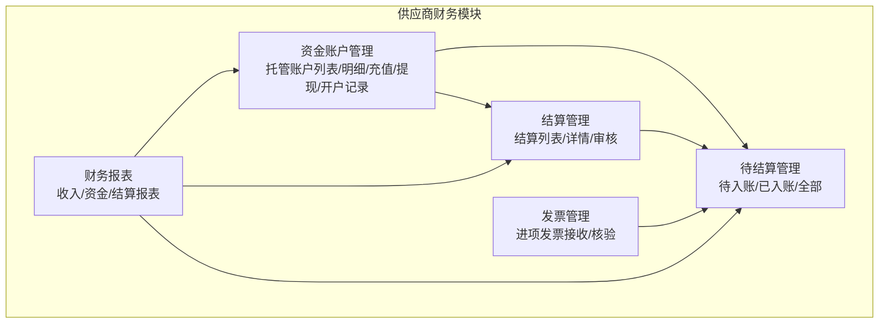
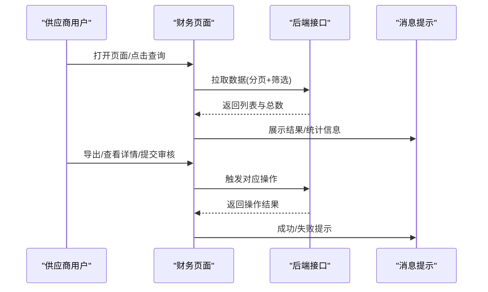
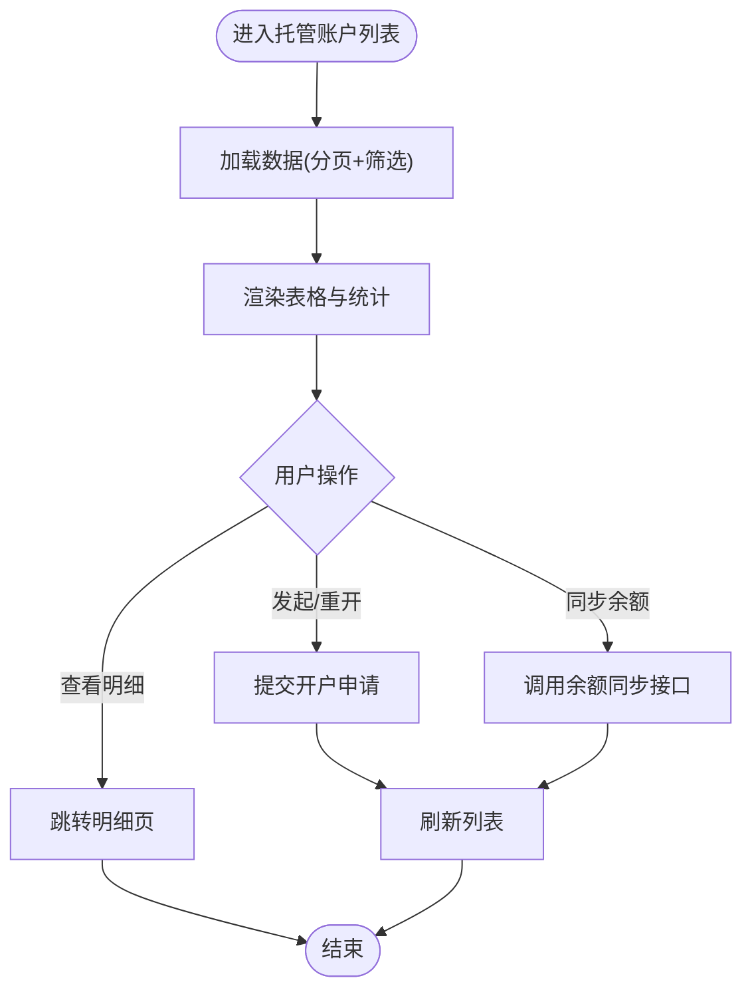
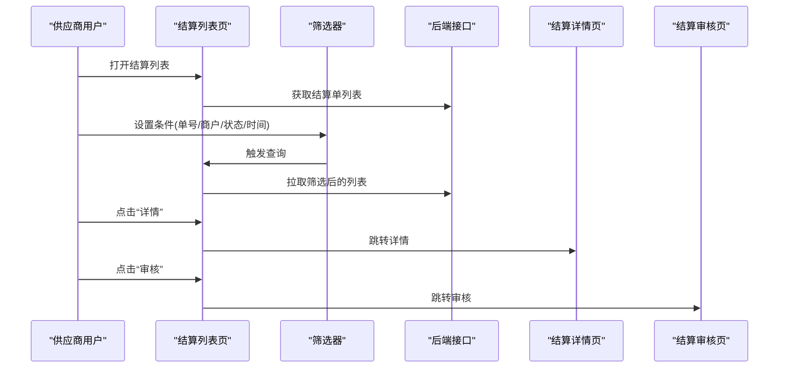
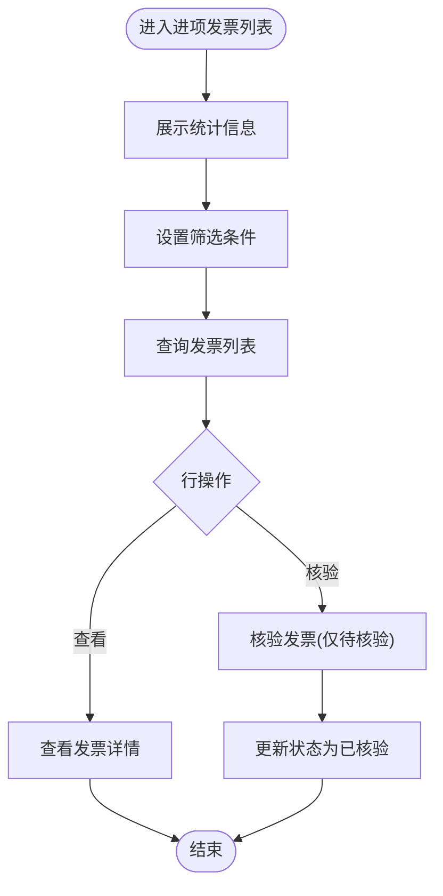
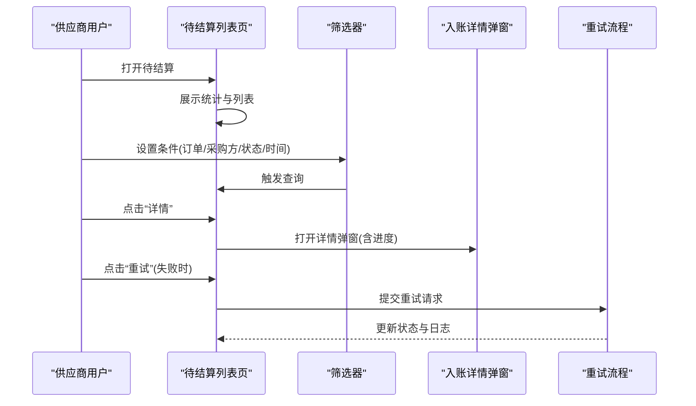
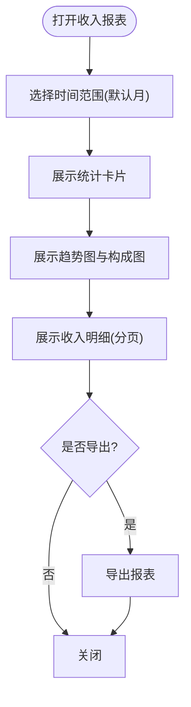
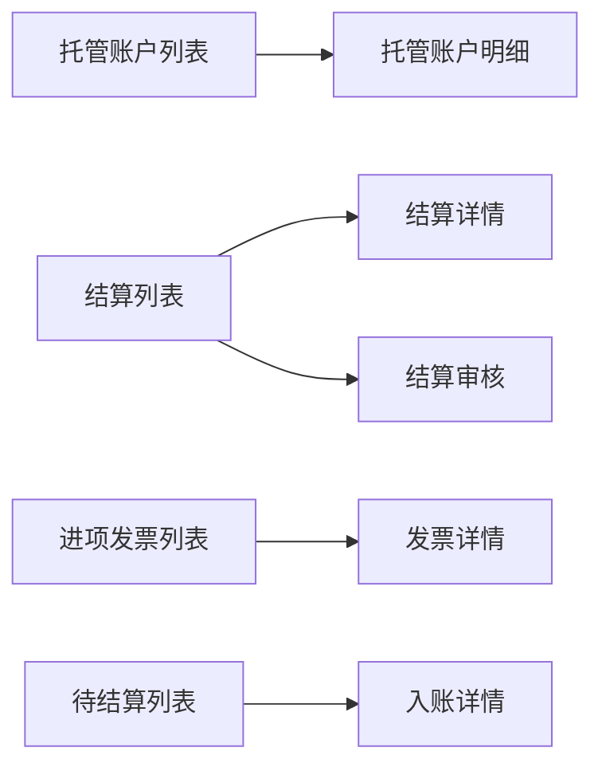

# 供应商财务模块

<cite>
**本文引用的文件**
- [apps/pc/src/views/finance/custody/index.vue](file://apps/pc/src/views/finance/custody/index.vue)
- [apps/pc/src/views/finance/settlement/index.vue](file://apps/pc/src/views/finance/settlement/index.vue)
- [apps/pc/src/views/finance/invoice/input.vue](file://apps/pc/src/views/finance/invoice/input.vue)
- [apps/pc/src/views/finance/report/income.vue](file://apps/pc/src/views/finance/report/income.vue)
- [apps/pc/src/views/supplier/finance/pending/index.vue](file://apps/pc/src/views/supplier/finance/pending/index.vue)
</cite>

## 目录
1. [简介](#简介)
2. [项目结构](#项目结构)
3. [核心组件](#核心组件)
4. [架构总览](#架构总览)
5. [详细组件分析](#详细组件分析)
6. [依赖关系分析](#依赖关系分析)
7. [性能考虑](#性能考虑)
8. [故障排查指南](#故障排查指南)
9. [结论](#结论)
10. [附录](#附录)

## 简介
本文件面向供应商财务模块，系统化梳理并说明以下功能域的设计与实现要点：
- 资金账户管理：账户余额查询、账户明细、账户状态
- 收支明细管理：收入记录、支出记录、交易流水
- 托管账户管理：资金托管、资金冻结、资金解冻、资金划转
- 结算管理：结算申请、结算审核、结算执行、结算记录
- 发票管理：发票开具、发票接收、发票验证、发票查询
- 待结算管理：待结算订单、结算统计、结算提醒
- 财务报表：资金报表、交易报表、结算报表

文档以“供应商视角”为主线，结合现有前端页面与交互逻辑，给出操作流程、业务规则与风险控制建议，并辅以可视化图示帮助理解。

## 项目结构
供应商财务模块主要由 PC 端供应商后台页面构成，采用 Vue 3 + Arco Design 组件库实现。页面分布如下：
- 财务总览与报表：收入报表、资金报表、结算报表
- 账户与托管：托管账户列表、明细、充值、提现、开户记录
- 结算：结算列表、结算详情、结算审核
- 发票：进项发票（接收与核验）
- 待结算：待入账/已入账/全部订单的统计与查询
- 交易流水：平台交易流水与钱包流水（在供应商侧以“交易”维度呈现）

**章节来源**
- [apps/pc/src/views/finance/custody/index.vue:1-222](file://apps/pc/src/views/finance/custody/index.vue#L1-L222)
- [apps/pc/src/views/finance/settlement/index.vue:1-263](file://apps/pc/src/views/finance/settlement/index.vue#L1-L263)
- [apps/pc/src/views/finance/invoice/input.vue:1-294](file://apps/pc/src/views/finance/invoice/input.vue#L1-L294)
- [apps/pc/src/views/finance/report/income.vue:1-379](file://apps/pc/src/views/finance/report/income.vue#L1-L379)
- [apps/pc/src/views/supplier/finance/pending/index.vue:1-361](file://apps/pc/src/views/supplier/finance/pending/index.vue#L1-L361)

## 核心组件
- 资金账户管理（托管账户）：提供账户列表、筛选、余额同步、开户申请/重开、查看详情等能力。
- 结算管理：提供结算单列表、筛选、状态统计、详情、审核入口。
- 发票管理（进项）：提供发票列表、筛选、状态统计、查看、核验。
- 待结算管理（待入账）：提供待入账/已入账/全部的订单统计、筛选、入账详情、重试机制。
- 财务报表（收入）：提供时间范围选择、趋势图、构成饼图、收入明细与导出。

**章节来源**
- [apps/pc/src/views/finance/custody/index.vue:108-222](file://apps/pc/src/views/finance/custody/index.vue#L108-L222)
- [apps/pc/src/views/finance/settlement/index.vue:110-263](file://apps/pc/src/views/finance/settlement/index.vue#L110-L263)
- [apps/pc/src/views/finance/invoice/input.vue:111-294](file://apps/pc/src/views/finance/invoice/input.vue#L111-L294)
- [apps/pc/src/views/supplier/finance/pending/index.vue:157-361](file://apps/pc/src/views/supplier/finance/pending/index.vue#L157-L361)
- [apps/pc/src/views/finance/report/income.vue:126-379](file://apps/pc/src/views/finance/report/income.vue#L126-L379)

## 架构总览
供应商财务模块以“页面-组件-状态”的前端架构为主，围绕以下关键流程展开：
- 数据加载：页面初始化触发数据拉取，支持分页与筛选。
- 用户交互：查询、导出、查看详情、提交审核/重试等。
- 状态展示：使用标签颜色与统计卡片直观呈现状态与指标。
- 风险控制：对敏感操作（如重试、导出）进行提示与二次确认。

**图表来源**
- [apps/pc/src/views/finance/custody/index.vue:148-208](file://apps/pc/src/views/finance/custody/index.vue#L148-L208)
- [apps/pc/src/views/finance/settlement/index.vue:177-236](file://apps/pc/src/views/finance/settlement/index.vue#L177-L236)
- [apps/pc/src/views/finance/invoice/input.vue:201-256](file://apps/pc/src/views/finance/invoice/input.vue#L201-L256)
- [apps/pc/src/views/supplier/finance/pending/index.vue:287-332](file://apps/pc/src/views/supplier/finance/pending/index.vue#L287-L332)

## 详细组件分析

### 资金账户管理（托管账户）
- 功能要点
  - 列表展示：账户ID、商户名称、开户状态、绑卡状态、账户状态、可用/冻结/总余额、最后同步时间。
  - 筛选与搜索：关键词、开户状态、绑卡状态、账户状态。
  - 操作：查看明细、发起/重新开户、同步余额；批量同步为占位提示。
  - 数据格式化：金额千分位与货币单位显示。
- 业务规则
  - 开户状态为“未开户/已销户”时允许发起或重开申请。
  - 余额同步用于刷新可用/冻结/总余额。
- 风险控制
  - 同步前提示“批量同步功能开发中”，避免误导用户。
  - 失败时统一错误提示，成功时刷新列表。

**图表来源**
- [apps/pc/src/views/finance/custody/index.vue:148-208](file://apps/pc/src/views/finance/custody/index.vue#L148-L208)

**章节来源**
- [apps/pc/src/views/finance/custody/index.vue:108-222](file://apps/pc/src/views/finance/custody/index.vue#L108-L222)

### 结算管理
- 功能要点
  - 列表展示：结算单号、商户名称、商户类型、结算金额、结算银行、申请时间、结算状态、到账时间。
  - 筛选：结算单号、商户、状态、申请时间范围。
  - 统计：待审核笔数与金额、本月已结算、结算笔数。
  - 操作：详情、审核（仅待审核状态）。
- 业务规则
  - 审核按钮仅在“待审核”状态下可见。
  - 状态颜色与文案映射清晰，便于快速识别处理节点。
- 风险控制
  - 查询后提示匹配条数，避免误判。
  - 导出前校验是否存在数据。

**图表来源**
- [apps/pc/src/views/finance/settlement/index.vue:110-263](file://apps/pc/src/views/finance/settlement/index.vue#L110-L263)

**章节来源**
- [apps/pc/src/views/finance/settlement/index.vue:1-263](file://apps/pc/src/views/finance/settlement/index.vue#L1-L263)

### 发票管理（进项发票）
- 功能要点
  - 统计：本月进项金额、进项税额、待核验发票、发票总数。
  - 列表：发票号码、类型、开票方、金额/税额/价税合计、开票日期、核验状态。
  - 筛选：发票号码、开票方、发票类型、核验状态。
  - 操作：查看、核验（仅待核验状态）。
- 业务规则
  - 发票类型与状态均提供颜色区分，便于快速识别。
  - 核验后计入已核验入账流程。
- 风险控制
  - 导出前校验是否存在数据。
  - 查询后提示匹配条数。

**图表来源**
- [apps/pc/src/views/finance/invoice/input.vue:111-294](file://apps/pc/src/views/finance/invoice/input.vue#L111-L294)

**章节来源**
- [apps/pc/src/views/finance/invoice/input.vue:1-294](file://apps/pc/src/views/finance/invoice/input.vue#L1-L294)

### 待结算管理（待入账）
- 功能要点
  - 统计：待入账金额、今日入账、本月入账、待入账笔数。
  - 标签页：待入账/已入账/全部。
  - 列表：订单编号、采购方、入账金额、支付时间、预计/实际入账时间、入账状态、备注。
  - 操作：详情、重试（仅入账失败时）。
- 业务规则
  - 入账状态颜色区分，预计入账时间超时高亮。
  - 详情弹窗展示入账进度时间轴。
- 风险控制
  - 重试流程增加二次确认与日志记录。
  - 导出前校验是否存在数据。

**图表来源**
- [apps/pc/src/views/supplier/finance/pending/index.vue:157-361](file://apps/pc/src/views/supplier/finance/pending/index.vue#L157-L361)

**章节来源**
- [apps/pc/src/views/supplier/finance/pending/index.vue:1-361](file://apps/pc/src/views/supplier/finance/pending/index.vue#L1-L361)

### 财务报表（收入）
- 功能要点
  - 时间范围：今日/本周/本月/本年/自定义。
  - 统计：总收入、服务费收入、交易笔数、平均客单价。
  - 图表：收入趋势柱状图、收入构成饼图。
  - 明细：日期、来源、商户、关联订单、交易金额、平台分账、分账比例。
  - 操作：导出。
- 业务规则
  - 收入来源按工程仓/供应商/服务费分类，便于拆分与对账。
- 风险控制
  - 导出前校验是否存在数据。

**图表来源**
- [apps/pc/src/views/finance/report/income.vue:126-379](file://apps/pc/src/views/finance/report/income.vue#L126-L379)

**章节来源**
- [apps/pc/src/views/finance/report/income.vue:1-379](file://apps/pc/src/views/finance/report/income.vue#L1-L379)

## 依赖关系分析
- 页面间依赖
  - 结算列表页与结算详情/审核页存在路由跳转关系。
  - 托管账户列表页与明细页存在路由跳转关系。
  - 发票列表页与详情页存在路由跳转关系。
- 组件内依赖
  - 使用 Arco Design 的卡片、表格、标签、统计、分页、时间选择器等组件。
  - 使用消息提示组件进行成功/失败/警告提示。
- 数据流
  - 页面通过统一的数据加载函数拉取列表与统计。
  - 筛选器变更触发重新加载。
  - 操作按钮调用对应接口并刷新数据。

**图表来源**
- [apps/pc/src/views/finance/custody/index.vue:175-179](file://apps/pc/src/views/finance/custody/index.vue#L175-L179)
- [apps/pc/src/views/finance/settlement/index.vue:222-228](file://apps/pc/src/views/finance/settlement/index.vue#L222-L228)
- [apps/pc/src/views/finance/invoice/input.vue:242-244](file://apps/pc/src/views/finance/invoice/input.vue#L242-L244)
- [apps/pc/src/views/supplier/finance/pending/index.vue:308-311](file://apps/pc/src/views/supplier/finance/pending/index.vue#L308-L311)

**章节来源**
- [apps/pc/src/views/finance/custody/index.vue:108-222](file://apps/pc/src/views/finance/custody/index.vue#L108-L222)
- [apps/pc/src/views/finance/settlement/index.vue:110-263](file://apps/pc/src/views/finance/settlement/index.vue#L110-L263)
- [apps/pc/src/views/finance/invoice/input.vue:111-294](file://apps/pc/src/views/finance/invoice/input.vue#L111-L294)
- [apps/pc/src/views/supplier/finance/pending/index.vue:157-361](file://apps/pc/src/views/supplier/finance/pending/index.vue#L157-L361)

## 性能考虑
- 列表分页与筛选
  - 建议后端支持分页与多字段索引，避免一次性返回大量数据。
- 图表渲染
  - 趋势图与饼图数据量较大时，建议前端做数据聚合或懒加载。
- 操作反馈
  - 对耗时操作（如导出、重试）增加加载态与明确提示，提升用户体验。
- 状态缓存
  - 对常用筛选条件与时间范围进行本地缓存，减少重复请求。

## 故障排查指南
- 余额同步失败
  - 现象：点击“同步余额”后提示失败。
  - 排查：检查网络状态、账户状态、接口返回错误码；确认是否为账户未生效或系统维护。
  - 处理：重试同步或联系客服。
- 结算审核不可见
  - 现象：结算单状态非“待审核”，审核按钮不显示。
  - 排查：确认结算单状态是否已变更；检查权限与流程。
- 发票核验异常
  - 现象：核验按钮不可用或核验后状态未更新。
  - 排查：确认发票状态为“待核验”；检查上传附件与必填项。
- 待入账重试失败
  - 现象：点击“重试”后仍为失败状态。
  - 排查：查看入账详情中的进度日志；确认银行系统是否正常。
- 导出为空
  - 现象：导出按钮提示无数据。
  - 排查：确认筛选条件是否过严；检查当前时间范围。

**章节来源**
- [apps/pc/src/views/finance/custody/index.vue:196-204](file://apps/pc/src/views/finance/custody/index.vue#L196-L204)
- [apps/pc/src/views/finance/settlement/index.vue:226-228](file://apps/pc/src/views/finance/settlement/index.vue#L226-L228)
- [apps/pc/src/views/finance/invoice/input.vue:246-248](file://apps/pc/src/views/finance/invoice/input.vue#L246-L248)
- [apps/pc/src/views/supplier/finance/pending/index.vue:313-324](file://apps/pc/src/views/supplier/finance/pending/index.vue#L313-L324)
- [apps/pc/src/views/finance/report/income.vue:201-207](file://apps/pc/src/views/finance/report/income.vue#L201-L207)

## 结论
供应商财务模块以“清晰的状态展示、完善的筛选与统计、稳健的操作流程”为核心设计目标。通过托管账户、结算、发票、待结算与财务报表五大功能域的协同，覆盖了供应商从资金沉淀到结算入账再到财务对账的全链路需求。建议后续在接口层补充批量操作、更细粒度的风险控制与审计日志，以进一步提升系统的安全性与可运维性。

## 附录
- 术语说明
  - 托管账户：由第三方托管机构管理的资金账户，支持充值、提现与余额同步。
  - 待入账：已完成支付但尚未完成入账流程的订单。
  - 结算：将应结款项从平台结算至供应商指定银行账户的过程。
  - 进项发票：供应商收到的来自工程仓或平台的服务费/货款发票，可用于税务抵扣。