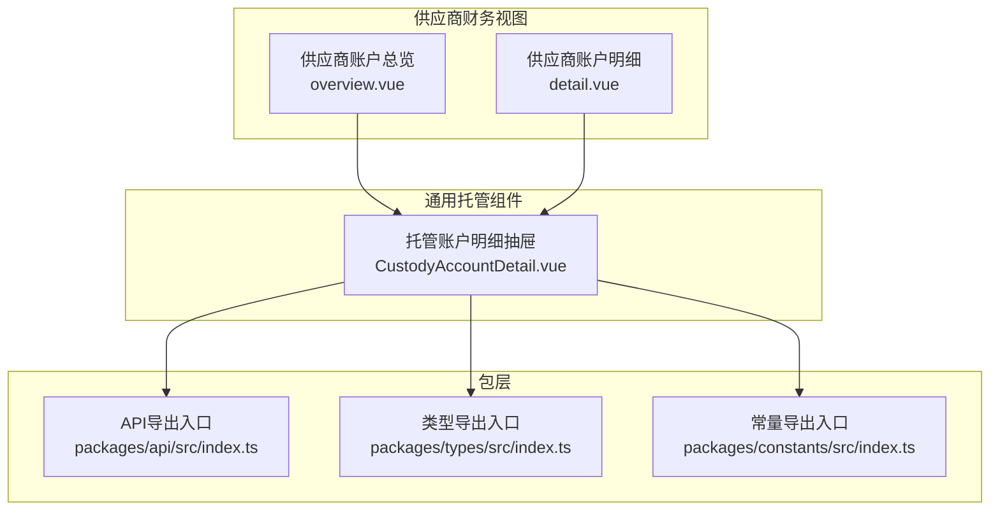
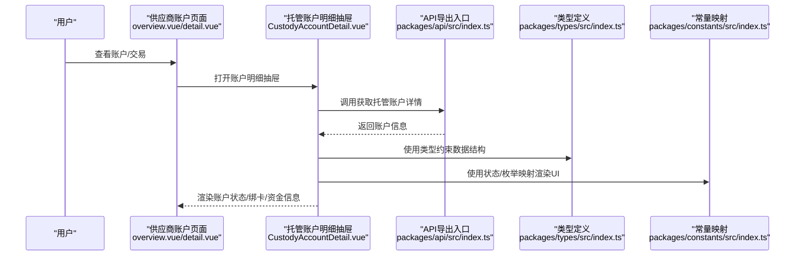
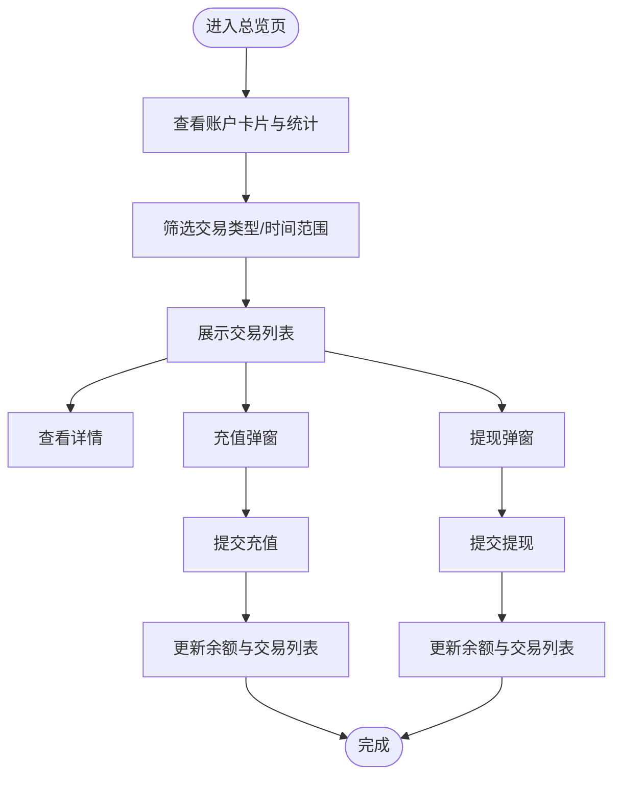
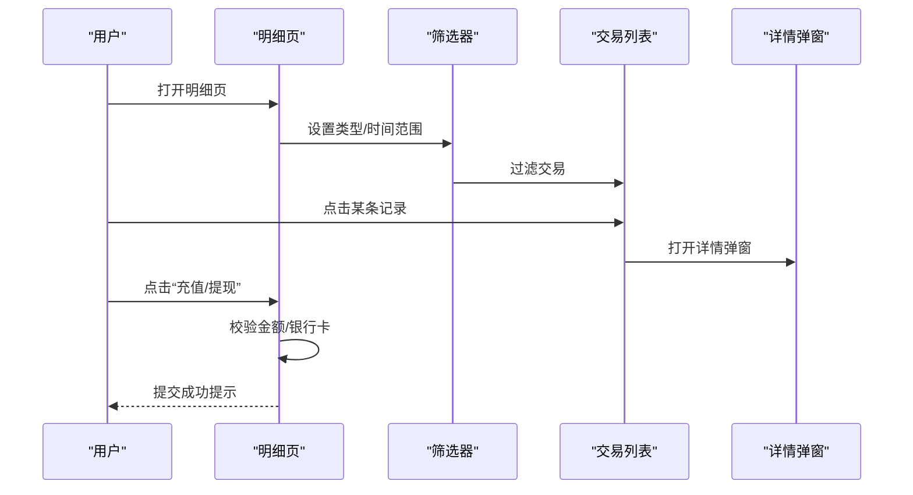
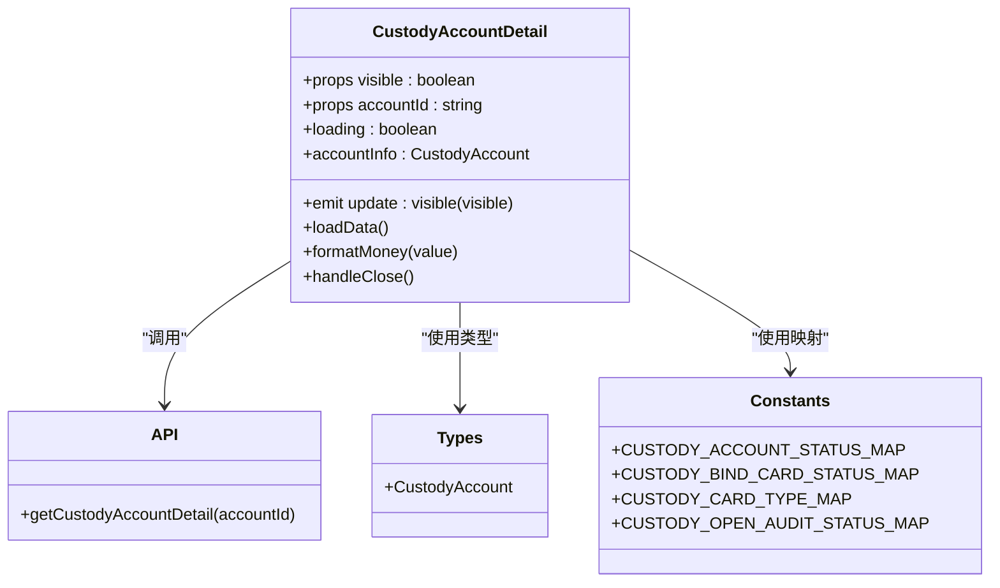
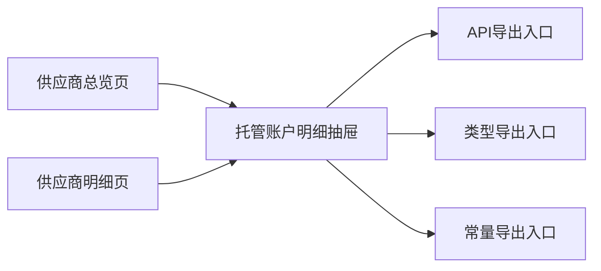

# 供应商账户管理

<cite>
**本文引用的文件**
- [apps/pc/src/views/supplier/account/index.vue](file://apps/pc/src/views/supplier/account/index.vue)
- [apps/pc/src/views/supplier/finance/custody/overview.vue](file://apps/pc/src/views/supplier/finance/custody/overview.vue)
- [apps/pc/src/views/supplier/finance/custody/detail.vue](file://apps/pc/src/views/supplier/finance/custody/detail.vue)
- [apps/pc/src/views/finance/custody/components/CustodyAccountDetail.vue](file://apps/pc/src/views/finance/custody/components/CustodyAccountDetail.vue)
- [packages/api/src/index.ts](file://packages/api/src/index.ts)
- [packages/types/src/index.ts](file://packages/types/src/index.ts)
- [packages/constants/src/index.ts](file://packages/constants/src/index.ts)
</cite>

## 目录
1. [简介](#简介)
2. [项目结构](#项目结构)
3. [核心组件](#核心组件)
4. [架构总览](#架构总览)
5. [详细组件分析](#详细组件分析)
6. [依赖关系分析](#依赖关系分析)
7. [性能考量](#性能考量)
8. [故障排查指南](#故障排查指南)
9. [结论](#结论)
10. [附录](#附录)

## 简介
本文件面向供应商侧“账户管理”能力，聚焦于托管账户的资金管理闭环：账户余额查询、账户明细查看、账户状态监控、账户信息维护，以及充值/提现等核心操作。文档从前端界面到数据模型与常量映射进行系统化梳理，并给出关键流程图与时序图，帮助研发与运营人员快速理解与落地。

## 项目结构
围绕供应商账户管理的关键页面与组件如下：
- 供应商账户总览页：展示账户余额、可用/冻结金额、账户信息与交易概览
- 供应商账户明细页：支持筛选交易类型与时间范围，查看交易、冻结、充值、提现记录
- 托管账户抽屉：统一展示账户状态、绑卡记录、开户记录与资金三类信息
- 统一API导出入口：集中暴露金融与托管相关接口
- 类型与常量：统一描述账户状态、绑卡状态、交易类型等枚举映射

图表来源
- [apps/pc/src/views/supplier/finance/custody/overview.vue:1-667](file://apps/pc/src/views/supplier/finance/custody/overview.vue#L1-L667)
- [apps/pc/src/views/supplier/finance/custody/detail.vue:1-594](file://apps/pc/src/views/supplier/finance/custody/detail.vue#L1-L594)
- [apps/pc/src/views/finance/custody/components/CustodyAccountDetail.vue:1-183](file://apps/pc/src/views/finance/custody/components/CustodyAccountDetail.vue#L1-L183)
- [packages/api/src/index.ts:1-11](file://packages/api/src/index.ts#L1-L11)
- [packages/types/src/index.ts:1-10](file://packages/types/src/index.ts#L1-L10)
- [packages/constants/src/index.ts:1-7](file://packages/constants/src/index.ts#L1-L7)

章节来源
- [apps/pc/src/views/supplier/finance/custody/overview.vue:1-667](file://apps/pc/src/views/supplier/finance/custody/overview.vue#L1-L667)
- [apps/pc/src/views/supplier/finance/custody/detail.vue:1-594](file://apps/pc/src/views/supplier/finance/custody/detail.vue#L1-L594)
- [apps/pc/src/views/finance/custody/components/CustodyAccountDetail.vue:1-183](file://apps/pc/src/views/finance/custody/components/CustodyAccountDetail.vue#L1-L183)
- [packages/api/src/index.ts:1-11](file://packages/api/src/index.ts#L1-L11)
- [packages/types/src/index.ts:1-10](file://packages/types/src/index.ts#L1-L10)
- [packages/constants/src/index.ts:1-7](file://packages/constants/src/index.ts#L1-L7)

## 核心组件
- 供应商账户总览页
  - 展示账户余额、冻结金额、可用余额、账户信息与账户统计
  - 支持交易记录筛选（类型+时间范围）、交易详情查看
  - 支持充值/提现弹窗提交
- 供应商账户明细页
  - 分Tab展示交易记录、冻结记录、充值记录、提现记录
  - 支持交易筛选与详情查看
  - 支持充值/提现弹窗提交
- 托管账户明细抽屉
  - 加载并展示账户状态、绑卡记录、开户记录与资金三类信息
  - 基于统一常量映射渲染状态标签
  - 异步加载失败时提示错误

章节来源
- [apps/pc/src/views/supplier/finance/custody/overview.vue:1-667](file://apps/pc/src/views/supplier/finance/custody/overview.vue#L1-L667)
- [apps/pc/src/views/supplier/finance/custody/detail.vue:1-594](file://apps/pc/src/views/supplier/finance/custody/detail.vue#L1-L594)
- [apps/pc/src/views/finance/custody/components/CustodyAccountDetail.vue:1-183](file://apps/pc/src/views/finance/custody/components/CustodyAccountDetail.vue#L1-L183)

## 架构总览
供应商账户管理从前端页面到后端接口与类型/常量的协作关系如下：

图表来源
- [apps/pc/src/views/supplier/finance/custody/overview.vue:1-667](file://apps/pc/src/views/supplier/finance/custody/overview.vue#L1-L667)
- [apps/pc/src/views/supplier/finance/custody/detail.vue:1-594](file://apps/pc/src/views/supplier/finance/custody/detail.vue#L1-L594)
- [apps/pc/src/views/finance/custody/components/CustodyAccountDetail.vue:1-183](file://apps/pc/src/views/finance/custody/components/CustodyAccountDetail.vue#L1-L183)
- [packages/api/src/index.ts:1-11](file://packages/api/src/index.ts#L1-L11)
- [packages/types/src/index.ts:1-10](file://packages/types/src/index.ts#L1-L10)
- [packages/constants/src/index.ts:1-7](file://packages/constants/src/index.ts#L1-L7)

## 详细组件分析

### 供应商账户总览页（overview.vue）
- 功能要点
  - 账户卡片：显示账户余额、冻结金额、可用余额
  - 账户信息：账户名称、账号、开户银行、银行账号、状态、认证/绑定状态
  - 账户统计：本月充值、提现、收入、支出
  - 交易记录：支持按类型与时间范围筛选；点击“详情”查看交易明细
  - 充值/提现：弹窗输入金额、方式/银行、备注，提交后动态插入交易记录
- 关键交互
  - 充值：校验金额>0，异步提交后在交易列表头部插入一条“充值”记录
  - 提现：校验金额>0且不超过可用余额，选择银行卡后异步提交
- 数据来源
  - 页面内维护交易列表与分页参数，使用本地数据模拟
  - 通过工具函数对交易类型、充值方式、提现状态进行文本与颜色映射

图表来源
- [apps/pc/src/views/supplier/finance/custody/overview.vue:432-537](file://apps/pc/src/views/supplier/finance/custody/overview.vue#L432-L537)

章节来源
- [apps/pc/src/views/supplier/finance/custody/overview.vue:1-667](file://apps/pc/src/views/supplier/finance/custody/overview.vue#L1-L667)

### 供应商账户明细页（detail.vue）
- 功能要点
  - 顶部卡片：账户余额、冻结金额、可用余额
  - 账户信息：账户名称、托管账号、开户银行、银行账号、状态、认证状态
  - 统计：本月充值/提现/收入/支出
  - 交易记录：按类型与时间范围筛选；支持查看详情
  - 冻结记录：展示冻结/解冻明细
  - 充值/提现：弹窗输入金额、方式/银行、备注，提交后更新交易列表
- 关键交互
  - 交易筛选：基于类型与日期区间过滤
  - 详情弹窗：展示交易时间、类型、金额、状态、说明、订单号、流水号等
  - 充值/提现：校验金额与银行卡，提交后提示处理中

图表来源
- [apps/pc/src/views/supplier/finance/custody/detail.vue:435-498](file://apps/pc/src/views/supplier/finance/custody/detail.vue#L435-L498)

章节来源
- [apps/pc/src/views/supplier/finance/custody/detail.vue:1-594](file://apps/pc/src/views/supplier/finance/custody/detail.vue#L1-L594)

### 托管账户明细抽屉（CustodyAccountDetail.vue）
- 功能要点
  - 账户信息：账户ID、商户名称、账户状态、开户状态、绑卡状态、最后同步时间
  - 资金信息：可用余额、冻结余额、总余额（格式化展示）
  - 绑卡记录：银行名称、账号（掩码显示）、账户名称、卡类型、绑定状态、绑定时间、默认卡
  - 开户记录：申请ID、申请类型、提交时间、审核状态、审核时间、失败原因、重试次数
- 数据与状态
  - 通过统一API获取账户详情
  - 使用统一类型约束数据结构
  - 使用统一常量映射渲染状态标签（如账户状态、绑卡状态、卡类型、审核状态等）

图表来源
- [apps/pc/src/views/finance/custody/components/CustodyAccountDetail.vue:1-183](file://apps/pc/src/views/finance/custody/components/CustodyAccountDetail.vue#L1-L183)
- [packages/api/src/index.ts:1-11](file://packages/api/src/index.ts#L1-L11)
- [packages/types/src/index.ts:1-10](file://packages/types/src/index.ts#L1-L10)
- [packages/constants/src/index.ts:1-7](file://packages/constants/src/index.ts#L1-L7)

章节来源
- [apps/pc/src/views/finance/custody/components/CustodyAccountDetail.vue:1-183](file://apps/pc/src/views/finance/custody/components/CustodyAccountDetail.vue#L1-L183)
- [packages/api/src/index.ts:1-11](file://packages/api/src/index.ts#L1-L11)
- [packages/types/src/index.ts:1-10](file://packages/types/src/index.ts#L1-L10)
- [packages/constants/src/index.ts:1-7](file://packages/constants/src/index.ts#L1-L7)

### 供应商员工账户管理（补充）
- 供应商侧还包含“员工账户管理”页面，用于供应商内部员工账号的增删改查与状态切换
- 主要能力：搜索（姓名/账号/手机号）、筛选（部门/角色/状态）、分页、新增/编辑/重置密码/启停/删除
- 该页面与“托管账户”管理属于不同维度，但同样体现账户信息维护与状态监控

章节来源
- [apps/pc/src/views/supplier/account/index.vue:1-411](file://apps/pc/src/views/supplier/account/index.vue#L1-L411)

## 依赖关系分析
- 组件间依赖
  - 供应商账户总览/明细页依赖托管账户明细抽屉以统一展示账户与资金信息
  - 抽屉组件依赖API、类型与常量，形成稳定的契约边界
- 包层依赖
  - API导出入口集中导出金融与托管相关模块
  - 类型与常量导出入口分别提供数据结构与状态映射

图表来源
- [apps/pc/src/views/supplier/finance/custody/overview.vue:1-667](file://apps/pc/src/views/supplier/finance/custody/overview.vue#L1-L667)
- [apps/pc/src/views/supplier/finance/custody/detail.vue:1-594](file://apps/pc/src/views/supplier/finance/custody/detail.vue#L1-L594)
- [apps/pc/src/views/finance/custody/components/CustodyAccountDetail.vue:1-183](file://apps/pc/src/views/finance/custody/components/CustodyAccountDetail.vue#L1-L183)
- [packages/api/src/index.ts:1-11](file://packages/api/src/index.ts#L1-L11)
- [packages/types/src/index.ts:1-10](file://packages/types/src/index.ts#L1-L10)
- [packages/constants/src/index.ts:1-7](file://packages/constants/src/index.ts#L1-L7)

章节来源
- [packages/api/src/index.ts:1-11](file://packages/api/src/index.ts#L1-L11)
- [packages/types/src/index.ts:1-10](file://packages/types/src/index.ts#L1-L10)
- [packages/constants/src/index.ts:1-7](file://packages/constants/src/index.ts#L1-L7)

## 性能考量
- 列表渲染优化
  - 使用虚拟滚动或分页减少一次性渲染的数据量
  - 对交易金额与余额采用格式化显示，避免频繁计算
- 异步加载
  - 抽屉组件在打开时才触发数据拉取，避免不必要的请求
  - 对错误进行捕获并提示，防止阻塞UI
- 交互反馈
  - 充值/提现提交采用异步处理并在成功后更新列表，提升用户体验

## 故障排查指南
- 常见问题
  - 充值/提现金额非法：检查金额是否大于0
  - 可用余额不足：提现金额不得超过可用余额
  - 银行卡未选择：提现需选择绑卡
  - 获取账户详情失败：检查网络与接口返回
- 处理建议
  - 在提交前进行前端校验，失败时提示具体原因
  - 对接口异常进行统一错误提示，避免抛出未捕获异常
  - 对抽屉组件的加载状态进行显式反馈

章节来源
- [apps/pc/src/views/supplier/finance/custody/overview.vue:466-537](file://apps/pc/src/views/supplier/finance/custody/overview.vue#L466-L537)
- [apps/pc/src/views/supplier/finance/custody/detail.vue:469-498](file://apps/pc/src/views/supplier/finance/custody/detail.vue#L469-L498)
- [apps/pc/src/views/finance/custody/components/CustodyAccountDetail.vue:147-156](file://apps/pc/src/views/finance/custody/components/CustodyAccountDetail.vue#L147-L156)

## 结论
供应商账户管理以“总览—明细—抽屉”的三层结构实现账户余额、明细、状态与信息的统一呈现与维护。通过API、类型与常量的标准化输出，确保了跨页面的一致性与可扩展性。建议后续在真实后端接入时，完善接口契约与错误处理，并在前端增加更细粒度的缓存与分页策略以提升性能。

## 附录

### 账户余额与资金三要素
- 账户余额 = 可用余额 + 冻结金额
- 可用余额：可用于提现/支付的实时可用资金
- 冻结金额：因订单保证金/风控等原因暂时不可用的资金

### 明细记录分类标准
- 交易类型：收入、支出、充值、提现、冻结、解冻
- 充值方式：银行转账、在线支付
- 提现状态：待处理、处理中、成功、失败

### 状态变更触发条件
- 账户状态：由开户状态、绑卡状态、最后同步时间共同决定
- 绑卡状态：绑卡成功/失败、默认卡切换
- 审核状态：开户申请提交后的审核流程

### 账户安全控制措施
- 银行卡掩码显示，保护敏感信息
- 提现需选择已绑定银行卡并校验可用余额
- 错误统一提示，避免敏感信息泄露