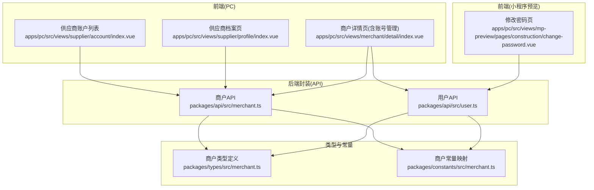
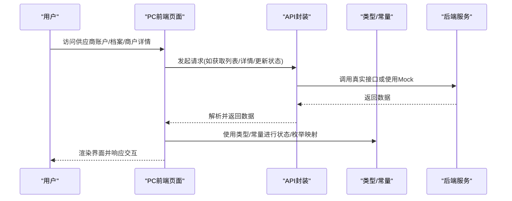
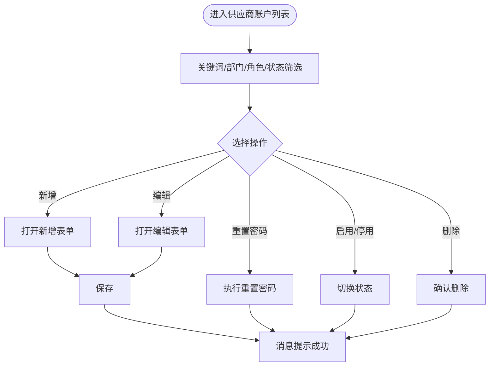
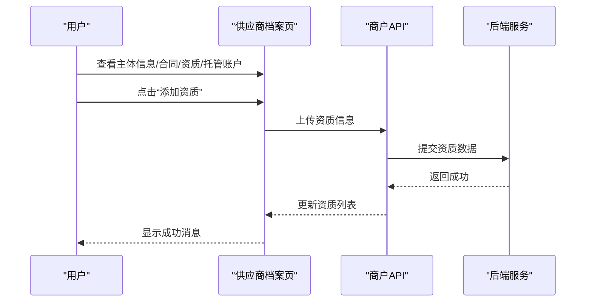
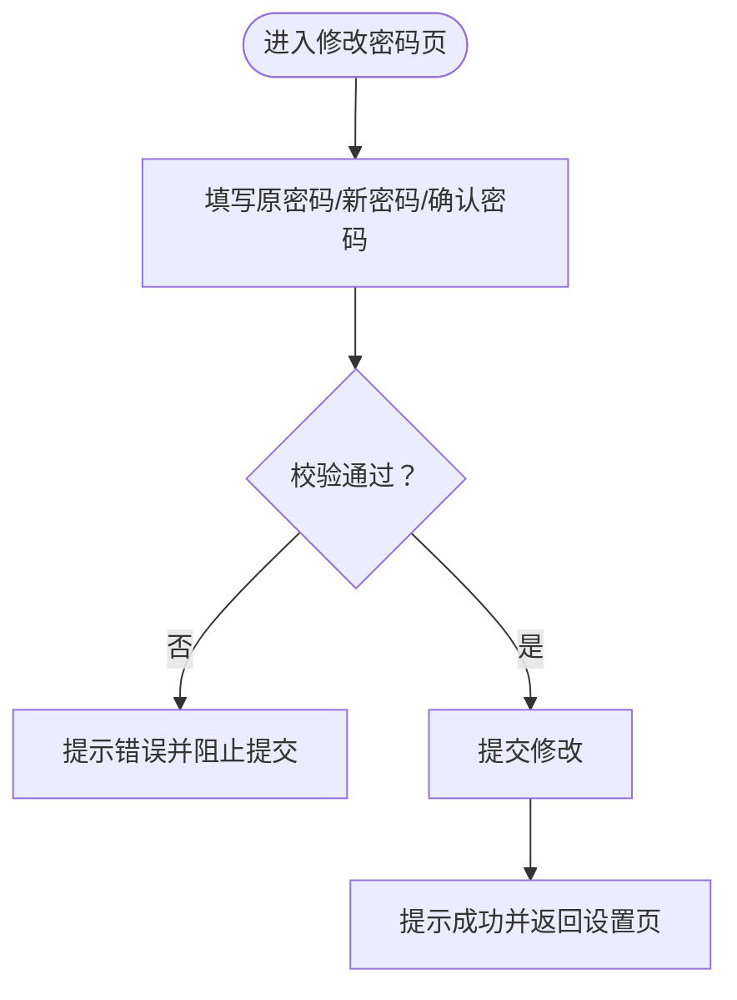
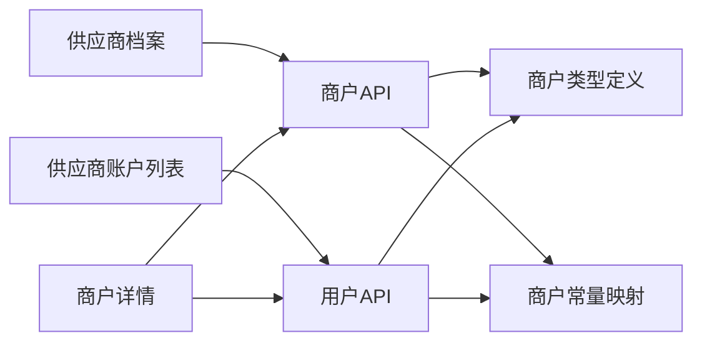

# 供应商账户管理

<cite>
**本文引用的文件**
- [apps/pc/src/views/supplier/account/index.vue](file://apps/pc/src/views/supplier/account/index.vue)
- [apps/pc/src/views/supplier/profile/index.vue](file://apps/pc/src/views/supplier/profile/index.vue)
- [apps/pc/src/views/merchant/detail/index.vue](file://apps/pc/src/views/merchant/detail/index.vue)
- [apps/pc/src/views/mp-preview/pages/construction/change-password.vue](file://apps/pc/src/views/mp-preview/pages/construction/change-password.vue)
- [packages/api/src/merchant.ts](file://packages/api/src/merchant.ts)
- [packages/api/src/user.ts](file://packages/api/src/user.ts)
- [packages/types/src/merchant.ts](file://packages/types/src/merchant.ts)
- [packages/constants/src/merchant.ts](file://packages/constants/src/merchant.ts)
</cite>

## 目录
1. [简介](#简介)
2. [项目结构](#项目结构)
3. [核心组件](#核心组件)
4. [架构总览](#架构总览)
5. [详细组件分析](#详细组件分析)
6. [依赖关系分析](#依赖关系分析)
7. [性能考量](#性能考量)
8. [故障排查指南](#故障排查指南)
9. [结论](#结论)
10. [附录](#附录)

## 简介
本文件面向“供应商账户管理”功能，系统化梳理供应商侧账户信息维护、密码安全、账户状态与验证、以及安全防护等能力。文档基于现有前端页面与API/类型定义，聚焦以下主题：
- 账户基本信息维护：企业名称、统一社会信用代码、注册地址、经营范围等主体信息
- 密码安全管理：登录密码修改、密码强度要求、安全设置
- 账户状态管理：启用/停用状态、账户验证
- 账户安全防护：账户验证、绑卡与托管账户、操作日志
- 表单与验证规则：字段约束、交互流程
- 最佳实践与安全建议

## 项目结构
供应商账户管理涉及多端页面与后端接口/类型定义：
- 前端PC端供应商视图：供应商账户列表、供应商档案（含主体信息、合同与资质、托管账户）
- 前端小程序预览页：密码修改页面
- 后端API封装：商户与用户相关接口
- 类型与常量：商户、合同、资质、托管账户、状态枚举与映射

图表来源
- [apps/pc/src/views/supplier/account/index.vue:1-411](file://apps/pc/src/views/supplier/account/index.vue#L1-L411)
- [apps/pc/src/views/supplier/profile/index.vue:1-522](file://apps/pc/src/views/supplier/profile/index.vue#L1-L522)
- [apps/pc/src/views/merchant/detail/index.vue:1-669](file://apps/pc/src/views/merchant/detail/index.vue#L1-L669)
- [apps/pc/src/views/mp-preview/pages/construction/change-password.vue:1-184](file://apps/pc/src/views/mp-preview/pages/construction/change-password.vue#L1-L184)
- [packages/api/src/merchant.ts:1-119](file://packages/api/src/merchant.ts#L1-L119)
- [packages/api/src/user.ts:1-172](file://packages/api/src/user.ts#L1-L172)
- [packages/types/src/merchant.ts:1-291](file://packages/types/src/merchant.ts#L1-L291)
- [packages/constants/src/merchant.ts:1-199](file://packages/constants/src/merchant.ts#L1-L199)

章节来源
- [apps/pc/src/views/supplier/account/index.vue:1-411](file://apps/pc/src/views/supplier/account/index.vue#L1-L411)
- [apps/pc/src/views/supplier/profile/index.vue:1-522](file://apps/pc/src/views/supplier/profile/index.vue#L1-L522)
- [apps/pc/src/views/merchant/detail/index.vue:1-669](file://apps/pc/src/views/merchant/detail/index.vue#L1-L669)
- [apps/pc/src/views/mp-preview/pages/construction/change-password.vue:1-184](file://apps/pc/src/views/mp-preview/pages/construction/change-password.vue#L1-L184)
- [packages/api/src/merchant.ts:1-119](file://packages/api/src/merchant.ts#L1-L119)
- [packages/api/src/user.ts:1-172](file://packages/api/src/user.ts#L1-L172)
- [packages/types/src/merchant.ts:1-291](file://packages/types/src/merchant.ts#L1-L291)
- [packages/constants/src/merchant.ts:1-199](file://packages/constants/src/merchant.ts#L1-L199)

## 核心组件
- 供应商账户列表与管理
  - 支持关键词/部门/角色/状态筛选
  - 支持新增、编辑、重置密码、启用/停用、删除
  - 表单字段：账号、初始密码、姓名、手机号、部门、职位、角色、邮箱、状态
- 供应商档案与主体信息
  - 展示企业名称、统一社会信用代码、注册地址、经营范围等
  - 展示合同与资质列表，支持添加/删除/查看
  - 托管账户展示：账户状态、绑卡状态、资金余额、绑卡记录、开户记录
- 商户详情中的账号管理
  - 展示商户下的账号列表，支持添加/编辑/重置密码
- 小程序预览密码修改
  - 原密码、新密码、确认新密码校验，密码长度与字符要求提示

章节来源
- [apps/pc/src/views/supplier/account/index.vue:1-411](file://apps/pc/src/views/supplier/account/index.vue#L1-L411)
- [apps/pc/src/views/supplier/profile/index.vue:1-522](file://apps/pc/src/views/supplier/profile/index.vue#L1-L522)
- [apps/pc/src/views/merchant/detail/index.vue:271-311](file://apps/pc/src/views/merchant/detail/index.vue#L271-L311)
- [apps/pc/src/views/mp-preview/pages/construction/change-password.vue:1-184](file://apps/pc/src/views/mp-preview/pages/construction/change-password.vue#L1-L184)

## 架构总览
供应商账户管理从前端页面发起请求，经由API封装调用后端接口或本地Mock，返回数据后在页面渲染并触发交互。

图表来源
- [packages/api/src/merchant.ts:1-119](file://packages/api/src/merchant.ts#L1-L119)
- [packages/api/src/user.ts:1-172](file://packages/api/src/user.ts#L1-L172)
- [packages/types/src/merchant.ts:1-291](file://packages/types/src/merchant.ts#L1-L291)
- [packages/constants/src/merchant.ts:1-199](file://packages/constants/src/merchant.ts#L1-L199)

## 详细组件分析

### 供应商账户列表与管理
- 功能要点
  - 列表：员工ID、姓名、账号、手机号、部门、职位、角色、状态、最后登录、创建时间
  - 操作：编辑、重置密码、启用/停用、删除（非管理员）
  - 表单：账号（新增时必填/不可编辑）、初始密码（新增时必填）、姓名、手机号、部门、职位、角色、邮箱、状态
- 验证规则
  - 必填字段：账号、初始密码（新增）、姓名、手机号、角色
  - 状态开关：1=启用、0=禁用
- 流程
  - 新增：填写表单→保存→消息提示成功
  - 编辑：复制当前记录→保存→消息提示成功
  - 重置密码：选择目标用户→触发重置→消息提示成功
  - 启用/停用：切换状态→消息提示成功
  - 删除：确认弹窗→移除记录→消息提示成功

图表来源
- [apps/pc/src/views/supplier/account/index.vue:308-397](file://apps/pc/src/views/supplier/account/index.vue#L308-L397)

章节来源
- [apps/pc/src/views/supplier/account/index.vue:1-411](file://apps/pc/src/views/supplier/account/index.vue#L1-L411)

### 供应商档案与主体信息
- 功能要点
  - 基础信息：供应商ID、类型、名称、联系人、联系方式、入驻状态、启用状态、创建/入驻时间、备注
  - 主体信息：企业名称、统一社会信用代码、注册地址、经营范围、注册资本、成立日期、法人信息、执照与身份证照片有效期
  - 结算账户：账户名称、银行账号、开户银行、支行信息、纳税人识别号、账户状态与验证时间
  - 合同信息：合同编号、名称、类型、签署日期、有效期、状态
  - 资质信息：资质名称、证书编号、发证日期、有效期、状态、附件
  - 托管账户：账户ID、状态、开户状态、绑卡状态、资金余额、绑卡记录、开户记录
- 表单与交互
  - 资质添加：弹窗表单（名称、编号、发证日期、有效期、附件上传）
  - 绑卡：弹窗表单（银行、卡号、支行、预留手机号），提交后提示等待验证
  - 设为默认：点击设为默认银行卡

图表来源
- [apps/pc/src/views/supplier/profile/index.vue:233-286](file://apps/pc/src/views/supplier/profile/index.vue#L233-L286)
- [packages/api/src/merchant.ts:97-118](file://packages/api/src/merchant.ts#L97-L118)

章节来源
- [apps/pc/src/views/supplier/profile/index.vue:1-522](file://apps/pc/src/views/supplier/profile/index.vue#L1-L522)
- [packages/api/src/merchant.ts:1-119](file://packages/api/src/merchant.ts#L1-L119)

### 商户详情中的账号管理
- 功能要点
  - 展示商户下的账号列表（用户名、姓名、手机号、角色、状态、最后登录、创建时间）
  - 支持添加账号、编辑、重置密码
- 与供应商账户列表的关系
  - 两者均体现“账号管理”的不同入口与粒度：前者是供应商维度的员工账号管理，后者是商户维度的账号管理

章节来源
- [apps/pc/src/views/merchant/detail/index.vue:271-311](file://apps/pc/src/views/merchant/detail/index.vue#L271-L311)

### 小程序预览密码修改
- 功能要点
  - 表单字段：原密码、新密码、确认新密码
  - 校验：新密码长度≥6，新密码与确认密码一致
  - 成功后提示并返回设置页
- 安全建议
  - 建议增加原密码正确性校验
  - 建议增加弱口令检测与复杂度提示

图表来源
- [apps/pc/src/views/mp-preview/pages/construction/change-password.vue:64-90](file://apps/pc/src/views/mp-preview/pages/construction/change-password.vue#L64-L90)

章节来源
- [apps/pc/src/views/mp-preview/pages/construction/change-password.vue:1-184](file://apps/pc/src/views/mp-preview/pages/construction/change-password.vue#L1-L184)

## 依赖关系分析
- 页面与API
  - 供应商账户列表依赖用户API（新增/编辑/重置密码/启停）
  - 供应商档案与商户详情依赖商户API（合同、资质、托管账户）
- 类型与常量
  - 商户类型定义涵盖主体信息、结算账户、合同、资质、托管账户、状态枚举
  - 商户常量提供状态/类型映射，用于UI标签颜色与文案

图表来源
- [packages/api/src/merchant.ts:1-119](file://packages/api/src/merchant.ts#L1-L119)
- [packages/api/src/user.ts:1-172](file://packages/api/src/user.ts#L1-L172)
- [packages/types/src/merchant.ts:1-291](file://packages/types/src/merchant.ts#L1-L291)
- [packages/constants/src/merchant.ts:1-199](file://packages/constants/src/merchant.ts#L1-L199)

章节来源
- [packages/api/src/merchant.ts:1-119](file://packages/api/src/merchant.ts#L1-L119)
- [packages/api/src/user.ts:1-172](file://packages/api/src/user.ts#L1-L172)
- [packages/types/src/merchant.ts:1-291](file://packages/types/src/merchant.ts#L1-L291)
- [packages/constants/src/merchant.ts:1-199](file://packages/constants/src/merchant.ts#L1-L199)

## 性能考量
- 列表分页与筛选
  - 建议在后端实现分页与筛选，避免一次性加载全部数据
- 图片与附件
  - 资质与执照图片建议懒加载与压缩，减少首屏压力
- 状态与枚举
  - 使用常量映射避免重复计算，提升渲染性能

## 故障排查指南
- 供应商账户列表
  - 若筛选无结果，检查关键词是否匹配姓名/账号/手机号
  - 启用/停用失败：确认状态值与权限
- 供应商档案
  - 资质添加失败：检查必填项与附件格式限制
  - 绑卡提交失败：确认银行信息与预留手机号格式
- 商户详情
  - 账号管理操作失败：确认商户状态与入驻审核状态
- 密码修改
  - 新旧密码不一致：确保两次输入一致且长度满足要求
  - 提交后无响应：检查网络与浏览器控制台错误

章节来源
- [apps/pc/src/views/supplier/account/index.vue:308-397](file://apps/pc/src/views/supplier/account/index.vue#L308-L397)
- [apps/pc/src/views/supplier/profile/index.vue:394-438](file://apps/pc/src/views/supplier/profile/index.vue#L394-L438)
- [apps/pc/src/views/merchant/detail/index.vue:487-494](file://apps/pc/src/views/merchant/detail/index.vue#L487-L494)
- [apps/pc/src/views/mp-preview/pages/construction/change-password.vue:76-90](file://apps/pc/src/views/mp-preview/pages/construction/change-password.vue#L76-L90)

## 结论
供应商账户管理以“供应商账户列表/档案/商户详情/密码修改”为核心页面，配合商户与用户API、类型与常量，形成完整的账户信息维护与安全体系。建议后续完善后端接口与鉴权校验，强化密码复杂度与弱口令检测，并优化图片与数据加载性能。

## 附录
- 字段与验证要点
  - 账户基本信息：企业名称、统一社会信用代码、注册地址、经营范围
  - 密码安全：长度≥6，新旧密码一致，建议增加复杂度与弱口令检测
  - 账户状态：启用/停用，结合入驻审核状态控制
  - 安全防护：托管账户验证、绑卡状态、操作日志