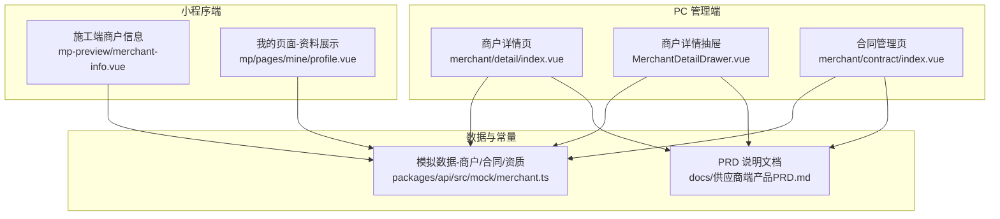
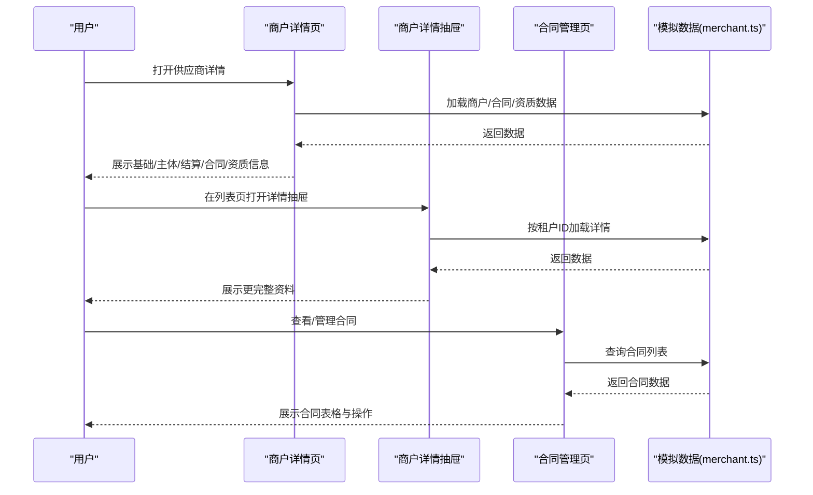
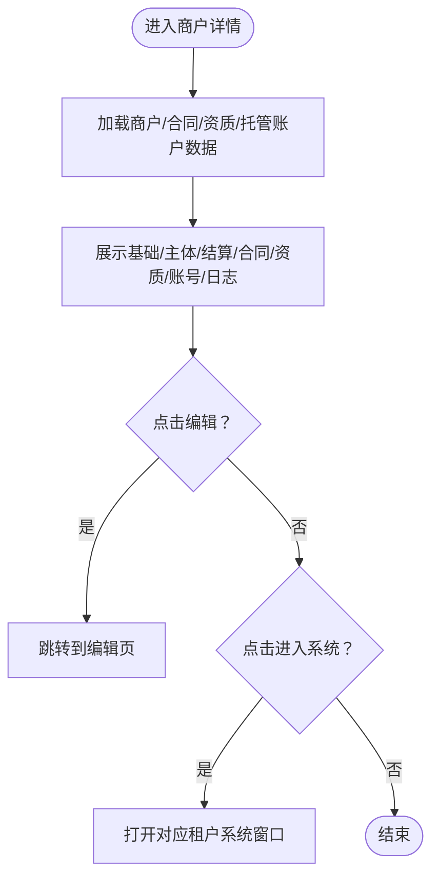
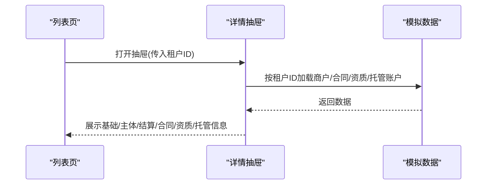
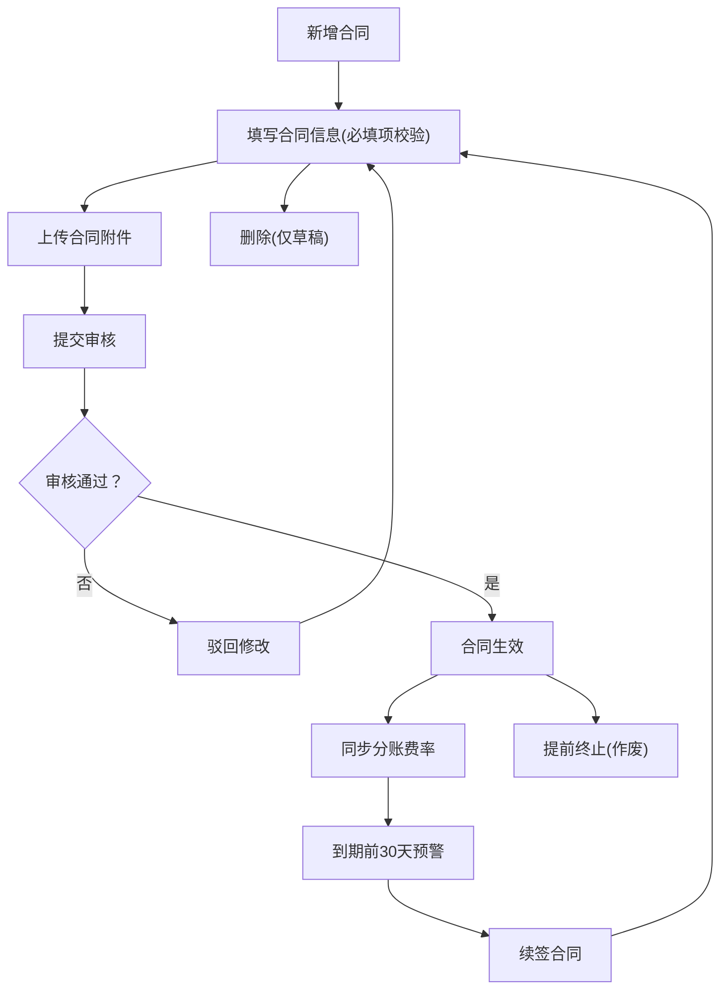
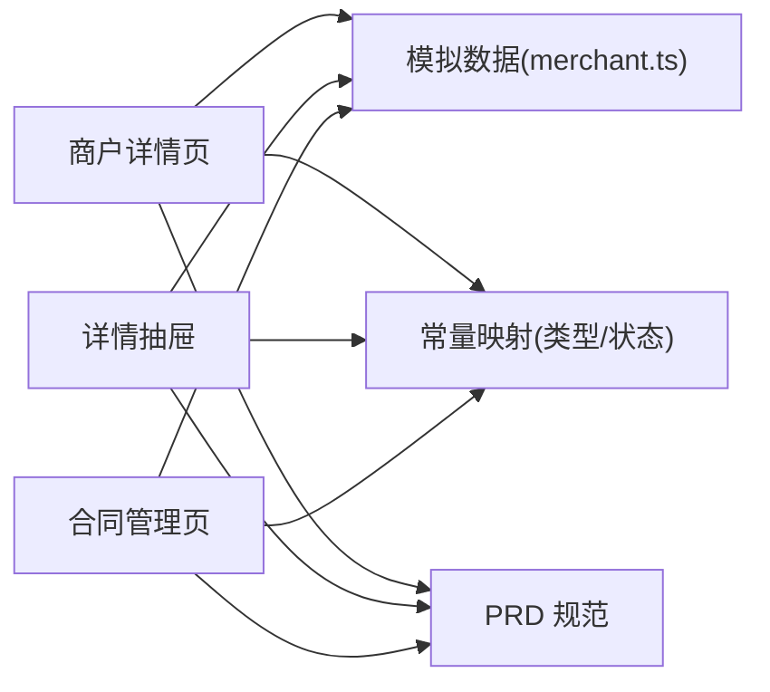

# 供应商资料管理

<cite>
**本文引用的文件**
- [apps/pc/src/views/merchant/detail/index.vue](file://apps/pc/src/views/merchant/detail/index.vue)
- [apps/pc/src/views/merchant/list/components/MerchantDetailDrawer.vue](file://apps/pc/src/views/merchant/list/components/MerchantDetailDrawer.vue)
- [apps/pc/src/views/merchant/contract/index.vue](file://apps/pc/src/views/merchant/contract/index.vue)
- [apps/pc/src/views/merchant/list/components/ContractFormModal.vue](file://apps/pc/src/views/merchant/list/components/ContractFormModal.vue)
- [packages/api/src/mock/merchant.ts](file://packages/api/src/mock/merchant.ts)
- [apps/pc/src/views/mp-preview/pages/construction/merchant-info.vue](file://apps/pc/src/views/mp-preview/pages/construction/merchant-info.vue)
- [apps/mp/src/pages/mine/profile.vue](file://apps/mp/src/pages/mine/profile.vue)
- [docs/供应商端产品PRD.md](file://docs/供应商端产品PRD.md)
</cite>

## 目录
1. [简介](#简介)
2. [项目结构](#项目结构)
3. [核心组件](#核心组件)
4. [架构总览](#架构总览)
5. [详细组件分析](#详细组件分析)
6. [依赖关系分析](#依赖关系分析)
7. [性能考虑](#性能考虑)
8. [故障排查指南](#故障排查指南)
9. [结论](#结论)
10. [附录](#附录)

## 简介
本文件围绕“供应商资料管理”主题，系统化梳理供应商企业信息的完整管理流程，覆盖以下信息域：
- 企业基本信息：企业名称、统一社会信用代码、注册资本、成立日期、企业性质等
- 企业资质信息：营业执照、税务登记证、组织机构代码证等
- 联系人信息：法定代表人、联系人姓名、联系电话、邮箱等
- 银行账户信息：开户银行、银行账号、银行账户名等
- 企业地址信息：注册地址、经营地址
并结合前端页面与后端模拟数据，给出字段填写规范、附件上传要求、审核流程与信息变更操作建议。

## 项目结构
供应商资料管理相关页面与组件主要分布在 PC 管理端与小程序端：
- PC 管理端
  - 商户详情页：展示与编辑供应商资料
  - 商户列表抽屉：以抽屉形式查看供应商资料
  - 合同管理页：合同信息维护与查看
- 小程序端
  - 施工端商户信息页：展示主体信息与资质证明
  - 我的页面：展示公司信息、证书与银行账户状态

**图表来源**
- [apps/pc/src/views/merchant/detail/index.vue](file://apps/pc/src/views/merchant/detail/index.vue)
- [apps/pc/src/views/merchant/list/components/MerchantDetailDrawer.vue](file://apps/pc/src/views/merchant/list/components/MerchantDetailDrawer.vue)
- [apps/pc/src/views/merchant/contract/index.vue](file://apps/pc/src/views/merchant/contract/index.vue)
- [apps/pc/src/views/mp-preview/pages/construction/merchant-info.vue](file://apps/pc/src/views/mp-preview/pages/construction/merchant-info.vue)
- [apps/mp/src/pages/mine/profile.vue](file://apps/mp/src/pages/mine/profile.vue)
- [packages/api/src/mock/merchant.ts](file://packages/api/src/mock/merchant.ts)
- [docs/供应商端产品PRD.md](file://docs/供应商端产品PRD.md)

**章节来源**
- [apps/pc/src/views/merchant/detail/index.vue](file://apps/pc/src/views/merchant/detail/index.vue)
- [apps/pc/src/views/merchant/list/components/MerchantDetailDrawer.vue](file://apps/pc/src/views/merchant/list/components/MerchantDetailDrawer.vue)
- [apps/pc/src/views/merchant/contract/index.vue](file://apps/pc/src/views/merchant/contract/index.vue)
- [apps/pc/src/views/mp-preview/pages/construction/merchant-info.vue](file://apps/pc/src/views/mp-preview/pages/construction/merchant-info.vue)
- [apps/mp/src/pages/mine/profile.vue](file://apps/mp/src/pages/mine/profile.vue)
- [packages/api/src/mock/merchant.ts](file://packages/api/src/mock/merchant.ts)
- [docs/供应商端产品PRD.md](file://docs/供应商端产品PRD.md)

## 核心组件
- 商户详情页：集中展示供应商的基础信息、主体信息、结算账户、合同与资质信息，并提供编辑入口与系统进入入口。
- 商户详情抽屉：以抽屉形式展示更完整的资料视图，便于在列表页快速查看。
- 合同管理页：提供合同的新增、编辑、作废、删除与导出能力，支持按商户、类型、状态筛选。
- 施工端商户信息页：面向施工方展示主体信息与资质证明，强调认证状态与证书展示。
- 我的页面：展示公司信息、证书与银行账户状态，便于供应商侧快速核对与操作。

**章节来源**
- [apps/pc/src/views/merchant/detail/index.vue](file://apps/pc/src/views/merchant/detail/index.vue)
- [apps/pc/src/views/merchant/list/components/MerchantDetailDrawer.vue](file://apps/pc/src/views/merchant/list/components/MerchantDetailDrawer.vue)
- [apps/pc/src/views/merchant/contract/index.vue](file://apps/pc/src/views/merchant/contract/index.vue)
- [apps/pc/src/views/mp-preview/pages/construction/merchant-info.vue](file://apps/pc/src/views/mp-preview/pages/construction/merchant-info.vue)
- [apps/mp/src/pages/mine/profile.vue](file://apps/mp/src/pages/mine/profile.vue)

## 架构总览
供应商资料管理由“页面组件 + 数据模型 + 模拟接口 + 文档规范”构成：
- 页面组件负责展示与交互（基础信息、主体信息、结算账户、合同、资质）
- 数据模型来自模拟数据，包含商户、合同、资质等实体
- 文档规范提供字段规则、校验机制与审核流程
- 前端通过 API 调用加载与更新数据

**图表来源**
- [apps/pc/src/views/merchant/detail/index.vue](file://apps/pc/src/views/merchant/detail/index.vue)
- [apps/pc/src/views/merchant/list/components/MerchantDetailDrawer.vue](file://apps/pc/src/views/merchant/list/components/MerchantDetailDrawer.vue)
- [apps/pc/src/views/merchant/contract/index.vue](file://apps/pc/src/views/merchant/contract/index.vue)
- [packages/api/src/mock/merchant.ts](file://packages/api/src/mock/merchant.ts)

## 详细组件分析

### 组件一：商户详情页（供应商资料总览）
- 功能要点
  - 基础信息：租户ID、商户名称、联系人、联系电话、联系邮箱、联系地址、创建/更新时间、备注
  - 主体信息：企业名称、企业类型、统一社会信用代码、纳税人类型、法定代表人、法人身份证号、营业执照、营业执照有效期、身份证正反面、注册地址、实际经营地址、注册资本、成立日期、经营范围
  - 结算账户：账户名称、银行账号、开户银行、支行信息、联行号
  - 合同信息：合同编号、类型、签署日期、有效期、状态、附件
  - 资质信息：资质名称、证书编号、发证机构、发证日期、有效期至、状态、证书图片
  - 账号管理：用户名、姓名、手机号、角色、状态、最后登录、创建时间
  - 操作日志：操作时间、类型、内容、操作人、IP、结果
- 交互与流程
  - 支持切换标签页查看不同信息域
  - 支持编辑按钮跳转到编辑页
  - 支持进入系统按钮打开对应租户系统
  - 入驻流程步骤条显示当前状态
- 数据来源
  - 通过 API 获取商户详情、合同列表、资质列表与托管账户信息

**图表来源**
- [apps/pc/src/views/merchant/detail/index.vue](file://apps/pc/src/views/merchant/detail/index.vue)

**章节来源**
- [apps/pc/src/views/merchant/detail/index.vue](file://apps/pc/src/views/merchant/detail/index.vue)

### 组件二：商户详情抽屉（列表页快速查看）
- 功能要点
  - 以抽屉形式展示基础信息、主体信息、结算账户
  - 展示合同与资质列表，支持查看状态与有效期
  - 支持加载托管账户信息与绑卡记录、开户记录
- 交互与流程
  - 监听可见性变化，按租户ID异步加载数据
  - 支持发起开户申请并刷新账户信息

**图表来源**
- [apps/pc/src/views/merchant/list/components/MerchantDetailDrawer.vue](file://apps/pc/src/views/merchant/list/components/MerchantDetailDrawer.vue)

**章节来源**
- [apps/pc/src/views/merchant/list/components/MerchantDetailDrawer.vue](file://apps/pc/src/views/merchant/list/components/MerchantDetailDrawer.vue)

### 组件三：合同管理页（合同信息模块）
- 功能要点
  - 支持按关键字、所属商户、合同类型、状态筛选
  - 支持新增、编辑、查看、作废、删除合同
  - 支持导出合同报表
- 字段与规则
  - 合同编号：系统生成，唯一
  - 所属商户：必选，已审核通过的商户
  - 合同类型：必选，如入驻协议/服务协议/补充协议
  - 签署日期：必选，默认当天
  - 生效日期：必选，>= 签署日期
  - 截止日期：可选，为空表示长期有效
  - 分账费率：必填，0.1%-10%，精确到0.01%
  - 合同附件：PDF/Word/JPG/PNG，单文件上传
- 流程与状态
  - 草稿 → 审核中 → 已生效；支持作废（生效中）与删除（草稿）
  - 状态变更实时同步分账系统
  - 到期前30天预警续签

**图表来源**
- [apps/pc/src/views/merchant/contract/index.vue](file://apps/pc/src/views/merchant/contract/index.vue)
- [apps/pc/src/views/merchant/list/components/ContractFormModal.vue](file://apps/pc/src/views/merchant/list/components/ContractFormModal.vue)

**章节来源**
- [apps/pc/src/views/merchant/contract/index.vue](file://apps/pc/src/views/merchant/contract/index.vue)
- [apps/pc/src/views/merchant/list/components/ContractFormModal.vue](file://apps/pc/src/views/merchant/list/components/ContractFormModal.vue)

### 组件四：小程序端商户信息页（主体信息与资质）
- 功能要点
  - 展示基本信息：商户名称、联系人、联系电话、所在地区、详细地址
  - 展示主体信息：企业名称、统一社会信用代码、企业类型、经营范围、认证状态
  - 展示资质证明：营业执照、资质证书等图片网格展示
- 适用场景
  - 施工方侧查看与核对供应商主体信息与资质证明

**章节来源**
- [apps/pc/src/views/mp-preview/pages/construction/merchant-info.vue](file://apps/pc/src/views/mp-preview/pages/construction/merchant-info.vue)

### 组件五：我的页面（供应商侧资料与银行账户）
- 功能要点
  - 展示公司信息：名称、信用代码、类型、成立日期、注册资本、地址、经营范围、联系人、电话、邮箱
  - 展示证书：营业执照、开户许可证、建筑资质证书等，含状态（有效/即将到期）
  - 展示银行账户：招商银行、工商银行等，含状态（已验证/待验证）

**章节来源**
- [apps/mp/src/pages/mine/profile.vue](file://apps/mp/src/pages/mine/profile.vue)

## 依赖关系分析
- 页面组件依赖模拟数据与常量映射，实现数据驱动的展示与交互
- 合同管理页依赖合同类型与状态映射，确保 UI 标签颜色与语义一致
- 商户详情页与抽屉共享同一数据源，避免重复请求
- PRD 文档为字段规则与流程提供权威依据

**图表来源**
- [apps/pc/src/views/merchant/detail/index.vue](file://apps/pc/src/views/merchant/detail/index.vue)
- [apps/pc/src/views/merchant/list/components/MerchantDetailDrawer.vue](file://apps/pc/src/views/merchant/list/components/MerchantDetailDrawer.vue)
- [apps/pc/src/views/merchant/contract/index.vue](file://apps/pc/src/views/merchant/contract/index.vue)
- [packages/api/src/mock/merchant.ts](file://packages/api/src/mock/merchant.ts)
- [docs/供应商端产品PRD.md](file://docs/供应商端产品PRD.md)

**章节来源**
- [apps/pc/src/views/merchant/detail/index.vue](file://apps/pc/src/views/merchant/detail/index.vue)
- [apps/pc/src/views/merchant/list/components/MerchantDetailDrawer.vue](file://apps/pc/src/views/merchant/list/components/MerchantDetailDrawer.vue)
- [apps/pc/src/views/merchant/contract/index.vue](file://apps/pc/src/views/merchant/contract/index.vue)
- [packages/api/src/mock/merchant.ts](file://packages/api/src/mock/merchant.ts)
- [docs/供应商端产品PRD.md](file://docs/供应商端产品PRD.md)

## 性能考虑
- 列表与详情页采用懒加载与抽屉式展示，减少首屏渲染压力
- 合同管理页支持分页与筛选，降低大数据量下的渲染成本
- 图片与附件采用缩略图与占位符，提升加载体验
- 状态标签与颜色映射统一，减少重复计算

## 故障排查指南
- 数据加载失败
  - 检查租户ID参数是否正确传递
  - 确认模拟接口返回的数据结构与页面期望一致
- 合同状态异常
  - 核对合同状态枚举与映射是否匹配
  - 确认作废/删除操作的前置条件（生效中/草稿）
- 附件上传问题
  - 检查文件类型限制与大小限制
  - 确认上传回调中 url 的赋值逻辑
- 银行账户验证
  - 根据 PRD 规范核对账户名称与统一社会信用代码一致性
  - 确认小额打款验证流程与超时时间

**章节来源**
- [apps/pc/src/views/merchant/detail/index.vue](file://apps/pc/src/views/merchant/detail/index.vue)
- [apps/pc/src/views/merchant/contract/index.vue](file://apps/pc/src/views/merchant/contract/index.vue)
- [docs/供应商端产品PRD.md](file://docs/供应商端产品PRD.md)

## 结论
供应商资料管理通过“页面组件 + 模拟数据 + 文档规范”的协同，实现了从基础信息到主体信息、结算账户、合同与资质的全链路管理。建议在后续开发中：
- 明确字段填写规范与校验规则，统一前后端交互
- 完善审核流程与状态流转，确保业务闭环
- 优化附件上传与图片展示，提升用户体验
- 增强到期预警与到期处理机制，降低风险

## 附录

### 字段填写规范与上传要求（摘要）
- 基本信息
  - 供应商名称：2-50字符
  - 联系人：2-20字符
  - 联系电话：手机号格式
  - 联系邮箱：邮箱格式
- 主体信息
  - 企业名称：与营业执照一致
  - 统一社会信用代码：18位数字/字母组合
  - 注册资本：数值，单位为万元
  - 成立日期：YYYY-MM-DD
  - 企业性质：根据企业类型选择
  - 经营范围：简述主营业务
- 资质信息
  - 营业执照：有效期起止
  - 税务登记证：有效期起止
  - 组织机构代码证：有效期起止
  - 上传格式：图片/PDF，建议清晰可辨
- 银行账户信息
  - 账户名称：必须与企业名称一致
  - 银行账号：Luhn算法校验与银行账户验真
  - 开户银行：联行号关联选择
  - 支行信息：精确到具体支行
  - 联行号：12位银行编码
- 企业地址信息
  - 注册地址：行政区划+详细地址
  - 经营地址：与注册地址一致或变更说明

**章节来源**
- [docs/供应商端产品PRD.md](file://docs/供应商端产品PRD.md)