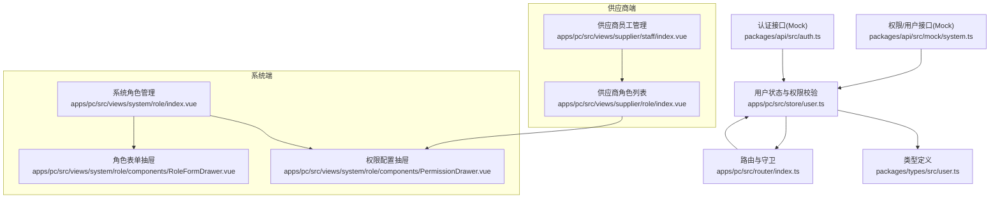
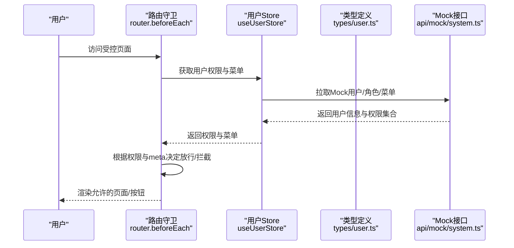
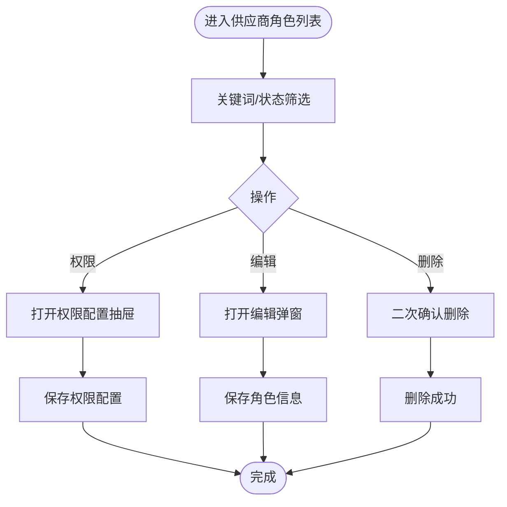
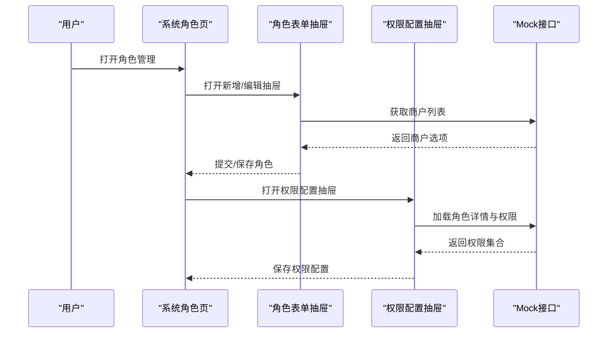
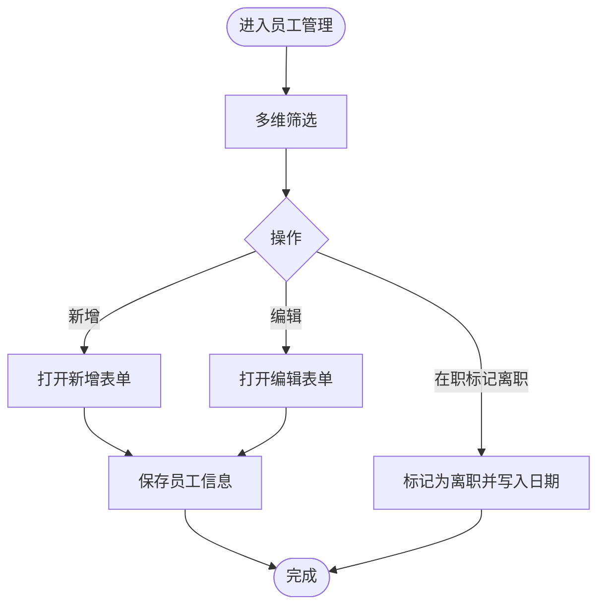
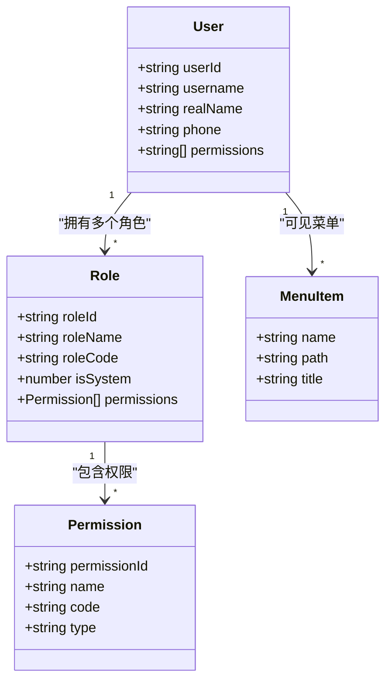
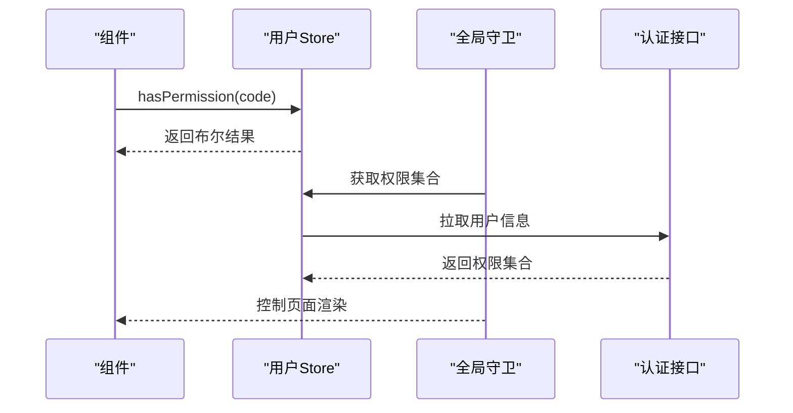
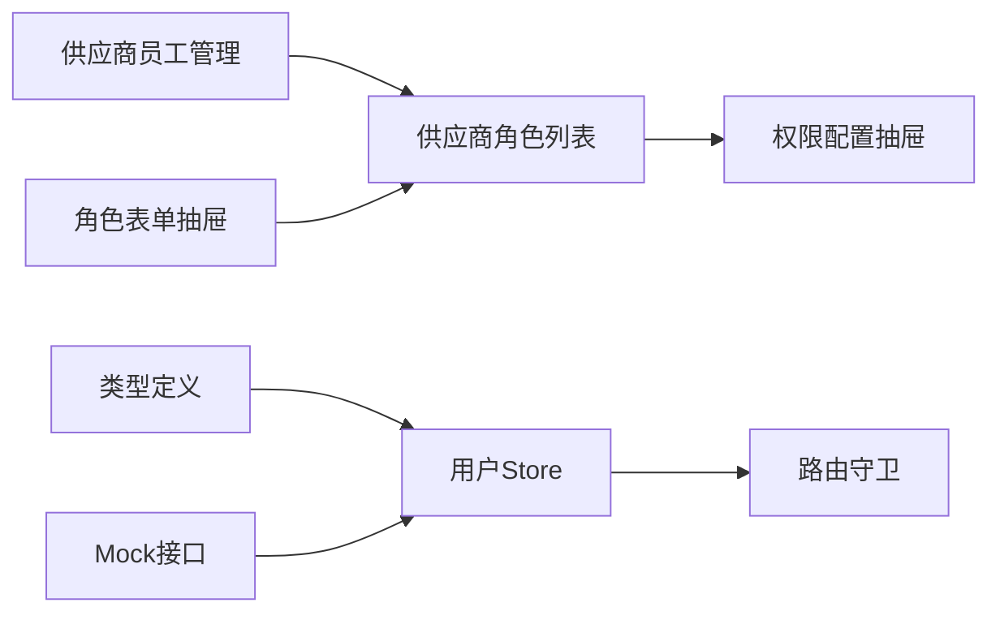

# 角色权限管理

<cite>
**本文引用的文件**
- [apps/pc/src/views/supplier/role/index.vue](file://apps/pc/src/views/supplier/role/index.vue)
- [apps/pc/src/views/system/role/components/RoleFormDrawer.vue](file://apps/pc/src/views/system/role/components/RoleFormDrawer.vue)
- [apps/pc/src/views/system/role/components/PermissionDrawer.vue](file://apps/pc/src/views/system/role/components/PermissionDrawer.vue)
- [apps/pc/src/views/supplier/staff/index.vue](file://apps/pc/src/views/supplier/staff/index.vue)
- [apps/pc/src/router/index.ts](file://apps/pc/src/router/index.ts)
- [apps/pc/src/store/user.ts](file://apps/pc/src/store/user.ts)
- [packages/types/src/user.ts](file://packages/types/src/user.ts)
- [packages/api/src/mock/system.ts](file://packages/api/src/mock/system.ts)
- [packages/api/src/auth.ts](file://packages/api/src/auth.ts)
- [docs/PRD/02-业务流程设计.md](file://docs/PRD/02-业务流程设计.md)
- [docs/供应商端产品PRD.md](file://docs/供应商端产品PRD.md)
</cite>

## 目录
1. [简介](#简介)
2. [项目结构](#项目结构)
3. [核心组件](#核心组件)
4. [架构总览](#架构总览)
5. [详细组件分析](#详细组件分析)
6. [依赖关系分析](#依赖关系分析)
7. [性能考量](#性能考量)
8. [故障排查指南](#故障排查指南)
9. [结论](#结论)
10. [附录](#附录)

## 简介
本文件围绕供应商端的角色权限管理体系进行系统化说明，覆盖角色管理（创建、编辑、删除、状态管理）、权限分配（功能权限、数据权限、操作权限）、员工管理（员工添加、角色分配、状态管理）、权限继承与控制机制，并结合前端权限模型与后端RBAC设计，给出权限矩阵、验证流程、变更操作及最佳实践与安全建议。

## 项目结构
供应商端权限相关功能主要分布在PC端前端页面与类型/接口定义中：
- 角色管理：供应商端“角色列表”页与系统端“角色管理”页均提供角色CRUD与权限配置能力
- 权限配置：通过树形权限抽屉进行功能权限勾选
- 员工管理：供应商端“员工管理”页支持员工信息维护与状态变更
- 权限模型：基于Pinia Store与路由守卫实现前端权限校验；类型定义明确用户、角色、权限、菜单等数据结构
- Mock数据：提供角色、菜单、用户等模拟数据，支撑开发与演示

图表来源
- [apps/pc/src/views/supplier/role/index.vue:1-282](file://apps/pc/src/views/supplier/role/index.vue#L1-L282)
- [apps/pc/src/views/system/role/components/RoleFormDrawer.vue:1-153](file://apps/pc/src/views/system/role/components/RoleFormDrawer.vue#L1-L153)
- [apps/pc/src/views/system/role/components/PermissionDrawer.vue:1-180](file://apps/pc/src/views/system/role/components/PermissionDrawer.vue#L1-L180)
- [apps/pc/src/views/supplier/staff/index.vue:1-462](file://apps/pc/src/views/supplier/staff/index.vue#L1-L462)
- [apps/pc/src/store/user.ts:1-112](file://apps/pc/src/store/user.ts#L1-L112)
- [apps/pc/src/router/index.ts:1-200](file://apps/pc/src/router/index.ts#L1-L200)
- [packages/types/src/user.ts:1-191](file://packages/types/src/user.ts#L1-L191)
- [packages/api/src/mock/system.ts:1-584](file://packages/api/src/mock/system.ts#L1-L584)
- [packages/api/src/auth.ts:105-125](file://packages/api/src/auth.ts#L105-L125)

章节来源
- [apps/pc/src/views/supplier/role/index.vue:1-282](file://apps/pc/src/views/supplier/role/index.vue#L1-L282)
- [apps/pc/src/views/system/role/components/RoleFormDrawer.vue:1-153](file://apps/pc/src/views/system/role/components/RoleFormDrawer.vue#L1-L153)
- [apps/pc/src/views/system/role/components/PermissionDrawer.vue:1-180](file://apps/pc/src/views/system/role/components/PermissionDrawer.vue#L1-L180)
- [apps/pc/src/views/supplier/staff/index.vue:1-462](file://apps/pc/src/views/supplier/staff/index.vue#L1-L462)
- [apps/pc/src/store/user.ts:1-112](file://apps/pc/src/store/user.ts#L1-L112)
- [apps/pc/src/router/index.ts:1-200](file://apps/pc/src/router/index.ts#L1-L200)
- [packages/types/src/user.ts:1-191](file://packages/types/src/user.ts#L1-L191)
- [packages/api/src/mock/system.ts:1-584](file://packages/api/src/mock/system.ts#L1-L584)
- [packages/api/src/auth.ts:105-125](file://packages/api/src/auth.ts#L105-L125)

## 核心组件
- 供应商角色列表页：提供角色查询、状态筛选、新增、编辑、删除、权限配置入口
- 系统角色管理页：面向平台侧，提供角色CRUD与权限配置
- 角色表单抽屉：支持选择所属商户（平台/租户），提交或保存角色
- 权限配置抽屉：以树形结构展示功能权限，支持勾选并保存
- 供应商员工管理页：提供员工信息维护、状态变更（在职/休假/离职）
- 用户状态与权限校验：统一存储用户信息、菜单与权限，提供hasPermission/hasPermissions方法
- 路由与守卫：基于meta与权限集合控制页面访问与按钮级渲染
- 类型定义：明确User、Role、Permission、Menu、UserRole等核心数据结构
- Mock数据与接口：提供角色、菜单、用户信息等模拟数据，支撑前后端联调

章节来源
- [apps/pc/src/views/supplier/role/index.vue:1-282](file://apps/pc/src/views/supplier/role/index.vue#L1-L282)
- [apps/pc/src/views/system/role/components/RoleFormDrawer.vue:1-153](file://apps/pc/src/views/system/role/components/RoleFormDrawer.vue#L1-L153)
- [apps/pc/src/views/system/role/components/PermissionDrawer.vue:1-180](file://apps/pc/src/views/system/role/components/PermissionDrawer.vue#L1-L180)
- [apps/pc/src/views/supplier/staff/index.vue:1-462](file://apps/pc/src/views/supplier/staff/index.vue#L1-L462)
- [apps/pc/src/store/user.ts:1-112](file://apps/pc/src/store/user.ts#L1-L112)
- [packages/types/src/user.ts:1-191](file://packages/types/src/user.ts#L1-L191)

## 架构总览
供应商端权限体系采用RBAC模型，前端通过Pinia Store缓存用户权限与菜单，配合路由守卫与组件内权限判断实现“按钮级/页面级/接口级”的权限控制。

图表来源
- [apps/pc/src/router/index.ts:775-790](file://apps/pc/src/router/index.ts#L775-L790)
- [apps/pc/src/store/user.ts:1-112](file://apps/pc/src/store/user.ts#L1-L112)
- [packages/types/src/user.ts:1-191](file://packages/types/src/user.ts#L1-L191)
- [packages/api/src/mock/system.ts:1-584](file://packages/api/src/mock/system.ts#L1-L584)

章节来源
- [apps/pc/src/router/index.ts:775-790](file://apps/pc/src/router/index.ts#L775-L790)
- [apps/pc/src/store/user.ts:1-112](file://apps/pc/src/store/user.ts#L1-L112)
- [packages/types/src/user.ts:1-191](file://packages/types/src/user.ts#L1-L191)
- [packages/api/src/mock/system.ts:1-584](file://packages/api/src/mock/system.ts#L1-L584)

## 详细组件分析

### 角色管理（供应商端）
- 功能点
  - 角色列表：支持关键词与状态筛选、分页、操作列（权限配置、编辑、删除）
  - 新增/编辑：弹窗输入角色名称、编码、描述、状态；编码在新建时可编辑，编辑时锁定
  - 删除：二次确认，系统内置角色不可删除
  - 权限配置：打开抽屉，勾选树形权限后保存
- 设计要点
  - 使用树形权限抽屉集中管理功能权限
  - isSystem字段用于标识系统内置角色，限制编辑/删除
  - 支持平台角色与商户角色区分（平台角色可管理所有商户数据）

图表来源
- [apps/pc/src/views/supplier/role/index.vue:1-282](file://apps/pc/src/views/supplier/role/index.vue#L1-L282)

章节来源
- [apps/pc/src/views/supplier/role/index.vue:1-282](file://apps/pc/src/views/supplier/role/index.vue#L1-L282)

### 角色管理（系统端）
- 功能点
  - 角色列表：支持分页与筛选
  - 角色表单抽屉：选择所属商户（平台/租户），提交或保存角色
  - 权限配置抽屉：加载角色已有权限，勾选后保存
- 设计要点
  - 通过getMerchantList提供商户选项
  - 通过getRoleDetail加载角色详情与权限集合
  - 保存时根据模式区分新增/编辑

图表来源
- [apps/pc/src/views/system/role/components/RoleFormDrawer.vue:1-153](file://apps/pc/src/views/system/role/components/RoleFormDrawer.vue#L1-L153)
- [apps/pc/src/views/system/role/components/PermissionDrawer.vue:1-180](file://apps/pc/src/views/system/role/components/PermissionDrawer.vue#L1-L180)
- [packages/api/src/mock/system.ts:1-584](file://packages/api/src/mock/system.ts#L1-L584)

章节来源
- [apps/pc/src/views/system/role/components/RoleFormDrawer.vue:1-153](file://apps/pc/src/views/system/role/components/RoleFormDrawer.vue#L1-L153)
- [apps/pc/src/views/system/role/components/PermissionDrawer.vue:1-180](file://apps/pc/src/views/system/role/components/PermissionDrawer.vue#L1-L180)
- [packages/api/src/mock/system.ts:1-584](file://packages/api/src/mock/system.ts#L1-L584)

### 员工管理（供应商端）
- 功能点
  - 员工列表：支持多维筛选（姓名/手机号/工号、部门、职位、在职状态）
  - 新增/编辑：表单收集基本信息、部门/职位、直属上级、入职日期、备注
  - 状态管理：在职状态下支持“标记为离职”，并记录离职日期
  - 导出：提供导出能力
- 设计要点
  - 在职状态与颜色/文本映射，便于直观识别
  - 离职流程：标记后写入离职工日期，后续可继续查询

图表来源
- [apps/pc/src/views/supplier/staff/index.vue:1-462](file://apps/pc/src/views/supplier/staff/index.vue#L1-L462)

章节来源
- [apps/pc/src/views/supplier/staff/index.vue:1-462](file://apps/pc/src/views/supplier/staff/index.vue#L1-L462)

### 权限验证与控制机制
- 前端权限模型
  - 用户Store缓存用户、菜单与权限集合
  - 提供hasPermission与hasPermissions方法，支持“*”通配符
  - 路由守卫根据权限与meta决定是否放行
- 权限矩阵
  - 功能权限：以权限码（如product:list、order:detail等）表示
  - 按钮级：未授权直接不渲染，避免“禁用态”
  - 页面级/接口级：未授权返回403，避免错误提示
- 权限继承
  - 平台角色可管理所有商户数据，商户角色仅能管理本商户数据
  - 系统内置角色（如超级管理员）不可禁用/删除

图表来源
- [packages/types/src/user.ts:1-191](file://packages/types/src/user.ts#L1-L191)
- [apps/pc/src/store/user.ts:1-112](file://apps/pc/src/store/user.ts#L1-L112)

章节来源
- [apps/pc/src/store/user.ts:1-112](file://apps/pc/src/store/user.ts#L1-L112)
- [packages/types/src/user.ts:1-191](file://packages/types/src/user.ts#L1-L191)
- [apps/pc/src/router/index.ts:775-790](file://apps/pc/src/router/index.ts#L775-L790)

### 权限矩阵与设计原则
- 权限矩阵（示例）
  - 商品管理：商品列表、新增商品、编辑商品、删除商品
  - 订单管理：订单列表、订单详情、导出订单
  - 财务管理：账单管理、结算管理
  - 系统管理：账号管理、角色管理
- 设计原则
  - “看不见即不存在”：未授权不渲染按钮/页面
  - 无权限处理：页面级/接口级统一返回403
  - 最小权限：平台角色与商户角色权限边界清晰

章节来源
- [apps/pc/src/views/supplier/role/index.vue:136-172](file://apps/pc/src/views/supplier/role/index.vue#L136-L172)
- [apps/pc/src/views/system/role/components/PermissionDrawer.vue:52-136](file://apps/pc/src/views/system/role/components/PermissionDrawer.vue#L52-L136)
- [apps/pc/src/views/merchant/list/index.vue:566-612](file://apps/pc/src/views/merchant/list/index.vue#L566-L612)

### 权限验证流程
- 登录后拉取用户信息与权限集合
- 路由守卫根据权限与meta决定是否放行
- 组件内使用hasPermission/hasPermissions进行按钮级渲染
- 接口层统一返回403，避免错误提示

图表来源
- [apps/pc/src/store/user.ts:93-99](file://apps/pc/src/store/user.ts#L93-L99)
- [apps/pc/src/router/index.ts:775-790](file://apps/pc/src/router/index.ts#L775-L790)
- [packages/api/src/auth.ts:109-117](file://packages/api/src/auth.ts#L109-L117)

章节来源
- [apps/pc/src/store/user.ts:93-99](file://apps/pc/src/store/user.ts#L93-L99)
- [apps/pc/src/router/index.ts:775-790](file://apps/pc/src/router/index.ts#L775-L790)
- [packages/api/src/auth.ts:109-117](file://packages/api/src/auth.ts#L109-L117)

### 权限变更操作
- 角色权限变更
  - 通过权限配置抽屉勾选/取消勾选对应权限码
  - 保存后刷新权限集合，重新渲染菜单与按钮
- 员工角色分配
  - 在员工管理页为员工分配角色（角色与用户的关系由UserRole定义）
  - 分配后刷新权限集合，确保新权限生效
- 状态管理
  - 角色：启用/禁用（系统内置角色不可禁用）
  - 员工：在职/休假/离职（离职后不再参与在职权限计算）

章节来源
- [apps/pc/src/views/system/role/components/PermissionDrawer.vue:147-170](file://apps/pc/src/views/system/role/components/PermissionDrawer.vue#L147-L170)
- [packages/types/src/user.ts:125-129](file://packages/types/src/user.ts#L125-L129)
- [docs/PRD/02-业务流程设计.md:1229-1266](file://docs/PRD/02-业务流程设计.md#L1229-L1266)
- [docs/供应商端产品PRD.md:1027-1042](file://docs/供应商端产品PRD.md#L1027-L1042)

## 依赖关系分析
- 组件耦合
  - 角色列表页与权限配置抽屉存在直接交互
  - 员工管理页与角色管理页通过用户与角色关联间接耦合
- 外部依赖
  - 类型定义提供统一的数据契约
  - Mock接口提供角色、菜单、用户信息，支撑前端开发
- 路由与权限
  - 路由守卫依赖用户Store中的权限集合
  - 组件内权限判断依赖Store提供的hasPermission/hasPermissions

图表来源
- [apps/pc/src/views/supplier/role/index.vue:1-282](file://apps/pc/src/views/supplier/role/index.vue#L1-L282)
- [apps/pc/src/views/system/role/components/RoleFormDrawer.vue:1-153](file://apps/pc/src/views/system/role/components/RoleFormDrawer.vue#L1-L153)
- [apps/pc/src/views/system/role/components/PermissionDrawer.vue:1-180](file://apps/pc/src/views/system/role/components/PermissionDrawer.vue#L1-L180)
- [apps/pc/src/views/supplier/staff/index.vue:1-462](file://apps/pc/src/views/supplier/staff/index.vue#L1-L462)
- [apps/pc/src/store/user.ts:1-112](file://apps/pc/src/store/user.ts#L1-L112)
- [packages/types/src/user.ts:1-191](file://packages/types/src/user.ts#L1-L191)
- [packages/api/src/mock/system.ts:1-584](file://packages/api/src/mock/system.ts#L1-L584)

章节来源
- [apps/pc/src/views/supplier/role/index.vue:1-282](file://apps/pc/src/views/supplier/role/index.vue#L1-L282)
- [apps/pc/src/views/system/role/components/RoleFormDrawer.vue:1-153](file://apps/pc/src/views/system/role/components/RoleFormDrawer.vue#L1-L153)
- [apps/pc/src/views/system/role/components/PermissionDrawer.vue:1-180](file://apps/pc/src/views/system/role/components/PermissionDrawer.vue#L1-L180)
- [apps/pc/src/views/supplier/staff/index.vue:1-462](file://apps/pc/src/views/supplier/staff/index.vue#L1-L462)
- [apps/pc/src/store/user.ts:1-112](file://apps/pc/src/store/user.ts#L1-L112)
- [packages/types/src/user.ts:1-191](file://packages/types/src/user.ts#L1-L191)
- [packages/api/src/mock/system.ts:1-584](file://packages/api/src/mock/system.ts#L1-L584)

## 性能考量
- 前端权限判断
  - hasPermission/hasPermissions为O(n)匹配，建议在高频场景下缓存权限集合
- 列表与筛选
  - 员工管理页本地筛选适合小规模数据；大规模数据建议后端分页与筛选
- 菜单与权限加载
  - 登录后一次性拉取权限集合，避免重复请求
- 抽屉与树形权限
  - 权限树默认展开，建议在大数据量时考虑懒加载或虚拟滚动

## 故障排查指南
- 问题：按钮不显示或页面无法访问
  - 检查用户Store中的permissions是否包含所需权限码
  - 确认路由守卫逻辑与meta配置
- 问题：权限配置保存后无效
  - 确认权限配置抽屉已正确加载角色权限
  - 检查保存流程是否触发权限集合刷新
- 问题：员工状态变更未生效
  - 确认在职状态变更逻辑与离职日期写入
  - 检查是否需要重新登录以刷新权限集合

章节来源
- [apps/pc/src/store/user.ts:93-99](file://apps/pc/src/store/user.ts#L93-L99)
- [apps/pc/src/router/index.ts:775-790](file://apps/pc/src/router/index.ts#L775-L790)
- [apps/pc/src/views/system/role/components/PermissionDrawer.vue:159-170](file://apps/pc/src/views/system/role/components/PermissionDrawer.vue#L159-L170)
- [apps/pc/src/views/supplier/staff/index.vue:436-440](file://apps/pc/src/views/supplier/staff/index.vue#L436-L440)

## 结论
本权限体系以RBAC为核心，前端通过Store与路由守卫实现严格的权限控制，辅以树形权限抽屉与员工管理页，形成从角色到用户的完整权限闭环。平台角色与商户角色的权限边界清晰，系统内置角色的安全保护有效防止误操作。建议在生产环境中完善后端权限校验与审计日志，持续优化权限加载与渲染性能。

## 附录
- 最佳实践
  - 采用最小权限原则，避免授予不必要的权限
  - 对敏感操作增加二次确认与操作审计
  - 定期清理失效角色与权限，保持权限矩阵简洁
- 安全建议
  - 超级管理员账号不可禁用/删除
  - 严格区分平台角色与商户角色的数据访问范围
  - 接口层统一403响应，避免泄露内部错误信息

章节来源
- [docs/PRD/02-业务流程设计.md:1229-1266](file://docs/PRD/02-业务流程设计.md#L1229-L1266)
- [docs/供应商端产品PRD.md:1027-1042](file://docs/供应商端产品PRD.md#L1027-L1042)