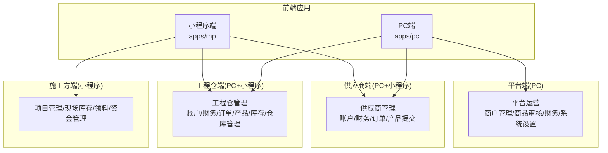
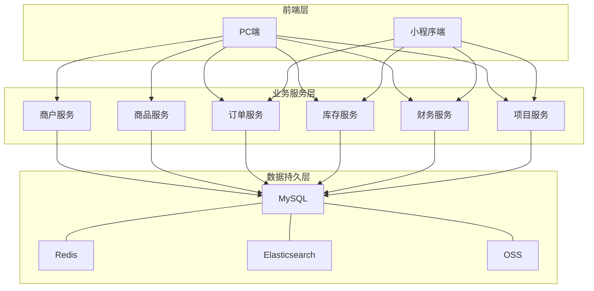
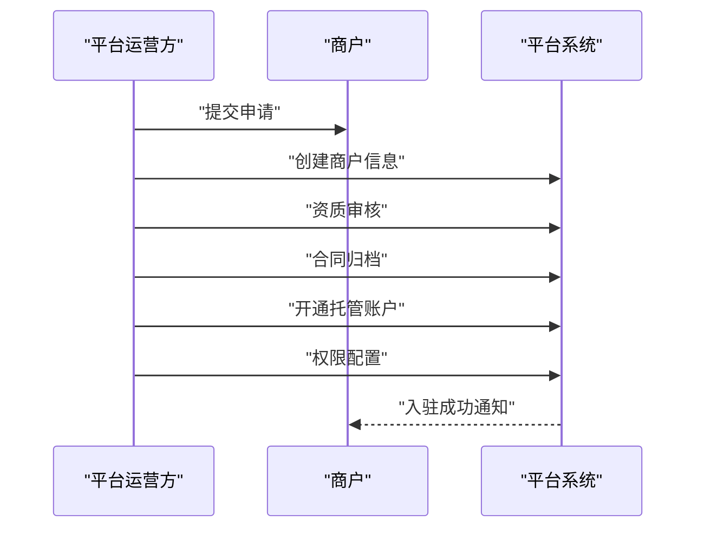
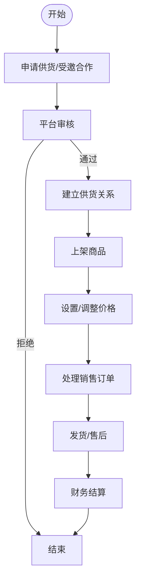
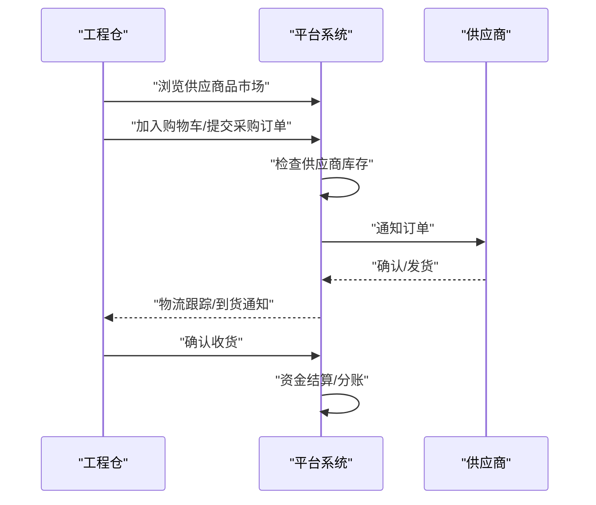
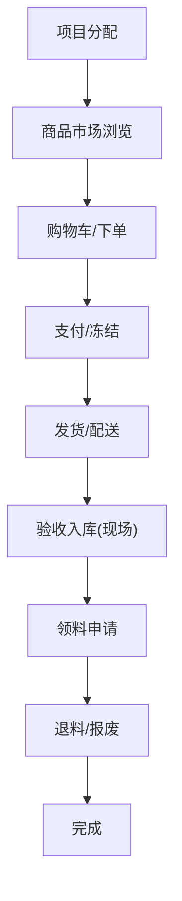
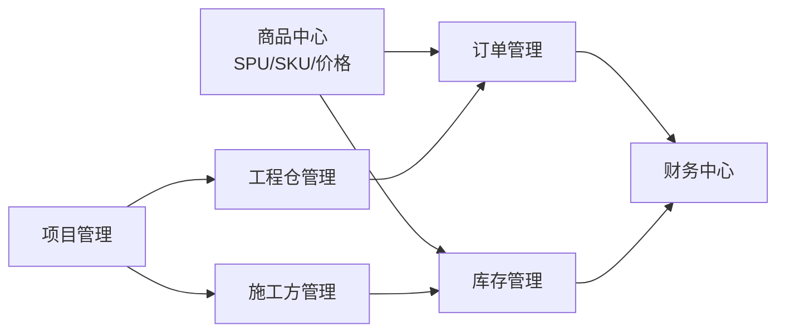

# 供应链管理

<cite>
**本文引用的文件**   
- [01-系统概览与架构.md](file://docs/PRD/01-系统概览与架构.md)
- [02-业务流程设计.md](file://docs/PRD/02-业务流程设计.md)
- [03-数据模型与表结构.md](file://docs/PRD/03-数据模型与表结构.md)
- [06-商品板块功能清单.md](file://docs/PRD/06-商品板块功能清单.md)
- [13-供应商供货与工程仓配置功能详细设计.md](file://docs/PRD/13-供应商供货与工程仓配置功能详细设计.md)
- [18-SPU管理功能详细设计.md](file://docs/PRD/18-SPU管理功能详细设计.md)
- [工程仓端功能清单_带优先级.csv](file://docs/旧资料/工程仓端功能清单_带优先级.csv)
- [平台端功能清单_带优先级.csv](file://docs/旧资料/平台端功能清单_带优先级.csv)
- [供应商端功能清单_带优先级.csv](file://docs/旧资料/供应商端功能清单_带优先级.csv)
- [施工方端功能清单.csv](file://docs/旧资料/施工方端功能清单.csv)
- [项目功能排期_四端汇总.csv](file://docs/旧资料/项目功能排期_四端汇总.csv)
- [项目功能排期_按代码实际页面_完整版.csv](file://docs/旧资料/项目功能排期_按代码实际页面_完整版.csv)
- [mp/pages/index/index.vue](file://apps/mp/src/pages/index/index.vue)
- [mp/pages/market/index.vue](file://apps/mp/src/pages/market/index.vue)
- [pc/views/merchant/list/index.vue](file://apps/pc/src/views/merchant/list/index.vue)
- [pc/views/merchant/detail/index.vue](file://apps/pc/src/views/merchant/detail/index.vue)
- [pc/views/merchant/contract/index.vue](file://apps/pc/src/views/merchant/contract/index.vue)
- [pc/views/supplier/account/index.vue](file://apps/pc/src/views/supplier/account/index.vue)
- [pc/views/supplier/product-submit/index.vue](file://apps/pc/src/views/supplier/product-submit/index.vue)
- [pc/views/warehouse/dashboard/index.vue](file://apps/pc/src/views/warehouse/dashboard/index.vue)
- [pc/views/warehouse/finance/account/index.vue](file://apps/pc/src/views/warehouse/finance/account/index.vue)
- [pc/views/warehouse/order/purchase/index.vue](file://apps/pc/src/views/warehouse/order/purchase/index.vue)
- [pc/views/warehouse/product/list/index.vue](file://apps/pc/src/views/warehouse/product/list/index.vue)
- [pc/views/warehouse/stock/index.vue](file://apps/pc/src/views/warehouse/stock/index.vue)
- [pc/views/warehouse/warehouse/list/index.vue](file://apps/pc/src/views/warehouse/warehouse/list/index.vue)
</cite>

## 目录
1. [引言](#引言)
2. [项目结构](#项目结构)
3. [核心组件](#核心组件)
4. [架构总览](#架构总览)
5. [详细组件分析](#详细组件分析)
6. [依赖分析](#依赖分析)
7. [性能考虑](#性能考虑)
8. [故障排查指南](#故障排查指南)
9. [结论](#结论)
10. [附录](#附录)

## 引言
本文件面向供应链管理（工程材料采供一体化平台），围绕“商户管理、供应商管理、工程仓管理”三大核心模块，结合PRD文档与前端页面布局，系统阐述业务流程、操作步骤、数据模型、权限控制、异常处理与协同效率提升方法。目标是帮助研发、测试与运营人员快速理解系统设计与落地实现，支撑高效协作与持续迭代。

## 项目结构
- 四端架构：平台端（PC）、供应商端（PC+小程序）、工程仓端（PC+小程序）、施工方端（小程序）
- 前端应用：apps/mp（小程序）、apps/pc（PC端）
- 文档体系：PRD文档（系统概览、业务流程、数据模型、模块设计等）与历史功能清单CSV

**图表来源**
- [01-系统概览与架构.md:62-117](file://docs/PRD/01-系统概览与架构.md#L62-L117)

**章节来源**
- [01-系统概览与架构.md:11-134](file://docs/PRD/01-系统概览与架构.md#L11-L134)

## 核心组件
- 商户管理（平台端）：商户入驻、资质审核、合同管理、员工管理、商户状态流转
- 供应商管理（供应商端）：账户与财务、订单处理、产品提交（SPU/SKU）、供货关系与协议
- 工程仓管理（工程仓端）：账户与财务、采购/销售订单、商品与库存、仓库管理、项目管理
- 施工方管理（小程序端）：项目管理、现场库存、领料、资金管理、消息中心

**章节来源**
- [01-系统概览与架构.md:137-383](file://docs/PRD/01-系统概览与架构.md#L137-L383)
- [02-业务流程设计.md:76-273](file://docs/PRD/02-业务流程设计.md#L76-L273)

## 架构总览
系统采用“四端一体”的多端架构，业务服务层与数据持久层分离，支持平台运营、供应商、工程仓、施工方的协同作业与资金托管。

**图表来源**
- [01-系统概览与架构.md:62-117](file://docs/PRD/01-系统概览与架构.md#L62-L117)

**章节来源**
- [01-系统概览与架构.md:62-117](file://docs/PRD/01-系统概览与架构.md#L62-L117)

## 详细组件分析

### 商户管理（平台端）
- 功能要点
  - 商户入驻：提交申请、平台审核、资质校验、合同归档、账户开通与权限配置
  - 商户状态：待审核、审核通过、审核拒绝、已冻结、正常运营、已停用、已注销
  - 合同管理：合同创建、电子签章、状态管理、归档
  - 资质管理：上传证照、审核、有效期管理
  - 员工管理：角色权限、菜单配置
- 业务流程（平台视角）
  - 商户申请 → 平台审核 → 资质校验 → 合同签署 → 账户开通 → 权限下发
- 数据模型
  - 商户主体、供应商、工程仓、施工方、合同、员工等实体
- 权限控制
  - RBAC：用户、角色、菜单、权限、员工
- 异常处理
  - 审核拒绝、资质不匹配、合同冲突、账户状态异常

**图表来源**
- [02-业务流程设计.md:76-200](file://docs/PRD/02-业务流程设计.md#L76-L200)

**章节来源**
- [02-业务流程设计.md:76-273](file://docs/PRD/02-业务流程设计.md#L76-L273)
- [03-数据模型与表结构.md:163-238](file://docs/PRD/03-数据模型与表结构.md#L163-L238)

### 供应商管理（供应商端）
- 功能要点
  - 账户与财务：托管账户、充值/提现、账单、流水、结算
  - 订单处理：销售订单确认、发货、售后
  - 产品提交：SPU/SKU管理、价格设置、库存维护、商品状态管理
  - 供货关系与协议：工程仓邀请/申请、供货商品管理、价格调整、协议签署与终止
- 业务流程（供应商视角）
  - 申请供货/受邀合作 → 平台审核 → 建立供货关系 → 上架商品 → 价格管理 → 订单履约 → 财务结算
- 数据模型
  - 供应商、供应价格、商品SPU/SKU、订单、资金流水、结算、合同等
- 权限控制
  - 供应商角色仅可见自身商户数据与相关业务
- 异常处理
  - 价格调整冲突、库存不足、订单取消/拒单、协议终止

**图表来源**
- [13-供应商供货与工程仓配置功能详细设计.md:39-156](file://docs/PRD/13-供应商供货与工程仓配置功能详细设计.md#L39-L156)

**章节来源**
- [13-供应商供货与工程仓配置功能详细设计.md:159-790](file://docs/PRD/13-供应商供货与工程仓配置功能详细设计.md#L159-L790)
- [18-SPU管理功能详细设计.md:122-554](file://docs/PRD/18-SPU管理功能详细设计.md#L122-L554)

### 工程仓管理（工程仓端）
- 功能要点
  - 账户与财务：托管账户、充值/提现、账单、流水、结算、发票
  - 采购/销售订单：下单、确认、发货、收货、售后、对账
  - 商品与库存：商品市场、BOM包、库存查询/调整/盘点、现场库存
  - 仓库管理：仓库配置、出入库、调拨、批次管理
  - 项目管理：项目创建、成员、预算、进度、结算
- 业务流程（工程仓视角）
  - 项目创建 → 供应商管理 → 商品市场采购/销售 → 订单履约 → 库存管理 → 财务结算
- 数据模型
  - 工程仓、仓库、订单、库存、批次、项目、资金流水、结算、发票等
- 权限控制
  - 工程仓角色仅可见本工程仓数据与相关业务
- 异常处理
  - 库存不足、订单拒单、收货异常、结算异常

**图表来源**
- [02-业务流程设计.md:383-495](file://docs/PRD/02-业务流程设计.md#L383-L495)

**章节来源**
- [02-业务流程设计.md:383-622](file://docs/PRD/02-业务流程设计.md#L383-L622)
- [06-商品板块功能清单.md:129-200](file://docs/PRD/06-商品板块功能清单.md#L129-L200)

### 施工方管理（小程序端）
- 功能要点
  - 项目管理：项目列表、详情、进度更新、预算查看
  - 采购管理：商品市场浏览、BOM包采购、购物车、下单
  - 订单管理：订单列表、详情、跟踪、确认收货
  - 现场库存：库存查看、盘点、预警、统计
  - 领料管理：领料申请、退料、报废、记录
  - 财务管理：资金概览、交易记录、充值/提现、发票
  - 消息中心：系统通知、订单消息、审批消息
- 业务流程（施工方视角）
  - 项目分配 → 采购下单 → 发货配送 → 验收入库 → 领料使用 → 退料/报废
- 数据模型
  - 施工方、项目、现场库存、领料单、资金流水等
- 权限控制
  - 施工方角色仅可见其项目与现场库存数据
- 异常处理
  - 领料异常、退料/报废审批、库存差异

**图表来源**
- [02-业务流程设计.md:498-622](file://docs/PRD/02-业务流程设计.md#L498-L622)

**章节来源**
- [02-业务流程设计.md:442-472](file://docs/PRD/02-业务流程设计.md#L442-L472)

## 依赖分析
- 模块耦合
  - 商品中心（SPU/SKU/价格）与订单、库存强耦合
  - 财务中心（托管账户、流水、结算）贯穿订单与库存
  - 项目管理与工程仓/施工方库存、订单紧密关联
- 外部依赖
  - 资金托管与结算（第三方支付/银行）
  - 物流跟踪（第三方物流接口）
  - 发票管理（税务/电子发票）
- 权限与数据隔离
  - 四端角色权限矩阵清晰，避免跨端越权访问

**图表来源**
- [01-系统概览与架构.md:137-209](file://docs/PRD/01-系统概览与架构.md#L137-L209)

**章节来源**
- [01-系统概览与架构.md:137-209](file://docs/PRD/01-系统概览与架构.md#L137-L209)

## 性能考虑
- 前端性能
  - 列表分页、图片懒加载、CDN加速
  - 缓存策略：分类树、SPU详情、属性列表
- 后端性能
  - 索引优化：SPU名称/编码、分类ID；订单编号、状态、时间
  - 批量接口：批量价格调整、批量补货、批量库存盘点
  - 异步任务：结算、对账、发票推送
- 数据一致性
  - 订单状态机、库存锁定/扣减、资金冻结/解冻
  - 事务边界明确，异常回滚与补偿机制

[本节为通用指导，无需具体文件引用]

## 故障排查指南
- 常见问题
  - 商户入驻失败：资质不匹配、证照过期、合同未归档
  - 供应商供货异常：价格冲突、库存不足、协议终止
  - 工程仓订单异常：拒单、超时未确认、收货异常
  - 施工方领料异常：审批未通过、退料/报废不合规
- 排查步骤
  - 核对状态流转日志（订单/库存/资金）
  - 检查权限矩阵与角色配置
  - 核对合同/协议/价格生效时间
  - 检查第三方接口（支付/物流/发票）
- 建议
  - 增加可观测性（埋点/日志/告警）
  - 完善自动化测试与回归用例
  - 建立应急预案与回滚机制

**章节来源**
- [03-数据模型与表结构.md:740-794](file://docs/PRD/03-数据模型与表结构.md#L740-L794)

## 结论
本供应链管理方案以“四端协同、数据驱动、流程闭环”为核心，通过商户管理、供应商管理、工程仓管理与施工方管理的协同，实现从“商户入驻—商品上架—订单履约—资金结算—库存管理—项目协同”的全链路闭环。建议在后续迭代中持续完善权限矩阵、强化异常处理与可观测性，并通过批量接口与缓存策略提升整体性能与用户体验。

[本节为总结性内容，无需具体文件引用]

## 附录

### 供应链协同最佳实践
- 供应商侧
  - 建立标准化SPU/SKU模板，统一规格属性
  - 定期校准供货价格与库存，保障市场一致性
  - 与工程仓建立协议与配额机制，降低波动风险
- 工程仓侧
  - 基于项目预算与进度制定采购计划，减少缺货与积压
  - 利用BOM包与批量补货，提升采购效率
  - 强化库存预警与盘点，确保账实一致
- 施工方侧
  - 规范领料流程与退料/报废审批，降低损耗
  - 建立现场库存可视化，提升现场作业效率
- 平台侧
  - 完善风控与审计（资金冻结/解冻、合同归档、操作日志）
  - 提供数据分析看板（销售/采购/库存/财务报表）

[本节为通用指导，无需具体文件引用]

### 功能清单与排期参考
- 平台端功能清单（带优先级）
- 供应商端功能清单（带优先级）
- 工程仓端功能清单（带优先级）
- 施工方端功能清单
- 四端汇总与按页面实际排期

**章节来源**
- [平台端功能清单_带优先级.csv](file://docs/旧资料/平台端功能清单_带优先级.csv)
- [供应商端功能清单_带优先级.csv](file://docs/旧资料/供应商端功能清单_带优先级.csv)
- [工程仓端功能清单_带优先级.csv](file://docs/旧资料/工程仓端功能清单_带优先级.csv)
- [施工方端功能清单.csv](file://docs/旧资料/施工方端功能清单.csv)
- [项目功能排期_四端汇总.csv](file://docs/旧资料/项目功能排期_四端汇总.csv)
- [项目功能排期_按代码实际页面_完整版.csv](file://docs/旧资料/项目功能排期_按代码实际页面_完整版.csv)

### 前端页面映射（示例）
- 商户管理（平台端）
  - 商户列表：apps/pc/views/merchant/list/index.vue
  - 商户详情：apps/pc/views/merchant/detail/index.vue
  - 合同管理：apps/pc/views/merchant/contract/index.vue
- 供应商管理（供应商端）
  - 账户首页：apps/pc/views/supplier/account/index.vue
  - 产品提交：apps/pc/views/supplier/product-submit/index.vue
- 工程仓管理（工程仓端）
  - 工作台：apps/pc/views/warehouse/dashboard/index.vue
  - 财务账户：apps/pc/views/warehouse/finance/account/index.vue
  - 采购订单：apps/pc/views/warehouse/order/purchase/index.vue
  - 商品列表：apps/pc/views/warehouse/product/list/index.vue
  - 库存：apps/pc/views/warehouse/stock/index.vue
  - 仓库列表：apps/pc/views/warehouse/warehouse/list/index.vue
- 小程序端
  - 首页：apps/mp/src/pages/index/index.vue
  - 商品市场：apps/mp/src/pages/market/index.vue

**章节来源**
- [apps/pc/views/merchant/list/index.vue](file://apps/pc/src/views/merchant/list/index.vue)
- [apps/pc/views/merchant/detail/index.vue](file://apps/pc/src/views/merchant/detail/index.vue)
- [apps/pc/views/merchant/contract/index.vue](file://apps/pc/src/views/merchant/contract/index.vue)
- [apps/pc/views/supplier/account/index.vue](file://apps/pc/src/views/supplier/account/index.vue)
- [apps/pc/views/supplier/product-submit/index.vue](file://apps/pc/src/views/supplier/product-submit/index.vue)
- [apps/pc/views/warehouse/dashboard/index.vue](file://apps/pc/src/views/warehouse/dashboard/index.vue)
- [apps/pc/views/warehouse/finance/account/index.vue](file://apps/pc/src/views/warehouse/finance/account/index.vue)
- [apps/pc/views/warehouse/order/purchase/index.vue](file://apps/pc/src/views/warehouse/order/purchase/index.vue)
- [apps/pc/views/warehouse/product/list/index.vue](file://apps/pc/src/views/warehouse/product/list/index.vue)
- [apps/pc/views/warehouse/stock/index.vue](file://apps/pc/src/views/warehouse/stock/index.vue)
- [apps/pc/views/warehouse/warehouse/list/index.vue](file://apps/pc/src/views/warehouse/warehouse/list/index.vue)
- [apps/mp/src/pages/index/index.vue](file://apps/mp/src/pages/index/index.vue)
- [apps/mp/src/pages/market/index.vue](file://apps/mp/src/pages/market/index.vue)