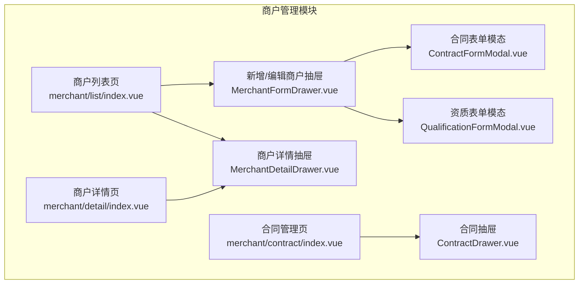
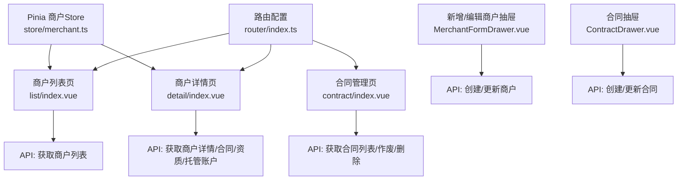
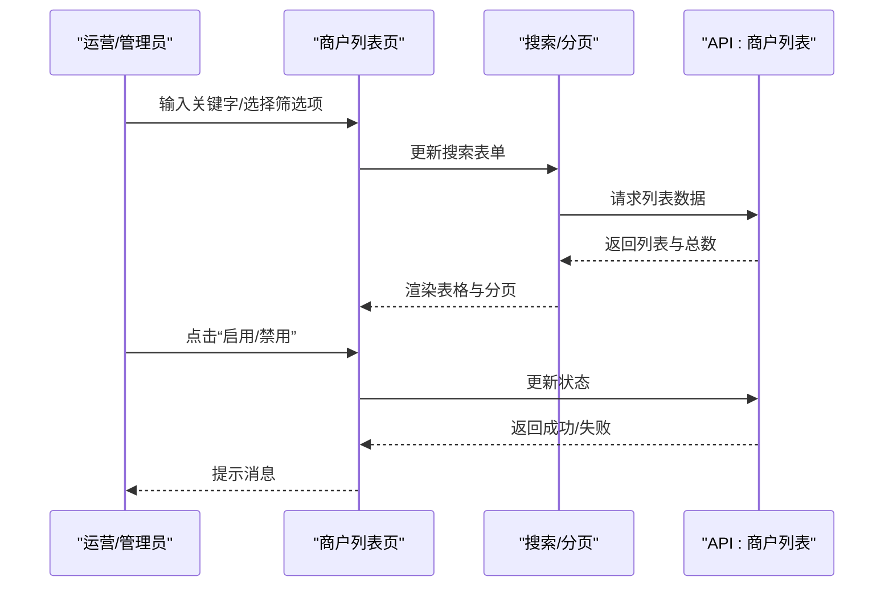
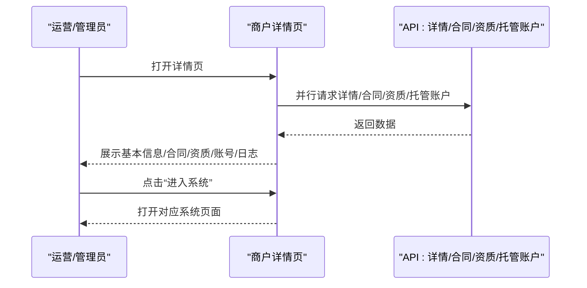
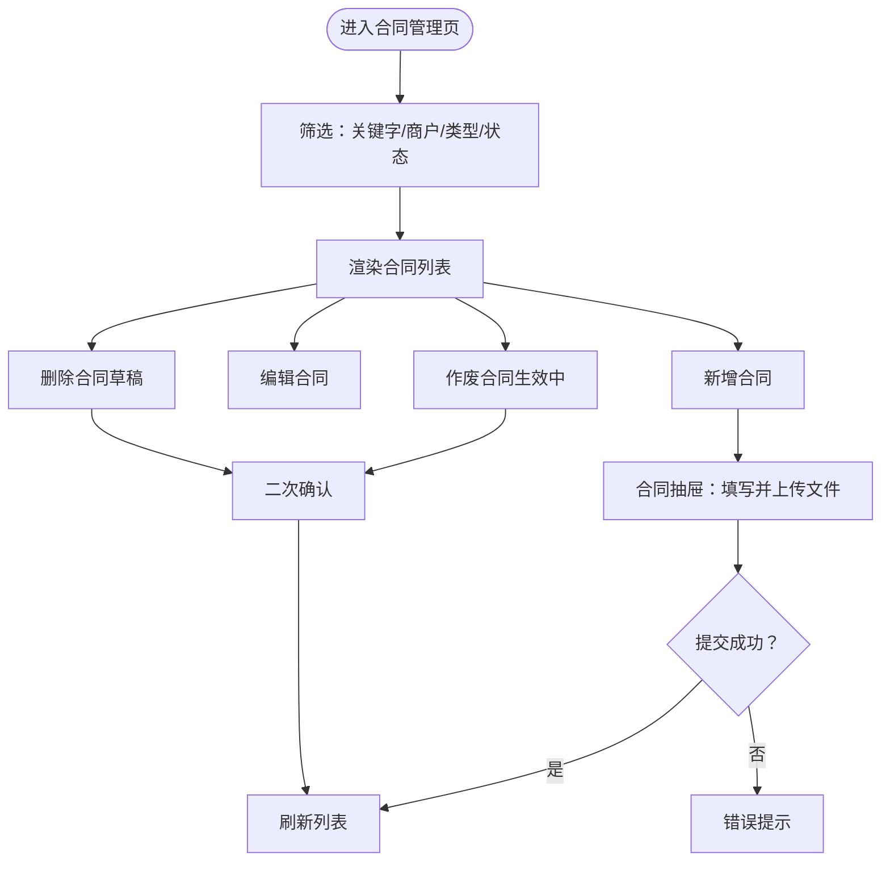
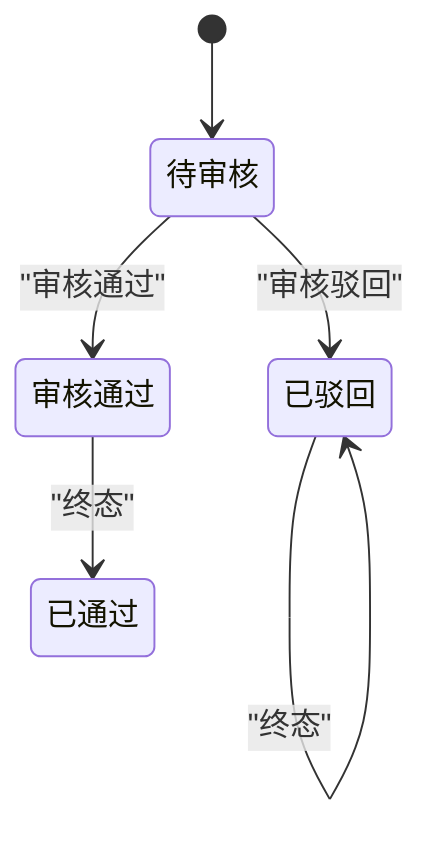
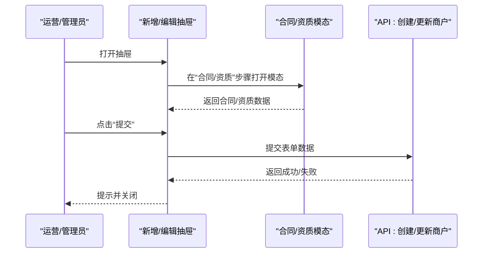
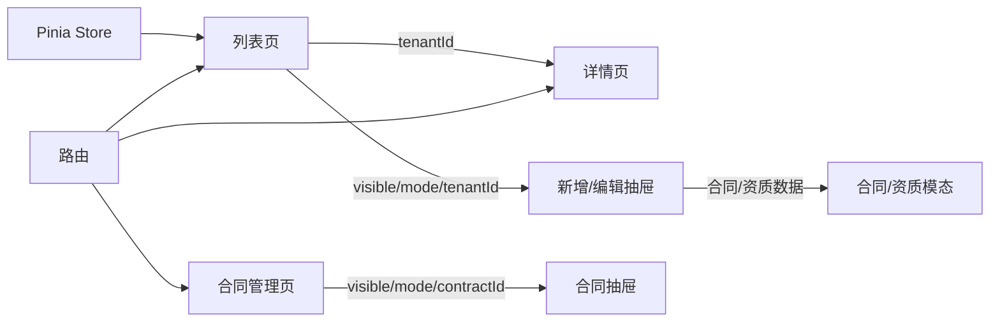

# 商户管理

<cite>
**本文引用的文件**
- [apps/pc/src/views/merchant/list/index.vue](file://apps/pc/src/views/merchant/list/index.vue)
- [apps/pc/src/views/merchant/detail/index.vue](file://apps/pc/src/views/merchant/detail/index.vue)
- [apps/pc/src/views/merchant/contract/index.vue](file://apps/pc/src/views/merchant/contract/index.vue)
- [apps/pc/src/views/merchant/list/components/MerchantFormDrawer.vue](file://apps/pc/src/views/merchant/list/components/MerchantFormDrawer.vue)
- [apps/pc/src/views/merchant/list/components/MerchantDetailDrawer.vue](file://apps/pc/src/views/merchant/list/components/MerchantDetailDrawer.vue)
- [apps/pc/src/views/merchant/contract/components/ContractDrawer.vue](file://apps/pc/src/views/merchant/contract/components/ContractDrawer.vue)
- [apps/pc/src/views/merchant/list/components/ContractFormModal.vue](file://apps/pc/src/views/merchant/list/components/ContractFormModal.vue)
- [apps/pc/src/views/merchant/list/components/QualificationFormModal.vue](file://apps/pc/src/views/merchant/list/components/QualificationFormModal.vue)
- [apps/pc/src/store/merchant.ts](file://apps/pc/src/store/merchant.ts)
- [apps/pc/src/router/index.ts](file://apps/pc/src/router/index.ts)
</cite>

## 目录
1. [简介](#简介)
2. [项目结构](#项目结构)
3. [核心组件](#核心组件)
4. [架构总览](#架构总览)
5. [详细组件分析](#详细组件分析)
6. [依赖分析](#依赖分析)
7. [性能考虑](#性能考虑)
8. [故障排查指南](#故障排查指南)
9. [结论](#结论)
10. [附录](#附录)

## 简介
本文件面向“商户管理”功能，围绕以下核心能力进行系统化说明：
- 商户列表管理：信息展示、搜索筛选、批量操作（含启用/禁用、删除、进入系统）
- 商户详情管理：基本信息查看、编辑、状态管理；合同、资质、账号、日志等子页集成
- 商户合同管理：合同创建、审核、到期提醒、状态流转
- 商户资质管理：资质上传、审核、有效期管理
- 商户入驻流程：从提交申请到入驻完成的流程化管理
- 权限分配与业务规则：角色权限矩阵、状态机与禁用联动
- 最佳实践与风险控制：字段校验、上传限制、作废与删除策略、审计日志

## 项目结构
商户管理相关页面与组件主要位于 PC 端应用的 merchant 模块，包含：
- 列表页：商户列表、搜索筛选、批量操作
- 详情页：基本信息、合同、资质、账号、日志等
- 合同管理页：合同列表、新增/编辑/作废/删除
- 抽屉与模态组件：用于新增/编辑商户、查看详情、添加合同/资质

图表来源
- [apps/pc/src/views/merchant/list/index.vue:1-731](file://apps/pc/src/views/merchant/list/index.vue#L1-L731)
- [apps/pc/src/views/merchant/detail/index.vue:1-669](file://apps/pc/src/views/merchant/detail/index.vue#L1-L669)
- [apps/pc/src/views/merchant/contract/index.vue:1-407](file://apps/pc/src/views/merchant/contract/index.vue#L1-L407)
- [apps/pc/src/views/merchant/list/components/MerchantFormDrawer.vue:1-524](file://apps/pc/src/views/merchant/list/components/MerchantFormDrawer.vue#L1-L524)
- [apps/pc/src/views/merchant/list/components/MerchantDetailDrawer.vue:1-343](file://apps/pc/src/views/merchant/list/components/MerchantDetailDrawer.vue#L1-L343)
- [apps/pc/src/views/merchant/contract/components/ContractDrawer.vue:1-214](file://apps/pc/src/views/merchant/contract/components/ContractDrawer.vue#L1-L214)
- [apps/pc/src/views/merchant/list/components/ContractFormModal.vue:1-122](file://apps/pc/src/views/merchant/list/components/ContractFormModal.vue#L1-L122)
- [apps/pc/src/views/merchant/list/components/QualificationFormModal.vue:1-134](file://apps/pc/src/views/merchant/list/components/QualificationFormModal.vue#L1-L134)

章节来源
- [apps/pc/src/views/merchant/list/index.vue:1-731](file://apps/pc/src/views/merchant/list/index.vue#L1-L731)
- [apps/pc/src/views/merchant/detail/index.vue:1-669](file://apps/pc/src/views/merchant/detail/index.vue#L1-L669)
- [apps/pc/src/views/merchant/contract/index.vue:1-407](file://apps/pc/src/views/merchant/contract/index.vue#L1-L407)

## 核心组件
- 商户列表页：提供搜索筛选、分页、批量操作（启用/禁用、删除、进入系统），并支持打开“新增商户”抽屉与“商户详情抽屉”
- 商户详情页：集中展示商户基本信息、主体信息、结算账户、合同、资质、账号、日志等
- 合同管理页：提供合同列表、筛选、新增/编辑/作废/删除
- 新增/编辑商户抽屉：分步表单，支持基础信息、主体信息、结算账户、合同、资质的录入与保存
- 合同抽屉：合同新增/编辑/查看，支持文件上传与生效期配置
- 合同/资质表单模态：用于在新增商户时快速添加合同与资质

章节来源
- [apps/pc/src/views/merchant/list/index.vue:57-122](file://apps/pc/src/views/merchant/list/index.vue#L57-L122)
- [apps/pc/src/views/merchant/detail/index.vue:132-339](file://apps/pc/src/views/merchant/detail/index.vue#L132-L339)
- [apps/pc/src/views/merchant/contract/index.vue:36-88](file://apps/pc/src/views/merchant/contract/index.vue#L36-L88)
- [apps/pc/src/views/merchant/list/components/MerchantFormDrawer.vue:1-524](file://apps/pc/src/views/merchant/list/components/MerchantFormDrawer.vue#L1-L524)
- [apps/pc/src/views/merchant/contract/components/ContractDrawer.vue:1-214](file://apps/pc/src/views/merchant/contract/components/ContractDrawer.vue#L1-L214)

## 架构总览
商户管理功能由“页面 + 抽屉/模态 + Store + 路由”构成，数据通过 API 获取与提交，状态通过 Pinia Store 管理。

图表来源
- [apps/pc/src/views/merchant/list/index.vue:630-725](file://apps/pc/src/views/merchant/list/index.vue#L630-L725)
- [apps/pc/src/views/merchant/detail/index.vue:401-435](file://apps/pc/src/views/merchant/detail/index.vue#L401-L435)
- [apps/pc/src/views/merchant/contract/index.vue:338-401](file://apps/pc/src/views/merchant/contract/index.vue#L338-L401)
- [apps/pc/src/views/merchant/list/components/MerchantFormDrawer.vue:457-474](file://apps/pc/src/views/merchant/list/components/MerchantFormDrawer.vue#L457-L474)
- [apps/pc/src/views/merchant/contract/components/ContractDrawer.vue:175-204](file://apps/pc/src/views/merchant/contract/components/ContractDrawer.vue#L175-L204)
- [apps/pc/src/store/merchant.ts:1-49](file://apps/pc/src/store/merchant.ts#L1-L49)
- [apps/pc/src/router/index.ts:31-55](file://apps/pc/src/router/index.ts#L31-L55)

## 详细组件分析

### 商户列表管理
- 搜索筛选：支持关键字（商户名称/联系人/联系电话）、商户类型、入驻状态、启用状态；下拉筛选即时生效，清空自动刷新
- 表格列：租户ID、商户名称（点击跳转详情）、商户类型（Tag）、联系人、联系电话、入驻状态（Tag）、启用状态（Switch）、创建时间、操作列（查看/编辑/合同/账号/进入系统/删除）
- 批量操作：启用/禁用（Switch，仅入驻状态为“已通过”时可用）、删除（二次确认）、进入系统（超管权限）

图表来源
- [apps/pc/src/views/merchant/list/index.vue:647-725](file://apps/pc/src/views/merchant/list/index.vue#L647-L725)

章节来源
- [apps/pc/src/views/merchant/list/index.vue:57-122](file://apps/pc/src/views/merchant/list/index.vue#L57-L122)
- [apps/pc/src/views/merchant/list/index.vue:630-725](file://apps/pc/src/views/merchant/list/index.vue#L630-L725)

### 商户详情管理
- 顶部卡片：商户身份、入驻审核、系统状态（Switch）、资金托管余额
- 入驻流程：当入驻状态非“已通过”时展示流程步骤（提交申请/平台审核/开通账户/入驻完成）
- 子标签页：基本信息（基础信息/主体信息/结算账户）、合同信息、资质信息、账号管理、操作日志
- 操作：编辑（跳转列表编辑模式）、进入系统（根据商户类型打开对应系统）

图表来源
- [apps/pc/src/views/merchant/detail/index.vue:401-435](file://apps/pc/src/views/merchant/detail/index.vue#L401-L435)
- [apps/pc/src/views/merchant/detail/index.vue:509-530](file://apps/pc/src/views/merchant/detail/index.vue#L509-L530)

章节来源
- [apps/pc/src/views/merchant/detail/index.vue:22-341](file://apps/pc/src/views/merchant/detail/index.vue#L22-L341)
- [apps/pc/src/views/merchant/detail/index.vue:401-567](file://apps/pc/src/views/merchant/detail/index.vue#L401-L567)

### 商户合同管理
- 合同列表：合同编号、所属商户、合同类型（Tag）、签署日期、生效日期、截止日期、状态（Tag）、创建时间、操作（查看/编辑/作废/删除）
- 新增/编辑：合同抽屉，支持文件上传、生效期配置、签署日期
- 作废/删除：仅针对特定状态的合同，二次确认

图表来源
- [apps/pc/src/views/merchant/contract/index.vue:338-401](file://apps/pc/src/views/merchant/contract/index.vue#L338-L401)
- [apps/pc/src/views/merchant/contract/components/ContractDrawer.vue:175-204](file://apps/pc/src/views/merchant/contract/components/ContractDrawer.vue#L175-L204)

章节来源
- [apps/pc/src/views/merchant/contract/index.vue:36-88](file://apps/pc/src/views/merchant/contract/index.vue#L36-L88)
- [apps/pc/src/views/merchant/contract/index.vue:338-401](file://apps/pc/src/views/merchant/contract/index.vue#L338-L401)
- [apps/pc/src/views/merchant/contract/components/ContractDrawer.vue:1-214](file://apps/pc/src/views/merchant/contract/components/ContractDrawer.vue#L1-L214)

### 商户资质管理
- 资质列表：资质名称、证书编号、发证机构、发证日期、有效期至、状态（Tag）、证书图片
- 新增资质：资质表单模态，支持文件上传、有效期配置、发证机关等

章节来源
- [apps/pc/src/views/merchant/detail/index.vue:232-269](file://apps/pc/src/views/merchant/detail/index.vue#L232-L269)
- [apps/pc/src/views/merchant/list/components/QualificationFormModal.vue:1-134](file://apps/pc/src/views/merchant/list/components/QualificationFormModal.vue#L1-L134)

### 商户入驻流程与状态管理
- 入驻状态机：待审核 → 审核通过（终态）/审核驳回（终态）
- 启用状态：仅“已通过”商户可启用；启用/禁用通过 Switch 控制
- 入驻流程：提交申请 → 平台审核 → 开通账户 → 入驻完成；非“已通过”状态下展示流程步骤

图表来源
- [apps/pc/src/views/merchant/list/index.vue:262-272](file://apps/pc/src/views/merchant/list/index.vue#L262-L272)
- [apps/pc/src/views/merchant/detail/index.vue:471-485](file://apps/pc/src/views/merchant/detail/index.vue#L471-L485)

章节来源
- [apps/pc/src/views/merchant/list/index.vue:256-301](file://apps/pc/src/views/merchant/list/index.vue#L256-L301)
- [apps/pc/src/views/merchant/detail/index.vue:102-130](file://apps/pc/src/views/merchant/detail/index.vue#L102-L130)

### 新增/编辑商户（分步表单）
- 分步向导：基础信息、主体信息、结算账户、合同信息、资质信息
- 校验与提交：每步必填校验，最终一次性提交；支持在新增时添加合同/资质

图表来源
- [apps/pc/src/views/merchant/list/components/MerchantFormDrawer.vue:457-474](file://apps/pc/src/views/merchant/list/components/MerchantFormDrawer.vue#L457-L474)
- [apps/pc/src/views/merchant/list/components/ContractFormModal.vue:105-116](file://apps/pc/src/views/merchant/list/components/ContractFormModal.vue#L105-L116)
- [apps/pc/src/views/merchant/list/components/QualificationFormModal.vue:117-128](file://apps/pc/src/views/merchant/list/components/QualificationFormModal.vue#L117-L128)

章节来源
- [apps/pc/src/views/merchant/list/components/MerchantFormDrawer.vue:1-524](file://apps/pc/src/views/merchant/list/components/MerchantFormDrawer.vue#L1-L524)

### 权限控制与路由
- 路由：商户管理模块包含列表、详情、合同三个页面，均在“商户管理”菜单下
- 权限矩阵：不同角色对“添加/编辑/删除/进入系统/启用/禁用”等操作具有不同可见性与可执行权限
- 超管进入系统：仅超级管理员可“进入系统”，并以免密方式跳转至对应商户系统

章节来源
- [apps/pc/src/router/index.ts:31-55](file://apps/pc/src/router/index.ts#L31-L55)
- [apps/pc/src/views/merchant/list/index.vue:547-602](file://apps/pc/src/views/merchant/list/index.vue#L547-L602)
- [apps/pc/src/views/merchant/detail/index.vue:10-18](file://apps/pc/src/views/merchant/detail/index.vue#L10-L18)

## 依赖分析
- 组件耦合
  - 列表页与详情页共享商户 ID 查询参数，详情页并行加载多项数据
  - 合同管理页与合同抽屉通过 visible/mode/contractId 通信
  - 新增/编辑抽屉与合同/资质模态通过事件传递数据
- 外部依赖
  - API：商户列表、详情、合同列表、合同详情、创建/更新、作废/删除、托管账户等
  - Store：商户信息缓存与类型判定
  - 路由：页面导航与权限守卫

图表来源
- [apps/pc/src/views/merchant/list/index.vue:668-676](file://apps/pc/src/views/merchant/list/index.vue#L668-L676)
- [apps/pc/src/views/merchant/detail/index.vue:401-418](file://apps/pc/src/views/merchant/detail/index.vue#L401-L418)
- [apps/pc/src/views/merchant/list/components/MerchantFormDrawer.vue:433-455](file://apps/pc/src/views/merchant/list/components/MerchantFormDrawer.vue#L433-L455)
- [apps/pc/src/views/merchant/contract/components/ContractDrawer.vue:131-143](file://apps/pc/src/views/merchant/contract/components/ContractDrawer.vue#L131-L143)
- [apps/pc/src/store/merchant.ts:1-49](file://apps/pc/src/store/merchant.ts#L1-L49)
- [apps/pc/src/router/index.ts:31-55](file://apps/pc/src/router/index.ts#L31-L55)

章节来源
- [apps/pc/src/views/merchant/list/index.vue:605-730](file://apps/pc/src/views/merchant/list/index.vue#L605-L730)
- [apps/pc/src/views/merchant/detail/index.vue:397-435](file://apps/pc/src/views/merchant/detail/index.vue#L397-L435)
- [apps/pc/src/views/merchant/contract/index.vue:316-353](file://apps/pc/src/views/merchant/contract/index.vue#L316-L353)

## 性能考虑
- 列表加载：支持分页与筛选，建议在大数据量场景下优化后端分页参数与索引
- 并行请求：详情页对详情、合同、资质、托管账户采用并行加载，减少首屏等待
- 表单校验：分步表单在每步进行必填校验，避免无效提交
- 上传限制：图片上传限制数量与格式，建议后端同样做大小与格式校验

## 故障排查指南
- 列表加载失败：检查网络与接口返回，确保 Message 提示与 Loading 状态正确
- 启用/禁用失败：Switch 回滚并提示错误，确认入驻状态为“已通过”
- 合同作废/删除：仅对特定状态生效，确认状态后再操作
- 文件上传失败：检查上传组件配置与后端接口响应

章节来源
- [apps/pc/src/views/merchant/list/index.vue:717-725](file://apps/pc/src/views/merchant/list/index.vue#L717-L725)
- [apps/pc/src/views/merchant/contract/index.vue:393-401](file://apps/pc/src/views/merchant/contract/index.vue#L393-L401)
- [apps/pc/src/views/merchant/contract/components/ContractDrawer.vue:175-204](file://apps/pc/src/views/merchant/contract/components/ContractDrawer.vue#L175-L204)

## 结论
商户管理模块以“列表 + 详情 + 合同 + 资质 + 抽屉/模态”的组合实现完整的商户生命周期管理。通过清晰的状态机、严格的权限矩阵与完善的交互规范，既满足运营日常管理需求，又为后续扩展（如合同到期提醒、风控审计）预留了空间。

## 附录
- 业务术语
  - 入驻状态：待审核、已通过、已驳回
  - 启用状态：已启用、已停用
  - 合同状态：草稿、审核中、已生效、已作废、已过期
- 最佳实践
  - 严格必填校验与格式校验
  - 合同与资质有效期可视化提醒
  - 操作日志与审计追踪
  - 超管进入系统时的安全提示与免密策略