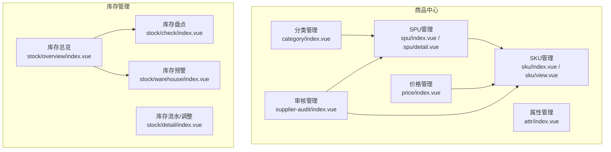
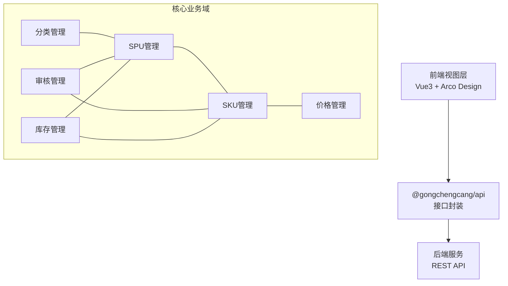
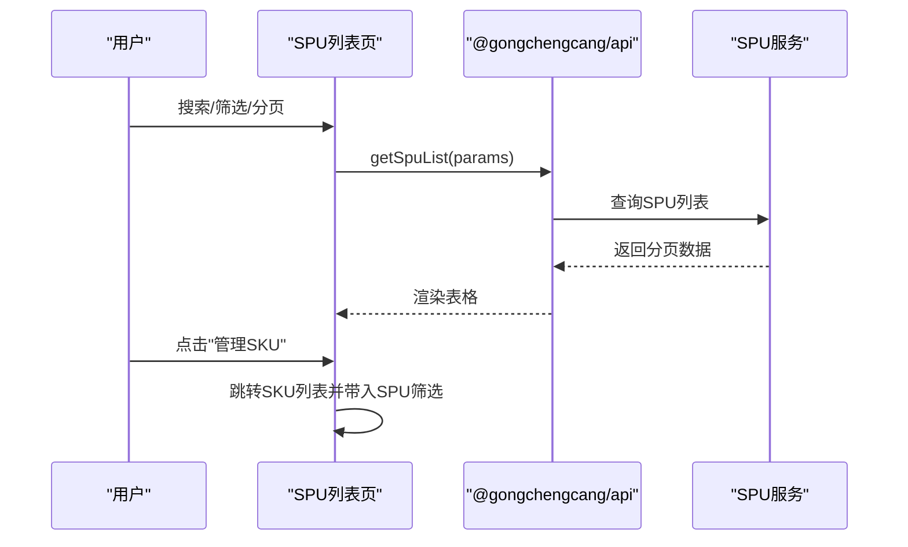
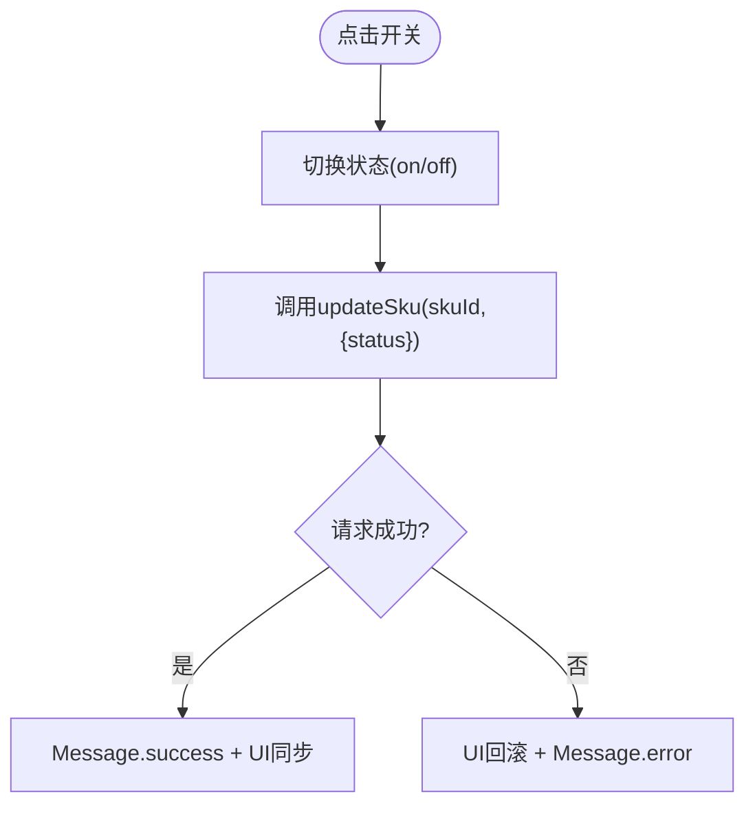
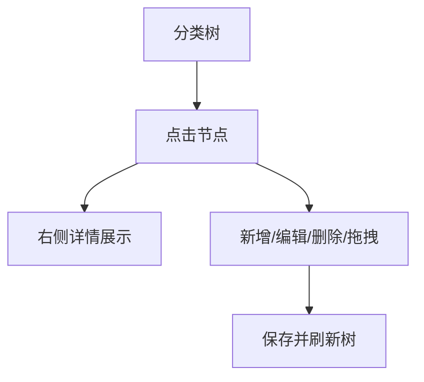
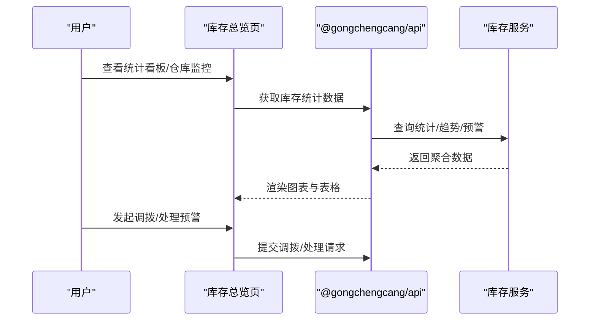
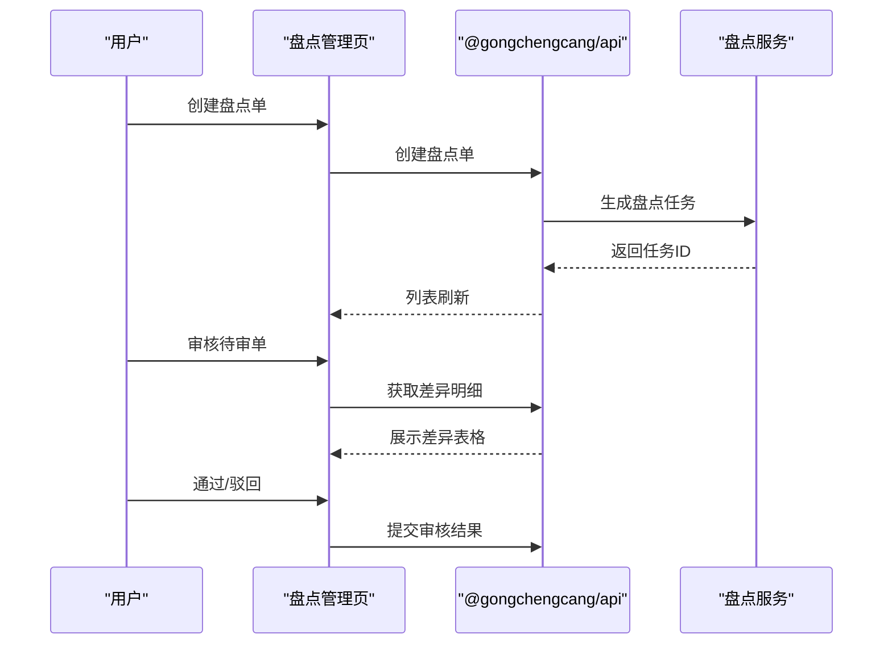
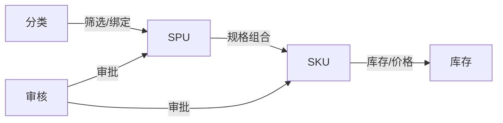

# 工程仓产品模块

<cite>
**本文引用的文件**
- [06-商品板块功能清单.md](file://docs/PRD/06-商品板块功能清单.md)
- [18-SPU管理功能详细设计.md](file://docs/PRD/18-SPU管理功能详细设计.md)
- [spu/index.vue](file://apps/pc/src/views/product/spu/index.vue)
- [spu/detail.vue](file://apps/pc/src/views/product/spu/detail.vue)
- [sku/index.vue](file://apps/pc/src/views/product/sku/index.vue)
- [sku/view.vue](file://apps/pc/src/views/product/sku/view.vue)
- [category/index.vue](file://apps/pc/src/views/product/category/index.vue)
- [stock/overview/index.vue](file://apps/pc/src/views/stock/overview/index.vue)
- [stock/check/index.vue](file://apps/pc/src/views/stock/check/index.vue)
</cite>

## 目录
1. [简介](#简介)
2. [项目结构](#项目结构)
3. [核心组件](#核心组件)
4. [架构总览](#架构总览)
5. [详细组件分析](#详细组件分析)
6. [依赖分析](#依赖分析)
7. [性能考虑](#性能考虑)
8. [故障排查指南](#故障排查指南)
9. [结论](#结论)
10. [附录](#附录)

## 简介
本文件面向工程仓产品模块，系统化梳理商品中心的完整能力，覆盖产品列表管理、SKU/SPU详情查看、产品状态管理、库存管理与盘点、以及价格策略与分账配置等关键领域。文档以PRD与前端实现为依据，提供从数据模型到交互流程的全景式说明，并配套操作指南与优化建议，帮助研发与运营高效落地与迭代。

## 项目结构
工程仓产品模块主要分布在PC端“商品中心”与“库存管理”两大视图域：
- 商品中心：SPU管理、SKU管理、分类管理、属性管理、价格管理、审核管理
- 库存管理：库存总览、库存预警、库存盘点、调拨审批等

图表来源
- [spu/index.vue:1-473](file://apps/pc/src/views/product/spu/index.vue#L1-L473)
- [sku/index.vue:1-886](file://apps/pc/src/views/product/sku/index.vue#L1-L886)
- [category/index.vue:1-408](file://apps/pc/src/views/product/category/index.vue#L1-L408)
- [stock/overview/index.vue:1-1004](file://apps/pc/src/views/stock/overview/index.vue#L1-L1004)
- [stock/check/index.vue:1-452](file://apps/pc/src/views/stock/check/index.vue#L1-L452)

章节来源
- [spu/index.vue:1-473](file://apps/pc/src/views/product/spu/index.vue#L1-L473)
- [sku/index.vue:1-886](file://apps/pc/src/views/product/sku/index.vue#L1-L886)
- [category/index.vue:1-408](file://apps/pc/src/views/product/category/index.vue#L1-L408)
- [stock/overview/index.vue:1-1004](file://apps/pc/src/views/stock/overview/index.vue#L1-L1004)
- [stock/check/index.vue:1-452](file://apps/pc/src/views/stock/check/index.vue#L1-L452)

## 核心组件
- SPU管理：SPU列表、搜索/筛选、详情、新增/编辑、删除、批量设置价格、SKU图片上传
- SKU管理：SKU列表、搜索/筛选、上下架切换、新增SKU、编辑SKU、删除SKU
- 分类管理：分类树、搜索、新增/编辑/删除、拖拽排序、绑定属性
- 库存总览：仓库监控、库存分布、出入库趋势、预警/缺货统计、调拨审批
- 库存盘点：盘点单列表、创建、开始/继续、审核、差异处理
- 价格管理：价格列表、详情、设置/调整、审核、历史查询（页面占位）

章节来源
- [spu/index.vue:1-473](file://apps/pc/src/views/product/spu/index.vue#L1-L473)
- [spu/detail.vue:1-1235](file://apps/pc/src/views/product/spu/detail.vue#L1-L1235)
- [sku/index.vue:1-886](file://apps/pc/src/views/product/sku/index.vue#L1-L886)
- [sku/view.vue:1-319](file://apps/pc/src/views/product/sku/view.vue#L1-L319)
- [category/index.vue:1-408](file://apps/pc/src/views/product/category/index.vue#L1-L408)
- [stock/overview/index.vue:1-1004](file://apps/pc/src/views/stock/overview/index.vue#L1-L1004)
- [stock/check/index.vue:1-452](file://apps/pc/src/views/stock/check/index.vue#L1-L452)
- [06-商品板块功能清单.md:1-273](file://docs/PRD/06-商品板块功能清单.md#L1-L273)

## 架构总览
工程仓产品模块采用前后端分离架构，前端以Vue3 + Arco Design为基础，通过API模块对接后端服务；后端接口遵循REST风格，提供SPU/SKU/分类/库存/盘点等资源的CRUD与业务流程接口。

图表来源
- [spu/index.vue:73-74](file://apps/pc/src/views/product/spu/index.vue#L73-L74)
- [sku/index.vue:256](file://apps/pc/src/views/product/sku/index.vue#L256)
- [category/index.vue:99](file://apps/pc/src/views/product/category/index.vue#L99)
- [stock/overview/index.vue:384](file://apps/pc/src/views/stock/overview/index.vue#L384)

## 详细组件分析

### SPU管理组件
- 列表与筛选：支持关键词（名称/编码）、分类级联筛选，分页加载，操作列包含详情、编辑、管理SKU、删除
- 新增/编辑流程：三步式向导（基础信息、规格配置、SKU定价），规格组合自动生成，支持批量设置价格与SKU图片上传
- 删除约束：前置校验SKU/供货关系/订单关联，阻断删除
- 权限矩阵：运营/管理员具备新增/编辑/删除权限，只读用户仅查看

图表来源
- [spu/index.vue:411-436](file://apps/pc/src/views/product/spu/index.vue#L411-L436)
- [spu/index.vue:450-455](file://apps/pc/src/views/product/spu/index.vue#L450-L455)

章节来源
- [spu/index.vue:1-473](file://apps/pc/src/views/product/spu/index.vue#L1-L473)
- [18-SPU管理功能详细设计.md:122-786](file://docs/PRD/18-SPU管理功能详细设计.md#L122-L786)

### SKU管理组件
- 列表与筛选：支持关键词、分类、所属SPU筛选，上下架开关直操，操作列包含详情、编辑、删除
- 上下架状态机：乐观更新 + 失败回滚，防抖与提示
- 新增SKU：支持手动输入规格键值对、上传主图、设置价格，自动继承SPU规格

图表来源
- [sku/index.vue:604-620](file://apps/pc/src/views/product/sku/index.vue#L604-L620)

章节来源
- [sku/index.vue:1-886](file://apps/pc/src/views/product/sku/index.vue#L1-L886)
- [sku/view.vue:1-319](file://apps/pc/src/views/product/sku/view.vue#L1-L319)

### 分类管理组件
- 左树右详情：支持三级分类树、搜索、拖拽排序、新增/编辑/删除
- 删除前置校验：分类下无商品方可删除
- 与SPU/SKU联动：点击分类可跳转至对应列表并自动筛选

图表来源
- [category/index.vue:281-326](file://apps/pc/src/views/product/category/index.vue#L281-L326)

章节来源
- [category/index.vue:1-408](file://apps/pc/src/views/product/category/index.vue#L1-L408)

### 库存总览组件
- 统计看板：仓库总数、商品种类、总库存量、库存总价值、预警/缺货商品
- 仓库监控：容量使用率、商品种类、库存总量/价值、周转天数、预警/缺货数量
- 预警与趋势：出入库趋势、分类库存分布、待处理调拨申请
- 操作：导出报表、查看详情、发起调拨、处理预警

图表来源
- [stock/overview/index.vue:391-404](file://apps/pc/src/views/stock/overview/index.vue#L391-L404)
- [stock/overview/index.vue:596-646](file://apps/pc/src/views/stock/overview/index.vue#L596-L646)

章节来源
- [stock/overview/index.vue:1-1004](file://apps/pc/src/views/stock/overview/index.vue#L1-L1004)

### 库存盘点组件
- 盘点单管理：列表、创建（全盘/抽盘）、开始/继续、审核、导出
- 审核流程：差异汇总、审核意见、通过/驳回
- 与库存总览联动：从总览跳转至盘点详情

图表来源
- [stock/check/index.vue:103-174](file://apps/pc/src/views/stock/check/index.vue#L103-L174)
- [stock/check/index.vue:373-428](file://apps/pc/src/views/stock/check/index.vue#L373-L428)

章节来源
- [stock/check/index.vue:1-452](file://apps/pc/src/views/stock/check/index.vue#L1-L452)

### 价格管理组件
- 页面现状：价格管理页面为占位提示，功能尚未实现
- PRD规划：价格列表、详情、设置/调整、审核、历史查询等

章节来源
- [06-商品板块功能清单.md:96-110](file://docs/PRD/06-商品板块功能清单.md#L96-L110)
- [price/index.vue:1-11](file://apps/pc/src/views/product/price/index.vue#L1-L11)

## 依赖分析
- 组件耦合
  - SPU与SKU强关联：SPU生成规格组合驱动SKU列表，SKU承载价格与库存
  - 分类与SPU/SKU：分类作为第一级筛选维度，贯穿列表与详情
  - 库存与SPU/SKU：库存统计与SKU绑定，盘点围绕SKU明细
- 外部依赖
  - API模块集中封装HTTP请求，统一错误处理与消息提示
  - Arco Design组件库提供表格、表单、模态框、统计图等基础能力

图表来源
- [spu/index.vue:411-436](file://apps/pc/src/views/product/spu/index.vue#L411-L436)
- [sku/index.vue:568-584](file://apps/pc/src/views/product/sku/index.vue#L568-L584)
- [category/index.vue:328-340](file://apps/pc/src/views/product/category/index.vue#L328-L340)

## 性能考虑
- 列表分页与懒加载：SPU/SKU/盘点单采用分页，图片懒加载，降低首屏压力
- 前端预生成SKU：规格变更时前端即时生成SKU组合，减少后端计算
- 缓存策略：分类树、属性列表、SPU详情可做本地缓存，提升切换体验
- 图片优化：压缩、CDN加速、统一尺寸，减少带宽与渲染开销

章节来源
- [18-SPU管理功能详细设计.md:763-785](file://docs/PRD/18-SPU管理功能详细设计.md#L763-L785)

## 故障排查指南
- SPU删除失败
  - 现象：删除按钮灰显或提示“有SKU/供货关系/订单”
  - 处理：先删除SKU、解除供货关系、或撤销相关订单后再试
- SKU上下架失败
  - 现象：开关回滚且提示失败
  - 处理：检查网络状态与后端服务，重试或稍后操作
- 分类删除失败
  - 现象：提示“该分类下有商品”
  - 处理：迁移或删除该分类下的商品后重试
- 库存盘点异常
  - 现象：差异金额为负或审核驳回
  - 处理：核对实盘数量与账面数量，补充差异说明后重新提交

章节来源
- [18-SPU管理功能详细设计.md:744-761](file://docs/PRD/18-SPU管理功能详细设计.md#L744-L761)
- [spu/index.vue:457-471](file://apps/pc/src/views/product/spu/index.vue#L457-L471)
- [sku/index.vue:604-620](file://apps/pc/src/views/product/sku/index.vue#L604-L620)
- [category/index.vue:261-278](file://apps/pc/src/views/product/category/index.vue#L261-L278)
- [stock/check/index.vue:407-428](file://apps/pc/src/views/stock/check/index.vue#L407-L428)

## 结论
工程仓产品模块以SPU/SKU为核心，围绕分类、价格、库存、盘点与审核形成闭环。前端通过清晰的组件边界与交互规范，配合后端REST接口，实现了从商品创建到库存可视化的全链路能力。建议后续完善价格管理与分账配置页面，并持续优化SKU生成与图片加载性能，以支撑更大规模的商品数据与更复杂的业务场景。

## 附录

### 操作指南
- SPU管理
  - 新增SPU：填写基础信息 → 配置规格 → SKU定价 → 保存
  - 管理SKU：在SPU详情点击“管理SKU”，支持批量设置价格与图片上传
- SKU管理
  - 列表筛选：关键词/分类/所属SPU，支持上下架切换
  - 新增SKU：选择SPU，填写规格与价格，上传主图
- 分类管理
  - 树内新增/编辑/删除，支持拖拽排序与搜索
- 库存总览
  - 查看仓库监控、预警/缺货统计、出入库趋势，发起调拨与处理预警
- 库存盘点
  - 创建盘点单（全盘/抽盘），开始/继续盘点，提交审核

章节来源
- [spu/index.vue:428-471](file://apps/pc/src/views/product/spu/index.vue#L428-L471)
- [sku/index.vue:586-800](file://apps/pc/src/views/product/sku/index.vue#L586-L800)
- [category/index.vue:243-344](file://apps/pc/src/views/product/category/index.vue#L243-L344)
- [stock/overview/index.vue:592-646](file://apps/pc/src/views/stock/overview/index.vue#L592-L646)
- [stock/check/index.vue:361-428](file://apps/pc/src/views/stock/check/index.vue#L361-L428)