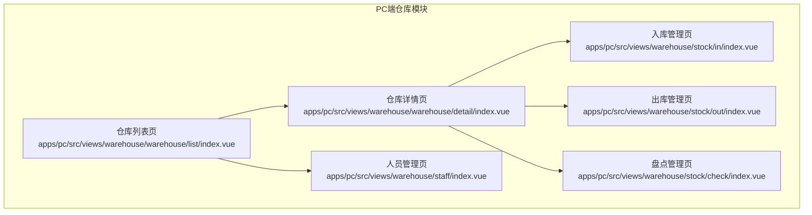
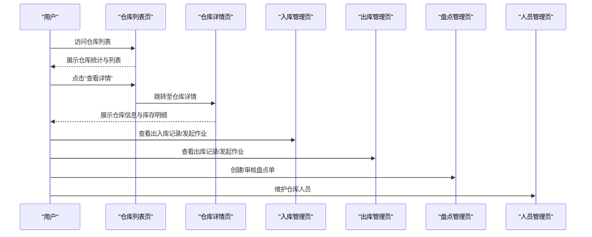
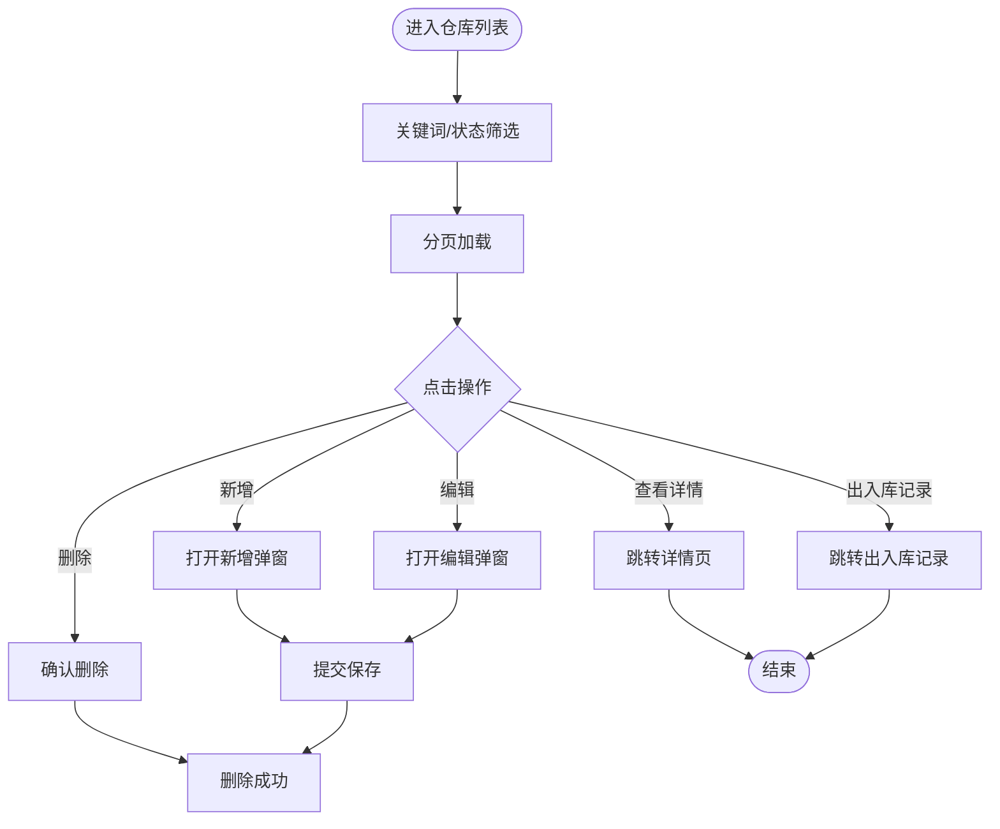
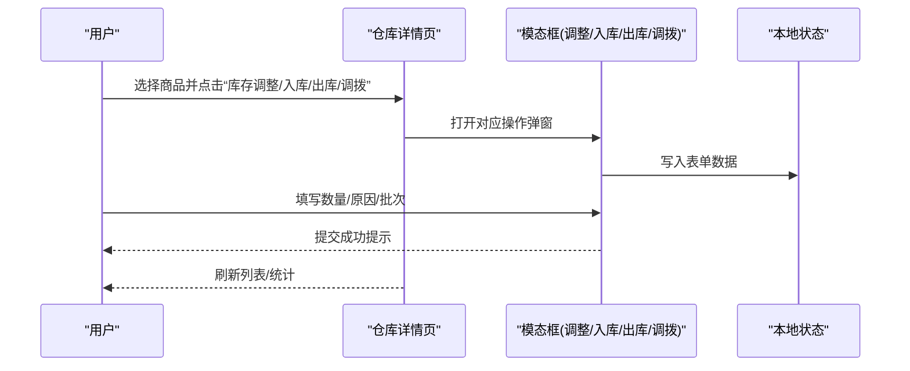
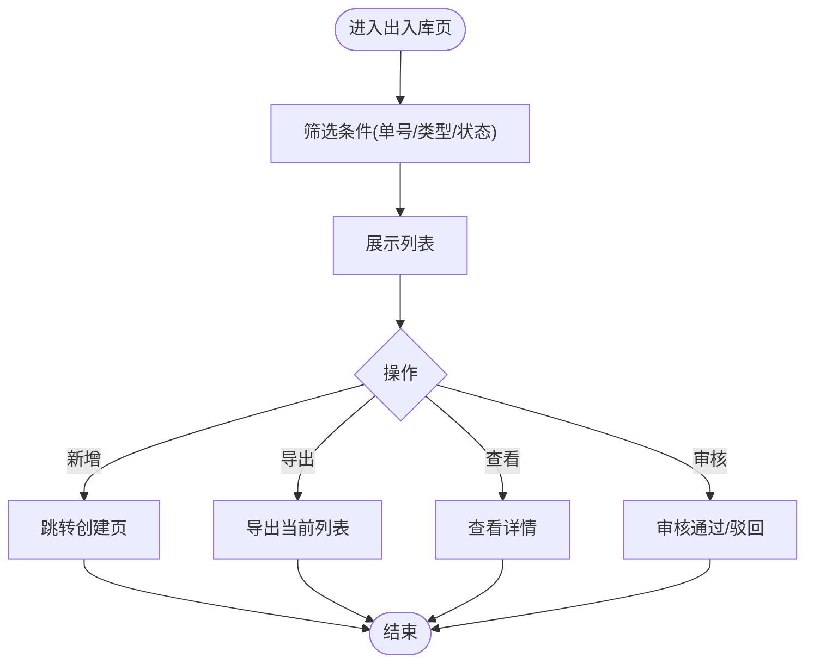
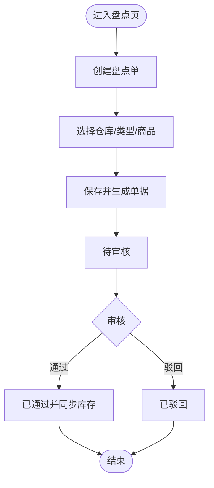
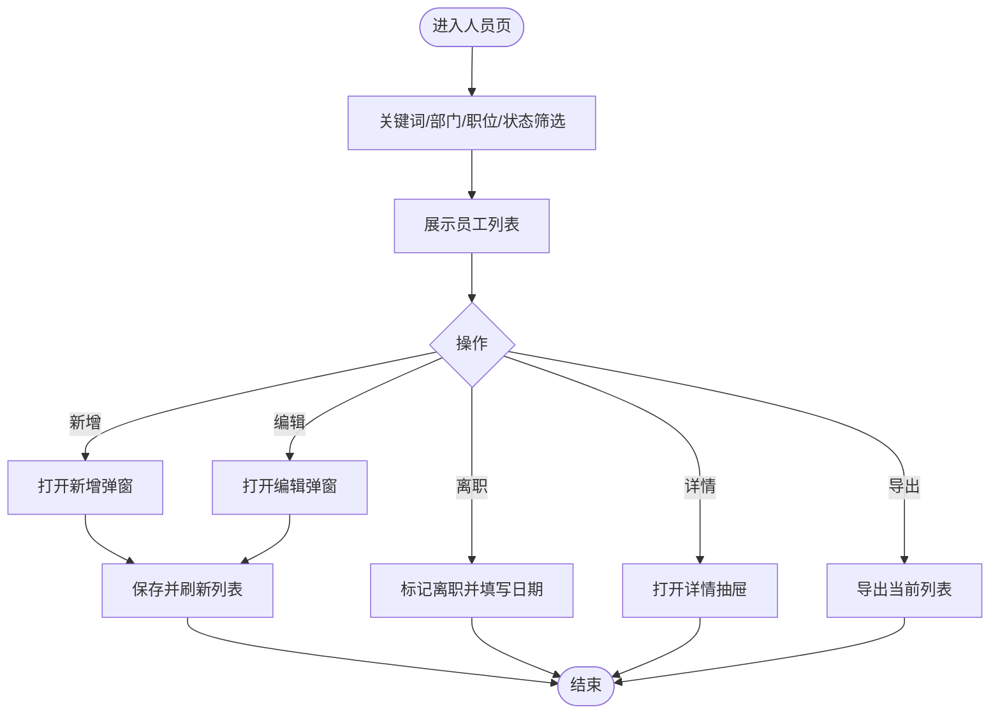
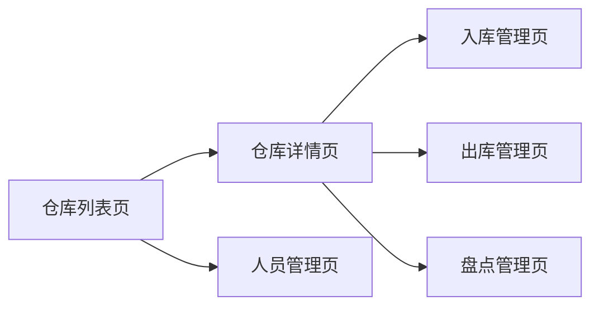

# 工程仓仓库模块

<cite>
**本文引用的文件**
- [apps/pc/src/views/warehouse/warehouse/list/index.vue](file://apps/pc/src/views/warehouse/warehouse/list/index.vue)
- [apps/pc/src/views/warehouse/warehouse/detail/index.vue](file://apps/pc/src/views/warehouse/warehouse/detail/index.vue)
- [apps/pc/src/views/warehouse/stock/in/index.vue](file://apps/pc/src/views/warehouse/stock/in/index.vue)
- [apps/pc/src/views/warehouse/stock/out/index.vue](file://apps/pc/src/views/warehouse/stock/out/index.vue)
- [apps/pc/src/views/warehouse/stock/check/index.vue](file://apps/pc/src/views/warehouse/stock/check/index.vue)
- [apps/pc/src/views/warehouse/staff/index.vue](file://apps/pc/src/views/warehouse/staff/index.vue)
</cite>

## 目录
1. [简介](#简介)
2. [项目结构](#项目结构)
3. [核心组件](#核心组件)
4. [架构总览](#架构总览)
5. [详细组件分析](#详细组件分析)
6. [依赖关系分析](#依赖关系分析)
7. [性能考量](#性能考量)
8. [故障排查指南](#故障排查指南)
9. [结论](#结论)
10. [附录](#附录)

## 简介
本文件面向“工程仓仓库模块”，系统化梳理仓库管理的完整功能体系，覆盖仓库列表管理、仓库详情管理、出入库与盘点、仓库人员管理等关键能力，并结合现有前端页面实现，给出数据模型、货位管理策略、作业流程、安全与合规要点以及操作指南与优化建议。文档旨在帮助产品、研发与运营人员快速理解并高效使用工程仓仓库模块。

## 项目结构
仓库模块主要由以下页面构成：
- 仓库列表页：展示仓库基础信息、状态、库存统计与操作入口
- 仓库详情页：展示仓库基本信息、平面图示意、货位分布、设备设施、库存明细与作业记录
- 出入库管理页：入库单与出库单的查询、筛选、审核与导出
- 盘点管理页：盘点单的创建、审核与差异处理
- 人员管理页：员工信息维护、状态管理与导出

图表来源
- [apps/pc/src/views/warehouse/warehouse/list/index.vue:1-717](file://apps/pc/src/views/warehouse/warehouse/list/index.vue#L1-L717)
- [apps/pc/src/views/warehouse/warehouse/detail/index.vue:1-1162](file://apps/pc/src/views/warehouse/warehouse/detail/index.vue#L1-L1162)
- [apps/pc/src/views/warehouse/stock/in/index.vue:1-205](file://apps/pc/src/views/warehouse/stock/in/index.vue#L1-L205)
- [apps/pc/src/views/warehouse/stock/out/index.vue:1-199](file://apps/pc/src/views/warehouse/stock/out/index.vue#L1-L199)
- [apps/pc/src/views/warehouse/stock/check/index.vue:1-451](file://apps/pc/src/views/warehouse/stock/check/index.vue#L1-L451)
- [apps/pc/src/views/warehouse/staff/index.vue:1-462](file://apps/pc/src/views/warehouse/staff/index.vue#L1-L462)

章节来源
- [apps/pc/src/views/warehouse/warehouse/list/index.vue:1-717](file://apps/pc/src/views/warehouse/warehouse/list/index.vue#L1-L717)
- [apps/pc/src/views/warehouse/warehouse/detail/index.vue:1-1162](file://apps/pc/src/views/warehouse/warehouse/detail/index.vue#L1-L1162)
- [apps/pc/src/views/warehouse/stock/in/index.vue:1-205](file://apps/pc/src/views/warehouse/stock/in/index.vue#L1-L205)
- [apps/pc/src/views/warehouse/stock/out/index.vue:1-199](file://apps/pc/src/views/warehouse/stock/out/index.vue#L1-L199)
- [apps/pc/src/views/warehouse/stock/check/index.vue:1-451](file://apps/pc/src/views/warehouse/stock/check/index.vue#L1-L451)
- [apps/pc/src/views/warehouse/staff/index.vue:1-462](file://apps/pc/src/views/warehouse/staff/index.vue#L1-L462)

## 核心组件
- 仓库列表组件：负责仓库的新增、编辑、删除、状态切换、负责人与联系方式维护、标签管理、统计聚合与分页展示。
- 仓库详情组件：负责仓库基本信息展示、库存统计卡片、商品列表检索与筛选、批次与出入库记录查看、库存调整、调拨发起等。
- 出入库组件：负责入库单与出库单的查询、筛选、状态管理、审核与导出。
- 盘点组件：负责盘点单的创建、抽盘/全盘选择、差异生成与审核。
- 人员组件：负责员工信息维护、状态变更、导出与详情查看。

章节来源
- [apps/pc/src/views/warehouse/warehouse/list/index.vue:197-590](file://apps/pc/src/views/warehouse/warehouse/list/index.vue#L197-L590)
- [apps/pc/src/views/warehouse/warehouse/detail/index.vue:427-425](file://apps/pc/src/views/warehouse/warehouse/detail/index.vue#L427-L425)
- [apps/pc/src/views/warehouse/stock/in/index.vue:77-185](file://apps/pc/src/views/warehouse/stock/in/index.vue#L77-L185)
- [apps/pc/src/views/warehouse/stock/out/index.vue:77-179](file://apps/pc/src/views/warehouse/stock/out/index.vue#L77-L179)
- [apps/pc/src/views/warehouse/stock/check/index.vue:171-435](file://apps/pc/src/views/warehouse/stock/check/index.vue#L171-L435)
- [apps/pc/src/views/warehouse/staff/index.vue:189-449](file://apps/pc/src/views/warehouse/staff/index.vue#L189-L449)

## 架构总览
仓库模块采用前端路由驱动的页面化架构，各页面通过统一的布局与导航串联，形成“列表—详情—作业—盘点—人员”的闭环。数据以本地模拟为主，便于演示与开发验证；生产环境可替换为真实API调用。

图表来源
- [apps/pc/src/views/warehouse/warehouse/list/index.vue:572-577](file://apps/pc/src/views/warehouse/warehouse/list/index.vue#L572-L577)
- [apps/pc/src/views/warehouse/warehouse/detail/index.vue:1-1162](file://apps/pc/src/views/warehouse/warehouse/detail/index.vue#L1-L1162)
- [apps/pc/src/views/warehouse/stock/in/index.vue:1-205](file://apps/pc/src/views/warehouse/stock/in/index.vue#L1-L205)
- [apps/pc/src/views/warehouse/stock/out/index.vue:1-199](file://apps/pc/src/views/warehouse/stock/out/index.vue#L1-L199)
- [apps/pc/src/views/warehouse/stock/check/index.vue:1-451](file://apps/pc/src/views/warehouse/stock/check/index.vue#L1-L451)
- [apps/pc/src/views/warehouse/staff/index.vue:1-462](file://apps/pc/src/views/warehouse/staff/index.vue#L1-L462)

## 详细组件分析

### 仓库列表管理
- 功能要点
  - 仓库统计：仓库总数、商品种类、库存总量、库存总价值
  - 列表字段：仓库编码、名称、负责人、地址、标签、商品种类、库存总量、库存价值、状态
  - 操作：新增、编辑、删除、查看详情、出入库记录、分页与搜索
- 数据模型
  - 仓库项包含：id、name、code、managerId、managerName、phone、address、tags、productCount、totalQuantity、totalValue、status
- 流程图

图表来源
- [apps/pc/src/views/warehouse/warehouse/list/index.vue:387-590](file://apps/pc/src/views/warehouse/warehouse/list/index.vue#L387-L590)

章节来源
- [apps/pc/src/views/warehouse/warehouse/list/index.vue:1-717](file://apps/pc/src/views/warehouse/warehouse/list/index.vue#L1-L717)

### 仓库详情管理
- 功能要点
  - 基本信息：负责人、联系方式、标签、地址
  - 统计卡片：SPU数量、SKU数量、库存总量、库存价值
  - 商品列表：SPU/SKU搜索、分类筛选、可用/锁定库存、批次与记录查看
  - 作业入口：库存调整、商品入库、商品出库、发起调拨
- 数据模型
  - 商品项包含：id、skuId、skuCode、skuName、categoryName、spec、mainImage、unit、quantity、availableQty、lockedQty、safetyStock、purchasePrice、location、updatedAt、batches
  - 批次项包含：id、batchNo、inDate、note、quantity、outQty、availableQty、remark
- 作业流程

图表来源
- [apps/pc/src/views/warehouse/warehouse/detail/index.vue:157-424](file://apps/pc/src/views/warehouse/warehouse/detail/index.vue#L157-L424)

章节来源
- [apps/pc/src/views/warehouse/warehouse/detail/index.vue:1-1162](file://apps/pc/src/views/warehouse/warehouse/detail/index.vue#L1-L1162)

### 出入库管理
- 入库管理
  - 支持按入库单号、入库类型、状态筛选
  - 支持新增入库单、导出、查看、审核
- 出库管理
  - 支持按出库单号、出库类型、状态筛选
  - 支持新增出库单、导出、查看、审核
- 流程图

图表来源
- [apps/pc/src/views/warehouse/stock/in/index.vue:140-185](file://apps/pc/src/views/warehouse/stock/in/index.vue#L140-L185)
- [apps/pc/src/views/warehouse/stock/out/index.vue:137-179](file://apps/pc/src/views/warehouse/stock/out/index.vue#L137-L179)

章节来源
- [apps/pc/src/views/warehouse/stock/in/index.vue:1-205](file://apps/pc/src/views/warehouse/stock/in/index.vue#L1-L205)
- [apps/pc/src/views/warehouse/stock/out/index.vue:1-199](file://apps/pc/src/views/warehouse/stock/out/index.vue#L1-L199)

### 盘点管理
- 功能要点
  - 创建盘点单：选择仓库、全盘/抽盘、选择商品、填写备注
  - 审核盘点单：通过/驳回，生成出入库调整记录
  - 列表：按单号、状态筛选，查看盘盈/盘亏数量与金额
- 流程图

图表来源
- [apps/pc/src/views/warehouse/stock/check/index.vue:362-435](file://apps/pc/src/views/warehouse/stock/check/index.vue#L362-L435)

章节来源
- [apps/pc/src/views/warehouse/stock/check/index.vue:1-451](file://apps/pc/src/views/warehouse/stock/check/index.vue#L1-L451)

### 人员管理
- 功能要点
  - 员工信息：工号、姓名、性别、手机号、邮箱、部门、职位、直属上级、入职日期、在职状态、创建时间、备注
  - 搜索：姓名/手机号/工号、部门、职位、在职状态
  - 操作：新增、编辑、详情查看、离职标记、导出
- 流程图

图表来源
- [apps/pc/src/views/warehouse/staff/index.vue:343-449](file://apps/pc/src/views/warehouse/staff/index.vue#L343-L449)

章节来源
- [apps/pc/src/views/warehouse/staff/index.vue:1-462](file://apps/pc/src/views/warehouse/staff/index.vue#L1-L462)

## 依赖关系分析
- 页面内聚性：各页面职责清晰，仓库列表与详情强关联，出入库与盘点独立但共享仓库维度，人员管理跨多页面使用
- 外部依赖：使用 Arco Design 组件库（表格、表单、模态框、抽屉、标签、按钮等）
- 数据耦合：仓库详情依赖仓库列表提供的仓库ID；出入库与盘点依赖仓库维度；人员管理依赖组织架构与权限体系

图表来源
- [apps/pc/src/views/warehouse/warehouse/list/index.vue:572-577](file://apps/pc/src/views/warehouse/warehouse/list/index.vue#L572-L577)
- [apps/pc/src/views/warehouse/warehouse/detail/index.vue:1-1162](file://apps/pc/src/views/warehouse/warehouse/detail/index.vue#L1-L1162)
- [apps/pc/src/views/warehouse/stock/in/index.vue:1-205](file://apps/pc/src/views/warehouse/stock/in/index.vue#L1-L205)
- [apps/pc/src/views/warehouse/stock/out/index.vue:1-199](file://apps/pc/src/views/warehouse/stock/out/index.vue#L1-L199)
- [apps/pc/src/views/warehouse/stock/check/index.vue:1-451](file://apps/pc/src/views/warehouse/stock/check/index.vue#L1-L451)
- [apps/pc/src/views/warehouse/staff/index.vue:1-462](file://apps/pc/src/views/warehouse/staff/index.vue#L1-L462)

## 性能考量
- 列表渲染：对大列表采用分页与虚拟滚动（建议）提升交互流畅度
- 搜索过滤：前端过滤适合中小规模数据；大规模数据建议后端分页与服务端过滤
- 图片资源：商品主图采用懒加载与尺寸控制，避免阻塞首屏
- 表单校验：在提交前进行必填字段校验，减少无效请求
- 状态管理：使用响应式对象集中管理表单与筛选状态，避免重复渲染

## 故障排查指南
- 新增/编辑仓库失败
  - 检查必填字段是否为空（编码、名称、负责人、省市区、详细地址）
  - 确认负责人电话是否自动带出
- 删除仓库失败
  - 确认是否存在关联作业或库存，避免误删
- 出入库/盘点操作无响应
  - 检查筛选条件是否导致列表为空
  - 确认单据状态是否允许当前操作（仅“待审核”可审核）
- 人员管理异常
  - 检查必填字段完整性（姓名、手机号、部门、职位）
  - 离职标记需在“在职”状态下进行

章节来源
- [apps/pc/src/views/warehouse/warehouse/list/index.vue:495-563](file://apps/pc/src/views/warehouse/warehouse/list/index.vue#L495-L563)
- [apps/pc/src/views/warehouse/stock/in/index.vue:140-161](file://apps/pc/src/views/warehouse/stock/in/index.vue#L140-L161)
- [apps/pc/src/views/warehouse/stock/out/index.vue:137-158](file://apps/pc/src/views/warehouse/stock/out/index.vue#L137-L158)
- [apps/pc/src/views/warehouse/stock/check/index.vue:371-426](file://apps/pc/src/views/warehouse/stock/check/index.vue#L371-L426)
- [apps/pc/src/views/warehouse/staff/index.vue:406-429](file://apps/pc/src/views/warehouse/staff/index.vue#L406-L429)

## 结论
工程仓仓库模块以“仓库为中心”的页面体系，实现了从仓库管理到作业执行再到人员维护的闭环。现有实现以本地模拟数据为主，具备良好的扩展性与可维护性。建议在生产环境中接入后端接口，完善权限与审计日志，强化数据一致性与安全性。

## 附录
- 操作指南（概述）
  - 仓库列表：新增/编辑/删除/查看详情/出入库记录
  - 仓库详情：库存统计查看、商品检索、批次与记录查看、库存调整/入库/出库/调拨
  - 出入库：按单号/类型/状态筛选，新增/导出/查看/审核
  - 盘点：创建全盘/抽盘单，审核并生成差异
  - 人员：新增/编辑/详情/离职/导出
- 优化建议
  - 引入后端接口与权限校验
  - 增加作业审批流与审计日志
  - 强化搜索与筛选的实时反馈
  - 增设报表导出与可视化看板