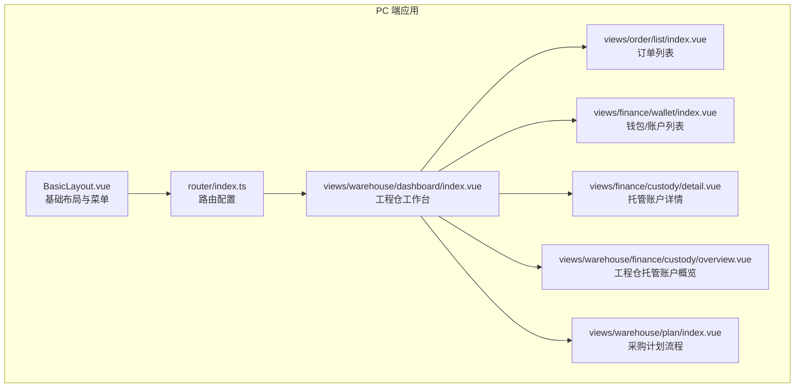
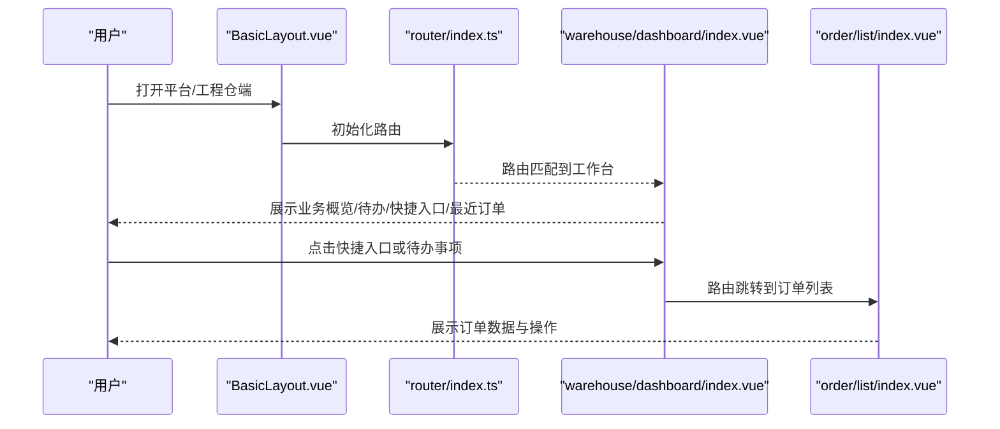
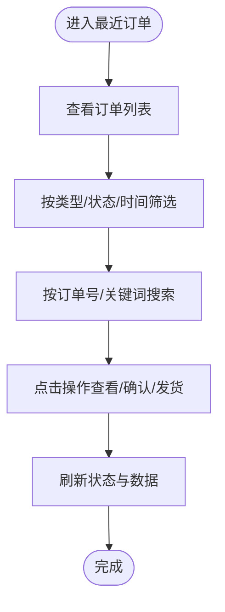
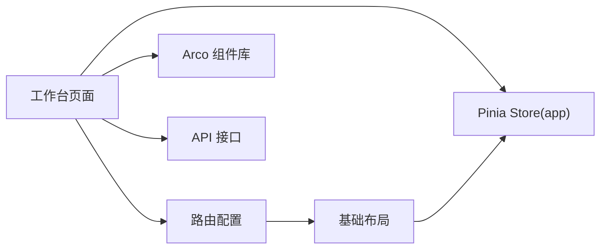

# 工程仓工作台

<cite>
**本文引用的文件**
- [apps/pc/src/views/dashboard/index.vue](file://apps/pc/src/views/dashboard/index.vue)
- [apps/pc/src/views/warehouse/dashboard/index.vue](file://apps/pc/src/views/warehouse/dashboard/index.vue)
- [apps/pc/src/router/index.ts](file://apps/pc/src/router/index.ts)
- [apps/pc/src/layouts/BasicLayout.vue](file://apps/pc/src/layouts/BasicLayout.vue)
- [apps/pc/src/store/app.ts](file://apps/pc/src/store/app.ts)
- [apps/pc/src/views/order/list/index.vue](file://apps/pc/src/views/order/list/index.vue)
- [apps/pc/src/views/finance/wallet/index.vue](file://apps/pc/src/views/finance/wallet/index.vue)
- [apps/pc/src/views/finance/custody/detail.vue](file://apps/pc/src/views/finance/custody/detail.vue)
- [apps/pc/src/views/warehouse/finance/custody/overview.vue](file://apps/pc/src/views/warehouse/finance/custody/overview.vue)
- [apps/pc/src/views/warehouse/plan/index.vue](file://apps/pc/src/views/warehouse/plan/index.vue)
- [apps/pc/src/views/mp-preview/pages/construction/index.vue](file://apps/pc/src/views/mp-preview/pages/construction/index.vue)
- [apps/pc/src/views/mp-preview/pages/index.vue](file://apps/pc/src/views/mp-preview/pages/index.vue)
- [apps/pc/src/views/mp-preview/pages/warehouse/stock-warning.vue](file://apps/pc/src/views/mp-preview/pages/warehouse/stock-warning.vue)
- [packages/api/src/order.ts](file://packages/api/src/order.ts)
- [docs/PRD/02-业务流程设计.md](file://docs/PRD/02-业务流程设计.md)
- [docs/PRD/07-平台端商品中心功能清单.md](file://docs/PRD/07-平台端商品中心功能清单.md)
</cite>

## 目录
1. [简介](#简介)
2. [项目结构](#项目结构)
3. [核心组件](#核心组件)
4. [架构总览](#架构总览)
5. [详细组件分析](#详细组件分析)
6. [依赖分析](#依赖分析)
7. [性能考虑](#性能考虑)
8. [故障排查指南](#故障排查指南)
9. [结论](#结论)
10. [附录](#附录)

## 简介
本文件面向“工程仓工作台”的使用者与维护者，系统性阐述工作台的整体架构与核心功能模块，包括：
- 业务概览统计面板（今日销售额、待处理订单、库存预警、账户余额）
- 待办事项列表
- 快捷入口功能
- 最近订单展示
- 统计数据的含义与计算方式
- 待办事项的触发条件与处理流程
- 快捷入口的配置与使用方法
- 最近订单的数据展示与筛选功能
- 工程仓运营数据分析最佳实践与工作台定制化配置指南

工作台作为工程仓端的统一入口，提供关键运营指标与高频操作通道，帮助用户快速掌握业务动态并高效完成日常任务。

## 项目结构
工程仓工作台位于 PC 端前端应用中，采用 Vue 3 + Arco Design 的技术栈，路由与布局由基础布局组件承载，工作台页面以卡片化、模块化的方式组织内容，并通过路由导航连接到具体业务页面。

**图表来源**
- [apps/pc/src/layouts/BasicLayout.vue:1-349](file://apps/pc/src/layouts/BasicLayout.vue#L1-L349)
- [apps/pc/src/router/index.ts:1-790](file://apps/pc/src/router/index.ts#L1-L790)
- [apps/pc/src/views/warehouse/dashboard/index.vue:1-183](file://apps/pc/src/views/warehouse/dashboard/index.vue#L1-L183)

**章节来源**
- [apps/pc/src/router/index.ts:1-790](file://apps/pc/src/router/index.ts#L1-L790)
- [apps/pc/src/layouts/BasicLayout.vue:1-349](file://apps/pc/src/layouts/BasicLayout.vue#L1-L349)

## 核心组件
- 业务概览统计面板：展示今日销售额、待处理订单、库存预警、账户余额等关键指标，用于快速掌握运营状况。
- 待办事项列表：聚合待确认、待发货、库存预警、对账单等运营任务，支持快速处理。
- 快捷入口：提供常用业务入口，如商品管理、采购/销售订单、出入库、资金流水、发票管理、仓库管理等。
- 最近订单：展示近期订单的关键信息（订单号、类型、金额、状态、创建时间），便于快速追踪。

以上模块在工程仓工作台页面中以卡片与表格形式呈现，配合路由跳转实现闭环操作。

**章节来源**
- [apps/pc/src/views/warehouse/dashboard/index.vue:1-183](file://apps/pc/src/views/warehouse/dashboard/index.vue#L1-L183)

## 架构总览
工作台通过基础布局组件加载菜单与面包屑，路由配置将“工作台”映射到工程仓工作台页面；工作台内部通过快捷入口与待办事项引导至订单、财务、库存等子系统页面，形成“概览—导航—执行”的闭环。

**图表来源**
- [apps/pc/src/layouts/BasicLayout.vue:1-349](file://apps/pc/src/layouts/BasicLayout.vue#L1-L349)
- [apps/pc/src/router/index.ts:1-790](file://apps/pc/src/router/index.ts#L1-L790)
- [apps/pc/src/views/warehouse/dashboard/index.vue:1-183](file://apps/pc/src/views/warehouse/dashboard/index.vue#L1-L183)
- [apps/pc/src/views/order/list/index.vue:1-197](file://apps/pc/src/views/order/list/index.vue#L1-L197)

## 详细组件分析

### 业务概览统计面板
- 指标构成
  - 今日销售额：反映当日收入规模，单位通常为元，支持精度显示。
  - 待处理订单：指处于待确认、待发货、待收货等阶段的订单数量。
  - 库存预警：提示当前低于安全库存或缺货的商品种类数量。
  - 账户余额：工程仓托管账户的可用余额，支持冻结金额与总余额展示。
- 数据来源与计算
  - 销售额与订单数：来源于订单列表接口，按创建时间过滤当日数据并汇总金额。
  - 待处理订单：根据订单状态集合过滤，如“待确认”、“待发货”、“待收货”等。
  - 库存预警：基于库存阈值与当前库存对比，识别低于安全库存或缺货的商品。
  - 账户余额：来源于托管账户接口，包含可用余额、冻结金额与总余额。
- 展示样式
  - 使用统计卡片组件展示数值与标题，支持前缀符号与精度控制。

**章节来源**
- [apps/pc/src/views/warehouse/dashboard/index.vue:1-87](file://apps/pc/src/views/warehouse/dashboard/index.vue#L1-L87)
- [apps/pc/src/views/finance/wallet/index.vue:161-388](file://apps/pc/src/views/finance/wallet/index.vue#L161-L388)
- [apps/pc/src/views/finance/custody/detail.vue:18-510](file://apps/pc/src/views/finance/custody/detail.vue#L18-L510)
- [apps/pc/src/views/warehouse/finance/custody/overview.vue:31-59](file://apps/pc/src/views/warehouse/finance/custody/overview.vue#L31-L59)

### 待办事项列表
- 触发条件
  - 采购订单待确认：供应商尚未确认的采购订单。
  - 销售订单待发货：已确认但尚未发货的销售订单。
  - 库存预警处理：存在低于安全库存或缺货的商品。
  - 对账单待确认：存在未确认的对账单。
- 处理流程
  - 点击“处理”或进入对应页面，完成确认、发货、补货或对账等操作。
  - 完成后刷新工作台，待办数量相应减少。
- 可扩展性
  - 可通过状态枚举与接口返回数据动态生成待办项，支持不同角色与权限差异。

**章节来源**
- [apps/pc/src/views/warehouse/dashboard/index.vue:94-99](file://apps/pc/src/views/warehouse/dashboard/index.vue#L94-L99)
- [apps/pc/src/views/warehouse/plan/index.vue:282-338](file://apps/pc/src/views/warehouse/plan/index.vue#L282-L338)

### 快捷入口功能
- 配置与使用
  - 快捷入口以网格卡片形式展示，点击后通过路由跳转到目标页面。
  - 支持图标、颜色与路径配置，便于快速定位常用功能。
- 典型入口
  - 商品管理、采购订单、销售订单、入库单、出库单、资金流水、发票管理、仓库管理等。
- 自定义指南
  - 在工作台页面维护入口数组，添加/移除条目即可实现个性化配置。
  - 路由需在全局路由表中注册，确保跳转有效。

**章节来源**
- [apps/pc/src/views/warehouse/dashboard/index.vue:101-110](file://apps/pc/src/views/warehouse/dashboard/index.vue#L101-L110)
- [apps/pc/src/router/index.ts:525-762](file://apps/pc/src/router/index.ts#L525-L762)

### 最近订单展示与筛选
- 数据展示
  - 展示字段：订单号、类型（采购/销售）、供应商/客户、金额、状态、创建时间。
  - 状态标签按状态映射着色，便于快速识别。
- 筛选与搜索
  - 支持按订单号、类型、状态、时间范围等条件筛选。
  - 支持关键词搜索，提升查找效率。
- 流程与状态
  - 采购/销售订单状态遵循统一的状态机，涵盖待确认、待发货、待收货、已完成、售后中等。
  - 支付与发货可并行，支持分批支付/发货/收货，最终完成条件为全部支付与全部收货。

**图表来源**
- [apps/pc/src/views/order/list/index.vue:1-197](file://apps/pc/src/views/order/list/index.vue#L1-L197)
- [docs/PRD/02-业务流程设计.md:423-454](file://docs/PRD/02-业务流程设计.md#L423-L454)

**章节来源**
- [apps/pc/src/views/warehouse/dashboard/index.vue:112-117](file://apps/pc/src/views/warehouse/dashboard/index.vue#L112-L117)
- [apps/pc/src/views/order/list/index.vue:1-197](file://apps/pc/src/views/order/list/index.vue#L1-L197)
- [docs/PRD/02-业务流程设计.md:423-454](file://docs/PRD/02-业务流程设计.md#L423-L454)

### 小程序端数据看板（对比参考）
- 小程序端提供“数据看板”，支持今日/本周/本月切换，展示订单、销售额、待发货、售后、开票、低库存等指标，并带有趋势百分比。
- 该模块可作为工程仓工作台的补充参考，用于理解多端数据口径与展示风格的一致性。

**章节来源**
- [apps/pc/src/views/mp-preview/pages/index.vue:21-57](file://apps/pc/src/views/mp-preview/pages/index.vue#L21-L57)
- [apps/pc/src/views/mp-preview/pages/construction/index.vue:410-473](file://apps/pc/src/views/mp-preview/pages/construction/index.vue#L410-L473)

## 依赖分析
- 路由依赖：工作台通过路由配置与基础布局联动，确保菜单、面包屑与页面一致。
- 组件依赖：工作台依赖 Arco Design 的卡片、列表、表格、标签等组件，保证一致的视觉与交互体验。
- 状态与主题：应用 Store 提供侧边栏折叠、加载状态与主题切换能力，影响整体布局与视觉风格。
- 接口依赖：订单、财务、库存等模块通过 API 接口获取实时数据，工作台中的静态示例可替换为真实接口调用。

**图表来源**
- [apps/pc/src/views/warehouse/dashboard/index.vue:1-183](file://apps/pc/src/views/warehouse/dashboard/index.vue#L1-L183)
- [apps/pc/src/router/index.ts:1-790](file://apps/pc/src/router/index.ts#L1-L790)
- [apps/pc/src/layouts/BasicLayout.vue:1-349](file://apps/pc/src/layouts/BasicLayout.vue#L1-L349)
- [apps/pc/src/store/app.ts:1-36](file://apps/pc/src/store/app.ts#L1-L36)

**章节来源**
- [apps/pc/src/router/index.ts:1-790](file://apps/pc/src/router/index.ts#L1-L790)
- [apps/pc/src/store/app.ts:1-36](file://apps/pc/src/store/app.ts#L1-L36)

## 性能考虑
- 列表渲染优化：对订单列表启用虚拟滚动与分页，避免大数据量导致的卡顿。
- 图表占位：订单趋势图表采用占位符，避免空数据时的重绘开销。
- 路由懒加载：页面组件采用异步加载，缩短首屏加载时间。
- 主题与布局：通过 Store 控制主题与侧边栏折叠，减少不必要的 DOM 更新。

## 故障排查指南
- 快捷入口无法跳转
  - 检查路由配置中目标路径是否存在，确保路由表正确注册。
  - 确认工作台快捷入口的路径与路由 name 或 path 一致。
- 待办事项不更新
  - 确认状态枚举与接口返回一致，必要时刷新页面或重新拉取数据。
  - 检查处理流程是否正确更新状态，完成后应刷新工作台。
- 最近订单筛选无效
  - 检查筛选参数与接口字段是否匹配，确认搜索关键词大小写与模糊匹配逻辑。
- 财务数据不一致
  - 核对托管账户余额、可用余额与冻结金额的计算口径，确保接口返回与页面展示一致。

**章节来源**
- [apps/pc/src/router/index.ts:525-762](file://apps/pc/src/router/index.ts#L525-L762)
- [apps/pc/src/views/warehouse/dashboard/index.vue:119-130](file://apps/pc/src/views/warehouse/dashboard/index.vue#L119-L130)
- [apps/pc/src/views/order/list/index.vue:370-405](file://apps/pc/src/views/order/list/index.vue#L370-L405)
- [apps/pc/src/views/finance/custody/detail.vue:18-510](file://apps/pc/src/views/finance/custody/detail.vue#L18-L510)

## 结论
工程仓工作台以“概览—导航—执行”为核心设计理念，通过业务指标与快捷入口帮助用户快速掌握运营状况并高效完成日常任务。结合统一的状态机与路由体系，工作台具备良好的可扩展性与一致性。建议在实际落地中：
- 将静态数据替换为真实接口调用，确保指标实时性。
- 基于角色与权限动态生成待办与快捷入口，提升个性化体验。
- 引入埋点与趋势分析，持续优化工作台的业务价值。

## 附录

### 工作台定制化配置指南
- 自定义快捷入口
  - 在工作台页面维护入口数组，添加/移除条目即可实现个性化配置。
  - 路由需在全局路由表中注册，确保跳转有效。
- 自定义待办事项
  - 通过状态枚举与接口返回数据动态生成待办项，支持不同角色与权限差异。
- 数据口径与展示风格
  - 参考小程序端数据看板，保持多端数据口径与展示风格一致。
- 最佳实践
  - 指标命名与计算口径统一，避免歧义。
  - 筛选与搜索功能完善，提升查找效率。
  - 状态机清晰，支持分批流程与售后场景。

**章节来源**
- [apps/pc/src/views/warehouse/dashboard/index.vue:101-110](file://apps/pc/src/views/warehouse/dashboard/index.vue#L101-L110)
- [apps/pc/src/router/index.ts:525-762](file://apps/pc/src/router/index.ts#L525-L762)
- [apps/pc/src/views/mp-preview/pages/index.vue:21-57](file://apps/pc/src/views/mp-preview/pages/index.vue#L21-L57)