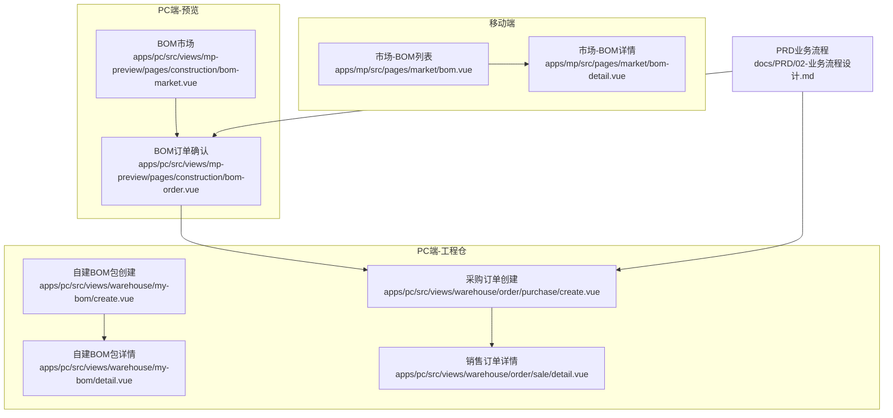
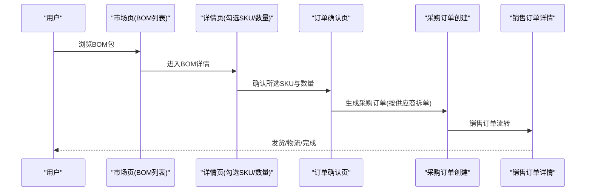
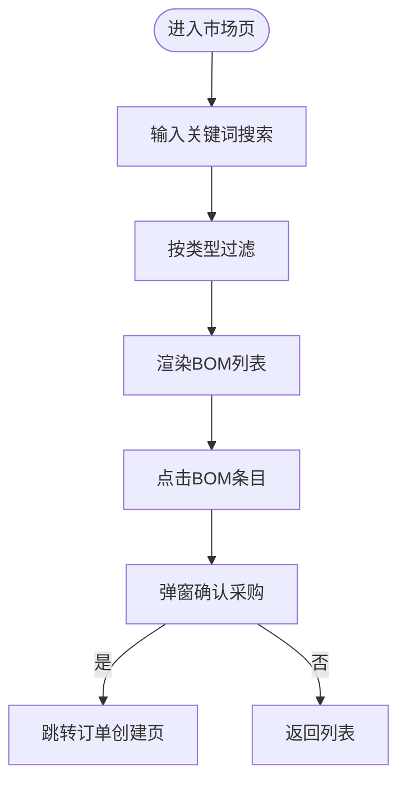
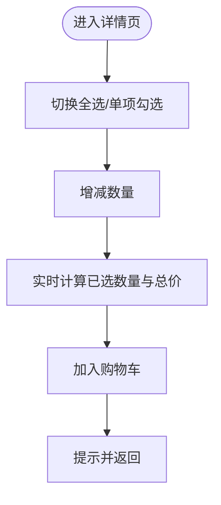
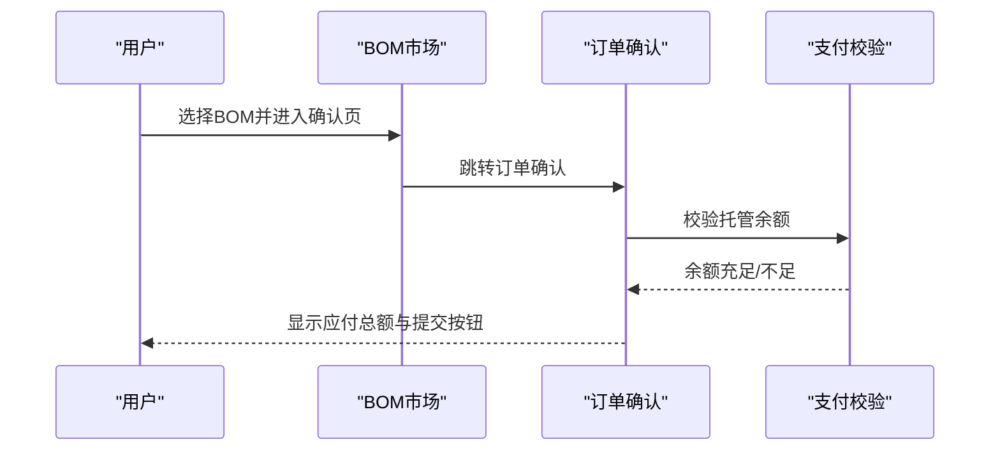
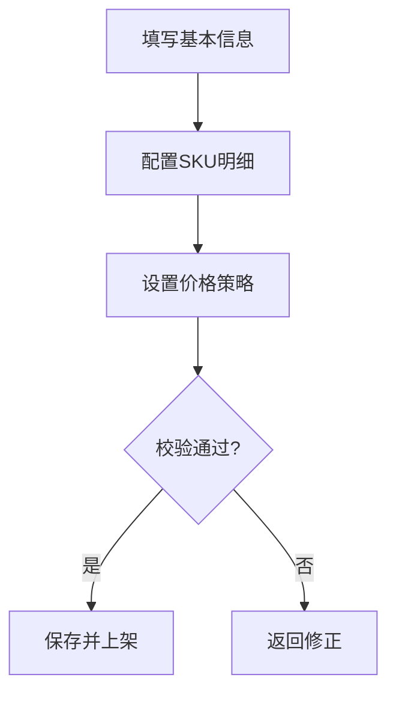
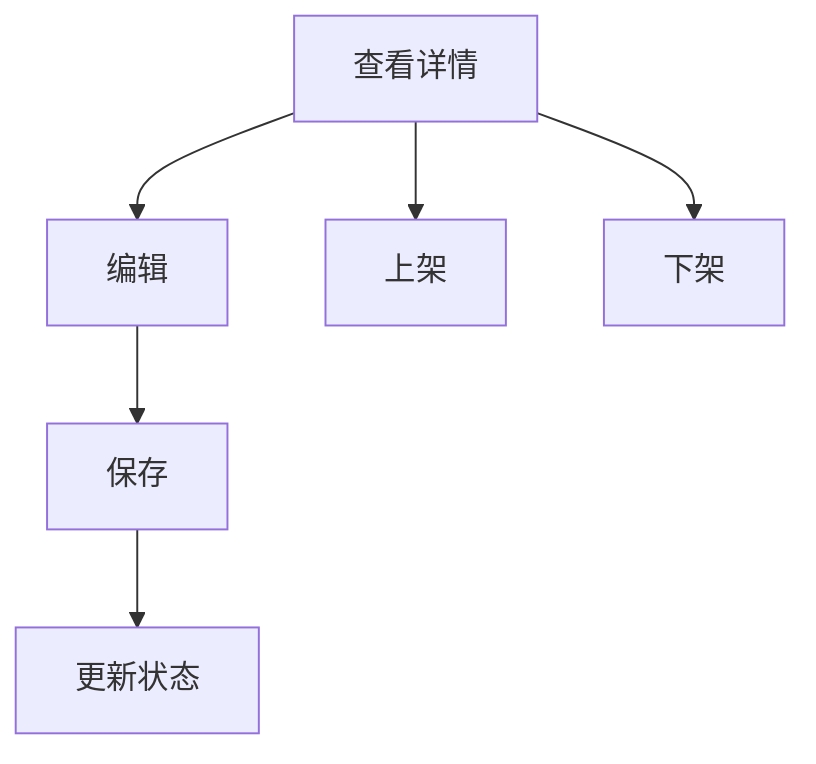
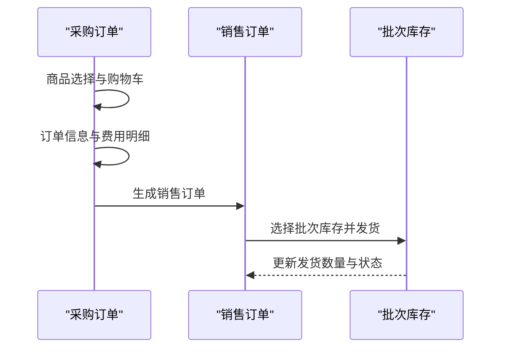
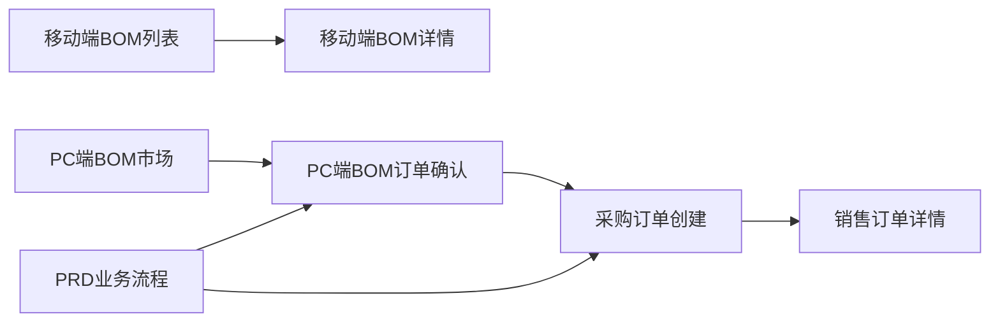

# BOM基装包管理

<cite>
**本文引用的文件**
- [apps/mp/src/pages/market/bom.vue](file://apps/mp/src/pages/market/bom.vue)
- [apps/mp/src/pages/market/bom-detail.vue](file://apps/mp/src/pages/market/bom-detail.vue)
- [apps/pc/src/views/mp-preview/pages/construction/bom-market.vue](file://apps/pc/src/views/mp-preview/pages/construction/bom-market.vue)
- [apps/pc/src/views/mp-preview/pages/construction/bom-order.vue](file://apps/pc/src/views/mp-preview/pages/construction/bom-order.vue)
- [apps/pc/src/views/warehouse/my-bom/create.vue](file://apps/pc/src/views/warehouse/my-bom/create.vue)
- [apps/pc/src/views/warehouse/my-bom/detail.vue](file://apps/pc/src/views/warehouse/my-bom/detail.vue)
- [apps/pc/src/views/warehouse/order/purchase/create.vue](file://apps/pc/src/views/warehouse/order/purchase/create.vue)
- [apps/pc/src/views/warehouse/order/sale/detail.vue](file://apps/pc/src/views/warehouse/order/sale/detail.vue)
- [docs/PRD/02-业务流程设计.md](file://docs/PRD/02-业务流程设计.md)
</cite>

## 目录
1. [简介](#简介)
2. [项目结构](#项目结构)
3. [核心组件](#核心组件)
4. [架构总览](#架构总览)
5. [详细组件分析](#详细组件分析)
6. [依赖关系分析](#依赖关系分析)
7. [性能考量](#性能考量)
8. [故障排查指南](#故障排查指南)
9. [结论](#结论)
10. [附录](#附录)

## 简介
本文件面向工程仓BOM基装包管理功能，系统化梳理BOM包的完整生命周期：从BOM包创建、编辑、详情查看，到BOM包订单处理与执行。文档覆盖数据结构设计、物料清单配置、价格计算规则、库存匹配机制、订单生成流程等技术实现，并提供最佳实践与项目管理建议，帮助研发与运营团队高效落地与维护。

## 项目结构
围绕BOM基装包管理，前端在移动端与PC端分别提供“市场浏览”“BOM详情”“订单确认”“自建BOM包创建/详情”以及“采购/销售订单管理”等页面；PRD文档提供了业务流程规范与约束。

图表来源
- [apps/mp/src/pages/market/bom.vue:1-378](file://apps/mp/src/pages/market/bom.vue#L1-L378)
- [apps/mp/src/pages/market/bom-detail.vue:1-366](file://apps/mp/src/pages/market/bom-detail.vue#L1-L366)
- [apps/pc/src/views/mp-preview/pages/construction/bom-market.vue:1-350](file://apps/pc/src/views/mp-preview/pages/construction/bom-market.vue#L1-L350)
- [apps/pc/src/views/mp-preview/pages/construction/bom-order.vue:1-530](file://apps/pc/src/views/mp-preview/pages/construction/bom-order.vue#L1-L530)
- [apps/pc/src/views/warehouse/my-bom/create.vue:1-521](file://apps/pc/src/views/warehouse/my-bom/create.vue#L1-L521)
- [apps/pc/src/views/warehouse/my-bom/detail.vue:1-257](file://apps/pc/src/views/warehouse/my-bom/detail.vue#L1-L257)
- [apps/pc/src/views/warehouse/order/purchase/create.vue:1-468](file://apps/pc/src/views/warehouse/order/purchase/create.vue#L1-L468)
- [apps/pc/src/views/warehouse/order/sale/detail.vue:1-633](file://apps/pc/src/views/warehouse/order/sale/detail.vue#L1-L633)
- [docs/PRD/02-业务流程设计.md:1167-1191](file://docs/PRD/02-业务流程设计.md#L1167-L1191)

章节来源
- [apps/mp/src/pages/market/bom.vue:1-378](file://apps/mp/src/pages/market/bom.vue#L1-L378)
- [apps/pc/src/views/mp-preview/pages/construction/bom-market.vue:1-350](file://apps/pc/src/views/mp-preview/pages/construction/bom-market.vue#L1-L350)

## 核心组件
- 市场BOM包列表与筛选：移动端市场页提供搜索、类型过滤、列表展示与“立即采购”入口。
- BOM包详情与购物车：移动端详情页支持全选、数量变更、价格计算与加入购物车。
- BOM市场与订单确认：PC端预览页提供BOM卡片、分类筛选、排序与订单确认页。
- 自建BOM包创建：PC端工程仓提供三步式创建流程（基本信息/SKU明细/价格设置），支持从平台BOM导入与复制。
- 自建BOM包详情：展示BOM基本信息、价格策略、SKU明细、销售统计与上下架控制。
- 采购/销售订单：采购订单创建支持商品选择、购物车、订单确认与提交；销售订单详情支持发货、批次选择与物流跟踪。

章节来源
- [apps/mp/src/pages/market/bom.vue:82-172](file://apps/mp/src/pages/market/bom.vue#L82-L172)
- [apps/mp/src/pages/market/bom-detail.vue:67-115](file://apps/mp/src/pages/market/bom-detail.vue#L67-L115)
- [apps/pc/src/views/mp-preview/pages/construction/bom-market.vue:91-134](file://apps/pc/src/views/mp-preview/pages/construction/bom-market.vue#L91-L134)
- [apps/pc/src/views/mp-preview/pages/construction/bom-order.vue:111-168](file://apps/pc/src/views/mp-preview/pages/construction/bom-order.vue#L111-L168)
- [apps/pc/src/views/warehouse/my-bom/create.vue:214-344](file://apps/pc/src/views/warehouse/my-bom/create.vue#L214-L344)
- [apps/pc/src/views/warehouse/my-bom/detail.vue:139-198](file://apps/pc/src/views/warehouse/my-bom/detail.vue#L139-L198)
- [apps/pc/src/views/warehouse/order/purchase/create.vue:211-322](file://apps/pc/src/views/warehouse/order/purchase/create.vue#L211-L322)
- [apps/pc/src/views/warehouse/order/sale/detail.vue:327-591](file://apps/pc/src/views/warehouse/order/sale/detail.vue#L327-L591)

## 架构总览
BOM基装包管理涉及“前端页面层”“业务流程层”“数据与交互层”。移动端用于快速浏览与下单，PC端预览页用于更丰富的BOM市场体验，PC端工程仓用于自建BOM包与订单管理。PRD对BOM包采购流程进行了规范，强调“按供应商拆单”的订单处理原则。

图表来源
- [apps/mp/src/pages/market/bom.vue:157-171](file://apps/mp/src/pages/market/bom.vue#L157-L171)
- [apps/mp/src/pages/market/bom-detail.vue:104-114](file://apps/mp/src/pages/market/bom-detail.vue#L104-L114)
- [apps/pc/src/views/mp-preview/pages/construction/bom-order.vue:160-167](file://apps/pc/src/views/mp-preview/pages/construction/bom-order.vue#L160-L167)
- [apps/pc/src/views/warehouse/order/purchase/create.vue:296-310](file://apps/pc/src/views/warehouse/order/purchase/create.vue#L296-L310)
- [apps/pc/src/views/warehouse/order/sale/detail.vue:416-575](file://apps/pc/src/views/warehouse/order/sale/detail.vue#L416-L575)
- [docs/PRD/02-业务流程设计.md:1167-1191](file://docs/PRD/02-业务流程设计.md#L1167-L1191)

## 详细组件分析

### 组件A：市场BOM包列表与筛选
- 功能要点
  - 支持关键词搜索（名称/编码）
  - 类型过滤（平台标准/自定义）
  - 列表项包含：标签、编码、标题、描述、信息摘要、主要商品标签、供应商信息、立即采购按钮
- 数据与交互
  - 使用本地静态数据模拟BOM包集合
  - 点击“立即采购”弹窗确认后跳转至订单创建页
- 性能与可用性
  - 列表渲染采用虚拟滚动或分页优化（当前为静态数据，建议结合后端接口时引入分页）

图表来源
- [apps/mp/src/pages/market/bom.vue:82-172](file://apps/mp/src/pages/market/bom.vue#L82-L172)

章节来源
- [apps/mp/src/pages/market/bom.vue:82-172](file://apps/mp/src/pages/market/bom.vue#L82-L172)

### 组件B：BOM包详情与购物车
- 功能要点
  - 展示BOM包名称、类型、描述、标签、材料种类、预估总价
  - 材料清单支持勾选、数量增减、全选、实时计算已选总金额
  - 加入购物车后返回列表
- 数据与交互
  - 本地静态产品列表，含图片、规格、单价、单位、数量、是否选中
  - 全选逻辑与选中计数、总价计算均基于computed
- 性能与可用性
  - 大量SKU时建议懒加载与分页；本地计算复杂度低，注意避免重复渲染

图表来源
- [apps/mp/src/pages/market/bom-detail.vue:67-115](file://apps/mp/src/pages/market/bom-detail.vue#L67-L115)

章节来源
- [apps/mp/src/pages/market/bom-detail.vue:67-115](file://apps/mp/src/pages/market/bom-detail.vue#L67-L115)

### 组件C：BOM市场与订单确认（PC端预览）
- 功能要点
  - BOM市场页：搜索、分类筛选、排序（综合/销量/价格升降）、BOM卡片展示、热门/推荐标签
  - 订单确认页：BOM摘要、收货信息、已选SKU明细、供应商拆单预览、支付方式与余额校验、备注、应付总额、提交订单
- 数据与交互
  - 分类与搜索通过computed过滤
  - 供应商拆单预览与应付总额基于selectedSkuList与quantity计算
  - 余额不足时禁用提交按钮并提示

图表来源
- [apps/pc/src/views/mp-preview/pages/construction/bom-market.vue:91-134](file://apps/pc/src/views/mp-preview/pages/construction/bom-market.vue#L91-L134)
- [apps/pc/src/views/mp-preview/pages/construction/bom-order.vue:111-168](file://apps/pc/src/views/mp-preview/pages/construction/bom-order.vue#L111-L168)

章节来源
- [apps/pc/src/views/mp-preview/pages/construction/bom-market.vue:91-134](file://apps/pc/src/views/mp-preview/pages/construction/bom-market.vue#L91-L134)
- [apps/pc/src/views/mp-preview/pages/construction/bom-order.vue:111-168](file://apps/pc/src/views/mp-preview/pages/construction/bom-order.vue#L111-L168)

### 组件D：自建BOM包创建（工程仓）
- 功能要点
  - 三步式流程：基本信息（名称/类型/分类/图片/说明）、SKU明细（添加/导入/编辑/数量/单价/是否必选）、价格设置（固定/动态策略）
  - 支持从平台BOM导入并复制编辑
  - 预估成本、销售价格、毛利率实时计算
- 数据与交互
  - 表单数据结构包含：基础信息、SKU列表、价格策略、加价模式与值
  - 步骤校验：每步必填项校验，最后提交保存并上架

图表来源
- [apps/pc/src/views/warehouse/my-bom/create.vue:214-344](file://apps/pc/src/views/warehouse/my-bom/create.vue#L214-L344)

章节来源
- [apps/pc/src/views/warehouse/my-bom/create.vue:214-344](file://apps/pc/src/views/warehouse/my-bom/create.vue#L214-L344)

### 组件E：自建BOM包详情（工程仓）
- 功能要点
  - 展示BOM基本信息、来源（继承/自建）、状态（上架/下架）、价格信息（策略/成本/销售/毛利率）、SKU明细、销售统计
  - 支持编辑、上架/下架操作
- 数据与交互
  - 详情数据结构包含：基础信息、SKU列表、销售统计、价格信息

图表来源
- [apps/pc/src/views/warehouse/my-bom/detail.vue:139-198](file://apps/pc/src/views/warehouse/my-bom/detail.vue#L139-L198)

章节来源
- [apps/pc/src/views/warehouse/my-bom/detail.vue:139-198](file://apps/pc/src/views/warehouse/my-bom/detail.vue#L139-L198)

### 组件F：采购/销售订单（工程仓）
- 功能要点
  - 采购订单：商品选择（分类/搜索/库存限制）、购物车、订单信息（收货仓库/交货日期/地址/联系人/电话/备注）、费用明细、提交成功
  - 销售订单：订单状态/支付状态、客户/收货信息、物流信息、商品明细（已发/待发/出库状态）、发货记录、订单进度
- 数据与交互
  - 采购订单：购物车实时计算、提交前校验、生成订单号
  - 销售订单：精细化发货（按批次库存选择）、发货记录与状态更新

图表来源
- [apps/pc/src/views/warehouse/order/purchase/create.vue:211-322](file://apps/pc/src/views/warehouse/order/purchase/create.vue#L211-L322)
- [apps/pc/src/views/warehouse/order/sale/detail.vue:327-591](file://apps/pc/src/views/warehouse/order/sale/detail.vue#L327-L591)

章节来源
- [apps/pc/src/views/warehouse/order/purchase/create.vue:211-322](file://apps/pc/src/views/warehouse/order/purchase/create.vue#L211-L322)
- [apps/pc/src/views/warehouse/order/sale/detail.vue:327-591](file://apps/pc/src/views/warehouse/order/sale/detail.vue#L327-L591)

## 依赖关系分析
- 页面耦合
  - 市场页与详情页：导航与数据传递（BOM ID）
  - 订单确认页与采购订单创建页：拆单与提交流程衔接
  - 销售订单详情与批次库存：发货与状态联动
- 外部依赖
  - PRD对BOM包采购流程的约束（按供应商拆单）
  - 支付与余额校验（托管账户）
- 循环依赖
  - 当前页面间为单向导航，未见循环依赖

图表来源
- [apps/mp/src/pages/market/bom.vue:157-171](file://apps/mp/src/pages/market/bom.vue#L157-L171)
- [apps/mp/src/pages/market/bom-detail.vue:104-114](file://apps/mp/src/pages/market/bom-detail.vue#L104-L114)
- [apps/pc/src/views/mp-preview/pages/construction/bom-market.vue:131-133](file://apps/pc/src/views/mp-preview/pages/construction/bom-market.vue#L131-L133)
- [apps/pc/src/views/mp-preview/pages/construction/bom-order.vue:160-167](file://apps/pc/src/views/mp-preview/pages/construction/bom-order.vue#L160-L167)
- [apps/pc/src/views/warehouse/order/purchase/create.vue:296-310](file://apps/pc/src/views/warehouse/order/purchase/create.vue#L296-L310)
- [apps/pc/src/views/warehouse/order/sale/detail.vue:416-575](file://apps/pc/src/views/warehouse/order/sale/detail.vue#L416-L575)
- [docs/PRD/02-业务流程设计.md:1167-1191](file://docs/PRD/02-业务流程设计.md#L1167-L1191)

章节来源
- [apps/pc/src/views/mp-preview/pages/construction/bom-market.vue:91-134](file://apps/pc/src/views/mp-preview/pages/construction/bom-market.vue#L91-L134)
- [apps/pc/src/views/mp-preview/pages/construction/bom-order.vue:111-168](file://apps/pc/src/views/mp-preview/pages/construction/bom-order.vue#L111-L168)
- [apps/pc/src/views/warehouse/order/purchase/create.vue:211-322](file://apps/pc/src/views/warehouse/order/purchase/create.vue#L211-L322)
- [apps/pc/src/views/warehouse/order/sale/detail.vue:327-591](file://apps/pc/src/views/warehouse/order/sale/detail.vue#L327-L591)
- [docs/PRD/02-业务流程设计.md:1167-1191](file://docs/PRD/02-业务流程设计.md#L1167-L1191)

## 性能考量
- 渲染优化
  - 列表分页与虚拟滚动，减少DOM节点数量
  - SKU明细表格使用懒加载与行内编辑，避免频繁重绘
- 计算优化
  - 价格与数量计算使用computed缓存，减少重复计算
  - 批次库存选择采用局部状态更新，避免全量重算
- 网络与存储
  - 将静态演示数据替换为分页接口，按需加载
  - 本地缓存常用筛选条件与购物车快照，提升二次访问速度

## 故障排查指南
- 余额不足无法提交
  - 现象：订单确认页提交按钮禁用或提示余额不足
  - 排查：检查托管账户余额与应付总额计算逻辑
  - 参考路径：[apps/pc/src/views/mp-preview/pages/construction/bom-order.vue:156-158](file://apps/pc/src/views/mp-preview/pages/construction/bom-order.vue#L156-L158)
- 数量超过库存
  - 现象：添加到采购清单时报“数量超过库存”
  - 排查：校验商品库存与输入数量，确保不超过stock上限
  - 参考路径：[apps/pc/src/views/warehouse/order/purchase/create.vue:270-273](file://apps/pc/src/views/warehouse/order/purchase/create.vue#L270-L273)
- 发货数量与待发货不一致
  - 现象：发货弹窗提示差异
  - 排查：确认批次选择与发货数量一致性，必要时二次确认
  - 参考路径：[apps/pc/src/views/warehouse/order/sale/detail.vue:505-518](file://apps/pc/src/views/warehouse/order/sale/detail.vue#L505-L518)
- 上架/下架状态异常
  - 现象：状态未正确更新
  - 排查：检查Modal确认与状态字段更新逻辑
  - 参考路径：[apps/pc/src/views/warehouse/my-bom/detail.vue:178-198](file://apps/pc/src/views/warehouse/my-bom/detail.vue#L178-L198)

章节来源
- [apps/pc/src/views/mp-preview/pages/construction/bom-order.vue:156-158](file://apps/pc/src/views/mp-preview/pages/construction/bom-order.vue#L156-L158)
- [apps/pc/src/views/warehouse/order/purchase/create.vue:270-273](file://apps/pc/src/views/warehouse/order/purchase/create.vue#L270-L273)
- [apps/pc/src/views/warehouse/order/sale/detail.vue:505-518](file://apps/pc/src/views/warehouse/order/sale/detail.vue#L505-L518)
- [apps/pc/src/views/warehouse/my-bom/detail.vue:178-198](file://apps/pc/src/views/warehouse/my-bom/detail.vue#L178-L198)

## 结论
BOM基装包管理在当前版本以页面级演示为主，覆盖了从市场浏览、BOM详情、订单确认到自建BOM包创建与订单执行的完整闭环。建议后续重点推进以下方向：接口化数据、分页与搜索优化、批次库存精细化管理、价格策略与促销规则扩展，以及跨端数据同步与审计日志完善，以支撑真实业务场景下的高并发与高可用。

## 附录
- 最佳实践
  - 数据结构标准化：SKU明细统一字段、价格策略枚举化
  - 订单拆单策略：按供应商拆单、按仓库拆单、按批次拆单
  - 价格计算：固定价与动态价双轨制，支持折扣/满减/阶梯价
  - 库存匹配：批次优先、保质期优先、就近仓库
  - 订单状态机：待支付、已支付、待发货、发货中、已完成、已取消
- 项目管理建议
  - 分阶段交付：先完成BOM市场与详情，再补齐自建BOM包与订单流程
  - 接口先行：定义清晰的BOM、SKU、订单、库存接口契约
  - 测试覆盖：单元测试SKU计算、订单拆单、发货批次选择
  - 文档同步：PRD与前端页面保持同步更新