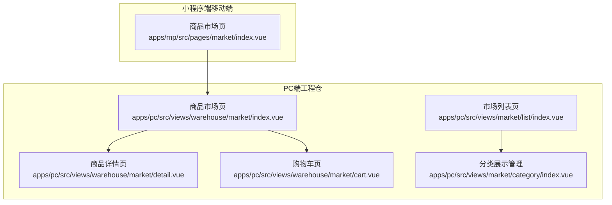
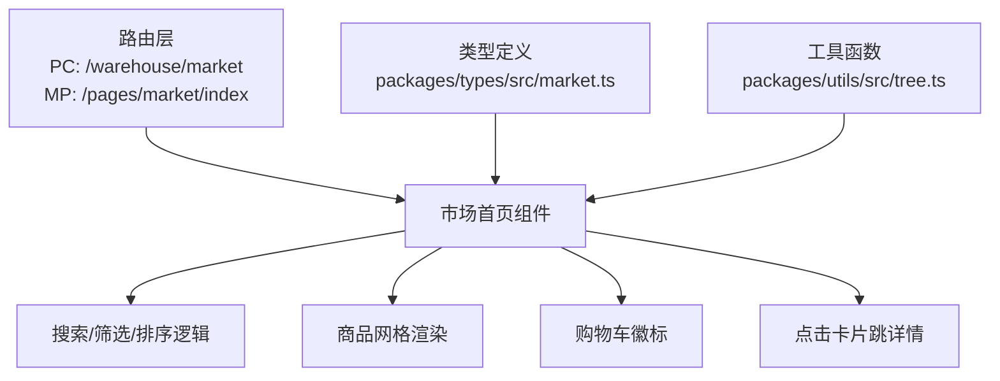
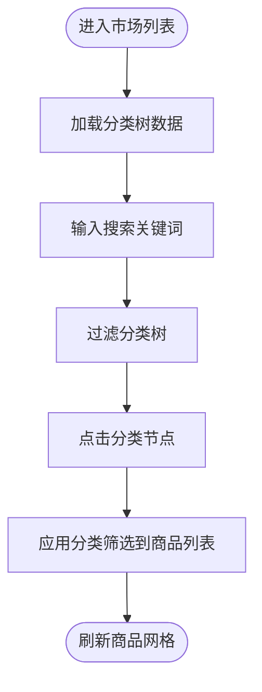
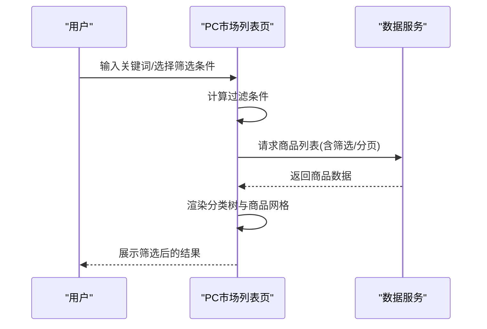
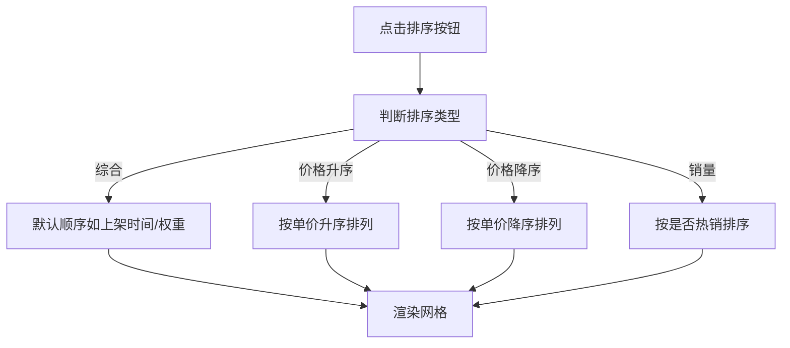
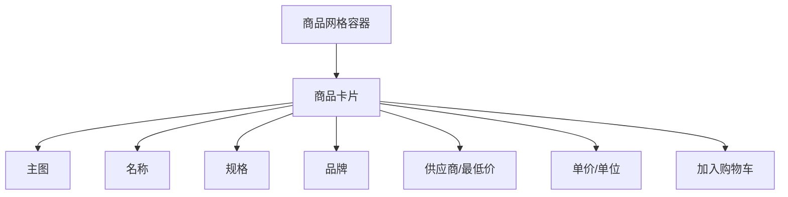
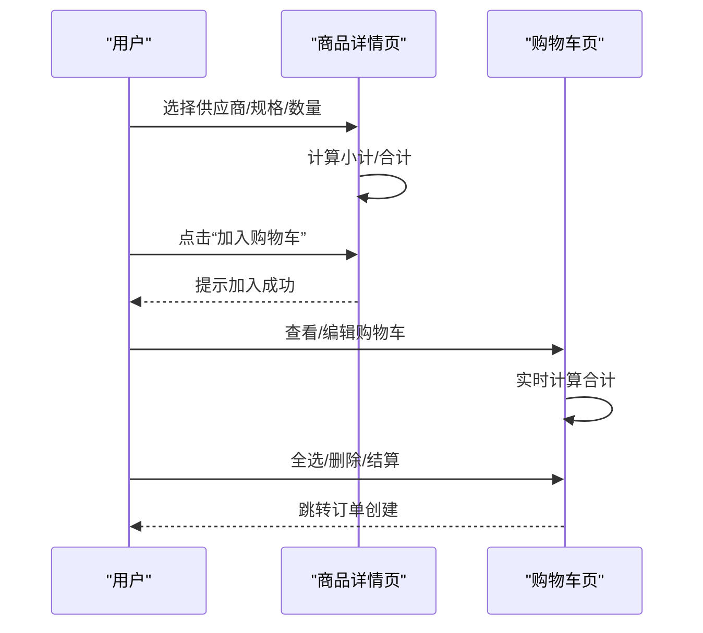
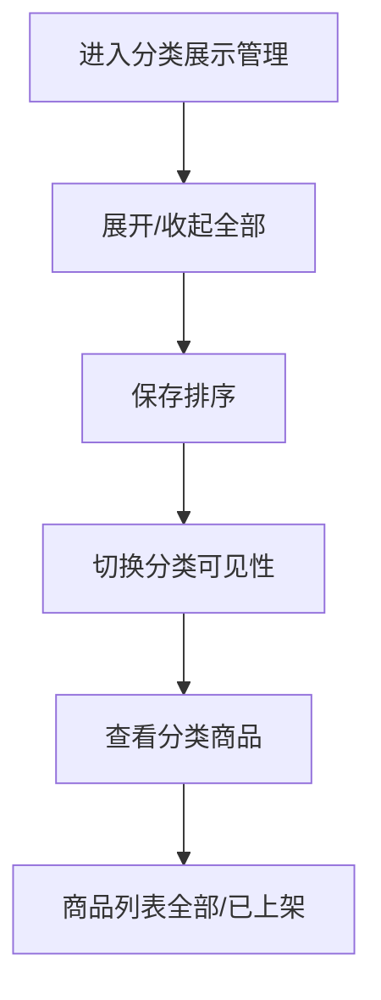
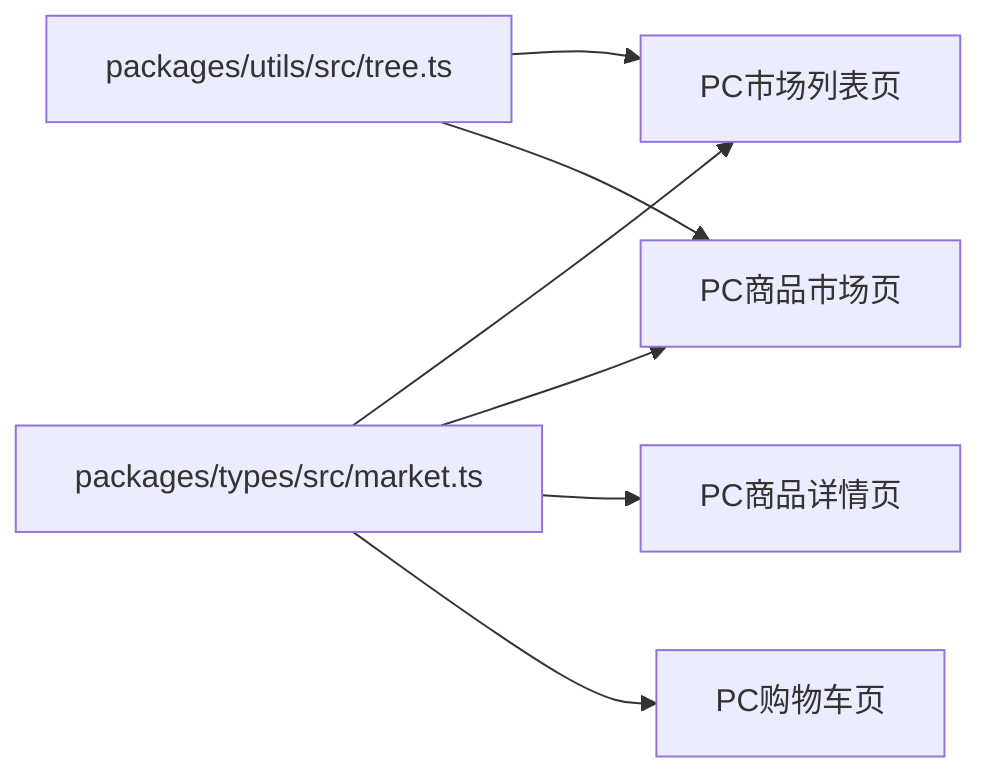

# 商品市场浏览

<cite>
**本文引用的文件**
- [PRD-商品市场模块v1.0.md](file://PRD-商品市场模块v1.0.md)
- [docs/PRD/06-商品板块功能清单.md](file://docs/PRD/06-商品板块功能清单.md)
- [apps/pc/src/views/market/list/index.vue](file://apps/pc/src/views/market/list/index.vue)
- [apps/pc/src/views/market/category/index.vue](file://apps/pc/src/views/market/category/index.vue)
- [apps/pc/src/views/warehouse/market/index.vue](file://apps/pc/src/views/warehouse/market/index.vue)
- [apps/pc/src/views/warehouse/market/detail.vue](file://apps/pc/src/views/warehouse/market/detail.vue)
- [apps/pc/src/views/warehouse/market/cart.vue](file://apps/pc/src/views/warehouse/market/cart.vue)
- [apps/mp/src/pages/market/index.vue](file://apps/mp/src/pages/market/index.vue)
- [packages/types/src/market.ts](file://packages/types/src/market.ts)
- [packages/utils/src/tree.ts](file://packages/utils/src/tree.ts)
</cite>

## 目录
1. [简介](#简介)
2. [项目结构](#项目结构)
3. [核心组件](#核心组件)
4. [架构总览](#架构总览)
5. [详细组件分析](#详细组件分析)
6. [依赖分析](#依赖分析)
7. [性能考虑](#性能考虑)
8. [故障排查指南](#故障排查指南)
9. [结论](#结论)
10. [附录](#附录)

## 简介
本文件面向工程仓商品市场浏览功能，围绕“商品分类树形结构展示、商品搜索过滤、价格排序机制、商品网格布局”等核心能力，系统梳理前端实现与交互流程，并结合PRD与类型定义给出技术实现细节、最佳实践与用户体验优化建议。目标读者既包括工程师也包括产品经理与运营人员，帮助快速理解与落地商品市场浏览的全链路体验。

## 项目结构
工程仓商品市场浏览涉及PC端与小程序两端：
- PC端（工程仓侧）：商品市场首页采用左侧分类树 + 右侧商品网格布局；支持关键词搜索、分类筛选、供应商筛选、供货状态筛选、价格排序等。
- 小程序端（移动端）：商品市场首页采用顶部搜索 + 分类横向滚动 + 网格布局；支持综合/销量/价格排序、筛选面板、BOM包与采购记录等。

图表来源
- [apps/pc/src/views/warehouse/market/index.vue:1-440](file://apps/pc/src/views/warehouse/market/index.vue#L1-L440)
- [apps/pc/src/views/warehouse/market/detail.vue:1-723](file://apps/pc/src/views/warehouse/market/detail.vue#L1-L723)
- [apps/pc/src/views/warehouse/market/cart.vue:1-312](file://apps/pc/src/views/warehouse/market/cart.vue#L1-L312)
- [apps/pc/src/views/market/list/index.vue:1-800](file://apps/pc/src/views/market/list/index.vue#L1-L800)
- [apps/pc/src/views/market/category/index.vue:1-549](file://apps/pc/src/views/market/category/index.vue#L1-L549)
- [apps/mp/src/pages/market/index.vue:1-800](file://apps/mp/src/pages/market/index.vue#L1-L800)

章节来源
- [apps/pc/src/views/warehouse/market/index.vue:1-440](file://apps/pc/src/views/warehouse/market/index.vue#L1-L440)
- [apps/pc/src/views/warehouse/market/detail.vue:1-723](file://apps/pc/src/views/warehouse/market/detail.vue#L1-L723)
- [apps/pc/src/views/warehouse/market/cart.vue:1-312](file://apps/pc/src/views/warehouse/market/cart.vue#L1-L312)
- [apps/pc/src/views/market/list/index.vue:1-800](file://apps/pc/src/views/market/list/index.vue#L1-L800)
- [apps/pc/src/views/market/category/index.vue:1-549](file://apps/pc/src/views/market/category/index.vue#L1-L549)
- [apps/mp/src/pages/market/index.vue:1-800](file://apps/mp/src/pages/market/index.vue#L1-L800)

## 核心组件
- 商品分类树（PC端）：左侧分类树 + 分类计数 + 搜索分类；支持点击分类联动筛选商品列表。
- 商品搜索与筛选（PC端）：关键词搜索、分类级联选择、供应商选择、供货状态筛选；支持批量导入、批量上架/下架、批量调价、批量设置权限。
- 价格排序机制（PC端/小程序端）：综合排序、价格升序/降序；支持销量排序（小程序端）。
- 商品网格布局（PC端/小程序端）：卡片式网格、主图、名称、规格、供应商/价格、加入购物车等。
- 商品详情与购物车（PC端）：供应商选择、规格选择、数量与小计计算、全选/合计、结算流程。

章节来源
- [apps/pc/src/views/market/list/index.vue:1-800](file://apps/pc/src/views/market/list/index.vue#L1-L800)
- [apps/pc/src/views/warehouse/market/index.vue:1-440](file://apps/pc/src/views/warehouse/market/index.vue#L1-L440)
- [apps/pc/src/views/warehouse/market/detail.vue:1-723](file://apps/pc/src/views/warehouse/market/detail.vue#L1-L723)
- [apps/pc/src/views/warehouse/market/cart.vue:1-312](file://apps/pc/src/views/warehouse/market/cart.vue#L1-L312)
- [apps/mp/src/pages/market/index.vue:1-800](file://apps/mp/src/pages/market/index.vue#L1-L800)

## 架构总览
商品市场浏览从前端路由到页面组件，再到数据模型与工具函数，形成清晰的层次化架构：

图表来源
- [apps/pc/src/views/warehouse/market/index.vue:1-440](file://apps/pc/src/views/warehouse/market/index.vue#L1-L440)
- [apps/mp/src/pages/market/index.vue:1-800](file://apps/mp/src/pages/market/index.vue#L1-L800)
- [packages/types/src/market.ts:1-212](file://packages/types/src/market.ts#L1-L212)
- [packages/utils/src/tree.ts:1-114](file://packages/utils/src/tree.ts#L1-L114)

## 详细组件分析

### 商品分类树形结构展示
- PC端市场列表页提供“商品分类”侧边栏，使用树形控件展示分类层级与商品计数，支持搜索分类关键词、展开/收起、重置筛选。
- 分类树的数据结构来自类型定义中的分类模型，支持父子关系与层级字段，便于渲染与统计。

图表来源
- [apps/pc/src/views/market/list/index.vue:1-800](file://apps/pc/src/views/market/list/index.vue#L1-L800)
- [packages/types/src/market.ts:121-133](file://packages/types/src/market.ts#L121-L133)

章节来源
- [apps/pc/src/views/market/list/index.vue:1-800](file://apps/pc/src/views/market/list/index.vue#L1-L800)
- [packages/types/src/market.ts:121-133](file://packages/types/src/market.ts#L121-L133)

### 商品搜索与筛选
- PC端市场列表页支持关键词搜索（商品名称/编码）、分类级联选择、供应商选择、供货状态筛选；并提供批量导入、批量上架/下架、批量调价、批量设置权限等运营能力。
- 小程序端市场页支持关键词搜索（商品名称/编码/供应商）、分类横向滚动、综合/销量/价格排序、筛选面板（供应商、价格区间）。

图表来源
- [apps/pc/src/views/market/list/index.vue:1-800](file://apps/pc/src/views/market/list/index.vue#L1-L800)
- [apps/mp/src/pages/market/index.vue:1-800](file://apps/mp/src/pages/market/index.vue#L1-L800)

章节来源
- [apps/pc/src/views/market/list/index.vue:1-800](file://apps/pc/src/views/market/list/index.vue#L1-L800)
- [apps/mp/src/pages/market/index.vue:1-800](file://apps/mp/src/pages/market/index.vue#L1-L800)

### 价格排序机制
- PC端工程仓市场页支持综合排序、价格升序、价格降序；价格来源于商品的市场价或供应商最低价。
- 小程序端支持综合、销量、价格排序，价格排序为升/降序切换。

图表来源
- [apps/pc/src/views/warehouse/market/index.vue:259-269](file://apps/pc/src/views/warehouse/market/index.vue#L259-L269)
- [apps/mp/src/pages/market/index.vue:510-521](file://apps/mp/src/pages/market/index.vue#L510-L521)

章节来源
- [apps/pc/src/views/warehouse/market/index.vue:259-269](file://apps/pc/src/views/warehouse/market/index.vue#L259-L269)
- [apps/mp/src/pages/market/index.vue:510-521](file://apps/mp/src/pages/market/index.vue#L510-L521)

### 商品网格布局展示
- PC端工程仓市场页采用栅格布局，左侧分类树 + 右侧商品网格，网格为4列布局，卡片包含主图、名称、规格、品牌、供应商/最低价、价格与“加入购物车”按钮。
- 小程序端采用网格布局，卡片包含主图、名称、规格、供应商/最低价、价格与“+”加入购物车按钮。

图表来源
- [apps/pc/src/views/warehouse/market/index.vue:327-425](file://apps/pc/src/views/warehouse/market/index.vue#L327-L425)
- [apps/mp/src/pages/market/index.vue:116-164](file://apps/mp/src/pages/market/index.vue#L116-L164)

章节来源
- [apps/pc/src/views/warehouse/market/index.vue:327-425](file://apps/pc/src/views/warehouse/market/index.vue#L327-L425)
- [apps/mp/src/pages/market/index.vue:116-164](file://apps/mp/src/pages/market/index.vue#L116-L164)

### 商品详情与购物车（PC端）
- 商品详情页：轮播图、SPU信息、价格区间、供应商选择、规格选择（含最小起订量、供货周期）、数量与小计、全选/合计、加入购物车/立即购买。
- 购物车页：支持批量删除、数量调整、实时小计/合计、全选、结算。

图表来源
- [apps/pc/src/views/warehouse/market/detail.vue:1-723](file://apps/pc/src/views/warehouse/market/detail.vue#L1-L723)
- [apps/pc/src/views/warehouse/market/cart.vue:1-312](file://apps/pc/src/views/warehouse/market/cart.vue#L1-L312)

章节来源
- [apps/pc/src/views/warehouse/market/detail.vue:1-723](file://apps/pc/src/views/warehouse/market/detail.vue#L1-L723)
- [apps/pc/src/views/warehouse/market/cart.vue:1-312](file://apps/pc/src/views/warehouse/market/cart.vue#L1-L312)

### 分类展示管理（PC端）
- 分类展示管理页支持展开/收起全部、保存排序、设置分类市场可见性、查看分类下商品列表（全部/已上架），并提供商品统计（总数/已上架/待上架/热门/推荐）。

图表来源
- [apps/pc/src/views/market/category/index.vue:1-549](file://apps/pc/src/views/market/category/index.vue#L1-L549)

章节来源
- [apps/pc/src/views/market/category/index.vue:1-549](file://apps/pc/src/views/market/category/index.vue#L1-L549)

## 依赖分析
- 类型定义：商品、供应商、价格调整、分类、库存等类型由统一类型包提供，确保前后端一致性。
- 工具函数：树形结构转换（数组转树、扁平化、路径查找、遍历、过滤）等工具函数，支撑分类树渲染与筛选逻辑。
- 组件耦合：市场首页组件依赖类型与工具函数；详情与购物车组件依赖路由与状态管理（此处为简化说明，具体状态管理由项目其他模块承担）。

图表来源
- [packages/types/src/market.ts:1-212](file://packages/types/src/market.ts#L1-L212)
- [packages/utils/src/tree.ts:1-114](file://packages/utils/src/tree.ts#L1-L114)
- [apps/pc/src/views/market/list/index.vue:1-800](file://apps/pc/src/views/market/list/index.vue#L1-L800)
- [apps/pc/src/views/warehouse/market/index.vue:1-440](file://apps/pc/src/views/warehouse/market/index.vue#L1-L440)
- [apps/pc/src/views/warehouse/market/detail.vue:1-723](file://apps/pc/src/views/warehouse/market/detail.vue#L1-L723)
- [apps/pc/src/views/warehouse/market/cart.vue:1-312](file://apps/pc/src/views/warehouse/market/cart.vue#L1-L312)

章节来源
- [packages/types/src/market.ts:1-212](file://packages/types/src/market.ts#L1-L212)
- [packages/utils/src/tree.ts:1-114](file://packages/utils/src/tree.ts#L1-L114)

## 性能考虑
- 首屏加载：商品列表分页加载，避免一次性渲染过多数据；分类树建议懒加载或虚拟滚动（若数据量大）。
- 过滤与排序：前端本地过滤/排序时，建议限制数据规模或采用分页；复杂筛选建议后端分页接口配合。
- 图片与渲染：网格卡片使用占位图与懒加载策略；价格/数量输入框使用防抖与即时反馈。
- 交互响应：排序与筛选触发频率较高，建议节流/防抖；购物车计算实时更新但应避免频繁重渲染。

## 故障排查指南
- 加购库存不足：当所选供应商库存不足时，应提示“当前供应商库存仅剩下X件”，并在购物车中置灰或禁用结算。
- 商品已下架：购物车中已下架商品应自动排除或置灰提示。
- 供应商停货：自动切换到下一个最低价供应商，或提示用户更换供应商。
- 分类不可见：检查分类“市场可见”开关与工程仓授权范围，确保商品在市场可见。

章节来源
- [PRD-商品市场模块v1.0.md:271-278](file://PRD-商品市场模块v1.0.md#L271-L278)

## 结论
工程仓商品市场浏览功能以“分类树 + 搜索筛选 + 价格排序 + 网格布局”为核心体验，辅以详情与购物车闭环，满足工程仓采购员高效选品与下单的需求。通过类型与工具函数的统一抽象，提升了跨端一致性与可维护性。建议在后续迭代中进一步完善后端分页与实时价格联动、增强异常场景提示与引导，持续优化首屏性能与交互流畅度。

## 附录
- PRD与功能清单参考：商品市场模块PRD与商品板块功能清单，明确了商品分类、搜索、筛选、排序、购物车与BOM包等核心能力与交互规则。
- 数据模型参考：市场商品、供应商、价格调整、分类、库存等类型定义，确保前后端字段一致与扩展性。

章节来源
- [PRD-商品市场模块v1.0.md:85-321](file://PRD-商品市场模块v1.0.md#L85-L321)
- [docs/PRD/06-商品板块功能清单.md:203-273](file://docs/PRD/06-商品板块功能清单.md#L203-L273)
- [packages/types/src/market.ts:1-212](file://packages/types/src/market.ts#L1-L212)