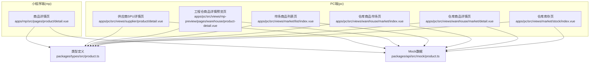
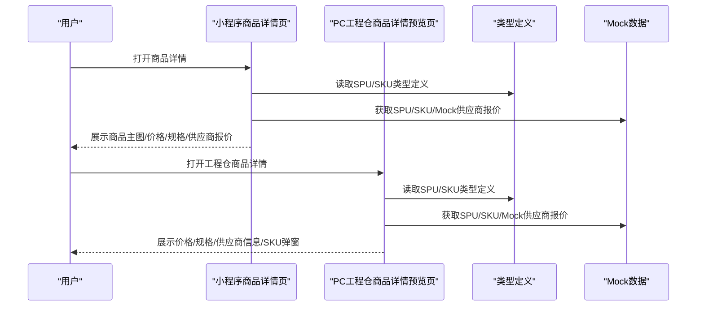
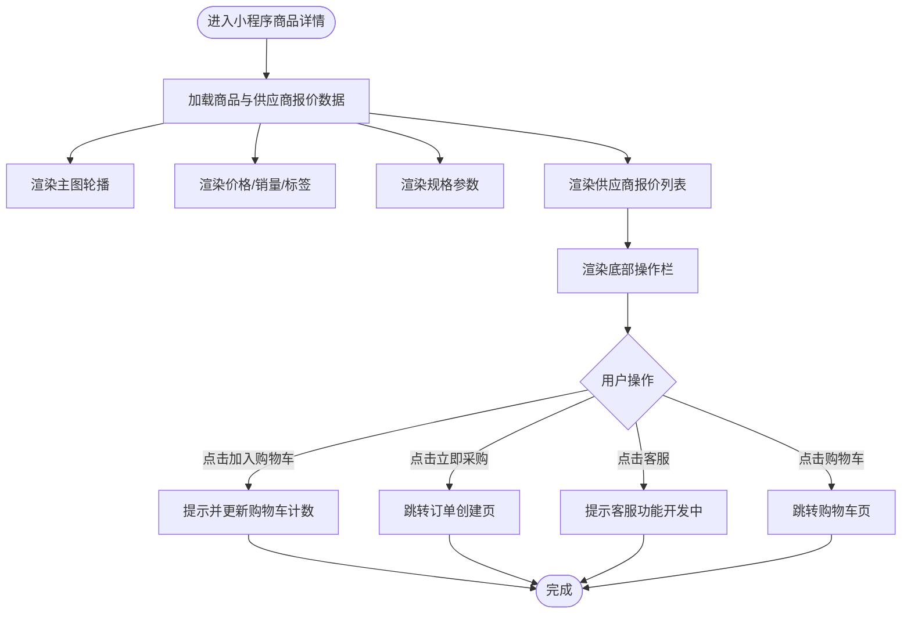
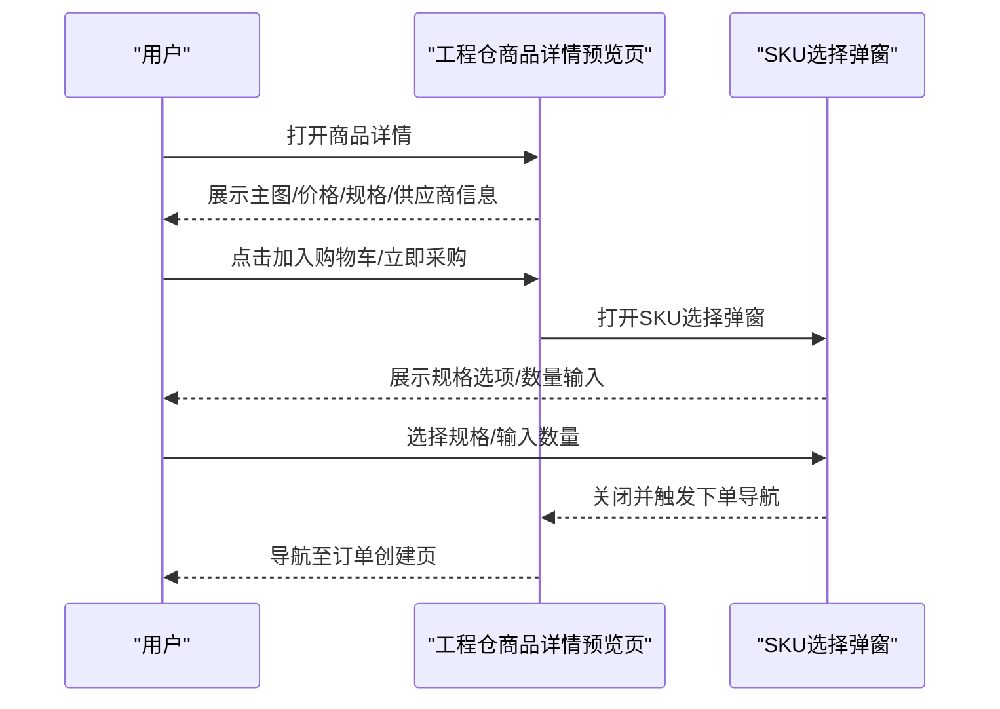
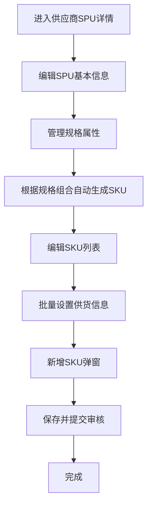
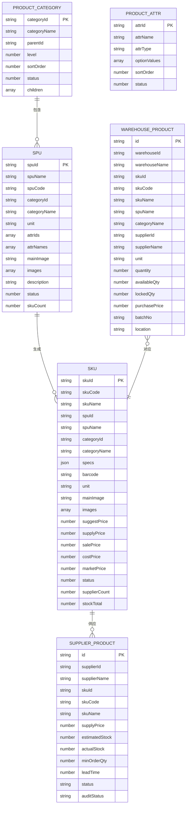
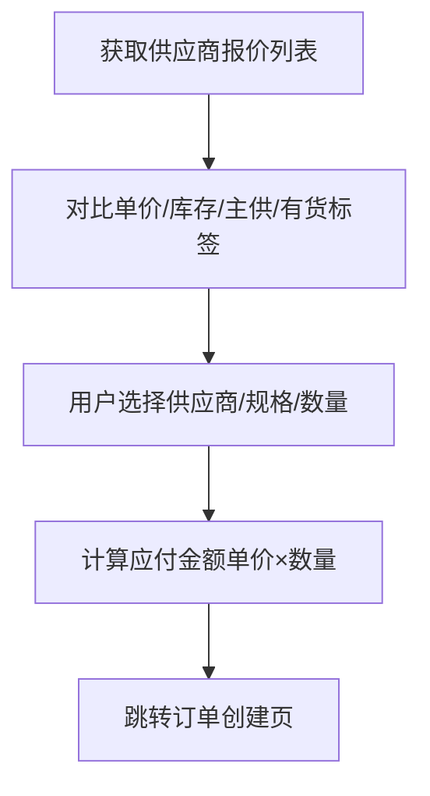
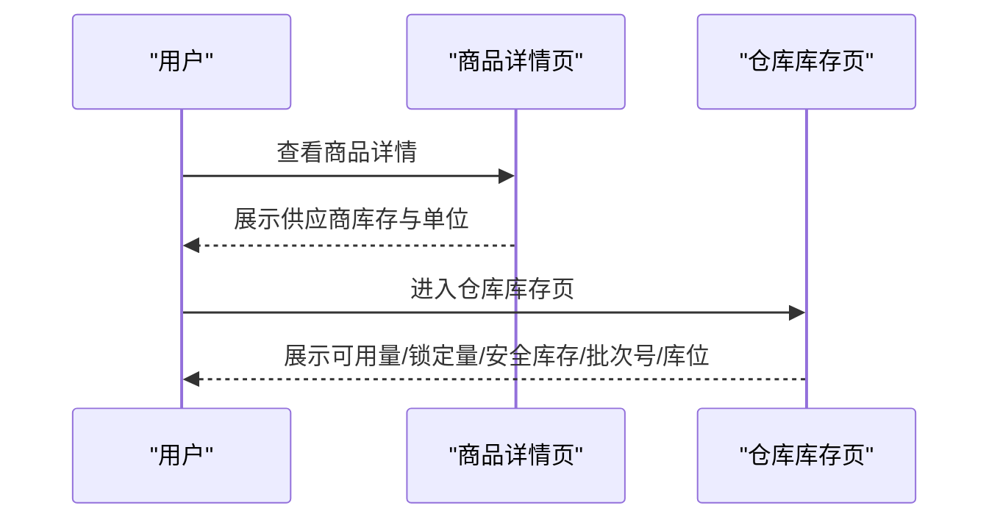
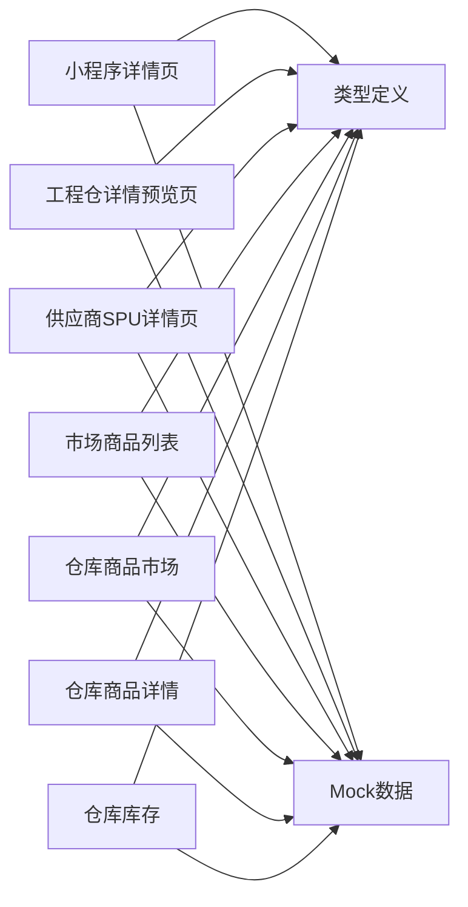

# 商品详情查看

<cite>
**本文引用的文件**
- [apps/mp/src/pages/product/detail.vue](file://apps/mp/src/pages/product/detail.vue)
- [apps/pc/src/views/supplier/product/detail.vue](file://apps/pc/src/views/supplier/product/detail.vue)
- [apps/pc/src/views/mp-preview/pages/warehouse/product-detail.vue](file://apps/pc/src/views/mp-preview/pages/warehouse/product-detail.vue)
- [packages/types/src/product.ts](file://packages/types/src/product.ts)
- [packages/api/src/mock/product.ts](file://packages/api/src/mock/product.ts)
- [apps/pc/src/views/market/list/index.vue](file://apps/pc/src/views/market/list/index.vue)
- [apps/pc/src/views/warehouse/market/index.vue](file://apps/pc/src/views/warehouse/market/index.vue)
- [apps/pc/src/views/warehouse/market/detail.vue](file://apps/pc/src/views/warehouse/market/detail.vue)
- [apps/pc/src/views/market/stock/index.vue](file://apps/pc/src/views/market/stock/index.vue)
</cite>

## 目录
1. [简介](#简介)
2. [项目结构](#项目结构)
3. [核心组件](#核心组件)
4. [架构总览](#架构总览)
5. [详细组件分析](#详细组件分析)
6. [依赖关系分析](#依赖关系分析)
7. [性能考量](#性能考量)
8. [故障排查指南](#故障排查指南)
9. [结论](#结论)
10. [附录](#附录)

## 简介
本文件围绕“工程仓商品详情查看”功能进行系统化文档化，覆盖以下方面：
- 商品基本信息展示（名称、规格、品牌、图片）
- 供应商信息展示与选择
- 价格对比与库存状态显示
- 商品描述与参数详情
- 数据结构定义、供应商选择逻辑、价格计算方式、库存查询机制
- 用户体验设计与信息架构优化建议

目标是帮助开发者快速理解页面结构、数据来源与交互流程，并为后续扩展与优化提供依据。

## 项目结构
工程仓涉及的商品详情页面分布在多个前端应用中，分别面向不同角色与场景：
- 小程序端（mp）：商品详情页用于展示商品基础信息与供应商报价，支持加入购物车与立即采购。
- PC端（pc）：包含供应商视角的SPU/SKU管理详情页、工程仓侧的商品详情预览页、以及市场/仓库侧的商品列表与详情页。
- 类型与Mock：通过统一类型定义与Mock数据支撑页面渲染与交互。

图表来源
- [apps/mp/src/pages/product/detail.vue:1-394](file://apps/mp/src/pages/product/detail.vue#L1-L394)
- [apps/pc/src/views/supplier/product/detail.vue:1-1081](file://apps/pc/src/views/supplier/product/detail.vue#L1-L1081)
- [apps/pc/src/views/mp-preview/pages/warehouse/product-detail.vue:1-625](file://apps/pc/src/views/mp-preview/pages/warehouse/product-detail.vue#L1-L625)
- [packages/types/src/product.ts:1-431](file://packages/types/src/product.ts#L1-L431)
- [packages/api/src/mock/product.ts:1-1235](file://packages/api/src/mock/product.ts#L1-L1235)
- [apps/pc/src/views/market/list/index.vue:1083-1125](file://apps/pc/src/views/market/list/index.vue#L1083-L1125)
- [apps/pc/src/views/warehouse/market/index.vue:117-159](file://apps/pc/src/views/warehouse/market/index.vue#L117-L159)
- [apps/pc/src/views/warehouse/market/detail.vue:301-344](file://apps/pc/src/views/warehouse/market/detail.vue#L301-L344)
- [apps/pc/src/views/market/stock/index.vue:336-387](file://apps/pc/src/views/market/stock/index.vue#L336-L387)

章节来源
- [apps/mp/src/pages/product/detail.vue:1-394](file://apps/mp/src/pages/product/detail.vue#L1-L394)
- [apps/pc/src/views/supplier/product/detail.vue:1-1081](file://apps/pc/src/views/supplier/product/detail.vue#L1-L1081)
- [apps/pc/src/views/mp-preview/pages/warehouse/product-detail.vue:1-625](file://apps/pc/src/views/mp-preview/pages/warehouse/product-detail.vue#L1-L625)
- [packages/types/src/product.ts:1-431](file://packages/types/src/product.ts#L1-L431)
- [packages/api/src/mock/product.ts:1-1235](file://packages/api/src/mock/product.ts#L1-L1235)

## 核心组件
本功能的核心组件由以下页面与类型构成：
- 商品详情页（小程序）：负责展示商品主图轮播、价格与销量、规格参数、供应商报价列表、底部操作栏等。
- 工程仓商品详情预览页（PC预览）：负责展示当前SKU的价格、原价、规格、供应商信息、商品详情、收藏与联系供应商、加入购物车/立即采购弹窗等。
- 供应商SPU详情页（PC）：负责SPU基本信息、规格属性、SKU列表、批量设置供货信息等。
- 类型定义：统一描述SPU、SKU、供应商产品、仓库库存等实体的数据结构。
- Mock数据：提供分类、属性、SPU、SKU等示例数据，支撑页面渲染与交互演示。

章节来源
- [apps/mp/src/pages/product/detail.vue:1-394](file://apps/mp/src/pages/product/detail.vue#L1-L394)
- [apps/pc/src/views/mp-preview/pages/warehouse/product-detail.vue:1-625](file://apps/pc/src/views/mp-preview/pages/warehouse/product-detail.vue#L1-L625)
- [apps/pc/src/views/supplier/product/detail.vue:1-1081](file://apps/pc/src/views/supplier/product/detail.vue#L1-L1081)
- [packages/types/src/product.ts:90-164](file://packages/types/src/product.ts#L90-L164)
- [packages/api/src/mock/product.ts:201-435](file://packages/api/src/mock/product.ts#L201-L435)

## 架构总览
商品详情查看在不同端的职责分工如下：
- 小程序端：以“展示+购买入口”为主，提供供应商报价列表与加购/下单能力。
- 工程仓PC端：以“预览+弹窗确认”为主，提供SKU规格选择、数量控制、立即下单跳转。
- 供应商PC端：以“SPU/SKU维护”为主，提供规格属性、SKU列表、批量设置等功能。
- 数据层：通过统一类型定义与Mock数据支撑各端页面。

图表来源
- [apps/mp/src/pages/product/detail.vue:1-394](file://apps/mp/src/pages/product/detail.vue#L1-L394)
- [apps/pc/src/views/mp-preview/pages/warehouse/product-detail.vue:1-625](file://apps/pc/src/views/mp-preview/pages/warehouse/product-detail.vue#L1-L625)
- [packages/types/src/product.ts:90-164](file://packages/types/src/product.ts#L90-L164)
- [packages/api/src/mock/product.ts:201-435](file://packages/api/src/mock/product.ts#L201-L435)

## 详细组件分析

### 小程序商品详情页（展示与购买）
该页面负责：
- 商品主图轮播展示
- 当前价格、销量、标签（如“热销”、“有采购权限”）
- 规格参数列表
- 供应商报价列表（名称、主供/有货标签、单价、库存）
- 底部操作栏（客服、购物车、加入购物车、立即采购）

图表来源
- [apps/mp/src/pages/product/detail.vue:1-394](file://apps/mp/src/pages/product/detail.vue#L1-L394)

章节来源
- [apps/mp/src/pages/product/detail.vue:1-394](file://apps/mp/src/pages/product/detail.vue#L1-L394)

### 工程仓商品详情预览页（PC预览）
该页面负责：
- 主图与缩略图切换
- 当前价/原价/单位/标签
- 规格列表
- 供应商信息卡片（头像、名称、发货时效、好评率）
- 商品详情内容区域
- 底部操作区（联系供应商、收藏、加入购物车、立即采购）
- SKU选择弹窗（规格选项、数量控制、确定下单）

图表来源
- [apps/pc/src/views/mp-preview/pages/warehouse/product-detail.vue:1-625](file://apps/pc/src/views/mp-preview/pages/warehouse/product-detail.vue#L1-L625)

章节来源
- [apps/pc/src/views/mp-preview/pages/warehouse/product-detail.vue:1-625](file://apps/pc/src/views/mp-preview/pages/warehouse/product-detail.vue#L1-L625)

### 供应商SPU详情页（PC）
该页面负责：
- SPU基本信息（名称、编码、分类、单位、主图/相册、描述）
- 规格属性编辑（增删规格、规格值选择/输入）
- SKU列表展示与编辑（图片、编码、名称、规格组合、供货价、预计供货量、最小起订量、供货周期）
- 批量设置功能（批量设置供货信息）
- 新增SKU弹窗（规格组合选择、建议售价、供货价、预计供货量、最小起订量、供货周期）

图表来源
- [apps/pc/src/views/supplier/product/detail.vue:1-1081](file://apps/pc/src/views/supplier/product/detail.vue#L1-L1081)

章节来源
- [apps/pc/src/views/supplier/product/detail.vue:1-1081](file://apps/pc/src/views/supplier/product/detail.vue#L1-L1081)

### 数据结构与类型定义
统一的数据结构定义确保跨端一致性：
- 分类与属性：分类树、属性名与可选值
- SPU：SPU标识、编码、名称、单位、主图/相册、描述、规格属性、状态
- SKU：SKU标识、编码、名称、规格组合、单位、主图/相册、建议价/供货价/销售价/成本价/市场价、状态、供应商数量、总库存
- 供应商产品：供应商SKU的供货价、预计库存、实际库存、最小起订量、供货周期、状态、审核状态
- 仓库产品：仓库SKU的可用量、锁定量、采购价、批次号、库位等

图表来源
- [packages/types/src/product.ts:22-164](file://packages/types/src/product.ts#L22-L164)

章节来源
- [packages/types/src/product.ts:22-164](file://packages/types/src/product.ts#L22-L164)

### 供应商选择逻辑与价格对比
- 供应商报价列表：展示多家供应商的名称、是否主供、是否有货、单价与库存。
- 价格对比：页面顶部展示当前价格与单位；工程仓预览页支持原价与现价对比。
- 选择策略：小程序端通过供应商列表直观比较；PC预览通过SKU弹窗选择规格与数量后进入下单流程。

图表来源
- [apps/mp/src/pages/product/detail.vue:36-53](file://apps/mp/src/pages/product/detail.vue#L36-L53)
- [apps/pc/src/views/mp-preview/pages/warehouse/product-detail.vue:24-33](file://apps/pc/src/views/mp-preview/pages/warehouse/product-detail.vue#L24-L33)

章节来源
- [apps/mp/src/pages/product/detail.vue:36-53](file://apps/mp/src/pages/product/detail.vue#L36-L53)
- [apps/pc/src/views/mp-preview/pages/warehouse/product-detail.vue:24-33](file://apps/pc/src/views/mp-preview/pages/warehouse/product-detail.vue#L24-L33)

### 库存状态显示与查询机制
- 库存状态：供应商报价项展示库存数量与单位；工程仓预览页展示SKU库存与单位。
- 库存查询：仓库库存页展示可用量、锁定量、安全库存、批次号与库位等信息。
- 交互提示：当库存不足或无货时，页面可通过标签或文案提示用户。

图表来源
- [apps/pc/src/views/market/stock/index.vue:336-387](file://apps/pc/src/views/market/stock/index.vue#L336-L387)
- [apps/pc/src/views/mp-preview/pages/warehouse/product-detail.vue:98-99](file://apps/pc/src/views/mp-preview/pages/warehouse/product-detail.vue#L98-L99)

章节来源
- [apps/pc/src/views/market/stock/index.vue:336-387](file://apps/pc/src/views/market/stock/index.vue#L336-L387)
- [apps/pc/src/views/mp-preview/pages/warehouse/product-detail.vue:98-99](file://apps/pc/src/views/mp-preview/pages/warehouse/product-detail.vue#L98-L99)

### 商品描述与参数详情
- 商品描述：SPU/SKU描述字段用于展示商品特性与使用说明。
- 参数详情：规格参数以键值对形式展示，便于用户了解具体属性。

章节来源
- [packages/types/src/product.ts:90-164](file://packages/types/src/product.ts#L90-L164)
- [apps/mp/src/pages/product/detail.vue:26-34](file://apps/mp/src/pages/product/detail.vue#L26-L34)

## 依赖关系分析
- 组件耦合：各端详情页均依赖统一类型定义与Mock数据，降低耦合度，提升可维护性。
- 外部依赖：页面通过路由与事件进行端内导航（如跳转购物车、订单创建），不依赖外部第三方SDK。
- 数据来源：Mock数据用于演示与联调，真实场景需替换为后端接口。

图表来源
- [apps/mp/src/pages/product/detail.vue:1-394](file://apps/mp/src/pages/product/detail.vue#L1-L394)
- [apps/pc/src/views/mp-preview/pages/warehouse/product-detail.vue:1-625](file://apps/pc/src/views/mp-preview/pages/warehouse/product-detail.vue#L1-L625)
- [apps/pc/src/views/supplier/product/detail.vue:1-1081](file://apps/pc/src/views/supplier/product/detail.vue#L1-L1081)
- [packages/types/src/product.ts:1-431](file://packages/types/src/product.ts#L1-L431)
- [packages/api/src/mock/product.ts:1-1235](file://packages/api/src/mock/product.ts#L1-L1235)

章节来源
- [apps/mp/src/pages/product/detail.vue:1-394](file://apps/mp/src/pages/product/detail.vue#L1-L394)
- [apps/pc/src/views/mp-preview/pages/warehouse/product-detail.vue:1-625](file://apps/pc/src/views/mp-preview/pages/warehouse/product-detail.vue#L1-L625)
- [apps/pc/src/views/supplier/product/detail.vue:1-1081](file://apps/pc/src/views/supplier/product/detail.vue#L1-L1081)
- [packages/types/src/product.ts:1-431](file://packages/types/src/product.ts#L1-L431)
- [packages/api/src/mock/product.ts:1-1235](file://packages/api/src/mock/product.ts#L1-L1235)

## 性能考量
- 图片加载：主图轮播与缩略图切换应采用懒加载与合适的尺寸，避免阻塞首屏渲染。
- 列表渲染：供应商报价与SKU列表使用虚拟滚动或分页，减少DOM节点数量。
- 数据缓存：对分类、属性、SPU/SKU基础数据进行本地缓存，减少重复请求。
- 事件节流：数量输入与规格选择弹窗交互建议节流处理，避免频繁重渲染。

## 故障排查指南
- 页面空白或数据异常
  - 检查类型定义与Mock数据是否匹配，确保字段存在且类型正确。
  - 确认页面初始化逻辑是否正确加载默认数据。
- 供应商报价不显示
  - 核对供应商列表数据结构与渲染逻辑，检查是否有“主供/有货”标签条件。
- 库存显示异常
  - 核对仓库库存页与详情页的库存字段映射，确保单位一致。
- 下单流程中断
  - 检查SKU弹窗的规格选择与数量输入逻辑，确保必填项校验通过后再导航。

章节来源
- [packages/types/src/product.ts:90-164](file://packages/types/src/product.ts#L90-L164)
- [packages/api/src/mock/product.ts:201-435](file://packages/api/src/mock/product.ts#L201-L435)

## 结论
工程仓商品详情查看功能在多端实现了统一的数据结构与清晰的职责划分：小程序端侧重展示与购买入口，PC工程仓端侧重预览与下单确认，供应商端侧重SPU/SKU维护。通过类型定义与Mock数据的标准化，提升了跨端一致性与可维护性。建议后续接入真实后端接口，并在性能与交互上持续优化。

## 附录
- 相关页面路径
  - 小程序商品详情：apps/mp/src/pages/product/detail.vue
  - 工程仓商品详情预览：apps/pc/src/views/mp-preview/pages/warehouse/product-detail.vue
  - 供应商SPU详情：apps/pc/src/views/supplier/product/detail.vue
  - 市场商品列表：apps/pc/src/views/market/list/index.vue
  - 仓库商品市场：apps/pc/src/views/warehouse/market/index.vue
  - 仓库商品详情：apps/pc/src/views/warehouse/market/detail.vue
  - 仓库库存：apps/pc/src/views/market/stock/index.vue
- 类型定义：packages/types/src/product.ts
- Mock数据：packages/api/src/mock/product.ts