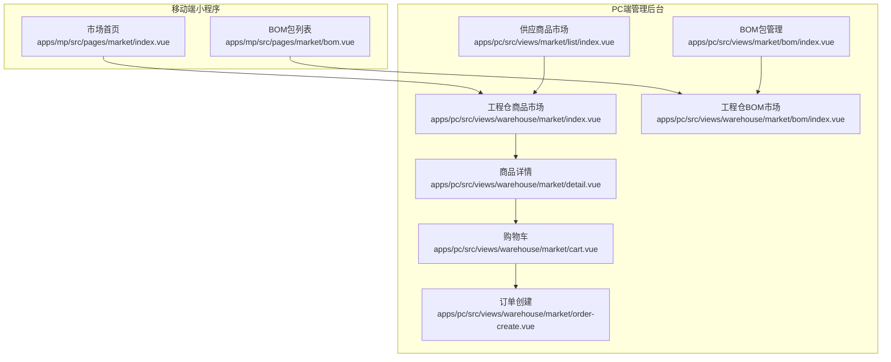
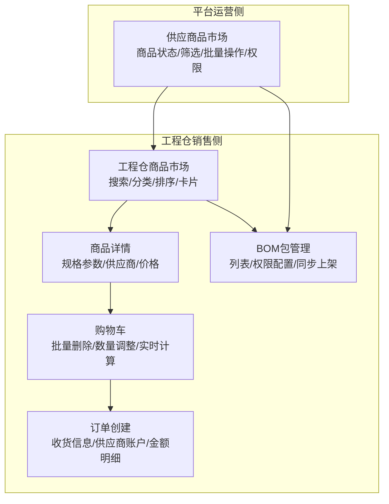
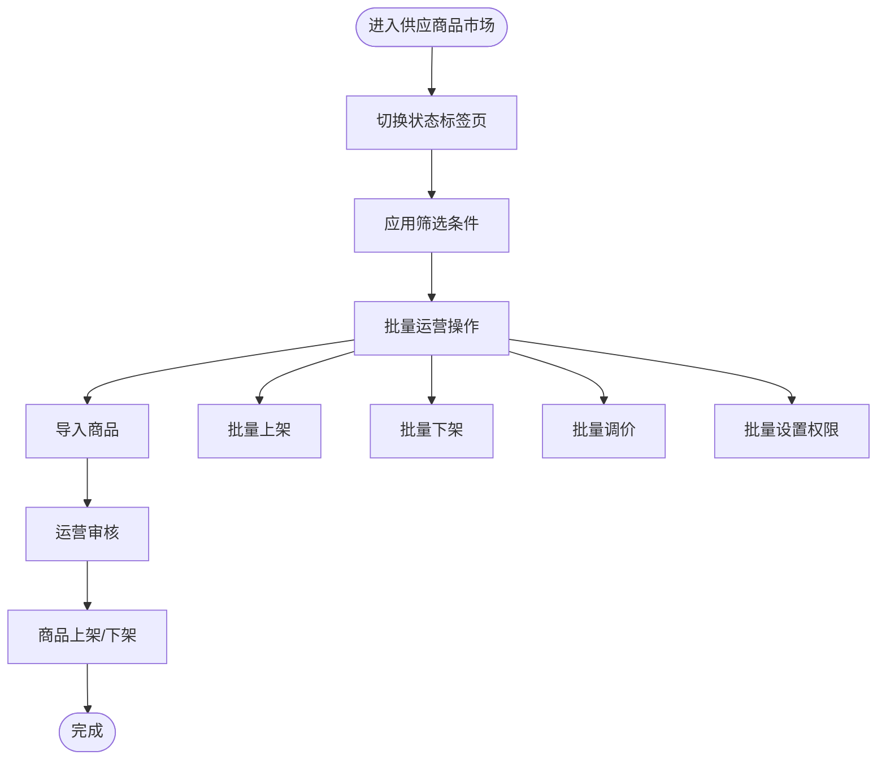
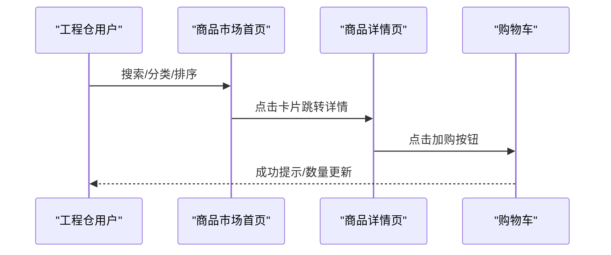
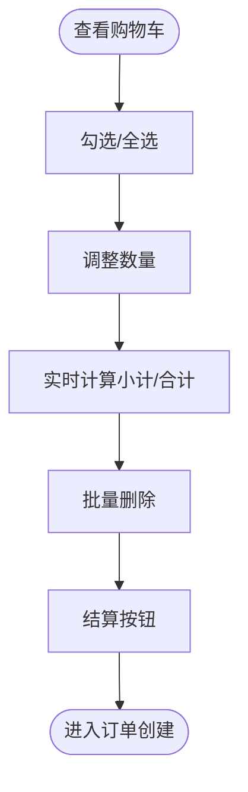
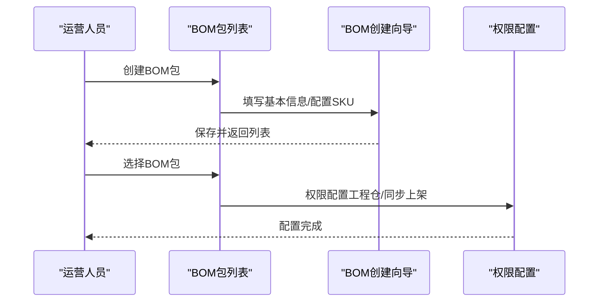
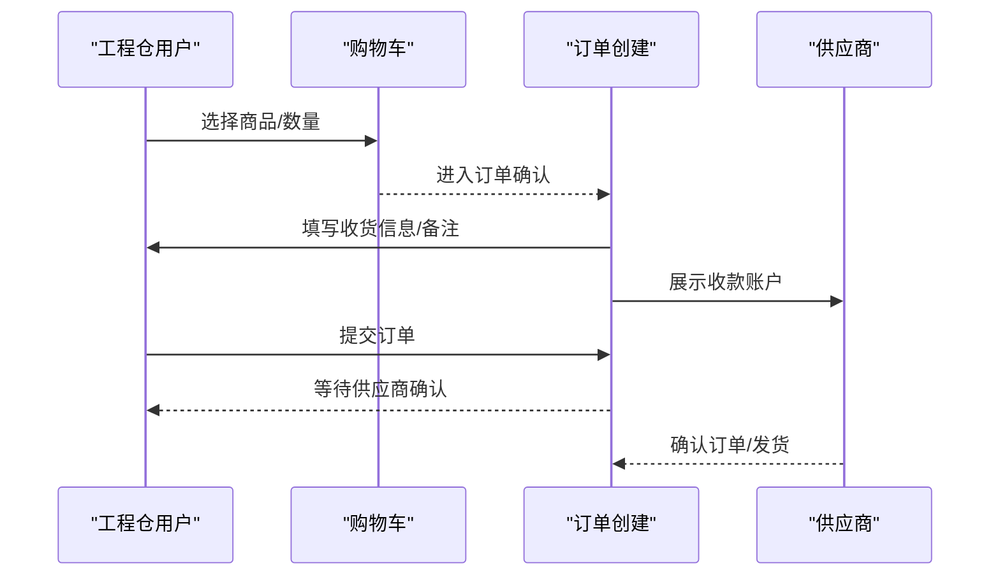
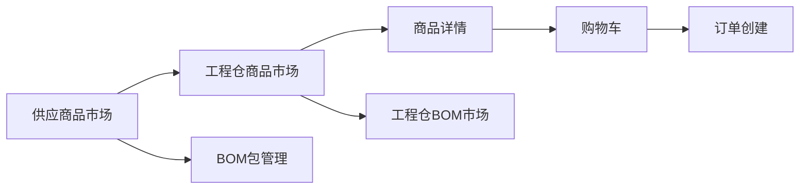

# 工程仓市场模块

<cite>
**本文引用的文件**
- [PRD-商品市场模块v1.0.md](file://PRD-商品市场模块v1.0.md)
- [apps/mp/src/pages/market/index.vue](file://apps/mp/src/pages/market/index.vue)
- [apps/mp/src/pages/market/bom.vue](file://apps/mp/src/pages/market/bom.vue)
- [apps/pc/src/views/market/list/index.vue](file://apps/pc/src/views/market/list/index.vue)
- [apps/pc/src/views/warehouse/market/index.vue](file://apps/pc/src/views/warehouse/market/index.vue)
- [apps/pc/src/views/warehouse/market/cart.vue](file://apps/pc/src/views/warehouse/market/cart.vue)
- [apps/pc/src/views/warehouse/market/detail.vue](file://apps/pc/src/views/warehouse/market/detail.vue)
- [apps/pc/src/views/warehouse/market/order-create.vue](file://apps/pc/src/views/warehouse/market/order-create.vue)
- [apps/pc/src/views/market/bom/index.vue](file://apps/pc/src/views/market/bom/index.vue)
- [apps/pc/src/views/warehouse/market/bom/index.vue](file://apps/pc/src/views/warehouse/market/bom/index.vue)
</cite>

## 目录
1. [简介](#简介)
2. [项目结构](#项目结构)
3. [核心组件](#核心组件)
4. [架构总览](#架构总览)
5. [详细组件分析](#详细组件分析)
6. [依赖分析](#依赖分析)
7. [性能考虑](#性能考虑)
8. [故障排查指南](#故障排查指南)
9. [结论](#结论)
10. [附录](#附录)

## 简介
工程仓市场模块是连接“供应商品市场”与“销售商品市场”的核心枢纽，承担以下职责：
- 平台侧：供应商品市场管理（商品状态看板、筛选、批量运营、权限配置、价格策略联动）
- 工程仓侧：销售商品市场（商品浏览、搜索、筛选、排序、购物车、BOM包、订单创建）
- 营销与运营：商品推荐、价格策略、促销活动、客户评价、数据埋点与异常处理

模块目标：
- 统一商品覆盖率达80%
- 材料采购均价下降10%
- 施工方下单时间缩短50%
- SKU标准化率达90%

## 项目结构
工程仓市场模块由移动端小程序与PC端管理后台共同组成，分别覆盖“销售侧”和“运营侧”两大场景。

图表来源
- [apps/mp/src/pages/market/index.vue:1-800](file://apps/mp/src/pages/market/index.vue#L1-L800)
- [apps/mp/src/pages/market/bom.vue:1-378](file://apps/mp/src/pages/market/bom.vue#L1-L378)
- [apps/pc/src/views/market/list/index.vue:1-800](file://apps/pc/src/views/market/list/index.vue#L1-L800)
- [apps/pc/src/views/warehouse/market/index.vue:1-440](file://apps/pc/src/views/warehouse/market/index.vue#L1-L440)
- [apps/pc/src/views/warehouse/market/cart.vue:1-312](file://apps/pc/src/views/warehouse/market/cart.vue#L1-L312)
- [apps/pc/src/views/warehouse/market/detail.vue:1-723](file://apps/pc/src/views/warehouse/market/detail.vue#L1-L723)
- [apps/pc/src/views/warehouse/market/order-create.vue:1-755](file://apps/pc/src/views/warehouse/market/order-create.vue#L1-L755)
- [apps/pc/src/views/market/bom/index.vue:1-479](file://apps/pc/src/views/market/bom/index.vue#L1-L479)
- [apps/pc/src/views/warehouse/market/bom/index.vue:1-219](file://apps/pc/src/views/warehouse/market/bom/index.vue#L1-L219)

章节来源
- [apps/mp/src/pages/market/index.vue:1-800](file://apps/mp/src/pages/market/index.vue#L1-L800)
- [apps/pc/src/views/market/list/index.vue:1-800](file://apps/pc/src/views/market/list/index.vue#L1-L800)

## 核心组件
- 供应商品市场（平台运营侧）
  - 商品状态看板（全部/待上架/已上架/已下架）
  - 分类导航树与搜索
  - 筛选条件（关键词、分类、供应商、供货状态）
  - 批量运营（导入、批量上架/下架、批量调价、批量设置权限）
  - 商品表格字段（商品信息、分类/SPU、采购库存、供应商、供货状态、进入方式、上架状态、可见范围、操作）

- 销售商品市场（工程仓侧）
  - 商品瀑布流展示（搜索、购物车入口、排序、卡片布局）
  - 商品卡片规范（主图、名称、规格、供应商/价格、快速加购）
  - 交互规则（点击卡片跳详情、点击加购按钮直接加入购物车、多供应商自动选择最低价）

- 购物车管理
  - 购物车列表（批量删除、数量调整、实时计算、供应商分组）
  - 底部结算栏（全选、已选件数、合计金额、结算按钮）

- BOM基装包管理
  - BOM包列表页（创建、筛选、字段、权限配置）
  - BOM包创建向导（基本信息、SKU明细配置、批量导入、必选标记、实时汇总）
  - BOM包权限配置（工程仓选择、同步上架到商品市场）

- 订单创建流程
  - 确认订单（收货信息、商品清单、供应商收款账户、订单信息、金额明细）
  - 支付处理（线下转账、上传凭证、供应商确认发货）
  - 订单确认（流程提示、备注、提交订单）

章节来源
- [PRD-商品市场模块v1.0.md:89-321](file://PRD-商品市场模块v1.0.md#L89-L321)
- [apps/pc/src/views/market/list/index.vue:1-800](file://apps/pc/src/views/market/list/index.vue#L1-L800)
- [apps/pc/src/views/warehouse/market/index.vue:1-440](file://apps/pc/src/views/warehouse/market/index.vue#L1-L440)
- [apps/pc/src/views/warehouse/market/cart.vue:1-312](file://apps/pc/src/views/warehouse/market/cart.vue#L1-L312)
- [apps/pc/src/views/market/bom/index.vue:1-479](file://apps/pc/src/views/market/bom/index.vue#L1-L479)
- [apps/pc/src/views/warehouse/market/bom/index.vue:1-219](file://apps/pc/src/views/warehouse/market/bom/index.vue#L1-L219)
- [apps/pc/src/views/warehouse/market/order-create.vue:1-755](file://apps/pc/src/views/warehouse/market/order-create.vue#L1-L755)

## 架构总览
工程仓市场模块采用“双端协同”的架构设计：
- 平台运营侧（PC）负责商品生命周期管理、价格策略、权限控制与批量运营
- 工程仓销售侧（PC/MP）负责商品浏览、购物车、BOM包与订单创建

图表来源
- [apps/pc/src/views/market/list/index.vue:1-800](file://apps/pc/src/views/market/list/index.vue#L1-L800)
- [apps/pc/src/views/warehouse/market/index.vue:1-440](file://apps/pc/src/views/warehouse/market/index.vue#L1-L440)
- [apps/pc/src/views/warehouse/market/detail.vue:1-723](file://apps/pc/src/views/warehouse/market/detail.vue#L1-L723)
- [apps/pc/src/views/warehouse/market/cart.vue:1-312](file://apps/pc/src/views/warehouse/market/cart.vue#L1-L312)
- [apps/pc/src/views/warehouse/market/order-create.vue:1-755](file://apps/pc/src/views/warehouse/market/order-create.vue#L1-L755)
- [apps/pc/src/views/market/bom/index.vue:1-479](file://apps/pc/src/views/market/bom/index.vue#L1-L479)

## 详细组件分析

### 供应商品市场（平台运营侧）
- 功能要点
  - 四状态标签页：全部/待上架/已上架/已下架，自动刷新数据并显示数量
  - 分类导航树：左侧显示商品分类树，点击联动筛选商品列表
  - 分类搜索：输入框实时过滤分类树
  - 筛选条件：关键词、商品分类（级联）、供应商、供货状态
  - 批量运营：导入商品、批量上架/下架、批量调价、批量设置权限
  - 商品表格字段：商品信息、分类/SPU、采购库存、供应商、供货状态、进入方式、上架状态、可见范围、操作

- 关键实现路径
  - [供应商品市场列表页:1-800](file://apps/pc/src/views/market/list/index.vue#L1-L800)
  - [PRD-商品市场模块v1.0.md:89-132](file://PRD-商品市场模块v1.0.md#L89-L132)

图表来源
- [apps/pc/src/views/market/list/index.vue:1-800](file://apps/pc/src/views/market/list/index.vue#L1-L800)
- [PRD-商品市场模块v1.0.md:89-132](file://PRD-商品市场模块v1.0.md#L89-L132)

章节来源
- [apps/pc/src/views/market/list/index.vue:1-800](file://apps/pc/src/views/market/list/index.vue#L1-L800)
- [PRD-商品市场模块v1.0.md:89-132](file://PRD-商品市场模块v1.0.md#L89-L132)

### 销售商品市场（工程仓侧）
- 功能要点
  - 商品瀑布流展示：顶部搜索、购物车入口、排序方式（综合/销量/价格）、卡片布局
  - 商品卡片规范：主图、名称、规格、供应商/价格、快速加购按钮
  - 交互规则：点击卡片跳转详情；点击加购按钮直接加入购物车；多供应商自动选择最低价

- 关键实现路径
  - [工程仓商品市场首页:1-440](file://apps/pc/src/views/warehouse/market/index.vue#L1-L440)
  - [移动端市场首页:1-800](file://apps/mp/src/pages/market/index.vue#L1-L800)

图表来源
- [apps/pc/src/views/warehouse/market/index.vue:1-440](file://apps/pc/src/views/warehouse/market/index.vue#L1-L440)
- [apps/pc/src/views/warehouse/market/detail.vue:1-723](file://apps/pc/src/views/warehouse/market/detail.vue#L1-L723)
- [apps/pc/src/views/warehouse/market/cart.vue:1-312](file://apps/pc/src/views/warehouse/market/cart.vue#L1-L312)

章节来源
- [apps/pc/src/views/warehouse/market/index.vue:1-440](file://apps/pc/src/views/warehouse/market/index.vue#L1-L440)
- [apps/mp/src/pages/market/index.vue:1-800](file://apps/mp/src/pages/market/index.vue#L1-L800)

### 购物车管理
- 功能要点
  - 购物车列表：批量删除、数量调整（按钮式增减，最大值=库存）、实时计算（小计、合计）
  - 供应商分组（可选）
  - 底部结算栏：全选、已选件数、合计金额、结算按钮（禁用条件：选中行数=0）

- 关键实现路径
  - [购物车页面:1-312](file://apps/pc/src/views/warehouse/market/cart.vue#L1-L312)

图表来源
- [apps/pc/src/views/warehouse/market/cart.vue:1-312](file://apps/pc/src/views/warehouse/market/cart.vue#L1-L312)

章节来源
- [apps/pc/src/views/warehouse/market/cart.vue:1-312](file://apps/pc/src/views/warehouse/market/cart.vue#L1-L312)

### BOM基装包管理
- 功能要点
  - BOM包列表：创建、筛选（名称/编码、上架状态）、字段（编码、包信息、SKU数量、SKU单价总计、标签、可见工程仓、上架状态、操作）
  - 创建向导：基本信息（名称/主图/标签/说明）、SKU明细配置（添加SKU/批量导入/必选标记/实时汇总）
  - 权限配置：工程仓选择（穿梭框/全选/清空）、同步上架到商品市场

- 关键实现路径
  - [平台BOM包管理:1-479](file://apps/pc/src/views/market/bom/index.vue#L1-L479)
  - [工程仓BOM市场:1-219](file://apps/pc/src/views/warehouse/market/bom/index.vue#L1-L219)
  - [移动端BOM包列表:1-378](file://apps/mp/src/pages/market/bom.vue#L1-L378)

图表来源
- [apps/pc/src/views/market/bom/index.vue:1-479](file://apps/pc/src/views/market/bom/index.vue#L1-L479)
- [apps/pc/src/views/warehouse/market/bom/index.vue:1-219](file://apps/pc/src/views/warehouse/market/bom/index.vue#L1-L219)
- [apps/mp/src/pages/market/bom.vue:1-378](file://apps/mp/src/pages/market/bom.vue#L1-L378)

章节来源
- [apps/pc/src/views/market/bom/index.vue:1-479](file://apps/pc/src/views/market/bom/index.vue#L1-L479)
- [apps/pc/src/views/warehouse/market/bom/index.vue:1-219](file://apps/pc/src/views/warehouse/market/bom/index.vue#L1-L219)
- [apps/mp/src/pages/market/bom.vue:1-378](file://apps/mp/src/pages/market/bom.vue#L1-L378)

### 订单创建流程
- 功能要点
  - 确认订单：收货信息（仓库/自定义地址）、商品清单（供应商、单价、数量、小计）、订单信息（期望配送日期、支付方式、备注）
  - 供应商收款账户：账户名称、银行名称、银行账号、开户支行
  - 金额明细：商品金额、运费、优惠、应付金额
  - 支付处理：线下转账、上传凭证、供应商确认发货

- 关键实现路径
  - [订单创建页:1-755](file://apps/pc/src/views/warehouse/market/order-create.vue#L1-L755)

图表来源
- [apps/pc/src/views/warehouse/market/cart.vue:1-312](file://apps/pc/src/views/warehouse/market/cart.vue#L1-L312)
- [apps/pc/src/views/warehouse/market/order-create.vue:1-755](file://apps/pc/src/views/warehouse/market/order-create.vue#L1-L755)

章节来源
- [apps/pc/src/views/warehouse/market/order-create.vue:1-755](file://apps/pc/src/views/warehouse/market/order-create.vue#L1-L755)

### 商品详情查看
- 功能要点
  - 规格参数：SPU信息、规格维度、编码
  - 库存信息：价格区间、最小起订量、供货周期
  - 供应商信息：多供应商选择、自动切换最低价
  - 购买操作：加入购物车、立即购买（进入订单创建）

- 关键实现路径
  - [商品详情页:1-723](file://apps/pc/src/views/warehouse/market/detail.vue#L1-L723)

章节来源
- [apps/pc/src/views/warehouse/market/detail.vue:1-723](file://apps/pc/src/views/warehouse/market/detail.vue#L1-L723)

## 依赖分析
- 组件耦合
  - 工程仓商品市场与详情页强关联（详情页承载规格参数、供应商、购买入口）
  - 购物车与订单创建形成闭环（购物车作为订单来源）
  - BOM包管理与工程仓BOM市场联动（权限配置与上架状态）

- 外部依赖
  - 支付结算：线下转账（模块暂不包含支付系统）
  - 物流配送：模块暂不包含物流系统
  - 实时库存对接：模块暂不包含实时库存对接

图表来源
- [apps/pc/src/views/warehouse/market/index.vue:1-440](file://apps/pc/src/views/warehouse/market/index.vue#L1-L440)
- [apps/pc/src/views/warehouse/market/detail.vue:1-723](file://apps/pc/src/views/warehouse/market/detail.vue#L1-L723)
- [apps/pc/src/views/warehouse/market/cart.vue:1-312](file://apps/pc/src/views/warehouse/market/cart.vue#L1-L312)
- [apps/pc/src/views/warehouse/market/order-create.vue:1-755](file://apps/pc/src/views/warehouse/market/order-create.vue#L1-L755)
- [apps/pc/src/views/market/list/index.vue:1-800](file://apps/pc/src/views/market/list/index.vue#L1-L800)
- [apps/pc/src/views/market/bom/index.vue:1-479](file://apps/pc/src/views/market/bom/index.vue#L1-L479)
- [apps/pc/src/views/warehouse/market/bom/index.vue:1-219](file://apps/pc/src/views/warehouse/market/bom/index.vue#L1-L219)

章节来源
- [apps/pc/src/views/market/list/index.vue:1-800](file://apps/pc/src/views/market/list/index.vue#L1-L800)
- [apps/pc/src/views/warehouse/market/index.vue:1-440](file://apps/pc/src/views/warehouse/market/index.vue#L1-L440)

## 性能考虑
- 商品列表加载：<1s
- 分类树渲染：<500ms
- 购物车计算更新：<100ms
- 页面并发支持：500人同时在线

章节来源
- [PRD-商品市场模块v1.0.md:252-259](file://PRD-商品市场模块v1.0.md#L252-L259)

## 故障排查指南
- 加购时库存不足：提示“当前供应商库存仅剩下X件”
- 商品已下架：购物车置灰，结算时自动排除
- 供应商停货：自动切换到下一个最低价供应商

章节来源
- [PRD-商品市场模块v1.0.md:271-278](file://PRD-商品市场模块v1.0.md#L271-L278)

## 结论
工程仓市场模块通过“平台运营侧”的商品生命周期管理与“工程仓销售侧”的商品浏览/购物车/BOM/订单一体化流程，实现了从“选品—上架—采购—结算”的全链路闭环。结合PRD中的性能与异常处理要求，建议在后续迭代中持续优化前端渲染性能、完善数据埋点与风控策略，确保平台运营效率与用户体验双提升。

## 附录
- 非功能需求（数据埋点）
  - 商品曝光、商品点击、加购行为、分类转化率、BOM使用率
- 上线与验收标准
  - 功能验收：供应商品市场筛选与批量操作、商品市场加购/购物车/结算流程、BOM包创建/上架/权限配置、分类可见性开关前后端联动
  - 性能验收：首屏加载<1.5s、500条数据表格渲染无卡顿、无前端控制台报错

章节来源
- [PRD-商品市场模块v1.0.md:261-304](file://PRD-商品市场模块v1.0.md#L261-L304)