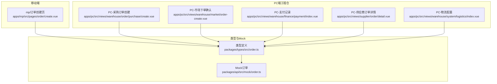
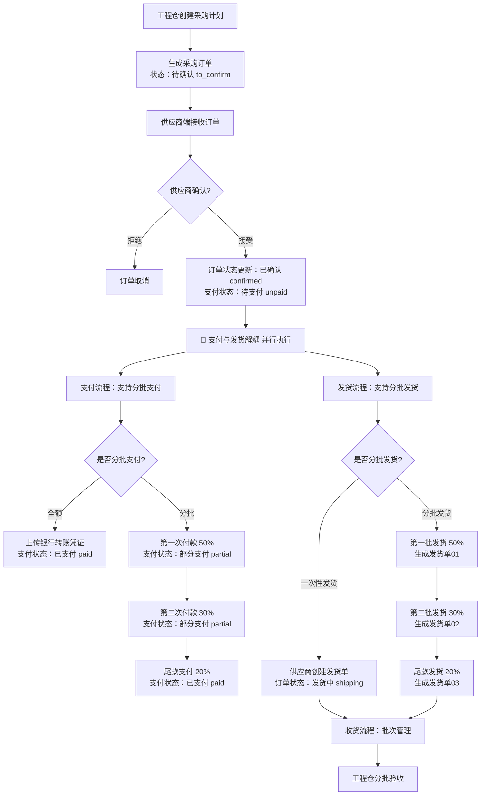
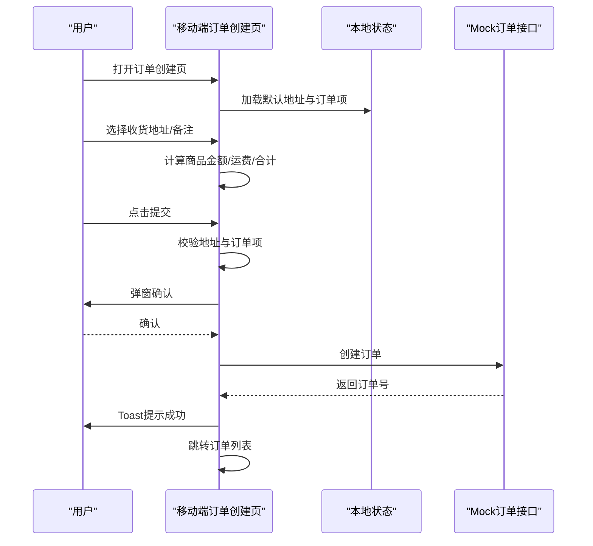
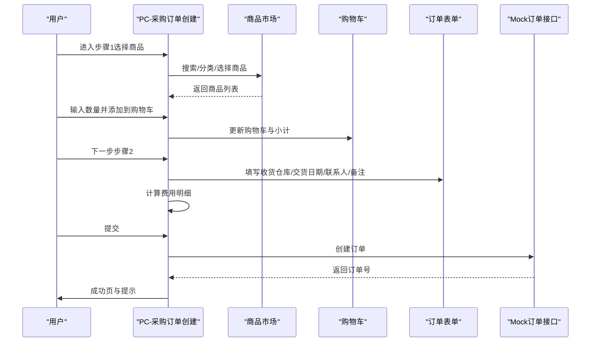
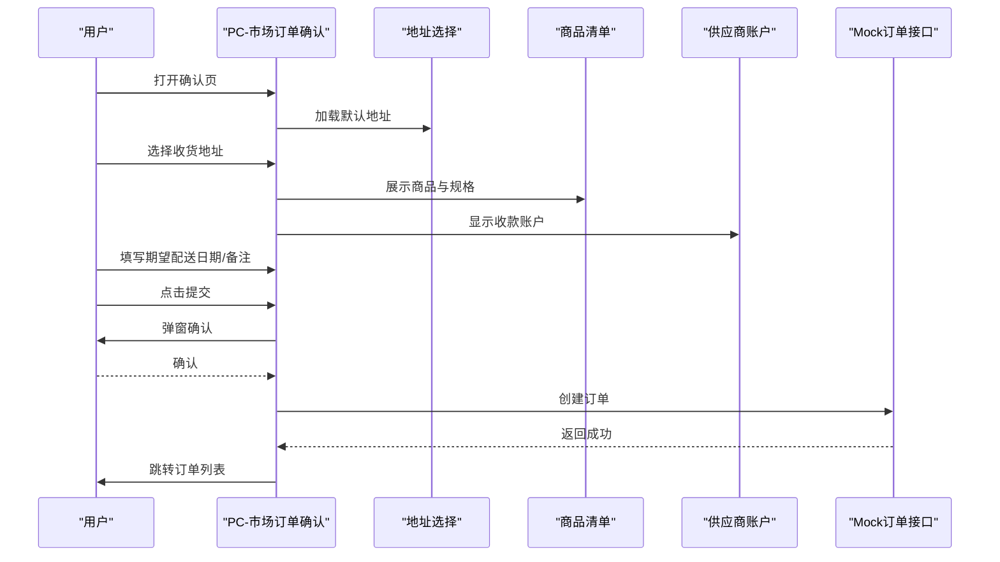
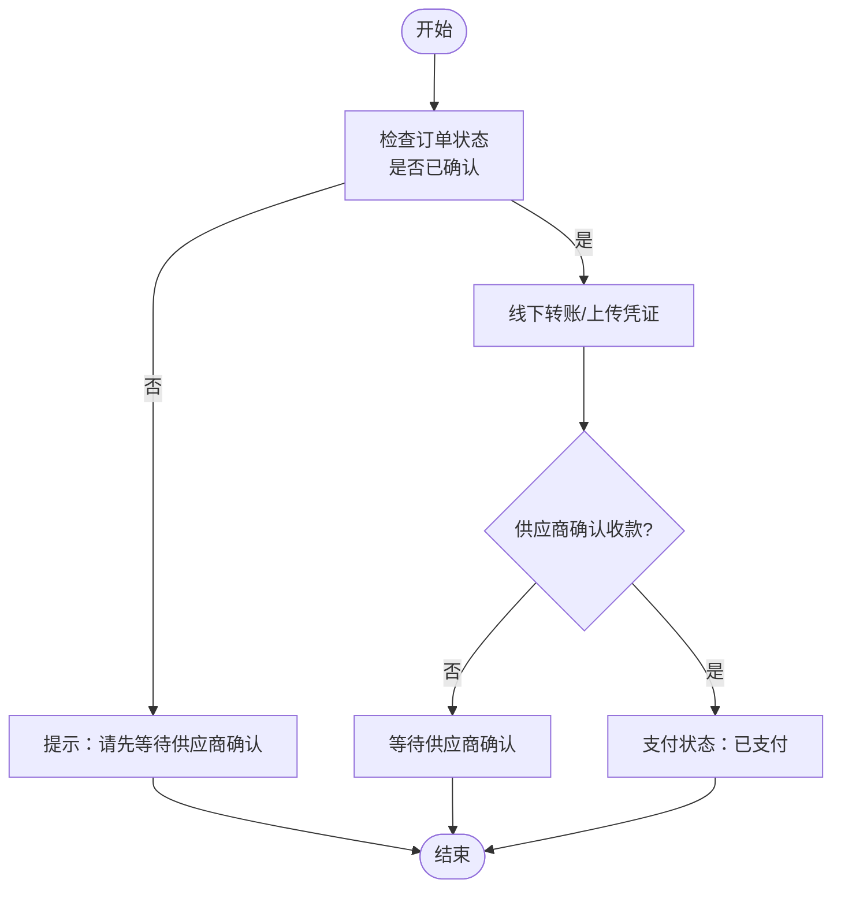
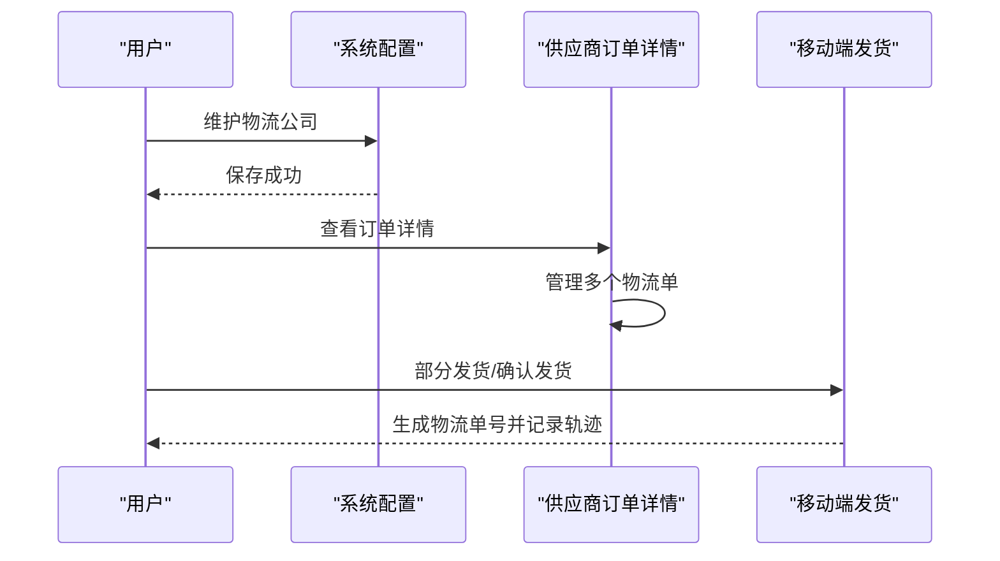
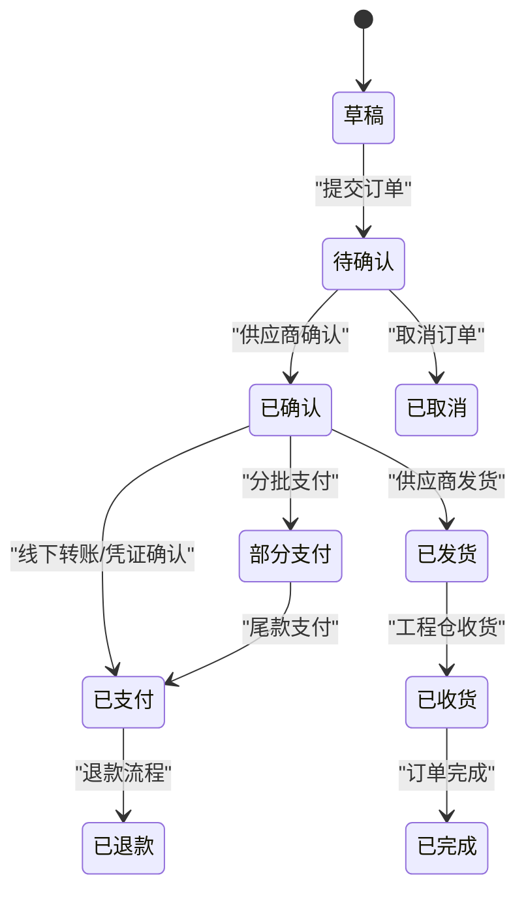
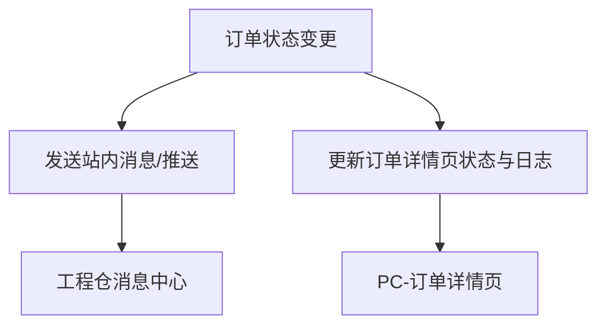
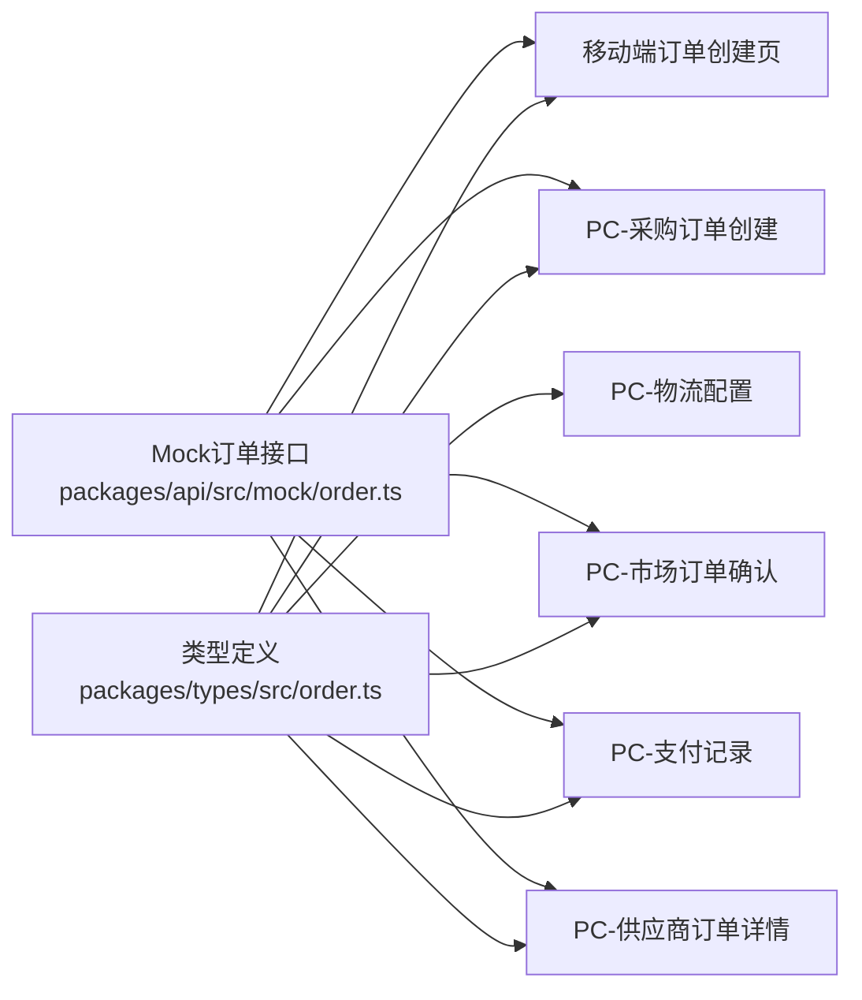

# 订单创建流程

<cite>
**本文引用的文件**
- [apps/mp/src/pages/order/create.vue](file://apps/mp/src/pages/order/create.vue)
- [apps/pc/src/views/warehouse/order/purchase/create.vue](file://apps/pc/src/views/warehouse/order/purchase/create.vue)
- [apps/pc/src/views/warehouse/market/order-create.vue](file://apps/pc/src/views/warehouse/market/order-create.vue)
- [packages/api/src/mock/order.ts](file://packages/api/src/mock/order.ts)
- [packages/types/src/order.ts](file://packages/types/src/order.ts)
- [apps/pc/src/views/warehouse/finance/payment/index.vue](file://apps/pc/src/views/warehouse/finance/payment/index.vue)
- [apps/pc/src/views/warehouse/system/logistics/index.vue](file://apps/pc/src/views/warehouse/system/logistics/index.vue)
- [apps/pc/src/views/supplier/order/detail.vue](file://apps/pc/src/views/supplier/order/detail.vue)
- [apps/mp/src/pages/order/ship.vue](file://apps/mp/src/pages/order/ship.vue)
- [apps/pc/src/views/order/detail/index.vue](file://apps/pc/src/views/order/detail/index.vue)
- [apps/pc/src/views/warehouse/plan/index.vue](file://apps/pc/src/views/warehouse/plan/index.vue)
</cite>

## 目录
1. [简介](#简介)
2. [项目结构](#项目结构)
3. [核心组件](#核心组件)
4. [架构总览](#架构总览)
5. [详细组件分析](#详细组件分析)
6. [依赖关系分析](#依赖关系分析)
7. [性能考量](#性能考量)
8. [故障排查指南](#故障排查指南)
9. [结论](#结论)
10. [附录](#附录)

## 简介
本文件围绕工程仓“订单创建流程”进行系统化技术文档梳理，覆盖移动端与PC端的订单创建界面、订单数据结构、状态管理、支付流程集成、物流配送配置以及订单通知机制。文档以代码为依据，结合Mermaid图示帮助读者理解端到端流程与关键交互。

## 项目结构
工程仓订单创建涉及多端页面与Mock数据层：
- 移动端：订单创建页负责地址选择、商品清单、备注与提交。
- PC端（工程仓侧）：包含“采购订单创建”和“市场下单确认”两个典型流程；另有“支付记录”“物流配置”“供应商订单详情”等配套页面。
- 类型与Mock：统一的订单类型定义与Mock数据支撑前端演示与联调。

图表来源
- [apps/mp/src/pages/order/create.vue:1-680](file://apps/mp/src/pages/order/create.vue#L1-L680)
- [apps/pc/src/views/warehouse/order/purchase/create.vue:1-468](file://apps/pc/src/views/warehouse/order/purchase/create.vue#L1-L468)
- [apps/pc/src/views/warehouse/market/order-create.vue:1-755](file://apps/pc/src/views/warehouse/market/order-create.vue#L1-L755)
- [packages/types/src/order.ts:1-124](file://packages/types/src/order.ts#L1-L124)
- [packages/api/src/mock/order.ts:1-230](file://packages/api/src/mock/order.ts#L1-L230)
- [apps/pc/src/views/warehouse/finance/payment/index.vue:1-416](file://apps/pc/src/views/warehouse/finance/payment/index.vue#L1-L416)
- [apps/pc/src/views/warehouse/system/logistics/index.vue:1-168](file://apps/pc/src/views/warehouse/system/logistics/index.vue#L1-L168)
- [apps/pc/src/views/supplier/order/detail.vue:543-1228](file://apps/pc/src/views/supplier/order/detail.vue#L543-L1228)

章节来源
- [apps/mp/src/pages/order/create.vue:1-680](file://apps/mp/src/pages/order/create.vue#L1-L680)
- [apps/pc/src/views/warehouse/order/purchase/create.vue:1-468](file://apps/pc/src/views/warehouse/order/purchase/create.vue#L1-L468)
- [apps/pc/src/views/warehouse/market/order-create.vue:1-755](file://apps/pc/src/views/warehouse/market/order-create.vue#L1-L755)
- [packages/types/src/order.ts:1-124](file://packages/types/src/order.ts#L1-L124)
- [packages/api/src/mock/order.ts:1-230](file://packages/api/src/mock/order.ts#L1-L230)

## 核心组件
- 订单数据结构：统一的Order与OrderItem接口，定义了订单类型、状态、支付状态、金额构成、明细项等字段。
- 订单状态机：包含草稿、待确认、已确认、已支付、已发货、已收货、已完成、已取消、已退款等状态。
- 支付状态机：未支付、部分支付、已支付、退款中、已退款。
- 订单创建UI（移动端）：地址选择、供应商分组商品展示、备注输入、合计金额计算、提交确认。
- 订单创建UI（PC端-工程仓）：商品市场选择、购物车、订单信息确认、费用明细、提交成功提示。
- 订单创建UI（PC端-市场）：收货地址选择、商品清单、订单信息、供应商收款账户、应付金额、提交。
- 支付记录：线下转账模式下的支付记录、状态与凭证管理。
- 物流配置：物流公司维护、类型与服务配置。
- 供应商订单详情：发货单、物流跟踪、多物流单管理。

章节来源
- [packages/types/src/order.ts:3-78](file://packages/types/src/order.ts#L3-L78)
- [apps/mp/src/pages/order/create.vue:134-217](file://apps/mp/src/pages/order/create.vue#L134-L217)
- [apps/pc/src/views/warehouse/order/purchase/create.vue:211-322](file://apps/pc/src/views/warehouse/order/purchase/create.vue#L211-L322)
- [apps/pc/src/views/warehouse/market/order-create.vue:204-354](file://apps/pc/src/views/warehouse/market/order-create.vue#L204-L354)
- [apps/pc/src/views/warehouse/finance/payment/index.vue:186-392](file://apps/pc/src/views/warehouse/finance/payment/index.vue#L186-L392)
- [apps/pc/src/views/warehouse/system/logistics/index.vue:132-168](file://apps/pc/src/views/warehouse/system/logistics/index.vue#L132-L168)
- [apps/pc/src/views/supplier/order/detail.vue:543-1228](file://apps/pc/src/views/supplier/order/detail.vue#L543-L1228)

## 架构总览
订单创建流程在工程仓侧采用“计划-订单-支付-物流-收货”的闭环，支持分批支付与分批发货，同时提供多物流单管理能力。

图表来源
- [apps/pc/src/views/warehouse/plan/index.vue:282-312](file://apps/pc/src/views/warehouse/plan/index.vue#L282-L312)

## 详细组件分析

### 组件A：移动端订单创建页
- 功能要点
  - 地址选择与默认地址加载
  - 商品按供应商分组展示，支持备注输入
  - 合计金额计算（商品金额+运费）
  - 提交前校验（地址、商品清单），弹窗确认后跳转订单列表
- 数据结构
  - 订单项包含商品ID、供应商信息、规格、单价、数量、图片、预计送达天数
  - 地址列表包含姓名、电话、省市区、详细地址、默认标记
- 关键逻辑
  - 通过路由参数接收商品数据或解析items参数
  - 分组聚合与小计计算
  - 提交时显示模态确认与Toast反馈

图表来源
- [apps/mp/src/pages/order/create.vue:134-306](file://apps/mp/src/pages/order/create.vue#L134-L306)
- [packages/api/src/mock/order.ts:185-213](file://packages/api/src/mock/order.ts#L185-L213)

章节来源
- [apps/mp/src/pages/order/create.vue:1-680](file://apps/mp/src/pages/order/create.vue#L1-L680)
- [packages/api/src/mock/order.ts:185-213](file://packages/api/src/mock/order.ts#L185-L213)

### 组件B：PC端（工程仓）采购订单创建
- 功能要点
  - 步骤式流程：选择商品→确认订单→提交成功
  - 商品市场筛选与分类、输入数量加入购物车
  - 订单信息：收货仓库、期望交货日期、联系人、电话、备注
  - 费用明细：商品金额、运费、订单总额
  - 提交后生成订单号并进入成功页
- 数据结构
  - 订单表单对象包含仓库ID、交货日期、地址、联系人、电话、备注
  - 购物车项包含商品基础信息与数量
- 关键逻辑
  - 搜索与分类过滤商品
  - 数量校验与库存限制
  - 步骤切换与表单校验

图表来源
- [apps/pc/src/views/warehouse/order/purchase/create.vue:211-322](file://apps/pc/src/views/warehouse/order/purchase/create.vue#L211-L322)
- [packages/api/src/mock/order.ts:185-213](file://packages/api/src/mock/order.ts#L185-L213)

章节来源
- [apps/pc/src/views/warehouse/order/purchase/create.vue:1-468](file://apps/pc/src/views/warehouse/order/purchase/create.vue#L1-L468)
- [packages/api/src/mock/order.ts:185-213](file://packages/api/src/mock/order.ts#L185-L213)

### 组件C：PC端（市场）订单确认
- 功能要点
  - 收货地址选择（仓库地址优先）
  - 商品清单与规格展示
  - 供应商收款账户信息
  - 应付金额计算（商品金额±优惠）
  - 提交后提示等待供应商确认
- 数据结构
  - 订单表单包含期望配送日期、支付方式（线下转账）、备注
  - 供应商账户信息包含账户名、银行名、账号、开户支行
- 关键逻辑
  - 地址列表合并仓库与自定义地址
  - 解析路由参数加载订单数据
  - 提交前二次确认与路由跳转

图表来源
- [apps/pc/src/views/warehouse/market/order-create.vue:204-354](file://apps/pc/src/views/warehouse/market/order-create.vue#L204-L354)
- [packages/api/src/mock/order.ts:185-213](file://packages/api/src/mock/order.ts#L185-L213)

章节来源
- [apps/pc/src/views/warehouse/market/order-create.vue:1-755](file://apps/pc/src/views/warehouse/market/order-create.vue#L1-L755)
- [packages/api/src/mock/order.ts:185-213](file://packages/api/src/mock/order.ts#L185-L213)

### 组件D：支付流程集成
- 支付模式
  - 工程仓侧采用线下转账模式，供应商收款账户展示，支持分批支付
- 支付记录
  - 支付记录页展示支付金额、支付方式、支付状态、供应商确认状态、凭证上传与确认流程
- 关键逻辑
  - 支付状态与供应商确认状态联动
  - 凭证上传后供应商确认，支付状态更新

图表来源
- [apps/pc/src/views/warehouse/finance/payment/index.vue:186-392](file://apps/pc/src/views/warehouse/finance/payment/index.vue#L186-L392)

章节来源
- [apps/pc/src/views/warehouse/finance/payment/index.vue:1-416](file://apps/pc/src/views/warehouse/finance/payment/index.vue#L1-L416)

### 组件E：物流配送配置
- 物流公司配置
  - 支持物流公司名称、编码、API编码、类型（快递/物流）、服务项、启用状态
- 供应商订单详情
  - 多物流单管理、物流跟踪、发货单号与时间线展示
- 移动端发货
  - 部分发货与确认发货流程，支持扫描物流单号

图表来源
- [apps/pc/src/views/warehouse/system/logistics/index.vue:132-168](file://apps/pc/src/views/warehouse/system/logistics/index.vue#L132-L168)
- [apps/pc/src/views/supplier/order/detail.vue:543-1228](file://apps/pc/src/views/supplier/order/detail.vue#L543-L1228)
- [apps/mp/src/pages/order/ship.vue:181-213](file://apps/mp/src/pages/order/ship.vue#L181-L213)

章节来源
- [apps/pc/src/views/warehouse/system/logistics/index.vue:1-168](file://apps/pc/src/views/warehouse/system/logistics/index.vue#L1-L168)
- [apps/pc/src/views/supplier/order/detail.vue:543-1228](file://apps/pc/src/views/supplier/order/detail.vue#L543-L1228)
- [apps/mp/src/pages/order/ship.vue:181-213](file://apps/mp/src/pages/order/ship.vue#L181-L213)

### 组件F：订单状态管理
- 订单状态枚举：草稿、待确认、已确认、已支付、已发货、已收货、已完成、已取消、已退款
- 支付状态枚举：未支付、部分支付、已支付、退款中、已退款
- Mock接口：创建订单、更新状态、取消订单

图表来源
- [packages/types/src/order.ts:53-78](file://packages/types/src/order.ts#L53-L78)
- [packages/api/src/mock/order.ts:185-229](file://packages/api/src/mock/order.ts#L185-L229)

章节来源
- [packages/types/src/order.ts:53-78](file://packages/types/src/order.ts#L53-L78)
- [packages/api/src/mock/order.ts:185-229](file://packages/api/src/mock/order.ts#L185-L229)

### 组件G：订单通知机制
- 工程仓侧订单详情页展示物流轨迹、发票、售后、分账等信息
- 移动端消息中心包含订单相关提醒（新订单、收款到账、发票开具等）

图表来源
- [apps/pc/src/views/order/detail/index.vue:777-805](file://apps/pc/src/views/order/detail/index.vue#L777-L805)
- [apps/mp/src/pages/mine/message.vue:71-130](file://apps/mp/src/pages/mine/message.vue#L71-L130)

章节来源
- [apps/pc/src/views/order/detail/index.vue:777-805](file://apps/pc/src/views/order/detail/index.vue#L777-L805)
- [apps/mp/src/pages/mine/message.vue:71-130](file://apps/mp/src/pages/mine/message.vue#L71-L130)

## 依赖关系分析
- 组件耦合
  - 订单创建页依赖类型定义与Mock接口，确保数据结构一致性
  - 支付记录与物流配置作为独立模块，与订单详情页形成弱耦合
- 外部依赖
  - Arco Design UI组件库用于PC端交互
  - Vue Router用于页面导航
  - Pinia用于全局状态管理（主题、加载态等）

图表来源
- [packages/types/src/order.ts:1-124](file://packages/types/src/order.ts#L1-L124)
- [packages/api/src/mock/order.ts:1-230](file://packages/api/src/mock/order.ts#L1-L230)
- [apps/mp/src/pages/order/create.vue:1-680](file://apps/mp/src/pages/order/create.vue#L1-L680)
- [apps/pc/src/views/warehouse/order/purchase/create.vue:1-468](file://apps/pc/src/views/warehouse/order/purchase/create.vue#L1-L468)
- [apps/pc/src/views/warehouse/market/order-create.vue:1-755](file://apps/pc/src/views/warehouse/market/order-create.vue#L1-L755)
- [apps/pc/src/views/warehouse/finance/payment/index.vue:1-416](file://apps/pc/src/views/warehouse/finance/payment/index.vue#L1-L416)
- [apps/pc/src/views/warehouse/system/logistics/index.vue:1-168](file://apps/pc/src/views/warehouse/system/logistics/index.vue#L1-L168)
- [apps/pc/src/views/supplier/order/detail.vue:543-1228](file://apps/pc/src/views/supplier/order/detail.vue#L543-L1228)

章节来源
- [packages/types/src/order.ts:1-124](file://packages/types/src/order.ts#L1-L124)
- [packages/api/src/mock/order.ts:1-230](file://packages/api/src/mock/order.ts#L1-L230)

## 性能考量
- 渲染优化
  - 使用计算属性缓存商品金额、运费、合计，避免重复计算
  - 列表渲染采用虚拟滚动与分页，减少DOM节点数量
- 网络请求
  - Mock数据适合演示，生产环境建议引入真实API并增加节流/防抖
  - 支付记录与物流配置建议懒加载与按需请求
- 交互体验
  - 提交按钮禁用与加载态提示，提升用户感知
  - 地址与备注输入采用轻量弹窗，降低页面跳转成本

## 故障排查指南
- 提交失败
  - 检查地址选择与订单项是否为空
  - 确认表单必填字段（收货仓库、交货日期、联系人、电话）是否填写
- 支付异常
  - 确认供应商收款账户信息正确
  - 检查凭证上传与供应商确认状态
- 物流问题
  - 核对物流公司配置与服务项
  - 检查发货单号与物流轨迹是否同步

章节来源
- [apps/mp/src/pages/order/create.vue:277-306](file://apps/mp/src/pages/order/create.vue#L277-L306)
- [apps/pc/src/views/warehouse/order/purchase/create.vue:296-310](file://apps/pc/src/views/warehouse/order/purchase/create.vue#L296-L310)
- [apps/pc/src/views/warehouse/finance/payment/index.vue:354-392](file://apps/pc/src/views/warehouse/finance/payment/index.vue#L354-L392)
- [apps/pc/src/views/warehouse/system/logistics/index.vue:132-168](file://apps/pc/src/views/warehouse/system/logistics/index.vue#L132-L168)

## 结论
工程仓订单创建流程在多端实现了从商品选择、订单确认到支付与物流的闭环管理。通过统一的数据结构与Mock接口，前端能够快速验证业务逻辑；通过分批支付与分批发货策略，满足复杂工程场景的需求。建议后续在生产环境中接入真实API、完善通知与审计日志，并持续优化用户体验与性能。

## 附录
- 订单数据结构参考路径
  - [packages/types/src/order.ts:3-44](file://packages/types/src/order.ts#L3-L44)
- 订单状态与支付状态参考路径
  - [packages/types/src/order.ts:53-78](file://packages/types/src/order.ts#L53-L78)
- Mock订单接口参考路径
  - [packages/api/src/mock/order.ts:185-229](file://packages/api/src/mock/order.ts#L185-L229)