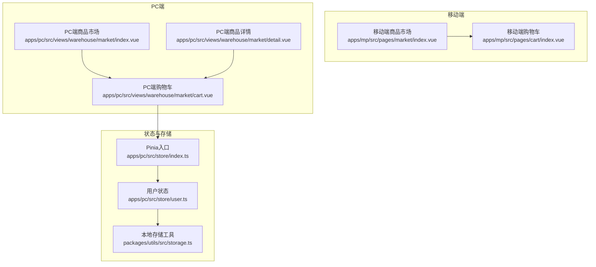
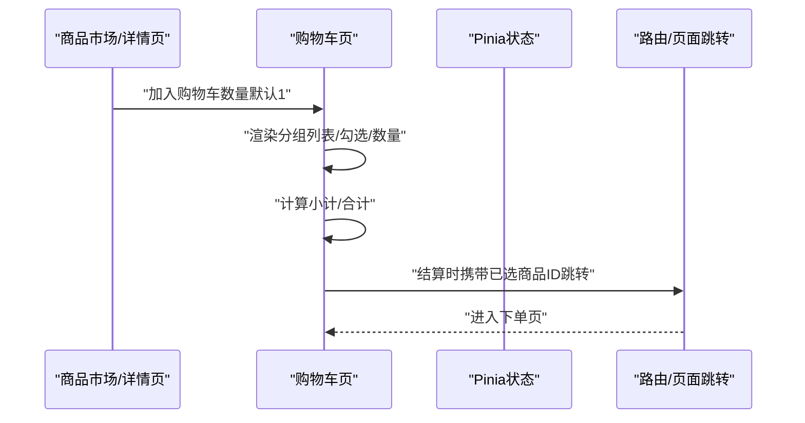
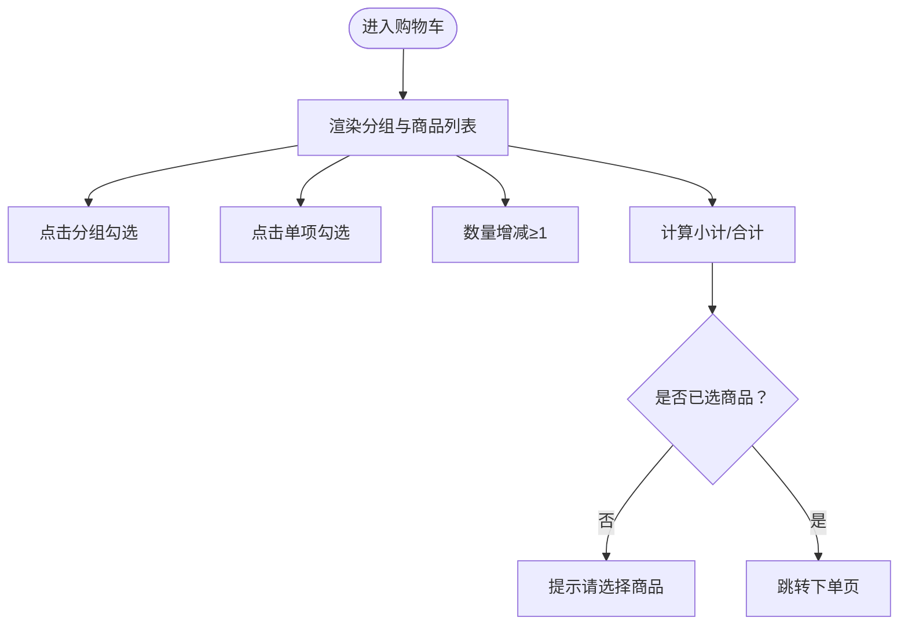
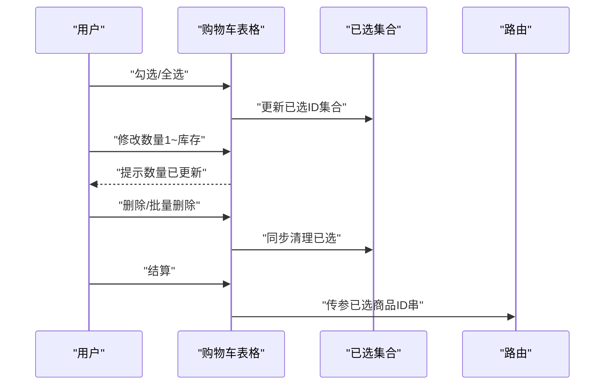
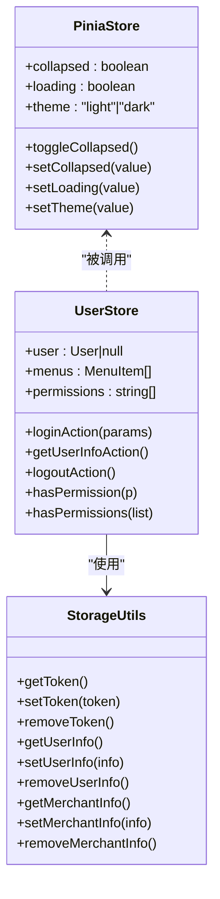
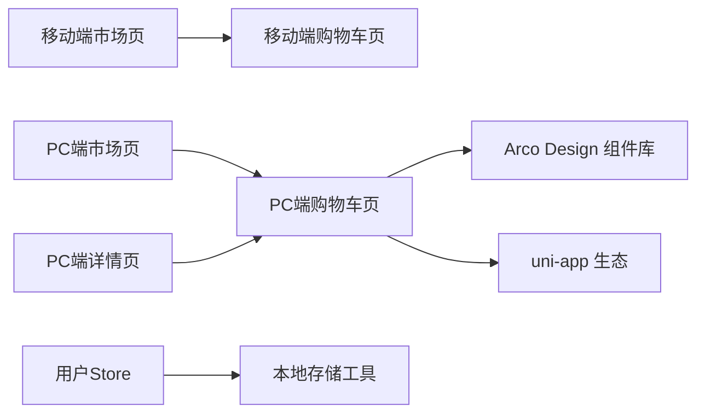

# 购物车管理

<cite>
**本文引用的文件**
- [apps/mp/src/pages/cart/index.vue](file://apps/mp/src/pages/cart/index.vue)
- [apps/pc/src/views/warehouse/market/cart.vue](file://apps/pc/src/views/warehouse/market/cart.vue)
- [apps/pc/src/views/mp-preview/pages/cart.vue](file://apps/pc/src/views/mp-preview/pages/cart.vue)
- [apps/mp/src/pages/market/index.vue](file://apps/mp/src/pages/market/index.vue)
- [apps/pc/src/views/warehouse/market/index.vue](file://apps/pc/src/views/warehouse/market/index.vue)
- [apps/pc/src/views/warehouse/market/detail.vue](file://apps/pc/src/views/warehouse/market/detail.vue)
- [apps/pc/src/store/index.ts](file://apps/pc/src/store/index.ts)
- [apps/pc/src/store/user.ts](file://apps/pc/src/store/user.ts)
- [packages/utils/src/storage.ts](file://packages/utils/src/storage.ts)
- [packages/utils/src/index.ts](file://packages/utils/src/index.ts)
</cite>

## 目录
1. [简介](#简介)
2. [项目结构](#项目结构)
3. [核心组件](#核心组件)
4. [架构总览](#架构总览)
5. [详细组件分析](#详细组件分析)
6. [依赖分析](#依赖分析)
7. [性能考虑](#性能考虑)
8. [故障排查指南](#故障排查指南)
9. [结论](#结论)
10. [附录](#附录)

## 简介
本文件面向工程仓购物车管理功能，系统化梳理移动端与PC端的购物车UI与交互、数据结构与计算逻辑、状态管理与本地存储策略，并给出性能优化与体验改进建议。文档覆盖以下关键能力：
- 商品添加机制：从商品市场页加入购物车、BOM包一键采购、商品详情页加入购物车
- 数量调整与校验：输入框数量变更、最小最大值限制、库存上限控制
- 批量选择与全选：按供应商分组选择、整组联动、全选状态计算
- 列表展示与分组：按供应商分组展示、空态提示、底部结算栏
- 价格计算汇总：单价×数量的小计、已选商品合计、格式化显示
- 购物车状态管理：本地状态与路由参数传递、结算时的数据透传
- 数据持久化：基于浏览器localStorage的令牌与用户信息存储

## 项目结构
购物车相关代码分布在多端页面与共享工具库中：
- 移动端购物车页：apps/mp/src/pages/cart/index.vue
- PC端购物车页：apps/pc/src/views/warehouse/market/cart.vue
- MP预览端购物车页：apps/pc/src/views/mp-preview/pages/cart.vue
- 商品市场页（入口与添加）：apps/mp/src/pages/market/index.vue、apps/pc/src/views/warehouse/market/index.vue
- 商品详情页（加入购物车）：apps/pc/src/views/warehouse/market/detail.vue
- Pinia状态管理：apps/pc/src/store/index.ts、apps/pc/src/store/user.ts
- 本地存储工具：packages/utils/src/storage.ts、packages/utils/src/index.ts

图表来源
- [apps/mp/src/pages/cart/index.vue:1-332](file://apps/mp/src/pages/cart/index.vue#L1-L332)
- [apps/pc/src/views/warehouse/market/cart.vue:1-312](file://apps/pc/src/views/warehouse/market/cart.vue#L1-L312)
- [apps/pc/src/views/mp-preview/pages/cart.vue:1-360](file://apps/pc/src/views/mp-preview/pages/cart.vue#L1-L360)
- [apps/mp/src/pages/market/index.vue:1-800](file://apps/mp/src/pages/market/index.vue#L1-L800)
- [apps/pc/src/views/warehouse/market/index.vue:1-440](file://apps/pc/src/views/warehouse/market/index.vue#L1-L440)
- [apps/pc/src/views/warehouse/market/detail.vue:179-439](file://apps/pc/src/views/warehouse/market/detail.vue#L179-L439)
- [apps/pc/src/store/index.ts:1-10](file://apps/pc/src/store/index.ts#L1-L10)
- [apps/pc/src/store/user.ts:1-112](file://apps/pc/src/store/user.ts#L1-L112)
- [packages/utils/src/storage.ts:1-54](file://packages/utils/src/storage.ts#L1-L54)

章节来源
- [apps/mp/src/pages/cart/index.vue:1-332](file://apps/mp/src/pages/cart/index.vue#L1-L332)
- [apps/pc/src/views/warehouse/market/cart.vue:1-312](file://apps/pc/src/views/warehouse/market/cart.vue#L1-L312)
- [apps/pc/src/views/mp-preview/pages/cart.vue:1-360](file://apps/pc/src/views/mp-preview/pages/cart.vue#L1-L360)
- [apps/mp/src/pages/market/index.vue:1-800](file://apps/mp/src/pages/market/index.vue#L1-L800)
- [apps/pc/src/views/warehouse/market/index.vue:1-440](file://apps/pc/src/views/warehouse/market/index.vue#L1-L440)
- [apps/pc/src/views/warehouse/market/detail.vue:179-439](file://apps/pc/src/views/warehouse/market/detail.vue#L179-L439)
- [apps/pc/src/store/index.ts:1-10](file://apps/pc/src/store/index.ts#L1-L10)
- [apps/pc/src/store/user.ts:1-112](file://apps/pc/src/store/user.ts#L1-L112)
- [packages/utils/src/storage.ts:1-54](file://packages/utils/src/storage.ts#L1-L54)

## 核心组件
- 移动端购物车页：提供按供应商分组的列表、勾选与数量增减、全选、合计与结算按钮、空态跳转。
- PC端购物车页：提供表格形式的商品列表、行级复选框、数量输入框（含最小/最大限制）、小计与合计、批量删除、结算。
- MP预览端购物车页：用于演示的简化版本，具备分组、勾选、数量与合计。
- 商品市场页：提供“加入购物车”入口与徽章计数；移动端通过底部导航跳转购物车。
- 商品详情页：支持将所选SKU组合加入购物车。
- Pinia状态管理：集中管理应用主题、加载状态等，用户信息与认证状态由用户Store维护。
- 本地存储工具：封装token、用户信息、商户信息的localStorage存取。

章节来源
- [apps/mp/src/pages/cart/index.vue:1-332](file://apps/mp/src/pages/cart/index.vue#L1-L332)
- [apps/pc/src/views/warehouse/market/cart.vue:1-312](file://apps/pc/src/views/warehouse/market/cart.vue#L1-L312)
- [apps/pc/src/views/mp-preview/pages/cart.vue:1-360](file://apps/pc/src/views/mp-preview/pages/cart.vue#L1-L360)
- [apps/mp/src/pages/market/index.vue:1-800](file://apps/mp/src/pages/market/index.vue#L1-L800)
- [apps/pc/src/views/warehouse/market/index.vue:1-440](file://apps/pc/src/views/warehouse/market/index.vue#L1-L440)
- [apps/pc/src/views/warehouse/market/detail.vue:179-439](file://apps/pc/src/views/warehouse/market/detail.vue#L179-L439)
- [apps/pc/src/store/index.ts:1-10](file://apps/pc/src/store/index.ts#L1-L10)
- [apps/pc/src/store/user.ts:1-112](file://apps/pc/src/store/user.ts#L1-L112)
- [packages/utils/src/storage.ts:1-54](file://packages/utils/src/storage.ts#L1-L54)

## 架构总览
购物车功能在不同端采用相似的数据结构与计算方式，但UI与交互细节存在差异。整体流程如下：
- 用户在商品市场或详情页选择商品规格并加入购物车，移动端会增加徽章计数。
- 进入购物车后，按供应商分组展示商品，支持勾选、数量调整、全选与批量删除。
- 计算逻辑实时更新：小计=单价×数量；合计=已选商品小计之和。
- 结算时根据已选商品生成订单参数并跳转下单页。

图表来源
- [apps/mp/src/pages/market/index.vue:586-646](file://apps/mp/src/pages/market/index.vue#L586-L646)
- [apps/pc/src/views/warehouse/market/detail.vue:417-439](file://apps/pc/src/views/warehouse/market/detail.vue#L417-L439)
- [apps/pc/src/views/warehouse/market/cart.vue:147-207](file://apps/pc/src/views/warehouse/market/cart.vue#L147-L207)
- [apps/mp/src/pages/cart/index.vue:88-125](file://apps/mp/src/pages/cart/index.vue#L88-L125)

## 详细组件分析

### 移动端购物车组件（apps/mp/src/pages/cart/index.vue）
- 数据结构
  - 分组字段：供应商ID、供应商名称、分组选中状态
  - 商品项字段：商品ID、名称、规格、图片、单价、单位、数量、选中状态
- 关键逻辑
  - 全选/反选：整组联动、全局全选状态计算
  - 小计与合计：过滤已选商品，单价×数量累加
  - 数量增减：限制最小为1，+/-按钮触发
  - 结算：校验至少选择一项，否则提示；否则跳转下单页
- UI特性
  - 供应商分组头部支持整组勾选
  - 商品行包含勾选项、图片、名称规格、单价单位、数量控件与合计
  - 底部固定栏显示“全选/合计/结算”

图表来源
- [apps/mp/src/pages/cart/index.vue:58-125](file://apps/mp/src/pages/cart/index.vue#L58-L125)

章节来源
- [apps/mp/src/pages/cart/index.vue:1-332](file://apps/mp/src/pages/cart/index.vue#L1-L332)

### PC端购物车组件（apps/pc/src/views/warehouse/market/cart.vue）
- 数据结构
  - 商品项字段：ID、商品名、规格、供应商名、图片、单价、数量、库存
- 关键逻辑
  - 行级复选框：使用selectedKeys维护已选项
  - 全选：根据列表长度与已选数量同步
  - 数量输入：最小1，最大库存，实时提示“数量已更新”
  - 删除与批量删除：二次确认，删除后同步清除已选
  - 结算：校验已选数量，拼接ID串传参跳转下单页
- UI特性
  - 卡片标题显示商品总数
  - 表格列：商品信息、单价、数量、小计、操作
  - 底部固定栏：全选、已选数量、合计、结算按钮

图表来源
- [apps/pc/src/views/warehouse/market/cart.vue:93-207](file://apps/pc/src/views/warehouse/market/cart.vue#L93-L207)

章节来源
- [apps/pc/src/views/warehouse/market/cart.vue:1-312](file://apps/pc/src/views/warehouse/market/cart.vue#L1-L312)

### MP预览端购物车组件（apps/pc/src/views/mp-preview/pages/cart.vue）
- 数据结构
  - 商品项字段：ID、名称、规格、单价、数量、图片、供应商、预计送达天数、勾选状态
- 关键逻辑
  - 分组聚合：按供应商ID分组
  - 勾选统计：已选数量、合计（保留两位小数）
  - 导航事件：通过事件向父组件传递页面切换指令
- UI特性
  - 供应商分组头包含“预计送达”信息
  - 商品行包含图片、名称规格、价格与数量控件
  - 底部固定栏包含“全选/合计/结算”按钮与TabBar

章节来源
- [apps/pc/src/views/mp-preview/pages/cart.vue:1-360](file://apps/pc/src/views/mp-preview/pages/cart.vue#L1-L360)

### 商品市场与加入购物车（apps/mp/src/pages/market/index.vue、apps/pc/src/views/warehouse/market/index.vue、apps/pc/src/views/warehouse/market/detail.vue）
- 移动端
  - 商品市场页提供“加入购物车”按钮，点击后徽章计数+1，并跳转购物车
- PC端
  - 商品市场页提供“加入购物车”按钮，点击后徽章计数+1，并提示成功
  - 商品详情页支持将所选SKU组合加入购物车，打印日志并提示已加入数量
- BOM包
  - 商品市场页提供BOM包列表，支持“立即采购”，可直接进入下单流程

章节来源
- [apps/mp/src/pages/market/index.vue:586-646](file://apps/mp/src/pages/market/index.vue#L586-L646)
- [apps/pc/src/views/warehouse/market/index.vue:293-296](file://apps/pc/src/views/warehouse/market/index.vue#L293-L296)
- [apps/pc/src/views/warehouse/market/detail.vue:417-439](file://apps/pc/src/views/warehouse/market/detail.vue#L417-L439)

### Pinia状态管理与本地存储（apps/pc/src/store/index.ts、apps/pc/src/store/user.ts、packages/utils/src/storage.ts）
- Pinia入口：创建并导出Pinia实例
- 用户Store：维护用户信息、菜单、权限，提供登录/登出/鉴权方法
- 本地存储工具：封装token、刷新token、用户信息、商户信息的读写

图表来源
- [apps/pc/src/store/index.ts:1-10](file://apps/pc/src/store/index.ts#L1-L10)
- [apps/pc/src/store/user.ts:1-112](file://apps/pc/src/store/user.ts#L1-L112)
- [packages/utils/src/storage.ts:1-54](file://packages/utils/src/storage.ts#L1-L54)

章节来源
- [apps/pc/src/store/index.ts:1-10](file://apps/pc/src/store/index.ts#L1-L10)
- [apps/pc/src/store/user.ts:1-112](file://apps/pc/src/store/user.ts#L1-L112)
- [packages/utils/src/storage.ts:1-54](file://packages/utils/src/storage.ts#L1-L54)
- [packages/utils/src/index.ts:1-7](file://packages/utils/src/index.ts#L1-L7)

## 依赖分析
- 组件耦合
  - 购物车页与商品市场/详情页通过路由跳转与参数传递耦合
  - PC端购物车页依赖Arco Design组件库（表格、按钮、消息、模态框）
  - 移动端购物车页依赖uni-app生态（页面跳转、Toast、模态）
- 状态与存储
  - 用户认证与权限通过Pinia用户Store与本地存储工具协同
  - 购物车本地状态在组件内ref/computed中维护，未见跨组件持久化
- 外部依赖
  - Arco Design Web Vue（PC端）
  - uni-app（移动端）

图表来源
- [apps/mp/src/pages/market/index.vue:586-646](file://apps/mp/src/pages/market/index.vue#L586-L646)
- [apps/pc/src/views/warehouse/market/index.vue:293-296](file://apps/pc/src/views/warehouse/market/index.vue#L293-L296)
- [apps/pc/src/views/warehouse/market/detail.vue:417-439](file://apps/pc/src/views/warehouse/market/detail.vue#L417-L439)
- [apps/pc/src/views/warehouse/market/cart.vue:1-312](file://apps/pc/src/views/warehouse/market/cart.vue#L1-L312)
- [apps/pc/src/store/user.ts:1-112](file://apps/pc/src/store/user.ts#L1-L112)
- [packages/utils/src/storage.ts:1-54](file://packages/utils/src/storage.ts#L1-L54)

章节来源
- [apps/mp/src/pages/market/index.vue:1-800](file://apps/mp/src/pages/market/index.vue#L1-L800)
- [apps/pc/src/views/warehouse/market/index.vue:1-440](file://apps/pc/src/views/warehouse/market/index.vue#L1-L440)
- [apps/pc/src/views/warehouse/market/detail.vue:179-439](file://apps/pc/src/views/warehouse/market/detail.vue#L179-L439)
- [apps/pc/src/views/warehouse/market/cart.vue:1-312](file://apps/pc/src/views/warehouse/market/cart.vue#L1-L312)
- [apps/pc/src/store/user.ts:1-112](file://apps/pc/src/store/user.ts#L1-L112)
- [packages/utils/src/storage.ts:1-54](file://packages/utils/src/storage.ts#L1-L54)

## 性能考虑
- 渲染优化
  - 使用computed缓存计算结果，避免重复计算小计与合计
  - 列表渲染中尽量减少不必要的响应式对象嵌套，降低依赖追踪开销
- 交互优化
  - 数量输入建议节流/防抖，避免频繁触发计算
  - 大列表场景可考虑虚拟滚动（PC端表格组件通常内置优化）
- 存储与网络
  - 购物车本地状态仅在当前会话有效；如需跨设备/多端同步，建议引入服务端接口与Pinia持久化插件
- 错误与边界
  - 数量校验应同时在前端与后端执行，防止异常数据进入结算流程
  - 当库存变化时，及时同步数量上限，避免无效提交

## 故障排查指南
- “请选择商品”提示
  - 现象：点击结算无反应或弹出提示
  - 排查：确认已勾选至少一个商品；移动端全选状态与单项勾选状态一致
  - 参考路径：apps/mp/src/pages/cart/index.vue
- “数量已更新”提示
  - 现象：修改数量后出现提示
  - 排查：检查数量输入范围（最小1，最大库存），确认未越界
  - 参考路径：apps/pc/src/views/warehouse/market/cart.vue
- 删除后未清空已选
  - 现象：删除商品后已选集合未同步
  - 排查：确认删除逻辑同步清理selectedKeys中对应ID
  - 参考路径：apps/pc/src/views/warehouse/market/cart.vue
- 登录状态丢失
  - 现象：刷新后购物车或用户信息丢失
  - 排查：确认本地存储工具正确读写token与用户信息；用户Store初始化逻辑
  - 参考路径：packages/utils/src/storage.ts、apps/pc/src/store/user.ts

章节来源
- [apps/mp/src/pages/cart/index.vue:118-125](file://apps/mp/src/pages/cart/index.vue#L118-L125)
- [apps/pc/src/views/warehouse/market/cart.vue:161-178](file://apps/pc/src/views/warehouse/market/cart.vue#L161-L178)
- [packages/utils/src/storage.ts:1-54](file://packages/utils/src/storage.ts#L1-L54)
- [apps/pc/src/store/user.ts:1-112](file://apps/pc/src/store/user.ts#L1-L112)

## 结论
本购物车方案在移动端与PC端实现了统一的数据结构与计算逻辑，具备良好的扩展性与一致性。建议后续在以下方面持续改进：
- 引入Pinia持久化或服务端接口，实现跨设备/多端购物车同步
- 在数量输入与结算流程中加强前后端双重校验
- 对大列表场景进行虚拟滚动与懒加载优化
- 完善错误处理与用户引导提示，提升可用性

## 附录
- 数据结构要点
  - 供应商分组：包含供应商ID、名称、分组选中状态
  - 商品项：包含ID、名称、规格、单价、数量、图片、供应商信息、库存等
- 计算公式
  - 小计 = 单价 × 数量
  - 合计 = 已选商品小计之和
- 本地存储键名
  - 令牌、刷新令牌、用户信息、商户信息等键名定义于本地存储工具

章节来源
- [apps/mp/src/pages/cart/index.vue:58-94](file://apps/mp/src/pages/cart/index.vue#L58-L94)
- [apps/pc/src/views/warehouse/market/cart.vue:93-151](file://apps/pc/src/views/warehouse/market/cart.vue#L93-L151)
- [packages/utils/src/storage.ts:1-54](file://packages/utils/src/storage.ts#L1-L54)