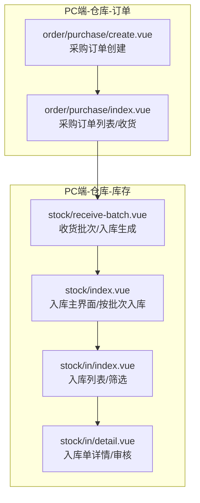
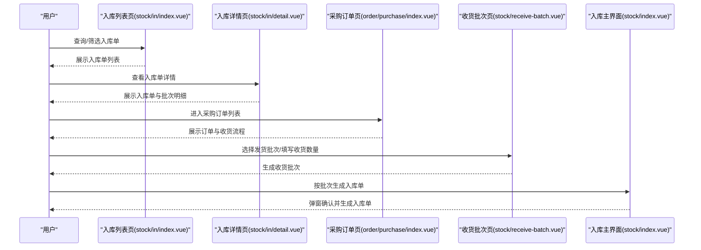
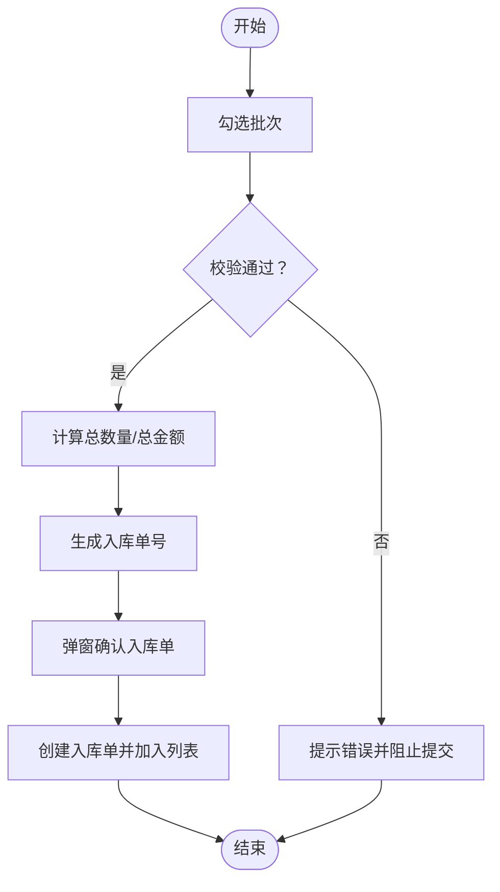
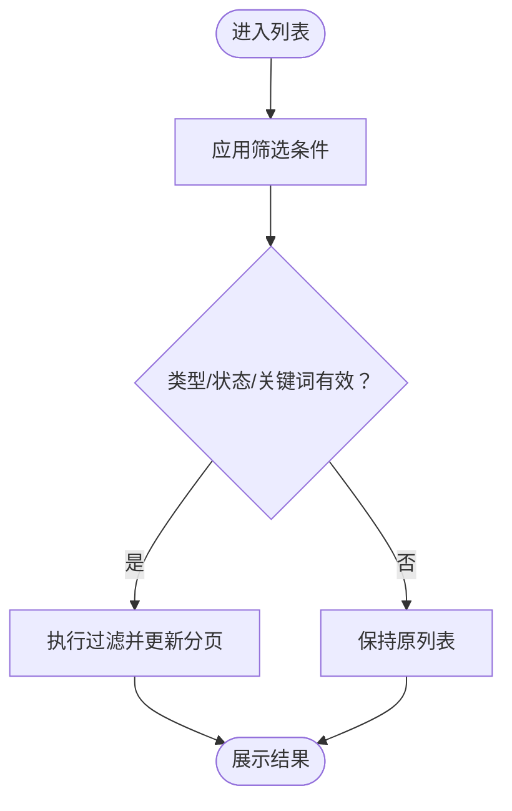
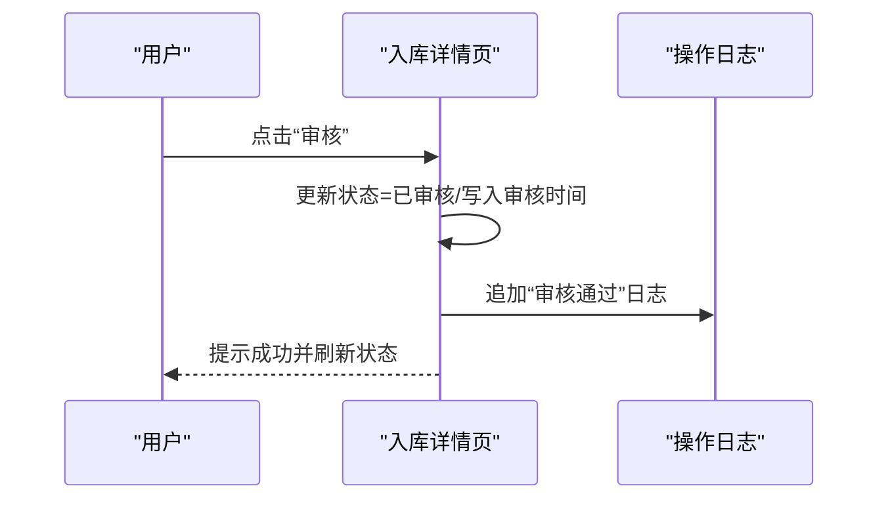
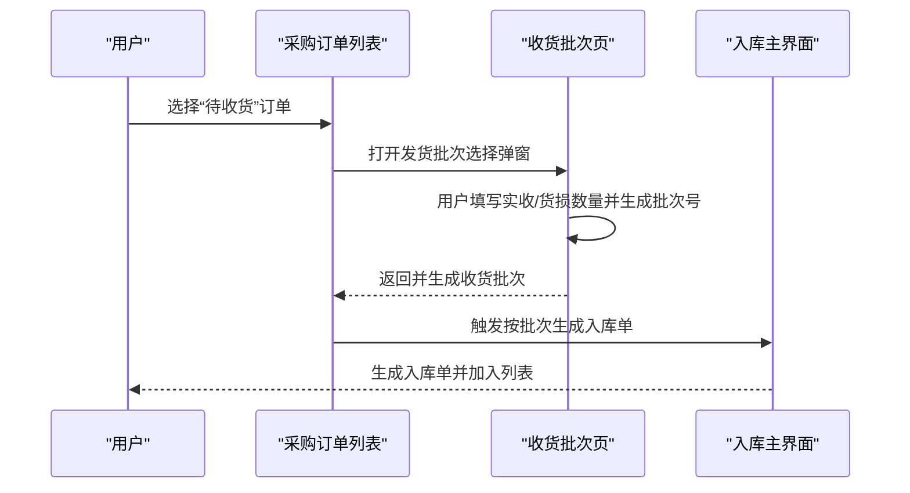

# 入库管理

<cite>
**本文引用的文件**
- [apps/pc/src/views/warehouse/stock/index.vue](file://apps/pc/src/views/warehouse/stock/index.vue)
- [apps/pc/src/views/warehouse/stock/in.vue](file://apps/pc/src/views/warehouse/stock/in.vue)
- [apps/pc/src/views/warehouse/stock/in/index.vue](file://apps/pc/src/views/warehouse/stock/in/index.vue)
- [apps/pc/src/views/warehouse/stock/in/detail.vue](file://apps/pc/src/views/warehouse/stock/in/detail.vue)
- [apps/pc/src/views/warehouse/order/purchase/create.vue](file://apps/pc/src/views/warehouse/order/purchase/create.vue)
- [apps/pc/src/views/warehouse/order/purchase/index.vue](file://apps/pc/src/views/warehouse/order/purchase/index.vue)
- [apps/pc/src/views/warehouse/stock/receive-batch.vue](file://apps/pc/src/views/warehouse/stock/receive-batch.vue)
</cite>

## 目录
1. [简介](#简介)
2. [项目结构](#项目结构)
3. [核心组件](#核心组件)
4. [架构总览](#架构总览)
5. [详细组件分析](#详细组件分析)
6. [依赖关系分析](#依赖关系分析)
7. [性能考量](#性能考量)
8. [故障排查指南](#故障排查指南)
9. [结论](#结论)
10. [附录](#附录)

## 简介
本文件面向工程仓入库管理功能，系统化梳理入库业务的全流程与界面实现，覆盖采购入库、退货入库、调拨入库等类型；阐述入库单创建（来源：采购订单、销售退货、内部调拨）、审核机制（待审核、已审核、已完成）、入库确认、查询与筛选、状态管理、数量与金额核算、供应商信息关联等关键点，并提供操作指南、最佳实践与常见问题解决方案。

## 项目结构
入库管理相关页面主要分布在 PC 端“仓库”模块下的“库存”与“订单”子模块中，采用按功能域划分的组织方式：
- 入库主界面与按批次入库：apps/pc/src/views/warehouse/stock/index.vue
- 入库列表与筛选：apps/pc/src/views/warehouse/stock/in/index.vue
- 入库单详情与审核：apps/pc/src/views/warehouse/stock/in/detail.vue
- 采购入库来源：apps/pc/src/views/warehouse/order/purchase/create.vue、apps/pc/src/views/warehouse/order/purchase/index.vue
- 收货批次与入库生成：apps/pc/src/views/warehouse/stock/receive-batch.vue

图表来源
- [apps/pc/src/views/warehouse/stock/index.vue:10-118](file://apps/pc/src/views/warehouse/stock/index.vue#L10-L118)
- [apps/pc/src/views/warehouse/stock/in/index.vue:1-75](file://apps/pc/src/views/warehouse/stock/in/index.vue#L1-L75)
- [apps/pc/src/views/warehouse/stock/in/detail.vue:1-42](file://apps/pc/src/views/warehouse/stock/in/detail.vue#L1-L42)
- [apps/pc/src/views/warehouse/order/purchase/create.vue:1-209](file://apps/pc/src/views/warehouse/order/purchase/create.vue#L1-L209)
- [apps/pc/src/views/warehouse/order/purchase/index.vue:1-800](file://apps/pc/src/views/warehouse/order/purchase/index.vue#L1-L800)
- [apps/pc/src/views/warehouse/stock/receive-batch.vue:429-499](file://apps/pc/src/views/warehouse/stock/receive-batch.vue#L429-L499)

章节来源
- [apps/pc/src/views/warehouse/stock/index.vue:1-118](file://apps/pc/src/views/warehouse/stock/index.vue#L1-L118)
- [apps/pc/src/views/warehouse/stock/in/index.vue:1-75](file://apps/pc/src/views/warehouse/stock/in/index.vue#L1-L75)
- [apps/pc/src/views/warehouse/stock/in/detail.vue:1-42](file://apps/pc/src/views/warehouse/stock/in/detail.vue#L1-L42)
- [apps/pc/src/views/warehouse/order/purchase/create.vue:1-209](file://apps/pc/src/views/warehouse/order/purchase/create.vue#L1-L209)
- [apps/pc/src/views/warehouse/order/purchase/index.vue:1-800](file://apps/pc/src/views/warehouse/order/purchase/index.vue#L1-L800)
- [apps/pc/src/views/warehouse/stock/receive-batch.vue:429-499](file://apps/pc/src/views/warehouse/stock/receive-batch.vue#L429-L499)

## 核心组件
- 入库主界面（按批次入库）：支持按供应商、仓库、批次勾选合并生成入库单，计算总数量与总金额，生成入库单号并弹窗确认。
- 入库列表页：支持按入库类型、状态筛选，展示入库单号、来源单号、供应商/来源、仓库、数量、金额、状态、时间等字段。
- 入库单详情页：展示入库单基础信息、商品批次明细、批次库存分布、操作日志；支持审核与打印。
- 采购订单来源：提供采购订单创建与收货流程，收货时按发货批次生成入库批次与入库单。
- 收货批次页：支持选择采购订单、SKU、收货数量、生成批次号、是否自动入库等。

章节来源
- [apps/pc/src/views/warehouse/stock/index.vue:235-313](file://apps/pc/src/views/warehouse/stock/index.vue#L235-L313)
- [apps/pc/src/views/warehouse/stock/in/index.vue:1-75](file://apps/pc/src/views/warehouse/stock/in/index.vue#L1-L75)
- [apps/pc/src/views/warehouse/stock/in/detail.vue:1-139](file://apps/pc/src/views/warehouse/stock/in/detail.vue#L1-L139)
- [apps/pc/src/views/warehouse/order/purchase/create.vue:1-209](file://apps/pc/src/views/warehouse/order/purchase/create.vue#L1-L209)
- [apps/pc/src/views/warehouse/order/purchase/index.vue:623-748](file://apps/pc/src/views/warehouse/order/purchase/index.vue#L623-L748)
- [apps/pc/src/views/warehouse/stock/receive-batch.vue:429-499](file://apps/pc/src/views/warehouse/stock/receive-batch.vue#L429-L499)

## 架构总览
入库管理在前端以页面组件为核心，围绕“入库单”“批次”“订单”三大实体展开，形成“来源单据→批次→入库单”的闭环。采购入库通过“采购订单→收货批次→入库单”串联；退货入库与调拨入库在界面层支持来源单据关联与状态流转。

图表来源
- [apps/pc/src/views/warehouse/stock/in/index.vue:140-161](file://apps/pc/src/views/warehouse/stock/in/index.vue#L140-L161)
- [apps/pc/src/views/warehouse/stock/in/detail.vue:306-319](file://apps/pc/src/views/warehouse/stock/in/detail.vue#L306-L319)
- [apps/pc/src/views/warehouse/order/purchase/index.vue:623-748](file://apps/pc/src/views/warehouse/order/purchase/index.vue#L623-L748)
- [apps/pc/src/views/warehouse/stock/receive-batch.vue:429-499](file://apps/pc/src/views/warehouse/stock/receive-batch.vue#L429-L499)
- [apps/pc/src/views/warehouse/stock/index.vue:718-762](file://apps/pc/src/views/warehouse/stock/index.vue#L718-L762)

## 详细组件分析

### 入库主界面（按批次入库）
- 功能要点
  - 勾选多个同供应商、同仓库的批次，合并生成一张入库单。
  - 自动计算所选批次的总数量与总金额，支持手动调整入库数量。
  - 自动生成入库单号，支持打印入库单。
- 关键逻辑
  - 生成入库单号：基于日期与随机数拼接。
  - 合并入库：遍历选中批次，构造入库单明细与批次信息。
  - 校验：入库单号必填、至少勾选一个批次、入库数量大于0。

图表来源
- [apps/pc/src/views/warehouse/stock/index.vue:686-762](file://apps/pc/src/views/warehouse/stock/index.vue#L686-L762)

章节来源
- [apps/pc/src/views/warehouse/stock/index.vue:235-313](file://apps/pc/src/views/warehouse/stock/index.vue#L235-L313)
- [apps/pc/src/views/warehouse/stock/index.vue:686-762](file://apps/pc/src/views/warehouse/stock/index.vue#L686-L762)

### 入库列表与筛选
- 功能要点
  - 支持按入库类型（采购入库/退货入库/调拨入库）、状态（待审核/已审核/已完成）筛选。
  - 支持关键字搜索入库单号或来源单号。
  - 展示入库单号、来源单号、供应商/来源、仓库、数量、金额、状态、时间等字段。
- 关键逻辑
  - 筛选器联动过滤：订单号包含来源单号匹配、类型与状态精确匹配。
  - 分页与统计：动态更新总条数与分页参数。

图表来源
- [apps/pc/src/views/warehouse/stock/in/index.vue:140-161](file://apps/pc/src/views/warehouse/stock/in/index.vue#L140-L161)

章节来源
- [apps/pc/src/views/warehouse/stock/in/index.vue:1-75](file://apps/pc/src/views/warehouse/stock/in/index.vue#L1-L75)
- [apps/pc/src/views/warehouse/stock/in/index.vue:140-161](file://apps/pc/src/views/warehouse/stock/in/index.vue#L140-L161)

### 入库单详情与审核
- 功能要点
  - 展示入库单基础信息（类型、来源单号、供应商、仓库、数量、金额、状态、时间、操作人、备注）。
  - 展示商品批次明细与批次库存分布（含库存状态标签）。
  - 支持“审核”“打印”操作；支持查看操作日志。
- 关键逻辑
  - 审核流程：点击“审核”后更新状态与时间戳，并追加日志。
  - 状态映射：待审核→已审核→已完成。

图表来源
- [apps/pc/src/views/warehouse/stock/in/detail.vue:306-319](file://apps/pc/src/views/warehouse/stock/in/detail.vue#L306-L319)

章节来源
- [apps/pc/src/views/warehouse/stock/in/detail.vue:1-139](file://apps/pc/src/views/warehouse/stock/in/detail.vue#L1-L139)
- [apps/pc/src/views/warehouse/stock/in/detail.vue:281-288](file://apps/pc/src/views/warehouse/stock/in/detail.vue#L281-L288)
- [apps/pc/src/views/warehouse/stock/in/detail.vue:306-319](file://apps/pc/src/views/warehouse/stock/in/detail.vue#L306-L319)

### 采购入库来源（订单→收货→入库）
- 功能要点
  - 采购订单创建：选择商品、填写收货信息、提交订单。
  - 订单收货：选择发货批次、填写实收数量、货损数量、生成收货批次号、选择入库仓库。
  - 自动生成入库单：按收货批次生成入库单与批次。
- 关键逻辑
  - 发货批次选择：弹窗展示多个发货批次，用户选择后进入收货确认。
  - 收货确认：校验收货数量与货损数量，生成批次号，必要时生成货损售后记录。
  - 状态推进：全部收货且已支付则订单状态推进为“已完成”。

图表来源
- [apps/pc/src/views/warehouse/order/purchase/index.vue:623-748](file://apps/pc/src/views/warehouse/order/purchase/index.vue#L623-L748)
- [apps/pc/src/views/warehouse/stock/receive-batch.vue:429-499](file://apps/pc/src/views/warehouse/stock/receive-batch.vue#L429-L499)
- [apps/pc/src/views/warehouse/stock/index.vue:718-762](file://apps/pc/src/views/warehouse/stock/index.vue#L718-L762)

章节来源
- [apps/pc/src/views/warehouse/order/purchase/create.vue:1-209](file://apps/pc/src/views/warehouse/order/purchase/create.vue#L1-L209)
- [apps/pc/src/views/warehouse/order/purchase/index.vue:623-748](file://apps/pc/src/views/warehouse/order/purchase/index.vue#L623-L748)
- [apps/pc/src/views/warehouse/stock/receive-batch.vue:429-499](file://apps/pc/src/views/warehouse/stock/receive-batch.vue#L429-L499)
- [apps/pc/src/views/warehouse/stock/index.vue:718-762](file://apps/pc/src/views/warehouse/stock/index.vue#L718-L762)

### 退货入库与调拨入库
- 退货入库
  - 来源单据：销售退货单（界面支持来源单号字段）。
  - 状态流转：待审核→已审核→已完成。
  - 数量与金额：界面展示入库数量与金额字段，支持按批次明细查看。
- 调拨入库
  - 来源单据：内部调拨单（界面支持来源单号字段）。
  - 状态流转：与采购入库一致，支持审核与入库确认。

章节来源
- [apps/pc/src/views/warehouse/stock/in/index.vue:96-100](file://apps/pc/src/views/warehouse/stock/in/index.vue#L96-L100)
- [apps/pc/src/views/warehouse/stock/in/index.vue:131-138](file://apps/pc/src/views/warehouse/stock/in/index.vue#L131-L138)
- [apps/pc/src/views/warehouse/stock/in/index.vue:182-184](file://apps/pc/src/views/warehouse/stock/in/index.vue#L182-L184)

## 依赖关系分析
- 页面耦合
  - 入库列表页与入库详情页强关联，详情页用于审核与查看日志。
  - 采购订单列表页与收货批次页、入库主界面形成“订单→收货→入库”的链路。
- 数据依赖
  - 入库单数据来源于批次勾选与订单收货；供应商、仓库、SKU 等信息来自上游订单与商品中心。
- 状态依赖
  - 审核前置条件：仅“待审核”状态可执行审核；审核后进入“已完成”或后续流程。

图表来源
- [apps/pc/src/views/warehouse/stock/in/index.vue:175-184](file://apps/pc/src/views/warehouse/stock/in/index.vue#L175-L184)
- [apps/pc/src/views/warehouse/stock/in/detail.vue:306-319](file://apps/pc/src/views/warehouse/stock/in/detail.vue#L306-L319)
- [apps/pc/src/views/warehouse/order/purchase/index.vue:623-748](file://apps/pc/src/views/warehouse/order/purchase/index.vue#L623-L748)
- [apps/pc/src/views/warehouse/stock/receive-batch.vue:429-499](file://apps/pc/src/views/warehouse/stock/receive-batch.vue#L429-L499)
- [apps/pc/src/views/warehouse/stock/index.vue:718-762](file://apps/pc/src/views/warehouse/stock/index.vue#L718-L762)

章节来源
- [apps/pc/src/views/warehouse/stock/in/index.vue:175-184](file://apps/pc/src/views/warehouse/stock/in/index.vue#L175-L184)
- [apps/pc/src/views/warehouse/stock/in/detail.vue:306-319](file://apps/pc/src/views/warehouse/stock/in/detail.vue#L306-L319)
- [apps/pc/src/views/warehouse/order/purchase/index.vue:623-748](file://apps/pc/src/views/warehouse/order/purchase/index.vue#L623-L748)
- [apps/pc/src/views/warehouse/stock/receive-batch.vue:429-499](file://apps/pc/src/views/warehouse/stock/receive-batch.vue#L429-L499)
- [apps/pc/src/views/warehouse/stock/index.vue:718-762](file://apps/pc/src/views/warehouse/stock/index.vue#L718-L762)

## 性能考量
- 列表渲染
  - 使用虚拟滚动与分页控制数据规模，避免一次性渲染大量行。
- 筛选与排序
  - 前端筛选在内存中进行，建议限制初始数据量或引入服务端分页/过滤。
- 图片与大图
  - 商品卡片中的图片建议懒加载与尺寸优化，减少首屏压力。
- 交互反馈
  - 大量弹窗与确认操作时，注意消息提示与加载状态，避免重复提交。

## 故障排查指南
- 入库单无法创建
  - 现象：点击“生成入库单”无响应或报错。
  - 排查：检查入库单号是否生成、是否勾选批次、入库数量是否大于 0。
  - 参考路径：[apps/pc/src/views/warehouse/stock/index.vue:718-762](file://apps/pc/src/views/warehouse/stock/index.vue#L718-L762)
- 审核失败
  - 现象：点击“审核”后状态未变更。
  - 排查：确认当前状态为“待审核”，检查网络请求与日志更新。
  - 参考路径：[apps/pc/src/views/warehouse/stock/in/detail.vue:306-319](file://apps/pc/src/views/warehouse/stock/in/detail.vue#L306-L319)
- 收货批次生成异常
  - 现象：收货确认后未生成入库单或批次号为空。
  - 排查：确认已选择发货批次、填写实收数量与货损数量、仓库选择正确。
  - 参考路径：[apps/pc/src/views/warehouse/order/purchase/index.vue:623-748](file://apps/pc/src/views/warehouse/order/purchase/index.vue#L623-L748)
- 查询无结果
  - 现象：筛选后列表为空。
  - 排查：检查筛选条件是否过严（如精确匹配状态），尝试清空筛选或放宽条件。
  - 参考路径：[apps/pc/src/views/warehouse/stock/in/index.vue:140-161](file://apps/pc/src/views/warehouse/stock/in/index.vue#L140-L161)

章节来源
- [apps/pc/src/views/warehouse/stock/index.vue:718-762](file://apps/pc/src/views/warehouse/stock/index.vue#L718-L762)
- [apps/pc/src/views/warehouse/stock/in/detail.vue:306-319](file://apps/pc/src/views/warehouse/stock/in/detail.vue#L306-L319)
- [apps/pc/src/views/warehouse/order/purchase/index.vue:623-748](file://apps/pc/src/views/warehouse/order/purchase/index.vue#L623-L748)
- [apps/pc/src/views/warehouse/stock/in/index.vue:140-161](file://apps/pc/src/views/warehouse/stock/in/index.vue#L140-L161)

## 结论
入库管理在前端通过“按批次入库”“订单收货→入库单生成”的两条主线实现，辅以完善的列表筛选、详情审核与日志追踪，满足工程仓多类型入库场景。建议在后续迭代中补充服务端接口对接、权限控制与审计日志，进一步提升稳定性与合规性。

## 附录

### 操作指南
- 采购入库
  1) 在“采购订单列表”选择“待收货”订单，打开“发货批次选择”弹窗。
  2) 勾选发货批次，填写实收数量与货损数量，生成批次号。
  3) 确认入库仓库，触发“按批次生成入库单”，完成入库。
- 退货入库/调拨入库
  1) 在“入库列表”选择“退货入库/调拨入库”类型与状态。
  2) 在“入库详情”执行“审核”，审核通过后完成入库。

章节来源
- [apps/pc/src/views/warehouse/order/purchase/index.vue:623-748](file://apps/pc/src/views/warehouse/order/purchase/index.vue#L623-L748)
- [apps/pc/src/views/warehouse/stock/in/index.vue:182-184](file://apps/pc/src/views/warehouse/stock/in/index.vue#L182-L184)
- [apps/pc/src/views/warehouse/stock/in/detail.vue:306-319](file://apps/pc/src/views/warehouse/stock/in/detail.vue#L306-L319)

### 最佳实践
- 批次管理
  - 同一批次尽量对应同一供应商与仓库，便于合并生成入库单。
- 数量与金额
  - 实收数量可小于发货数量，差异需在备注中说明；货损需上传凭证并注明预计退款。
- 状态推进
  - 审核前确保来源单据与批次信息完整，避免重复审核或状态回退。

### 常见问题
- 问：为什么“按批次入库”弹窗没有显示批次？
  - 答：请确认当前有可入库的批次数据，且供应商与仓库一致。
- 问：审核后状态未更新？
  - 答：请检查当前状态是否为“待审核”，并刷新页面查看最新状态。
- 问：收货确认后未生成入库单？
  - 答：请检查是否选择了发货批次、填写了实收数量、仓库选择正确。