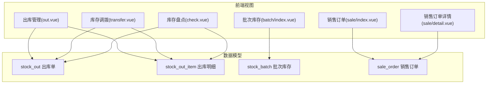
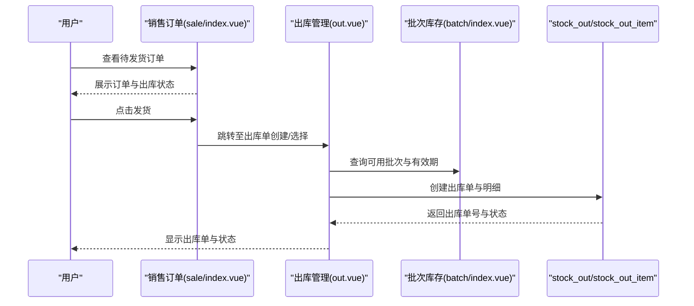
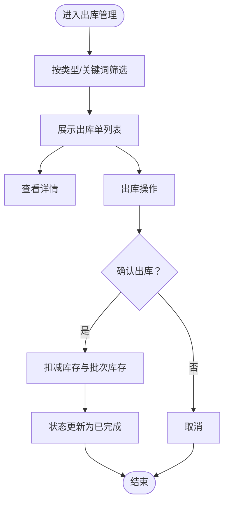
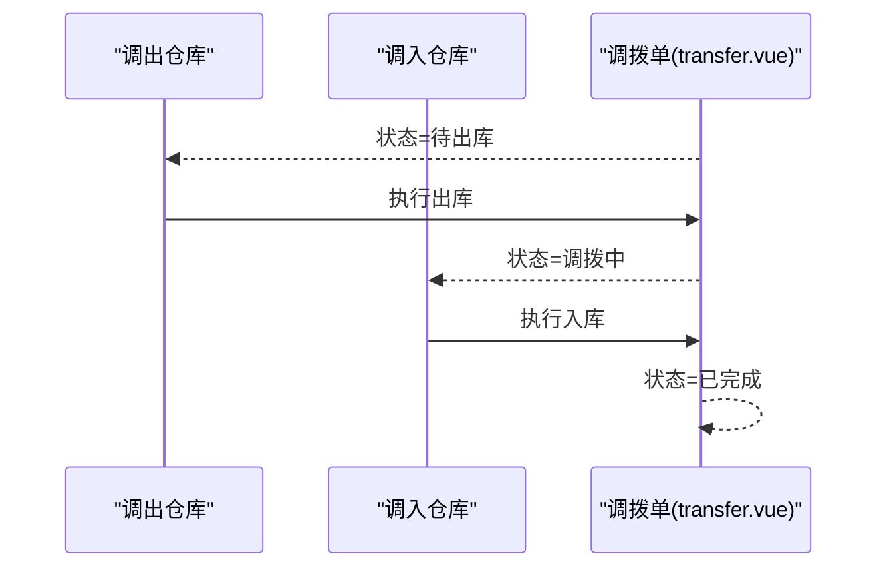
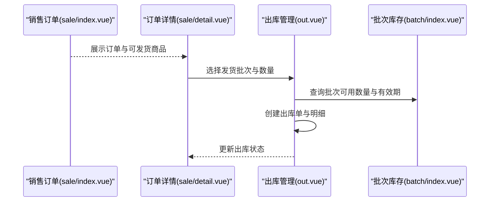
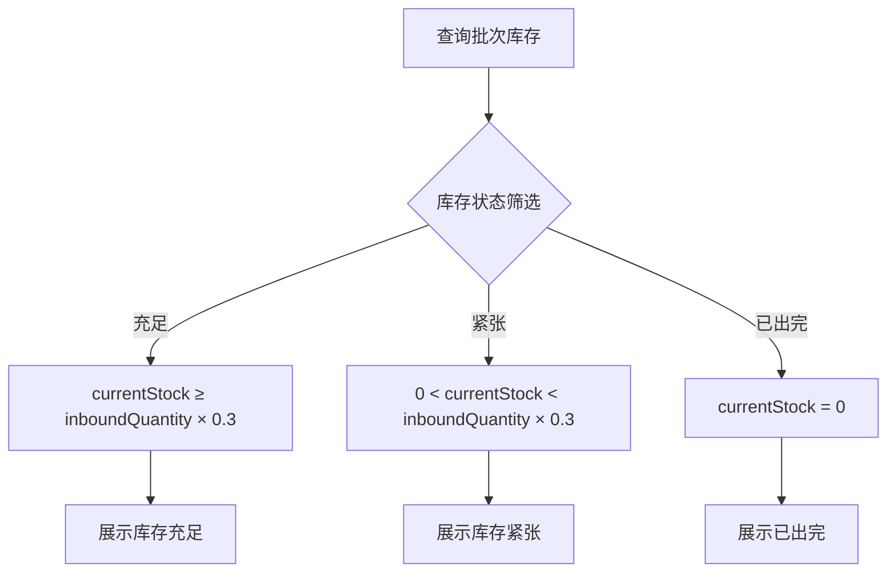
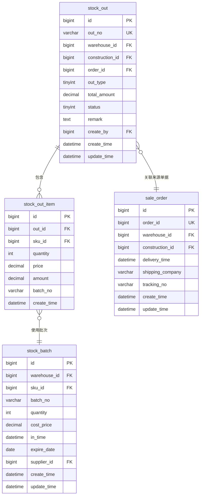

# 出库管理

<cite>
**本文引用的文件**   
- [apps/pc/src/views/warehouse/stock/out.vue](file://apps/pc/src/views/warehouse/stock/out.vue)
- [apps/pc/src/views/warehouse/stock/transfer.vue](file://apps/pc/src/views/warehouse/stock/transfer.vue)
- [apps/pc/src/views/warehouse/order/sale/index.vue](file://apps/pc/src/views/warehouse/order/sale/index.vue)
- [apps/pc/src/views/warehouse/order/sale/detail.vue](file://apps/pc/src/views/warehouse/order/sale/detail.vue)
- [apps/pc/src/views/warehouse/stock/batch/index.vue](file://apps/pc/src/views/warehouse/stock/batch/index.vue)
- [apps/pc/src/views/warehouse/stock/check.vue](file://apps/pc/src/views/warehouse/stock/check.vue)
- [docs/PRD/03-数据模型与表结构.md](file://docs/PRD/03-数据模型与表结构.md)
</cite>

## 目录
1. [简介](#简介)
2. [项目结构](#项目结构)
3. [核心组件](#核心组件)
4. [架构总览](#架构总览)
5. [详细组件分析](#详细组件分析)
6. [依赖分析](#依赖分析)
7. [性能考虑](#性能考虑)
8. [故障排查指南](#故障排查指南)
9. [结论](#结论)
10. [附录](#附录)

## 简介
本文件面向工程仓出库管理功能，系统化阐述销售出库、调拨出库、领料出库、退货出库等多类型出库的业务流程与技术实现，覆盖出库单创建、审核、确认、查询、批次与有效期管理、成本核算、库存扣减与状态更新等关键环节，并提供操作指南、库存控制策略与异常处理方案。

## 项目结构
工程仓出库管理主要由前端页面与数据模型两部分构成：
- 前端页面：出库列表、调拨管理、销售订单、批次库存、盘点等视图组件
- 数据模型：出库单、出库明细、批次库存、销售订单等核心表结构

图表来源
- [apps/pc/src/views/warehouse/stock/out.vue:1-325](file://apps/pc/src/views/warehouse/stock/out.vue#L1-L325)
- [apps/pc/src/views/warehouse/stock/transfer.vue:1-253](file://apps/pc/src/views/warehouse/stock/transfer.vue#L1-L253)
- [apps/pc/src/views/warehouse/order/sale/index.vue:1-183](file://apps/pc/src/views/warehouse/order/sale/index.vue#L1-L183)
- [apps/pc/src/views/warehouse/order/sale/detail.vue:431-485](file://apps/pc/src/views/warehouse/order/sale/detail.vue#L431-L485)
- [apps/pc/src/views/warehouse/stock/batch/index.vue:1-431](file://apps/pc/src/views/warehouse/stock/batch/index.vue#L1-L431)
- [apps/pc/src/views/warehouse/stock/check.vue:1-289](file://apps/pc/src/views/warehouse/stock/check.vue#L1-L289)
- [docs/PRD/03-数据模型与表结构.md:546-590](file://docs/PRD/03-数据模型与表结构.md#L546-L590)

章节来源
- [apps/pc/src/views/warehouse/stock/out.vue:1-325](file://apps/pc/src/views/warehouse/stock/out.vue#L1-L325)
- [apps/pc/src/views/warehouse/stock/transfer.vue:1-253](file://apps/pc/src/views/warehouse/stock/transfer.vue#L1-L253)
- [apps/pc/src/views/warehouse/order/sale/index.vue:1-183](file://apps/pc/src/views/warehouse/order/sale/index.vue#L1-L183)
- [apps/pc/src/views/warehouse/order/sale/detail.vue:431-485](file://apps/pc/src/views/warehouse/order/sale/detail.vue#L431-L485)
- [apps/pc/src/views/warehouse/stock/batch/index.vue:1-431](file://apps/pc/src/views/warehouse/stock/batch/index.vue#L1-L431)
- [apps/pc/src/views/warehouse/stock/check.vue:1-289](file://apps/pc/src/views/warehouse/stock/check.vue#L1-L289)
- [docs/PRD/03-数据模型与表结构.md:546-590](file://docs/PRD/03-数据模型与表结构.md#L546-L590)

## 核心组件
- 出库管理列表页：支持按出库类型筛选、关键字搜索、状态统计、查看详情与出库操作
- 调拨管理页：支持调拨单状态跟踪、调出/调入仓库的出库与入库联动
- 销售订单页：展示订单出库状态、收款状态与订单状态，支持发货操作
- 批次库存页：展示批次库存、当前库存、出库记录与入库单号关联
- 盘点页：支持全盘/抽盘、差异处理与库存调整

章节来源
- [apps/pc/src/views/warehouse/stock/out.vue:10-114](file://apps/pc/src/views/warehouse/stock/out.vue#L10-L114)
- [apps/pc/src/views/warehouse/stock/transfer.vue:10-106](file://apps/pc/src/views/warehouse/stock/transfer.vue#L10-L106)
- [apps/pc/src/views/warehouse/order/sale/index.vue:1-183](file://apps/pc/src/views/warehouse/order/sale/index.vue#L1-L183)
- [apps/pc/src/views/warehouse/stock/batch/index.vue:1-125](file://apps/pc/src/views/warehouse/stock/batch/index.vue#L1-L125)
- [apps/pc/src/views/warehouse/stock/check.vue:1-118](file://apps/pc/src/views/warehouse/stock/check.vue#L1-L118)

## 架构总览
出库管理围绕“订单驱动 + 批次管理 + 成本核算”的核心思路展开：
- 订单驱动：销售出库通常由销售订单触发；调拨出库由调拨单驱动；领料/退货出库由相应单据驱动
- 批次管理：出库明细绑定批次号，支持先进先出策略与有效期跟踪
- 成本核算：出库单价与金额参与成本结转，支持后续财务对账
- 库存扣减：出库完成后实时扣减对应仓库的可用库存与批次库存

图表来源
- [apps/pc/src/views/warehouse/order/sale/index.vue:1-183](file://apps/pc/src/views/warehouse/order/sale/index.vue#L1-L183)
- [apps/pc/src/views/warehouse/stock/out.vue:1-325](file://apps/pc/src/views/warehouse/stock/out.vue#L1-L325)
- [apps/pc/src/views/warehouse/stock/batch/index.vue:1-431](file://apps/pc/src/views/warehouse/stock/batch/index.vue#L1-L431)
- [docs/PRD/03-数据模型与表结构.md:546-574](file://docs/PRD/03-数据模型与表结构.md#L546-L574)

## 详细组件分析

### 出库管理列表页（销售/调拨/领料）
- 功能要点
  - 出库类型筛选：销售出库、调拨出库、领料出库
  - 关键字搜索：支持按出库单号、客户/去向名称检索
  - 状态统计：今日出库单、待出库数量、出库商品数、出库金额
  - 操作入口：详情、出库、打印
- 业务规则
  - 待出库状态下允许编辑；完成后禁止修改
  - 出库完成后自动扣减对应仓库库存
  - 支持先进先出策略与批次号推荐

图表来源
- [apps/pc/src/views/warehouse/stock/out.vue:10-114](file://apps/pc/src/views/warehouse/stock/out.vue#L10-L114)
- [apps/pc/src/views/warehouse/stock/out.vue:133-212](file://apps/pc/src/views/warehouse/stock/out.vue#L133-L212)

章节来源
- [apps/pc/src/views/warehouse/stock/out.vue:10-114](file://apps/pc/src/views/warehouse/stock/out.vue#L10-L114)
- [apps/pc/src/views/warehouse/stock/out.vue:133-212](file://apps/pc/src/views/warehouse/stock/out.vue#L133-L212)

### 调拨出库流程
- 功能要点
  - 调拨单状态：待出库、调拨中、已完成
  - 调出仓库执行出库，调入仓库执行入库
  - 支持在途库存与预计到达时间
- 业务规则
  - 调出仓库必须有足够可用库存
  - 调出完成后，调入仓库待入库库存自动增加
  - 调入完成后，正式增加调入仓库库存

图表来源
- [apps/pc/src/views/warehouse/stock/transfer.vue:10-106](file://apps/pc/src/views/warehouse/stock/transfer.vue#L10-L106)
- [apps/pc/src/views/warehouse/stock/transfer.vue:121-170](file://apps/pc/src/views/warehouse/stock/transfer.vue#L121-L170)

章节来源
- [apps/pc/src/views/warehouse/stock/transfer.vue:10-106](file://apps/pc/src/views/warehouse/stock/transfer.vue#L10-L106)
- [apps/pc/src/views/warehouse/stock/transfer.vue:121-170](file://apps/pc/src/views/warehouse/stock/transfer.vue#L121-L170)

### 销售出库与批次管理
- 功能要点
  - 销售订单展示出库状态、收款状态与订单状态
  - 发货操作触发出库单创建
  - 批次库存展示入库数量、当前库存、已出库数量、库存状态
- 业务规则
  - 出库明细绑定批次号，支持先进先出策略
  - 出库完成后自动扣减批次库存与仓库库存
  - 支持有效期跟踪与临近过期预警

图表来源
- [apps/pc/src/views/warehouse/order/sale/index.vue:1-183](file://apps/pc/src/views/warehouse/order/sale/index.vue#L1-L183)
- [apps/pc/src/views/warehouse/order/sale/detail.vue:431-485](file://apps/pc/src/views/warehouse/order/sale/detail.vue#L431-L485)
- [apps/pc/src/views/warehouse/stock/out.vue:1-325](file://apps/pc/src/views/warehouse/stock/out.vue#L1-L325)
- [apps/pc/src/views/warehouse/stock/batch/index.vue:1-431](file://apps/pc/src/views/warehouse/stock/batch/index.vue#L1-L431)

章节来源
- [apps/pc/src/views/warehouse/order/sale/index.vue:1-183](file://apps/pc/src/views/warehouse/order/sale/index.vue#L1-L183)
- [apps/pc/src/views/warehouse/order/sale/detail.vue:431-485](file://apps/pc/src/views/warehouse/order/sale/detail.vue#L431-L485)
- [apps/pc/src/views/warehouse/stock/batch/index.vue:1-431](file://apps/pc/src/views/warehouse/stock/batch/index.vue#L1-L431)

### 批次库存与有效期管理
- 功能要点
  - 展示批次号、商品信息、入库日期、生产日期、入库数量、当前库存、已出库数量
  - 支持按库存状态（充足/紧张/已出完）筛选
  - 查看出库记录：按批次维度追踪历史出库
- 业务规则
  - 当前库存=0：库存状态=已出完
  - 当前库存<入库数量×0.3：库存状态=库存紧张
  - 其他：库存状态=库存充足

图表来源
- [apps/pc/src/views/warehouse/stock/batch/index.vue:285-301](file://apps/pc/src/views/warehouse/stock/batch/index.vue#L285-L301)
- [apps/pc/src/views/warehouse/stock/batch/index.vue:303-343](file://apps/pc/src/views/warehouse/stock/batch/index.vue#L303-L343)

章节来源
- [apps/pc/src/views/warehouse/stock/batch/index.vue:285-301](file://apps/pc/src/views/warehouse/stock/batch/index.vue#L285-L301)
- [apps/pc/src/views/warehouse/stock/batch/index.vue:303-343](file://apps/pc/src/views/warehouse/stock/batch/index.vue#L303-L343)

### 库存盘点与差异处理
- 功能要点
  - 全盘/抽盘：支持按仓库、品类筛选
  - 差异处理：盘盈盘亏自动计算、库存调整、财务过账
  - 统计分析：盘点准确率、差异金额、SKU差异数
- 业务规则
  - 盘点过程中建议冻结对应库存的出入库
  - 实盘数与系统数的差异即为盈亏
  - 差异需经审核后方可调整库存

章节来源
- [apps/pc/src/views/warehouse/stock/check.vue:1-289](file://apps/pc/src/views/warehouse/stock/check.vue#L1-L289)

## 依赖分析
- 出库单与明细
  - 出库单表(stock_out)：包含出库类型、来源单据、状态、金额等
  - 出库明细表(stock_out_item)：包含SKU、数量、单价、金额、批次号等
- 批次库存(stock_batch)：维护批次号、成本价、有效期、供应商等
- 销售订单(sale_order)：与出库单关联，驱动销售出库
- 调拨单：驱动调拨出库与调拨入库

图表来源
- [docs/PRD/03-数据模型与表结构.md:546-590](file://docs/PRD/03-数据模型与表结构.md#L546-L590)

章节来源
- [docs/PRD/03-数据模型与表结构.md:546-590](file://docs/PRD/03-数据模型与表结构.md#L546-L590)

## 性能考虑
- 列表查询优化
  - 使用分页参数(current/pageSize/total)控制数据量
  - 前端筛选（类型、关键词）减少后端压力
- 批次查询优化
  - 按入库日期、库存状态、仓库等条件过滤，避免全表扫描
  - 对常用字段建立索引（如batch_no、warehouse_id、sku_id）
- 出库扣减优化
  - 扣减库存与批次库存采用原子性事务，避免并发冲突
  - 批次先进先出策略可通过数据库排序与限制减少回溯

## 故障排查指南
- 出库失败或超发
  - 检查可用库存是否充足，确保出库数量不超过可用库存
  - 核对批次库存与有效期，避免过期批次被误用
- 出库单状态异常
  - 待出库状态下可编辑；完成后禁止修改
  - 若状态卡在“出库中”，检查调拨单或销售订单的关联状态
- 批次库存显示异常
  - 核对批次库存表中的数量与成本价是否正确
  - 检查是否存在未完成的在途出库或入库
- 盘点差异
  - 盘点前冻结相关库存的出入库
  - 差异需经审核后调整，避免手工篡改

章节来源
- [apps/pc/src/views/warehouse/stock/out.vue:10-114](file://apps/pc/src/views/warehouse/stock/out.vue#L10-L114)
- [apps/pc/src/views/warehouse/stock/transfer.vue:10-106](file://apps/pc/src/views/warehouse/stock/transfer.vue#L10-L106)
- [apps/pc/src/views/warehouse/stock/batch/index.vue:1-431](file://apps/pc/src/views/warehouse/stock/batch/index.vue#L1-L431)
- [apps/pc/src/views/warehouse/stock/check.vue:1-289](file://apps/pc/src/views/warehouse/stock/check.vue#L1-L289)

## 结论
工程仓出库管理以“订单驱动 + 批次管理 + 成本核算”为核心，结合销售出库、调拨出库、领料出库、退货出库等多类型场景，实现了从创建、审核、确认到查询与统计的全流程闭环。通过批次与有效期管理、先进先出策略以及严格的库存扣减与状态更新机制，保障了数据准确性与业务合规性。建议在实际落地中强化批次索引、完善异常处理与审计日志，并持续优化查询与扣减性能。

## 附录
- 操作指南
  - 销售出库：在销售订单中选择发货，系统根据订单生成出库单并扣减库存
  - 调拨出库：在调拨单中执行出库，调入仓库执行入库，完成库存转移
  - 领料/退货出库：通过相应单据创建出库单，系统自动扣减对应仓库库存
- 库存控制策略
  - 设置安全库存阈值，触发补货提醒
  - 对临近有效期的批次进行预警与优先出库
  - 定期盘点，及时发现并处理差异
- 异常处理方案
  - 超发：拦截并提示，要求调整出库数量
  - 批次过期：禁止出库，提示更换批次
  - 盘点差异：生成差异单，经审核后调整库存与财务