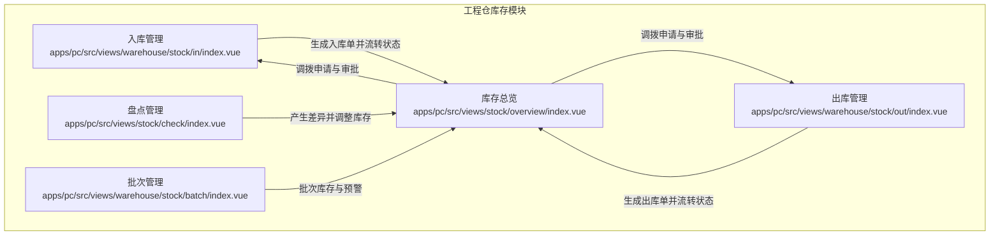
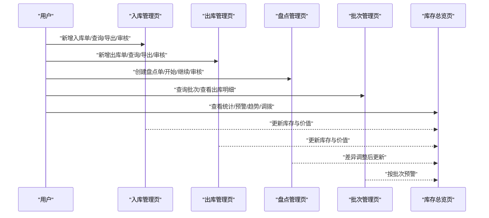
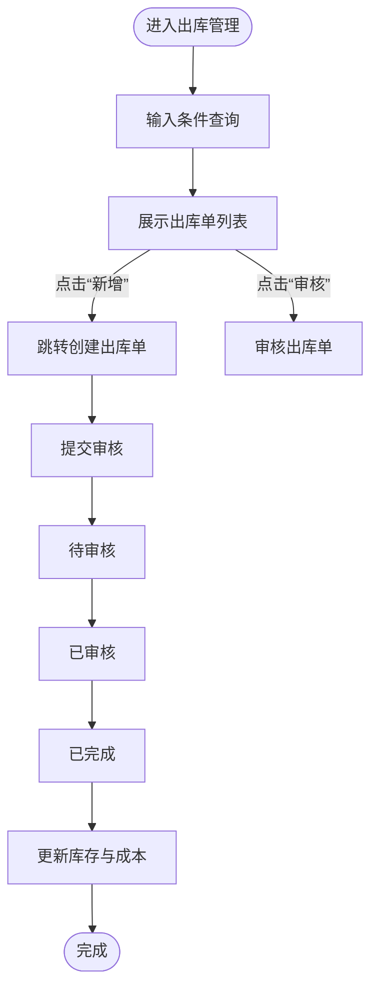
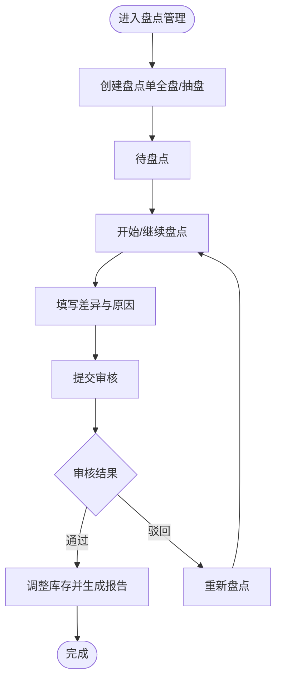
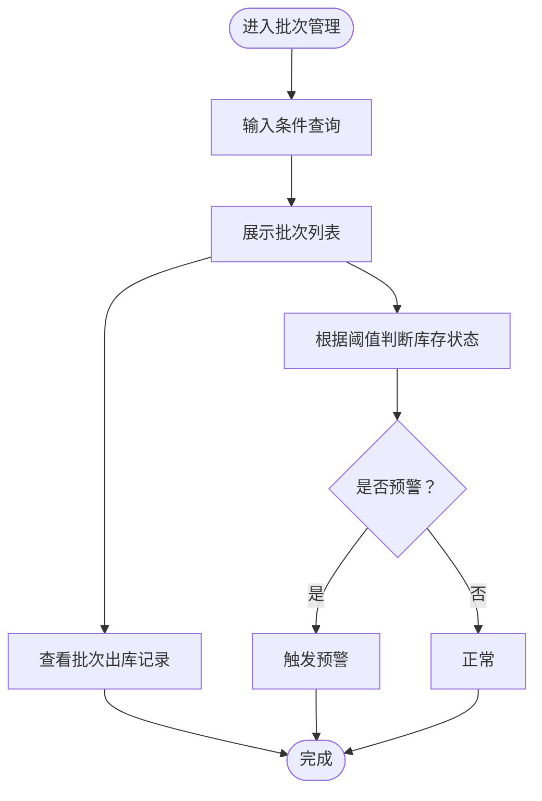
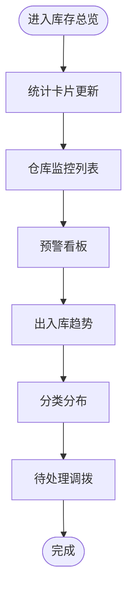
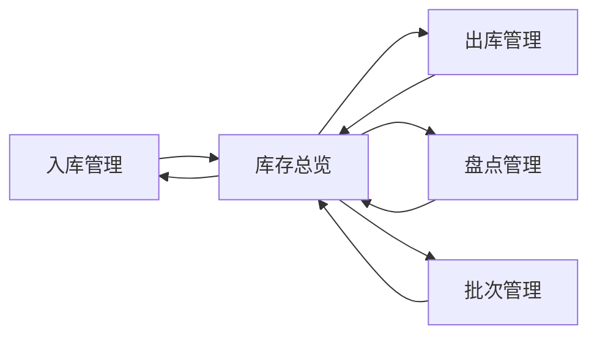

# 工程仓库存模块

<cite>
**本文引用的文件**
- [apps/pc/src/views/stock/check/index.vue](file://apps/pc/src/views/stock/check/index.vue)
- [apps/pc/src/views/warehouse/stock/in/index.vue](file://apps/pc/src/views/warehouse/stock/in/index.vue)
- [apps/pc/src/views/warehouse/stock/out/index.vue](file://apps/pc/src/views/warehouse/stock/out/index.vue)
- [apps/pc/src/views/warehouse/stock/batch/index.vue](file://apps/pc/src/views/warehouse/stock/batch/index.vue)
- [apps/pc/src/views/stock/overview/index.vue](file://apps/pc/src/views/stock/overview/index.vue)
</cite>

## 目录
1. [简介](#简介)
2. [项目结构](#项目结构)
3. [核心组件](#核心组件)
4. [架构总览](#架构总览)
5. [详细组件分析](#详细组件分析)
6. [依赖关系分析](#依赖关系分析)
7. [性能考量](#性能考量)
8. [故障排查指南](#故障排查指南)
9. [结论](#结论)
10. [附录](#附录)

## 简介
本文件面向工程仓库存模块，基于前端页面与交互逻辑，系统化梳理入库管理、出库管理、盘点管理、批次管理与库存总览等核心功能的业务流程与界面实现要点，并结合现有代码中的状态与字段定义，给出库存计算、状态标识、预警机制与成本核算的技术实现思路与最佳实践建议。文档同时提供可视化图示，帮助非技术读者理解整体运作方式。

## 项目结构
工程仓库存模块主要由以下页面构成：
- 入库管理：入库单列表与查询、入库审核
- 出库管理：出库单列表与查询、出库审核
- 盘点管理：盘点任务创建、盘点执行、审核与差异处理、盘点报告
- 批次管理：批次号管理、有效期跟踪、批次查询与出库明细
- 库存总览：仓库统计、预警与缺货提醒、出入库趋势、分类分布与待处理调拨

图表来源
- [apps/pc/src/views/warehouse/stock/in/index.vue:1-205](file://apps/pc/src/views/warehouse/stock/in/index.vue#L1-L205)
- [apps/pc/src/views/warehouse/stock/out/index.vue:1-199](file://apps/pc/src/views/warehouse/stock/out/index.vue#L1-L199)
- [apps/pc/src/views/stock/check/index.vue:1-452](file://apps/pc/src/views/stock/check/index.vue#L1-L452)
- [apps/pc/src/views/warehouse/stock/batch/index.vue:1-431](file://apps/pc/src/views/warehouse/stock/batch/index.vue#L1-L431)
- [apps/pc/src/views/stock/overview/index.vue:1-800](file://apps/pc/src/views/stock/overview/index.vue#L1-L800)

章节来源
- [apps/pc/src/views/warehouse/stock/in/index.vue:1-205](file://apps/pc/src/views/warehouse/stock/in/index.vue#L1-L205)
- [apps/pc/src/views/warehouse/stock/out/index.vue:1-199](file://apps/pc/src/views/warehouse/stock/out/index.vue#L1-L199)
- [apps/pc/src/views/stock/check/index.vue:1-452](file://apps/pc/src/views/stock/check/index.vue#L1-L452)
- [apps/pc/src/views/warehouse/stock/batch/index.vue:1-431](file://apps/pc/src/views/warehouse/stock/batch/index.vue#L1-L431)
- [apps/pc/src/views/stock/overview/index.vue:1-800](file://apps/pc/src/views/stock/overview/index.vue#L1-L800)

## 核心组件
- 入库管理组件：负责入库单的创建、查询、状态筛选、导出与审核入口；支持按入库类型与状态过滤。
- 出库管理组件：负责出库单的创建、查询、状态筛选、导出与审核入口；支持按出库类型与状态过滤。
- 盘点管理组件：负责盘点单的创建（全盘/抽盘）、查询、状态筛选、导出、开始/继续盘点、审核与差异处理。
- 批次管理组件：负责批次号查询、库存状态标识（充足/紧张/已出完）、入库/出库明细查看与导出。
- 库存总览组件：负责仓库统计、预警与缺货提醒、出入库趋势、分类分布、待处理调拨与容量使用率展示。

章节来源
- [apps/pc/src/views/warehouse/stock/in/index.vue:1-205](file://apps/pc/src/views/warehouse/stock/in/index.vue#L1-L205)
- [apps/pc/src/views/warehouse/stock/out/index.vue:1-199](file://apps/pc/src/views/warehouse/stock/out/index.vue#L1-L199)
- [apps/pc/src/views/stock/check/index.vue:1-452](file://apps/pc/src/views/stock/check/index.vue#L1-L452)
- [apps/pc/src/views/warehouse/stock/batch/index.vue:1-431](file://apps/pc/src/views/warehouse/stock/batch/index.vue#L1-L431)
- [apps/pc/src/views/stock/overview/index.vue:1-800](file://apps/pc/src/views/stock/overview/index.vue#L1-L800)

## 架构总览
工程仓库存模块采用“页面即功能”的前端架构，围绕“单据（入库/出库/盘点）+ 统计看板”的模式组织。页面间通过路由跳转与查询参数传递上下文，状态通过本地响应式数据维护，部分交互包含导出与弹窗确认。

图表来源
- [apps/pc/src/views/warehouse/stock/in/index.vue:1-205](file://apps/pc/src/views/warehouse/stock/in/index.vue#L1-L205)
- [apps/pc/src/views/warehouse/stock/out/index.vue:1-199](file://apps/pc/src/views/warehouse/stock/out/index.vue#L1-L199)
- [apps/pc/src/views/stock/check/index.vue:1-452](file://apps/pc/src/views/stock/check/index.vue#L1-L452)
- [apps/pc/src/views/warehouse/stock/batch/index.vue:1-431](file://apps/pc/src/views/warehouse/stock/batch/index.vue#L1-L431)
- [apps/pc/src/views/stock/overview/index.vue:1-800](file://apps/pc/src/views/stock/overview/index.vue#L1-L800)

## 详细组件分析

### 入库管理
- 功能要点
  - 列表：入库单号、入库类型、来源单号、供应商、仓库、数量、金额、状态、创建时间。
  - 查询：按入库单号、入库类型、状态筛选；支持导出。
  - 审核：对“待审核”状态的入库单进行审核通过。
  - 新增：跳转到入库单创建页。
- 关键状态与颜色
  - 类型：采购入库、退货入库、调拨入库；不同类型对应不同标签颜色。
  - 状态：待审核、已审核、已完成；不同状态对应不同标签颜色。
- 业务流程
  - 创建入库单 → 提交审核 → 审核通过 → 完成入库 → 更新库存与成本。

图表来源
- [apps/pc/src/views/warehouse/stock/in/index.vue:1-205](file://apps/pc/src/views/warehouse/stock/in/index.vue#L1-L205)

章节来源
- [apps/pc/src/views/warehouse/stock/in/index.vue:1-205](file://apps/pc/src/views/warehouse/stock/in/index.vue#L1-L205)

### 出库管理
- 功能要点
  - 列表：出库单号、出库类型、关联订单、客户、仓库、数量、金额、状态、创建时间。
  - 查询：按出库单号、出库类型、状态筛选；支持导出。
  - 审核：对“待审核”状态的出库单进行审核通过。
  - 新增：跳转到出库单创建页。
- 关键状态与颜色
  - 类型：销售出库、调拨出库、报废出库；不同类型对应不同标签颜色。
  - 状态：待审核、已审核、已完成；不同状态对应不同标签颜色。
- 业务流程
  - 创建出库单 → 提交审核 → 审核通过 → 完成出库 → 更新库存与成本。

图表来源
- [apps/pc/src/views/warehouse/stock/out/index.vue:1-199](file://apps/pc/src/views/warehouse/stock/out/index.vue#L1-L199)

章节来源
- [apps/pc/src/views/warehouse/stock/out/index.vue:1-199](file://apps/pc/src/views/warehouse/stock/out/index.vue#L1-L199)

### 盘点管理
- 功能要点
  - 列表：盘点单号、盘点仓库、盘点类型（全盘/抽盘）、商品数、盘盈/盘亏数量、差异金额、状态、创建人、创建时间。
  - 查询：按关键词、仓库、状态、日期范围筛选；支持导出。
  - 操作：查看详情、开始/继续盘点、审核（通过/驳回）。
  - 审核：展示差异明细（商品名称、账面数量、实盘数量、差异、差异原因），支持审核意见与备注。
- 关键状态与颜色
  - 状态：待盘点、盘点中、待审核、已完成；不同状态对应不同标签颜色。
- 业务流程
  - 创建盘点单（全盘/抽盘） → 开始/继续盘点 → 填写差异与原因 → 提交审核 → 审核通过/驳回 → 调整库存并生成报告。

图表来源
- [apps/pc/src/views/stock/check/index.vue:1-452](file://apps/pc/src/views/stock/check/index.vue#L1-L452)

章节来源
- [apps/pc/src/views/stock/check/index.vue:1-452](file://apps/pc/src/views/stock/check/index.vue#L1-L452)

### 批次管理
- 功能要点
  - 列表：批次号、商品编码/名称/规格/单位、入库日期/生产日期、入库数量、当前库存、已出库数量、批次批注、入库单号、库存状态、操作（查看商品/出库记录）。
  - 查询：按批次号、商品名、入库日期、库存状态、仓库筛选；支持导出。
  - 明细：弹窗展示批次出库记录（出库单号、时间、数量、类型、关联订单、客户/仓库、操作人）。
- 库存状态标识
  - 当前库存=0：已出完
  - 当前库存<入库数量×0.3：库存紧张
  - 否则：库存充足
- 业务流程
  - 查询批次 → 查看出库明细 → 根据库存状态触发预警或补货。

图表来源
- [apps/pc/src/views/warehouse/stock/batch/index.vue:1-431](file://apps/pc/src/views/warehouse/stock/batch/index.vue#L1-L431)

章节来源
- [apps/pc/src/views/warehouse/stock/batch/index.vue:1-431](file://apps/pc/src/views/warehouse/stock/batch/index.vue#L1-L431)

### 库存总览
- 功能要点
  - 统计卡片：仓库总数、商品种类、总库存量（可用/锁定）、库存总价值、日均周转、预警商品、缺货商品。
  - 各仓库库存监控：仓库名称/类型/负责人、容量使用率、商品种类、库存总量/价值、周转天数、预警/缺货数量、状态与操作。
  - 预警看板：按级别显示预警信息（警告/危险/提示），支持快速跳转处理。
  - 出入库趋势：近7天入库/出库趋势与周度汇总。
  - 分类分布：按品类展示库存数量与价值占比及预警数量。
  - 待处理调拨：展示调拨申请，支持审批入口。
- 业务流程
  - 数据聚合 → 统计指标计算 → 可视化展示 → 触发预警与调拨审批。

图表来源
- [apps/pc/src/views/stock/overview/index.vue:1-800](file://apps/pc/src/views/stock/overview/index.vue#L1-L800)

章节来源
- [apps/pc/src/views/stock/overview/index.vue:1-800](file://apps/pc/src/views/stock/overview/index.vue#L1-L800)

## 依赖关系分析
- 页面内聚性
  - 各功能页相对独立，职责清晰：入库/出库/盘点/批次/总览分别对应不同的业务域。
- 交互耦合
  - 总览页作为中枢，汇聚入库/出库/盘点/批次的数据维度，形成统一的预警与决策依据。
- 状态与字段映射
  - 类型/状态/颜色映射集中于各组件内部，便于扩展与维护。
- 外部依赖
  - 使用 Arco Design UI 组件库进行表格、表单、标签、按钮等基础控件渲染。

图表来源
- [apps/pc/src/views/warehouse/stock/in/index.vue:1-205](file://apps/pc/src/views/warehouse/stock/in/index.vue#L1-L205)
- [apps/pc/src/views/warehouse/stock/out/index.vue:1-199](file://apps/pc/src/views/warehouse/stock/out/index.vue#L1-L199)
- [apps/pc/src/views/stock/check/index.vue:1-452](file://apps/pc/src/views/stock/check/index.vue#L1-L452)
- [apps/pc/src/views/warehouse/stock/batch/index.vue:1-431](file://apps/pc/src/views/warehouse/stock/batch/index.vue#L1-L431)
- [apps/pc/src/views/stock/overview/index.vue:1-800](file://apps/pc/src/views/stock/overview/index.vue#L1-L800)

章节来源
- [apps/pc/src/views/warehouse/stock/in/index.vue:1-205](file://apps/pc/src/views/warehouse/stock/in/index.vue#L1-L205)
- [apps/pc/src/views/warehouse/stock/out/index.vue:1-199](file://apps/pc/src/views/warehouse/stock/out/index.vue#L1-L199)
- [apps/pc/src/views/stock/check/index.vue:1-452](file://apps/pc/src/views/stock/check/index.vue#L1-L452)
- [apps/pc/src/views/warehouse/stock/batch/index.vue:1-431](file://apps/pc/src/views/warehouse/stock/batch/index.vue#L1-L431)
- [apps/pc/src/views/stock/overview/index.vue:1-800](file://apps/pc/src/views/stock/overview/index.vue#L1-L800)

## 性能考量
- 列表分页与虚拟滚动
  - 对于长列表（如批次、仓库监控），建议引入分页或虚拟滚动以降低 DOM 渲染压力。
- 过滤与搜索
  - 将本地过滤改为服务端分页查询，减少前端计算开销。
- 图表渲染
  - 趋势图与进度条建议按需渲染，避免频繁重绘。
- 状态缓存
  - 将常用状态（如仓库列表、类型/状态枚举）缓存至全局状态，减少重复请求与计算。

## 故障排查指南
- 入库/出库单无法导出
  - 检查列表是否为空；若为空应提示“暂无数据可导出”，并阻断导出流程。
- 审核失败
  - “待审核”状态下才允许审核；若状态不符，应提示并阻止提交。
- 盘点单创建失败
  - 全盘无需选择商品；抽盘必须至少选择一个商品；否则提示并阻止提交。
- 批次查询异常
  - 确保日期范围与状态筛选条件正确；若无匹配结果，应提示并更新分页总数。
- 预警与缺货跳转
  - 点击“立即处理/紧急补货”应跳转至相应列表页；确保路由参数正确传递。

章节来源
- [apps/pc/src/views/warehouse/stock/in/index.vue:167-184](file://apps/pc/src/views/warehouse/stock/in/index.vue#L167-L184)
- [apps/pc/src/views/warehouse/stock/out/index.vue:164-178](file://apps/pc/src/views/warehouse/stock/out/index.vue#L164-L178)
- [apps/pc/src/views/stock/check/index.vue:353-428](file://apps/pc/src/views/stock/check/index.vue#L353-L428)
- [apps/pc/src/views/warehouse/stock/batch/index.vue:355-400](file://apps/pc/src/views/warehouse/stock/batch/index.vue#L355-L400)
- [apps/pc/src/views/stock/overview/index.vue:592-646](file://apps/pc/src/views/stock/overview/index.vue#L592-L646)

## 结论
工程仓库存模块通过“单据+看板”的前端架构实现了从入库、出库、盘点到批次与总览的闭环管理。现有页面具备完善的查询、筛选、导出与审核能力，配合库存状态与预警机制，能够有效支撑工程项目的物资管理。建议后续在数据层引入服务端分页与缓存、完善成本核算与批次有效期跟踪、增强移动端适配与自动化提醒，以进一步提升稳定性与用户体验。

## 附录

### 技术实现要点与最佳实践
- 库存计算公式（基于现有字段）
  - 当前库存 = 入库数量 - 出库数量（按批次/商品维度）
  - 可用库存 = 当前库存 - 锁定库存
  - 库存总价值 = 库存数量 × 成本单价（建议在单据中维护单价与金额字段）
- 库存状态标识
  - 已出完：当前库存 = 0
  - 库存紧张：当前库存 < 入库数量 × 0.3
  - 库存充足：其他情况
- 库存预警机制
  - 预警商品：库存低于安全库存的品类/商品集合
  - 缺货商品：库存为0的品类/商品集合
  - 告警级别：按严重程度分级（危险/警告/提示），并提供快速处理入口
- 库存成本核算
  - 建议在入库单中维护单价与金额字段，出库单中同步成本结转，总览页展示库存总价值与日均周转
- 调拨管理
  - 发起调拨时校验调出/调入仓库、商品与原因必填；审批通过后生成调拨单并更新库存