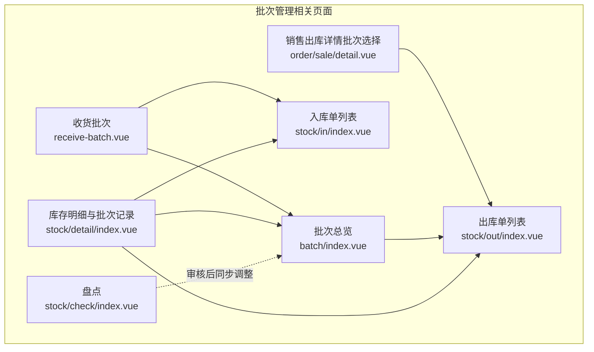
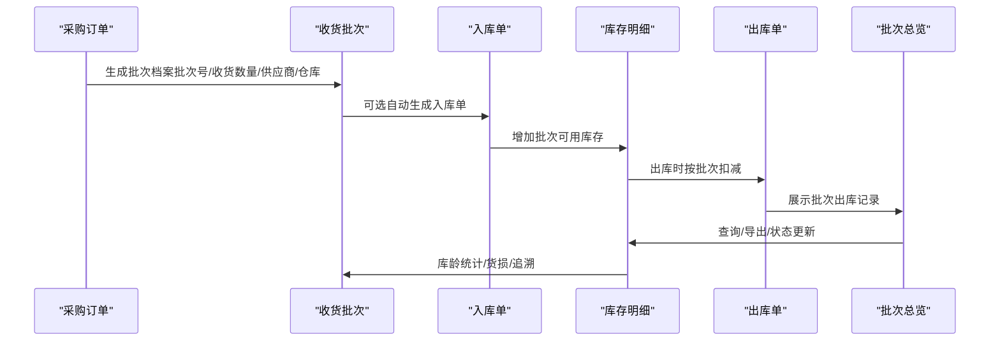
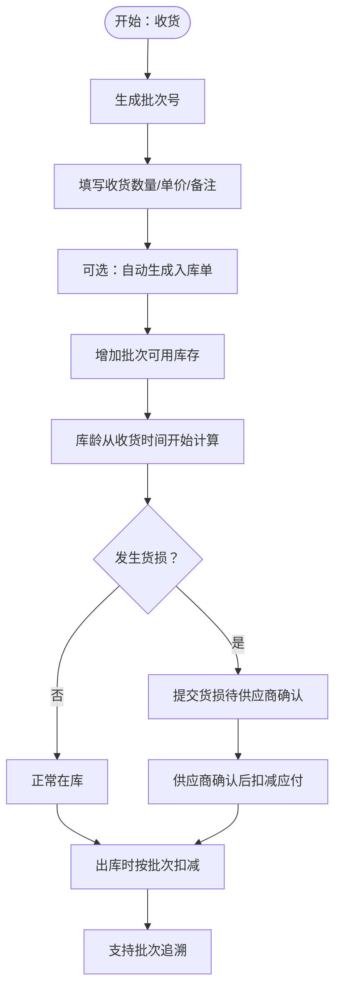
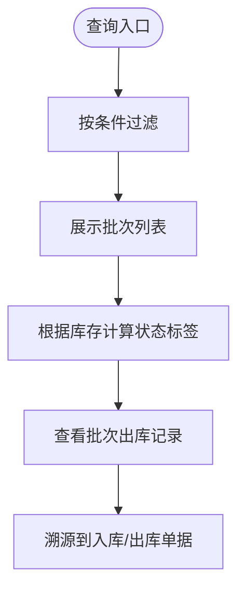
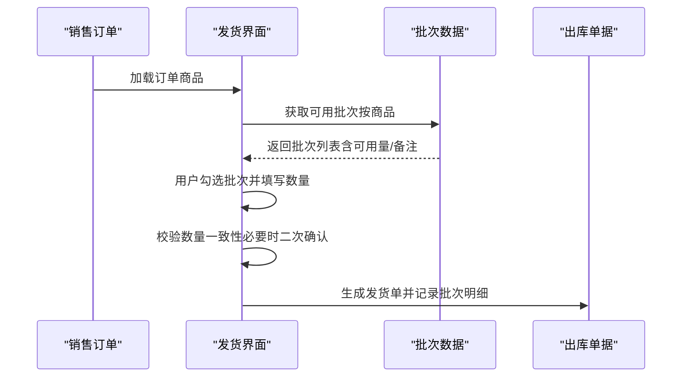
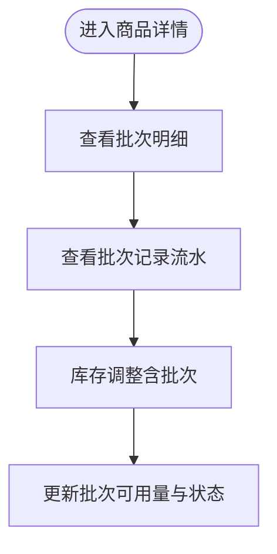
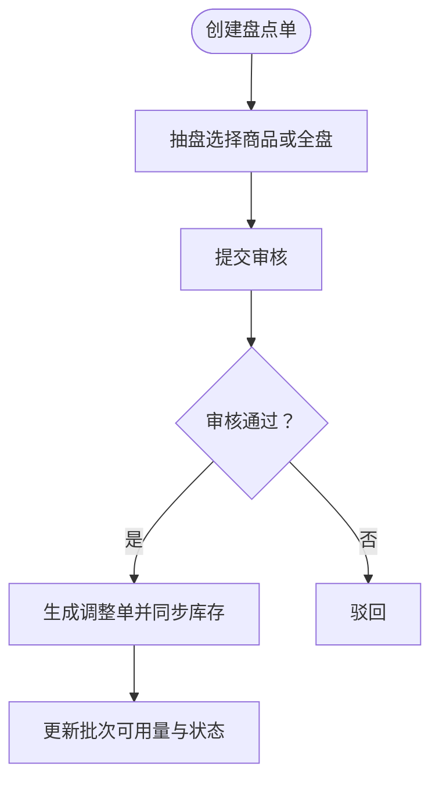
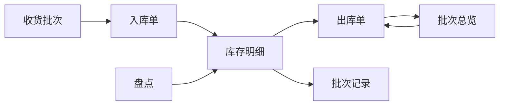

# 批次管理

<cite>
**本文引用的文件**
- [apps/pc/src/views/warehouse/stock/batch/index.vue](file://apps/pc/src/views/warehouse/stock/batch/index.vue)
- [apps/pc/src/views/warehouse/stock/receive-batch.vue](file://apps/pc/src/views/warehouse/stock/receive-batch.vue)
- [apps/pc/src/views/warehouse/order/sale/detail.vue](file://apps/pc/src/views/warehouse/order/sale/detail.vue)
- [apps/pc/src/views/warehouse/stock/in/index.vue](file://apps/pc/src/views/warehouse/stock/in/index.vue)
- [apps/pc/src/views/warehouse/stock/out/index.vue](file://apps/pc/src/views/warehouse/stock/out/index.vue)
- [apps/pc/src/views/warehouse/stock/check/index.vue](file://apps/pc/src/views/warehouse/stock/check/index.vue)
- [apps/pc/src/views/stock/detail/index.vue](file://apps/pc/src/views/stock/detail/index.vue)
</cite>

## 目录
1. [简介](#简介)
2. [项目结构](#项目结构)
3. [核心组件](#核心组件)
4. [架构总览](#架构总览)
5. [详细组件分析](#详细组件分析)
6. [依赖分析](#依赖分析)
7. [性能考虑](#性能考虑)
8. [故障排查指南](#故障排查指南)
9. [结论](#结论)
10. [附录](#附录)

## 简介
本文件面向工程仓批次管理功能，系统性阐述批次号生成规则、批次信息维护、有效期与库龄管理、批次查询与追溯、批次与库存的关联关系、批次状态实时更新、批次过期预警机制、批次转储与合并操作，并说明其在库存准确性保障、质量追溯、成本核算中的作用。同时提供操作指南与最佳实践，帮助运营与仓储人员高效、规范地使用批次管理体系。

## 项目结构
工程仓批次管理相关页面主要集中在 PC 端“仓库”与“库存”视图中，围绕“收货批次”“批次总览”“销售出库批次选择”“入库/出库单据”“库存明细与批次记录”“盘点”等模块展开，形成完整的批次全生命周期闭环。

图表来源
- [apps/pc/src/views/warehouse/stock/receive-batch.vue:1-691](file://apps/pc/src/views/warehouse/stock/receive-batch.vue#L1-L691)
- [apps/pc/src/views/warehouse/stock/batch/index.vue:1-431](file://apps/pc/src/views/warehouse/stock/batch/index.vue#L1-L431)
- [apps/pc/src/views/warehouse/order/sale/detail.vue:1-633](file://apps/pc/src/views/warehouse/order/sale/detail.vue#L1-L633)
- [apps/pc/src/views/warehouse/stock/in/index.vue:1-205](file://apps/pc/src/views/warehouse/stock/in/index.vue#L1-L205)
- [apps/pc/src/views/warehouse/stock/out/index.vue:1-199](file://apps/pc/src/views/warehouse/stock/out/index.vue#L1-L199)
- [apps/pc/src/views/stock/detail/index.vue:1-1135](file://apps/pc/src/views/stock/detail/index.vue#L1-L1135)
- [apps/pc/src/views/warehouse/stock/check/index.vue:1-451](file://apps/pc/src/views/warehouse/stock/check/index.vue#L1-L451)

章节来源
- [apps/pc/src/views/warehouse/stock/receive-batch.vue:1-691](file://apps/pc/src/views/warehouse/stock/receive-batch.vue#L1-L691)
- [apps/pc/src/views/warehouse/stock/batch/index.vue:1-431](file://apps/pc/src/views/warehouse/stock/batch/index.vue#L1-L431)
- [apps/pc/src/views/warehouse/order/sale/detail.vue:1-633](file://apps/pc/src/views/warehouse/order/sale/detail.vue#L1-L633)
- [apps/pc/src/views/warehouse/stock/in/index.vue:1-205](file://apps/pc/src/views/warehouse/stock/in/index.vue#L1-L205)
- [apps/pc/src/views/warehouse/stock/out/index.vue:1-199](file://apps/pc/src/views/warehouse/stock/out/index.vue#L1-L199)
- [apps/pc/src/views/stock/detail/index.vue:1-1135](file://apps/pc/src/views/stock/detail/index.vue#L1-L1135)
- [apps/pc/src/views/warehouse/stock/check/index.vue:1-451](file://apps/pc/src/views/warehouse/stock/check/index.vue#L1-L451)

## 核心组件
- 收货批次（receive-batch.vue）
  - 功能要点：批次档案建立、批次号生成、库龄监控、库存跟踪、货损退货、统计看板、追溯链路展示。
  - 关键流程：选择采购订单→生成批次号→填写收货数量→自动生成入库单（可选）→记录批次状态与库存。
- 批次总览（batch/index.vue）
  - 功能要点：按批次号/商品名/入库日期/库存状态/仓库筛选；查看批次出库记录；导出。
  - 关键流程：查询过滤→展示批次列表→点击“出库记录”弹窗查看销售/调拨出库明细。
- 销售出库批次选择（order/sale/detail.vue）
  - 功能要点：按订单商品维度展示可用批次，支持多批次组合发货，校验发货数量一致性。
  - 关键流程：进入发货流程→加载商品对应批次→勾选批次并填写发货数量→生成发货单。
- 入库/出库单据（stock/in/index.vue、stock/out/index.vue）
  - 功能要点：入库/出库单据列表与状态管理，支撑批次库存变动的凭证化。
- 库存明细与批次记录（stock/detail/index.vue）
  - 功能要点：商品维度查看批次明细、批次可用数量、批次状态、批次记录流水。
- 盘点（stock/check/index.vue）
  - 功能要点：创建盘点单→抽盘/全盘→审核通过后同步库存调整，影响批次可用量与状态。

章节来源
- [apps/pc/src/views/warehouse/stock/receive-batch.vue:1-691](file://apps/pc/src/views/warehouse/stock/receive-batch.vue#L1-L691)
- [apps/pc/src/views/warehouse/stock/batch/index.vue:1-431](file://apps/pc/src/views/warehouse/stock/batch/index.vue#L1-L431)
- [apps/pc/src/views/warehouse/order/sale/detail.vue:1-633](file://apps/pc/src/views/warehouse/order/sale/detail.vue#L1-L633)
- [apps/pc/src/views/warehouse/stock/in/index.vue:1-205](file://apps/pc/src/views/warehouse/stock/in/index.vue#L1-L205)
- [apps/pc/src/views/warehouse/stock/out/index.vue:1-199](file://apps/pc/src/views/warehouse/stock/out/index.vue#L1-L199)
- [apps/pc/src/views/stock/detail/index.vue:1-1135](file://apps/pc/src/views/stock/detail/index.vue#L1-L1135)
- [apps/pc/src/views/warehouse/stock/check/index.vue:1-451](file://apps/pc/src/views/warehouse/stock/check/index.vue#L1-L451)

## 架构总览
批次管理以“收货→入库→出库→盘点/调整”的主路径为核心，辅以“批次查询/追溯/预警/统计看板”，形成闭环。

图表来源
- [apps/pc/src/views/warehouse/stock/receive-batch.vue:1-691](file://apps/pc/src/views/warehouse/stock/receive-batch.vue#L1-L691)
- [apps/pc/src/views/warehouse/stock/in/index.vue:1-205](file://apps/pc/src/views/warehouse/stock/in/index.vue#L1-L205)
- [apps/pc/src/views/warehouse/stock/out/index.vue:1-199](file://apps/pc/src/views/warehouse/stock/out/index.vue#L1-L199)
- [apps/pc/src/views/warehouse/stock/batch/index.vue:1-431](file://apps/pc/src/views/warehouse/stock/batch/index.vue#L1-L431)
- [apps/pc/src/views/stock/detail/index.vue:1-1135](file://apps/pc/src/views/stock/detail/index.vue#L1-L1135)

## 详细组件分析

### 组件A：收货批次（批次档案与库龄监控）
- 批次号生成规则
  - 规则：基于日期与随机数拼接，形如“BYYYYMMDDXXXX”，确保唯一性与可读性。
  - 实现位置：生成函数负责拼接年月日与四位随机数。
- 库龄监控与状态
  - 库龄从收货时间开始计算；在界面中以“在库/耗尽”状态标识当前批次是否仍有库存。
  - 统计看板包含“有效批次/30天内/超90天/批次追溯率”，用于质量与库存健康度评估。
- 货损退货
  - 提交货损后进入“待供应商确认”状态，确认后自动扣减应付金额，形成闭环。
- 业务规则
  - 每一次收货生成唯一批次号；批次号贯穿库存全生命周期；出库必须指定批次，实现先进先出。

图表来源
- [apps/pc/src/views/warehouse/stock/receive-batch.vue:470-556](file://apps/pc/src/views/warehouse/stock/receive-batch.vue#L470-L556)
- [apps/pc/src/views/warehouse/stock/receive-batch.vue:574-606](file://apps/pc/src/views/warehouse/stock/receive-batch.vue#L574-L606)

章节来源
- [apps/pc/src/views/warehouse/stock/receive-batch.vue:1-691](file://apps/pc/src/views/warehouse/stock/receive-batch.vue#L1-L691)

### 组件B：批次总览（查询、状态与出库记录）
- 查询能力
  - 支持按批次号、商品名称/编码、入库日期区间、库存状态（充足/紧张/已出完）、仓库筛选。
- 状态与颜色
  - 当前库存为0显示“已出完”；低于阈值显示“库存紧张”；否则“库存充足”。
- 出库记录
  - 点击“出库记录”弹窗，展示销售/调拨出库明细，便于追溯。

图表来源
- [apps/pc/src/views/warehouse/stock/batch/index.vue:303-343](file://apps/pc/src/views/warehouse/stock/batch/index.vue#L303-L343)
- [apps/pc/src/views/warehouse/stock/batch/index.vue:285-301](file://apps/pc/src/views/warehouse/stock/batch/index.vue#L285-L301)
- [apps/pc/src/views/warehouse/stock/batch/index.vue:377-400](file://apps/pc/src/views/warehouse/stock/batch/index.vue#L377-L400)

章节来源
- [apps/pc/src/views/warehouse/stock/batch/index.vue:1-431](file://apps/pc/src/views/warehouse/stock/batch/index.vue#L1-L431)

### 组件C：销售出库批次选择（先进先出与差异提示）
- 批次选择
  - 按订单商品维度展示可用批次，支持勾选多个批次并分别填写发货数量。
- 先进先出策略
  - 界面默认优先推荐旧批次（入库日期早），便于执行先进先出。
- 差异提示
  - 若所选批次数量与待发货数量不一致，弹出二次确认，避免错发漏发。

图表来源
- [apps/pc/src/views/warehouse/order/sale/detail.vue:416-429](file://apps/pc/src/views/warehouse/order/sale/detail.vue#L416-L429)
- [apps/pc/src/views/warehouse/order/sale/detail.vue:431-485](file://apps/pc/src/views/warehouse/order/sale/detail.vue#L431-L485)
- [apps/pc/src/views/warehouse/order/sale/detail.vue:493-575](file://apps/pc/src/views/warehouse/order/sale/detail.vue#L493-L575)

章节来源
- [apps/pc/src/views/warehouse/order/sale/detail.vue:1-633](file://apps/pc/src/views/warehouse/order/sale/detail.vue#L1-L633)

### 组件D：库存明细与批次记录（批次可用量与状态）
- 批次明细
  - 展示批次编号、入库日期、批注、入库数量、已出库、可用数量、状态、备注。
- 批次记录
  - 记录入库/出库/调整等流水，便于审计与追溯。
- 库位与安全库存
  - 支持设置库位与安全库存，结合批次可用量进行预警。

图表来源
- [apps/pc/src/views/stock/detail/index.vue:337-387](file://apps/pc/src/views/stock/detail/index.vue#L337-L387)
- [apps/pc/src/views/stock/detail/index.vue:389-439](file://apps/pc/src/views/stock/detail/index.vue#L389-L439)
- [apps/pc/src/views/stock/detail/index.vue:253-280](file://apps/pc/src/views/stock/detail/index.vue#L253-L280)

章节来源
- [apps/pc/src/views/stock/detail/index.vue:1-1135](file://apps/pc/src/views/stock/detail/index.vue#L1-L1135)

### 组件E：盘点与批次调整（审核后同步）
- 创建盘点单
  - 支持全盘/抽盘两种模式，抽盘需选择具体商品。
- 审核通过
  - 审核通过后自动生成出入库调整记录，同步更新批次可用量与状态。
- 对批次的影响
  - 盘点盈亏直接影响各批次可用量，进而影响后续出库与先进先出策略。

图表来源
- [apps/pc/src/views/warehouse/stock/check/index.vue:362-396](file://apps/pc/src/views/warehouse/stock/check/index.vue#L362-L396)
- [apps/pc/src/views/warehouse/stock/check/index.vue:402-426](file://apps/pc/src/views/warehouse/stock/check/index.vue#L402-L426)

章节来源
- [apps/pc/src/views/warehouse/stock/check/index.vue:1-451](file://apps/pc/src/views/warehouse/stock/check/index.vue#L1-L451)

## 依赖分析
- 页面耦合关系
  - 收货批次与入库单：收货→入库，支撑批次可用库存增长。
  - 销售出库与批次总览：出库→批次可用量减少，批次总览提供追溯与状态展示。
  - 库存明细与批次记录：商品维度的批次明细与流水，支撑审计与问题定位。
  - 盘点与批次：盘点审核后同步调整，影响批次可用量。
- 外部依赖
  - 单据类型（采购入库、退货入库、调拨入库、销售出库、调拨出库、报废出库）作为批次变动的凭证来源。
  - 仓库与供应商信息作为批次来源与去向的上下文。

图表来源
- [apps/pc/src/views/warehouse/stock/receive-batch.vue:1-691](file://apps/pc/src/views/warehouse/stock/receive-batch.vue#L1-L691)
- [apps/pc/src/views/warehouse/stock/in/index.vue:1-205](file://apps/pc/src/views/warehouse/stock/in/index.vue#L1-L205)
- [apps/pc/src/views/warehouse/stock/out/index.vue:1-199](file://apps/pc/src/views/warehouse/stock/out/index.vue#L1-L199)
- [apps/pc/src/views/warehouse/stock/batch/index.vue:1-431](file://apps/pc/src/views/warehouse/stock/batch/index.vue#L1-L431)
- [apps/pc/src/views/stock/detail/index.vue:1-1135](file://apps/pc/src/views/stock/detail/index.vue#L1-L1135)
- [apps/pc/src/views/warehouse/stock/check/index.vue:1-451](file://apps/pc/src/views/warehouse/stock/check/index.vue#L1-L451)

章节来源
- [apps/pc/src/views/warehouse/stock/in/index.vue:1-205](file://apps/pc/src/views/warehouse/stock/in/index.vue#L1-L205)
- [apps/pc/src/views/warehouse/stock/out/index.vue:1-199](file://apps/pc/src/views/warehouse/stock/out/index.vue#L1-L199)
- [apps/pc/src/views/warehouse/stock/batch/index.vue:1-431](file://apps/pc/src/views/warehouse/stock/batch/index.vue#L1-L431)
- [apps/pc/src/views/stock/detail/index.vue:1-1135](file://apps/pc/src/views/stock/detail/index.vue#L1-L1135)
- [apps/pc/src/views/warehouse/stock/check/index.vue:1-451](file://apps/pc/src/views/warehouse/stock/check/index.vue#L1-L451)

## 性能考虑
- 列表查询优化
  - 批次总览与出入库单据采用前端分页与条件过滤，建议控制每页条数与查询字段，避免大数据量下的渲染压力。
- 批次选择交互
  - 销售出库批次选择采用折叠面板与分组，建议限制每组批次数量，避免过多批次导致渲染卡顿。
- 库龄与状态计算
  - 库龄计算与状态标签渲染应尽量在前端缓存结果，减少重复计算。
- 数据导出
  - 批次导出与单据导出需限制一次性导出的数据量，建议分页或分批次导出。

## 故障排查指南
- 批次号冲突或重复
  - 现象：生成批次号重复。
  - 排查：检查生成逻辑中的日期与随机数拼接是否正确，确认随机数位数与日期格式。
  - 参考位置：批次号生成函数。
- 出库数量与待发货数量不一致
  - 现象：发货界面提示差异。
  - 排查：确认用户是否按批次分别填写数量，是否触发二次确认。
  - 参考位置：发货提交校验与提示。
- 货损退货未生效
  - 现象：货损提交后状态未更新或金额未扣减。
  - 排查：确认货损表单必填项是否完整，供应商确认流程是否完成。
  - 参考位置：货损提交与状态更新。
- 盘点审核后库存未同步
  - 现象：盘点通过但批次可用量未变化。
  - 排查：确认审核意见是否填写，调整单是否生成并执行。
  - 参考位置：盘点审核与同步逻辑。

章节来源
- [apps/pc/src/views/warehouse/stock/receive-batch.vue:574-606](file://apps/pc/src/views/warehouse/stock/receive-batch.vue#L574-L606)
- [apps/pc/src/views/warehouse/order/sale/detail.vue:505-518](file://apps/pc/src/views/warehouse/order/sale/detail.vue#L505-L518)
- [apps/pc/src/views/warehouse/stock/check/index.vue:409-426](file://apps/pc/src/views/warehouse/stock/check/index.vue#L409-L426)

## 结论
工程仓批次管理通过“收货→入库→出库→盘点/调整”的闭环流程，实现了批次档案建立、库龄与状态可视化、先进先出执行、质量追溯与统计看板。配合批次总览与库存明细，能够显著提升库存准确性、保障质量可追溯、辅助成本核算与供应链协同。建议在日常运营中严格执行批次号生成规则、批次出库必选、定期盘点与异常处理流程，持续优化批次管理效率与数据质量。

## 附录
- 操作指南（概述）
  - 收货批次：选择采购订单→生成批次号→填写收货数量→可选自动生成入库单→查看批次状态与统计看板。
  - 批次总览：按批次号/商品/入库日期/库存状态/仓库查询→查看批次出库记录→导出。
  - 销售出库：进入发货流程→勾选批次并填写数量→校验数量一致性→生成发货单。
  - 库存明细：查看批次明细与批次记录→进行库存调整→设置安全库存与库位。
  - 盘点：创建盘点单→抽盘/全盘→审核通过后同步调整。
- 最佳实践
  - 批次号生成：统一规则，避免手写冲突；批次批注清晰，便于识别。
  - 先进先出：优先推荐旧批次，定期检查库龄与预警。
  - 货损处理：及时提交并跟进供应商确认，确保账实一致。
  - 盘点：定期全盘，抽盘重点覆盖高风险/高价值商品；审核严格把关。
  - 追溯：任何出入库均保留批次信息，确保问题可定位、责任可追溯。