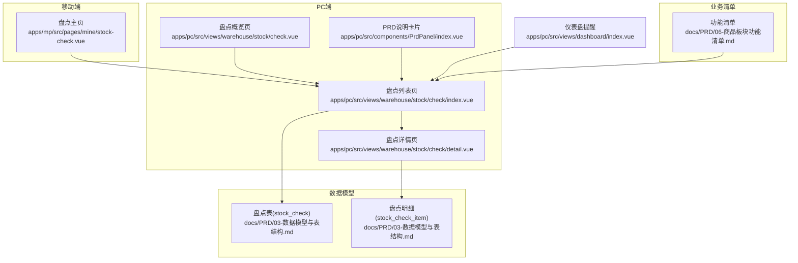
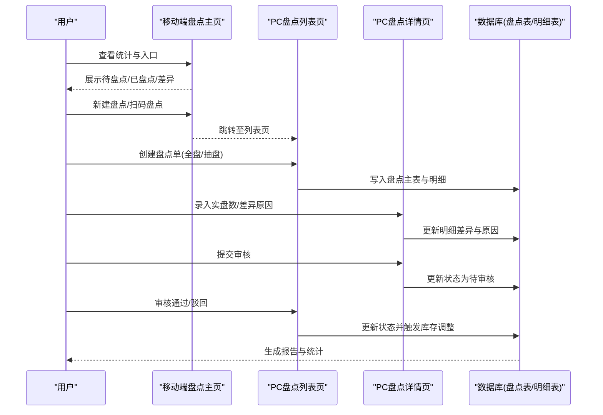
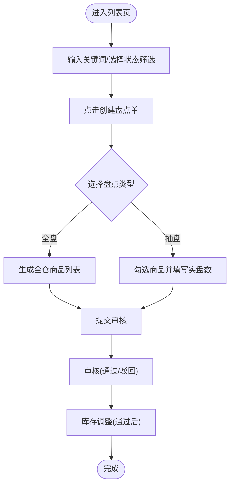
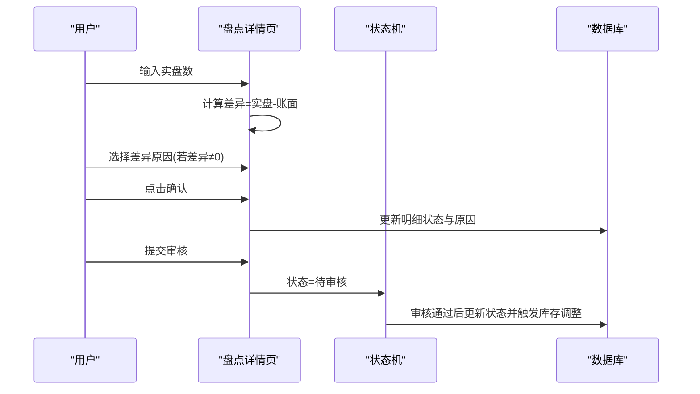
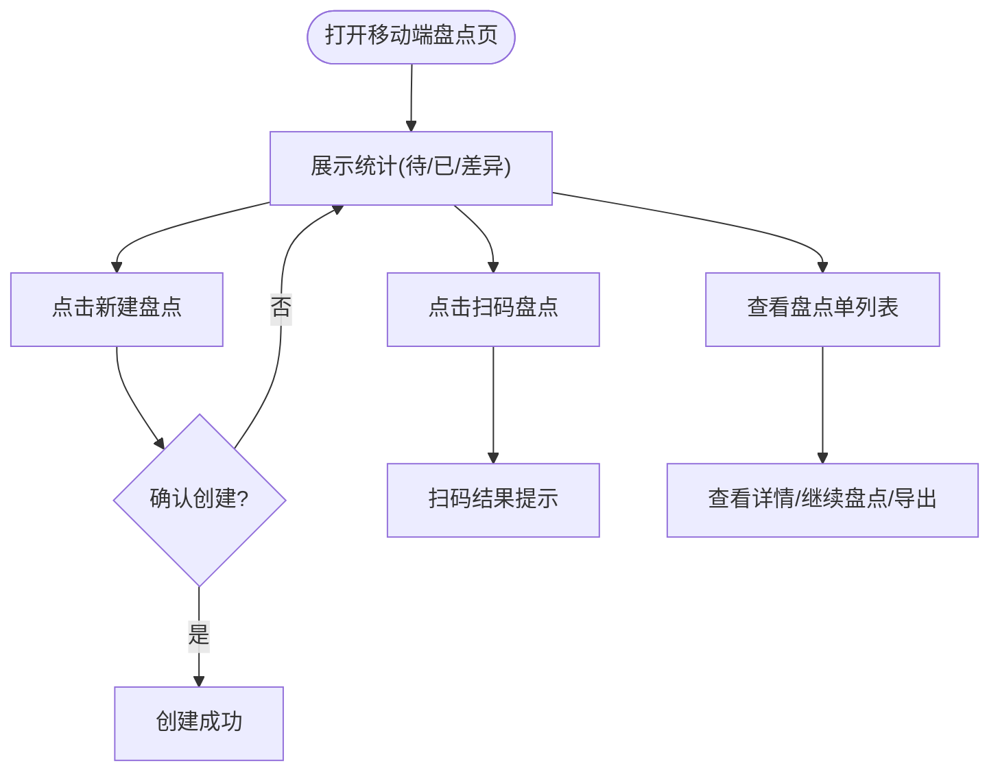
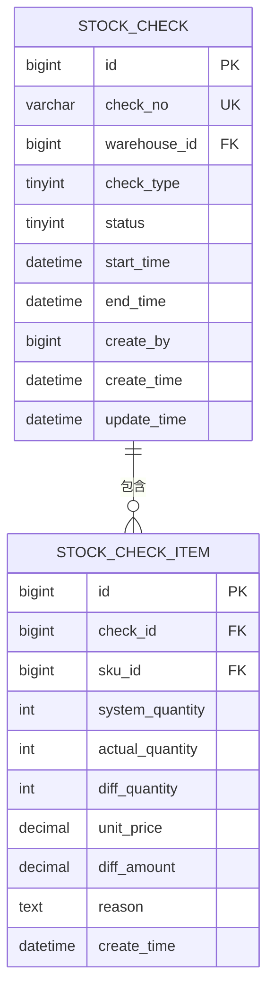
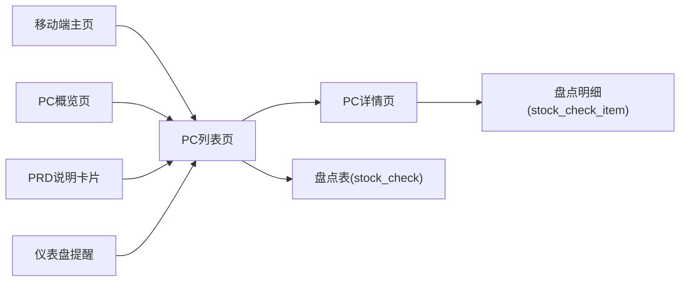

# 盘点管理

<cite>
**本文引用的文件**
- [apps/pc/src/views/warehouse/stock/check/index.vue](file://apps/pc/src/views/warehouse/stock/check/index.vue)
- [apps/pc/src/views/warehouse/stock/check/detail.vue](file://apps/pc/src/views/warehouse/stock/check/detail.vue)
- [apps/pc/src/views/warehouse/stock/check.vue](file://apps/pc/src/views/warehouse/stock/check.vue)
- [apps/mp/src/pages/mine/stock-check.vue](file://apps/mp/src/pages/mine/stock-check.vue)
- [docs/PRD/03-数据模型与表结构.md](file://docs/PRD/03-数据模型与表结构.md)
- [docs/PRD/06-商品板块功能清单.md](file://docs/PRD/06-商品板块功能清单.md)
- [apps/pc/src/components/PrdPanel/index.vue](file://apps/pc/src/components/PrdPanel/index.vue)
- [apps/pc/src/views/dashboard/index.vue](file://apps/pc/src/views/dashboard/index.vue)
</cite>

## 目录
1. [简介](#简介)
2. [项目结构](#项目结构)
3. [核心组件](#核心组件)
4. [架构总览](#架构总览)
5. [详细组件分析](#详细组件分析)
6. [依赖关系分析](#依赖关系分析)
7. [性能考量](#性能考量)
8. [故障排查指南](#故障排查指南)
9. [结论](#结论)
10. [附录](#附录)

## 简介
本文件围绕工程仓“盘点管理”功能，系统化梳理从盘点任务创建、盘点计划制定、执行过程监控、差异处理到报告生成与分析的完整业务闭环，并结合前端页面与数据模型，给出可落地的技术实现要点、最佳实践与质量控制方案。内容覆盖：
- 盘点类型与范围：全盘、抽盘；按仓库、品类、库位筛选
- 盘点流程：创建盘点单 → 录入实盘数 → 系统对账 → 审核确认 → 差异处理与库存调整
- 差异分析与处理：盘盈盘亏自动计算、差异原因、财务过账联动
- 报告与分析：盘点准确率、差异金额、SKU差异数统计
- 算法与成本：差异计算、库存准确性校验、成本核算思路
- 最佳实践与质量控制：冻结出入库、差异必填、多级审核、报表导出

## 项目结构
盘点管理功能主要由以下页面与组件构成：
- PC端：盘点首页、盘点详情页、PRD说明卡片
- 移动端：盘点主页（含统计、新建、扫码、导出）
- 数据模型：盘点主表与明细表
- 业务清单：功能点与交互说明

**图表来源**
- [apps/pc/src/views/warehouse/stock/check/index.vue:1-451](file://apps/pc/src/views/warehouse/stock/check/index.vue#L1-L451)
- [apps/pc/src/views/warehouse/stock/check/detail.vue:1-279](file://apps/pc/src/views/warehouse/stock/check/detail.vue#L1-L279)
- [apps/pc/src/views/warehouse/stock/check.vue:1-289](file://apps/pc/src/views/warehouse/stock/check.vue#L1-L289)
- [apps/mp/src/pages/mine/stock-check.vue:1-441](file://apps/mp/src/pages/mine/stock-check.vue#L1-L441)
- [docs/PRD/03-数据模型与表结构.md:592-620](file://docs/PRD/03-数据模型与表结构.md#L592-L620)
- [docs/PRD/06-商品板块功能清单.md:151-162](file://docs/PRD/06-商品板块功能清单.md#L151-L162)
- [apps/pc/src/components/PrdPanel/index.vue:288-308](file://apps/pc/src/components/PrdPanel/index.vue#L288-L308)
- [apps/pc/src/views/dashboard/index.vue:106-106](file://apps/pc/src/views/dashboard/index.vue#L106-L106)

**章节来源**
- [apps/pc/src/views/warehouse/stock/check/index.vue:1-451](file://apps/pc/src/views/warehouse/stock/check/index.vue#L1-L451)
- [apps/pc/src/views/warehouse/stock/check/detail.vue:1-279](file://apps/pc/src/views/warehouse/stock/check/detail.vue#L1-L279)
- [apps/pc/src/views/warehouse/stock/check.vue:1-289](file://apps/pc/src/views/warehouse/stock/check.vue#L1-L289)
- [apps/mp/src/pages/mine/stock-check.vue:1-441](file://apps/mp/src/pages/mine/stock-check.vue#L1-L441)
- [docs/PRD/03-数据模型与表结构.md:592-620](file://docs/PRD/03-数据模型与表结构.md#L592-L620)
- [docs/PRD/06-商品板块功能清单.md:151-162](file://docs/PRD/06-商品板块功能清单.md#L151-L162)
- [apps/pc/src/components/PrdPanel/index.vue:288-308](file://apps/pc/src/components/PrdPanel/index.vue#L288-L308)
- [apps/pc/src/views/dashboard/index.vue:106-106](file://apps/pc/src/views/dashboard/index.vue#L106-L106)

## 核心组件
- 盘点列表页（PC）：支持创建盘点单、按状态筛选、查看与审核、删除；展示盘盈/盘亏数量与金额、创建人与时间等关键信息。
- 盘点详情页（PC）：支持搜索与差异筛选、录入实盘数、差异原因选择、进度条与状态标识、提交审核。
- 盘点主页（移动端）：统计待盘点/已盘点/差异数量，提供新建盘点、扫码盘点、导出报表入口。
- 数据模型：盘点表与盘点明细表，支撑差异计算、原因记录、金额统计与库存调整。
- PRD说明卡片：明确盘点类型、流程、场景与规则，辅助业务理解与实施。

**章节来源**
- [apps/pc/src/views/warehouse/stock/check/index.vue:1-451](file://apps/pc/src/views/warehouse/stock/check/index.vue#L1-L451)
- [apps/pc/src/views/warehouse/stock/check/detail.vue:1-279](file://apps/pc/src/views/warehouse/stock/check/detail.vue#L1-L279)
- [apps/mp/src/pages/mine/stock-check.vue:1-441](file://apps/mp/src/pages/mine/stock-check.vue#L1-L441)
- [docs/PRD/03-数据模型与表结构.md:592-620](file://docs/PRD/03-数据模型与表结构.md#L592-L620)
- [apps/pc/src/components/PrdPanel/index.vue:288-308](file://apps/pc/src/components/PrdPanel/index.vue#L288-L308)

## 架构总览
从用户视角看，盘点管理由“移动端入口 + PC端管控 + 数据模型 + PRD规则”组成，形成“创建-执行-对账-审核-调整”的闭环。

**图表来源**
- [apps/mp/src/pages/mine/stock-check.vue:1-441](file://apps/mp/src/pages/mine/stock-check.vue#L1-L441)
- [apps/pc/src/views/warehouse/stock/check/index.vue:1-451](file://apps/pc/src/views/warehouse/stock/check/index.vue#L1-L451)
- [apps/pc/src/views/warehouse/stock/check/detail.vue:1-279](file://apps/pc/src/views/warehouse/stock/check/detail.vue#L1-L279)
- [docs/PRD/03-数据模型与表结构.md:592-620](file://docs/PRD/03-数据模型与表结构.md#L592-L620)

## 详细组件分析

### 盘点列表页（PC）
- 功能要点
  - 创建盘点单：选择仓库、盘点类型（全盘/抽盘），抽盘模式提示选择商品。
  - 列表展示：盘点单号、仓库、类型、商品数、盘盈/盘亏数量与金额、状态、创建人与时间。
  - 搜索与筛选：关键词、状态筛选；分页。
  - 操作：查看、审核（通过/驳回）、删除草稿。
- 关键实现路径
  - 表单与弹窗：创建与审核弹窗、表单项绑定、校验与提交。
  - 数据流：本地模拟数据驱动表格渲染，状态变更通过消息提示反馈。
  - 业务规则：抽盘模式下需选择商品；审核意见必填；通过后同步调整库存。

**图表来源**
- [apps/pc/src/views/warehouse/stock/check/index.vue:88-167](file://apps/pc/src/views/warehouse/stock/check/index.vue#L88-L167)
- [apps/pc/src/views/warehouse/stock/check/index.vue:371-426](file://apps/pc/src/views/warehouse/stock/check/index.vue#L371-L426)

**章节来源**
- [apps/pc/src/views/warehouse/stock/check/index.vue:1-451](file://apps/pc/src/views/warehouse/stock/check/index.vue#L1-L451)

### 盘点详情页（PC）
- 功能要点
  - 概览：盘点单号、类型、状态、创建时间、盘盈/盘亏数量。
  - 搜索与筛选：按商品名称/编码搜索、按差异类型筛选。
  - 执行：录入实盘数、差异原因选择、确认盘点、提交审核。
  - 进度：已盘点/待盘点计数与进度条。
- 关键实现路径
  - 实盘数录入：输入框绑定实际数量，实时计算差异。
  - 差异原因：非零差异必填原因；支持自定义。
  - 提交校验：未盘点商品不得提交；有差异必须填写原因。

**图表来源**
- [apps/pc/src/views/warehouse/stock/check/detail.vue:60-125](file://apps/pc/src/views/warehouse/stock/check/detail.vue#L60-L125)
- [apps/pc/src/views/warehouse/stock/check/detail.vue:217-243](file://apps/pc/src/views/warehouse/stock/check/detail.vue#L217-L243)

**章节来源**
- [apps/pc/src/views/warehouse/stock/check/detail.vue:1-279](file://apps/pc/src/views/warehouse/stock/check/detail.vue#L1-L279)

### 盘点主页（移动端）
- 功能要点
  - 统计：待盘点、已盘点、差异数量。
  - 入口：新建盘点、扫码盘点。
  - 列表：盘点单号、仓库、时间、操作人、SKU数量、账实相符、差异、状态。
  - 操作：查看详情、继续盘点、导出报表。
- 关键实现路径
  - 新建盘点：弹窗确认后提示创建成功。
  - 扫码盘点：调用扫码接口并提示结果。
  - 跳转：详情页与继续盘点跳转。

**图表来源**
- [apps/mp/src/pages/mine/stock-check.vue:1-441](file://apps/mp/src/pages/mine/stock-check.vue#L1-L441)

**章节来源**
- [apps/mp/src/pages/mine/stock-check.vue:1-441](file://apps/mp/src/pages/mine/stock-check.vue#L1-L441)

### 数据模型与业务规则
- 盘点表（stock_check）
  - 字段：盘点单号、仓库、类型（全盘/抽盘）、状态、起止时间、创建人等。
  - 状态：待盘点、已完成、已取消。
- 盘点明细表（stock_check_item）
  - 字段：盘点单、SKU、账面数、实盘数、差异数、单价、差异金额、差异原因等。
- 业务规则
  - 盘点期间建议冻结对应库存的出入库。
  - 实盘数与系统数的差异即为盈亏。
  - 差异需经审核后方可调整库存。
  - 盘盈盘亏需同步到财务系统记账。
  - 盘点完成生成盘点报告归档。

**图表来源**
- [docs/PRD/03-数据模型与表结构.md:592-620](file://docs/PRD/03-数据模型与表结构.md#L592-L620)

**章节来源**
- [docs/PRD/03-数据模型与表结构.md:592-620](file://docs/PRD/03-数据模型与表结构.md#L592-L620)

### 业务流程与最佳实践
- 盘点类型与范围
  - 全盘：覆盖仓库全部商品。
  - 抽盘：按品类/库位选择部分商品。
- 盘点计划
  - 月末/季末大盘点：财务结账前全仓盘点。
  - 循环盘点：重要商品周期性抽盘。
  - 异动盘点：库存异常时即时盘点。
- 执行与监控
  - 冻结出入库，避免盘点期间库存波动。
  - 实时差异计算与原因追踪。
  - 进度可视化（已盘/待盘、差异金额）。
- 差异处理
  - 差异原因必填，支持预设选项与自定义。
  - 审核通过后触发库存调整与财务过账。
- 报告与分析
  - 盘点准确率、差异金额、SKU差异数统计。
  - 支持导出报表与归档。

**章节来源**
- [apps/pc/src/views/warehouse/stock/check.vue:239-256](file://apps/pc/src/views/warehouse/stock/check.vue#L239-L256)
- [apps/pc/src/components/PrdPanel/index.vue:288-308](file://apps/pc/src/components/PrdPanel/index.vue#L288-L308)
- [docs/PRD/06-商品板块功能清单.md:151-162](file://docs/PRD/06-商品板块功能清单.md#L151-L162)

## 依赖关系分析
- 页面依赖
  - 盘点详情页依赖列表页传递的盘点单信息与状态。
  - 列表页依赖数据模型进行增删改查与状态更新。
  - 移动端主页作为入口，跳转至列表页与详情页。
- 数据依赖
  - 盘点明细表依赖盘点表主键关联，差异金额与原因字段用于财务与审计。
- 规则依赖
  - PRD说明卡片与业务清单为前端交互与后端实现提供统一规则依据。

**图表来源**
- [apps/mp/src/pages/mine/stock-check.vue:1-441](file://apps/mp/src/pages/mine/stock-check.vue#L1-L441)
- [apps/pc/src/views/warehouse/stock/check/index.vue:1-451](file://apps/pc/src/views/warehouse/stock/check/index.vue#L1-L451)
- [apps/pc/src/views/warehouse/stock/check/detail.vue:1-279](file://apps/pc/src/views/warehouse/stock/check/detail.vue#L1-L279)
- [apps/pc/src/views/warehouse/stock/check.vue:1-289](file://apps/pc/src/views/warehouse/stock/check.vue#L1-L289)
- [docs/PRD/03-数据模型与表结构.md:592-620](file://docs/PRD/03-数据模型与表结构.md#L592-L620)
- [apps/pc/src/components/PrdPanel/index.vue:288-308](file://apps/pc/src/components/PrdPanel/index.vue#L288-L308)
- [apps/pc/src/views/dashboard/index.vue:106-106](file://apps/pc/src/views/dashboard/index.vue#L106-L106)

**章节来源**
- [apps/pc/src/views/warehouse/stock/check/index.vue:1-451](file://apps/pc/src/views/warehouse/stock/check/index.vue#L1-L451)
- [apps/pc/src/views/warehouse/stock/check/detail.vue:1-279](file://apps/pc/src/views/warehouse/stock/check/detail.vue#L1-L279)
- [apps/pc/src/views/warehouse/stock/check.vue:1-289](file://apps/pc/src/views/warehouse/stock/check.vue#L1-L289)
- [apps/mp/src/pages/mine/stock-check.vue:1-441](file://apps/mp/src/pages/mine/stock-check.vue#L1-L441)
- [docs/PRD/03-数据模型与表结构.md:592-620](file://docs/PRD/03-数据模型与表结构.md#L592-L620)
- [apps/pc/src/components/PrdPanel/index.vue:288-308](file://apps/pc/src/components/PrdPanel/index.vue#L288-L308)
- [apps/pc/src/views/dashboard/index.vue:106-106](file://apps/pc/src/views/dashboard/index.vue#L106-L106)

## 性能考量
- 列表与详情页
  - 使用虚拟滚动与分页，避免大数据量渲染阻塞。
  - 实盘数输入采用受控组件与防抖，降低频繁计算开销。
- 差异计算
  - 在前端进行增量计算，减少网络往返；后端同步校验与落库。
- 报表导出
  - 分页拉取与后台异步生成，避免大表一次性导出导致内存压力。
- 缓存策略
  - 盘点单基础信息缓存，差异原因与SKU信息可做本地缓存以提升交互流畅度。

## 故障排查指南
- 常见问题
  - 抽盘未选择商品：创建时校验必选；列表页提示抽盘模式需勾选商品。
  - 审核意见为空：提交审核前校验必填；提示后方可提交。
  - 差异未填原因：提交前校验非零差异必填原因；否则阻止提交。
  - 未盘点商品：提交审核前检查未盘点项；提示后补齐。
- 建议处理
  - 前端：完善表单校验与提示；对关键字段设置必填与格式限制。
  - 后端：严格校验差异原因、状态流转与库存调整时机。
  - 日志：记录盘点单状态变更、差异原因、审核动作，便于审计与复盘。

**章节来源**
- [apps/pc/src/views/warehouse/stock/check/index.vue:371-426](file://apps/pc/src/views/warehouse/stock/check/index.vue#L371-L426)
- [apps/pc/src/views/warehouse/stock/check/detail.vue:217-243](file://apps/pc/src/views/warehouse/stock/check/detail.vue#L217-L243)

## 结论
盘点管理通过“移动端入口 + PC端管控 + 数据模型 + PRD规则”的协同，实现了从任务创建到差异处理与报告生成的闭环。结合差异自动计算、原因必填、多级审核与库存调整，既能保障账实一致，又能满足财务对账与分析需求。建议在后续迭代中强化自动化与智能化能力（如扫码快速录入、异常预警、智能抽盘策略），持续提升盘点效率与准确性。

## 附录
- 盘点算法与成本核算思路
  - 差异计算：差异数 = 实盘数 - 账面数；差异金额 = 差异数 × 单价。
  - 库存准确性校验：盘点准确率 = 盘点无差异SKU数 / 总SKU数；差异金额占比 = 差异总金额 / 盘点商品总金额。
  - 成本核算：盘盈盘亏按单价与差异数计算差异金额，纳入当期损益；财务过账后同步更新库存金额。
- 质量控制方案
  - 冻结出入库窗口：盘点期间限制出入库，确保数据稳定。
  - 差异原因模板：预设常见原因（入库漏登、出库漏登、计量误差、自然损耗、运输破损等），支持自定义。
  - 多级审核：支持部门负责人与财务复核，降低人为错误。
  - 报表与归档：生成盘点报告并归档，支持导出与审计追踪。

**章节来源**
- [docs/PRD/03-数据模型与表结构.md:592-620](file://docs/PRD/03-数据模型与表结构.md#L592-L620)
- [apps/pc/src/views/warehouse/stock/check.vue:239-256](file://apps/pc/src/views/warehouse/stock/check.vue#L239-L256)
- [apps/pc/src/components/PrdPanel/index.vue:288-308](file://apps/pc/src/components/PrdPanel/index.vue#L288-L308)