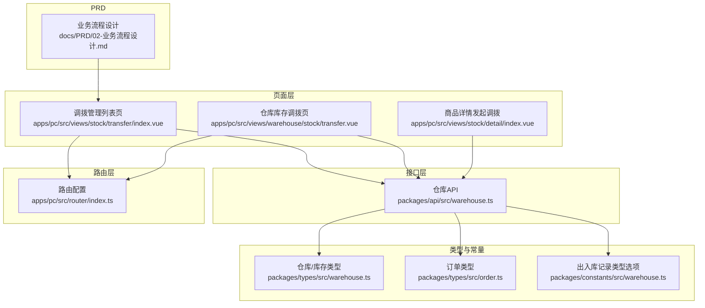
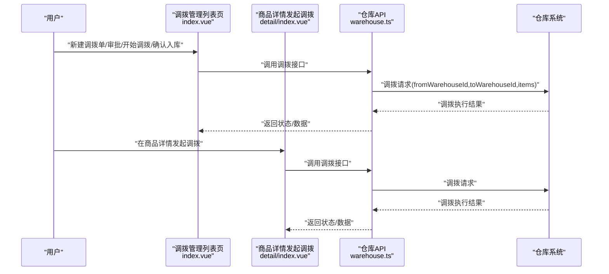
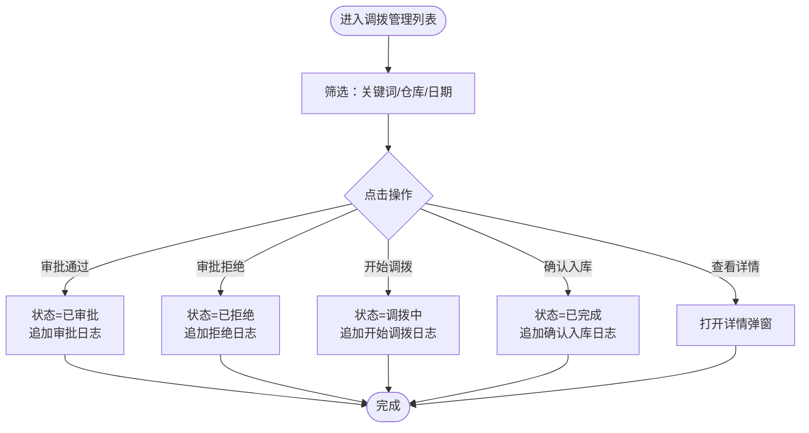
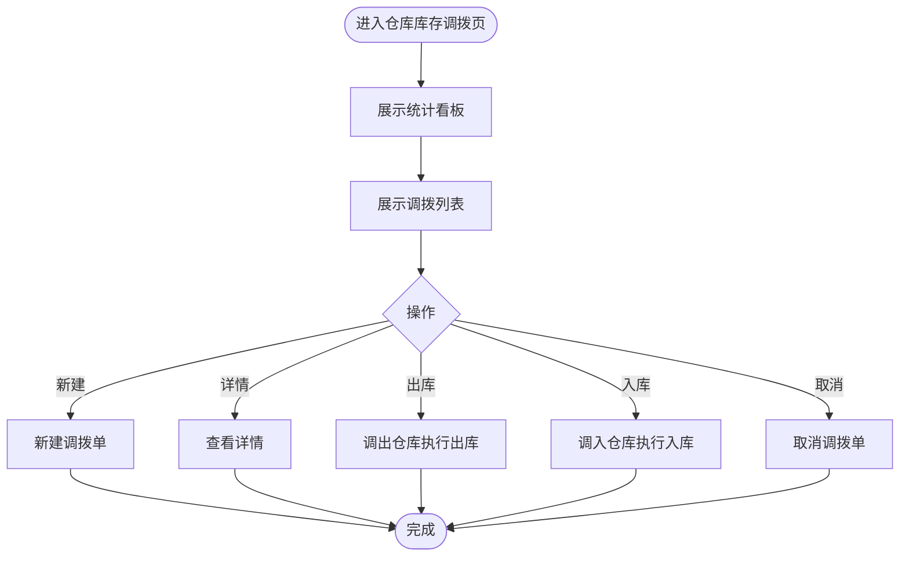
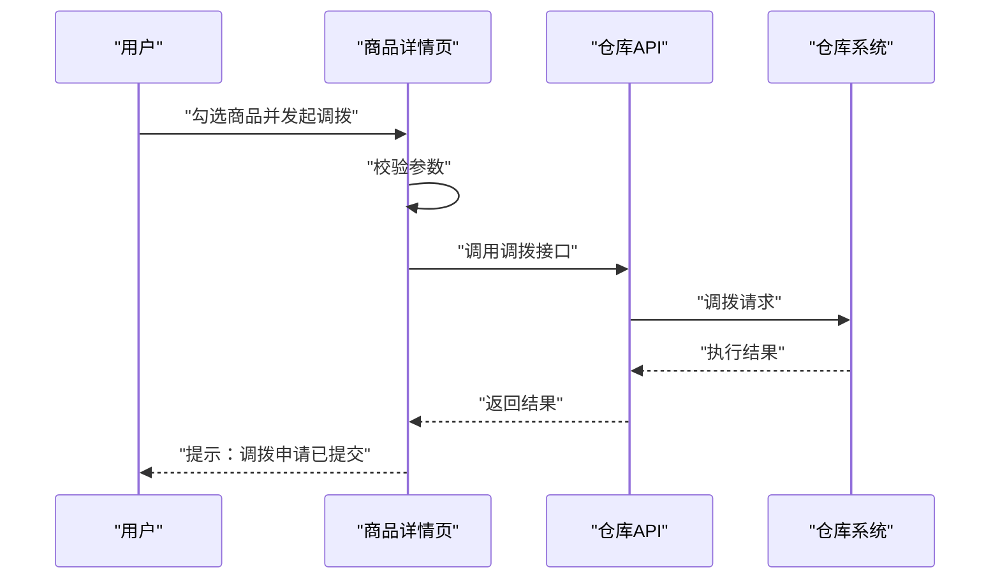
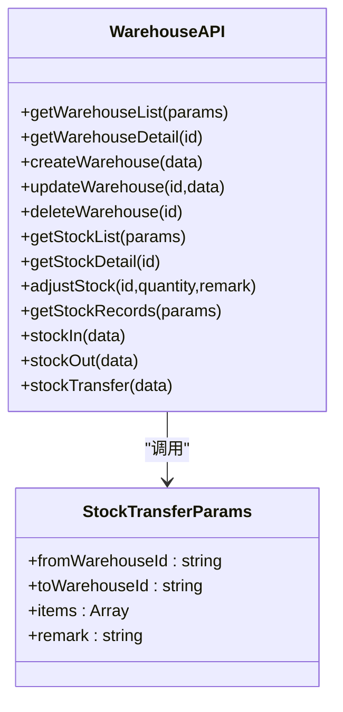
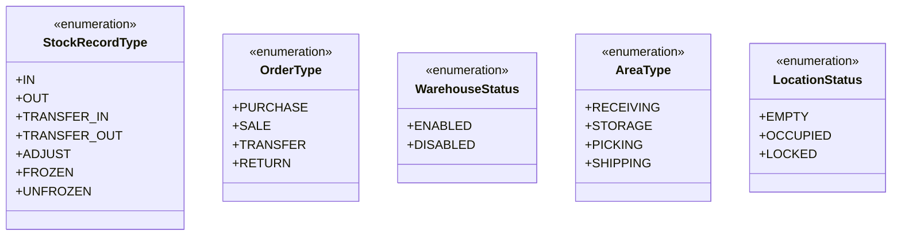
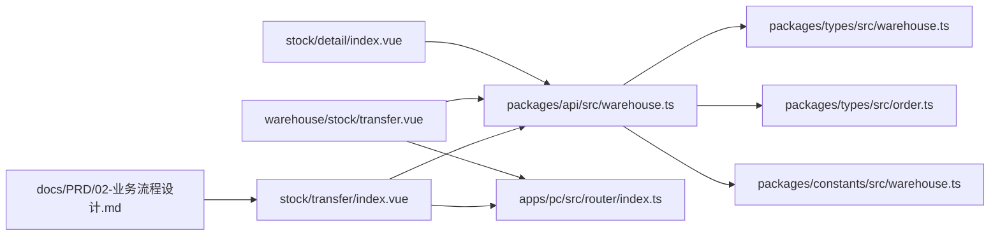
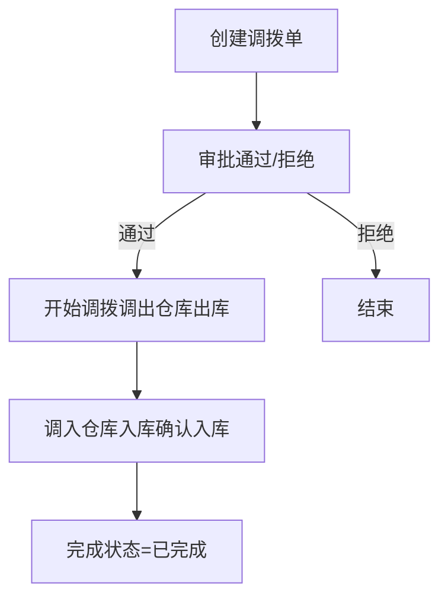

# 调拨管理

<cite>
**本文引用的文件**
- [apps/pc/src/views/stock/transfer/index.vue](file://apps/pc/src/views/stock/transfer/index.vue)
- [apps/pc/src/views/warehouse/stock/transfer.vue](file://apps/pc/src/views/warehouse/stock/transfer.vue)
- [apps/pc/src/views/stock/detail/index.vue](file://apps/pc/src/views/stock/detail/index.vue)
- [packages/api/src/warehouse.ts](file://packages/api/src/warehouse.ts)
- [packages/types/src/warehouse.ts](file://packages/types/src/warehouse.ts)
- [packages/types/src/order.ts](file://packages/types/src/order.ts)
- [packages/constants/src/warehouse.ts](file://packages/constants/src/warehouse.ts)
- [apps/pc/src/router/index.ts](file://apps/pc/src/router/index.ts)
- [apps/pc/src/views/stock/overview/index.vue](file://apps/pc/src/views/stock/overview/index.vue)
- [docs/PRD/02-业务流程设计.md](file://docs/PRD/02-业务流程设计.md)
</cite>

## 目录
1. [简介](#简介)
2. [项目结构](#项目结构)
3. [核心组件](#核心组件)
4. [架构总览](#架构总览)
5. [详细组件分析](#详细组件分析)
6. [依赖分析](#依赖分析)
7. [性能考虑](#性能考虑)
8. [故障排查指南](#故障排查指南)
9. [结论](#结论)
10. [附录](#附录)

## 简介
本文件面向“工程仓调拨管理”功能，系统化阐述调拨业务的完整流程与实现要点，覆盖从“调拨申请创建、审批、执行、确认入库”的全链路；解释调拨单生成机制、仓库间库存转移、成本核算、状态跟踪与监控、与库存管理的关系及对库存准确性的影响，并提供操作指南与优化策略。

## 项目结构
调拨管理功能主要由以下部分构成：
- 页面层：调拨管理列表页、仓库内库存调拨页、商品详情发起调拨入口
- 类型与常量：仓库、库存、出入库记录、订单类型的定义与枚举
- 接口层：仓库库存接口，包含调拨请求方法
- 路由层：调拨管理页面路由配置
- PRD：业务流程与状态说明

图表来源
- [apps/pc/src/views/stock/transfer/index.vue:1-120](file://apps/pc/src/views/stock/transfer/index.vue#L1-L120)
- [apps/pc/src/views/warehouse/stock/transfer.vue:1-120](file://apps/pc/src/views/warehouse/stock/transfer.vue#L1-L120)
- [apps/pc/src/views/stock/detail/index.vue:440-490](file://apps/pc/src/views/stock/detail/index.vue#L440-L490)
- [packages/api/src/warehouse.ts:106-113](file://packages/api/src/warehouse.ts#L106-L113)
- [packages/types/src/warehouse.ts:72-111](file://packages/types/src/warehouse.ts#L72-L111)
- [packages/types/src/order.ts:46-51](file://packages/types/src/order.ts#L46-L51)
- [packages/constants/src/warehouse.ts:21-29](file://packages/constants/src/warehouse.ts#L21-L29)
- [apps/pc/src/router/index.ts:260-265](file://apps/pc/src/router/index.ts#L260-L265)
- [apps/pc/src/router/index.ts:646-650](file://apps/pc/src/router/index.ts#L646-L650)
- [docs/PRD/02-业务流程设计.md:1-200](file://docs/PRD/02-业务流程设计.md#L1-L200)

章节来源
- [apps/pc/src/views/stock/transfer/index.vue:1-120](file://apps/pc/src/views/stock/transfer/index.vue#L1-L120)
- [apps/pc/src/views/warehouse/stock/transfer.vue:1-120](file://apps/pc/src/views/warehouse/stock/transfer.vue#L1-L120)
- [apps/pc/src/views/stock/detail/index.vue:440-490](file://apps/pc/src/views/stock/detail/index.vue#L440-L490)
- [packages/api/src/warehouse.ts:106-113](file://packages/api/src/warehouse.ts#L106-L113)
- [packages/types/src/warehouse.ts:72-111](file://packages/types/src/warehouse.ts#L72-L111)
- [packages/types/src/order.ts:46-51](file://packages/types/src/order.ts#L46-L51)
- [packages/constants/src/warehouse.ts:21-29](file://packages/constants/src/warehouse.ts#L21-L29)
- [apps/pc/src/router/index.ts:260-265](file://apps/pc/src/router/index.ts#L260-L265)
- [apps/pc/src/router/index.ts:646-650](file://apps/pc/src/router/index.ts#L646-L650)
- [docs/PRD/02-业务流程设计.md:1-200](file://docs/PRD/02-业务流程设计.md#L1-L200)

## 核心组件
- 调拨管理列表页：支持筛选、分页、审批、开始调拨、确认入库、查看详情等操作；展示调出/调入仓库、商品数量、总数量、总价值、状态、申请人、申请时间等字段。
- 仓库库存调拨页：提供统计看板（待出库、调拨中、本月调拨量、调拨SKU），支持新建调拨单、按状态筛选、查看详情。
- 商品详情发起调拨：在仓库详情页中，从商品列表选择商品并发起调拨申请。
- 仓库API：提供调拨接口，封装调出仓库出库与调入仓库入库的统一调拨动作。
- 类型与常量：定义出入库记录类型（含调拨入库/调拨出库）、订单类型（含调拨订单）、仓库与区域状态等。

章节来源
- [apps/pc/src/views/stock/transfer/index.vue:1-282](file://apps/pc/src/views/stock/transfer/index.vue#L1-L282)
- [apps/pc/src/views/warehouse/stock/transfer.vue:1-253](file://apps/pc/src/views/warehouse/stock/transfer.vue#L1-L253)
- [apps/pc/src/views/stock/detail/index.vue:440-490](file://apps/pc/src/views/stock/detail/index.vue#L440-L490)
- [packages/api/src/warehouse.ts:106-113](file://packages/api/src/warehouse.ts#L106-L113)
- [packages/types/src/warehouse.ts:87-111](file://packages/types/src/warehouse.ts#L87-L111)
- [packages/types/src/order.ts:46-51](file://packages/types/src/order.ts#L46-L51)
- [packages/constants/src/warehouse.ts:21-29](file://packages/constants/src/warehouse.ts#L21-L29)

## 架构总览
调拨管理采用“页面-接口-类型/常量-路由”的分层架构：
- 页面层负责交互与数据展示；
- 接口层封装调拨请求；
- 类型/常量层提供数据结构与枚举；
- 路由层组织页面访问路径。

图表来源
- [apps/pc/src/views/stock/transfer/index.vue:541-561](file://apps/pc/src/views/stock/transfer/index.vue#L541-L561)
- [apps/pc/src/views/stock/detail/index.vue:611-626](file://apps/pc/src/views/stock/detail/index.vue#L611-L626)
- [packages/api/src/warehouse.ts:106-113](file://packages/api/src/warehouse.ts#L106-L113)

## 详细组件分析

### 组件A：调拨管理列表页（stock/transfer/index.vue）
- 功能点
  - 列表筛选：关键词、调出/调入仓库、日期范围
  - 状态筛选：全部、待审批、已审批、调拨中、已完成、已拒绝
  - 表格列：调拨单号、调出/调入仓库、商品数量、总数量、总价值、状态、申请人、申请时间、操作按钮
  - 操作：审批（通过/拒绝）、开始调拨、确认入库、查看详情
  - 新建调拨单弹窗：选择调出/调入仓库、选择商品、输入调拨原因
- 关键逻辑
  - 状态颜色与文案映射
  - 新建调拨单校验（仓库必选、商品必选、原因必填）
  - 审批/开始调拨/确认入库的状态变更与日志追加

图表来源
- [apps/pc/src/views/stock/transfer/index.vue:563-614](file://apps/pc/src/views/stock/transfer/index.vue#L563-L614)

章节来源
- [apps/pc/src/views/stock/transfer/index.vue:1-282](file://apps/pc/src/views/stock/transfer/index.vue#L1-L282)
- [apps/pc/src/views/stock/transfer/index.vue:422-447](file://apps/pc/src/views/stock/transfer/index.vue#L422-L447)
- [apps/pc/src/views/stock/transfer/index.vue:563-614](file://apps/pc/src/views/stock/transfer/index.vue#L563-L614)

### 组件B：仓库库存调拨页（warehouse/stock/transfer.vue）
- 功能点
  - 统计看板：待出库、调拨中、本月调拨量、调拨SKU
  - 列表：调拨单号、调出/调入仓库、商品种类、总数量、调拨金额、状态、预计到达、创建人、创建时间、操作（详情、出库、入库、取消）
  - 新建调拨单：选择仓库、选择商品、输入原因
- 关键逻辑
  - 状态颜色与文案映射
  - 列表过滤与分页

图表来源
- [apps/pc/src/views/warehouse/stock/transfer.vue:1-253](file://apps/pc/src/views/warehouse/stock/transfer.vue#L1-L253)

章节来源
- [apps/pc/src/views/warehouse/stock/transfer.vue:1-253](file://apps/pc/src/views/warehouse/stock/transfer.vue#L1-L253)

### 组件C：商品详情发起调拨（stock/detail/index.vue）
- 功能点
  - 在仓库详情页的商品列表中，勾选商品并发起调拨
  - 选择调入仓库、输入调拨原因
  - 提交后提示“调拨申请已提交”
- 关键逻辑
  - 校验：调入仓库必选、商品必选、原因必填

图表来源
- [apps/pc/src/views/stock/detail/index.vue:440-490](file://apps/pc/src/views/stock/detail/index.vue#L440-L490)
- [apps/pc/src/views/stock/detail/index.vue:611-626](file://apps/pc/src/views/stock/detail/index.vue#L611-L626)
- [packages/api/src/warehouse.ts:106-113](file://packages/api/src/warehouse.ts#L106-L113)

章节来源
- [apps/pc/src/views/stock/detail/index.vue:440-490](file://apps/pc/src/views/stock/detail/index.vue#L440-L490)
- [apps/pc/src/views/stock/detail/index.vue:611-626](file://apps/pc/src/views/stock/detail/index.vue#L611-L626)

### 组件D：仓库API（warehouse.ts）
- 功能点
  - 提供调拨接口：接收调出仓库ID、调入仓库ID、商品明细、备注
  - 提供库存查询、出入库、库存记录查询等接口（与调拨协同）
- 关键逻辑
  - 调拨接口签名：fromWarehouseId、toWarehouseId、items、remark
  - 返回类型：void（具体执行结果由前端状态与日志体现）

图表来源
- [packages/api/src/warehouse.ts:1-114](file://packages/api/src/warehouse.ts#L1-L114)

章节来源
- [packages/api/src/warehouse.ts:106-113](file://packages/api/src/warehouse.ts#L106-L113)

### 组件E：类型与常量（types/warehouse.ts、types/order.ts、constants/warehouse.ts）
- 出入库记录类型：IN、OUT、TRANSFER_IN、TRANSFER_OUT、ADJUST、FROZEN、UNFROZEN
- 订单类型：PURCHASE、SALE、TRANSFER、RETURN
- 仓库与区域状态：仓库启用/禁用、区域类型（收货/存储/拣货/发货）、库位状态（空闲/占用/锁定）

图表来源
- [packages/types/src/warehouse.ts:87-111](file://packages/types/src/warehouse.ts#L87-L111)
- [packages/types/src/order.ts:46-51](file://packages/types/src/order.ts#L46-L51)
- [packages/constants/src/warehouse.ts:3-29](file://packages/constants/src/warehouse.ts#L3-L29)

章节来源
- [packages/types/src/warehouse.ts:87-111](file://packages/types/src/warehouse.ts#L87-L111)
- [packages/types/src/order.ts:46-51](file://packages/types/src/order.ts#L46-L51)
- [packages/constants/src/warehouse.ts:3-29](file://packages/constants/src/warehouse.ts#L3-L29)

### 组件F：路由配置（router/index.ts）
- 调拨管理页面路由：/stock/transfer
- 仓库端库存调拨页面路由：/warehouse/stock/transfer
- 路由元信息包含标题与图标，便于导航与权限控制

章节来源
- [apps/pc/src/router/index.ts:260-265](file://apps/pc/src/router/index.ts#L260-L265)
- [apps/pc/src/router/index.ts:646-650](file://apps/pc/src/router/index.ts#L646-L650)

## 依赖分析
- 页面与接口：调拨管理列表页与仓库库存调拨页均依赖仓库API的调拨接口
- 类型与常量：页面与接口共享类型定义，确保前后端一致
- 路由：页面通过路由访问，形成统一入口
- PRD：业务流程与状态定义支撑页面交互逻辑

图表来源
- [apps/pc/src/views/stock/transfer/index.vue:1-120](file://apps/pc/src/views/stock/transfer/index.vue#L1-L120)
- [apps/pc/src/views/warehouse/stock/transfer.vue:1-120](file://apps/pc/src/views/warehouse/stock/transfer.vue#L1-L120)
- [apps/pc/src/views/stock/detail/index.vue:440-490](file://apps/pc/src/views/stock/detail/index.vue#L440-L490)
- [packages/api/src/warehouse.ts:106-113](file://packages/api/src/warehouse.ts#L106-L113)
- [packages/types/src/warehouse.ts:87-111](file://packages/types/src/warehouse.ts#L87-L111)
- [packages/types/src/order.ts:46-51](file://packages/types/src/order.ts#L46-L51)
- [packages/constants/src/warehouse.ts:21-29](file://packages/constants/src/warehouse.ts#L21-L29)
- [apps/pc/src/router/index.ts:260-265](file://apps/pc/src/router/index.ts#L260-L265)
- [apps/pc/src/router/index.ts:646-650](file://apps/pc/src/router/index.ts#L646-L650)
- [docs/PRD/02-业务流程设计.md:1-200](file://docs/PRD/02-业务流程设计.md#L1-L200)

章节来源
- [apps/pc/src/views/stock/transfer/index.vue:1-120](file://apps/pc/src/views/stock/transfer/index.vue#L1-L120)
- [apps/pc/src/views/warehouse/stock/transfer.vue:1-120](file://apps/pc/src/views/warehouse/stock/transfer.vue#L1-L120)
- [apps/pc/src/views/stock/detail/index.vue:440-490](file://apps/pc/src/views/stock/detail/index.vue#L440-L490)
- [packages/api/src/warehouse.ts:106-113](file://packages/api/src/warehouse.ts#L106-L113)
- [packages/types/src/warehouse.ts:87-111](file://packages/types/src/warehouse.ts#L87-L111)
- [packages/types/src/order.ts:46-51](file://packages/types/src/order.ts#L46-L51)
- [packages/constants/src/warehouse.ts:21-29](file://packages/constants/src/warehouse.ts#L21-L29)
- [apps/pc/src/router/index.ts:260-265](file://apps/pc/src/router/index.ts#L260-L265)
- [apps/pc/src/router/index.ts:646-650](file://apps/pc/src/router/index.ts#L646-L650)
- [docs/PRD/02-业务流程设计.md:1-200](file://docs/PRD/02-业务流程设计.md#L1-L200)

## 性能考虑
- 列表分页与筛选：使用分页参数与本地筛选减少渲染压力
- 状态缓存：在页面内维护状态与日志，避免频繁请求
- 图标与标签：合理使用颜色与标签提升可读性，降低视觉负担
- 批量操作：在商品选择与调拨时，避免重复渲染与重复请求

## 故障排查指南
- 新建调拨单失败
  - 检查是否选择了调出/调入仓库、是否添加了商品、是否填写了调拨原因
  - 查看页面提示与日志
- 审批/开始调拨/确认入库异常
  - 确认当前状态是否允许该操作
  - 检查日志是否正确追加
- 库存不准确
  - 核对出入库记录类型（调拨入库/调拨出库）
  - 检查库存记录查询与统计看板数据一致性

章节来源
- [apps/pc/src/views/stock/transfer/index.vue:541-561](file://apps/pc/src/views/stock/transfer/index.vue#L541-L561)
- [apps/pc/src/views/stock/transfer/index.vue:563-614](file://apps/pc/src/views/stock/transfer/index.vue#L563-L614)
- [packages/constants/src/warehouse.ts:21-29](file://packages/constants/src/warehouse.ts#L21-L29)
- [apps/pc/src/views/stock/overview/index.vue:333-346](file://apps/pc/src/views/stock/overview/index.vue#L333-L346)

## 结论
调拨管理通过清晰的页面交互、完善的类型与常量定义、统一的API接口以及明确的路由配置，实现了从申请到审批再到执行与确认的完整闭环。结合出入库记录类型与PRD中的业务流程，能够有效保障仓库间库存的高效流转与准确性。

## 附录

### 调拨业务流程（概念图）

[此图为概念流程，不直接映射具体源码文件]

### 调拨与库存管理的关系
- 调拨属于“库存转移”，通过调拨出库与调拨入库两个环节实现仓库间库存变动
- 出入库记录类型包含调拨入库/调拨出库，便于追踪与对账
- PRD中明确了两条交易链路与库存变化关系，调拨作为内部库存优化手段之一

章节来源
- [packages/constants/src/warehouse.ts:21-29](file://packages/constants/src/warehouse.ts#L21-L29)
- [docs/PRD/02-业务流程设计.md:1-200](file://docs/PRD/02-业务流程设计.md#L1-L200)