# 工程仓管理

<cite>
**本文引用的文件**
- [package.json](file://package.json)
- [apps/pc/package.json](file://apps/pc/package.json)
- [apps/mp/package.json](file://apps/mp/package.json)
- [docs/PRD/01-系统概览与架构.md](file://docs/PRD/01-系统概览与架构.md)
- [工程仓端功能清单.csv](file://工程仓端功能清单.csv)
- [apps/pc/src/views/dashboard/index.vue](file://apps/pc/src/views/dashboard/index.vue)
- [apps/pc/src/views/merchant/list/index.vue](file://apps/pc/src/views/merchant/list/index.vue)
- [apps/pc/src/views/product/list/index.vue](file://apps/pc/src/views/product/list/index.vue)
- [apps/pc/src/views/order/list/index.vue](file://apps/pc/src/views/order/list/index.vue)
- [apps/pc/src/views/finance/wallet/index.vue](file://apps/pc/src/views/finance/wallet/index.vue)
- [apps/pc/src/views/stock/overview/index.vue](file://apps/pc/src/views/stock/overview/index.vue)
- [apps/pc/src/views/warehouse/list/index.vue](file://apps/pc/src/views/warehouse/list/index.vue)
- [apps/pc/src/views/system/role/index.vue](file://apps/pc/src/views/system/role/index.vue)
- [apps/pc/src/views/system/user/index.vue](file://apps/pc/src/views/system/user/index.vue)
</cite>

## 目录
1. [简介](#简介)
2. [项目结构](#项目结构)
3. [核心组件](#核心组件)
4. [架构总览](#架构总览)
5. [详细组件分析](#详细组件分析)
6. [依赖分析](#依赖分析)
7. [性能考虑](#性能考虑)
8. [故障排查指南](#故障排查指南)
9. [结论](#结论)
10. [附录](#附录)

## 简介
本文件面向“工程仓管理”模块，基于仓库现有代码与PRD文档，系统化梳理工程仓端的核心功能与实现形态，包括但不限于：
- 工作台（业务概览、数据统计）
- 工程仓账户管理（账户信息、安全设置）
- 工程仓资料管理（企业信息、联系人信息）
- 工程仓角色权限（角色管理、员工管理）
- 工程仓财务模块（账户管理、收支明细、资金冻结、交易流水、发票管理、付款管理、结算管理、对账单）
- 工程仓市场模块（商品市场、购物车、BOM管理）
- 工程仓订单模块（采购订单、销售订单、订单创建）
- 工程仓计划模块（生产计划、项目计划）
- 工程仓产品模块（产品管理、库存查询）
- 工程仓库存模块（入库管理、出库管理、盘点管理、批次管理）
- 工程仓仓库模块（仓库管理、货位管理）

同时提供工程仓运营最佳实践与管理指南，帮助读者快速理解与落地。

## 项目结构
工程仓管理功能主要分布在PC端与小程序端，采用多包（monorepo）结构组织，核心依赖如下：
- PC端应用：Vue 3 + Arco Design + Pinia + Vue Router
- 小程序端：uni-app（支持微信/支付宝小程序）
- 公共包：@gongchengcang/api、@gongchengcang/constants、@gongchengcang/types、@gongchengcang/utils

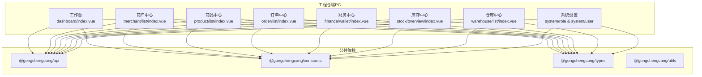

**图表来源**
- [apps/pc/package.json:14-24](file://apps/pc/package.json#L14-L24)
- [apps/mp/package.json:12-24](file://apps/mp/package.json#L12-L24)
- [apps/pc/src/views/dashboard/index.vue:1-120](file://apps/pc/src/views/dashboard/index.vue#L1-L120)
- [apps/pc/src/views/merchant/list/index.vue:138-153](file://apps/pc/src/views/merchant/list/index.vue#L138-L153)
- [apps/pc/src/views/product/list/index.vue:74-79](file://apps/pc/src/views/product/list/index.vue#L74-L79)
- [apps/pc/src/views/order/list/index.vue:85-90](file://apps/pc/src/views/order/list/index.vue#L85-L90)
- [apps/pc/src/views/finance/wallet/index.vue:142-146](file://apps/pc/src/views/finance/wallet/index.vue#L142-L146)
- [apps/pc/src/views/stock/overview/index.vue:384-388](file://apps/pc/src/views/stock/overview/index.vue#L384-L388)
- [apps/pc/src/views/warehouse/list/index.vue:85-88](file://apps/pc/src/views/warehouse/list/index.vue#L85-L88)
- [apps/pc/src/views/system/role/index.vue:81-88](file://apps/pc/src/views/system/role/index.vue#L81-L88)
- [apps/pc/src/views/system/user/index.vue:114-126](file://apps/pc/src/views/system/user/index.vue#L114-L126)

**章节来源**
- [package.json:6-12](file://package.json#L6-L12)
- [apps/pc/package.json:6-13](file://apps/pc/package.json#L6-L13)
- [apps/mp/package.json:5-11](file://apps/mp/package.json#L5-L11)

## 核心组件
本节聚焦工程仓端的关键页面与交互，结合功能清单与PRD，给出组件职责与典型流程。

- 工作台（Dashboard）
  - 职责：数据概览、快捷入口、待处理事项、最近订单
  - 关键能力：卡片式统计、图表占位、快捷导航、待办提醒
  - 适用场景：仓管员日常监控与快速入口

- 商户中心（Merchant）
  - 职责：工程仓主体信息查看/编辑、合同列表、账号管理、进入系统
  - 关键能力：筛选器（关键字/类型/入驻状态/启用状态）、状态切换、批量操作
  - 适用场景：工程仓资料维护与子账号管理

- 商品中心（Product）
  - 职责：商品列表、搜索筛选、状态管理、定价配置、删除
  - 关键能力：分类级联、状态Tag、分页、操作列（查看/编辑/定价/删除）
  - 适用场景：工程仓商品目录管理与价格策略

- 订单中心（Order）
  - 职责：采购/销售订单列表、搜索筛选、状态管理、确认/发货
  - 关键能力：类型/状态筛选、金额展示、支付状态Tag、操作列
  - 适用场景：订单生命周期管理

- 财务中心（Finance）
  - 职责：账户总览、账户列表、交易流水、冻结/解冻
  - 关键能力：账户类型筛选、状态筛选、余额/收入/支出统计、操作列
  - 适用场景：工程仓资金监管与流水对账

- 库存中心（Stock）
  - 职责：仓库总览、库存监控、预警/缺货、出入库趋势、分类分布、调拨审批
  - 关键能力：仓库容量可视化、库存价值统计、预警告警、调拨申请
  - 适用场景：库存健康度监控与调拨调度

- 仓库中心（Warehouse）
  - 职责：仓库列表、搜索筛选、覆盖范围、负责人、库存容量、状态
  - 关键能力：类型/状态筛选、覆盖范围标签、操作列（查看库存/出入库记录）
  - 适用场景：仓库资源与覆盖范围管理

- 系统设置（System）
  - 角色管理：角色列表、所属商户、角色类型、权限配置、删除
  - 员工管理：用户列表、类型/状态/商户筛选、状态切换、重置密码、分配角色
  - 关键能力：商户联动、角色类型映射、权限抽屉、分配角色抽屉
  - 适用场景：工程仓内部权限治理与账号管理

**章节来源**
- [apps/pc/src/views/dashboard/index.vue:1-120](file://apps/pc/src/views/dashboard/index.vue#L1-L120)
- [apps/pc/src/views/merchant/list/index.vue:138-153](file://apps/pc/src/views/merchant/list/index.vue#L138-L153)
- [apps/pc/src/views/product/list/index.vue:74-79](file://apps/pc/src/views/product/list/index.vue#L74-L79)
- [apps/pc/src/views/order/list/index.vue:85-90](file://apps/pc/src/views/order/list/index.vue#L85-L90)
- [apps/pc/src/views/finance/wallet/index.vue:142-146](file://apps/pc/src/views/finance/wallet/index.vue#L142-L146)
- [apps/pc/src/views/stock/overview/index.vue:384-388](file://apps/pc/src/views/stock/overview/index.vue#L384-L388)
- [apps/pc/src/views/warehouse/list/index.vue:85-88](file://apps/pc/src/views/warehouse/list/index.vue#L85-L88)
- [apps/pc/src/views/system/role/index.vue:81-88](file://apps/pc/src/views/system/role/index.vue#L81-L88)
- [apps/pc/src/views/system/user/index.vue:114-126](file://apps/pc/src/views/system/user/index.vue#L114-L126)

## 架构总览
工程仓端采用前后端分离架构，PC端以Vue生态为主，通过公共API包与常量/类型包进行解耦；小程序端基于uni-app适配多端运行。

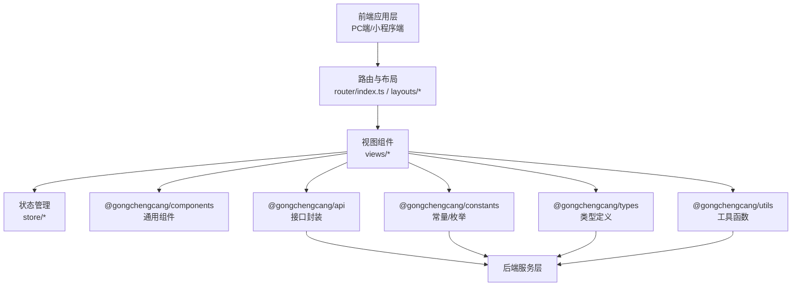

**图表来源**
- [apps/pc/package.json:14-24](file://apps/pc/package.json#L14-L24)
- [apps/mp/package.json:12-24](file://apps/mp/package.json#L12-L24)

**章节来源**
- [docs/PRD/01-系统概览与架构.md:62-117](file://docs/PRD/01-系统概览与架构.md#L62-L117)

## 详细组件分析

### 工作台（业务概览、数据统计）
- 组件形态：卡片统计 + 快捷入口 + 待处理事项 + 最近订单
- 数据来源：本地模拟数据（便于演示）
- 交互要点：快捷入口跳转、待办状态Tag、订单状态Tag

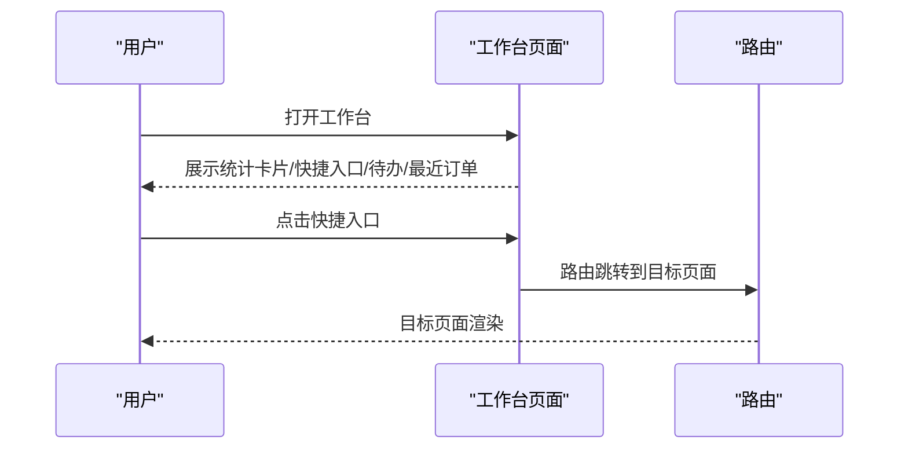

**图表来源**
- [apps/pc/src/views/dashboard/index.vue:83-120](file://apps/pc/src/views/dashboard/index.vue#L83-L120)

**章节来源**
- [apps/pc/src/views/dashboard/index.vue:1-120](file://apps/pc/src/views/dashboard/index.vue#L1-L120)

### 工程仓账户管理（账户信息、安全设置）
- 账户信息：主体信息查看/编辑、合同列表、账号管理
- 安全设置：进入系统（模拟）、账号状态切换、删除
- 关键流程：筛选器联动、状态切换回滚、二次确认

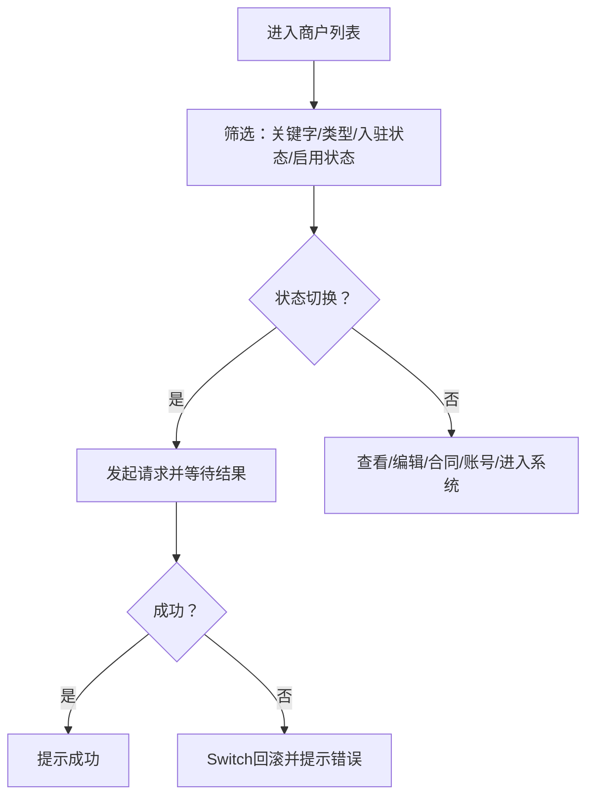

**图表来源**
- [apps/pc/src/views/merchant/list/index.vue:626-730](file://apps/pc/src/views/merchant/list/index.vue#L626-L730)

**章节来源**
- [apps/pc/src/views/merchant/list/index.vue:138-153](file://apps/pc/src/views/merchant/list/index.vue#L138-L153)

### 工程仓资料管理（企业信息、联系人信息）
- 企业信息：主体信息维护（名称、类型、税种、统一社会信用代码、法人、身份证、营业执照、注册地址、注册资本、成立日期、经营范围）
- 联系人信息：联系人姓名、手机号（强校验）
- 合同信息：合同编号、类型、起止日期、金额、合同文件
- 结算账户：账户名称、银行账号、开户银行、支行信息、联行号
- 资质信息：上传图片（营业执照、身份证正反面）

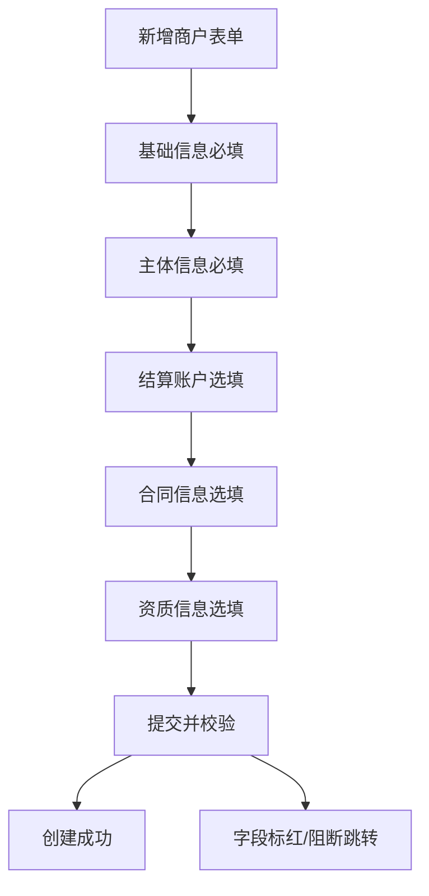

**图表来源**
- [apps/pc/src/views/merchant/list/index.vue:307-419](file://apps/pc/src/views/merchant/list/index.vue#L307-L419)

**章节来源**
- [apps/pc/src/views/merchant/list/index.vue:307-419](file://apps/pc/src/views/merchant/list/index.vue#L307-L419)

### 工程仓角色权限（角色管理、员工管理）
- 角色管理：角色列表、所属商户、角色类型（平台/供应商/施工方/工程仓）、权限配置、删除
- 员工管理：用户列表、类型/状态/商户筛选、状态切换、重置密码、分配角色
- 关键流程：商户联动、角色类型映射、权限抽屉、分配角色抽屉

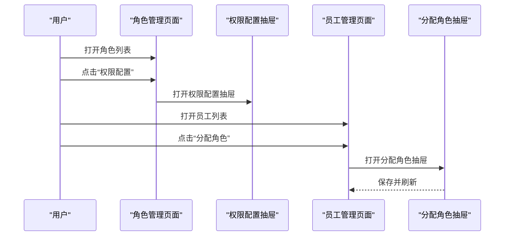

**图表来源**
- [apps/pc/src/views/system/role/index.vue:81-88](file://apps/pc/src/views/system/role/index.vue#L81-L88)
- [apps/pc/src/views/system/user/index.vue:114-126](file://apps/pc/src/views/system/user/index.vue#L114-L126)

**章节来源**
- [apps/pc/src/views/system/role/index.vue:81-88](file://apps/pc/src/views/system/role/index.vue#L81-L88)
- [apps/pc/src/views/system/user/index.vue:114-126](file://apps/pc/src/views/system/user/index.vue#L114-L126)

### 工程仓财务模块（账户管理、收支明细、资金冻结、交易流水、发票管理、付款管理、结算管理、对账单）
- 账户管理：账户总览（余额/账户数/活跃商户）、账户列表（类型/状态/余额/累计收支/关联托管账户）、操作（交易流水/冻结/解冻）
- 收支明细：交易流水列表（筛选：账户、时间、类型）
- 资金冻结：冻结/解冻二次确认
- 发票管理：进项发票/销项发票列表、上传发票
- 付款管理：付款记录（列表/详情）
- 结算管理：结算申请/详情/审核
- 对账单：账单列表/详情

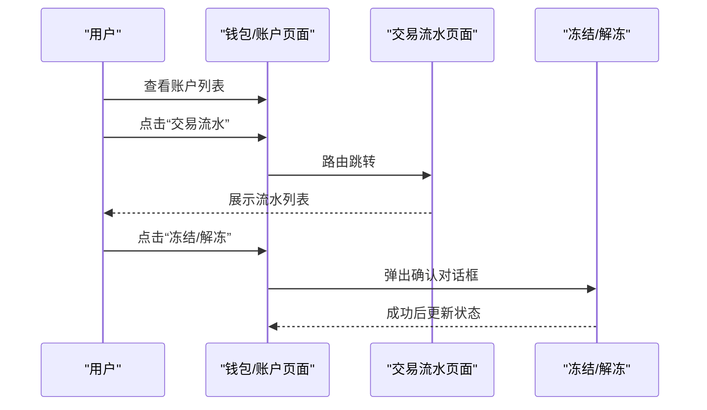

**图表来源**
- [apps/pc/src/views/finance/wallet/index.vue:142-146](file://apps/pc/src/views/finance/wallet/index.vue#L142-L146)
- [apps/pc/src/views/finance/wallet/index.vue:318-345](file://apps/pc/src/views/finance/wallet/index.vue#L318-L345)

**章节来源**
- [apps/pc/src/views/finance/wallet/index.vue:142-146](file://apps/pc/src/views/finance/wallet/index.vue#L142-L146)

### 工程仓市场模块（商品市场、购物车、BOM管理）
- 商品市场：商品列表（卡片式展示）、加入购物车、商品详情
- 购物车：列表、修改数量、删除、结算下单
- BOM管理：BOM列表、详情、订单创建
- 适用场景：工程仓端商品浏览、选品、下单与BOM包管理

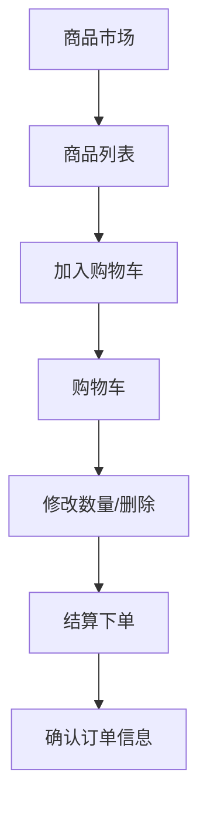

**图表来源**
- [工程仓端功能清单.csv:6-16](file://工程仓端功能清单.csv#L6-L16)

**章节来源**
- [工程仓端功能清单.csv:6-16](file://工程仓端功能清单.csv#L6-L16)

### 工程仓订单模块（采购订单、销售订单、订单创建）
- 采购订单：列表（类型/买方/卖方/金额/支付状态/订单状态）、确认/发货
- 销售订单：列表（类型/买方/卖方/金额/支付状态/订单状态）、详情
- 订单创建：手动创建采购订单（选择商品）

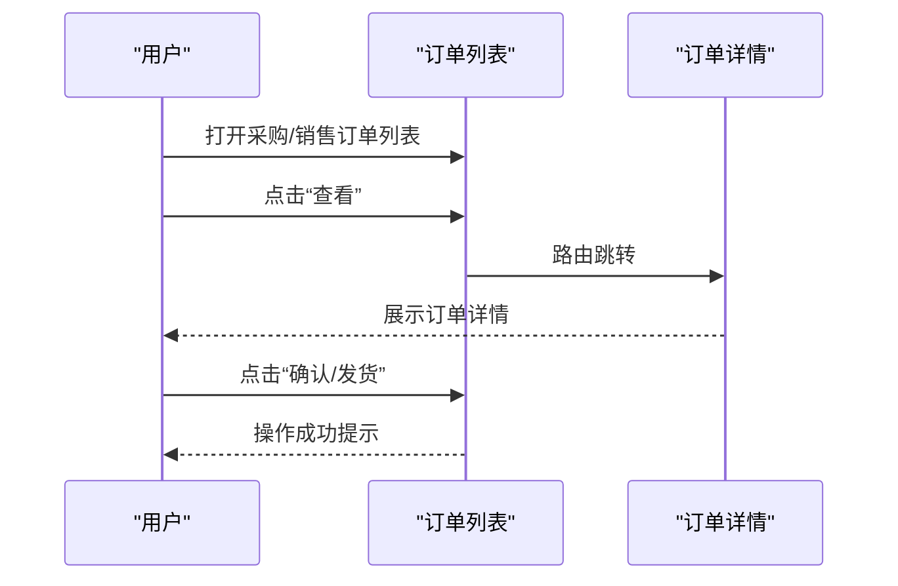

**图表来源**
- [apps/pc/src/views/order/list/index.vue:85-90](file://apps/pc/src/views/order/list/index.vue#L85-L90)
- [apps/pc/src/views/order/list/index.vue:183-195](file://apps/pc/src/views/order/list/index.vue#L183-L195)

**章节来源**
- [apps/pc/src/views/order/list/index.vue:85-90](file://apps/pc/src/views/order/list/index.vue#L85-L90)

### 工程仓计划模块（生产计划、项目计划）
- 采购计划：计划列表、新建计划、计划详情
- 适用场景：工程仓制定采购计划、跟踪计划执行

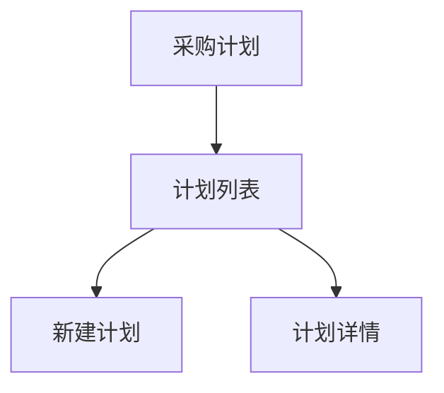

**图表来源**
- [工程仓端功能清单.csv:14-16](file://工程仓端功能清单.csv#L14-L16)

**章节来源**
- [工程仓端功能清单.csv:14-16](file://工程仓端功能清单.csv#L14-L16)

### 工程仓产品模块（产品管理、库存查询）
- 产品管理：商品列表（搜索/分类/状态）、查看/编辑/定价/删除
- 库存查询：库存商品列表、按仓库筛选、SPU详情、SKU库存详情

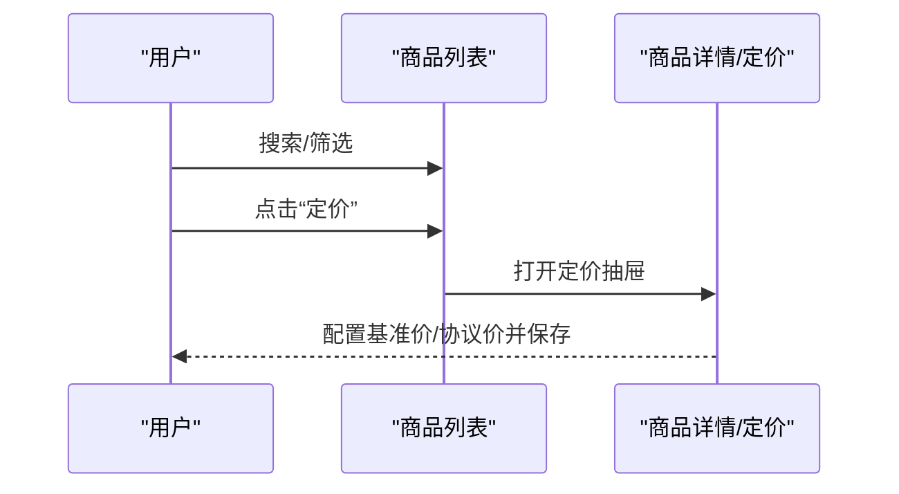

**图表来源**
- [apps/pc/src/views/product/list/index.vue:74-79](file://apps/pc/src/views/product/list/index.vue#L74-L79)
- [apps/pc/src/views/product/list/index.vue:388-390](file://apps/pc/src/views/product/list/index.vue#L388-L390)

**章节来源**
- [apps/pc/src/views/product/list/index.vue:74-79](file://apps/pc/src/views/product/list/index.vue#L74-L79)

### 工程仓库存模块（入库管理、出库管理、盘点管理、批次管理）
- 入库管理：入库单列表（多Tab状态）、开始收货、货损记录
- 出库管理：出库单列表（多Tab状态）
- 盘点管理：盘点单列表
- 批次管理：批次列表、批次详情弹窗
- 适用场景：工程仓端入库/出库/盘点/批次管理

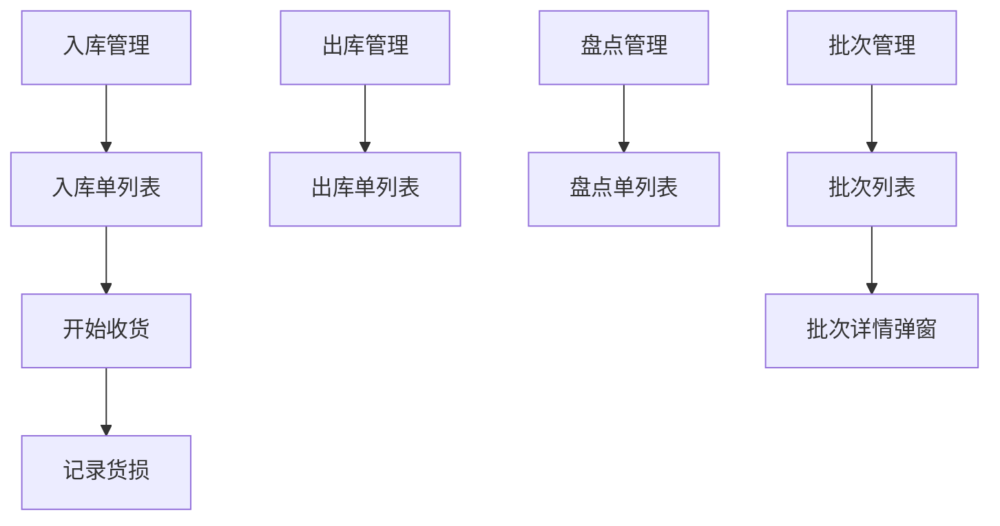

**图表来源**
- [工程仓端功能清单.csv:23-32](file://工程仓端功能清单.csv#L23-L32)

**章节来源**
- [工程仓端功能清单.csv:23-32](file://工程仓端功能清单.csv#L23-L32)

### 工程仓仓库模块（仓库管理、货位管理）
- 仓库列表：搜索仓库名称、仓库类型、状态，查看库存、出入库记录
- 适用场景：工程仓仓库资源管理与覆盖范围管理

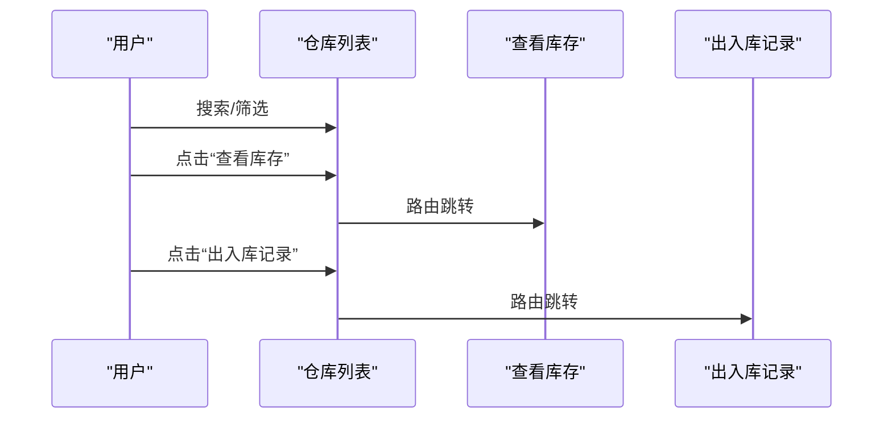

**图表来源**
- [apps/pc/src/views/warehouse/list/index.vue:85-88](file://apps/pc/src/views/warehouse/list/index.vue#L85-L88)
- [apps/pc/src/views/warehouse/list/index.vue:264-276](file://apps/pc/src/views/warehouse/list/index.vue#L264-L276)

**章节来源**
- [apps/pc/src/views/warehouse/list/index.vue:85-88](file://apps/pc/src/views/warehouse/list/index.vue#L85-L88)

## 依赖分析
- 组件耦合
  - 视图组件依赖公共API、常量、类型与工具包，降低重复实现
  - 表格组件广泛使用Arco Design的Table/Column/Tag/Select等，提升一致性
- 外部依赖
  - PC端：@arco-design/web-vue、dayjs、pinia、vue、vue-router
  - 小程序端：@dcloudio/uni-app、@dcloudio/uni-mp-weixin、@dcloudio/uni-h5
- 潜在风险
  - 组件间状态共享建议统一通过Pinia Store管理，避免跨组件直接通信
  - 表格分页与筛选需统一抽象，减少重复逻辑

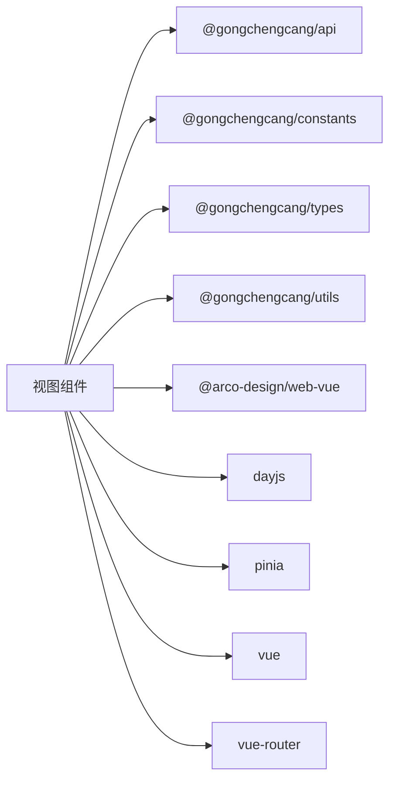

**图表来源**
- [apps/pc/package.json:14-24](file://apps/pc/package.json#L14-L24)
- [apps/mp/package.json:12-24](file://apps/mp/package.json#L12-L24)

**章节来源**
- [apps/pc/package.json:14-24](file://apps/pc/package.json#L14-L24)
- [apps/mp/package.json:12-24](file://apps/mp/package.json#L12-L24)

## 性能考虑
- 首屏优化：工作台与列表页采用骨架屏/占位图，减少白屏时间
- 列表性能：表格分页与筛选参数化，避免一次性加载全部数据
- 交互反馈：状态切换（如启用/禁用）增加本地回滚，提升用户体验
- 图表与趋势：库存趋势采用柱状图占位，避免重型图表初始化

[本节为通用指导，无需特定文件引用]

## 故障排查指南
- 状态切换失败
  - 现象：启用/禁用开关回滚并提示错误
  - 排查：检查接口返回与错误提示，确认网络状态
  - 参考路径：[apps/pc/src/views/merchant/list/index.vue:717-725](file://apps/pc/src/views/merchant/list/index.vue#L717-L725)
- 删除操作未生效
  - 现象：删除后列表未刷新
  - 排查：确认删除成功回调是否触发列表刷新
  - 参考路径：[apps/pc/src/views/system/user/index.vue:205-213](file://apps/pc/src/views/system/user/index.vue#L205-L213)
- 冻结/解冻确认
  - 现象：冻结/解冻后状态未更新
  - 排查：确认二次确认对话框是否正确触发并更新状态
  - 参考路径：[apps/pc/src/views/finance/wallet/index.vue:325-345](file://apps/pc/src/views/finance/wallet/index.vue#L325-L345)

**章节来源**
- [apps/pc/src/views/merchant/list/index.vue:717-725](file://apps/pc/src/views/merchant/list/index.vue#L717-L725)
- [apps/pc/src/views/system/user/index.vue:205-213](file://apps/pc/src/views/system/user/index.vue#L205-L213)
- [apps/pc/src/views/finance/wallet/index.vue:325-345](file://apps/pc/src/views/finance/wallet/index.vue#L325-L345)

## 结论
工程仓管理模块以“工作台-业务中心-系统设置”的层次化结构组织，覆盖从商品、订单、库存到财务、仓库、角色权限的全链路功能。通过统一的公共包与组件体系，实现了跨端一致性与可扩展性。建议在后续迭代中进一步完善真实数据接入、权限细化与报表体系，持续提升工程仓的运营效率与合规水平。

[本节为总结性内容，无需特定文件引用]

## 附录
- 工程仓端功能清单（节选）
  - 工作台：数据概览
  - 商户中心：主体信息、合同列表
  - 商品市场：商品列表、购物车、确认订单、采购计划
  - 商品中心：商品列表、SPU详情、SKU库存详情
  - 仓库管理：仓库列表、仓库详情、出入库管理、库存调拨、收货批次
  - 订单管理：采购订单、销售订单
  - 财务中心：支付记录、进项发票、销项发票
  - 系统设置：账号列表、员工管理、角色管理、权限配置

**章节来源**
- [工程仓端功能清单.csv:2-48](file://工程仓端功能清单.csv#L2-L48)