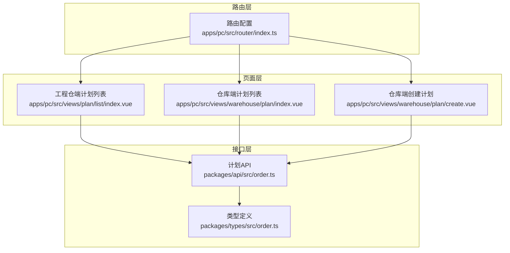
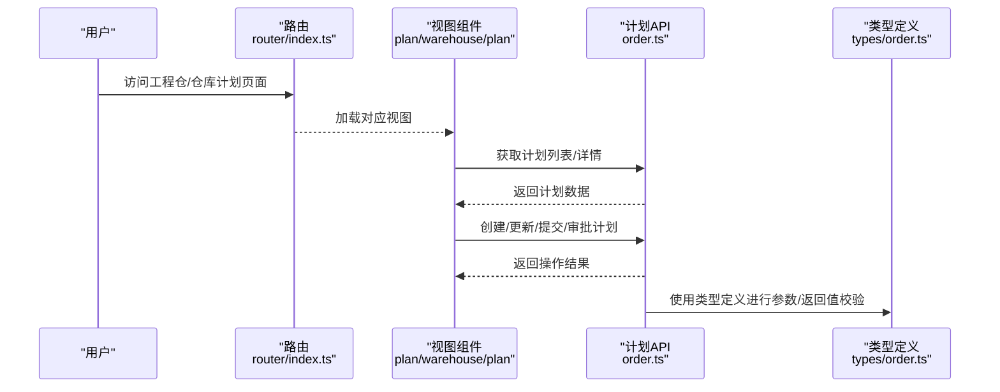
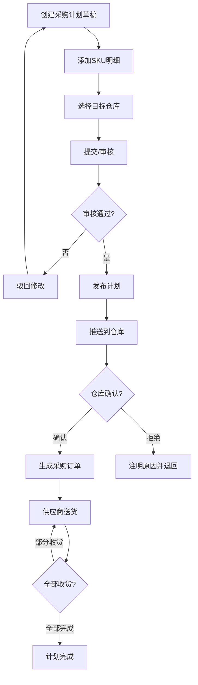
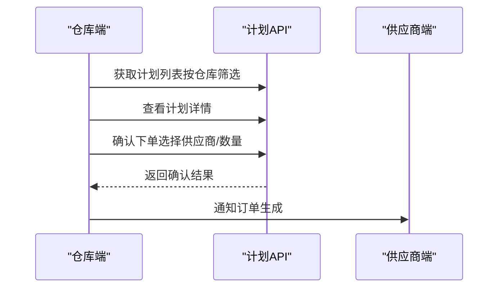
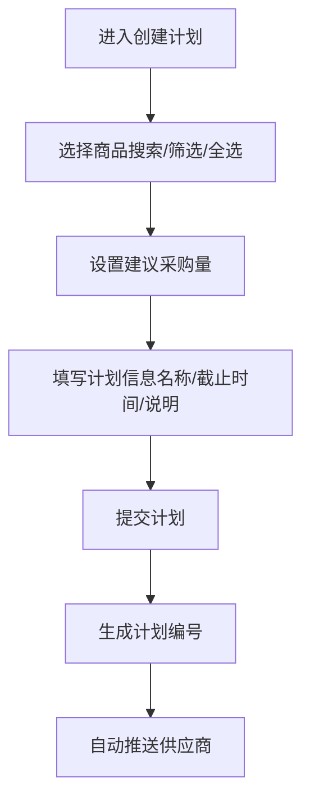
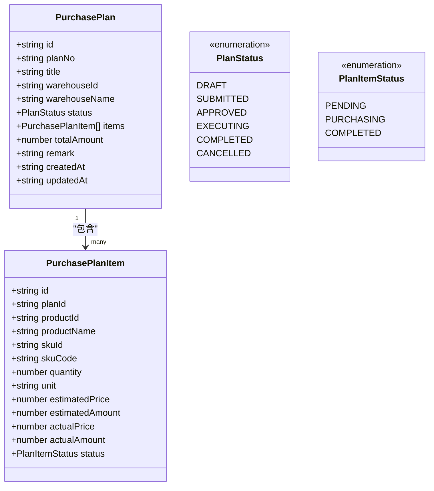
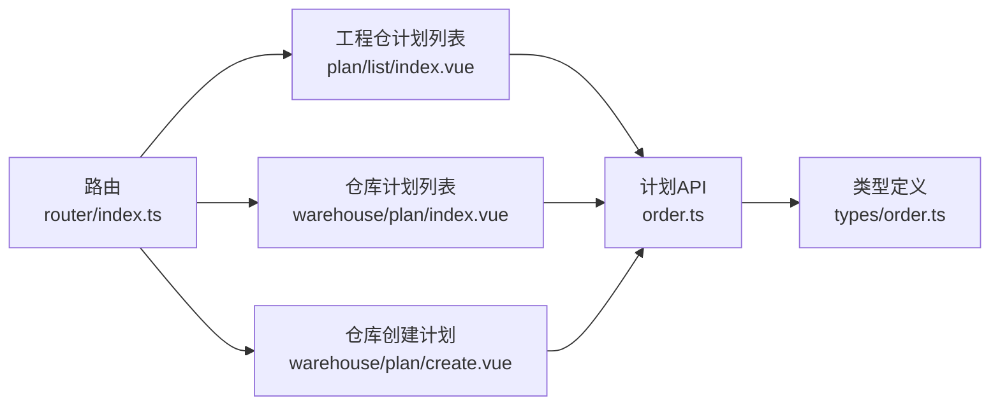

# 工程仓计划模块

<cite>
**本文引用的文件**
- [apps/pc/src/views/plan/list/index.vue](file://apps/pc/src/views/plan/list/index.vue)
- [apps/pc/src/views/warehouse/plan/index.vue](file://apps/pc/src/views/warehouse/plan/index.vue)
- [apps/pc/src/views/warehouse/plan/create.vue](file://apps/pc/src/views/warehouse/plan/create.vue)
- [packages/api/src/order.ts](file://packages/api/src/order.ts)
- [packages/types/src/order.ts](file://packages/types/src/order.ts)
- [apps/pc/src/router/index.ts](file://apps/pc/src/router/index.ts)
- [docs/PRD/02-业务流程设计.md](file://docs/PRD/02-业务流程设计.md)
- [工程仓端功能清单.csv](file://工程仓端功能清单.csv)
</cite>

## 目录
1. [简介](#简介)
2. [项目结构](#项目结构)
3. [核心组件](#核心组件)
4. [架构总览](#架构总览)
5. [详细组件分析](#详细组件分析)
6. [依赖分析](#依赖分析)
7. [性能考虑](#性能考虑)
8. [故障排查指南](#故障排查指南)
9. [结论](#结论)
10. [附录](#附录)

## 简介
本文件面向工程仓计划模块，系统化梳理“采购计划”与“仓库侧计划执行”的业务与实现，覆盖计划创建、列表管理、执行监控、调整变更、报表分析等关键能力，并结合权限与流程设计，给出最佳实践与优化策略。该模块贯穿“工程仓端”与“平台端”，既支持工程仓统一汇总与下发，也支持仓库侧确认下单与收货执行。

## 项目结构
工程仓计划模块由三层构成：
- 页面层：工程仓端计划列表、仓库端计划列表与创建流程
- 业务层：计划状态机、推送与确认流程、订单生成与收货
- 接口层：计划 CRUD、提交、审批、订单生成等 API

图表来源
- [apps/pc/src/views/plan/list/index.vue](file://apps/pc/src/views/plan/list/index.vue)
- [apps/pc/src/views/warehouse/plan/index.vue](file://apps/pc/src/views/warehouse/plan/index.vue)
- [apps/pc/src/views/warehouse/plan/create.vue](file://apps/pc/src/views/warehouse/plan/create.vue)
- [packages/api/src/order.ts](file://packages/api/src/order.ts)
- [packages/types/src/order.ts](file://packages/types/src/order.ts)
- [apps/pc/src/router/index.ts](file://apps/pc/src/router/index.ts)

章节来源
- [apps/pc/src/router/index.ts](file://apps/pc/src/router/index.ts)
- [apps/pc/src/views/plan/list/index.vue](file://apps/pc/src/views/plan/list/index.vue)
- [apps/pc/src/views/warehouse/plan/index.vue](file://apps/pc/src/views/warehouse/plan/index.vue)
- [apps/pc/src/views/warehouse/plan/create.vue](file://apps/pc/src/views/warehouse/plan/create.vue)
- [packages/api/src/order.ts](file://packages/api/src/order.ts)
- [packages/types/src/order.ts](file://packages/types/src/order.ts)

## 核心组件
- 工程仓端计划列表：支持搜索、筛选、状态标签、推送仓库列表、发布/取消/删除等操作；支持查看计划详情、继续推送、确认明细等。
- 仓库端计划列表：按仓库筛选、视图模式切换（全部/待处理/已确认），支持确认下单、查看计划详情与确认明细。
- 仓库端创建计划：两步式流程：选择商品（含库存不足提示与批量选择）、确认信息与提交。
- 计划API与类型：提供计划列表、详情、创建、更新、提交、审批等接口；定义计划与计划条目的状态枚举与字段。

章节来源
- [apps/pc/src/views/plan/list/index.vue](file://apps/pc/src/views/plan/list/index.vue)
- [apps/pc/src/views/warehouse/plan/index.vue](file://apps/pc/src/views/warehouse/plan/index.vue)
- [apps/pc/src/views/warehouse/plan/create.vue](file://apps/pc/src/views/warehouse/plan/create.vue)
- [packages/api/src/order.ts](file://packages/api/src/order.ts)
- [packages/types/src/order.ts](file://packages/types/src/order.ts)

## 架构总览
工程仓计划模块采用“前后端分离 + Mock 到真实接口平滑过渡”的架构。页面通过路由导航到对应视图，调用 API 层接口完成计划生命周期管理；类型定义保证前后端一致的数据契约。

图表来源
- [apps/pc/src/router/index.ts](file://apps/pc/src/router/index.ts)
- [apps/pc/src/views/plan/list/index.vue](file://apps/pc/src/views/plan/list/index.vue)
- [apps/pc/src/views/warehouse/plan/index.vue](file://apps/pc/src/views/warehouse/plan/index.vue)
- [apps/pc/src/views/warehouse/plan/create.vue](file://apps/pc/src/views/warehouse/plan/create.vue)
- [packages/api/src/order.ts](file://packages/api/src/order.ts)
- [packages/types/src/order.ts](file://packages/types/src/order.ts)

## 详细组件分析

### 工程仓端计划列表（采购计划管理）
- 功能要点
  - 搜索与筛选：支持计划编号、名称、状态等条件过滤
  - 列表展示：计划编号、名称、SKU数量、预计金额、推送仓库、状态、创建时间
  - 操作按钮：查看、编辑（草稿）、发布（草稿）、继续推送（已发布/部分）、删除（草稿）、取消计划（已发布/部分）
  - 推送仓库状态：支持仓库确认/拒绝、查看确认明细、汇总确认数量
  - 弹窗交互：创建/编辑计划、选择仓库、查看详情、确认明细等
- 关键流程
  - 创建草稿 → 编辑/删除/发布
  - 发布 → 推送到仓库 → 仓库确认/拒绝 → 生成采购订单/退回修改
  - 取消计划 → 作废并通知供应商
- 权限与数据范围
  - 采购专员仅可见自己创建的计划
  - 仓库主管仅可见推送到本仓库的计划
  - 采购经理/超管可见所有计划

图表来源
- [apps/pc/src/views/plan/list/index.vue](file://apps/pc/src/views/plan/list/index.vue)

章节来源
- [apps/pc/src/views/plan/list/index.vue](file://apps/pc/src/views/plan/list/index.vue)
- [docs/PRD/02-业务流程设计.md](file://docs/PRD/02-业务流程设计.md)
- [工程仓端功能清单.csv](file://工程仓端功能清单.csv)

### 仓库端计划列表（仓库侧执行）
- 功能要点
  - 仓库筛选与视图模式：全部/待处理/已确认
  - 计划状态：待处理（pending）、已确认（confirmed）
  - 操作：确认下单、查看详情
  - 详情与确认弹窗：展示SKU清单、供应商选择、实际采购数量、金额汇总
- 关键流程
  - 工程仓发布计划 → 仓库侧可见 → 仓库确认下单 → 生成订单
  - 支持分批收货与批次管理，确保可追溯性

图表来源
- [apps/pc/src/views/warehouse/plan/index.vue](file://apps/pc/src/views/warehouse/plan/index.vue)
- [packages/api/src/order.ts](file://packages/api/src/order.ts)

章节来源
- [apps/pc/src/views/warehouse/plan/index.vue](file://apps/pc/src/views/warehouse/plan/index.vue)
- [packages/api/src/order.ts](file://packages/api/src/order.ts)

### 仓库端创建计划（两步式流程）
- 功能要点
  - 第一步：选择商品（支持关键词搜索、库存状态筛选、全选库存不足商品）
  - 第二步：确认信息（计划名称、截止时间、说明）与商品清单，提交计划
  - 成功后自动推送给相关供应商
- 关键流程
  - 选择商品 → 设置建议采购量 → 提交计划 → 自动生成计划编号 → 推送供应商

图表来源
- [apps/pc/src/views/warehouse/plan/create.vue](file://apps/pc/src/views/warehouse/plan/create.vue)

章节来源
- [apps/pc/src/views/warehouse/plan/create.vue](file://apps/pc/src/views/warehouse/plan/create.vue)

### 计划API与类型定义
- 计划API
  - 列表/详情：获取计划列表与详情
  - 创建/更新/删除：支持草稿态维护
  - 提交/审批：支持提交与审批流程
- 类型定义
  - 计划与计划条目结构
  - 计划状态枚举（草稿、已提交、已批准、执行中、已完成、已取消）
  - 计划条目状态枚举（待执行、采购中、已完成）

图表来源
- [packages/types/src/order.ts](file://packages/types/src/order.ts)

章节来源
- [packages/api/src/order.ts](file://packages/api/src/order.ts)
- [packages/types/src/order.ts](file://packages/types/src/order.ts)

## 依赖分析
- 路由依赖：工程仓端与仓库端分别挂载计划相关页面，路由负责页面加载与权限拦截
- 视图依赖：工程仓端列表与仓库端列表共享计划状态与交互模式，但仓库端侧重“确认下单”
- API依赖：计划 CRUD、提交、审批、订单生成等接口贯穿两端
- 类型依赖：前后端通过类型定义保持一致性

图表来源
- [apps/pc/src/router/index.ts](file://apps/pc/src/router/index.ts)
- [apps/pc/src/views/plan/list/index.vue](file://apps/pc/src/views/plan/list/index.vue)
- [apps/pc/src/views/warehouse/plan/index.vue](file://apps/pc/src/views/warehouse/plan/index.vue)
- [apps/pc/src/views/warehouse/plan/create.vue](file://apps/pc/src/views/warehouse/plan/create.vue)
- [packages/api/src/order.ts](file://packages/api/src/order.ts)
- [packages/types/src/order.ts](file://packages/types/src/order.ts)

章节来源
- [apps/pc/src/router/index.ts](file://apps/pc/src/router/index.ts)
- [apps/pc/src/views/plan/list/index.vue](file://apps/pc/src/views/plan/list/index.vue)
- [apps/pc/src/views/warehouse/plan/index.vue](file://apps/pc/src/views/warehouse/plan/index.vue)
- [apps/pc/src/views/warehouse/plan/create.vue](file://apps/pc/src/views/warehouse/plan/create.vue)
- [packages/api/src/order.ts](file://packages/api/src/order.ts)
- [packages/types/src/order.ts](file://packages/types/src/order.ts)

## 性能考虑
- 列表分页与懒加载：使用分页参数减少一次性渲染压力
- 搜索与筛选：前端缓存与防抖，避免频繁请求
- 图标与标签：合理使用颜色与文案，减少视觉负担
- 批量操作：提供“全选库存不足商品”等快捷操作，提升效率
- 状态机驱动：以状态机管理计划生命周期，避免复杂条件判断带来的性能损耗

## 故障排查指南
- 计划状态异常
  - 现象：计划状态与预期不符
  - 排查：检查提交/审批接口调用顺序与返回值，核对类型定义中的状态枚举
- 仓库确认失败
  - 现象：仓库确认下单后未生成订单
  - 排查：确认供应商绑定、实际采购数量大于 0、弹窗提交流程是否正确
- 权限问题
  - 现象：看不到某些计划或无法操作
  - 排查：核对角色与数据权限配置（采购专员/仓库主管/采购经理/超管）
- 接口返回错误
  - 现象：创建/更新/删除/提交/审批失败
  - 排查：检查 Mock 与真实接口切换逻辑，查看返回错误码与消息

章节来源
- [packages/api/src/order.ts](file://packages/api/src/order.ts)
- [packages/types/src/order.ts](file://packages/types/src/order.ts)
- [apps/pc/src/views/plan/list/index.vue](file://apps/pc/src/views/plan/list/index.vue)
- [apps/pc/src/views/warehouse/plan/index.vue](file://apps/pc/src/views/warehouse/plan/index.vue)

## 结论
工程仓计划模块通过“工程仓端汇总 + 仓库端执行”的双端协作，实现了从计划创建、发布、推送、确认到订单生成与收货的闭环。配合清晰的状态机、权限与流程设计，能够有效提升采购协同效率与透明度。建议在后续迭代中进一步完善报表分析与异常预警能力，持续优化用户体验与执行效率。

## 附录
- 最佳实践
  - 明确计划类型与周期：区分常规补货、集中采购、紧急插单等场景
  - 强化资源需求评估：结合安全库存与历史消耗，提高计划准确性
  - 规范审批机制：明确审批节点与时限，保障计划及时落地
  - 执行监督与绩效评估：建立计划完成率、供应商响应时效等指标
- 优化策略
  - 引入计划合并与拆分：自动合并同类项，支持跨仓库协同
  - 增强异常预警：超期未确认、仓库拒收、供应商延迟等告警
  - 扩展报表分析：完成率、效率、成本、供应商表现等维度统计